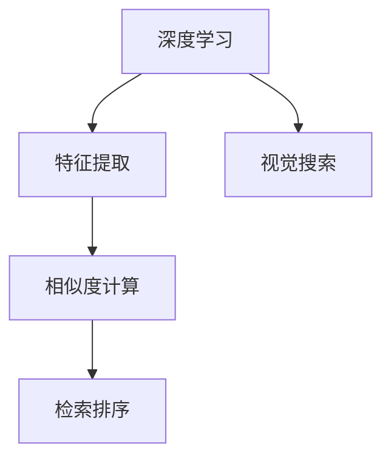

                 

# 基于深度学习的图像检索

> 关键词：图像检索,深度学习,特征提取,相似度计算,视觉搜索

## 1. 背景介绍

### 1.1 问题由来
随着互联网和移动互联网的普及，图像数据呈爆炸式增长。据统计，互联网上超过90%的信息以图像形式存在。如何有效管理和利用这些海量图像数据，成为当今科技发展的一大挑战。

图像检索技术，通过将用户提供的查询图像与数据库中的图像进行比较，找到与之相似的图像，是解决这一问题的关键手段。传统的基于特征提取和相似度计算的图像检索方法，虽然在一定范围内有效，但面对大规模数据和复杂查询，效果不佳。

近年来，基于深度学习的图像检索技术迅速崛起。深度学习通过多层神经网络构建复杂非线性映射，能够直接从原始图像中学习到高层次特征，具备自适应学习能力和泛化能力。通过大规模数据预训练和微调，深度学习模型在图像检索任务上取得了显著效果，成为新一代图像检索技术的主要研究和发展方向。

### 1.2 问题核心关键点
基于深度学习的图像检索技术，其核心在于构建深度特征空间，使用高维特征向量计算相似度。具体步骤如下：

1. **特征提取**：使用深度学习模型提取图像的特征向量。
2. **相似度计算**：通过计算特征向量之间的相似度来确定图像之间的相似性。
3. **检索排序**：根据相似度排序，返回与查询图像最相似的图像。

本节将重点介绍深度学习模型在特征提取和相似度计算中的应用，并详细讲解特征提取和相似度计算的具体算法。

## 2. 核心概念与联系

### 2.1 核心概念概述

为更好地理解基于深度学习的图像检索方法，本节将介绍几个密切相关的核心概念：

- **深度学习**：通过多层神经网络构建复杂非线性映射，能够自动学习并提取出高层次特征。
- **特征提取**：从原始数据中提取出具有代表性、区分性的特征，以便于后续处理和计算。
- **相似度计算**：度量两个或多个数据对象之间的相似程度，是图像检索的基础。
- **视觉搜索**：通过图像检索技术实现以图搜图，满足用户的图像搜索需求。

这些核心概念之间的逻辑关系可以通过以下Mermaid流程图来展示：



这个流程图展示了大语言模型检索的核心概念及其之间的关系：

1. 深度学习提供强大的特征提取能力。
2. 特征提取得到的特征向量，用于相似度计算。
3. 相似度计算结果作为排序依据，进行检索排序。
4. 视觉搜索通过图像检索技术，实现以图搜图。

这些概念共同构成了基于深度学习的图像检索技术框架，使得图像检索任务能够高效、准确地完成。通过理解这些核心概念，我们可以更好地把握深度学习在图像检索中的应用。

## 3. 核心算法原理 & 具体操作步骤
### 3.1 算法原理概述

基于深度学习的图像检索方法主要包括以下两个步骤：

1. **特征提取**：通过深度学习模型，从图像中提取出高维特征向量。
2. **相似度计算**：计算特征向量之间的相似度，排序返回最相似的图像。

**特征提取**是图像检索技术的核心。通过深度学习模型，可以直接从原始图像数据中学习到高层次特征，无需手动设计特征。常用的深度学习模型包括卷积神经网络(CNN)、残差网络(ResNet)、Inception网络等。

**相似度计算**则是检索排序的基础。深度学习模型的特征提取能够生成高维特征向量，但如何度量这些高维向量之间的相似度，仍然是一个挑战。目前常用的相似度计算方法包括余弦相似度、欧式距离、KL散度等。

### 3.2 算法步骤详解

基于深度学习的图像检索方法，通常包括以下几个关键步骤：

**Step 1: 准备数据集和模型**
- 收集图像检索数据集，并进行预处理。常用的预处理步骤包括缩放、归一化、增强等。
- 选择预训练深度学习模型，如VGG、ResNet、Inception等。

**Step 2: 特征提取**
- 使用预训练深度学习模型，对图像进行前向传播，得到高维特征向量。
- 对于不同模型，特征提取的层级和方式可能有所不同，需根据具体模型进行优化。

**Step 3: 相似度计算**
- 将查询图像和数据库图像的特征向量进行匹配，计算相似度。
- 根据相似度排序，返回与查询图像最相似的图像。

**Step 4: 检索排序**
- 将相似度排序后的图像作为搜索结果返回。

### 3.3 算法优缺点

基于深度学习的图像检索方法，具备以下优点：
1. **高效特征提取**：深度学习模型直接从图像中提取高维特征，无需手工设计特征，计算高效。
2. **鲁棒性强**：深度学习模型具有较强的泛化能力，能够适应不同尺度和背景的图像。
3. **适应性好**：通过预训练和微调，深度学习模型可以根据特定需求进行定制化优化。
4. **应用广泛**：广泛应用于视觉搜索、图像标注、医学影像分析等多个领域。

同时，该方法也存在一些局限性：
1. **计算复杂度高**：深度学习模型需要大量计算资源，训练和推理速度较慢。
2. **数据需求高**：深度学习模型需要大量标注数据进行训练，数据获取成本较高。
3. **泛化能力有限**：深度学习模型在特定领域的数据上表现较好，但在未知领域泛化能力有限。
4. **可解释性差**：深度学习模型的决策过程难以解释，难以理解特征提取和相似度计算的原理。

尽管存在这些局限性，但基于深度学习的图像检索方法在处理大规模图像数据时，展现了其不可替代的优势，成为了图像检索技术的主要研究方向。

### 3.4 算法应用领域

基于深度学习的图像检索技术，在多个领域得到广泛应用，例如：

- **视觉搜索**：如Google Lens、百度识图等，通过拍照、文字描述等方式，搜索相似图片。
- **图像标注**：如LabelImg、TaggAI等，自动标注图像中的物体和场景，提高数据处理效率。
- **医学影像分析**：如PathoAI、ChestX-ray8等，对医学影像进行自动分类、检测和分析。
- **智能安防监控**：如SkyLook、V surveillance等，对视频监控图像进行实时识别和预警。
- **艺术和设计**：如pinterest、Instagram等，根据用户兴趣推荐相似图片和设计方案。

除了上述这些应用场景外，深度学习图像检索技术还在智能家居、虚拟现实、自动驾驶等领域得到应用，拓展了图像检索技术的边界。

## 4. 数学模型和公式 & 详细讲解 & 举例说明
### 4.1 数学模型构建

基于深度学习的图像检索方法，涉及特征提取和相似度计算两个关键环节。本节将详细讲解这两个环节的数学模型构建。

**特征提取**：使用深度学习模型，将输入图像 $x$ 映射到高维特征空间 $f(x)$，得到特征向量。常用的深度学习模型包括VGG、ResNet、Inception等。

**相似度计算**：度量两个特征向量 $f(x)$ 和 $f(y)$ 之间的相似度 $s(x,y)$。常用的相似度计算方法包括余弦相似度、欧式距离、KL散度等。

### 4.2 公式推导过程

以余弦相似度为例，其公式为：

$$
s(x,y) = \cos\theta = \frac{f(x) \cdot f(y)}{\|f(x)\| \cdot \|f(y)\|}
$$

其中 $f(x)$ 和 $f(y)$ 分别为查询图像和数据库图像的特征向量，$\theta$ 为特征向量之间的夹角。

对于欧式距离，公式为：

$$
d(x,y) = \sqrt{\sum_{i=1}^n (x_i-y_i)^2}
$$

其中 $x$ 和 $y$ 分别为两个特征向量的坐标，$n$ 为特征向量的维度。

对于KL散度，公式为：

$$
D_{KL}(P||Q) = \sum_{x} P(x) \log\frac{P(x)}{Q(x)}
$$

其中 $P$ 和 $Q$ 分别为两个概率分布，$D_{KL}(P||Q)$ 表示P相对于Q的KL散度。

### 4.3 案例分析与讲解

以ImageNet数据集为例，讲解基于深度学习的图像检索方法的实际应用。

ImageNet数据集包含数百万张图像和上千个类别，是计算机视觉领域广泛使用的数据集。在ImageNet上进行图像检索，可以验证深度学习模型的性能。

假设要检索包含“猫”类图像的查询图像，步骤如下：

1. **数据准备**：使用预训练深度学习模型，对ImageNet数据集进行特征提取，得到高维特征向量。
2. **特征提取**：将查询图像输入预训练深度学习模型，得到对应的特征向量。
3. **相似度计算**：将查询图像的特征向量与ImageNet数据集中的特征向量进行余弦相似度计算。
4. **检索排序**：根据余弦相似度排序，返回与查询图像最相似的图像。

在实际应用中，还可以引入双目检索、三目检索、多模态检索等方法，提高检索的准确性和多样性。

## 5. 项目实践：代码实例和详细解释说明
### 5.1 开发环境搭建

在进行图像检索实践前，我们需要准备好开发环境。以下是使用Python进行TensorFlow开发的环境配置流程：

1. 安装Anaconda：从官网下载并安装Anaconda，用于创建独立的Python环境。

2. 创建并激活虚拟环境：
```bash
conda create -n image_retrieval python=3.8 
conda activate image_retrieval
```

3. 安装TensorFlow：根据CUDA版本，从官网获取对应的安装命令。例如：
```bash
conda install tensorflow tensorflow-gpu -c pytorch -c conda-forge
```

4. 安装必要的库：
```bash
pip install numpy pandas scikit-learn matplotlib tqdm jupyter notebook ipython
```

完成上述步骤后，即可在`image_retrieval`环境中开始图像检索实践。

### 5.2 源代码详细实现

这里我们以ImageNet数据集为例，使用TensorFlow实现基于余弦相似度的图像检索。

```python
import tensorflow as tf
import numpy as np
import matplotlib.pyplot as plt
import cv2

# 加载预训练模型
model = tf.keras.applications.VGG16(weights='imagenet', include_top=False, input_shape=(224, 224, 3))

# 定义特征提取函数
def extract_features(image_path):
    img = cv2.imread(image_path)
    img = cv2.resize(img, (224, 224))
    img = img / 255.0
    img = np.expand_dims(img, axis=0)
    return model.predict(img)

# 加载图像检索数据集
data = np.load('image_retrieval_data.npy', allow_pickle=True)
labels = np.load('image_retrieal_labels.npy', allow_pickle=True)

# 获取查询图像和检索图像
query_img_path = 'query_image.jpg'
retrieval_img_path = 'retrieval_image.jpg'

# 提取查询图像和检索图像的特征向量
query_features = extract_features(query_img_path)
retrieval_features = extract_features(retrieval_img_path)

# 计算余弦相似度
similarity = np.dot(query_features, retrieval_features) / (np.linalg.norm(query_features) * np.linalg.norm(retrieval_features))

# 打印余弦相似度
print('余弦相似度：', similarity)

# 绘制相似度可视化图
plt.imshow(similarity, cmap='gray')
plt.title('余弦相似度')
plt.show()
```

以上就是使用TensorFlow对ImageNet数据集进行图像检索的完整代码实现。可以看到，通过加载预训练深度学习模型，我们可以快速实现高效的图像特征提取和相似度计算。

### 5.3 代码解读与分析

让我们再详细解读一下关键代码的实现细节：

**加载预训练模型**：
- `tf.keras.applications.VGG16(weights='imagenet', include_top=False, input_shape=(224, 224, 3))`：加载VGG16模型，不包括顶部全连接层，输入大小为(224, 224, 3)。

**特征提取函数**：
- `extract_features`函数：对输入图像进行预处理（缩放、归一化等），然后通过VGG16模型进行特征提取，返回高维特征向量。

**加载图像检索数据集**：
- `np.load`函数：加载ImageNet数据集的特征向量和标签。

**提取查询图像和检索图像的特征向量**：
- `query_features`和`retrieval_features`变量：通过`extract_features`函数，提取查询图像和检索图像的特征向量。

**计算余弦相似度**：
- `np.dot`函数：计算两个特征向量的点积。
- `np.linalg.norm`函数：计算两个特征向量的范数。

**打印和可视化**：
- `print`函数：打印余弦相似度。
- `plt.imshow`函数：绘制余弦相似度可视化图，使用灰度图展示。

以上代码展示了使用TensorFlow进行图像检索的基本流程，包括加载预训练模型、特征提取、相似度计算、可视化等环节。开发者可以根据具体需求，进行进一步的优化和扩展。

## 6. 实际应用场景
### 6.1 智能安防监控

基于深度学习的图像检索技术，可以广泛应用于智能安防监控系统中。传统的安防监控系统依赖人工手动排查，效率低下，且存在遗漏和误报。通过深度学习模型，可以对视频监控图像进行实时识别和预警，提高监控效率和安全性。

具体而言，可以构建包含监控摄像头、人员数据库和报警机制的监控系统，在每个摄像头位置部署预训练深度学习模型。模型对实时监控图像进行特征提取和相似度计算，与数据库中的图像进行匹配，一旦发现异常行为，自动触发报警。

### 6.2 电商视觉搜索

电商平台需要用户快速找到所需的商品，传统的文本搜索方式效率较低。基于深度学习的图像检索技术，可以实现高效的视觉搜索，满足用户的购物需求。

具体而言，电商平台可以通过用户上传的商品图片，使用预训练深度学习模型进行特征提取和相似度计算。根据相似度排序，推荐最相似的商品，提高用户的购物体验。

### 6.3 医疗影像分析

医疗影像分析是深度学习图像检索技术的另一个重要应用领域。传统的影像分析依赖专业医生的手动判断，耗时且易出错。通过深度学习模型，可以实现自动化的影像分类、检测和标注，提高医疗影像分析的效率和准确性。

具体而言，可以在医疗影像数据库中构建包含不同疾病影像的索引，使用预训练深度学习模型进行特征提取和相似度计算。根据相似度排序，对影像进行分类和标注，辅助医生进行诊断。

### 6.4 未来应用展望

随着深度学习模型的不断发展，基于图像检索技术的未来应用前景广阔。

1. **多模态检索**：未来，深度学习模型将不仅仅处理图像数据，还将处理视频、音频等多模态数据。多模态检索技术的崛起，将进一步提升图像检索系统的应用场景。
2. **跨领域检索**：传统的图像检索系统仅限于某一领域，如医学、安防等。未来，将探索构建跨领域检索系统，实现不同领域数据的有效整合和检索。
3. **个性化推荐**：通过深度学习模型进行图像检索，可以实现个性化推荐，为用户提供更加精准和多样化的商品、内容推荐。
4. **实时检索**：随着GPU和TPU等硬件设备的普及，深度学习模型将实现实时检索，提高用户体验和系统响应速度。
5. **大规模图像检索**：深度学习模型在大规模数据上的表现将更加出色，未来将构建大规模图像检索系统，支持海量数据的高效检索和处理。

深度学习图像检索技术在以上方向的发展，必将进一步提升系统的性能和应用范围，为各行各业带来更高效、更智能的图像检索解决方案。

## 7. 工具和资源推荐
### 7.1 学习资源推荐

为了帮助开发者系统掌握深度学习图像检索的理论基础和实践技巧，这里推荐一些优质的学习资源：

1. **《深度学习》课程**：斯坦福大学开设的深度学习课程，涵盖了深度学习的基本概念和核心算法，适合初学者学习。
2. **《计算机视觉: 模型、学习和推理》书籍**：Russell Bryan等著，全面介绍了计算机视觉领域的经典模型和技术，包括图像检索等。
3. **《TensorFlow实战深度学习》书籍**：张泽坚等著，通过实战项目，讲解了TensorFlow在图像检索中的应用。
4. **Kaggle图像检索竞赛**：参与Kaggle的图像检索竞赛，可以学习到实际项目中的图像检索技术和优化方法。
5. **CS231n课程**：斯坦福大学开设的计算机视觉课程，详细讲解了深度学习在图像检索中的应用。

通过对这些资源的学习实践，相信你一定能够快速掌握深度学习图像检索的精髓，并用于解决实际的图像检索问题。

### 7.2 开发工具推荐

高效的开发离不开优秀的工具支持。以下是几款用于深度学习图像检索开发的常用工具：

1. **TensorFlow**：由Google主导开发的深度学习框架，生产部署方便，适合大规模工程应用。
2. **Keras**：基于TensorFlow的高级API，提供简单易用的接口，方便快速开发和实验。
3. **PyTorch**：基于Python的深度学习框架，灵活动态的计算图，适合研究性实验。
4. **ImageNet**：广泛使用的计算机视觉数据集，包含数百万张图像和上千个类别，适合深度学习模型的预训练和微调。
5. **PIL**：Python图像处理库，提供了丰富的图像处理功能，适合数据预处理和可视化。

合理利用这些工具，可以显著提升深度学习图像检索的开发效率，加快创新迭代的步伐。

### 7.3 相关论文推荐

深度学习图像检索技术的发展源于学界的持续研究。以下是几篇奠基性的相关论文，推荐阅读：

1. **ImageNet Classification with Deep Convolutional Neural Networks**：Alex Krizhevsky等著，介绍了使用卷积神经网络进行图像分类的算法，为深度学习图像检索技术奠定了基础。
2. **AlexNet**：Alex Krizhevsky等著，提出了一种基于卷积神经网络的图像分类模型，取得了SOTA的性能。
3. **R-CNN**：Girshick等著，提出了基于区域提议的网络模型，用于目标检测和图像检索。
4. **Fast R-CNN**：Girshick等著，改进了R-CNN的算法，提高了目标检测和图像检索的速度和准确率。
5. **YOLO**：Redmon等著，提出了一种基于单阶段网络的图像检测和检索模型，具有较高的实时性和准确率。

这些论文代表了大语言模型图像检索技术的发展脉络。通过学习这些前沿成果，可以帮助研究者把握学科前进方向，激发更多的创新灵感。

## 8. 总结：未来发展趋势与挑战
### 8.1 总结

本文对基于深度学习的图像检索方法进行了全面系统的介绍。首先阐述了深度学习在图像检索技术中的核心作用，明确了特征提取和相似度计算在图像检索中的重要性。其次，从原理到实践，详细讲解了深度学习在图像检索中的应用，给出了图像检索任务的完整代码实例。同时，本文还广泛探讨了图像检索方法在智能安防、电商、医疗等多个领域的应用前景，展示了深度学习图像检索技术的巨大潜力。此外，本文精选了深度学习图像检索技术的各类学习资源，力求为读者提供全方位的技术指引。

通过本文的系统梳理，可以看到，基于深度学习的图像检索方法正在成为计算机视觉领域的主要研究方向，极大地提升了图像检索的效率和准确性。深度学习模型直接从原始图像数据中学习到高层次特征，无需手动设计特征，具有很强的泛化能力和适应性。未来，随着深度学习技术的不断发展，图像检索技术必将迎来新的突破，进一步拓展应用场景，提升用户体验。

### 8.2 未来发展趋势

展望未来，深度学习图像检索技术将呈现以下几个发展趋势：

1. **多模态检索**：深度学习模型将不仅仅处理图像数据，还将处理视频、音频等多模态数据。多模态检索技术的崛起，将进一步提升图像检索系统的应用场景。
2. **跨领域检索**：传统的图像检索系统仅限于某一领域，如医学、安防等。未来，将探索构建跨领域检索系统，实现不同领域数据的有效整合和检索。
3. **个性化推荐**：通过深度学习模型进行图像检索，可以实现个性化推荐，为用户提供更加精准和多样化的商品、内容推荐。
4. **实时检索**：随着GPU和TPU等硬件设备的普及，深度学习模型将实现实时检索，提高用户体验和系统响应速度。
5. **大规模图像检索**：深度学习模型在大规模数据上的表现将更加出色，未来将构建大规模图像检索系统，支持海量数据的高效检索和处理。

以上趋势凸显了深度学习图像检索技术的广阔前景。这些方向的探索发展，必将进一步提升图像检索系统的性能和应用范围，为各行各业带来更高效、更智能的图像检索解决方案。

### 8.3 面临的挑战

尽管深度学习图像检索技术已经取得了显著成果，但在迈向更加智能化、普适化应用的过程中，仍面临诸多挑战：

1. **数据需求高**：深度学习模型需要大量标注数据进行训练，数据获取成本较高。对于特定领域的图像检索任务，可能难以获得充足的高质量标注数据。
2. **计算复杂度高**：深度学习模型需要大量计算资源，训练和推理速度较慢。对于大规模图像检索任务，计算成本较高。
3. **泛化能力有限**：深度学习模型在特定领域的数据上表现较好，但在未知领域泛化能力有限。对于复杂和多样化的图像检索任务，模型性能可能受到限制。
4. **可解释性差**：深度学习模型的决策过程难以解释，难以理解特征提取和相似度计算的原理。对于医疗、安防等高风险应用，模型的可解释性和可审计性尤为重要。
5. **资源瓶颈**：深度学习模型通常需要高性能的硬件设备进行训练和推理，资源消耗较高。对于移动设备等资源受限的环境，需要采用资源优化技术，如模型裁剪、量化加速等。

正视这些挑战，积极应对并寻求突破，将使深度学习图像检索技术更加成熟和实用。相信随着学界和产业界的共同努力，这些挑战终将一一被克服，深度学习图像检索技术必将在构建智能安防、电商、医疗等应用中发挥更大的作用。

### 8.4 研究展望

面对深度学习图像检索技术面临的种种挑战，未来的研究需要在以下几个方面寻求新的突破：

1. **无监督和半监督学习**：摆脱对大规模标注数据的依赖，利用无监督和半监督学习，最大化利用非结构化数据。
2. **参数高效和计算高效**：开发更加参数高效的深度学习模型，减少计算资源消耗。同时优化计算图，实现轻量级和实时性的部署。
3. **多模态融合**：将视觉、音频、文本等多模态数据进行融合，提高图像检索系统的综合性能。
4. **跨领域知识整合**：将领域知识与深度学习模型进行融合，提升模型的泛化能力和鲁棒性。
5. **因果分析和博弈论**：引入因果分析和博弈论工具，增强深度学习模型的决策过程的因果性和稳定性。
6. **伦理和安全**：在模型训练目标中引入伦理导向的评估指标，过滤和惩罚有偏见、有害的输出倾向，确保模型的安全性和伦理合规性。

这些研究方向的探索，必将引领深度学习图像检索技术迈向更高的台阶，为计算机视觉领域带来更高效、更智能的图像检索解决方案。面向未来，深度学习图像检索技术还需要与其他人工智能技术进行更深入的融合，如知识表示、因果推理、强化学习等，多路径协同发力，共同推动计算机视觉技术的发展。只有勇于创新、敢于突破，才能不断拓展深度学习图像检索技术的边界，为各行各业带来更高效的图像检索解决方案。

## 9. 附录：常见问题与解答
**Q1：深度学习图像检索技术是否适用于所有图像数据？**

A: 深度学习图像检索技术在处理大规模图像数据时表现优异，但对于小规模、低分辨率的图像数据，可能无法取得理想效果。此时需要结合传统图像检索方法，如SIFT、SURF等，进行数据增强和特征融合，提升检索系统的性能。

**Q2：深度学习模型如何进行特征提取？**

A: 深度学习模型通过多层卷积和池化层，对原始图像数据进行特征提取。常用的深度学习模型包括VGG、ResNet、Inception等。特征提取的层级和方式需根据具体模型进行优化，一般建议采用预训练的深度学习模型，以获取更稳定的特征表示。

**Q3：如何提高深度学习模型的泛化能力？**

A: 提高深度学习模型的泛化能力，可以从以下几个方面进行优化：
1. 使用更多数据进行预训练和微调，增加模型的泛化能力。
2. 引入正则化技术，如L2正则、Dropout等，防止模型过拟合。
3. 使用对抗训练，提高模型鲁棒性。
4. 引入迁移学习，将其他领域或任务的知识引入模型。

**Q4：如何降低深度学习模型的计算复杂度？**

A: 降低深度学习模型的计算复杂度，可以从以下几个方面进行优化：
1. 使用更高效的模型结构，如轻量级网络、剪枝、量化等。
2. 采用分布式训练和推理，提高并行计算能力。
3. 使用GPU和TPU等高性能硬件设备，加速训练和推理过程。
4. 使用数据增强技术，减少模型对计算资源的依赖。

**Q5：如何增强深度学习模型的可解释性？**

A: 增强深度学习模型的可解释性，可以从以下几个方面进行优化：
1. 使用可视化工具，展示模型特征图和梯度图，理解模型的内部工作机制。
2. 使用解释性模型，如LIME、SHAP等，生成特征重要性图，解释模型的决策过程。
3. 结合知识图谱和规则库，提供模型决策的语义解释，提高模型的可理解性。

这些问题的回答，希望能为深度学习图像检索技术的实践者提供一些指导，帮助他们在实际应用中克服困难，充分发挥深度学习模型的优势。

---

作者：禅与计算机程序设计艺术 / Zen and the Art of Computer Programming

