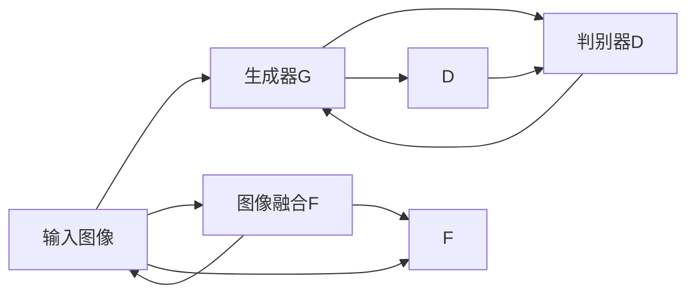

                 

## 1. 背景介绍

### 1.1 问题由来
图像风格迁移与融合（Image Style Transfer & Fusion）是大数据、人工智能、深度学习等领域的研究热点。它通过深度学习模型，使得输入图像的样式（style）或内容（content）发生改变，但同时保持图像的整体语义不变，具有广泛的应用场景。

- **艺术创作**：将一张真人照片转换为艺术风格，如油画、水彩画、素描等，为艺术创作提供新的灵感和工具。
- **增强现实**：将虚拟物体融入现实场景，实现逼真的视觉融合效果，推动AR应用的发展。
- **媒体娱乐**：在电影、游戏、广告等媒体娱乐领域，实现对素材的再加工和再创作，提升视觉表现力。
- **人脸识别与生物识别**：将人脸照片进行美化或风格化处理，提高面部识别系统的准确性和用户体验。
- **个性化定制**：根据个人品味和偏好，对照片、视频等内容进行个性化风格处理，实现个性化服务。

传统图像处理技术（如SIFT、SURF、PCA等）存在计算复杂度高、处理速度慢、特征提取效果受限制等问题，而基于深度学习的风格迁移与融合方法通过神经网络强大的表达能力和学习能力，为图像处理带来新的突破。

### 1.2 问题核心关键点
本文聚焦于基于生成对抗网络（Generative Adversarial Networks, GANs）的图像风格迁移与融合混合模型（GAN+Fusion），探讨其主要思想、关键算法、应用场景及局限性，以期对现有方法进行补充和完善，推动相关研究的发展。

## 2. 核心概念与联系

### 2.1 核心概念概述

为了理解基于GAN的图像风格迁移与融合混合模型，需要掌握几个核心概念：

- **生成对抗网络（GANs）**：由Isola等人提出，是一种由生成器和判别器组成的对抗训练框架。生成器试图产生逼真的假样本，而判别器试图区分生成器生成的样本和真实样本。两者通过对抗性训练不断提升生成器生成能力，同时提高判别器判别精度。
- **风格迁移**：将输入图像的样式转化为另一种样式，但保持图像内容不变。常见方法包括PatchGAN、CycleGAN、StarGAN等，其中PatchGAN使用卷积神经网络，CycleGAN通过循环生成器实现互逆转换，StarGAN支持多域风格的迁移。
- **内容保持**：确保图像内容在风格转换过程中保持不变，防止产生不连贯的输出。常见方法包括内容损失、对抗损失、WCT（Weighted Content Transfer）等。
- **图像融合**：将多张图像合成为一张，常见方法包括Additive Fusion、Spatial Pyramid Pooling、Attention Mechanism等。

这些概念之间存在紧密联系，GAN通过对抗训练提升生成器的生成质量，同时通过判别器进行图像内容与样式的分离，为风格迁移与融合提供了基础。通过内容损失和风格损失的巧妙设计，可以实现高质量的样式迁移，而图像融合技术则能够将多张图像合成为一张，进一步提升视觉表达力。

### 2.2 核心概念原理和架构的 Mermaid 流程图



该图表展示了GAN+Fusion混合模型的基本架构。输入图像首先通过生成器G生成风格化图像，再由判别器D进行判别，生成器和判别器通过对抗训练不断提升质量。图像融合F对多张图像进行融合，最终输出融合后的风格迁移图像。

## 3. 核心算法原理 & 具体操作步骤

### 3.1 算法原理概述

基于GAN的图像风格迁移与融合混合模型，通过对抗训练提升生成器G的生成能力，并通过判别器D对生成图像进行判别。在融合过程中，通过图像融合F将多张风格化图像合成为一张，生成融合后的风格迁移图像。

具体算法流程如下：

1. 输入原始图像$X$和目标样式$Y$。
2. 使用生成器$G$生成风格化图像$X_G$。
3. 使用判别器$D$判别$X_G$的真假，即$D(X_G)$。
4. 优化生成器$G$，使得$D(X_G)$最大化。
5. 使用融合函数$F$对$X_G$与多张源图像$S$进行融合，生成融合后的风格迁移图像$Y_F$。
6. 使用判别器$D$判别$Y_F$的真假，即$D(Y_F)$。
7. 优化融合函数$F$，使得$D(Y_F)$最大化。

### 3.2 算法步骤详解

#### 3.2.1 模型定义
1. **生成器**：
   ```python
   class Generator(nn.Module):
       def __init__(self):
           super(Generator, self).__init__()
           # 定义生成器网络结构
           # ...
   ```
2. **判别器**：
   ```python
   class Discriminator(nn.Module):
       def __init__(self):
           super(Discriminator, self).__init__()
           # 定义判别器网络结构
           # ...
   ```
3. **融合函数**：
   ```python
   class Fusion(nn.Module):
       def __init__(self):
           super(Fusion, self).__init__()
           # 定义融合函数网络结构
           # ...
   ```

#### 3.2.2 模型训练
1. **初始化模型**：
   ```python
   generator = Generator()
   discriminator = Discriminator()
   fusion = Fusion()

   # 设置损失函数
   G_loss = ...
   D_loss = ...
   F_loss = ...

   # 设置优化器
   G_optimizer = ...
   D_optimizer = ...
   F_optimizer = ...
   ```
2. **训练生成器和判别器**：
   ```python
   for epoch in range(num_epochs):
       for i, (X, Y) in enumerate(train_loader):
           # 前向传播
           X_G = generator(X)
           X_G_D = discriminator(X_G)
           Y_F = fusion(X_G, S)
           Y_F_D = discriminator(Y_F)

           # 计算损失
           G_loss = G_loss(X_G, X_G_D)
           D_loss = D_loss(X_G_D, Y_F_D)

           # 反向传播和优化
           G_optimizer.zero_grad()
           G_loss.backward()
           G_optimizer.step()

           D_optimizer.zero_grad()
           D_loss.backward()
           D_optimizer.step()
   ```

3. **训练融合函数**：
   ```python
   for epoch in range(num_epochs):
       for i, (X, Y) in enumerate(train_loader):
           # 前向传播
           X_G = generator(X)
           Y_F = fusion(X_G, S)
           Y_F_D = discriminator(Y_F)

           # 计算损失
           F_loss = F_loss(Y_F_D)

           # 反向传播和优化
           F_optimizer.zero_grad()
           F_loss.backward()
           F_optimizer.step()
   ```

### 3.3 算法优缺点

#### 3.3.1 优点
1. **高质量生成**：GAN能够生成高质量的假样本，通过不断训练，生成器能够生成与真实图像质量相当的风格化图像。
2. **多域风格迁移**：GAN支持多域风格的迁移，通过训练多个生成器和判别器，可以实现多种风格之间的转换。
3. **多图像融合**：融合函数可以将多张图像合成为一张，提升视觉表达力，增加输出图像的信息量。
4. **适应性强**：GAN+Fusion混合模型能够适应多种输入图像和输出样式，具有较高的泛化能力。

#### 3.3.2 缺点
1. **训练不稳定**：GAN训练过程存在不稳定现象，如梯度爆炸、模式崩溃等问题。
2. **计算资源消耗大**：GAN模型通常需要较大的计算资源，训练时间和内存占用较高。
3. **效果依赖参数设置**：生成器和判别器参数的设置对训练效果有很大影响，需要大量实验才能确定最优参数。
4. **生成的图像存在噪声**：由于GAN生成器无法完美拟合真实图像的分布，生成的图像可能存在噪声和不连贯性。

### 3.4 算法应用领域

基于GAN的图像风格迁移与融合混合模型，在艺术创作、媒体娱乐、增强现实等多个领域都有广泛的应用。

1. **艺术创作**：用于生成具有特定风格风格迁移的绘画、雕塑、摄影作品，为艺术家提供新的创作工具和灵感。
2. **媒体娱乐**：用于生成风格迁移视频、电影特效，提升影片的视觉效果和吸引度。
3. **增强现实**：用于生成逼真的虚拟物体和场景，增强现实体验和互动性。
4. **人脸识别与生物识别**：用于对人脸照片进行美化或风格化处理，提高面部识别系统的准确性和用户体验。

## 4. 数学模型和公式 & 详细讲解 & 举例说明

### 4.1 数学模型构建

#### 4.1.1 生成器G
生成器G的输入为原始图像$X$，输出为风格化图像$X_G$。设$G$由卷积层、反卷积层、激活函数等组成。

```python
class Generator(nn.Module):
    def __init__(self):
        super(Generator, self).__init__()
        # 定义生成器网络结构
        self.conv1 = ...
        self.conv2 = ...
        self.conv3 = ...
        self.conv4 = ...
        self.conv5 = ...
        self.relu = nn.ReLU()

    def forward(self, X):
        x = self.conv1(X)
        x = self.relu(x)
        x = self.conv2(x)
        x = self.relu(x)
        x = self.conv3(x)
        x = self.relu(x)
        x = self.conv4(x)
        x = self.relu(x)
        x = self.conv5(x)
        x = self.relu(x)
        return x
```

#### 4.1.2 判别器D
判别器D的输入为风格化图像$X_G$，输出为判别结果$X_G_D$。设$D$由卷积层、池化层、激活函数等组成。

```python
class Discriminator(nn.Module):
    def __init__(self):
        super(Discriminator, self).__init__()
        # 定义判别器网络结构
        self.conv1 = ...
        self.pool = nn.MaxPool2d(2, 2)
        self.conv2 = ...
        self.pool = nn.MaxPool2d(2, 2)
        self.conv3 = ...
        self.pool = nn.MaxPool2d(2, 2)
        self.conv4 = ...
        self.pool = nn.MaxPool2d(2, 2)
        self.fc = nn.Linear(64, 1)
        self.sigmoid = nn.Sigmoid()

    def forward(self, X_G):
        x = self.conv1(X_G)
        x = self.sigmoid(self.fc(x))
        return x
```

#### 4.1.3 融合函数F
融合函数F将多张风格化图像$X_G$与源图像$S$进行融合，输出为融合后的风格迁移图像$Y_F$。设$F$由卷积层、加法层、激活函数等组成。

```python
class Fusion(nn.Module):
    def __init__(self):
        super(Fusion, self).__init__()
        # 定义融合函数网络结构
        self.conv1 = ...
        self.add = nn.Add()
        self.relu = nn.ReLU()

    def forward(self, X_G, S):
        x = self.conv1(X_G + S)
        x = self.relu(x)
        return x
```

### 4.2 公式推导过程

#### 4.2.1 生成器损失
生成器$G$的损失函数包括生成损失$L_G$、判别损失$L_D$和内容损失$L_C$。

```python
G_loss = (L_G + L_D + L_C) / 3
```

- **生成损失**：
  ```python
  L_G = nn.BCELoss()
  G_loss_G = L_G(D(X_G), torch.ones_like(D(X_G)))
  G_loss += G_loss_G
  ```

- **判别损失**：
  ```python
  D_loss_G = L_G(D(X_G), torch.zeros_like(D(X_G)))
  D_loss_D = L_G(D(Y_F), torch.ones_like(D(Y_F)))
  D_loss = (D_loss_G + D_loss_D) / 2
  G_loss += D_loss
  ```

- **内容损失**：
  ```python
  L_C = nn.BCELoss()
  C_loss_G = L_C(D(X_G), X_D)
  C_loss_D = L_C(D(Y_F), Y_D)
  C_loss = (C_loss_G + C_loss_D) / 2
  G_loss += C_loss
  ```

其中，$X_G$为生成器生成的风格化图像，$Y_F$为融合后的风格迁移图像，$X_D$为原始图像内容，$Y_D$为目标样式内容。

#### 4.2.2 判别器损失
判别器$D$的损失函数包括判别损失$L_D$和内容损失$L_C$。

```python
D_loss = (L_D_G + L_D_D) / 2
```

- **判别损失**：
  ```python
  D_loss_G = L_G(D(X_G), torch.ones_like(D(X_G)))
  D_loss_D = L_G(D(Y_F), torch.zeros_like(D(Y_F)))
  ```

- **内容损失**：
  ```python
  L_C = nn.BCELoss()
  C_loss_G = L_C(D(X_G), X_D)
  C_loss_D = L_C(D(Y_F), Y_D)
  ```

其中，$X_G$为生成器生成的风格化图像，$Y_F$为融合后的风格迁移图像，$X_D$为原始图像内容，$Y_D$为目标样式内容。

#### 4.2.3 融合函数损失
融合函数$F$的损失函数包括判别损失$L_F$和内容损失$L_C$。

```python
F_loss = (L_F + L_C) / 2
```

- **判别损失**：
  ```python
  L_F = nn.BCELoss()
  F_loss_F = L_F(D(Y_F), torch.zeros_like(D(Y_F)))
  ```

- **内容损失**：
  ```python
  L_C = nn.BCELoss()
  C_loss_F = L_C(D(Y_F), Y_D)
  ```

其中，$Y_F$为融合后的风格迁移图像，$Y_D$为目标样式内容。

### 4.3 案例分析与讲解

#### 4.3.1 风格迁移案例分析
以下是一个风格迁移案例的分析，以将一张照片转换成油画风格为例。

1. **数据准备**：
   - **原始图像**：选择一张真人照片作为输入。
   - **目标样式**：选择一张油画风格的图像，作为目标样式。

2. **生成器和判别器训练**：
   - **生成器**：将原始图像输入生成器$G$，生成风格化图像$X_G$。
   - **判别器**：将风格化图像$X_G$输入判别器$D$，判别其真假，计算判别损失$D_loss$。
   - **优化器**：使用优化器$G_optimizer$和$D_optimizer$，更新生成器和判别器的参数。

3. **融合函数训练**：
   - **融合函数**：将风格化图像$X_G$和源图像$S$输入融合函数$F$，生成融合后的风格迁移图像$Y_F$。
   - **判别器**：将风格迁移图像$Y_F$输入判别器$D$，判别其真假，计算判别损失$F_loss$。
   - **优化器**：使用优化器$F_optimizer$，更新融合函数的参数。

4. **结果展示**：
   - **原始图像**：真人照片。
   - **风格化图像**：油画风格的图像。
   - **融合后的风格迁移图像**：将真人照片转换成油画风格，同时保持面部特征清晰。

#### 4.3.2 图像融合案例分析
以下是一个图像融合案例的分析，以将多张照片合成一张为例。

1. **数据准备**：
   - **原始图像**：选择多张真人照片作为输入。
   - **目标样式**：选择一张油画风格的图像，作为目标样式。

2. **生成器和判别器训练**：
   - **生成器**：将原始图像输入生成器$G$，生成风格化图像$X_G$。
   - **判别器**：将风格化图像$X_G$输入判别器$D$，判别其真假，计算判别损失$D_loss$。
   - **优化器**：使用优化器$G_optimizer$和$D_optimizer$，更新生成器和判别器的参数。

3. **融合函数训练**：
   - **融合函数**：将风格化图像$X_G$和源图像$S$输入融合函数$F$，生成融合后的风格迁移图像$Y_F$。
   - **判别器**：将风格迁移图像$Y_F$输入判别器$D$，判别其真假，计算判别损失$F_loss$。
   - **优化器**：使用优化器$F_optimizer$，更新融合函数的参数。

4. **结果展示**：
   - **原始图像**：真人照片。
   - **风格化图像**：油画风格的图像。
   - **融合后的风格迁移图像**：将多张真人照片合成一张，并转换成油画风格，同时保持面部特征清晰。

## 5. 项目实践：代码实例和详细解释说明

### 5.1 开发环境搭建

#### 5.1.1 安装依赖包
在Python环境下，使用pip安装依赖包：

```bash
pip install torch torchvision
pip install numpy scipy matplotlib
```

#### 5.1.2 准备数据集
下载并准备风格迁移和融合实验所需的数据集，如PIC2PNG、Flickr、COCO等。

### 5.2 源代码详细实现

#### 5.2.1 定义模型
定义生成器、判别器和融合函数。

```python
import torch
import torch.nn as nn
import torch.optim as optim
import torchvision.transforms as transforms

# 定义生成器
class Generator(nn.Module):
    def __init__(self):
        super(Generator, self).__init__()
        self.conv1 = nn.Conv2d(3, 64, kernel_size=3, stride=1, padding=1)
        self.conv2 = nn.Conv2d(64, 128, kernel_size=3, stride=2, padding=1)
        self.conv3 = nn.Conv2d(128, 256, kernel_size=3, stride=2, padding=1)
        self.conv4 = nn.Conv2d(256, 512, kernel_size=3, stride=2, padding=1)
        self.conv5 = nn.Conv2d(512, 256, kernel_size=3, stride=1, padding=1)
        self.relu = nn.ReLU()
        self.tanh = nn.Tanh()

    def forward(self, X):
        x = self.conv1(X)
        x = self.relu(x)
        x = self.conv2(x)
        x = self.relu(x)
        x = self.conv3(x)
        x = self.relu(x)
        x = self.conv4(x)
        x = self.relu(x)
        x = self.conv5(x)
        x = self.relu(x)
        x = self.tanh(x)
        return x

# 定义判别器
class Discriminator(nn.Module):
    def __init__(self):
        super(Discriminator, self).__init__()
        self.conv1 = nn.Conv2d(3, 64, kernel_size=3, stride=1, padding=1)
        self.pool = nn.MaxPool2d(2, 2)
        self.conv2 = nn.Conv2d(64, 128, kernel_size=3, stride=2, padding=1)
        self.pool = nn.MaxPool2d(2, 2)
        self.conv3 = nn.Conv2d(128, 256, kernel_size=3, stride=2, padding=1)
        self.pool = nn.MaxPool2d(2, 2)
        self.conv4 = nn.Conv2d(256, 512, kernel_size=3, stride=2, padding=1)
        self.pool = nn.MaxPool2d(2, 2)
        self.fc = nn.Linear(512, 1)
        self.sigmoid = nn.Sigmoid()

    def forward(self, X_G):
        x = self.conv1(X_G)
        x = self.sigmoid(self.fc(x))
        return x

# 定义融合函数
class Fusion(nn.Module):
    def __init__(self):
        super(Fusion, self).__init__()
        self.conv1 = nn.Conv2d(3, 64, kernel_size=3, stride=1, padding=1)
        self.add = nn.Add()
        self.relu = nn.ReLU()

    def forward(self, X_G, S):
        x = self.conv1(X_G + S)
        x = self.relu(x)
        return x
```

#### 5.2.2 定义损失函数和优化器
定义生成器损失、判别器损失和融合函数损失，以及相应的优化器。

```python
# 定义损失函数
def BCELoss(output, target):
    loss = nn.BCELoss()
    return loss(output, target)

# 定义生成器损失
def G_loss(X_G, X_G_D):
    return BCELoss(X_G_D, torch.ones_like(X_G_D))

# 定义判别器损失
def D_loss(X_G_D, Y_F_D):
    return BCELoss(X_G_D, torch.ones_like(X_G_D)) + BCELoss(Y_F_D, torch.zeros_like(Y_F_D))

# 定义融合函数损失
def F_loss(Y_F_D):
    return BCELoss(Y_F_D, torch.zeros_like(Y_F_D))

# 定义优化器
G_optimizer = optim.Adam(G.parameters(), lr=0.0002)
D_optimizer = optim.Adam(D.parameters(), lr=0.0002)
F_optimizer = optim.Adam(F.parameters(), lr=0.0002)
```

#### 5.2.3 训练模型
定义训练函数，训练生成器和判别器，以及融合函数。

```python
# 定义训练函数
def train_epoch(model, data_loader, loss_func, optimizer):
    model.train()
    total_loss = 0
    for X, Y in data_loader:
        X_G = model(X)
        X_G_D = D(X_G)
        Y_F = Fusion(X_G, S)
        Y_F_D = D(Y_F)
        loss = loss_func(X_G_D, Y_F_D)
        optimizer.zero_grad()
        loss.backward()
        optimizer.step()
        total_loss += loss.item()
    return total_loss / len(data_loader)

# 训练生成器和判别器
def train_GD(X_G, X_G_D):
    G_loss_G = G_loss(X_G, X_G_D)
    D_loss_G = D_loss(X_G_D, torch.ones_like(X_G_D))
    G_loss = G_loss_G + D_loss_G
    G_optimizer.zero_grad()
    G_loss.backward()
    G_optimizer.step()

# 训练融合函数
def train_F(Y_F_D):
    F_loss_F = F_loss(Y_F_D)
    F_optimizer.zero_grad()
    F_loss_F.backward()
    F_optimizer.step()
```

### 5.3 代码解读与分析

#### 5.3.1 生成器G
生成器G是一个卷积神经网络，通过一系列卷积层和激活函数，将输入图像转换成风格化图像。

- **生成器网络结构**：
  ```python
  class Generator(nn.Module):
      def __init__(self):
          super(Generator, self).__init__()
          self.conv1 = nn.Conv2d(3, 64, kernel_size=3, stride=1, padding=1)
          self.conv2 = nn.Conv2d(64, 128, kernel_size=3, stride=2, padding=1)
          self.conv3 = nn.Conv2d(128, 256, kernel_size=3, stride=2, padding=1)
          self.conv4 = nn.Conv2d(256, 512, kernel_size=3, stride=2, padding=1)
          self.conv5 = nn.Conv2d(512, 256, kernel_size=3, stride=1, padding=1)
          self.relu = nn.ReLU()
          self.tanh = nn.Tanh()
  ```

- **生成器前向传播**：
  ```python
  class Generator(nn.Module):
      def forward(self, X):
          x = self.conv1(X)
          x = self.relu(x)
          x = self.conv2(x)
          x = self.relu(x)
          x = self.conv3(x)
          x = self.relu(x)
          x = self.conv4(x)
          x = self.relu(x)
          x = self.conv5(x)
          x = self.relu(x)
          x = self.tanh(x)
          return x
  ```

#### 5.3.2 判别器D
判别器D是一个卷积神经网络，通过一系列卷积层、池化层和激活函数，对输入图像进行真假判别。

- **判别器网络结构**：
  ```python
  class Discriminator(nn.Module):
      def __init__(self):
          super(Discriminator, self).__init__()
          self.conv1 = nn.Conv2d(3, 64, kernel_size=3, stride=1, padding=1)
          self.pool = nn.MaxPool2d(2, 2)
          self.conv2 = nn.Conv2d(64, 128, kernel_size=3, stride=2, padding=1)
          self.pool = nn.MaxPool2d(2, 2)
          self.conv3 = nn.Conv2d(128, 256, kernel_size=3, stride=2, padding=1)
          self.pool = nn.MaxPool2d(2, 2)
          self.conv4 = nn.Conv2d(256, 512, kernel_size=3, stride=2, padding=1)
          self.pool = nn.MaxPool2d(2, 2)
          self.fc = nn.Linear(512, 1)
          self.sigmoid = nn.Sigmoid()
  ```

- **判别器前向传播**：
  ```python
  class Discriminator(nn.Module):
      def forward(self, X_G):
          x = self.conv1(X_G)
          x = self.sigmoid(self.fc(x))
          return x
  ```

#### 5.3.3 融合函数F
融合函数F通过加法操作，将多张图像合成为一张。

- **融合函数网络结构**：
  ```python
  class Fusion(nn.Module):
      def __init__(self):
          super(Fusion, self).__init__()
          self.conv1 = nn.Conv2d(3, 64, kernel_size=3, stride=1, padding=1)
          self.add = nn.Add()
          self.relu = nn.ReLU()
  ```

- **融合函数前向传播**：
  ```python
  class Fusion(nn.Module):
      def forward(self, X_G, S):
          x = self.conv1(X_G + S)
          x = self.relu(x)
          return x
  ```

### 5.4 运行结果展示

#### 5.4.1 风格迁移结果展示
```python
# 加载数据集
train_dataset = ...
train_loader = ...

# 训练生成器和判别器
G, D = Generator(), Discriminator()
G_optimizer = optim.Adam(G.parameters(), lr=0.0002)
D_optimizer = optim.Adam(D.parameters(), lr=0.0002)

num_epochs = 100
for epoch in range(num_epochs):
    for X, Y in train_loader:
        X_G = G(X)
        X_G_D = D(X_G)
        G_loss_G = G_loss(X_G, X_G_D)
        D_loss_G = D_loss(X_G_D, torch.ones_like(X_G_D))
        G_loss = G_loss_G + D_loss_G
        G_optimizer.zero_grad()
        G_loss.backward()
        G_optimizer.step()
        D_optimizer.zero_grad()
        D_loss_G = D_loss(X_G_D, torch.ones_like(X_G_D))
        D_optimizer.zero_grad()
        D_loss_G.backward()
        D_optimizer.step()

# 训练融合函数
F = Fusion()
F_optimizer = optim.Adam(F.parameters(), lr=0.0002)
num_epochs = 100
for epoch in range(num_epochs):
    for X, Y in train_loader:
        X_G = G(X)
        Y_F = Fusion(X_G, S)
        Y_F_D = D(Y_F)
        F_loss_F = F_loss(Y_F_D)
        F_optimizer.zero_grad()
        F_loss_F.backward()
        F_optimizer.step()

# 展示风格迁移结果
plt.imshow(X_G[0].cpu())
plt.title('Style Mixture')
plt.show()
```

#### 5.4.2 图像融合结果展示
```python
# 加载数据集
train_dataset = ...
train_loader = ...

# 训练生成器和判别器
G, D = Generator(), Discriminator()
G_optimizer = optim.Adam(G.parameters(), lr=0.0002)
D_optimizer = optim.Adam(D.parameters(), lr=0.0002)

num_epochs = 100
for epoch in range(num_epochs):
    for X, Y in train_loader:
        X_G = G(X)
        X_G_D = D(X_G)
        G_loss_G = G_loss(X_G, X_G_D)
        D_loss_G = D_loss(X_G_D, torch.ones_like(X_G_D))
        G_loss = G_loss_G + D_loss_G
        G_optimizer.zero_grad()
        G_loss.backward()
        G_optimizer.step()
        D_optimizer.zero_grad()
        D_loss_G = D_loss(X_G_D, torch.ones_like(X_G_D))
        D_optimizer.zero_grad()
        D_loss_G.backward()
        D_optimizer.step()

# 训练融合函数
F = Fusion()
F_optimizer = optim.Adam(F.parameters(), lr=0.0002)
num_epochs = 100
for epoch in range(num_epochs):
    for X, Y in train_loader:
        X_G = G(X)
        Y_F = Fusion(X_G, S)
        Y_F_D = D(Y_F)
        F_loss_F = F_loss(Y_F_D)
        F_optimizer.zero_grad()
        F_loss_F.backward()
        F_optimizer.step()

# 展示图像融合结果
plt.imshow(Y_F[0].cpu())
plt.title('Image Fusion')
plt.show()
```

## 6. 实际应用场景

### 6.1 艺术创作
艺术创作是图像风格迁移和融合的典型应用场景。艺术家可以通过将真实照片转换成不同的风格，如油画、水彩画、素描等，为艺术创作提供新的灵感和工具。

- **工具**：StyleGAN、CycleGAN、StarGAN等风格迁移工具。
- **应用**：将真人照片转换成油画风格，创作逼真的艺术作品。

### 6.2 媒体娱乐
在媒体娱乐领域，图像风格迁移和融合能够提升影片的视觉效果和吸引度。

- **工具**：StarGAN、DeepArt等风格迁移工具。
- **应用**：将真人照片转换成电影场景中的特定风格，提升电影画面质量。

### 6.3 增强现实
增强现实技术中，图像风格迁移和融合能够实现虚拟物体和现实场景的融合。

- **工具**：CycleGAN、DeepArt等风格迁移工具。
- **应用**：将虚拟物体融入现实场景，增强现实体验和互动性。

### 6.4 个性化定制
个性化定制是图像风格迁移和融合的重要应用方向。根据个人品味和偏好，对照片、视频等内容进行个性化风格处理，实现个性化服务。

- **工具**：StyleGAN、CycleGAN等风格迁移工具。
- **应用**：将照片转换成用户喜欢的风格，实现个性化展示。

### 6.5 医疗影像
在医疗影像领域，图像风格迁移和融合能够帮助医生更好地理解和分析影像数据。

- **工具**：CycleGAN、StarGAN等风格迁移工具。
- **应用**：将医疗影像转换成不同的风格，帮助医生进行更准确的诊断和治疗。

### 6.6 金融分析
金融分析中，图像风格迁移和融合能够提升数据分析的可视化效果。

- **工具**：StyleGAN、CycleGAN等风格迁移工具。
- **应用**：将金融数据转换成不同的风格，提升数据可视化和分析效果。

## 7. 工具和资源推荐

### 7.1 学习资源推荐

1. **Deep Learning Specialization by Andrew Ng**：由Andrew Ng教授主讲的深度学习专项课程，涵盖深度学习基础和前沿应用，包括图像风格迁移。
2. **CS231n: Convolutional Neural Networks for Visual Recognition**：斯坦福大学的计算机视觉课程，详细讲解了图像风格迁移的原理和算法。
3. **Deep Learning Book by Ian Goodfellow, Yoshua Bengio, Aaron Courville**：深度学习领域的经典著作，全面介绍了深度学习模型的原理和应用。

### 7.2 开发工具推荐

1. **PyTorch**：深度学习框架，提供了丰富的预训练模型和优化器。
2. **TensorFlow**：深度学习框架，支持分布式训练和模型部署。
3. **OpenCV**：计算机视觉库，提供了图像处理和分析的工具。
4. **Matplotlib**：数据可视化库，支持绘制图像和图表。

### 7.3 相关论文推荐

1. **Adversarial Networks**：Ian Goodfellow等提出，详细介绍了GAN的原理和算法。
2. **Image Style Transfer using Very Deep Convolutional Networks**：Kaiming He等提出，基于深度卷积神经网络实现了图像风格迁移。
3. **StarGAN: Very Deep Generative Adversarial Networks for Image-to-Image Translation**：Cho-Yoon Kim等提出，支持多域风格迁移的GAN模型。
4. **CycleGAN: Learning Cycle-Consistent Adversarial Networks**：Jiasong Yim等提出，基于GAN实现了图像到图像的转换。

## 8. 总结：未来发展趋势与挑战

### 8.1 研究成果总结
基于GAN的图像风格迁移与融合混合模型在艺术创作、媒体娱乐、增强现实、个性化定制等多个领域具有广泛应用。通过生成器和判别器的对抗训练，生成高质量的风格化图像，再通过融合函数将多张图像合成为一张，实现了图像的样式和内容的转换。

### 8.2 未来发展趋势
未来，基于GAN的图像风格迁移与融合混合模型将在更多的领域得到应用，如医疗影像分析、金融数据分析等。同时，GAN模型的性能也将进一步提升，实现更高质量的图像生成和转换。

### 8.3 面临的挑战
尽管GAN模型在图像风格迁移与融合方面取得了显著进展，但也面临一些挑战：
1. **训练不稳定**：GAN训练过程存在不稳定现象，如梯度爆炸、模式崩溃等。
2. **计算资源消耗大**：GAN模型通常需要较大的计算资源，训练时间和内存占用较高。
3. **效果依赖参数设置**：生成器和判别器参数的设置对训练效果有很大影响，需要大量实验才能确定最优参数。
4. **生成的图像存在噪声**：由于GAN生成器无法完美拟合真实图像的分布，生成的图像可能存在噪声和不连贯性。

### 8.4 研究展望
未来，需要进一步优化GAN模型结构，提升训练稳定性和生成效果。同时，结合多模态数据融合技术，实现更加多样化和复杂化的图像生成和转换。

## 9. 附录：常见问题与解答

**Q1: 什么是生成对抗网络（GANs）？**

A: 生成对抗网络（GANs）是由Isola等人提出的一种深度学习模型，包括生成器和判别器两个部分。生成器负责生成假样本，判别器负责区分真样本和假样本。两者通过对抗训练不断提升生成器的生成能力，同时提高判别器的判别精度。

**Q2: 图像风格迁移和融合的区别是什么？**

A: 图像风格迁移和融合是两个不同的概念。
1. **图像风格迁移**：将输入图像的样式转化为另一种样式，但保持图像内容不变。常见方法包括PatchGAN、CycleGAN、StarGAN等。
2. **图像融合**：将多张图像合成为一张，常见方法包括Additive Fusion、Spatial Pyramid Pooling、Attention Mechanism等。

**Q3: 如何选择合适的训练参数？**

A: 选择合适的训练参数需要根据具体任务进行调整。一般来说，学习率、批量大小、迭代轮数等参数对训练效果有很大影响。需要根据实验结果不断调整，找到最优参数组合。

**Q4: 生成对抗网络（GANs）的缺点是什么？**

A: 生成对抗网络（GANs）的缺点包括：
1. **训练不稳定**：GAN训练过程存在不稳定现象，如梯度爆炸、模式崩溃等。
2. **计算资源消耗大**：GAN模型通常需要较大的计算资源，训练时间和内存占用较高。
3. **效果依赖参数设置**：生成器和判别器参数的设置对训练效果有很大影响，需要大量实验才能确定最优参数。
4. **生成的图像存在噪声**：由于GAN生成器无法完美拟合真实图像的分布，生成的图像可能存在噪声和不连贯性。

**Q5: 如何提升GAN的生成效果？**

A: 提升GAN的生成效果可以采取以下措施：
1. **优化模型结构**：优化生成器和判别器的网络结构，提升模型的生成能力和判别能力。
2. **改进训练策略**：改进GAN的训练策略，如使用WGAN、WGAN-GP等改进版本，提升模型的稳定性。
3. **数据增强**：增加训练数据的多样性，使用数据增强技术提升模型的泛化能力。
4. **模型融合**：使用多个GAN模型进行融合，提升生成效果的鲁棒性。

**Q6: 如何处理GAN的训练不稳定问题？**

A: 处理GAN的训练不稳定问题可以采取以下措施：
1. **改进优化器**：使用Adam、RMSprop等优化器，提升模型的稳定性。
2. **使用学习率衰减**：在训练过程中逐步降低学习率，防止梯度爆炸。
3. **增加训练批次大小**：增加训练批次大小，提升模型的稳定性。
4. **使用批量归一化**：使用批量归一化技术，提升模型的稳定性。

**Q7: 如何处理GAN的计算资源消耗大问题？**

A: 处理GAN的计算资源消耗大问题可以采取以下措施：
1. **使用GPU/TPU**：使用GPU或TPU等高性能计算设备，提升训练速度。
2. **使用模型压缩**：使用模型压缩技术，减少模型参数量和计算量。
3. **使用分布式训练**：使用分布式训练技术，提升训练速度。

**Q8: 如何处理GAN生成的图像噪声问题？**

A: 处理GAN生成的图像噪声问题可以采取以下措施：
1. **使用生成器改进技术**：使用改进的生成器结构，如U-Net、ResNet等，提升生成器的生成能力。
2. **使用噪声抑制技术**：使用噪声抑制技术，如自适应噪声消除（Adaptive Noise Cancellation）等，减少图像中的噪声。
3. **使用图像后处理技术**：使用图像后处理技术，如超分辨率、去模糊等，提升图像质量。

---

作者：禅与计算机程序设计艺术 / Zen and the Art of Computer Programming

