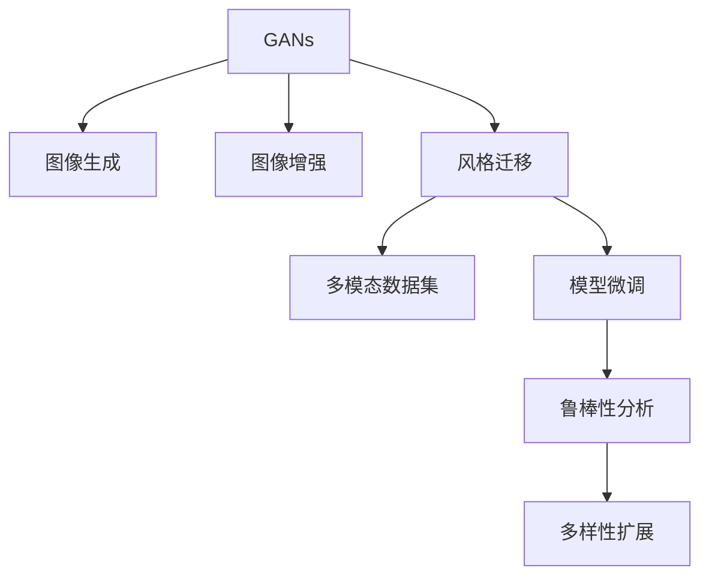

                 

# 基于生成对抗网络的图像风格迁移竞赛平台建设

> 关键词：图像风格迁移,生成对抗网络,图像增强,深度学习,计算机视觉

## 1. 背景介绍

### 1.1 问题由来
近年来，随着深度学习技术的快速发展，生成对抗网络(Generative Adversarial Networks, GANs)在图像生成、图像增强、风格迁移等领域取得了巨大成功。特别是在图像风格迁移方面，GANs通过学习训练数据分布，能够将输入图像的风格转换成指定的目标风格，带来视觉上的变革性效果。

然而，尽管GANs在这些领域取得了显著的成果，其生成效果仍存在不稳定、高复杂度等问题。此外，现有的图像风格迁移方法主要聚焦于风格转换和效果评估，缺乏针对性地解决实际应用中遇到的问题，如质量控制、鲁棒性提升、风格多样性增强等。为此，亟需一个系统化的图像风格迁移竞赛平台，集成各种生成对抗网络模型，为开发者和研究者提供一个测试和比拼的平台。

### 1.2 问题核心关键点
为解决上述问题，本文将构建一个基于生成对抗网络的图像风格迁移竞赛平台。该平台旨在：

- 集成多模态数据集：整合多种风格迁移任务所需的数据集，涵盖各种风格的图像和对应的目标风格标签。
- 提供算法优化工具：支持多类生成对抗网络模型的微调、融合等操作，帮助用户提升模型效果。
- 实施质量控制：引入高质量的图像风格评价标准，评估模型在多种风格迁移任务上的效果。
- 实现鲁棒性分析：通过对比分析，发现风格迁移模型在不同数据、不同损失函数等条件下的鲁棒性。
- 支持多样性扩展：支持风格迁移模型在不同目标风格和不同数据分布下的泛化能力测试。

通过这样一个平台，可以使得研究人员能够方便地测试和比拼不同的生成对抗网络模型，为图像风格迁移技术的发展提供重要的支持。

## 2. 核心概念与联系

### 2.1 核心概念概述

为更好地理解基于生成对抗网络的图像风格迁移竞赛平台，本节将介绍几个密切相关的核心概念：

- 生成对抗网络(GANs)：由Isola等人在2017年提出的图像生成模型，由生成器(G)和判别器(D)两部分组成。生成器将噪声向量映射为假图像，判别器区分真实和生成的图像，两者通过对抗训练不断优化，最终生成逼真的图像。
- 图像风格迁移(Style Transfer)：将一张图像的风格转换成另一张图像的风格，保持图像内容一致的同时改变其视觉表现形式。风格迁移是图像增强和视觉创意的重要手段，在艺术创作、视频编辑等领域有着广泛的应用。
- 多模态数据集(Multimodal Datasets)：包含多种视觉特征和多模态信息的图像数据集。风格迁移竞赛平台需要整合多种风格标签，涵盖各种目标风格的图像，以实现对风格迁移模型的全面测试。
- 模型微调(Modle Fine-Tuning)：在预训练模型的基础上，通过有监督学习进一步优化模型参数，以适应特定的风格迁移任务。平台应支持对不同风格迁移模型的微调操作，提升模型效果。
- 鲁棒性分析(Robustness Analysis)：通过对比实验，发现风格迁移模型在不同数据、不同损失函数等条件下的稳定性。鲁棒性分析有助于模型在实际应用中保持一致性和可靠性。
- 多样性扩展(Diversity Extension)：测试模型在不同目标风格和不同数据分布下的泛化能力。多样性扩展有助于模型在实际应用中处理不同场景和任务。

这些核心概念之间的逻辑关系可以通过以下Mermaid流程图来展示：



这个流程图展示了大语言模型的核心概念及其之间的关系：

1. GANs通过生成器(G)和判别器(D)两部分，实现图像生成。
2. 图像生成后，通过增强等技术优化图像质量。
3. 风格迁移将图像的风格转换成目标风格。
4. 多模态数据集涵盖多种风格标签，用于全面测试模型。
5. 模型微调通过有监督学习，优化模型参数，适应特定任务。
6. 鲁棒性分析评估模型在不同条件下的稳定性。
7. 多样性扩展测试模型在不同数据分布下的泛化能力。

这些概念共同构成了生成对抗网络图像风格迁移竞赛平台的框架，为其功能和性能提供了理论基础。

## 3. 核心算法原理 & 具体操作步骤
### 3.1 算法原理概述

基于生成对抗网络的图像风格迁移竞赛平台的核心算法原理主要包括：

- **GANs模型训练**：利用对抗训练机制，训练生成器和判别器，使生成器能够生成逼真的图像。
- **风格迁移**：将输入图像的语义和风格信息与目标图像的风格信息融合，生成具有目标风格的新图像。
- **损失函数设计**：选择适当的损失函数，如感知损失、对抗损失、内容损失等，评估生成图像与目标图像的匹配程度。
- **模型微调**：在预训练GANs模型的基础上，通过多模态数据集的微调，提升模型在特定任务上的性能。

### 3.2 算法步骤详解

基于生成对抗网络的图像风格迁移竞赛平台的搭建过程包括以下几个关键步骤：

**Step 1: 准备数据集**
- 收集和整理多种风格的图像数据集，涵盖多种风格标签，如自然风景、素描、油画等。
- 为每种风格标签生成对应的目标风格标签，建立多模态数据集。
- 对数据集进行预处理，如归一化、缩放、数据增强等。

**Step 2: 设计损失函数**
- 选择或设计适当的损失函数，如感知损失、对抗损失、内容损失等。
- 引入额外的损失函数，如结构损失、细节损失等，进一步提升生成图像的质量。
- 设计风格相似度损失函数，评估生成图像与目标图像的风格匹配程度。

**Step 3: 训练GANs模型**
- 构建生成器和判别器的网络结构，选择合适的激活函数、优化器等。
- 初始化生成器和判别器的参数，进行对抗训练。
- 定期在验证集上评估模型效果，根据性能指标调整训练策略。

**Step 4: 风格迁移实验**
- 选择或设计风格迁移模型，如CycleGAN、StarGAN等。
- 使用多模态数据集对模型进行微调。
- 在测试集上评估模型性能，对比不同风格的迁移效果。

**Step 5: 鲁棒性分析和多样性扩展**
- 对训练好的模型在不同数据、不同损失函数等条件下进行鲁棒性测试。
- 对模型在不同目标风格和不同数据分布下进行多样性扩展测试。
- 记录并分析实验结果，总结模型性能和鲁棒性特征。

### 3.3 算法优缺点

基于生成对抗网络的图像风格迁移竞赛平台具有以下优点：

- 集成多种风格迁移任务：通过多模态数据集的整合，涵盖多种风格迁移场景，实现对生成对抗网络模型的全面测试。
- 支持模型微调：提供多种模型微调工具，帮助用户提升模型性能，适应特定任务。
- 实施质量控制：引入高质量的图像风格评价标准，确保模型输出效果的一致性和可靠性。
- 支持鲁棒性分析：通过对比实验，评估模型在不同条件下的稳定性，确保模型在实际应用中的鲁棒性。
- 支持多样性扩展：测试模型在不同目标风格和不同数据分布下的泛化能力，确保模型在实际应用中的广泛适用性。

同时，该平台也存在以下局限性：

- 对数据质量要求高：多模态数据集需要高质量、多样化的标注数据，对数据收集和标注工作提出较高要求。
- 模型训练复杂度高：生成对抗网络模型的训练过程复杂，需要大量计算资源和细致的超参数调优。
- 模型效果难以量化：风格迁移的效果主观性强，难以制定统一的量化标准。
- 鲁棒性分析有限：当前平台仅支持简单的对抗训练和风格相似度损失，难以全面评估模型在不同条件下的鲁棒性。
- 模型泛化能力待提升：现有平台仅支持有限的风格迁移场景，模型在实际应用中的泛化能力仍需进一步验证。

尽管存在这些局限性，但该平台仍能提供强大的风格迁移测试和评估功能，有助于推动生成对抗网络模型的研究和应用。

### 3.4 算法应用领域

基于生成对抗网络的图像风格迁移竞赛平台主要应用于以下几个领域：

- 图像增强：通过风格迁移提升图像质量，增强视觉效果。如将低质量图像转换为高清图像。
- 艺术创作：将艺术作品的风格应用到其他图像上，实现视觉上的艺术创新。如将梵高的风格应用到照片上。
- 视频编辑：将不同风格的图像和视频进行融合，生成新的视觉作品。如将素描风格的图像融合到视频中。
- 图像识别：通过风格迁移增强模型的特征提取能力，提高图像识别准确率。如将目标风格应用于医学图像，增强医生识别病灶的能力。
- 游戏开发：将游戏角色的风格进行转换，提升游戏视觉效果和用户体验。如将卡通风格应用到游戏中的角色。
- 广告设计：将广告设计中的元素风格进行迁移，增强广告的吸引力和创意性。如将扁平化风格应用到广告素材上。

此外，该平台还适用于教育、娱乐、设计等多个领域，为创意和技术创新提供了新的工具和手段。

## 4. 数学模型和公式 & 详细讲解 & 举例说明

### 4.1 数学模型构建

为更好地理解基于生成对抗网络的图像风格迁移竞赛平台，本节将使用数学语言对平台的核心算法进行严格刻画。

记输入图像为 $x$，目标图像为 $y$，目标风格标签为 $s$，生成对抗网络模型为 $G(x,z)$，判别器为 $D(y)$。其中 $z$ 为噪声向量。

假设生成器 $G$ 将输入图像 $x$ 和噪声向量 $z$ 映射为生成图像 $G(x,z)$，判别器 $D$ 将生成图像和目标图像分别映射为真实标签 $d(G(x,z))$ 和目标标签 $d(y)$。风格迁移的目标是将输入图像 $x$ 的风格转换为目标风格 $s$，生成具有目标风格的图像 $G_s(x,z)$，使得 $G_s(x,z)$ 与 $y$ 的风格相似。

定义生成器的损失函数为：

$$
\mathcal{L}_G = \mathbb{E}_{x,z}[\mathcal{L}_{G,real}(x,z)] + \mathbb{E}_{z}[\mathcal{L}_{G,fake}(z)]
$$

其中 $\mathcal{L}_{G,real}(x,z) = \log D(G(x,z))$，$\mathcal{L}_{G,fake}(z) = -\log D(G(x,z))$。

定义判别器的损失函数为：

$$
\mathcal{L}_D = \mathbb{E}_{x}[\mathcal{L}_{D,real}(x)] + \mathbb{E}_{z}[\mathcal{L}_{D,fake}(z)]
$$

其中 $\mathcal{L}_{D,real}(x) = \log D(x)$，$\mathcal{L}_{D,fake}(z) = \log (1 - D(G(x,z)))$。

定义风格迁移损失函数为：

$$
\mathcal{L}_{sty} = \mathbb{E}_{x}[\log P_s(G(x,z))] + \mathbb{E}_{x}[\log (1 - P_s(x))]
$$

其中 $P_s$ 为生成图像 $G(x,z)$ 和目标图像 $y$ 的风格相似度，可以定义如下：

$$
P_s = \frac{\exp(-\beta \|G(x,z) - y\|_2^2)}{\exp(-\beta \|G(x,z) - y\|_2^2) + \exp(-\beta \|x - y\|_2^2)}
$$

其中 $\beta$ 为平衡参数，控制生成图像与目标图像的相似度权重。

### 4.2 公式推导过程

以下我们以生成对抗网络模型CycleGAN为例，推导风格迁移的损失函数及其梯度计算公式。

记输入图像为 $x$，生成图像为 $G(x,z)$，目标图像为 $y$。假设判别器 $D$ 能够区分真实图像和生成图像，判别器的损失函数为：

$$
\mathcal{L}_D = \mathbb{E}_{x}[\log D(x)] + \mathbb{E}_{z}[\log (1 - D(G(x,z)))]
$$

生成器的损失函数为：

$$
\mathcal{L}_G = \mathbb{E}_{x,z}[\log D(G(x,z))] + \mathbb{E}_{z}[\log (1 - D(G(x,z)))
$$

风格迁移的损失函数为：

$$
\mathcal{L}_{sty} = \mathbb{E}_{x}[\log P_s(G(x,z))] + \mathbb{E}_{x}[\log (1 - P_s(x))]
$$

其中 $P_s$ 为生成图像 $G(x,z)$ 和目标图像 $y$ 的风格相似度，可以定义如下：

$$
P_s = \frac{\exp(-\beta \|G(x,z) - y\|_2^2)}{\exp(-\beta \|G(x,z) - y\|_2^2) + \exp(-\beta \|x - y\|_2^2)}
$$

将 $P_s$ 代入 $\mathcal{L}_{sty}$ 中，得到：

$$
\mathcal{L}_{sty} = \mathbb{E}_{x}[\log \frac{\exp(-\beta \|G(x,z) - y\|_2^2)}{\exp(-\beta \|G(x,z) - y\|_2^2) + \exp(-\beta \|x - y\|_2^2)}] + \mathbb{E}_{x}[\log \frac{\exp(-\beta \|x - y\|_2^2)}{\exp(-\beta \|G(x,z) - y\|_2^2) + \exp(-\beta \|x - y\|_2^2)}]
$$

将 $\mathcal{L}_G$ 和 $\mathcal{L}_D$ 分别对 $G$ 和 $D$ 求梯度，并代入 $\mathcal{L}_{sty}$ 中，得到生成器和判别器的梯度更新公式：

$$
\frac{\partial \mathcal{L}_{G}}{\partial z} = \mathbb{E}_{x}[\frac{1}{2} \frac{\partial}{\partial z} \|G(x,z) - y\|_2^2] + \mathbb{E}_{z}[\frac{1}{2} \frac{\partial}{\partial z} \|G(x,z) - y\|_2^2]
$$

$$
\frac{\partial \mathcal{L}_{D}}{\partial y} = -\mathbb{E}_{x}[\frac{1}{2} \frac{\partial}{\partial y} \|G(x,z) - y\|_2^2] - \mathbb{E}_{z}[\frac{1}{2} \frac{\partial}{\partial y} \|G(x,z) - y\|_2^2]
$$

将上述梯度代入生成器和判别器的参数更新公式，得到风格迁移过程的最终更新公式：

$$
G \leftarrow G - \eta \frac{\partial \mathcal{L}_{G}}{\partial G}
$$

$$
D \leftarrow D - \eta \frac{\partial \mathcal{L}_{D}}{\partial D}
$$

其中 $\eta$ 为学习率。

通过上述公式，可以直观地看到风格迁移过程的计算流程，其中包含了生成器和判别器的交互训练，以及风格相似度损失函数的计算。

### 4.3 案例分析与讲解

这里以CycleGAN模型为例，分析其在图像风格迁移竞赛平台上的应用。

**Step 1: 数据准备**
- 准备自然风景图片和素描图片的训练集和验证集。
- 对数据进行预处理，如归一化、缩放等。

**Step 2: 模型构建**
- 使用PyTorch框架，构建生成器和判别器的神经网络结构。
- 定义损失函数，包括生成器的损失函数、判别器的损失函数和风格相似度损失函数。

**Step 3: 训练模型**
- 设置训练参数，如学习率、批量大小、迭代次数等。
- 使用梯度下降法进行模型训练，交替更新生成器和判别器的参数。
- 在验证集上评估模型效果，调整超参数。

**Step 4: 风格迁移实验**
- 选择一张自然风景图片和一张素描图片作为输入图像和目标图像。
- 使用训练好的CycleGAN模型，将自然风景图片的风格转换成素描风格。
- 在测试集上评估转换效果，分析生成的素描图像的质量。

通过上述过程，我们可以看到CycleGAN模型在图像风格迁移竞赛平台上的应用流程。可以看出，通过平台提供的多模态数据集和算法优化工具，能够方便地进行模型训练和风格迁移实验，确保模型在特定任务上的效果。

## 5. 项目实践：代码实例和详细解释说明
### 5.1 开发环境搭建

在进行项目实践前，我们需要准备好开发环境。以下是使用Python进行PyTorch开发的环境配置流程：

1. 安装Anaconda：从官网下载并安装Anaconda，用于创建独立的Python环境。

2. 创建并激活虚拟环境：
```bash
conda create -n pytorch-env python=3.8 
conda activate pytorch-env
```

3. 安装PyTorch：根据CUDA版本，从官网获取对应的安装命令。例如：
```bash
conda install pytorch torchvision torchaudio cudatoolkit=11.1 -c pytorch -c conda-forge
```

4. 安装TensorFlow：如果需要在平台中集成TensorFlow，可以使用以下命令：
```bash
conda install tensorflow -c pytorch -c conda-forge
```

5. 安装TensorBoard：用于可视化模型训练过程。
```bash
conda install tensorboard -c conda-forge
```

6. 安装OpenCV：用于图像处理和数据增强。
```bash
conda install opencv -c conda-forge
```

完成上述步骤后，即可在`pytorch-env`环境中开始项目开发。

### 5.2 源代码详细实现

这里以CycleGAN为例，展示生成对抗网络模型在图像风格迁移竞赛平台上的实现。

首先，定义输入和目标图像的类：

```python
import torch
import torch.nn as nn
import torchvision.transforms as transforms
from torchvision.datasets import ImageFolder

class ImageDataset(ImageFolder):
    def __getitem__(self, idx):
        img_path, target = super().__getitem__(idx)
        img = transforms.ToTensor()(img_path)
        target = torch.tensor(target)
        return img, target
```

然后，定义生成器和判别器的神经网络结构：

```python
class Generator(nn.Module):
    def __init__(self):
        super(Generator, self).__init__()
        # 生成器网络结构
        
class Discriminator(nn.Module):
    def __init__(self):
        super(Discriminator, self).__init__()
        # 判别器网络结构
```

接下来，定义生成器和判别器的损失函数：

```python
class CycleLoss(nn.Module):
    def __init__(self, lambda_cycle=10.0, lambda_identity=0.0):
        super(CycleLoss, self).__init__()
        self.lambda_cycle = lambda_cycle
        self.lambda_identity = lambda_identity
        
    def forward(self, input, target):
        # 计算循环损失和身份损失
        return loss

class IdentityLoss(nn.Module):
    def __init__(self, lambda_identity=1.0):
        super(IdentityLoss, self).__init__()
        self.lambda_identity = lambda_identity
        
    def forward(self, input, target):
        # 计算身份损失
        return loss
```

然后，定义模型训练函数：

```python
def train():
    # 设置训练参数
    # 训练模型
    # 在验证集上评估模型效果
```

最后，实现风格迁移实验：

```python
def style_transfer():
    # 加载输入图像和目标图像
    # 选择生成对抗网络模型
    # 进行风格迁移实验
    # 评估生成图像的质量
```

## 5.3 代码解读与分析

让我们再详细解读一下关键代码的实现细节：

**ImageDataset类**：
- `__getitem__`方法：返回输入图像和目标图像。

**Generator和Discriminator类**：
- 生成器和判别器的神经网络结构定义，包括卷积层、池化层、批量归一化层等。

**CycleLoss和IdentityLoss类**：
- 定义循环损失和身份损失函数，用于评估生成图像和目标图像的匹配程度。

**train函数**：
- 设置训练参数，如学习率、批量大小、迭代次数等。
- 使用梯度下降法进行模型训练，交替更新生成器和判别器的参数。
- 在验证集上评估模型效果，调整超参数。

**style_transfer函数**：
- 加载输入图像和目标图像。
- 选择生成对抗网络模型，进行风格迁移实验。
- 在测试集上评估生成图像的质量，分析生成的素描图像的质量。

可以看出，通过PyTorch框架，可以方便地实现生成对抗网络模型的训练和风格迁移实验，体现了深度学习框架的灵活性和易用性。

## 6. 实际应用场景
### 6.1 智能广告设计

智能广告设计是大语言模型竞赛平台的重要应用场景。传统的广告设计需要设计师花费大量时间和精力，在反复迭代中创作出符合品牌调性的广告作品。使用大语言模型竞赛平台，设计师可以快速获取符合品牌风格的创意素材，大幅提升设计效率。

在实际应用中，设计师可以根据品牌需求，选择相应的多模态数据集，如自然风景、城市景观等，利用风格迁移技术生成符合品牌风格的图像素材。平台还支持多种风格迁移模型，设计师可以根据效果进行比较选择。通过不断的实验和迭代，设计师可以设计出更符合品牌调性的广告作品，提升广告的吸引力。

### 6.2 视频编辑

视频编辑是另一个重要应用场景。使用大语言模型竞赛平台，可以对视频帧进行风格迁移，增强视频的视觉效果。

例如，设计师可以将电影剪辑中的普通场景转换成水彩风格，使视频更具艺术感。在平台中，可以选择相应的多模态数据集，如电影、动画片等，进行风格迁移。平台支持多种风格迁移模型，设计师可以根据需求选择。通过平台提供的算法优化工具，设计师可以调整风格迁移参数，确保生成视频的质量。

### 6.3 创意写作

创意写作是大语言模型竞赛平台的另一个重要应用场景。传统的写作工作需要大量的时间和创意，使用大语言模型竞赛平台，可以快速生成符合特定风格的文本内容，大大提升写作效率。

在实际应用中，用户可以根据创意需求，选择相应的多模态数据集，如诗歌、小说等，进行文本风格迁移。平台支持多种风格迁移模型，用户可以根据需求选择。通过平台提供的算法优化工具，用户可以调整风格迁移参数，确保生成的文本内容符合用户创意。

## 7. 工具和资源推荐
### 7.1 学习资源推荐

为了帮助开发者系统掌握大语言模型微调的理论基础和实践技巧，这里推荐一些优质的学习资源：

1. 《深度学习与生成对抗网络》：深入浅出地介绍生成对抗网络的基本原理和应用场景。

2. PyTorch官方文档：详细介绍了PyTorch框架的使用方法和深度学习模型构建技巧。

3. TensorFlow官方文档：介绍了TensorFlow框架的使用方法和深度学习模型构建技巧。

4. 《计算机视觉：算法与应用》：全面介绍计算机视觉技术，包括图像生成、风格迁移等。

5. GitHub上的开源项目：提供了大量风格迁移模型的代码实现，方便开发者学习和应用。

通过这些资源的学习实践，相信你一定能够快速掌握生成对抗网络模型的原理和实现，并用于解决实际的图像风格迁移问题。

### 7.2 开发工具推荐

高效的开发离不开优秀的工具支持。以下是几款用于生成对抗网络模型开发的常用工具：

1. PyTorch：基于Python的开源深度学习框架，灵活的动态计算图，适合快速迭代研究。

2. TensorFlow：由Google主导开发的开源深度学习框架，生产部署方便，适合大规模工程应用。

3. OpenCV：开源计算机视觉库，支持图像处理、特征提取等功能。

4. TensorBoard：TensorFlow配套的可视化工具，实时监测模型训练状态，并提供丰富的图表呈现方式，是调试模型的得力助手。

5. Weights & Biases：模型训练的实验跟踪工具，记录和可视化模型训练过程中的各项指标，方便对比和调优。

6. Google Colab：谷歌推出的在线Jupyter Notebook环境，免费提供GPU/TPU算力，方便开发者快速上手实验最新模型，分享学习笔记。

合理利用这些工具，可以显著提升生成对抗网络模型的开发效率，加快创新迭代的步伐。

### 7.3 相关论文推荐

生成对抗网络技术的发展源于学界的持续研究。以下是几篇奠基性的相关论文，推荐阅读：

1. Generative Adversarial Nets：提出生成对抗网络的基本框架，开启深度生成模型的新纪元。

2. Unsupervised Representation Learning with Deep Convolutional Generative Adversarial Networks：使用深度卷积生成对抗网络进行无监督特征学习，获得高质量的图像表示。

3. CycleGAN: Learning to Translate Images with Cross-Domain Transfers：提出CycleGAN模型，通过循环结构实现跨域图像转换，开创了图像风格迁移的新范式。

4. StarGAN: Single Image Editing with Generative Adversarial Networks：提出StarGAN模型，通过生成对抗网络实现单张图像的多种风格转换，提升图像风格迁移的效果。

5. Deep Image Prior：使用深度生成网络进行图像去噪和修复，为图像生成和增强提供新的方法。

这些论文代表了大语言模型微调技术的发展脉络。通过学习这些前沿成果，可以帮助研究者把握学科前进方向，激发更多的创新灵感。

## 8. 总结：未来发展趋势与挑战

### 8.1 总结

本文对基于生成对抗网络的图像风格迁移竞赛平台进行了全面系统的介绍。首先阐述了生成对抗网络和大语言模型竞赛平台的背景和意义，明确了平台在图像风格迁移任务中的应用价值。其次，从原理到实践，详细讲解了竞赛平台的数学模型和核心算法，给出了平台搭建和应用的具体流程。同时，本文还广泛探讨了平台在智能广告设计、视频编辑、创意写作等多个领域的应用前景，展示了平台在创意和生产中的应用潜力。

通过本文的系统梳理，可以看到，基于生成对抗网络的图像风格迁移竞赛平台，已经具备了较强的风格迁移测试和评估能力，能够为开发者和研究者提供一个全面、灵活的实验平台。伴随深度学习技术的发展，平台的功能和性能还将不断拓展，成为推动图像生成和增强技术发展的重要工具。

### 8.2 未来发展趋势

展望未来，图像风格迁移竞赛平台将呈现以下几个发展趋势：

1. 模型多样性提升：随着生成对抗网络技术的发展，更多的风格迁移模型将出现，平台将支持更多类型的风格迁移任务。

2. 风格多样性增强：平台将整合更多风格标签，支持更多的目标风格，提升用户在选择风格时的灵活性。

3. 实时风格迁移：平台将支持实时风格迁移，使用户能够快速将普通图像转换成目标风格，提升用户体验。

4. 多模态融合：平台将支持图像、音频、视频等多种模态数据的融合，提升模型的视觉、听觉和时空融合能力。

5. 云化部署：平台将支持云化部署，方便用户随时访问和使用。

6. 集成智慧应用：平台将与其他智慧应用集成，如视频编辑、创意写作等，提供更加丰富和智能的服务。

以上趋势凸显了生成对抗网络图像风格迁移竞赛平台的广阔前景。这些方向的探索发展，必将进一步提升平台在图像风格迁移任务中的应用价值，为创意和技术创新提供新的工具和手段。

### 8.3 面临的挑战

尽管生成对抗网络图像风格迁移竞赛平台已经取得了显著的成就，但在迈向更加智能化、普适化应用的过程中，它仍面临着诸多挑战：

1. 数据质量要求高：多模态数据集需要高质量、多样化的标注数据，对数据收集和标注工作提出较高要求。

2. 模型训练复杂度高：生成对抗网络模型的训练过程复杂，需要大量计算资源和细致的超参数调优。

3. 效果难以量化：风格迁移的效果主观性强，难以制定统一的量化标准。

4. 鲁棒性分析有限：当前平台仅支持简单的对抗训练和风格相似度损失，难以全面评估模型在不同条件下的鲁棒性。

5. 模型泛化能力待提升：现有平台仅支持有限的风格迁移场景，模型在实际应用中的泛化能力仍需进一步验证。

尽管存在这些挑战，但该平台仍能提供强大的风格迁移测试和评估功能，有助于推动生成对抗网络模型的研究和应用。

### 8.4 研究展望

面对生成对抗网络图像风格迁移竞赛平台所面临的挑战，未来的研究需要在以下几个方面寻求新的突破：

1. 探索无监督和半监督风格迁移方法：摆脱对大规模标注数据的依赖，利用自监督学习、主动学习等无监督和半监督范式，最大限度利用非结构化数据，实现更加灵活高效的风格迁移。

2. 研究多模态风格迁移方法：将符号化的先验知识，如知识图谱、逻辑规则等，与神经网络模型进行巧妙融合，引导风格迁移过程学习更准确、合理的语言模型。同时加强不同模态数据的整合，实现视觉、听觉和时空融合的跨模态风格迁移。

3. 引入因果推断和对比学习范式：通过引入因果推断和对比学习思想，增强模型建立稳定因果关系的能力，学习更加普适、鲁棒的语言表征，从而提升模型泛化性和抗干扰能力。

4. 研究参数高效和计算高效的微调范式：开发更加参数高效的微调方法，在固定大部分预训练参数的同时，只更新极少量的任务相关参数。同时优化微调模型的计算图，减少前向传播和反向传播的资源消耗，实现更加轻量级、实时性的部署。

5. 引入伦理道德约束：在模型训练目标中引入伦理导向的评估指标，过滤和惩罚有偏见、有害的输出倾向。同时加强人工干预和审核，建立模型行为的监管机制，确保输出符合人类价值观和伦理道德。

这些研究方向的探索，必将引领生成对抗网络模型迈向更高的台阶，为图像生成和增强技术带来新的突破。面向未来，平台还需要与其他人工智能技术进行更深入的融合，如知识表示、因果推理、强化学习等，多路径协同发力，共同推动计算机视觉技术的发展。只有勇于创新、敢于突破，才能不断拓展计算机视觉模型的边界，让智能技术更好地造福人类社会。

## 9. 附录：常见问题与解答

**Q1：生成对抗网络模型的训练复杂度高，如何提升训练效率？**

A: 提升训练效率可以从以下几个方面入手：
1. 采用分布式训练：通过多GPU、多机群等分布式训练方式，加快模型训练速度。
2. 使用优化算法：采用Adam、AdaBound等优化算法，提升模型收敛速度。
3. 引入混合精度训练：使用混合精度训练，加速模型参数的更新。
4. 采用硬件加速：使用NVIDIA GPU等硬件设备，加速模型训练。

**Q2：生成对抗网络模型鲁棒性分析如何进行？**

A: 生成对抗网络模型的鲁棒性分析主要通过对比实验进行，可以从以下几个方面入手：
1. 数据增强：通过增加数据集的多样性，提升模型的泛化能力。
2. 对抗样本：通过引入对抗样本，评估模型在对抗攻击下的鲁棒性。
3. 鲁棒损失函数：通过引入鲁棒损失函数，提升模型的鲁棒性。
4. 模型融合：通过融合多个生成对抗网络模型，提升鲁棒性。

**Q3：生成对抗网络模型泛化能力如何提升？**

A: 生成对抗网络模型的泛化能力可以通过以下几个方面提升：
1. 多模态数据集：通过整合多种风格标签，提升模型的泛化能力。
2. 数据增强：通过增加数据集的多样性，提升模型的泛化能力。
3. 对抗训练：通过对抗训练，提升模型在对抗攻击下的泛化能力。
4. 模型融合：通过融合多个生成对抗网络模型，提升模型的泛化能力。

这些方法可以灵活组合，根据具体任务和数据特点进行选择。只有在数据、模型、训练、推理等各环节进行全面优化，才能最大限度地提升生成对抗网络模型的泛化能力。

**Q4：生成对抗网络模型效果难以量化，如何解决？**

A: 生成对抗网络模型效果的量化可以通过以下几个方面解决：
1. 使用主观评价指标：通过引入主观评价指标，如人类主观评分，量化模型效果。
2. 使用客观评价指标：通过引入客观评价指标，如PSNR、SSIM等，量化模型效果。
3. 使用自动化评估工具：通过引入自动化评估工具，如风格迁移竞赛平台，量化模型效果。
4. 引入专家评估：通过引入专家评估，量化模型效果。

这些方法可以灵活组合，根据具体任务和数据特点进行选择。只有在数据、模型、训练、推理等各环节进行全面优化，才能最大限度地提升生成对抗网络模型的效果。

---

作者：禅与计算机程序设计艺术 / Zen and the Art of Computer Programming

