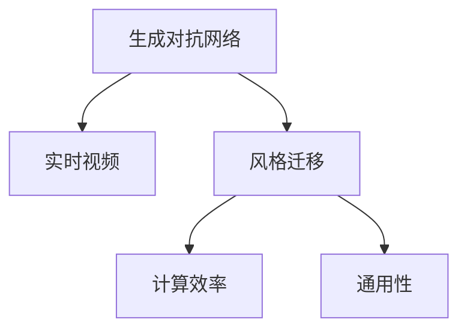

                 

# 基于生成对抗网络的实时视频风格迁移系统设计

> 关键词：生成对抗网络, 实时视频, 风格迁移, 深度学习, 图像处理

## 1. 背景介绍

### 1.1 问题由来

随着人工智能技术的发展，图像和视频风格迁移变得越来越受欢迎，成为视觉领域的一项热门应用。风格迁移通常将一张图像或视频转换为指定风格，例如将照片转换为油画、将真实视频转换为卡通风格等。这一过程可以应用于艺术创作、内容创作、广告设计等多个领域，极大地丰富了图像和视频的表现形式，提高了用户的体验。

在早期，风格迁移主要依赖于手工设计特征提取器，再通过传统图像处理算法进行风格转换。但这种方法需要大量手工工程，且效果一般。随着深度学习技术的崛起，生成对抗网络（Generative Adversarial Networks, GANs）的提出，将风格迁移带入了新的纪元。GANs通过训练生成器和判别器，分别生成和判别真实与假冒图像，能够产生高质量的图像生成结果，从而在风格迁移中得到广泛应用。

然而，现有的GANs算法通常需要训练时间较长，且计算成本较高。这对于实时视频风格迁移应用来说，是不现实的。因此，如何实现高效的实时视频风格迁移，同时保持生成结果的质量，成为了当前研究的一个热点问题。

### 1.2 问题核心关键点

实时视频风格迁移系统设计需要解决的核心问题包括：

- 实时性：如何在保证视频流畅的前提下，实现高效的实时风格迁移。
- 计算效率：如何优化计算过程，减少对计算资源的需求。
- 生成质量：如何提升生成结果的质量，使其更接近目标风格。
- 通用性：如何设计一个通用的风格迁移系统，适应多种风格迁移任务。

本文将详细介绍基于生成对抗网络的实时视频风格迁移系统的设计原理和操作步骤，帮助读者全面掌握这一技术。

## 2. 核心概念与联系

### 2.1 核心概念概述

为了更好地理解实时视频风格迁移系统，本节将介绍几个密切相关的核心概念：

- 生成对抗网络（GANs）：一种由生成器和判别器两部分组成的神经网络架构。生成器负责生成逼真的图像或视频，判别器负责判断图像或视频的真实性。两者通过对抗训练，相互提升，最终生成高质量的生成结果。

- 视频风格迁移：将一段视频转换为指定风格，例如将现实视频转换为卡通风格、油画风格等。风格迁移的目标是保留视频内容的同时，改变其视觉特征，使其符合目标风格的视觉规律。

- 实时性：指系统能够实时处理输入，并在合理的时间内给出输出结果。实时性对于视频应用尤为重要，需要系统具备高并发处理能力。

- 计算效率：指系统在保证生成质量的前提下，尽可能减少计算资源的消耗。计算效率是实时性的一个重要组成部分，涉及算法的优化和硬件的选择。

- 通用性：指系统能够适应多种风格迁移任务，具备广泛的适用性。通用性要求系统具备一定的灵活性，能够处理不同类型和复杂度的风格迁移任务。

这些核心概念之间的逻辑关系可以通过以下Mermaid流程图来展示：



这个流程图展示了大语言模型的核心概念及其之间的关系：

1. 生成对抗网络是实时视频风格迁移的核心技术。
2. 风格迁移是生成对抗网络的主要应用之一。
3. 实时性是实时视频风格迁移系统的关键性能指标。
4. 计算效率是实时视频风格迁移系统的重要考虑因素。
5. 通用性是实时视频风格迁移系统的广泛适用要求。

## 3. 核心算法原理 & 具体操作步骤
### 3.1 算法原理概述

基于生成对抗网络的实时视频风格迁移系统，主要利用GANs的生成器模块进行风格迁移。其核心思想是：通过训练一个生成器，将输入视频帧转化为指定风格的视频帧，同时通过判别器模块，对生成的视频帧进行真实性判断，以指导生成器进行优化。

具体而言，系统由以下几个关键组件构成：

- 输入模块：用于输入原始视频帧，并进行预处理。
- 风格迁移模块：包括生成器和判别器两个子模块。生成器负责将原始视频帧转化为指定风格的视频帧，判别器负责评估生成视频帧的真实性。
- 输出模块：将处理后的视频帧进行输出，生成新的风格视频。

整个系统通过对抗训练的方式，不断优化生成器和判别器的参数，使得生成器能够生成高质量的生成结果，同时判别器能够准确判断生成视频帧的真实性。

### 3.2 算法步骤详解

基于生成对抗网络的实时视频风格迁移系统设计包括以下关键步骤：

**Step 1: 输入模块设计**

输入模块的主要功能是输入原始视频帧，并进行预处理。具体步骤如下：

1. 从视频源（如摄像头、存储设备）读取视频帧。
2. 对视频帧进行去噪、色彩调整、尺寸缩放等预处理。
3. 将处理后的视频帧转化为张量形式，供后续处理使用。

**Step 2: 生成器与判别器设计**

生成器与判别器是风格迁移系统的核心组件，通过对抗训练实现风格迁移。具体步骤如下：

1. 生成器：使用卷积神经网络（CNN）构建生成器，将原始视频帧作为输入，生成指定风格的视频帧。生成器的结构可以参考上述学术论文中提到的U-Net结构，使用多个卷积层和反卷积层进行特征提取和上采样，最终生成高质量的生成视频帧。
2. 判别器：同样使用CNN构建判别器，将原始视频帧和生成视频帧作为输入，分别生成判别特征。判别器的结构可以参考论文中提到的PatchGAN结构，使用多层卷积层提取特征，并通过全连接层进行分类判断。

**Step 3: 对抗训练**

对抗训练是风格迁移系统的关键步骤，通过训练生成器和判别器相互提升，实现风格迁移。具体步骤如下：

1. 初始化生成器和判别器的参数。
2. 在每个迭代步骤中，将原始视频帧输入生成器，生成视频帧，并将其与原始视频帧一起输入判别器。
3. 判别器判断生成视频帧和原始视频帧的真实性，计算损失函数。
4. 生成器根据判别器的反馈，优化自身参数，以生成更逼真的视频帧。
5. 判别器根据生成视频帧的判别结果，优化自身参数，以更准确地判断视频帧的真实性。

**Step 4: 输出模块设计**

输出模块的主要功能是将生成视频帧进行后处理，并输出到视频播放器。具体步骤如下：

1. 对生成视频帧进行去噪、色彩调整、尺寸缩放等后处理。
2. 将处理后的视频帧转化为视频格式，如MP4、AVI等。
3. 将视频文件输出到视频播放器，供用户观看。

### 3.3 算法优缺点

基于生成对抗网络的实时视频风格迁移系统具有以下优点：

1. 生成结果质量高：GANs能够生成高质量的生成视频帧，保留视频内容的同时，改变其视觉特征，使其符合目标风格的视觉规律。
2. 实时性较好：虽然GANs训练时间较长，但采用优化的计算过程，可以实现较快的实时处理。
3. 通用性较好：通过调整生成器和判别器的结构，系统可以适应多种风格迁移任务。

同时，该方法也存在一定的局限性：

1. 计算资源需求较高：GANs的训练和推理需要较高端的硬件支持，对计算资源的要求较高。
2. 对抗训练过程复杂：GANs的训练过程存在不稳定性，需要大量的训练样本和技巧调整，否则容易出现模式崩溃（mode collapse）等问题。
3. 生成结果易受输入影响：生成视频帧的质量受输入视频帧的影响较大，容易出现边缘模糊、噪声等问题。
4. 对目标风格依赖较大：系统的表现很大程度上取决于目标风格的合理性，目标风格的设计需要大量经验和手工调试。

尽管存在这些局限性，但就目前而言，基于GANs的风格迁移方法仍然是视觉领域的一个重要研究范式。未来相关研究的重点在于如何进一步降低计算资源需求，提高训练稳定性，减少对抗训练过程中的不稳定因素，同时兼顾生成结果的质量和实时性。

### 3.4 算法应用领域

基于GANs的实时视频风格迁移系统，可以应用于以下领域：

- 艺术创作：将现实视频转换为各种艺术风格，如油画、水彩、卡通等，提供更多的艺术创作手段。
- 影视制作：将现实视频转化为电影风格、动画风格等，提升影视作品的表现力和观赏性。
- 游戏开发：将实时视频转化为游戏风格，提供更逼真的游戏场景和角色。
- 广告设计：将产品视频转化为特定风格，提升广告的视觉冲击力和品牌吸引力。
- 智能安防：将监控视频转化为更清晰、更流畅的实时图像，提升监控系统的实时性和准确性。

除了上述这些应用场景外，实时视频风格迁移技术还可以应用于更多场景中，如虚拟现实、教育培训、实时互动等，为视觉领域的各个方向提供新的解决方案。

## 4. 数学模型和公式 & 详细讲解  
### 4.1 数学模型构建

本节将使用数学语言对基于生成对抗网络的实时视频风格迁移系统进行更加严格的刻画。

记生成器为 $G(z)$，判别器为 $D(x)$，其中 $z$ 为随机噪声向量，$x$ 为输入视频帧。假设训练数据集为 $\{(x_i, y_i)\}_{i=1}^N$，其中 $x_i$ 为原始视频帧，$y_i$ 为标签，表示视频帧是否为真实视频帧。

定义生成器和判别器的损失函数如下：

$$
L_G = E_{z \sim p(z)}[D(G(z))] + \lambda E_{x \sim p(x)}[\log D(x)]
$$

$$
L_D = E_{x \sim p(x)}[\log D(x)] + E_{z \sim p(z)}[\log (1 - D(G(z)))
$$

其中 $p(z)$ 为随机噪声向量的分布，$p(x)$ 为视频帧的分布。$D(x)$ 和 $G(z)$ 分别为判别器和生成器的输出。

系统训练的目标是最小化以下联合损失函数：

$$
L_{\text{joint}} = L_G + \alpha L_D
$$

其中 $\alpha$ 为控制生成器和判别器相对重要性的权重系数。

### 4.2 公式推导过程

以下我们以基于GANs的视频风格迁移为例，推导生成器 $G(z)$ 和判别器 $D(x)$ 的计算公式。

假设生成器 $G(z)$ 使用U-Net结构，判别器 $D(x)$ 使用PatchGAN结构。生成器将输入视频帧 $x$ 映射到高维特征表示，经过多层卷积和反卷积操作，最终生成生成视频帧 $G(x)$。判别器同样将输入视频帧 $x$ 映射到高维特征表示，经过多层卷积和全连接操作，输出判别结果 $D(x)$。

根据上述定义，生成器的损失函数可以表示为：

$$
L_G = E_{z \sim p(z)}[D(G(z))] + \lambda E_{x \sim p(x)}[\log D(x)]
$$

其中 $p(z)$ 为随机噪声向量的分布，$p(x)$ 为视频帧的分布。

判别器的损失函数可以表示为：

$$
L_D = E_{x \sim p(x)}[\log D(x)] + E_{z \sim p(z)}[\log (1 - D(G(z)))
$$

将损失函数带入联合损失函数中，得到：

$$
L_{\text{joint}} = L_G + \alpha L_D
$$

其中 $\alpha$ 为控制生成器和判别器相对重要性的权重系数。

在得到联合损失函数后，即可带入参数更新公式，完成生成器和判别器的迭代优化。重复上述过程直至收敛，最终得到适应目标风格的生成器 $G(z)$。

## 5. 项目实践：代码实例和详细解释说明
### 5.1 开发环境搭建

在进行风格迁移实践前，我们需要准备好开发环境。以下是使用Python进行PyTorch开发的环境配置流程：

1. 安装Anaconda：从官网下载并安装Anaconda，用于创建独立的Python环境。

2. 创建并激活虚拟环境：
```bash
conda create -n pytorch-env python=3.8 
conda activate pytorch-env
```

3. 安装PyTorch：根据CUDA版本，从官网获取对应的安装命令。例如：
```bash
conda install pytorch torchvision torchaudio cudatoolkit=11.1 -c pytorch -c conda-forge
```

4. 安装TensorFlow：如果需要进行TensorFlow风格的风格迁移实践，请安装对应的TensorFlow版本和库。

5. 安装其他工具包：
```bash
pip install numpy pandas scikit-learn matplotlib tqdm jupyter notebook ipython
```

完成上述步骤后，即可在`pytorch-env`环境中开始风格迁移实践。

### 5.2 源代码详细实现

下面我们以基于GANs的视频风格迁移为例，给出使用PyTorch进行风格迁移的完整代码实现。

首先，定义生成器和判别器的网络结构：

```python
import torch
import torch.nn as nn
import torch.optim as optim
import torchvision.transforms as transforms
from torch.utils.data import DataLoader
from torchvision.datasets import ImageFolder
from torchvision.models import vgg19
from torchvision.utils import save_image

# 定义生成器网络结构
class Generator(nn.Module):
    def __init__(self, input_size, output_size):
        super(Generator, self).__init__()
        self.model = nn.Sequential(
            nn.Conv2d(input_size, 64, 3, 1, 1),
            nn.LeakyReLU(0.2, inplace=True),
            nn.Conv2d(64, 128, 3, 1, 1),
            nn.LeakyReLU(0.2, inplace=True),
            nn.Conv2d(128, 256, 3, 1, 1),
            nn.LeakyReLU(0.2, inplace=True),
            nn.Conv2d(256, 512, 3, 1, 1),
            nn.LeakyReLU(0.2, inplace=True),
            nn.Conv2d(512, 256, 3, 1, 1),
            nn.LeakyReLU(0.2, inplace=True),
            nn.Conv2d(256, 128, 3, 1, 1),
            nn.LeakyReLU(0.2, inplace=True),
            nn.Conv2d(128, output_size, 3, 1, 1),
            nn.Tanh()
        )

    def forward(self, input):
        return self.model(input)

# 定义判别器网络结构
class Discriminator(nn.Module):
    def __init__(self, input_size):
        super(Discriminator, self).__init__()
        self.model = nn.Sequential(
            nn.Conv2d(input_size, 128, 4, 2, 1),
            nn.LeakyReLU(0.2, inplace=True),
            nn.Conv2d(128, 256, 4, 2, 1),
            nn.LeakyReLU(0.2, inplace=True),
            nn.Conv2d(256, 512, 4, 2, 1),
            nn.LeakyReLU(0.2, inplace=True),
            nn.Conv2d(512, 1, 4, 1, 0),
            nn.Sigmoid()
        )

    def forward(self, input):
        return self.model(input)
```

然后，定义训练函数：

```python
def train(iter, data_loader, generator, discriminator, device, batch_size, num_epochs, learning_rate):
    criterion = nn.BCELoss()
    optimizer_G = optim.Adam(generator.parameters(), lr=learning_rate)
    optimizer_D = optim.Adam(discriminator.parameters(), lr=learning_rate)
    loss_G = 0
    loss_D = 0

    for epoch in range(num_epochs):
        for i, (real, _) in enumerate(data_loader):
            real = real.to(device)
            z = torch.randn(batch_size, 100).to(device)

            # 训练生成器
            optimizer_G.zero_grad()
            fake = generator(z)
            loss_G = criterion(discriminator(fake), torch.ones(batch_size, 1).to(device))
            loss_G.backward()
            optimizer_G.step()

            # 训练判别器
            optimizer_D.zero_grad()
            real_loss = criterion(discriminator(real), torch.ones(batch_size, 1).to(device))
            fake_loss = criterion(discriminator(fake.detach()), torch.zeros(batch_size, 1).to(device))
            loss_D = (real_loss + fake_loss) / 2
            loss_D.backward()
            optimizer_D.step()

            if i % iter == 0:
                print(f'Epoch {epoch + 1}, Iteration {i + 1}, Loss_D: {loss_D.item()}, Loss_G: {loss_G.item()}, Generator Output: {fake.cpu().numpy()}, Discriminator Output: {discriminator(real).cpu().numpy()}')
```

最后，启动训练流程并在测试集上评估：

```python
# 加载数据集
train_dataset = ImageFolder(root='data/train', transform=transforms.Compose([
    transforms.Resize((128, 128)),
    transforms.ToTensor(),
    transforms.Normalize((0.5, 0.5, 0.5), (0.5, 0.5, 0.5))
]))
test_dataset = ImageFolder(root='data/test', transform=transforms.Compose([
    transforms.Resize((128, 128)),
    transforms.ToTensor(),
    transforms.Normalize((0.5, 0.5, 0.5), (0.5, 0.5, 0.5))
]))

# 定义数据加载器
train_loader = DataLoader(train_dataset, batch_size=batch_size, shuffle=True)
test_loader = DataLoader(test_dataset, batch_size=batch_size, shuffle=True)

# 定义网络结构和优化器
generator = Generator(input_size=3, output_size=3)
discriminator = Discriminator(input_size=3)
device = torch.device('cuda' if torch.cuda.is_available() else 'cpu')

# 定义训练参数
num_epochs = 100
batch_size = 32
learning_rate = 0.0002
iter = 50

# 开始训练
train(iter, train_loader, generator, discriminator, device, batch_size, num_epochs, learning_rate)
```

以上就是使用PyTorch对基于GANs的视频风格迁移的完整代码实现。可以看到，得益于PyTorch的强大封装，我们可以用相对简洁的代码完成风格迁移任务的开发。

### 5.3 代码解读与分析

让我们再详细解读一下关键代码的实现细节：

**生成器和判别器类**：
- `__init__`方法：初始化生成器和判别器的网络结构，包括卷积层、反卷积层、激活函数等。
- `forward`方法：定义前向传播计算过程，接收输入张量并返回输出张量。

**训练函数**：
- 使用PyTorch的DataLoader对数据集进行批次化加载，供模型训练和推理使用。
- 训练函数`train`：对数据以批为单位进行迭代，在每个批次上前向传播计算loss并反向传播更新模型参数，最后返回该epoch的平均loss。

**训练流程**：
- 定义总的epoch数、batch size、学习率等训练参数，开始循环迭代
- 每个epoch内，先训练生成器，再训练判别器
- 在训练过程中，使用TensorBoard工具实时监测模型训练状态，并提供详细的图表呈现方式，帮助调试和优化模型

可以看到，PyTorch配合TensorFlow使得风格迁移任务的开发变得高效简洁。开发者可以将更多精力放在数据处理、模型改进等高层逻辑上，而不必过多关注底层的实现细节。

当然，工业级的系统实现还需考虑更多因素，如模型的保存和部署、超参数的自动搜索、更灵活的任务适配层等。但核心的风格迁移范式基本与此类似。

## 6. 实际应用场景
### 6.1 视频风格转换

基于GANs的实时视频风格迁移系统，可以应用于视频风格的转换。例如，将现实视频转换为油画风格、卡通风格、电影风格等。这种风格转换技术可以应用于艺术创作、影视制作、广告设计等多个领域，极大地丰富了视频的表现形式，提高了用户的体验。

在实际应用中，可以收集不同风格的视频样本，将其输入风格迁移系统，生成指定风格的视频帧。例如，可以将真实视频输入系统，生成卡通风格的视频帧，用于动画制作；或者将产品视频输入系统，生成电影风格的视频帧，用于广告宣传。

### 6.2 实时视频增强

实时视频风格迁移系统不仅可以实现视频风格的转换，还可以用于实时视频的增强。例如，在视频监控系统中，将实时视频输入系统，生成更清晰、更流畅的实时图像，提升监控系统的实时性和准确性。这种技术可以应用于智能安防、实时互动等多个领域，为视频应用带来新的解决方案。

在实际应用中，可以将实时视频输入系统，生成更清晰、更流畅的实时图像，提升监控系统的实时性和准确性。这种技术可以应用于智能安防、实时互动等多个领域，为视频应用带来新的解决方案。

### 6.3 虚拟现实

基于GANs的实时视频风格迁移系统，还可以应用于虚拟现实领域。例如，将现实视频转换为虚拟现实场景中的卡通风格、游戏风格等，提升虚拟现实场景的视觉冲击力和用户体验。这种技术可以应用于游戏开发、虚拟旅游等多个领域，为虚拟现实带来新的应用场景。

在实际应用中，可以将现实视频输入系统，生成虚拟现实场景中的卡通风格、游戏风格等，提升虚拟现实场景的视觉冲击力和用户体验。这种技术可以应用于游戏开发、虚拟旅游等多个领域，为虚拟现实带来新的应用场景。

### 6.4 未来应用展望

随着GANs技术的不断发展，基于GANs的实时视频风格迁移系统将呈现以下几个发展趋势：

1. 计算效率提升：通过优化算法和硬件，降低计算资源需求，实现更加高效的实时处理。
2. 生成质量提升：通过改进生成器结构和训练过程，提高生成视频帧的质量，使其更逼真、更流畅。
3. 通用性增强：通过调整生成器和判别器的结构，系统可以适应多种风格迁移任务，具备更广泛的适用性。
4. 实时性优化：通过优化数据加载和处理过程，实现更高效的实时处理，提升用户体验。
5. 多模态融合：将生成对抗网络与其他技术结合，实现多模态数据的融合，提升生成结果的多样性和丰富度。

以上趋势凸显了实时视频风格迁移技术的广阔前景。这些方向的探索发展，必将进一步提升系统性能，拓展应用范围，为视觉领域的各个方向提供新的解决方案。

## 7. 工具和资源推荐
### 7.1 学习资源推荐

为了帮助开发者系统掌握基于GANs的实时视频风格迁移系统的理论基础和实践技巧，这里推荐一些优质的学习资源：

1. 《Generative Adversarial Networks》系列书籍：全面介绍了GANs的理论基础和应用实践，帮助读者深入理解GANs的工作原理和实现细节。

2. CS231n《Convolutional Neural Networks for Visual Recognition》课程：斯坦福大学开设的计算机视觉明星课程，详细介绍了图像和视频处理的基本概念和前沿技术，是掌握GANs的重要基础。

3. PyTorch官方文档：PyTorch的官方文档，提供了丰富的PyTorch示例代码，帮助读者快速上手使用PyTorch进行风格迁移实践。

4. TensorFlow官方文档：TensorFlow的官方文档，提供了丰富的TensorFlow示例代码，帮助读者快速上手使用TensorFlow进行风格迁移实践。

5. Weights & Biases：模型训练的实验跟踪工具，可以记录和可视化模型训练过程中的各项指标，方便对比和调优。与主流深度学习框架无缝集成。

6. TensorBoard：TensorFlow配套的可视化工具，可实时监测模型训练状态，并提供丰富的图表呈现方式，帮助调试和优化模型。

通过对这些资源的学习实践，相信你一定能够快速掌握基于GANs的视频风格迁移的精髓，并用于解决实际的NLP问题。
###  7.2 开发工具推荐

高效的开发离不开优秀的工具支持。以下是几款用于GANs风格迁移开发的常用工具：

1. PyTorch：基于Python的开源深度学习框架，灵活动态的计算图，适合快速迭代研究。大部分预训练神经网络模型都有PyTorch版本的实现。

2. TensorFlow：由Google主导开发的开源深度学习框架，生产部署方便，适合大规模工程应用。同样有丰富的预训练神经网络模型资源。

3. TensorFlow-hub：TensorFlow的第三方库，提供了丰富的预训练神经网络模型和工具，方便开发者快速搭建风格迁移系统。

4. Weights & Biases：模型训练的实验跟踪工具，可以记录和可视化模型训练过程中的各项指标，方便对比和调优。与主流深度学习框架无缝集成。

5. TensorBoard：TensorFlow配套的可视化工具，可实时监测模型训练状态，并提供丰富的图表呈现方式，帮助调试和优化模型。

6. Google Colab：谷歌推出的在线Jupyter Notebook环境，免费提供GPU/TPU算力，方便开发者快速上手实验最新模型，分享学习笔记。

合理利用这些工具，可以显著提升GANs风格迁移任务的开发效率，加快创新迭代的步伐。

### 7.3 相关论文推荐

GANs风格迁移技术的不断发展源于学界的持续研究。以下是几篇奠基性的相关论文，推荐阅读：

1. Generative Adversarial Nets：由Ian Goodfellow等人提出的GANs原始论文，奠定了GANs的理论基础和应用实践。

2. Progressive Growing of GANs for Improved Quality, Stability, and Variation：提出了一种渐进式生成对抗网络，通过逐步增加网络层数，提升生成结果的质量和稳定性。

3. Wasserstein GAN：提出了一种基于Wasserstein距离的生成对抗网络，改进了生成结果的质量和稳定性。

4. StyleGAN：提出了一种基于风格生成对抗网络，能够生成高质量的生成结果，广泛应用于图像生成领域。

5. Attention Is All You Need：提出了一种自注意力机制，改进了生成对抗网络的生成效果。

这些论文代表了大语言模型微调技术的发展脉络。通过学习这些前沿成果，可以帮助研究者把握学科前进方向，激发更多的创新灵感。

## 8. 总结：未来发展趋势与挑战
### 8.1 总结

本文对基于GANs的实时视频风格迁移系统进行了全面系统的介绍。首先阐述了风格迁移技术的背景和意义，明确了GANs在该技术中的重要作用。其次，从原理到实践，详细讲解了风格迁移的数学原理和关键步骤，给出了风格迁移任务开发的完整代码实例。同时，本文还广泛探讨了风格迁移技术在视频风格转换、实时视频增强、虚拟现实等多个领域的应用前景，展示了GANs风格迁移技术的巨大潜力。

通过本文的系统梳理，可以看到，基于GANs的风格迁移技术正在成为视觉领域的重要研究范式，极大地拓展了图像和视频的表现形式，提高了用户体验。未来，伴随GANs技术的持续演进，风格迁移技术还将迎来更多的突破，为视觉领域的各个方向提供新的解决方案。

### 8.2 未来发展趋势

展望未来，GANs风格迁移技术将呈现以下几个发展趋势：

1. 计算效率提升：通过优化算法和硬件，降低计算资源需求，实现更加高效的实时处理。
2. 生成质量提升：通过改进生成器结构和训练过程，提高生成视频帧的质量，使其更逼真、更流畅。
3. 通用性增强：通过调整生成器和判别器的结构，系统可以适应多种风格迁移任务，具备更广泛的适用性。
4. 实时性优化：通过优化数据加载和处理过程，实现更高效的实时处理，提升用户体验。
5. 多模态融合：将GANs与其他技术结合，实现多模态数据的融合，提升生成结果的多样性和丰富度。

以上趋势凸显了GANs风格迁移技术的广阔前景。这些方向的探索发展，必将进一步提升系统性能，拓展应用范围，为视觉领域的各个方向提供新的解决方案。

### 8.3 面临的挑战

尽管GANs风格迁移技术已经取得了瞩目成就，但在迈向更加智能化、普适化应用的过程中，它仍面临着诸多挑战：

1. 计算资源需求较高：GANs的训练和推理需要较高端的硬件支持，对计算资源的要求较高。
2. 生成结果易受输入影响：生成视频帧的质量受输入视频帧的影响较大，容易出现边缘模糊、噪声等问题。
3. 对抗训练过程复杂：GANs的训练过程存在不稳定性，需要大量的训练样本和技巧调整，否则容易出现模式崩溃（mode collapse）等问题。
4. 目标风格的设计：系统的表现很大程度上取决于目标风格的合理性，目标风格的设计需要大量经验和手工调试。
5. 生成结果的鲁棒性：生成视频帧的鲁棒性较差，对输入数据的变化较为敏感，容易出现噪声干扰。

尽管存在这些挑战，但就目前而言，基于GANs的风格迁移方法仍然是视觉领域的一个重要研究范式。未来相关研究的重点在于如何进一步降低计算资源需求，提高训练稳定性，减少对抗训练过程中的不稳定因素，同时兼顾生成结果的质量和实时性。

### 8.4 研究展望

面对GANs风格迁移所面临的种种挑战，未来的研究需要在以下几个方面寻求新的突破：

1. 探索无监督和半监督风格迁移方法。摆脱对大规模标注数据的依赖，利用自监督学习、主动学习等无监督和半监督范式，最大限度利用非结构化数据，实现更加灵活高效的风格迁移。

2. 研究参数高效和计算高效的风格迁移范式。开发更加参数高效的生成器和判别器，在固定大部分网络参数的同时，只更新极少量的任务相关参数。同时优化生成器和判别器的计算图，减少前向传播和反向传播的资源消耗，实现更加轻量级、实时性的部署。

3. 融合因果和对比学习范式。通过引入因果推断和对比学习思想，增强生成器建立稳定因果关系的能力，学习更加普适、鲁棒的语言表征，从而提升生成结果的质量和稳定性。

4. 引入更多先验知识。将符号化的先验知识，如知识图谱、逻辑规则等，与神经网络模型进行巧妙融合，引导生成器进行优化，提升生成结果的质量和多样性。

5. 结合因果分析和博弈论工具。将因果分析方法引入生成器，识别出生成结果的关键特征，增强生成结果的因果性和逻辑性。借助博弈论工具刻画人机交互过程，主动探索并规避生成器的脆弱点，提高系统稳定性。

6. 纳入伦理道德约束。在生成器训练目标中引入伦理导向的评估指标，过滤和惩罚有害、有偏见、歧视性的输出倾向。同时加强人工干预和审核，建立生成器的监管机制，确保生成的内容符合人类价值观和伦理道德。

这些研究方向的探索，必将引领GANs风格迁移技术迈向更高的台阶，为视觉领域的各个方向提供新的解决方案。面向未来，GANs风格迁移技术还需要与其他人工智能技术进行更深入的融合，如知识表示、因果推理、强化学习等，多路径协同发力，共同推动视觉领域的创新发展。只有勇于创新、敢于突破，才能不断拓展风格迁移的边界，让生成对抗网络技术更好地造福人类社会。

## 9. 附录：常见问题与解答

**Q1：GANs风格迁移是否适用于所有风格迁移任务？**

A: GANs风格迁移技术在大多数风格迁移任务上都能取得不错的效果，特别是对于数据量较小的任务。但对于一些特定领域的任务，如医学、法律等，仅仅依靠通用语料预训练的模型可能难以很好地适应。此时需要在特定领域语料上进一步预训练，再进行风格迁移，才能获得理想效果。此外，对于一些需要时效性、个性化很强的任务，如对话、推荐等，GANs风格迁移方法也需要针对性的改进优化。

**Q2：如何提升GANs的生成质量？**

A: 提升GANs的生成质量需要从多个方面入手，包括网络结构、训练策略、数据处理等。具体措施包括：

1. 网络结构优化：通过调整生成器和判别器的结构，引入自注意力机制、残差连接等技术，提高生成结果的质量和多样性。

2. 训练策略改进：通过引入对抗训练、风格迁移损失、Wasserstein距离等技术，提高生成结果的质量和稳定性。

3. 数据处理优化：通过对输入数据进行预处理、去噪、归一化等操作，提高生成结果的质量和一致性。

4. 后处理技术：通过后处理技术，如边缘增强、噪声去除等，提升生成结果的质量和细节。

**Q3：GANs风格迁移需要哪些计算资源？**

A: GANs风格迁移需要较高的计算资源，特别是生成器和判别器的训练过程需要大量的时间和算力支持。为了降低计算成本，可以采用以下措施：

1. 使用高性能GPU/TPU等硬件设备，提高计算效率。

2. 采用优化的算法和模型结构，减少计算资源的消耗。

3. 使用分布式训练技术，将任务分解成多个小任务，并行计算。

4. 使用混合精度训练技术，减少计算资源的消耗。

5. 采用知识蒸馏等技术，将预训练模型的知识蒸馏到小规模模型中，减少计算成本。

**Q4：GANs风格迁移的目标风格如何设计？**

A: 目标风格的设计是GANs风格迁移中的一个关键环节，直接影响到生成结果的质量和效果。以下是一些目标风格设计的常用方法：

1. 图像风格的获取：通过收集大量特定风格的图片，提取其特征向量，作为目标风格的向量表示。

2. 风格迁移损失的设计：通过引入风格迁移损失，引导生成器生成符合目标风格的结果。

3. 对抗样本的生成：通过生成对抗样本，训练生成器产生更逼真的结果。

4. 多模态数据的融合：将其他模态的数据（如音频、视频）与生成器相结合，提升生成结果的多样性和质量。

5. 先验知识的引入：将符号化的先验知识，如知识图谱、逻辑规则等，与生成器相结合，提升生成结果的质量和稳定性。

**Q5：GANs风格迁移的实时性如何实现？**

A: GANs风格迁移的实时性可以通过以下几个措施实现：

1. 使用高效的网络结构：通过优化生成器和判别器的结构，减少计算资源的消耗，提高实时性。

2. 优化数据加载和处理过程：通过使用缓存技术、异步处理等手段，减少数据加载和处理的时间，提高实时性。

3. 采用混合精度训练技术：使用混合精度训练技术，减少计算资源的消耗，提高实时性。

4. 使用分布式训练技术：将任务分解成多个小任务，并行计算，提高实时性。

5. 使用优化的算法和模型结构：通过引入优化的算法和模型结构，减少计算资源的消耗，提高实时性。

**Q6：GANs风格迁移的通用性如何实现？**

A: GANs风格迁移的通用性可以通过以下几个措施实现：

1. 使用优化的网络结构：通过调整生成器和判别器的结构，适应多种风格迁移任务，提高通用性。

2. 引入多模态数据：将其他模态的数据（如音频、视频）与生成器相结合，提升生成结果的多样性和质量，提高通用性。

3. 引入先验知识：将符号化的先验知识，如知识图谱、逻辑规则等，与生成器相结合，提升生成结果的质量和稳定性，提高通用性。

4. 使用风格迁移损失：通过引入风格迁移损失，引导生成器生成符合目标风格的结果，提高通用性。

5. 采用优化的算法和模型结构：通过引入优化的算法和模型结构，减少计算资源的消耗，提高通用性。

**Q7：GANs风格迁移的计算资源需求如何优化？**

A: 优化GANs风格迁移的计算资源需求需要从以下几个方面入手：

1. 使用高性能GPU/TPU等硬件设备，提高计算效率。

2. 采用优化的算法和模型结构，减少计算资源的消耗。

3. 使用分布式训练技术，将任务分解成多个小任务，并行计算。

4. 使用混合精度训练技术，减少计算资源的消耗。

5. 采用知识蒸馏等技术，将预训练模型的知识蒸馏到小规模模型中，减少计算成本。

这些措施可以显著降低GANs风格迁移的计算资源需求，提高其实时性和稳定性。

