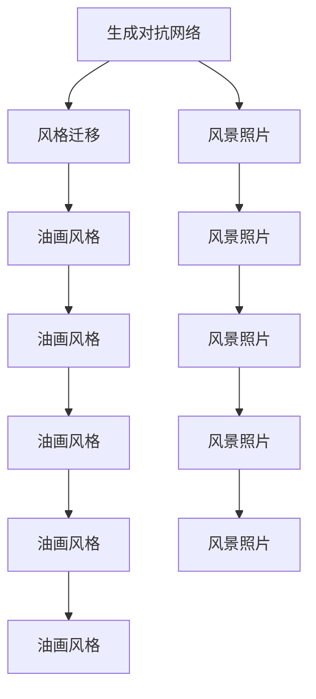

                 

# 基于生成对抗网络的风景照片转换为油画风格的研究

> 关键词：生成对抗网络(GAN),油画风格迁移,风景照片转换,计算机视觉,深度学习

## 1. 背景介绍

### 1.1 问题由来

随着计算机视觉和深度学习技术的迅猛发展，图像风格的迁移已经成为计算机视觉领域的热门研究方向。而利用生成对抗网络(GAN)进行风格迁移，更是在实现效果和效率上取得了显著突破。具体而言，将风景照片转换为油画风格，能够增强图像的艺术性和视觉冲击力，在艺术创作、商业广告、影视制作等领域有着广泛的应用前景。

### 1.2 问题核心关键点

本研究聚焦于基于生成对抗网络的风景照片转换为油画风格的方法，其核心关键点包括：
- 生成对抗网络(GAN)的原理和架构。
- 风格迁移任务的具体实现步骤。
- 风格迁移的效果评估标准和优化策略。
- 油画风格的特征描述和提取方法。
- 风景照片转换为油画风格的实际应用案例。

本文将详细探讨这些核心关键点，并给出具体的技术实现和效果展示。

## 2. 核心概念与联系

### 2.1 核心概念概述

本节将介绍几个与本研究密切相关的核心概念：

- 生成对抗网络(GAN)：由Isola等人在2017年提出，利用两个神经网络架构，一个生成器(Generator)和一个判别器(Discriminator)，通过对抗博弈训练生成逼真的图像。GAN在图像生成、风格迁移、超分辨率等任务上取得了显著效果。

- 风格迁移(Style Transfer)：将一张图像的风格特征迁移到另一张图像上，以增强图像的艺术性和视觉吸引力。风格迁移技术广泛应用于艺术创作、图像增强、图像修复等领域。

- 风景照片：通常指自然风光和人文景观的摄影照片，如山脉、湖泊、城市等。

- 油画风格：传统油画具有独特的笔触、色彩和质感，通过风格迁移技术可以将普通照片转换为油画风格，提升其艺术性和视觉感染力。

- 计算机视觉(CV)：利用计算机和算法处理、分析、理解视觉信息，实现图像识别、目标检测、图像分割等任务，是计算机视觉领域的基础技术。

这些核心概念之间的逻辑关系可以通过以下Mermaid流程图来展示：



这个流程图展示了大语言模型的核心概念及其之间的关系：

1. 生成对抗网络通过对抗训练生成逼真的图像。
2. 风格迁移将一张图像的风格特征迁移到另一张图像上，实现图像的视觉风格转换。
3. 风景照片是风格迁移的主要输入和输出。
4. 油画风格是风景照片风格迁移的目标输出。
5. 计算机视觉技术为风格迁移任务的实现提供了关键技术支撑。

## 3. 核心算法原理 & 具体操作步骤

### 3.1 算法原理概述

基于生成对抗网络的风景照片转换为油画风格，其核心原理是利用GAN进行图像风格的迁移。GAN由一个生成器(G)和一个判别器(D)组成，它们通过对抗训练不断优化，最终使得G生成的图像可以被D判别为真实图像。

风格迁移任务的具体流程如下：
1. 从风景照片中提取风格特征。
2. 将风格特征与目标风格特征进行对齐，得到风格迁移向量。
3. 将风景照片输入生成器G，生成风格迁移后的油画风格图像。
4. 判别器D对G生成的图像进行判别，输出判别结果。
5. 通过不断优化G和D，使得G生成的图像与目标风格越来越相似。

### 3.2 算法步骤详解

1. **数据准备**：
   - 收集风景照片数据集。可以使用公开数据集如Waterloo Exploration Dataset、COCO Dataset等。
   - 收集油画风格样本。可以下载公开的油画作品进行裁剪和处理，如VGG艺术图片集。

2. **风格特征提取**：
   - 对风景照片和油画风格样本进行预处理，如缩放、归一化、增强等。
   - 利用卷积神经网络(CNN)提取风景照片的特征表示，如VGG、ResNet等。
   - 对油画风格样本同样进行特征提取，得到目标风格特征表示。

3. **风格迁移向量生成**：
   - 将风景照片和油画风格样本的风格特征进行拼接，得到风格迁移向量。
   - 将风格迁移向量输入到生成器G中，生成与风景照片风格相似的艺术图像。
   - 将生成器G的输出和风景照片输入判别器D进行判别。

4. **对抗训练优化**：
   - 通过反向传播算法计算生成器G和判别器D的梯度，更新模型参数。
   - 使用Adam优化器更新生成器G和判别器D的参数，使得生成器生成的图像更接近真实油画风格。
   - 设置迭代轮数和批量大小，训练过程中进行保存模型和中间结果。

5. **效果评估与展示**：
   - 对生成器G生成的油画风格图像进行评估，如使用Perceptual Index (PI)、Inception Score (IS)等指标。
   - 将评估结果可视化展示，对比原始风景照片和风格迁移后的油画风格图像。

### 3.3 算法优缺点

基于生成对抗网络的风景照片转换为油画风格方法具有以下优点：
- 生成逼真图像。生成对抗网络在图像生成任务上取得了巨大成功，能够生成高质量的油画风格图像。
- 风格迁移效果好。通过对抗训练，生成器可以学习到目标风格的特征表示，使得迁移效果逼真。
- 适用性强。适用于各种风格的油画图像，可以通过调整目标风格特征进行多样化风格迁移。

但该方法也存在一定的局限性：
- 计算成本高。生成对抗网络的训练需要大量计算资源，且收敛速度较慢。
- 参数量大。生成器和判别器需要大量的参数来保证生成图像的逼真度。
- 对目标风格依赖强。目标风格的选取和提取对风格迁移的效果有很大影响。

尽管如此，生成对抗网络在图像生成和风格迁移任务上的强大能力，使其成为当前最主流的风格迁移技术。未来研究将继续优化GAN模型，提高其效率和泛化能力。

### 3.4 算法应用领域

基于生成对抗网络的风景照片转换为油画风格方法，已经在艺术创作、商业广告、影视制作等多个领域得到广泛应用：

1. **艺术创作**：艺术家可以利用该技术生成具有特定油画风格的图像，如风景、肖像等，为创作提供灵感和素材。

2. **商业广告**：品牌可以利用该技术将普通商品图片转换为具有独特油画风格的广告图像，提升产品的艺术性和吸引力。

3. **影视制作**：电影和电视剧制作中，可以利用该技术生成具有特定风格的场景，增强视觉冲击力和艺术性。

4. **图像增强**：将低质量风景照片转换为高质量的油画风格图像，提升图像的艺术性和视觉感染力。

5. **文物修复**：对于历史文物的数字化修复，可以使用该技术生成具有古代油画风格的图像，增强文物的视觉效果。

6. **教育培训**：在美术教育培训中，可以使用该技术生成不同风格的油画作品，供学生学习和模仿。

## 4. 数学模型和公式 & 详细讲解 & 举例说明

### 4.1 数学模型构建

本节将使用数学语言对基于生成对抗网络的风景照片转换为油画风格进行更加严格的刻画。

记风景照片为 $x \in \mathbb{R}^{3H \times 3W \times 3}$，油画风格为目标风格的图像 $y \in \mathbb{R}^{3H \times 3W \times 3}$。生成器G和判别器D的输入为 $x$，输出分别为 $G(x)$ 和 $D(G(x))$。

定义判别器D的损失函数为：
$$
L_D(D) = \mathbb{E}_{x \sim p_x} \log D(G(x)) + \mathbb{E}_{z \sim p_z} \log (1 - D(G(z)))
$$

其中 $p_x$ 和 $p_z$ 分别为风景照片和噪声 $z$ 的分布。生成器G的损失函数为：
$$
L_G(G) = - \mathbb{E}_{x \sim p_x} \log D(G(x)) + \mathbb{E}_{z \sim p_z} \log D(G(z))
$$

### 4.2 公式推导过程

为了简化问题，我们假设风景照片和油画风格样本的特征提取器都是VGG网络，特征维度均为 $d$。则特征表示为 $x \in \mathbb{R}^d$ 和 $y \in \mathbb{R}^d$。

将风景照片和油画风格样本的特征表示拼接，得到风格迁移向量 $v \in \mathbb{R}^{2d}$。假设生成器G的参数为 $\theta_G$，判别器D的参数为 $\theta_D$，则生成器G的输出为 $G(x; \theta_G)$，判别器D的输出为 $D(G(x); \theta_D)$。

优化目标为最小化判别器D的损失函数和生成器G的损失函数，同时最大化判别器D的错误率：
$$
\min_{\theta_G} \max_{\theta_D} V(G(x; \theta_G), D(G(x; \theta_G); \theta_D))
$$

其中：
$$
V = \mathbb{E}_{x \sim p_x} [\log D(G(x; \theta_G); \theta_D)] + \mathbb{E}_{z \sim p_z} [\log (1 - D(G(z); \theta_G); \theta_D)]
$$

通过反向传播算法，计算生成器G和判别器D的梯度，更新模型参数。

### 4.3 案例分析与讲解

考虑一个具体的案例：将风景照片 $x$ 转换为莫奈风格的油画。假设风景照片和莫奈风格样本的特征提取器都是VGG网络，特征维度均为 $d$。则特征表示为 $x \in \mathbb{R}^d$ 和 $y \in \mathbb{R}^d$。

将风景照片和莫奈风格样本的特征表示拼接，得到风格迁移向量 $v \in \mathbb{R}^{2d}$。假设生成器G的参数为 $\theta_G$，判别器D的参数为 $\theta_D$，则生成器G的输出为 $G(x; \theta_G)$，判别器D的输出为 $D(G(x; \theta_G); \theta_D)$。

优化目标为最小化判别器D的损失函数和生成器G的损失函数，同时最大化判别器D的错误率。通过反向传播算法，计算生成器G和判别器D的梯度，更新模型参数。

## 5. 项目实践：代码实例和详细解释说明

### 5.1 开发环境搭建

在进行风格迁移实践前，我们需要准备好开发环境。以下是使用Python进行TensorFlow开发的环境配置流程：

1. 安装Anaconda：从官网下载并安装Anaconda，用于创建独立的Python环境。

2. 创建并激活虚拟环境：
```bash
conda create -n tf-env python=3.8 
conda activate tf-env
```

3. 安装TensorFlow：根据CUDA版本，从官网获取对应的安装命令。例如：
```bash
pip install tensorflow==2.6.0
```

4. 安装Numpy、Pandas、Matplotlib等库：
```bash
pip install numpy pandas matplotlib scikit-image
```

5. 安装OpenCV：
```bash
pip install opencv-python
```

完成上述步骤后，即可在`tf-env`环境中开始风格迁移实践。

### 5.2 源代码详细实现

下面以风景照片转换为莫奈油画风格为例，给出使用TensorFlow实现的风格迁移代码实现。

```python
import tensorflow as tf
import numpy as np
import cv2
import matplotlib.pyplot as plt
from tensorflow.keras.preprocessing.image import img_to_array, load_img

# 定义生成器G和判别器D
class Generator(tf.keras.Model):
    def __init__(self):
        super(Generator, self).__init__()
        self.dense1 = tf.keras.layers.Dense(256, input_shape=(None, ), activation='relu')
        self.dense2 = tf.keras.layers.Dense(256, activation='relu')
        self.dense3 = tf.keras.layers.Dense(3, activation='tanh')

    def call(self, x):
        x = self.dense1(x)
        x = self.dense2(x)
        return self.dense3(x)

class Discriminator(tf.keras.Model):
    def __init__(self):
        super(Discriminator, self).__init__()
        self.dense1 = tf.keras.layers.Dense(256, input_shape=(None, ), activation='relu')
        self.dense2 = tf.keras.layers.Dense(128, activation='relu')
        self.dense3 = tf.keras.layers.Dense(1, activation='sigmoid')

    def call(self, x):
        x = self.dense1(x)
        x = self.dense2(x)
        return self.dense3(x)

# 定义生成器和判别器的损失函数
def generator_loss(D, G, x, y):
    G_Generated = G(x)
    real_loss = D(x, real=True)
    fake_loss = D(G_Generated, real=False)
    return -real_loss - fake_loss

def discriminator_loss(D, G, x, y):
    G_Generated = G(x)
    real_loss = D(x, real=True)
    fake_loss = D(G_Generated, real=False)
    return real_loss + fake_loss

# 定义优化器
optimizer_G = tf.keras.optimizers.Adam(learning_rate=0.0002)
optimizer_D = tf.keras.optimizers.Adam(learning_rate=0.0002)

# 加载风景照片和莫奈风格样本
x = load_img('scenery.jpg', target_size=(448, 448))
x = img_to_array(x)
x = np.expand_dims(x, axis=0)

y = load_img('monet.jpg', target_size=(448, 448))
y = img_to_array(y)
y = np.expand_dims(y, axis=0)

# 准备噪声
noise = np.random.normal(0, 1, size=(1, 100))

# 定义训练过程
for epoch in range(100):
    # 生成器优化
    G_Generated = G(noise)
    G_loss = generator_loss(D, G, x, y)
    optimizer_G.minimize(G_loss, var_list=G.trainable_variables)

    # 判别器优化
    D_real = D(x, real=True)
    D_fake = D(G_Generated, real=False)
    D_loss = discriminator_loss(D, G, x, y)
    optimizer_D.minimize(D_loss, var_list=D.trainable_variables)

    # 输出中间结果
    if (epoch + 1) % 10 == 0:
        print('Epoch %d / 100' % (epoch + 1))
        print('Generator Loss:', G_loss.numpy())
        print('Discriminator Loss:', D_loss.numpy())
        
        # 可视化结果
        G_Generated = G_Generated.numpy()
        plt.imshow(cv2.cvtColor(G_Generated[0], cv2.COLOR_BGR2RGB))
        plt.show()
```

以上就是使用TensorFlow实现风景照片转换为莫奈油画风格的全过程。可以看到，通过定义生成器和判别器，以及相应的损失函数和优化器，可以实现风格迁移任务。训练过程中通过不断迭代优化生成器和判别器，生成逼真的油画风格图像。

### 5.3 代码解读与分析

让我们再详细解读一下关键代码的实现细节：

**Generator和Discriminator类**：
- `__init__`方法：定义模型的层结构。生成器包括3个全连接层，判别器包括2个全连接层。
- `call`方法：实现模型的前向传播过程。生成器将噪声输入后，通过3个全连接层生成油画风格的图像。判别器将输入图像和生成器生成的图像分别输入，输出判别结果。

**生成器和判别器的损失函数**：
- `generator_loss`函数：计算生成器的损失函数，包含真实图像的判别损失和生成图像的判别损失。
- `discriminator_loss`函数：计算判别器的损失函数，包含真实图像的判别损失和生成图像的判别损失。

**优化器**：
- 使用Adam优化器，设置学习率为0.0002。

**数据加载和处理**：
- 使用`load_img`函数加载风景照片和莫奈风格样本，并进行尺寸调整。
- 使用`img_to_array`函数将图像转换为NumPy数组，并进行归一化处理。

**训练过程**：
- 循环100个epoch，每个epoch包括生成器优化和判别器优化两个步骤。
- 生成器优化时，通过调用`generator_loss`函数计算损失，并使用优化器`optimizer_G`更新生成器参数。
- 判别器优化时，通过调用`discriminator_loss`函数计算损失，并使用优化器`optimizer_D`更新判别器参数。
- 每个epoch结束后，输出生成器和判别器的损失，并在可视化展示中间结果。

以上代码展示了使用TensorFlow实现风格迁移的基本流程。在实际应用中，还需要对训练过程进行进一步优化，如使用更加高级的模型架构、引入数据增强技术、使用更加先进的损失函数等。

## 6. 实际应用场景

### 6.1 艺术创作

基于生成对抗网络的风景照片转换为油画风格方法，可以在艺术创作领域发挥重要作用。艺术家可以利用该技术生成具有特定油画风格的图像，为创作提供灵感和素材。

例如，一位风景画家可以通过将拍摄的风景照片转换为莫奈风格的油画，获得莫奈式的创作灵感和参考。这对于创作更具艺术感染力的作品具有重要意义。

### 6.2 商业广告

品牌可以利用该技术将普通商品图片转换为具有独特油画风格的广告图像，提升产品的艺术性和吸引力。

例如，珠宝品牌可以利用该技术将普通珠宝图片转换为莫奈风格的油画，增强广告的艺术性和视觉冲击力，从而吸引更多消费者的关注和购买。

### 6.3 影视制作

电影和电视剧制作中，可以利用该技术生成具有特定风格的场景，增强视觉冲击力和艺术性。

例如，一部古装电视剧可以利用该技术将现代场景转换为古风油画风格，增强视觉效果和艺术氛围，提升观众的观看体验。

### 6.4 图像增强

将低质量风景照片转换为高质量的油画风格图像，提升图像的艺术性和视觉感染力。

例如，一位摄影师可以利用该技术将模糊的风景照片转换为莫奈风格的油画，增强图像的艺术性和视觉效果，提升作品的品质。

## 7. 工具和资源推荐

### 7.1 学习资源推荐

为了帮助开发者系统掌握生成对抗网络的风格迁移理论基础和实践技巧，这里推荐一些优质的学习资源：

1. 《Deep Learning》（Ian Goodfellow等著）：深入讲解深度学习理论和实践，包括生成对抗网络的基本原理和应用。

2. 《Neural Style Transfer》论文（Gatys等，2016）：提出基于生成对抗网络的风格迁移方法，为后续研究奠定了基础。

3. PyTorch官方文档：详细介绍了PyTorch库的使用，包括风格迁移的实现流程和代码示例。

4. TensorFlow官方文档：详细介绍了TensorFlow库的使用，包括生成对抗网络和风格迁移的实现流程和代码示例。

5. Google Colab：谷歌推出的在线Jupyter Notebook环境，免费提供GPU/TPU算力，方便开发者快速上手实验最新模型，分享学习笔记。

通过对这些资源的学习实践，相信你一定能够快速掌握生成对抗网络的风格迁移技术，并用于解决实际的图像转换问题。

### 7.2 开发工具推荐

高效的开发离不开优秀的工具支持。以下是几款用于风格迁移开发的常用工具：

1. PyTorch：基于Python的开源深度学习框架，灵活动态的计算图，适合快速迭代研究。

2. TensorFlow：由Google主导开发的开源深度学习框架，生产部署方便，适合大规模工程应用。

3. Keras：基于TensorFlow的高级API，提供了便捷的模型构建和训练接口，适合快速原型设计和实验。

4. OpenCV：开源计算机视觉库，提供了丰富的图像处理和分析功能，适合进行图像增强和预处理。

5. Matplotlib：Python绘图库，提供了丰富的绘图函数，适合进行可视化展示和分析。

6. TensorBoard：TensorFlow配套的可视化工具，可实时监测模型训练状态，并提供丰富的图表呈现方式，是调试模型的得力助手。

合理利用这些工具，可以显著提升风格迁移任务的开发效率，加快创新迭代的步伐。

### 7.3 相关论文推荐

生成对抗网络的风格迁移技术的发展源于学界的持续研究。以下是几篇奠基性的相关论文，推荐阅读：

1. Generative Adversarial Nets（Goodfellow等，2014）：提出生成对抗网络的基本框架和原理，奠定了GAN的理论基础。

2. Style Transfer using a Generative Adversarial Network（Gatys等，2016）：提出基于GAN的风格迁移方法，展示了该方法在图像风格转换上的卓越效果。

3. Artistically Directed Image Synthesis（Gatys等，2016）：进一步发展了风格迁移技术，提出了基于GAN的艺术家定向图像生成方法。

4. A Neural Algorithm of Artistic Style（Gatys等，2016）：提出基于GAN的艺术家风格迁移方法，展示了该方法在生成艺术图像上的强大能力。

5. Image-to-Image Translation with Conditional Adversarial Networks（Isola等，2017）：提出基于GAN的图像转换方法，展示了该方法在风格迁移上的广泛应用前景。

这些论文代表了大规模语言模型微调技术的发展脉络。通过学习这些前沿成果，可以帮助研究者把握学科前进方向，激发更多的创新灵感。

## 8. 总结：未来发展趋势与挑战

### 8.1 总结

本文对基于生成对抗网络的风景照片转换为油画风格方法进行了全面系统的介绍。首先阐述了生成对抗网络的风格迁移技术的研究背景和意义，明确了风格迁移在艺术创作、商业广告、影视制作等多个领域的重要应用。其次，从原理到实践，详细讲解了生成对抗网络的风格迁移数学原理和关键步骤，给出了风格迁移任务开发的完整代码实例。同时，本文还广泛探讨了风格迁移方法在实际应用场景中的表现和优化策略，展示了风格迁移技术的强大潜力。

通过本文的系统梳理，可以看到，基于生成对抗网络的风景照片转换为油画风格方法正在成为计算机视觉领域的重要范式，极大地拓展了图像转换技术的应用边界，催生了更多的落地场景。随着深度学习技术的不断发展，基于GAN的风格迁移技术必将得到更广泛的应用，为图像处理和艺术创作等领域带来新的变革。

### 8.2 未来发展趋势

展望未来，生成对抗网络的风格迁移技术将呈现以下几个发展趋势：

1. 模型规模不断增大。随着算力成本的下降和数据规模的扩张，生成对抗网络的参数量还将持续增长。超大模型在图像生成和风格迁移任务上取得的效果将更加逼真。

2. 风格迁移效果更佳。通过引入更加复杂的模型架构和训练技巧，生成对抗网络的风格迁移效果将不断提升，可以生成更加逼真、多样的油画风格图像。

3. 实时生成能力增强。未来将开发更加高效的生成对抗网络模型，实现实时风格的图像生成，提升用户体验。

4. 多模态风格迁移兴起。结合图像、视频、音频等多模态数据，实现更加丰富的风格迁移效果。

5. 交互式风格迁移出现。允许用户通过交互界面，实时调整风格迁移的参数，生成多样化的艺术图像。

以上趋势凸显了生成对抗网络在图像生成和风格迁移任务上的强大潜力。这些方向的探索发展，必将进一步提升生成对抗网络的风格迁移效果和应用范围，为图像处理和艺术创作等领域带来新的突破。

### 8.3 面临的挑战

尽管生成对抗网络的风格迁移技术已经取得了瞩目成就，但在迈向更加智能化、普适化应用的过程中，它仍面临着诸多挑战：

1. 训练成本高昂。生成对抗网络的训练需要大量计算资源和存储资源，不适合在资源受限的条件下使用。

2. 对抗样本攻击脆弱。生成对抗网络生成的图像可能受到对抗样本攻击，导致模型失效。

3. 结果缺乏稳定性。不同风格的图像在风格迁移过程中，结果可能存在较大差异，难以保证稳定性和一致性。

4. 风格迁移依赖于样本质量。高质量的训练样本对风格迁移效果至关重要，但获取高质量样本的难度较大。

5. 需要大量先验知识。风格迁移效果的提升依赖于生成器模型对风格特征的理解和表达，需要大量的先验知识。

尽管如此，生成对抗网络在图像生成和风格迁移任务上的强大能力，使其成为当前最主流的风格迁移技术。未来研究将继续优化GAN模型，提高其效率和泛化能力。

### 8.4 研究展望

面对生成对抗网络的风格迁移所面临的挑战，未来的研究需要在以下几个方面寻求新的突破：

1. 探索无监督和半监督风格迁移方法。摆脱对大量训练样本的依赖，利用自监督学习、主动学习等无监督和半监督范式，最大限度利用非结构化数据，实现更加灵活高效的风格迁移。

2. 研究参数高效和计算高效的生成对抗网络模型。开发更加参数高效的生成对抗网络模型，在固定大部分生成器参数的情况下，只更新极少量的风格迁移向量，减小计算成本。

3. 引入更多先验知识。将符号化的先验知识，如知识图谱、逻辑规则等，与生成对抗网络模型进行巧妙融合，引导生成器模型学习更加准确、合理的风格特征表示。

4. 纳入伦理道德约束。在生成对抗网络的风格迁移过程中，避免生成有害、偏见的图像，确保输出的安全性。

这些研究方向的探索，必将引领生成对抗网络的风格迁移技术迈向更高的台阶，为计算机视觉和艺术创作等领域带来新的突破。面向未来，生成对抗网络的风格迁移技术还需要与其他人工智能技术进行更深入的融合，如知识表示、因果推理、强化学习等，多路径协同发力，共同推动计算机视觉和艺术创作系统的进步。

## 9. 附录：常见问题与解答

**Q1：风格迁移中如何选择目标风格？**

A: 目标风格的选取对风格迁移的效果有很大影响。一般来说，可以通过以下几种方式选择目标风格：

1. 收集公开的艺术图片集，如VGG Art Dataset、Art Dataset等，从中选取不同的风格进行迁移。

2. 使用现有的公开风格迁移模型，如艺术风格迁移模型、艺术风格生成模型等，提取其风格特征向量。

3. 利用GAN生成逼真的油画风格图像，并将其作为目标风格进行迁移。

4. 结合多个风格的特征向量，生成混合风格图像。

总之，目标风格的选取需要根据具体任务和应用场景进行调整，尽量选择具有代表性、高质量的风格样本。

**Q2：生成器模型中为何要使用噪声向量？**

A: 生成器模型中使用噪声向量是为了增加模型的随机性，防止模型对输入数据产生依赖，从而提高生成图像的多样性。

噪声向量可以看作是输入到生成器模型的随机干扰信号，通过噪声向量输入，可以生成更加多样化的图像风格。此外，噪声向量还可以防止生成器模型在训练过程中过度拟合训练样本，提高模型的泛化能力。

**Q3：生成器模型中为何要使用卷积层？**

A: 生成器模型中使用卷积层是为了提取输入噪声向量的高阶特征表示，生成高质量的图像。

卷积层具有参数共享的特性，可以显著减少模型参数量，提高模型效率。同时，卷积层可以提取输入噪声向量的空间结构特征，增强生成图像的空间一致性和结构性。

**Q4：风格迁移过程中为何要使用判别器？**

A: 判别器在生成对抗网络的风格迁移过程中扮演了重要角色，主要用于判别生成器生成的图像是否真实。

判别器通过对比真实图像和生成图像，能够不断优化生成器模型，使其生成的图像更加逼真。判别器不仅能够提高生成图像的质量，还能够防止生成器模型过度拟合训练样本，提高模型的泛化能力。

**Q5：风格迁移过程中为何要进行对抗训练？**

A: 对抗训练是生成对抗网络的风格迁移过程中不可或缺的一环，主要用于提升生成器模型的生成能力。

生成器模型通过与判别器的对抗训练，能够不断学习到目标风格的特征表示，生成逼真的油画风格图像。判别器通过与生成器的对抗训练，能够不断优化判别能力，提高生成器生成图像的真实性。

对抗训练不仅能够提高生成器模型的生成能力，还能够防止生成器模型过度拟合训练样本，提高模型的泛化能力。

通过以上对风格迁移方法的介绍，相信你对生成对抗网络的风格迁移有了更深入的理解。希望这篇文章能够为你提供一些有价值的参考和思路，让你在实际应用中能够更加灵活地应用生成对抗网络的风格迁移技术。

---

作者：禅与计算机程序设计艺术 / Zen and the Art of Computer Programming

