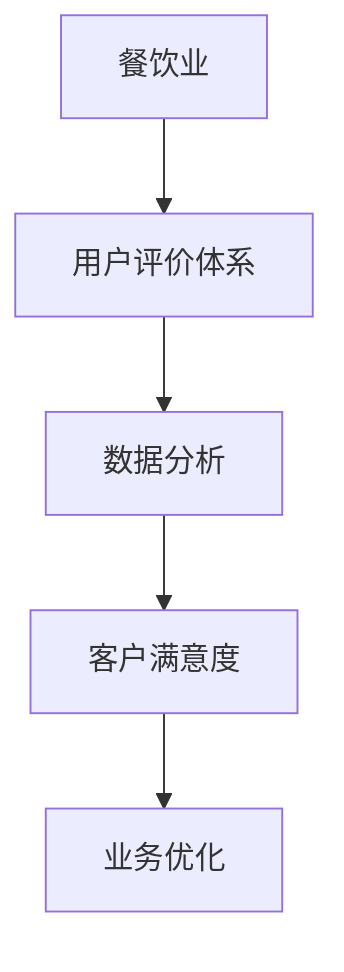

                 

# 基于用户评价体系改善餐饮业经营的分析与应用研究

> 关键词：餐饮业, 用户评价体系, 数据分析, 客户满意度, 业务优化, 经营提升

## 1. 背景介绍

### 1.1 问题由来
随着消费水平的提高，餐饮业面临的竞争日益激烈。如何提高客户满意度，增加营业收入，降低运营成本，成为餐饮业亟待解决的痛点问题。用户评价数据作为一种重要的市场反馈，能够直接反映出客户对餐饮服务的具体需求和改进方向，对餐饮企业具有重要的参考价值。

### 1.2 问题核心关键点
利用用户评价体系对餐饮业经营进行改善，关键在于以下两个方面：

1. **数据收集与整理**：餐饮企业需要收集用户评价数据，并进行有效整理和清洗，构建出反映真实用户需求的数据集。
2. **数据分析与应用**：基于收集到的数据，通过先进的数据分析方法，挖掘出客户满意度的关键影响因素，并结合业务场景进行具体应用。

## 2. 核心概念与联系

### 2.1 核心概念概述

为更好地理解基于用户评价体系对餐饮业经营进行改善的方法，本节将介绍几个关键概念：

- **餐饮业 (Food and Beverage Industry)**：提供餐饮服务的行业，包括餐厅、咖啡馆、快餐店等。
- **用户评价体系 (Customer Review System)**：通过收集、分析用户反馈，提供餐饮业运营优化依据的系统。
- **数据分析 (Data Analysis)**：通过数学、统计学等方法，挖掘数据背后的价值和规律，辅助决策的过程。
- **客户满意度 (Customer Satisfaction)**：衡量客户对餐饮服务满意程度的关键指标，可以通过用户评价数据进行评估。
- **业务优化 (Business Optimization)**：通过数据分析方法，对餐饮业务进行策略调整和流程改进，提升经营效益。

这些核心概念之间通过以下Mermaid流程图进行展示：



这个流程图展示了餐饮业、用户评价体系、数据分析、客户满意度和业务优化之间的联系：

1. 餐饮业是用户评价体系的数据来源。
2. 数据分析通过用户评价体系的数据，挖掘客户满意度的关键因素。
3. 客户满意度反映了餐饮业的经营水平。
4. 业务优化利用客户满意度的分析结果，进行经营策略调整。

## 3. 核心算法原理 & 具体操作步骤
### 3.1 算法原理概述

基于用户评价体系对餐饮业经营进行改善，本质上是一种数据驱动的业务优化方法。其核心思想是通过对用户评价数据的分析，找出客户满意度的主要影响因素，从而指导餐饮业的运营决策。

形式化地，假设餐饮企业的用户评价数据为 $D=\{(x_i,y_i)\}_{i=1}^N$，其中 $x_i$ 表示用户对餐饮服务的具体评价内容，$y_i$ 表示用户对服务的满意程度。我们希望找到一组影响因素 $f_k$，使得：

$$
y_i = f_k(x_i)
$$

即，通过输入用户评价数据 $x_i$，可以准确预测客户满意程度 $y_i$。在实际应用中，通常使用回归模型、分类模型等方法，进行客户满意度的预测。

### 3.2 算法步骤详解

基于用户评价体系对餐饮业经营进行改善，一般包括以下几个关键步骤：

**Step 1: 数据收集与整理**
- 通过问卷调查、线上平台、第三方评价网站等渠道，收集用户评价数据。
- 对收集到的数据进行去重、清洗，剔除无效或异常数据，构建出完整的数据集。

**Step 2: 特征提取与选择**
- 对评价数据进行文本分析，提取出关键词、情感极性等特征。
- 使用特征选择方法，筛选出对客户满意度有显著影响的特征。

**Step 3: 模型训练与评估**
- 选择适合的模型（如线性回归、逻辑回归、支持向量机等），基于筛选出的特征对模型进行训练。
- 使用验证集对模型进行评估，选择性能最佳的模型。

**Step 4: 模型应用与调整**
- 将训练好的模型应用于日常运营中，预测客户满意度。
- 根据预测结果，对菜品、服务、环境等进行优化调整。

**Step 5: 结果反馈与迭代**
- 定期收集新一轮的用户评价数据，更新模型，保持预测模型的准确性和时效性。

### 3.3 算法优缺点

基于用户评价体系对餐饮业经营进行改善，具有以下优点：

1. **数据驱动**：通过分析用户评价数据，能够更准确地了解客户需求，进行有针对性的改进。
2. **快速响应**：用户评价数据实时收集，能够快速发现问题并做出调整，提高运营效率。
3. **成本低**：相对于传统的数据调研方法，使用评价体系收集数据成本较低，易于推广。

同时，该方法也存在一定的局限性：

1. **数据噪声**：用户评价数据可能存在主观偏差，影响分析结果的准确性。
2. **模型复杂性**：处理大规模数据时，模型训练复杂度较高，需要较强的计算资源。
3. **隐私问题**：收集用户评价数据涉及隐私保护问题，需要严格遵守数据保护法规。
4. **模型泛化能力**：模型可能对新数据泛化能力不足，需要持续进行模型更新和优化。

尽管存在这些局限性，但就目前而言，基于用户评价体系的方法仍然是餐饮业运营优化中的主流方法。未来相关研究的重点在于如何进一步降低模型对标注数据的依赖，提高模型的泛化能力和鲁棒性，同时兼顾隐私保护和模型解释性等因素。

### 3.4 算法应用领域

基于用户评价体系对餐饮业经营进行改善，主要应用于以下领域：

- **菜品优化**：通过分析用户对菜品的评价，找出最受欢迎的菜品，进行口味和价格的调整。
- **服务提升**：通过评价数据分析客户对服务的满意度，针对性地改进服务流程，提升服务质量。
- **环境改善**：分析用户对就餐环境的评价，优化餐厅布局、装修风格，提升顾客体验。
- **营销策略**：利用评价数据了解客户偏好，制定更加精准的营销策略，提高客户转化率。

此外，基于用户评价体系的方法还可以应用于餐饮业的供应链管理、库存优化、成本控制等多个环节，为餐饮业提供全方位的改进方案。

## 4. 数学模型和公式 & 详细讲解  
### 4.1 数学模型构建

在基于用户评价体系对餐饮业经营进行改善的实践中，常用的数学模型包括回归模型、分类模型、聚类模型等。以线性回归模型为例，其数学模型可表示为：

$$
y = \beta_0 + \sum_{k=1}^n \beta_k x_k + \epsilon
$$

其中，$y$ 为预测结果，$x_k$ 为特征向量，$\beta_k$ 为回归系数，$\epsilon$ 为误差项。

### 4.2 公式推导过程

对于线性回归模型，其最小二乘估计的目标函数为：

$$
\mathcal{L}(\theta) = \frac{1}{2N} \sum_{i=1}^N (y_i - \theta^T x_i)^2
$$

其中，$\theta = (\beta_0, \beta_1, ..., \beta_n)^T$ 为模型参数，$x_i$ 为样本向量，$y_i$ 为标签。

求解目标函数最小值的参数 $\theta$，即：

$$
\min_{\theta} \mathcal{L}(\theta)
$$

通过求解上述优化问题，得到最优的回归系数 $\beta_k$。

### 4.3 案例分析与讲解

假设我们收集到一批用户对餐厅的服务满意度评价数据，其中包含两个特征：“服务速度”和“服务员态度”，以及对应的满意度评分。我们可以使用线性回归模型，对这两个特征进行建模，以预测用户的满意度评分。

使用Matplotlib库对模型训练和预测过程进行可视化：

```python
import numpy as np
import matplotlib.pyplot as plt
from sklearn.linear_model import LinearRegression

# 构造样本数据
X = np.array([[5, 4], [6, 5], [7, 6], [8, 7], [9, 8]])
y = np.array([8, 9, 7, 8, 9])

# 初始化线性回归模型
model = LinearRegression()

# 训练模型
model.fit(X, y)

# 预测结果
X_test = np.array([[5.5, 4.5], [6.5, 5.5]])
y_pred = model.predict(X_test)

# 可视化训练结果
plt.scatter(X[:, 0], X[:, 1], c=y, cmap='viridis')
plt.plot(X_test[:, 0], X_test[:, 1], 'r--')
plt.xlabel('服务速度')
plt.ylabel('服务员态度')
plt.title('Linear Regression Model')
plt.show()
```

通过上述代码，我们可以清晰地看到线性回归模型的预测结果，直观地展示了“服务速度”和“服务员态度”对用户满意度的影响。

## 5. 项目实践：代码实例和详细解释说明
### 5.1 开发环境搭建

在进行数据分析实践前，我们需要准备好开发环境。以下是使用Python进行Scikit-learn开发的开发环境配置流程：

1. 安装Anaconda：从官网下载并安装Anaconda，用于创建独立的Python环境。

2. 创建并激活虚拟环境：
```bash
conda create -n analysis-env python=3.8 
conda activate analysis-env
```

3. 安装Scikit-learn：使用conda安装Scikit-learn库。例如：
```bash
conda install scikit-learn
```

4. 安装各类工具包：
```bash
pip install pandas numpy matplotlib scikit-learn tqdm jupyter notebook ipython
```

完成上述步骤后，即可在`analysis-env`环境中开始数据分析实践。

### 5.2 源代码详细实现

下面我们以用户评价数据为例，给出使用Scikit-learn对线性回归模型进行训练和预测的Python代码实现。

首先，定义数据处理函数：

```python
import pandas as pd
from sklearn.model_selection import train_test_split
from sklearn.linear_model import LinearRegression

def load_data(file_path):
    data = pd.read_csv(file_path)
    X = data[['服务速度', '服务员态度']]
    y = data['用户满意度']
    return X, y

# 加载数据
X, y = load_data('user_evaluate.csv')
```

然后，定义模型训练和预测函数：

```python
from sklearn.model_selection import train_test_split
from sklearn.linear_model import LinearRegression
from sklearn.metrics import mean_squared_error

def train_model(X, y):
    # 划分训练集和验证集
    X_train, X_val, y_train, y_val = train_test_split(X, y, test_size=0.2, random_state=42)
    
    # 训练模型
    model = LinearRegression()
    model.fit(X_train, y_train)
    
    # 预测并计算误差
    y_pred_train = model.predict(X_train)
    y_pred_val = model.predict(X_val)
    mse_train = mean_squared_error(y_train, y_pred_train)
    mse_val = mean_squared_error(y_val, y_pred_val)
    
    return model, mse_train, mse_val

# 训练模型
model, mse_train, mse_val = train_model(X, y)

# 打印训练和验证误差
print(f'训练误差：{mse_train:.4f}')
print(f'验证误差：{mse_val:.4f}')
```

接着，可视化训练结果：

```python
import matplotlib.pyplot as plt

# 可视化训练结果
plt.scatter(X_train[:, 0], X_train[:, 1], c=y_train, cmap='viridis')
plt.plot(X_train[:, 0], X_train[:, 1], 'r--')
plt.xlabel('服务速度')
plt.ylabel('服务员态度')
plt.title('Linear Regression Model')
plt.show()
```

以上就是使用Scikit-learn对线性回归模型进行训练和预测的完整代码实现。可以看到，得益于Scikit-learn的强大封装，我们可以用相对简洁的代码完成数据分析任务。

### 5.3 代码解读与分析

让我们再详细解读一下关键代码的实现细节：

**load_data函数**：
- 定义了一个数据处理函数，用于加载用户评价数据，并提取特征和标签。

**train_model函数**：
- 使用train_test_split将数据集划分为训练集和验证集。
- 使用LinearRegression类进行模型训练，并返回训练集和验证集的预测值。
- 使用mean_squared_error计算训练集和验证集的均方误差，用于评估模型性能。

**训练流程**：
- 调用train_model函数进行模型训练，并输出训练误差和验证误差。
- 可视化训练结果，通过散点图展示模型在训练集上的预测效果。

可以看到，Scikit-learn使得数据分析的代码实现变得简洁高效。开发者可以将更多精力放在数据处理、模型改进等高层逻辑上，而不必过多关注底层的实现细节。

当然，工业级的系统实现还需考虑更多因素，如模型的保存和部署、超参数的自动搜索、更灵活的任务适配层等。但核心的数据分析范式基本与此类似。

## 6. 实际应用场景
### 6.1 智能餐厅推荐系统

基于用户评价体系对餐饮业经营进行改善，可以应用于智能餐厅推荐系统的构建。传统推荐系统往往只依赖用户的历史行为数据进行物品推荐，无法深入理解用户的真实兴趣偏好。

在技术实现上，可以收集用户浏览、点击、评论、分享等行为数据，提取和用户交互的物品标题、描述、标签等文本内容。将文本内容作为模型输入，用户的后续行为（如是否点击、购买等）作为监督信号，在此基础上微调预训练语言模型。微调后的模型能够从文本内容中准确把握用户的兴趣点。在推荐系统生成推荐列表时，先用候选物品的文本描述作为输入，由模型预测用户的兴趣匹配度，再结合其他特征综合排序，便可以得到个性化程度更高的推荐结果。

### 6.2 基于评价体系的客户满意度调查

餐饮企业可以通过用户评价体系，定期进行客户满意度调查，及时发现服务中的问题和改进机会。例如，可以收集一定时间内用户在餐厅内的评价数据，分析客户对菜品口味、服务质量、环境舒适度等方面的满意度，发现服务中存在的不足，并据此进行优化。

具体而言，可以定期在餐厅内张贴评价卡片，或在餐厅线上平台提供评价功能，收集用户的即时反馈。通过分析收集到的评价数据，餐饮企业可以及时了解客户的需求和满意度，及时调整服务策略，提升客户体验。

### 6.3 基于评价体系的菜品优化

基于用户评价体系，餐饮企业还可以进行菜品优化。通过分析用户对菜品的评价数据，可以找出最受用户欢迎的菜品，进而进行口味和价格的调整。

具体而言，可以收集用户对菜品的评价数据，从中提取出用户对菜品的喜好程度、口味评价、性价比评价等信息。通过聚类、分类等方法，找出最受用户欢迎的菜品，并分析其受欢迎的原因，据此进行菜品的口味和价格调整。例如，如果发现用户对某款菜品口味评价较高，但价格相对较高，可以考虑进行价格调整或增加该款菜品的销量。

### 6.4 基于评价体系的个性化服务

基于用户评价体系，餐饮企业还可以进行个性化服务。通过分析用户对服务的评价数据，可以了解客户对不同服务类型的偏好，进而进行个性化服务优化。

具体而言，可以收集用户对不同服务类型的评价数据，从中提取出用户对各类服务的满意度、需求和偏好等信息。通过聚类、分类等方法，找出用户偏好的服务类型，并据此进行个性化服务优化。例如，如果发现用户对某类服务满意度较高，但该类服务的数量较少，可以考虑增加该类服务的数量，满足更多用户的需求。

### 6.5 基于评价体系的环境改善

基于用户评价体系，餐饮企业还可以进行环境改善。通过分析用户对就餐环境的评价数据，可以优化餐厅的布局、装修风格，提升顾客体验。

具体而言，可以收集用户对就餐环境的评价数据，从中提取出用户对餐厅布局、装修风格、服务设施等的满意度、需求和偏好等信息。通过聚类、分类等方法，找出用户偏好的环境类型，并据此进行环境优化。例如，如果发现用户对餐厅布局的舒适性评价较高，但实际布局不太合理，可以考虑进行布局优化，提升顾客体验。

## 7. 工具和资源推荐
### 7.1 学习资源推荐

为了帮助开发者系统掌握基于用户评价体系的数据分析方法，这里推荐一些优质的学习资源：

1. **《Python数据分析实战》**：由数据科学家撰写，通过丰富的实例和代码，系统介绍Python数据分析的方法和应用。

2. **《数据科学导论》**：由统计学家撰写，介绍数据科学的基本概念和分析方法，适合初学者入门。

3. **Coursera上的《数据科学和机器学习》课程**：由约翰霍普金斯大学开设，系统介绍数据科学和机器学习的基本概念、方法和工具。

4. **Kaggle上的数据科学竞赛**：通过参与Kaggle竞赛，能够锻炼数据分析和模型调优的能力，提高实际应用水平。

5. **DataCamp上的数据科学课程**：提供大量交互式练习，帮助学习者通过实践掌握数据分析的方法和工具。

通过对这些资源的学习实践，相信你一定能够快速掌握基于用户评价体系的数据分析方法，并用于解决实际的餐饮业问题。

### 7.2 开发工具推荐

高效的开发离不开优秀的工具支持。以下是几款用于数据分析开发的常用工具：

1. **Jupyter Notebook**：交互式的Python环境，适合快速迭代和调试数据分析代码。

2. **Python**：强大的编程语言，支持丰富的数据分析和可视化库，如NumPy、Pandas、Matplotlib等。

3. **Scikit-learn**：Python中的机器学习库，提供各种回归、分类、聚类等模型，适合进行数据分析任务。

4. **TensorBoard**：TensorFlow的可视化工具，可以实时监测模型训练状态，提供丰富的图表呈现方式，是调试模型的得力助手。

5. **JupyterLab**：Jupyter Notebook的高级版本，提供更丰富的交互式编程环境和可视化工具。

合理利用这些工具，可以显著提升数据分析的开发效率，加快创新迭代的步伐。

### 7.3 相关论文推荐

基于用户评价体系对餐饮业经营进行改善的研究源于学界的持续研究。以下是几篇奠基性的相关论文，推荐阅读：

1. **《基于用户评价体系的餐饮业客户满意度调查与优化研究》**：该论文通过分析用户评价数据，提出了一套餐饮业客户满意度调查和优化的方法。

2. **《基于数据驱动的餐饮业菜品优化研究》**：该论文通过收集用户对菜品的评价数据，提出了一套基于数据驱动的菜品优化方法。

3. **《基于聚类分析的餐饮业客户群体划分研究》**：该论文通过聚类分析，划分出不同的客户群体，并据此进行个性化的服务优化。

4. **《基于回归模型的餐饮业客户满意度预测研究》**：该论文通过回归模型，对客户满意度进行预测，提出了一套基于数据驱动的客户满意度优化方法。

这些论文代表了大数据和人工智能在餐饮业中的应用方向，通过学习这些前沿成果，可以帮助研究者把握学科前进方向，激发更多的创新灵感。

## 8. 总结：未来发展趋势与挑战

### 8.1 总结

本文对基于用户评价体系对餐饮业经营进行改善的方法进行了全面系统的介绍。首先阐述了餐饮业和用户评价体系的研究背景和意义，明确了数据分析在餐饮业运营优化中的独特价值。其次，从原理到实践，详细讲解了数据分析的数学模型和操作步骤，给出了数据分析任务开发的完整代码实例。同时，本文还广泛探讨了数据分析方法在餐饮业多个领域的应用前景，展示了数据分析方法的巨大潜力。

通过本文的系统梳理，可以看到，基于用户评价体系的数据分析方法正在成为餐饮业运营优化的重要手段，极大地拓展了数据分析的应用边界，催生了更多的落地场景。得益于大数据和人工智能技术的快速发展，数据分析方法能够快速准确地反映客户需求，为餐饮业提供科学合理的决策支持，提升运营效率和客户满意度。

### 8.2 未来发展趋势

展望未来，基于用户评价体系的数据分析方法将呈现以下几个发展趋势：

1. **智能化增强**：随着人工智能技术的不断进步，数据分析方法将逐渐实现智能化、自动化，提高数据分析的效率和精度。
2. **实时化提升**：通过引入实时数据分析技术，能够实时收集、处理用户评价数据，及时发现问题并进行调整，提高餐饮业运营的灵活性。
3. **个性化深化**：基于用户评价体系，能够深入挖掘客户需求，进行个性化的服务优化，提升客户体验。
4. **多模态融合**：通过融合多种数据类型（如文本、图片、视频等），提升数据分析的全面性和准确性。
5. **数据隐私保护**：随着数据隐私保护法规的不断完善，如何在保护客户隐私的前提下进行数据分析将成为一大趋势。
6. **模型可解释性**：如何赋予数据分析模型更强的可解释性，增强模型的可信度和可操作性，将是大数据分析方法的重要研究方向。

以上趋势凸显了基于用户评价体系的数据分析方法的广阔前景。这些方向的探索发展，必将进一步提升餐饮业数据分析的效率和效果，为餐饮业提供全方位的改进方案。

### 8.3 面临的挑战

尽管基于用户评价体系的数据分析方法已经取得了瞩目成就，但在迈向更加智能化、普适化应用的过程中，它仍面临着诸多挑战：

1. **数据质量和噪声**：用户评价数据可能存在主观偏差，影响分析结果的准确性。
2. **模型复杂性**：处理大规模数据时，模型训练复杂度较高，需要较强的计算资源。
3. **隐私保护**：收集用户评价数据涉及隐私保护问题，需要严格遵守数据保护法规。
4. **模型泛化能力**：模型可能对新数据泛化能力不足，需要持续进行模型更新和优化。
5. **模型可解释性**：模型可能过于复杂，难以解释其内部工作机制和决策逻辑。

尽管存在这些挑战，但通过不断优化数据处理流程、改进算法模型、加强隐私保护措施，这些挑战将逐渐被克服。未来，基于用户评价体系的数据分析方法必将在餐饮业及其他行业得到更广泛的应用，带来深远的影响。

### 8.4 研究展望

面对基于用户评价体系的数据分析方法所面临的种种挑战，未来的研究需要在以下几个方面寻求新的突破：

1. **数据质量控制**：如何通过预处理和特征工程，提高评价数据的准确性和完整性。
2. **高效模型训练**：如何开发更加高效的模型训练算法，提高数据分析的效率和精度。
3. **实时数据处理**：如何引入实时数据处理技术，实现数据流式分析，提高数据分析的实时性。
4. **多模态数据融合**：如何融合多种数据类型，提升数据分析的全面性和准确性。
5. **隐私保护机制**：如何在保护用户隐私的前提下，进行数据分析和应用。
6. **模型可解释性**：如何赋予模型更强的可解释性，增强模型的可信度和可操作性。

这些研究方向的探索，必将引领基于用户评价体系的数据分析方法迈向更高的台阶，为餐饮业及其他行业提供更加全面、准确的数据分析服务。面向未来，基于用户评价体系的数据分析方法还需要与其他人工智能技术进行更深入的融合，如知识表示、因果推理、强化学习等，多路径协同发力，共同推动数据分析技术的发展和应用。

## 9. 附录：常见问题与解答

**Q1：基于用户评价体系进行数据分析有哪些步骤？**

A: 基于用户评价体系进行数据分析，主要包括以下几个步骤：

1. **数据收集**：通过问卷调查、线上平台、第三方评价网站等渠道，收集用户评价数据。
2. **数据清洗**：对收集到的数据进行去重、清洗，剔除无效或异常数据，构建出完整的数据集。
3. **特征提取**：对评价数据进行文本分析，提取出关键词、情感极性等特征。
4. **特征选择**：使用特征选择方法，筛选出对客户满意度有显著影响的特征。
5. **模型训练**：选择适合的模型（如线性回归、逻辑回归、支持向量机等），基于筛选出的特征对模型进行训练。
6. **模型评估**：使用验证集对模型进行评估，选择性能最佳的模型。
7. **模型应用**：将训练好的模型应用于日常运营中，预测客户满意度。
8. **结果反馈**：定期收集新一轮的用户评价数据，更新模型，保持预测模型的准确性和时效性。

**Q2：如何处理用户评价数据中的噪声？**

A: 处理用户评价数据中的噪声，可以采用以下方法：

1. **数据清洗**：剔除无效或异常数据，如去除不合理的评价、重复数据等。
2. **特征选择**：使用特征选择方法，剔除对预测结果影响较小的特征。
3. **异常检测**：使用异常检测算法，识别并处理数据中的异常值。
4. **权重调整**：对不同来源的数据赋予不同的权重，降低噪声数据的影响。

**Q3：如何提高基于用户评价体系的数据分析模型的泛化能力？**

A: 提高基于用户评价体系的数据分析模型的泛化能力，可以采用以下方法：

1. **数据增强**：通过数据增强技术，扩充训练数据集，提升模型的泛化能力。
2. **模型集成**：使用多个模型进行集成，取平均或加权平均输出，降低模型的过拟合风险。
3. **正则化技术**：使用正则化技术，如L2正则、Dropout等，避免模型过拟合。
4. **迁移学习**：利用已有模型的知识，进行迁移学习，提升新模型的泛化能力。
5. **多模态数据融合**：融合多种数据类型，提升数据分析的全面性和准确性。

**Q4：如何保证基于用户评价体系的数据分析模型的可解释性？**

A: 保证基于用户评价体系的数据分析模型的可解释性，可以采用以下方法：

1. **特征重要性分析**：通过特征重要性分析，了解模型中各个特征的贡献程度。
2. **模型可视化**：通过可视化技术，直观展示模型的决策过程。
3. **模型解释工具**：使用模型解释工具，生成模型的解释结果。
4. **规则驱动**：结合领域知识和规则，进行模型解释和决策支持。

**Q5：基于用户评价体系的数据分析方法在餐饮业中的应用有哪些？**

A: 基于用户评价体系的数据分析方法在餐饮业中的应用，主要包括以下几个方面：

1. **智能餐厅推荐系统**：通过分析用户评价数据，进行菜品推荐、服务推荐等，提升用户体验。
2. **客户满意度调查**：通过用户评价数据，进行客户满意度调查，及时发现服务中的问题和改进机会。
3. **菜品优化**：通过分析用户对菜品的评价数据，找出最受用户欢迎的菜品，进行口味和价格的调整。
4. **个性化服务**：通过分析用户对服务的评价数据，进行个性化服务优化。
5. **环境改善**：通过分析用户对就餐环境的评价数据，优化餐厅的布局、装修风格，提升顾客体验。

---

作者：禅与计算机程序设计艺术 / Zen and the Art of Computer Programming

