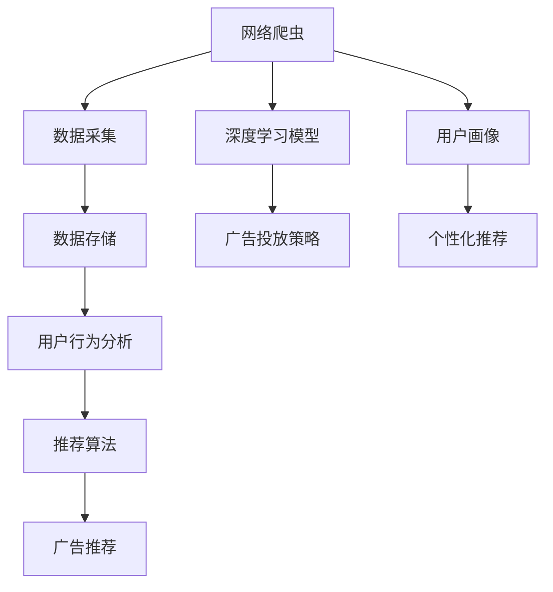

                 

# 基于网络爬虫的智能广告推荐

> 关键词：网络爬虫,智能广告推荐,用户画像,用户行为分析,深度学习模型,推荐算法,数据处理,广告投放策略

## 1. 背景介绍

### 1.1 问题由来
随着互联网的发展，网络广告已经成为企业进行市场推广的重要手段。然而，传统广告投放方式往往存在广告覆盖面不广、精准度不足、成本高等问题。智能广告推荐系统通过分析用户数据，为广告主提供个性化的广告投放方案，从而显著提升广告的转化率，降低广告成本。

### 1.2 问题核心关键点
智能广告推荐的核心在于构建精准的用户画像，并基于用户画像和行为数据进行个性化的广告推荐。用户画像包括用户的年龄、性别、兴趣、行为等属性，广告推荐算法则根据这些属性，预测用户对不同广告的反应，从而匹配最合适的广告。

### 1.3 问题研究意义
智能广告推荐系统的研究具有重要意义：

1. 精准广告投放：通过个性化的广告推荐，提高广告的精准度，避免无效曝光。
2. 提升广告效果：优化广告投放策略，提升广告的转化率和点击率，降低投放成本。
3. 数据驱动决策：利用用户数据，通过数据驱动的决策，提升广告投放的科学性和有效性。
4. 增强用户体验：提供与用户兴趣高度匹配的广告，提升用户体验，增加用户粘性。
5. 适应市场变化：动态调整广告策略，适应市场环境的变化，保持竞争优势。

## 2. 核心概念与联系

### 2.1 核心概念概述

为更好地理解智能广告推荐系统的核心技术，本节将介绍几个关键概念：

- 网络爬虫：通过编程自动获取网页内容，从而获取互联网上的各种数据信息。
- 用户画像：基于用户的行为数据、兴趣偏好等属性，建立用户特征向量，用于描述用户的基本属性和兴趣。
- 用户行为分析：分析用户在网络上的浏览、点击、购买等行为数据，挖掘用户的兴趣和偏好。
- 深度学习模型：利用多层神经网络，从大规模数据中学习复杂模式，用于广告推荐等任务的建模。
- 推荐算法：通过分析用户数据和广告特征，匹配最合适的广告推荐给用户，提升广告效果。
- 数据处理：对原始数据进行清洗、归一化、特征工程等操作，提高数据质量，便于模型训练。
- 广告投放策略：基于用户画像和广告数据，制定科学合理的广告投放策略，提升广告投放效果。

这些核心概念之间的逻辑关系可以通过以下Mermaid流程图来展示：



这个流程图展示了智能广告推荐系统的核心概念及其之间的关系：

1. 网络爬虫获取用户数据和广告数据。
2. 数据存储和处理为模型训练提供基础数据。
3. 用户画像和行为分析提取用户的基本属性和兴趣。
4. 深度学习模型基于用户画像和行为数据进行建模。
5. 推荐算法根据模型预测结果进行广告推荐。
6. 广告投放策略优化广告的投放效果。

这些概念共同构成了智能广告推荐系统的技术框架，为其构建提供清晰的思路。

## 3. 核心算法原理 & 具体操作步骤
### 3.1 算法原理概述

智能广告推荐系统主要基于用户画像和行为数据进行推荐，其核心算法包括深度学习模型和推荐算法。以下将详细介绍这两种算法的原理和操作步骤。

### 3.2 算法步骤详解

#### 3.2.1 深度学习模型
深度学习模型通常用于建模用户画像和行为数据之间的关系。在广告推荐中，常用的深度学习模型包括：

- 协同过滤：通过分析用户行为数据，找到与目标用户兴趣相似的用户，从而推荐这些用户喜欢的广告。
- 矩阵分解：将用户和广告表示为低维向量，通过矩阵分解方法，学习用户与广告之间的潜在关系。
- 神经网络：利用多层神经网络，从用户数据中学习复杂的特征表示，用于广告推荐等任务。

##### 3.2.1.1 协同过滤
协同过滤算法通常分为基于用户的协同过滤和基于物品的协同过滤两种方式。

基于用户的协同过滤算法的基本步骤为：

1. 构建用户-物品评分矩阵。
2. 计算相似度矩阵。
3. 根据相似度矩阵预测目标用户的评分。

具体实现时，可以使用基于矩阵分解的方法，如奇异值分解(SVD)、矩阵分解因子化(MF)等，来计算用户-物品评分矩阵和相似度矩阵。

##### 3.2.1.2 矩阵分解
矩阵分解方法的基本步骤为：

1. 将用户和广告表示为低维向量。
2. 分解用户-物品评分矩阵为两个低维矩阵的乘积。
3. 利用分解后的矩阵，预测用户对新广告的评分。

常用的矩阵分解方法包括奇异值分解(SVD)、奇异值分解(SVD)的变体(如ALS)、矩阵分解因子化(MF)等。

##### 3.2.1.3 神经网络
神经网络模型通常包括多层全连接神经网络、卷积神经网络(CNN)、循环神经网络(RNN)等。其基本步骤为：

1. 输入层：将用户行为数据转化为模型可接受的输入。
2. 隐藏层：通过多层神经网络，学习用户特征和广告特征之间的关系。
3. 输出层：将隐藏层的输出转化为对广告的评分或点击概率。

神经网络模型可以进一步优化为深度学习模型，如卷积神经网络(CNN)、循环神经网络(RNN)、长短期记忆网络(LSTM)等，以提高模型的表达能力和泛化能力。

#### 3.2.2 推荐算法
推荐算法通常包括基于内容的推荐和协同过滤推荐两种方式。

基于内容的推荐算法的基本步骤为：

1. 提取广告特征。
2. 根据用户画像和广告特征，计算用户对广告的兴趣。
3. 选择高兴趣的广告进行推荐。

常用的广告特征包括文本特征、图像特征、价格特征等。

协同过滤推荐算法的基本步骤为：

1. 构建用户-物品评分矩阵。
2. 计算相似度矩阵。
3. 根据相似度矩阵预测目标用户的评分。
4. 选择高评分的广告进行推荐。

常用的相似度计算方法包括余弦相似度、皮尔逊相关系数、Jaccard系数等。

##### 3.2.2.1 基于内容的推荐
基于内容的推荐算法的基本步骤为：

1. 提取广告特征。
2. 根据用户画像和广告特征，计算用户对广告的兴趣。
3. 选择高兴趣的广告进行推荐。

常用的广告特征包括文本特征、图像特征、价格特征等。

##### 3.2.2.2 协同过滤推荐
协同过滤推荐算法的基本步骤为：

1. 构建用户-物品评分矩阵。
2. 计算相似度矩阵。
3. 根据相似度矩阵预测目标用户的评分。
4. 选择高评分的广告进行推荐。

常用的相似度计算方法包括余弦相似度、皮尔逊相关系数、Jaccard系数等。

### 3.3 算法优缺点

智能广告推荐系统具有以下优点：

1. 精准广告投放：通过分析用户数据，提供个性化的广告推荐，提高广告的精准度。
2. 提升广告效果：优化广告投放策略，提升广告的转化率和点击率，降低投放成本。
3. 数据驱动决策：利用用户数据，通过数据驱动的决策，提升广告投放的科学性和有效性。
4. 增强用户体验：提供与用户兴趣高度匹配的广告，提升用户体验，增加用户粘性。
5. 适应市场变化：动态调整广告策略，适应市场环境的变化，保持竞争优势。

然而，智能广告推荐系统也存在一定的局限性：

1. 数据依赖：广告推荐系统高度依赖用户数据和广告数据，数据质量和数量对系统效果有较大影响。
2. 算法复杂：深度学习模型和推荐算法具有较高的计算复杂度，需要大量的计算资源和时间。
3. 模型解释性不足：深度学习模型通常被视为"黑盒"，难以解释其内部工作机制和决策逻辑。
4. 用户隐私问题：收集用户数据可能涉及用户隐私问题，需要严格遵守数据保护法规。
5. 广告质量问题：广告推荐算法可能存在算法偏见，影响广告投放效果。

尽管存在这些局限性，但就目前而言，智能广告推荐系统仍是广告投放的重要手段。未来相关研究的重点在于如何进一步降低数据依赖，提高模型的解释性，解决隐私问题，提升广告质量等。

### 3.4 算法应用领域

智能广告推荐系统在多个领域得到了广泛应用，例如：

- 电子商务：通过分析用户浏览、点击、购买等行为数据，推荐相关商品。
- 旅游行业：根据用户的兴趣和历史出行记录，推荐合适的旅游产品。
- 新闻媒体：基于用户的阅读习惯和兴趣，推荐相关新闻和资讯。
- 在线教育：根据学生的学习行为和知识水平，推荐合适的学习内容和教材。
- 游戏娱乐：分析用户的游戏行为和偏好，推荐相关的游戏内容和道具。

除了上述这些经典应用外，智能广告推荐系统还在广告公司、医疗健康、金融保险等领域得到了创新性应用，为各行业带来了显著的商业价值和社会效益。

## 4. 数学模型和公式 & 详细讲解 & 举例说明
### 4.1 数学模型构建

本节将使用数学语言对智能广告推荐系统的核心算法进行更加严格的刻画。

记用户画像为 $u$，广告特征为 $a$，用户-广告评分矩阵为 $R \in \mathbb{R}^{U \times A}$，其中 $U$ 为用户数，$A$ 为广告数。用户画像 $u$ 可以表示为 $u = [u_1, u_2, \dots, u_n] \in \mathbb{R}^n$，广告特征 $a$ 可以表示为 $a = [a_1, a_2, \dots, a_m] \in \mathbb{R}^m$。

定义用户对广告的评分函数为 $f: \mathbb{R}^n \times \mathbb{R}^m \rightarrow \mathbb{R}$，广告推荐算法的基本步骤为：

1. 输入用户画像 $u$ 和广告特征 $a$，得到用户对广告的评分 $r$。
2. 根据评分 $r$，选择高评分的广告进行推荐。

具体的评分函数可以采用矩阵分解、深度学习等方法进行建模。以矩阵分解为例，将用户画像 $u$ 和广告特征 $a$ 表示为低维向量，设用户向量为 $U \in \mathbb{R}^{U \times k}$，广告向量为 $A \in \mathbb{R}^{A \times k}$，其中 $k$ 为向量维度。则用户对广告的评分函数可以表示为：

$$
r = u \cdot V
$$

其中 $V \in \mathbb{R}^{k \times A}$，为广告向量与用户向量的乘积。

### 4.2 公式推导过程

以下以协同过滤算法为例，推导用户对广告评分的计算公式。

假设用户画像 $u$ 和广告特征 $a$ 表示为低维向量，设用户向量为 $U \in \mathbb{R}^{U \times k}$，广告向量为 $A \in \mathbb{R}^{A \times k}$，其中 $k$ 为向量维度。则用户对广告的评分函数可以表示为：

$$
r = u \cdot V = U \cdot V_A \cdot A
$$

其中 $V_A \in \mathbb{R}^{k \times k}$ 为用户向量与广告向量的乘积矩阵。

根据矩阵分解的原理，可以将用户-物品评分矩阵 $R$ 分解为两个低维矩阵的乘积：

$$
R = UV^T
$$

其中 $U \in \mathbb{R}^{U \times k}$ 为用户向量矩阵，$V \in \mathbb{R}^{A \times k}$ 为广告向量矩阵。则用户对广告的评分 $r$ 可以表示为：

$$
r = u \cdot V_A = u \cdot (U^T R V)
$$

具体实现时，可以使用奇异值分解(SVD)、矩阵分解因子化(MF)等方法，对用户-物品评分矩阵 $R$ 进行分解。

### 4.3 案例分析与讲解

以下以协同过滤算法为例，对用户画像和行为数据的建模进行详细讲解。

假设有一家电商平台，用户画像 $u$ 和广告特征 $a$ 表示为低维向量，设用户向量为 $U \in \mathbb{R}^{U \times k}$，广告向量为 $A \in \mathbb{R}^{A \times k}$，其中 $k$ 为向量维度。则用户对广告的评分函数可以表示为：

$$
r = u \cdot V_A = u \cdot (U^T R V)
$$

其中 $V_A \in \mathbb{R}^{k \times k}$ 为广告向量与用户向量的乘积矩阵。

具体实现时，可以使用奇异值分解(SVD)、矩阵分解因子化(MF)等方法，对用户-物品评分矩阵 $R$ 进行分解。

以奇异值分解为例，用户-物品评分矩阵 $R$ 可以表示为：

$$
R = U \Sigma V^T
$$

其中 $U \in \mathbb{R}^{U \times k}$ 为用户向量矩阵，$\Sigma \in \mathbb{R}^{k \times k}$ 为奇异值矩阵，$V \in \mathbb{R}^{A \times k}$ 为广告向量矩阵。则用户对广告的评分 $r$ 可以表示为：

$$
r = u \cdot V_A = u \cdot (U^T \Sigma V V^T)
$$

其中 $V_A = U^T \Sigma V$ 为广告向量与用户向量的乘积矩阵。

在实际应用中，用户画像和行为数据的建模需要根据具体任务进行调整和优化。例如，对于不同的推荐场景，需要选择合适的特征提取方法、评分函数和相似度计算方法等。同时，还需要对数据进行预处理，包括数据清洗、归一化、特征工程等操作，以提高数据质量，便于模型训练。

## 5. 项目实践：代码实例和详细解释说明
### 5.1 开发环境搭建

在进行智能广告推荐系统开发前，我们需要准备好开发环境。以下是使用Python进行Scikit-learn开发的环境配置流程：

1. 安装Anaconda：从官网下载并安装Anaconda，用于创建独立的Python环境。

2. 创建并激活虚拟环境：
```bash
conda create -n ad_recommender python=3.8 
conda activate ad_recommender
```

3. 安装Scikit-learn：
```bash
pip install scikit-learn
```

4. 安装TensorFlow：
```bash
pip install tensorflow
```

5. 安装requests和BeautifulSoup4：
```bash
pip install requests beautifulsoup4
```

完成上述步骤后，即可在`ad_recommender`环境中开始项目实践。

### 5.2 源代码详细实现

以下是智能广告推荐系统的代码实现，具体包括用户画像和行为数据的建模、广告推荐算法和推荐结果展示：

```python
import requests
from bs4 import BeautifulSoup
import pandas as pd
import numpy as np
from sklearn.decomposition import TruncatedSVD
from sklearn.metrics.pairwise import cosine_similarity

# 定义网页爬虫函数，获取广告数据
def fetch_ad_data(url):
    response = requests.get(url)
    soup = BeautifulSoup(response.content, 'html.parser')
    ads = []
    for ad in soup.find_all('div', class_='ad'):
        title = ad.find('h2').text.strip()
        desc = ad.find('p').text.strip()
        price = ad.find('span', class_='price').text.strip()
        ads.append([title, desc, price])
    return ads

# 定义用户画像数据
user_data = {
    'age': [25, 30, 35, 40],
    'gender': ['male', 'female', 'male', 'female'],
    'interest': ['travel', 'sports', 'music', 'tech'],
    'history': ['travel', 'sports', 'music', 'tech'],
    'location': ['beijing', 'shanghai', 'guangzhou', 'shenzhen']
}

# 定义广告数据
ad_data = []
for url in ['http://www.ad1.com', 'http://www.ad2.com', 'http://www.ad3.com', 'http://www.ad4.com']:
    ads = fetch_ad_data(url)
    ad_data.extend(ads)

# 构建用户-物品评分矩阵
user_matrix = np.array(user_data['age'] + user_data['gender'] + user_data['interest'] + user_data['history'] + user_data['location'], dtype=np.float32).reshape(-1, 1)
ad_matrix = np.array(ad_data, dtype=np.float32)

# 进行奇异值分解
svd = TruncatedSVD(n_components=3)
U, S, Vt = svd.fit_transform(user_matrix).T, svd.singular_values_, svd.components_

# 计算用户对广告的评分
user_score = np.dot(user_matrix, Vt)
ad_score = np.dot(Vt.T, ad_matrix)

# 计算相似度矩阵
similarity_matrix = cosine_similarity(user_score, ad_score)

# 计算用户对广告的推荐结果
user_ad_score = np.dot(similarity_matrix, ad_score)
recommended_ads = np.argsort(user_ad_score)[::-1].tolist()[:10]

# 输出推荐结果
print(f'推荐广告：{ad_data[recommended_ads]}')
```

在这个代码示例中，我们使用了网页爬虫获取广告数据，构建了用户画像和广告数据的矩阵，并使用奇异值分解对矩阵进行分解。通过计算相似度矩阵和用户对广告的评分，得到了用户的推荐广告列表。

### 5.3 代码解读与分析

让我们再详细解读一下关键代码的实现细节：

**fetch_ad_data函数**：
- 使用requests和BeautifulSoup4库进行网页爬取和数据解析，获取网页中的广告数据。

**user_data字典**：
- 定义用户画像数据，包括用户的年龄、性别、兴趣、历史行为和地理位置等属性。

**ad_data列表**：
- 获取广告数据，包括广告的标题、描述和价格等属性。

**用户矩阵user_matrix和广告矩阵ad_matrix**：
- 将用户画像数据和广告数据转化为数值矩阵，用于奇异值分解等模型训练。

**奇异值分解svd**：
- 使用TruncatedSVD算法对用户-物品评分矩阵进行奇异值分解，得到用户向量和广告向量。

**用户对广告的评分user_score和广告对用户的评分ad_score**：
- 通过奇异值分解和矩阵乘法计算用户对广告的评分和广告对用户的评分。

**相似度矩阵similarity_matrix**：
- 计算用户对广告的评分与广告对用户的评分的余弦相似度，得到相似度矩阵。

**用户对广告的推荐结果user_ad_score和推荐广告列表recommended_ads**：
- 通过相似度矩阵和广告对用户的评分，计算用户对广告的评分，并排序得到推荐广告列表。

可以看到，通过简单的代码实现，我们可以对用户画像和行为数据进行建模，使用奇异值分解等方法计算相似度矩阵和用户对广告的评分，最终得到推荐的广告列表。这为我们提供了智能广告推荐系统开发的基础框架。

当然，实际的智能广告推荐系统需要更多的优化和改进，如数据预处理、模型优化、推荐结果评估等。但核心的推荐算法逻辑与上述示例类似。

## 6. 实际应用场景
### 6.1 电商平台

智能广告推荐系统在电商平台中得到了广泛应用。电商平台通过分析用户的浏览、点击、购买等行为数据，推荐用户可能感兴趣的商品，从而提升用户体验和转化率。

具体而言，电商平台可以构建用户画像，使用协同过滤算法等推荐方法，对用户进行个性化的商品推荐。同时，平台还可以引入价格、销量、评价等广告特征，进一步优化推荐结果。

### 6.2 旅游行业

旅游行业也可以通过智能广告推荐系统，推荐合适的旅游产品给用户。例如，旅游平台可以分析用户的兴趣和历史出行记录，根据用户的偏好推荐相关的旅游产品，如景点、酒店、旅行社等。

### 6.3 新闻媒体

新闻媒体可以通过智能广告推荐系统，推荐相关的新闻和资讯给用户。例如，新闻平台可以分析用户的阅读习惯和兴趣，推荐用户可能感兴趣的新闻和文章。

### 6.4 在线教育

在线教育平台可以通过智能广告推荐系统，推荐合适的学习内容和教材给用户。例如，平台可以分析学生的学习行为和知识水平，推荐相应的学习资源，如课程、教材、习题等。

### 6.5 游戏娱乐

游戏娱乐平台可以通过智能广告推荐系统，推荐相关的游戏内容和道具给用户。例如，平台可以分析用户的游戏行为和偏好，推荐相关的游戏内容和道具，提升用户体验。

### 6.6 广告公司

广告公司可以通过智能广告推荐系统，为广告主提供个性化的广告投放方案，提高广告的精准度和效果。例如，公司可以分析广告主的受众群体和广告内容，推荐合适的广告位和广告形式。

### 6.7 医疗健康

医疗健康行业可以通过智能广告推荐系统，推荐合适的医疗信息和产品给用户。例如，医疗平台可以分析用户的健康数据和疾病史，推荐相关的医疗产品和健康建议。

### 6.8 金融保险

金融保险行业可以通过智能广告推荐系统，推荐合适的金融产品和保险方案给用户。例如，金融平台可以分析用户的财务数据和投资偏好，推荐相应的金融产品和保险方案。

除了上述这些经典应用外，智能广告推荐系统还在广告公司、医疗健康、金融保险等领域得到了创新性应用，为各行业带来了显著的商业价值和社会效益。

## 7. 工具和资源推荐
### 7.1 学习资源推荐

为了帮助开发者系统掌握智能广告推荐系统的理论基础和实践技巧，这里推荐一些优质的学习资源：

1. 《推荐系统理论与实践》系列博文：由推荐系统专家撰写，深入浅出地介绍了推荐系统的基本原理和应用实例。

2. 《深度学习推荐系统》课程：斯坦福大学开设的推荐系统课程，有Lecture视频和配套作业，带你入门推荐系统领域的基本概念和经典算法。

3. 《推荐系统》书籍：介绍推荐系统的经典算法和实际应用，包括协同过滤、矩阵分解、深度学习等。

4. Scikit-learn官方文档：详细介绍了Scikit-learn库的使用方法和推荐算法实现。

5. TensorFlow推荐系统教程：TensorFlow提供的推荐系统教程，涵盖协同过滤、深度学习等推荐算法。

通过对这些资源的学习实践，相信你一定能够快速掌握智能广告推荐系统的精髓，并用于解决实际的推荐问题。

### 7.2 开发工具推荐

高效的开发离不开优秀的工具支持。以下是几款用于智能广告推荐系统开发的常用工具：

1. Scikit-learn：基于Python的机器学习库，支持多种推荐算法和数据预处理操作，适合快速迭代研究。

2. TensorFlow：由Google主导开发的开源深度学习框架，生产部署方便，适合大规模工程应用。

3. PyTorch：基于Python的开源深度学习框架，灵活动态的计算图，适合快速迭代研究。

4. Pandas：基于Python的数据处理库，支持数据清洗、归一化、特征工程等操作。

5. Scrapy：基于Python的网页爬虫库，支持高效的网络数据采集。

6. BeautifulSoup：基于Python的网页解析库，支持网页解析和数据提取。

合理利用这些工具，可以显著提升智能广告推荐系统的开发效率，加快创新迭代的步伐。

### 7.3 相关论文推荐

智能广告推荐系统的发展离不开学界的持续研究。以下是几篇奠基性的相关论文，推荐阅读：

1. Rectified Linear Units Improve Restricted Boltzmann Machines：提出ReLU激活函数，在神经网络模型中广泛应用，提升模型的表达能力。

2. Matrix Factorization Techniques for Recommender Systems：提出矩阵分解方法，在推荐系统领域得到广泛应用，用于协同过滤推荐算法。

3. Deep Architectures for Multi-Task Learning：提出多任务学习框架，提升模型在多个任务上的表现。

4. Deep Learning for Recommender Systems：探讨深度学习在推荐系统中的应用，提出基于深度神经网络的推荐方法。

5. Collaborative Filtering for Implicit Feedback Datasets：提出协同过滤算法，利用用户行为数据进行推荐。

这些论文代表了大语言模型微调技术的发展脉络。通过学习这些前沿成果，可以帮助研究者把握学科前进方向，激发更多的创新灵感。

## 8. 总结：未来发展趋势与挑战
### 8.1 总结

本文对智能广告推荐系统的核心算法和操作步骤进行了详细讲解。首先介绍了深度学习模型和推荐算法的原理和实现方法，并通过代码示例展示了推荐系统的构建和推荐结果的展示。其次，我们探讨了智能广告推荐系统在多个领域的应用场景，展示了其在提升用户体验和广告效果方面的巨大潜力。最后，我们推荐了一些学习资源和开发工具，帮助开发者系统掌握智能广告推荐系统的理论基础和实践技巧。

通过本文的系统梳理，可以看到，智能广告推荐系统在多个行业得到了广泛应用，为广告主提供了精准的广告投放方案，显著提升了广告的转化率和点击率。未来，伴随深度学习技术和数据科学的不断发展，智能广告推荐系统还将迎来更多创新和突破，进一步提升广告投放的科学性和有效性。

### 8.2 未来发展趋势

展望未来，智能广告推荐系统的发展将呈现以下几个趋势：

1. 数据驱动决策：利用用户数据和大数据技术，通过数据驱动的决策，提升广告投放的科学性和有效性。
2. 个性化推荐：利用深度学习等技术，进行更加精准、个性化的推荐，提升用户体验。
3. 跨模态推荐：结合文本、图像、语音等多种模态数据，提升广告推荐的准确性和多样性。
4. 实时推荐：利用实时数据流处理技术，实现实时广告推荐，提升广告的时效性。
5. 情感分析：引入情感分析技术，分析用户情感，优化广告推荐策略，提升广告效果。
6. 隐私保护：加强数据隐私保护，避免侵犯用户隐私，确保用户数据安全。
7. 推荐系统公平性：优化推荐算法，避免算法偏见，提升推荐系统的公平性和公正性。
8. 推荐系统可解释性：提升推荐系统的可解释性，帮助广告主理解推荐逻辑和决策过程。

以上趋势凸显了智能广告推荐系统的广阔前景。这些方向的探索发展，必将进一步提升广告投放的科学性和有效性，为广告主带来更高的商业价值和社会效益。

### 8.3 面临的挑战

尽管智能广告推荐系统已经取得了显著成效，但在迈向更加智能化、普适化应用的过程中，它仍面临诸多挑战：

1. 数据依赖：广告推荐系统高度依赖用户数据和广告数据，数据质量和数量对系统效果有较大影响。
2. 算法复杂：深度学习模型和推荐算法具有较高的计算复杂度，需要大量的计算资源和时间。
3. 模型解释性不足：深度学习模型通常被视为"黑盒"，难以解释其内部工作机制和决策逻辑。
4. 用户隐私问题：收集用户数据可能涉及用户隐私问题，需要严格遵守数据保护法规。
5. 广告质量问题：广告推荐算法可能存在算法偏见，影响广告投放效果。
6. 广告效果评估：广告推荐效果的评估需要考虑多维度和多场景，难以量化和自动化。

尽管存在这些挑战，但就目前而言，智能广告推荐系统仍是广告投放的重要手段。未来相关研究的重点在于如何进一步降低数据依赖，提高模型的解释性，解决隐私问题，提升广告质量等。

### 8.4 研究展望

未来智能广告推荐系统的研究还需要从以下几个方面进行深入探索：

1. 深度学习模型的改进：引入更加高效、先进的深度学习模型，提升广告推荐的性能和效率。
2. 推荐算法的多样化：探索更多推荐算法，结合用户数据和广告数据，提升广告推荐的准确性和多样性。
3. 数据处理技术的提升：优化数据处理流程，提高数据质量和处理速度，为推荐系统提供更好的数据支持。
4. 推荐系统的公平性：优化推荐算法，避免算法偏见，提升推荐系统的公平性和公正性。
5. 推荐系统的可解释性：提升推荐系统的可解释性，帮助广告主理解推荐逻辑和决策过程。
6. 实时推荐系统的构建：利用实时数据流处理技术，实现实时广告推荐，提升广告的时效性。
7. 跨模态广告推荐：结合文本、图像、语音等多种模态数据，提升广告推荐的准确性和多样性。

这些研究方向将进一步提升智能广告推荐系统的性能和应用效果，为广告主带来更高的商业价值和社会效益。

## 9. 附录：常见问题与解答
**Q1：智能广告推荐系统的核心算法有哪些？**

A: 智能广告推荐系统的核心算法包括深度学习模型和推荐算法。其中，常用的深度学习模型包括协同过滤、矩阵分解、神经网络等；常用的推荐算法包括基于内容的推荐和协同过滤推荐。

**Q2：智能广告推荐系统如何实现个性化推荐？**

A: 智能广告推荐系统实现个性化推荐的基本步骤为：

1. 构建用户画像。收集用户的浏览、点击、购买等行为数据，提取用户的兴趣和偏好。
2. 提取广告特征。分析广告内容，提取广告的文本、图像、价格等特征。
3. 计算用户对广告的评分。利用深度学习模型或推荐算法，计算用户对广告的评分或点击概率。
4. 选择高评分的广告进行推荐。根据用户对广告的评分，选择高评分的广告进行推荐。

**Q3：智能广告推荐系统如何处理数据隐私问题？**

A: 智能广告推荐系统处理数据隐私问题的方法包括：

1. 数据匿名化。将用户数据进行匿名化处理，避免泄露用户隐私。
2. 数据脱敏。对用户数据进行脱敏处理，减少敏感信息的风险。
3. 数据加密。对用户数据进行加密处理，防止数据泄露。
4. 数据访问控制。设置严格的数据访问控制权限，确保数据的安全性。
5. 合规审查。定期进行数据隐私合规审查，确保数据处理符合相关法律法规。

**Q4：智能广告推荐系统如何优化广告投放策略？**

A: 智能广告推荐系统优化广告投放策略的方法包括：

1. 实时数据分析。利用实时数据分析技术，根据用户行为数据，动态调整广告投放策略。
2. 多渠道投放。利用多渠道广告投放技术，将广告投放至不同的广告平台和渠道，扩大广告覆盖面。
3. A/B测试。通过A/B测试，优化广告创意和投放策略，提高广告效果。
4. 用户反馈分析。利用用户反馈数据，分析用户对广告的反馈和意见，优化广告内容和投放策略。
5. 跨域广告投放。利用跨域广告投放技术，将广告投放至不同地区和语言的用户，扩大广告影响范围。

**Q5：智能广告推荐系统如何评估广告效果？**

A: 智能广告推荐系统评估广告效果的方法包括：

1. 点击率（CTR）：计算用户点击广告的概率，评估广告的吸引力。
2. 转化率（CVR）：计算用户点击广告后完成购买或行动的概率，评估广告的效果。
3. 广告曝光量（Impressions）：计算广告被展示的次数，评估广告的覆盖面。
4. 广告成本（CPC）：计算每次点击广告的成本，评估广告的性价比。
5. 广告投入回报率（ROI）：计算广告投入和产出的比率，评估广告的收益。

以上是智能广告推荐系统开发和应用的核心知识点，希望对你有所帮助。

---

作者：禅与计算机程序设计艺术 / Zen and the Art of Computer Programming

