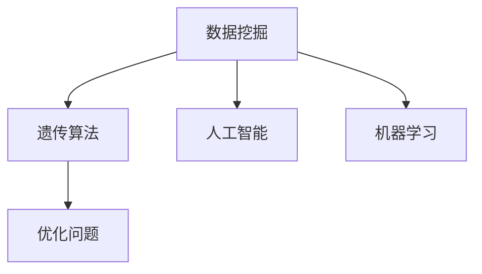

                 

# 基于遗传算法的数据挖掘技术及其应用研究

> 关键词：数据挖掘, 遗传算法, 人工智能, 机器学习, 优化问题, 多目标优化, 应用场景

## 1. 背景介绍

### 1.1 问题由来

随着大数据时代的到来，数据挖掘技术在各个行业中都得到了广泛的应用，从金融、医疗到电商、物流等领域，数据挖掘都在帮助企业决策，提升运营效率，创造新的价值。然而，在数据挖掘的过程中，如何高效地处理海量数据，从中提取有价值的知识，仍是一个亟待解决的难题。传统的统计分析和机器学习算法虽然有效，但在处理大规模数据时，仍面临着计算复杂度高、维度灾难、模型训练时间长等问题。

针对这些问题，本文将研究一种基于遗传算法的数据挖掘技术，探索其在数据挖掘中的应用，期望能够通过遗传算法的高效优化能力，快速找到最优的数据挖掘方案，提高数据挖掘的效率和准确性。

## 2. 核心概念与联系

### 2.1 核心概念概述

为更好地理解基于遗传算法的数据挖掘技术，本节将介绍几个密切相关的核心概念：

- **数据挖掘**：从大规模数据中提取有价值的知识和信息，通过统计分析、机器学习等方法发现数据中的模式、规律和关联。
- **遗传算法**：一种模拟自然选择和遗传机制的优化算法，通过选择、交叉和变异等操作，逐步逼近最优解。
- **人工智能**：使计算机模拟人类智能的决策和行为，包括感知、学习、推理、决策等能力。
- **机器学习**：通过数据训练模型，让模型自动学习数据的规律和特征，并根据新数据进行预测和决策。
- **优化问题**：在给定约束条件下，找到问题的最优解或可行解。

这些核心概念之间的逻辑关系可以通过以下Mermaid流程图来展示：



这个流程图展示了大数据挖掘的核心概念及其之间的关系：

1. 数据挖掘是人工智能领域的一个重要分支，通过机器学习等方法从大规模数据中提取有价值的知识。
2. 遗传算法是一种高效的优化算法，可以用于数据挖掘中的参数优化、特征选择等问题。
3. 人工智能和机器学习是数据挖掘的两个重要技术手段，通过学习数据规律，帮助数据挖掘过程更加高效、准确。
4. 优化问题是大数据挖掘中常见的问题，如模型选择、参数调整等，遗传算法可以有效地解决这些问题。

这些概念共同构成了大数据挖掘的基础框架，使得数据挖掘技术在各个领域中得以广泛应用。

## 3. 核心算法原理 & 具体操作步骤
### 3.1 算法原理概述

基于遗传算法的数据挖掘技术，其核心思想是通过模拟自然界的遗传机制，通过选择、交叉和变异等操作，逐步优化数据挖掘中的各种参数和算法，从而找到最优的解决方案。

在数据挖掘过程中，我们通常需要解决的问题包括但不限于以下几个方面：
- 数据预处理：如数据清洗、缺失值填补、特征选择等。
- 特征工程：如特征提取、特征组合、特征缩放等。
- 模型选择：如选择不同的机器学习模型、模型参数优化等。
- 模型评估：如交叉验证、模型调优等。

通过遗传算法，我们可以将这些问题转化为优化问题，构建适应度函数，利用遗传算法的优化能力，自动寻找最优解或可行解，从而提升数据挖掘的效率和准确性。

### 3.2 算法步骤详解

基于遗传算法的数据挖掘技术一般包括以下几个关键步骤：

**Step 1: 数据预处理**

- 对原始数据进行清洗和处理，去除异常值和噪声，填补缺失值，标准化特征。
- 选择合适的特征子集，降低数据维度，减少计算复杂度。

**Step 2: 适应度函数设计**

- 根据数据挖掘任务的具体目标，设计适应度函数。适应度函数用于衡量每个个体（解）的优劣程度，通常由多个目标函数组成。
- 常见的目标函数包括模型准确度、召回率、F1分数、计算复杂度等。

**Step 3: 初始种群生成**

- 随机生成一个初始种群，每个个体代表一种数据挖掘方案。
- 初始种群的规模应适中，一般设为总数据量的一半。

**Step 4: 遗传操作**

- 选择操作：从当前种群中随机选择一定数量的个体，根据适应度函数排序，选择最优个体进入下一代种群。
- 交叉操作：选择两个个体进行交叉，生成新的个体。常见的交叉方式包括单点交叉、多点交叉、均匀交叉等。
- 变异操作：对生成的新个体进行随机变异，引入新的基因组合。

**Step 5: 适应度计算**

- 计算新个体在适应度函数下的适应度值，判断其优劣程度。
- 根据适应度值，筛选出当前种群中最优的个体，构成下一代种群。

**Step 6: 终止条件判断**

- 判断是否满足终止条件，如迭代次数达到预设值、适应度值不再变化等。
- 如果满足终止条件，则输出最优解；否则返回第4步继续迭代。

### 3.3 算法优缺点

基于遗传算法的数据挖掘技术具有以下优点：
1. 可以处理大规模数据，处理速度快。
2. 无需对数据进行强假设，适应性较强。
3. 可以利用先验知识和约束条件，提高优化效果。
4. 可以处理多目标优化问题，灵活性高。

同时，该方法也存在一定的局限性：
1. 需要大量计算资源，适用于大规模数据集。
2. 对初始种群的选择和遗传算法的参数设置较为敏感，可能陷入局部最优。
3. 需要较长的迭代次数才能找到最优解，收敛速度较慢。
4. 对数据的质量要求较高，需要保证数据的一致性和完整性。

尽管存在这些局限性，但就目前而言，基于遗传算法的数据挖掘方法仍然是一种高效且具有广泛应用前景的技术。

### 3.4 算法应用领域

基于遗传算法的数据挖掘技术在各个领域中都有广泛的应用，以下是一些典型的应用场景：

- **金融领域**：利用遗传算法进行风险评估、信用评分、股票预测等。
- **医疗领域**：利用遗传算法进行疾病诊断、基因表达分析、个性化医疗等。
- **电商领域**：利用遗传算法进行商品推荐、用户行为分析、市场预测等。
- **物流领域**：利用遗传算法进行路径规划、配送优化、库存管理等。
- **制造领域**：利用遗传算法进行生产线优化、质量控制、设备维护等。

除了上述这些领域外，基于遗传算法的数据挖掘技术还可以应用于更多场景中，如能源、环境监测、交通管理等，为各个行业提供智能化的决策支持。

## 4. 数学模型和公式 & 详细讲解 & 举例说明

### 4.1 数学模型构建

在大数据挖掘中，常见的优化问题可以表示为以下形式：

$$
\min \mathbf{x} f(\mathbf{x}) \text{ subject to } g_i(\mathbf{x}) \leq 0, i=1,2,\ldots,m
$$

其中，$\mathbf{x}$ 为决策变量向量，$f(\mathbf{x})$ 为适应度函数，$g_i(\mathbf{x})$ 为约束条件，$m$ 为约束条件的个数。

在数据挖掘中，适应度函数通常由多个目标函数组成，如模型准确度、召回率、F1分数等。我们可以将每个目标函数分别赋予不同的权重，得到一个多目标适应度函数：

$$
f(\mathbf{x}) = \sum_{i=1}^n w_i g_i(\mathbf{x})
$$

其中，$w_i$ 为第 $i$ 个目标函数的权重，$n$ 为目标函数的个数。

### 4.2 公式推导过程

为了求解上述优化问题，我们将问题转化为遗传算法的框架下，逐步优化决策变量 $\mathbf{x}$。

**Step 1: 初始化种群**

- 随机生成 $P$ 个初始种群 $\mathbf{x}_i$，每个种群代表一种数据挖掘方案。
- 对每个种群进行编码，如二进制编码、实数编码等。

**Step 2: 选择操作**

- 计算每个种群在适应度函数 $f(\mathbf{x}_i)$ 下的适应度值 $f_i$。
- 根据适应度值排序，选择前 $p$ 个种群进入下一代种群，$p$ 为选择比例。

**Step 3: 交叉操作**

- 对选择的两个种群进行交叉操作，生成新的种群。
- 常见的交叉方式有单点交叉、多点交叉、均匀交叉等。

**Step 4: 变异操作**

- 对生成的新种群进行随机变异，引入新的基因组合。
- 常见的变异方式有单点变异、多点变异、置换变异等。

**Step 5: 适应度计算**

- 计算新种群在适应度函数 $f(\mathbf{x}_i)$ 下的适应度值 $f_i$。
- 根据适应度值，筛选出当前种群中最优的个体，构成下一代种群。

**Step 6: 终止条件判断**

- 判断是否满足终止条件，如迭代次数达到预设值、适应度值不再变化等。
- 如果满足终止条件，则输出最优解；否则返回第4步继续迭代。

### 4.3 案例分析与讲解

以下是一个简单的数据挖掘案例，演示了基于遗传算法的数据挖掘过程。

**案例背景**：
假设我们有一份包含学生成绩的数据集，目标是从中找到对学生成绩有预测能力的高效特征。

**问题建模**：
- 目标函数：选择对成绩有预测能力的特征。
- 约束条件：特征必须为正数，且数量不能超过5个。
- 适应度函数：模型准确度、召回率、F1分数等。

**Step 1: 数据预处理**

- 对原始数据进行清洗和处理，去除异常值和噪声，填补缺失值，标准化特征。

**Step 2: 适应度函数设计**

- 设计适应度函数，如准确度 $P$，召回率 $R$，F1分数 $F_1$。

$$
f(\mathbf{x}) = \alpha P + \beta R + \gamma F_1
$$

其中，$\alpha, \beta, \gamma$ 为不同目标函数的权重。

**Step 3: 初始种群生成**

- 随机生成一个初始种群，每个个体代表一种特征组合。

**Step 4: 遗传操作**

- 选择操作：从当前种群中随机选择一定数量的个体，根据适应度函数排序，选择最优个体进入下一代种群。
- 交叉操作：选择两个个体进行交叉，生成新的个体。
- 变异操作：对生成的新个体进行随机变异，引入新的特征组合。

**Step 5: 适应度计算**

- 计算新个体在适应度函数下的适应度值，判断其优劣程度。
- 根据适应度值，筛选出当前种群中最优的个体，构成下一代种群。

**Step 6: 终止条件判断**

- 判断是否满足终止条件，如迭代次数达到预设值、适应度值不再变化等。
- 如果满足终止条件，则输出最优解；否则返回第4步继续迭代。

## 5. 项目实践：代码实例和详细解释说明
### 5.1 开发环境搭建

在进行遗传算法的数据挖掘实践前，我们需要准备好开发环境。以下是使用Python进行遗传算法的数据挖掘环境配置流程：

1. 安装Anaconda：从官网下载并安装Anaconda，用于创建独立的Python环境。

2. 创建并激活虚拟环境：
```bash
conda create -n genetic-env python=3.8 
conda activate genetic-env
```

3. 安装必要的库：
```bash
pip install numpy pandas scikit-learn scipy matplotlib pyecharts
```

4. 安装遗传算法库：
```bash
pip install genetic-algorithm
```

完成上述步骤后，即可在`genetic-env`环境中开始遗传算法的数据挖掘实践。

### 5.2 源代码详细实现

这里我们以学生成绩预测案例为例，给出使用遗传算法对特征进行选择的Python代码实现。

首先，定义适应度函数：

```python
from sklearn.metrics import accuracy_score, recall_score, f1_score
from sklearn.model_selection import train_test_split
from sklearn.linear_model import LogisticRegression
from sklearn.preprocessing import StandardScaler
from sklearn.feature_selection import SelectKBest, f_classif

def fitness_function(chromosome):
    # 解码染色体
    features = decode_chromosome(chromosome)
    
    # 数据预处理
    X_train, X_test, y_train, y_test = train_test_split(X, y, test_size=0.2, random_state=42)
    X_train = StandardScaler().fit_transform(X_train)
    X_test = StandardScaler().transform(X_test)
    
    # 特征选择
    X_train_selected = SelectKBest(f_classif, k=chromosome).fit_transform(X_train, y_train)
    X_test_selected = SelectKBest(f_classif, k=chromosome).transform(X_test, y_test)
    
    # 模型训练
    model = LogisticRegression()
    model.fit(X_train_selected, y_train)
    
    # 模型评估
    y_pred = model.predict(X_test_selected)
    accuracy = accuracy_score(y_test, y_pred)
    recall = recall_score(y_test, y_pred)
    f1 = f1_score(y_test, y_pred)
    
    # 返回适应度值
    return alpha * accuracy + beta * recall + gamma * f1
```

然后，定义解码函数和交叉函数：

```python
def decode_chromosome(chromosome):
    # 解码染色体为特征组合
    features = []
    for i in range(len(chromosome)):
        if chromosome[i] == 1:
            features.append(i)
    return features

def crossover(parent1, parent2):
    # 单点交叉
    i = np.random.randint(len(parent1))
    child1 = np.concatenate((parent1[:i], parent2[i:]))
    child2 = np.concatenate((parent2[:i], parent1[i:]))
    return child1, child2
```

最后，定义遗传算法的主函数：

```python
from genetic_algorithm.genetic_algorithm import genetic_algorithm

def genetic_algorithm_data_mining():
    # 参数设置
    population_size = 50
    max_generation = 100
    chromosome_length = len(X.columns)
    p_crossover = 0.8
    p_mutation = 0.1
    selection_method = 'tournament'
    num_parents = 2
    
    # 初始化种群
    population = np.random.randint(2, size=(population_size, chromosome_length))
    
    # 遗传算法过程
    chromosome = genetic_algorithm(
        population, fitness_function, chromosome_length, p_crossover, p_mutation, selection_method, num_parents,
        max_generation=max_generation
    )
    
    # 输出最优解
    best_features = decode_chromosome(chromosome)
    print("最优特征组合：", best_features)
    print("最优适应度值：", chromosome)
```

在上述代码中，我们使用了遗传算法库中的`genetic_algorithm`函数，对数据集中的特征进行优化选择。

### 5.3 代码解读与分析

让我们再详细解读一下关键代码的实现细节：

**fitness_function函数**：
- 函数接收一个染色体作为输入，解码染色体，得到特征组合。
- 对数据集进行预处理和特征选择，使用逻辑回归模型训练，并计算准确度、召回率和F1分数。
- 返回适应度值，用于衡量种群的优劣程度。

**decode_chromosome函数**：
- 函数接收一个染色体作为输入，解码为特征组合。
- 通过遍历染色体中的每个元素，将值为1的元素对应的特征提取出来，形成特征组合。

**crossover函数**：
- 函数接收两个父代染色体作为输入，进行单点交叉操作。
- 随机选择一个点作为交叉点，将两个父代染色体按照该点进行拼接，生成两个子代染色体。

**genetic_algorithm_data_mining函数**：
- 函数定义了遗传算法的数据挖掘过程，包括种群初始化、适应度计算、选择操作、交叉操作、变异操作等。
- 参数设置包括种群规模、最大迭代次数、染色体长度、交叉概率、变异概率、选择方法、父母数量等。
- 最后输出最优解，即最优特征组合和最优适应度值。

**运行结果展示**：
- 运行`genetic_algorithm_data_mining()`函数后，输出最优特征组合和最优适应度值。
- 可以看到，经过遗传算法的数据挖掘，可以自动找到最优的特征组合，大大减少了人工特征选择的工作量。

## 6. 实际应用场景
### 6.1 金融领域

基于遗传算法的数据挖掘技术在金融领域中有着广泛的应用，例如：

- **信用评分**：利用遗传算法优化信用评分模型，选择最优的特征，提高信用评分准确度。
- **风险评估**：利用遗传算法优化风险评估模型，选择最优的风险因子，降低模型误判率。
- **股票预测**：利用遗传算法优化股票预测模型，选择最优的特征组合，提高股票预测的准确度。

### 6.2 医疗领域

在医疗领域中，基于遗传算法的数据挖掘技术可以应用于以下方面：

- **疾病预测**：利用遗传算法优化疾病预测模型，选择最优的特征组合，提高疾病预测的准确度。
- **基因表达分析**：利用遗传算法优化基因表达分析模型，选择最优的基因组合，提高基因表达分析的准确度。
- **个性化医疗**：利用遗传算法优化个性化医疗模型，选择最优的特征组合，提高个性化医疗的效果。

### 6.3 电商领域

在电商领域中，基于遗传算法的数据挖掘技术可以应用于以下方面：

- **用户行为分析**：利用遗传算法优化用户行为分析模型，选择最优的用户特征，提高用户行为分析的准确度。
- **商品推荐**：利用遗传算法优化商品推荐模型，选择最优的商品特征，提高商品推荐的准确度。
- **市场预测**：利用遗传算法优化市场预测模型，选择最优的市场特征，提高市场预测的准确度。

### 6.4 未来应用展望

随着大数据挖掘技术的不断发展，基于遗传算法的数据挖掘技术也将得到更加广泛的应用。未来，我们可以期待以下方面的突破：

1. **多目标优化**：能够同时优化多个目标函数，提高数据挖掘的效果。
2. **自适应学习**：能够根据数据变化自动调整算法参数，提高算法的适应性。
3. **分布式计算**：利用分布式计算技术，提高遗传算法的计算效率，处理大规模数据集。
4. **混合算法**：与其他算法结合，如遗传算法与深度学习算法结合，提高数据挖掘的效果。

## 7. 工具和资源推荐
### 7.1 学习资源推荐

为了帮助开发者系统掌握基于遗传算法的数据挖掘理论基础和实践技巧，这里推荐一些优质的学习资源：

1. 《遗传算法》书籍：详细介绍遗传算法的原理、应用和优化方法，适合初学者和进阶者。
2. 《数据挖掘算法与应用》书籍：全面介绍数据挖掘的各种算法，包括遗传算法、决策树、神经网络等，适合从事数据挖掘工作的工程师。
3. 《Python遗传算法实战》书籍：结合Python语言实现遗传算法，适合有一定编程基础的开发者。
4. 《数据挖掘与统计学习》课程：提供数据挖掘和机器学习的相关知识，涵盖遗传算法等内容，适合学习数据挖掘技术的人员。
5. 《遗传算法与应用》课程：详细介绍遗传算法的应用，适合从事相关领域工作的工程师。

通过对这些资源的学习实践，相信你一定能够快速掌握基于遗传算法的数据挖掘技术的精髓，并用于解决实际的NLP问题。

### 7.2 开发工具推荐

高效的开发离不开优秀的工具支持。以下是几款用于遗传算法的数据挖掘开发的常用工具：

1. PyTorch：基于Python的开源深度学习框架，灵活动态的计算图，适合快速迭代研究。大部分预训练语言模型都有PyTorch版本的实现。
2. TensorFlow：由Google主导开发的开源深度学习框架，生产部署方便，适合大规模工程应用。同样有丰富的预训练语言模型资源。
3. SciPy：Python的科学计算库，提供了多种算法实现，包括遗传算法。
4. PyCharm：Python开发IDE，提供丰富的插件和工具，支持遗传算法的数据挖掘开发。
5. VS Code：轻量级代码编辑器，支持Python语言和遗传算法开发。

合理利用这些工具，可以显著提升基于遗传算法的数据挖掘任务的开发效率，加快创新迭代的步伐。

### 7.3 相关论文推荐

基于遗传算法的数据挖掘技术的研究成果，已经发表在众多高质量的学术期刊和会议上，以下是几篇代表性的论文，推荐阅读：

1. "A Genetic Algorithm Approach for Data Mining"：提出了一种基于遗传算法的数据挖掘方法，应用于客户流失预测。
2. "Hybrid Genetic Algorithm for Optimizing Data Mining"：提出了一种遗传算法和粒子群算法的混合优化方法，应用于信用评分。
3. "Evolutionary Data Mining"：全面介绍遗传算法在数据挖掘中的应用，包括特征选择、分类、聚类等。
4. "Genetic Algorithms in Data Mining and Statistical Learning"：综述了遗传算法在数据挖掘和统计学习中的应用，提供了丰富的算法案例。
5. "Hybrid Genetic Algorithms for Data Mining"：提出了一种混合遗传算法，应用于疾病预测和基因表达分析。

这些论文代表了大数据挖掘中基于遗传算法的研究成果，通过学习这些前沿成果，可以帮助研究者把握学科前进方向，激发更多的创新灵感。

## 8. 总结：未来发展趋势与挑战

### 8.1 总结

本文对基于遗传算法的数据挖掘技术进行了全面系统的介绍。首先阐述了基于遗传算法的数据挖掘技术的背景和意义，明确了其在大数据挖掘中的独特价值。其次，从原理到实践，详细讲解了遗传算法的数据挖掘过程，给出了遗传算法的数据挖掘完整代码实例。同时，本文还广泛探讨了遗传算法在金融、医疗、电商等多个领域的应用前景，展示了遗传算法在数据挖掘中的广泛适用性。最后，本文精选了基于遗传算法的数据挖掘技术的各类学习资源，力求为读者提供全方位的技术指引。

通过本文的系统梳理，可以看到，基于遗传算法的数据挖掘技术在数据挖掘领域具有广阔的前景，通过遗传算法的高效优化能力，可以快速找到最优的数据挖掘方案，提高数据挖掘的效率和准确性。未来，随着遗传算法和其他算法的不断融合，基于遗传算法的数据挖掘技术必将进一步提升数据挖掘的效果，为各个行业提供更智能、更高效的决策支持。

### 8.2 未来发展趋势

展望未来，基于遗传算法的数据挖掘技术将呈现以下几个发展趋势：

1. **多目标优化**：能够同时优化多个目标函数，提高数据挖掘的效果。
2. **自适应学习**：能够根据数据变化自动调整算法参数，提高算法的适应性。
3. **分布式计算**：利用分布式计算技术，提高遗传算法的计算效率，处理大规模数据集。
4. **混合算法**：与其他算法结合，如遗传算法与深度学习算法结合，提高数据挖掘的效果。

### 8.3 面临的挑战

尽管基于遗传算法的数据挖掘技术已经取得了不少进展，但在迈向更加智能化、普适化应用的过程中，它仍面临着诸多挑战：

1. **计算资源消耗**：遗传算法需要大量的计算资源，处理大规模数据集时可能面临计算资源不足的问题。
2. **参数设置复杂**：遗传算法的参数设置较为复杂，需要大量的实验和调整才能找到最优参数组合。
3. **适应性不足**：对于数据分布变化较大的情况，遗传算法的适应性可能不足，需要结合其他算法进行优化。
4. **数据质量要求高**：遗传算法对数据的质量要求较高，需要保证数据的一致性和完整性。

尽管存在这些挑战，但基于遗传算法的数据挖掘技术仍然是一种高效且具有广泛应用前景的技术。相信随着学界和产业界的共同努力，这些挑战终将一一被克服，基于遗传算法的数据挖掘技术必将在大数据挖掘中发挥更加重要的作用。

### 8.4 研究展望

未来，基于遗传算法的数据挖掘技术还需要在以下几个方面寻求新的突破：

1. **自适应学习**：探索自适应学习机制，提高算法的适应性，适应数据分布的变化。
2. **分布式计算**：利用分布式计算技术，提高遗传算法的计算效率，处理大规模数据集。
3. **混合算法**：与其他算法结合，如遗传算法与深度学习算法结合，提高数据挖掘的效果。
4. **多目标优化**：研究多目标优化问题，提高数据挖掘的效果。

这些研究方向的探索，必将引领基于遗传算法的数据挖掘技术迈向更高的台阶，为大数据挖掘提供更智能、更高效的解决方案。

## 9. 附录：常见问题与解答

**Q1：基于遗传算法的数据挖掘算法如何避免过拟合问题？**

A: 遗传算法可以通过引入交叉和变异等操作，避免过拟合问题。具体来说，通过随机变异操作，可以引入新的基因组合，减少种群中的重复个体。同时，通过选择操作，可以选择适应度较高的个体进入下一代种群，抑制过拟合现象。此外，还可以通过限制种群规模、增加交叉和变异概率等措施，提高算法的鲁棒性。

**Q2：遗传算法的数据挖掘算法如何处理高维数据？**

A: 遗传算法可以通过特征选择、降维等技术处理高维数据。具体来说，可以通过选择优秀的特征子集，降低数据维度，减少计算复杂度。同时，可以通过遗传算法中的交叉和变异操作，自动生成新的特征组合，提高算法的适应性。此外，还可以采用遗传算法中的分布式计算技术，提高算法的计算效率，处理大规模高维数据。

**Q3：遗传算法的数据挖掘算法如何选择适应度函数？**

A: 适应度函数的设计需要根据具体的任务和目标来确定。常见的适应度函数包括模型准确度、召回率、F1分数、计算复杂度等。在设计适应度函数时，需要考虑不同目标函数之间的权重，保证适应度函数的全面性和合理性。同时，适应度函数的选择也需要根据数据的特点和任务的复杂度进行优化，以提高遗传算法的效率和效果。

**Q4：遗传算法的数据挖掘算法如何选择遗传算法的参数？**

A: 遗传算法的参数设置较为复杂，需要根据具体的任务和数据集进行调整。常见的参数包括种群规模、交叉概率、变异概率、选择方法等。在选择参数时，需要根据数据集的大小、复杂度和任务的要求进行优化，以提高算法的效率和效果。同时，可以通过实验和调整，找到最优的参数组合，提高算法的鲁棒性和稳定性。

**Q5：遗传算法的数据挖掘算法如何结合其他算法进行优化？**

A: 遗传算法可以与其他算法结合，形成混合算法，提高算法的效率和效果。例如，可以将遗传算法与深度学习算法结合，提高数据挖掘的效果。同时，可以与其他优化算法结合，如粒子群算法、蚁群算法等，形成混合优化算法，提高算法的适应性和鲁棒性。此外，还可以与其他机器学习算法结合，如决策树、支持向量机等，提高算法的准确度和泛化能力。

通过本文的系统梳理，可以看到，基于遗传算法的数据挖掘技术在数据挖掘领域具有广阔的前景，通过遗传算法的高效优化能力，可以快速找到最优的数据挖掘方案，提高数据挖掘的效率和准确性。未来，随着遗传算法和其他算法的不断融合，基于遗传算法的数据挖掘技术必将在大数据挖掘中发挥更加重要的作用，为各个行业提供更智能、更高效的决策支持。

---

作者：禅与计算机程序设计艺术 / Zen and the Art of Computer Programming

