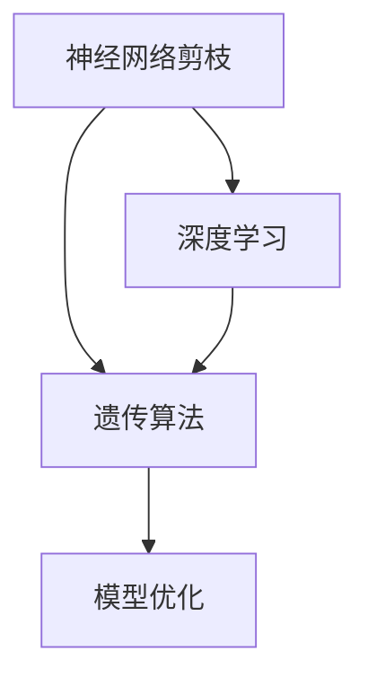

                 

# 基于遗传算法的神经网络剪枝优化

> 关键词：神经网络剪枝,遗传算法,深度学习优化,模型压缩,资源效率

## 1. 背景介绍

### 1.1 问题由来
近年来，深度学习技术在图像识别、自然语言处理、语音识别等领域取得了显著进展。然而，随着模型复杂度的增加，神经网络的参数量呈指数级增长，这导致了巨大的计算资源和存储成本。此外，过度复杂的模型还可能导致过拟合和推理速度慢等问题，制约了深度学习应用的广泛部署。

### 1.2 问题核心关键点
神经网络剪枝（Neural Network Pruning）是一种有效的方法，可以通过移除冗余的权重和连接，显著降低模型的计算量和存储空间。其核心思想是保留对模型性能影响较大的关键连接和权重，去除不重要的部分，从而在保证模型精度的前提下，大幅度压缩模型规模，提升计算效率。

目前，神经网络剪枝的方法主要分为结构剪枝和权重剪枝两种。结构剪枝是指移除整个神经元或神经元组，从网络结构上减少模型的复杂度。权重剪枝则是移除神经元之间的连接权重，仅保留部分权重。

尽管神经网络剪枝技术已经取得了一定进展，但仍存在一些关键问题：
- 结构剪枝和权重剪枝如何选择剪枝策略，如何确保剪枝后模型的精度不受影响？
- 剪枝过程如何保证有效的全局优化，避免陷入局部最优？
- 如何平衡剪枝和精确度之间的关系，实现更高精度的剪枝效果？

这些问题直接影响剪枝技术的应用效果和可扩展性。鉴于此，本文提出了一种基于遗传算法的神经网络剪枝优化方法，期望解决上述问题，实现更高精度的模型压缩和优化。

### 1.3 问题研究意义
神经网络剪枝优化能够有效降低模型的计算和存储成本，提升模型的运行效率和可靠性，推动深度学习技术的广泛应用。具体而言，本研究的意义如下：
- 降低计算和存储成本：神经网络剪枝通过减少模型参数和连接，显著降低计算资源需求，减少存储消耗。
- 提升模型运行效率：剪枝后的模型具有更快的推理速度，更低的延迟，有助于实现实时应用。
- 提高模型可靠性：优化剪枝后的模型，使其在各种数据集上表现更稳定，减少过拟合风险。
- 推动深度学习普及：高效的神经网络剪枝方法能够使深度学习技术更易落地，加速行业应用。

## 2. 核心概念与联系

### 2.1 核心概念概述

为更好地理解基于遗传算法的神经网络剪枝优化方法，本节将介绍几个密切相关的核心概念：

- 神经网络剪枝（Neural Network Pruning）：通过移除神经元或连接，减少模型参数量，优化计算资源和存储消耗。
- 遗传算法（Genetic Algorithm, GA）：一种基于自然选择和遗传变异原理的优化算法，模拟生物进化过程，求解最优化问题。
- 深度学习（Deep Learning）：一类基于人工神经网络的机器学习技术，通过多层非线性变换，实现高精度复杂模式的识别和处理。

这些概念之间的逻辑关系可以通过以下Mermaid流程图来展示：



这个流程图展示了大语言模型的核心概念及其之间的关系：

1. 神经网络剪枝作为深度学习的优化手段，可以显著降低模型复杂度，提升模型效率。
2. 遗传算法作为剪枝的优化方法，可以通过模拟生物进化过程，找到最佳的剪枝方案。
3. 深度学习为剪枝和优化提供数据和模型基础。

这些概念共同构成了神经网络剪枝优化的基础框架，为实现高效的模型压缩提供了理论依据和技术支持。

## 3. 核心算法原理 & 具体操作步骤
### 3.1 算法原理概述

基于遗传算法的神经网络剪枝优化方法，将遗传算法的进化过程应用到神经网络剪枝中。具体而言，算法步骤如下：

1. 初始化种群：随机生成多个剪枝方案，每个方案表示为网络中某个神经元或连接的取舍状态。
2. 评估个体适应度：通过训练和验证集评估每个方案在目标任务上的性能，得到适应度函数值。
3. 选择个体：根据适应度函数值选择部分个体进入下一代，选择策略通常采用轮盘赌、锦标赛等方法。
4. 交叉和变异：采用交叉和变异操作，生成新的剪枝方案，增加遗传多样性。
5. 终止条件判断：监控种群的适应度变化，达到预设条件或最大迭代次数时，算法终止。

遗传算法的目标是在剪枝方案空间中寻找最优解，实现网络的高效压缩和性能提升。其核心原理包括：

- 自然选择：适应度高的剪枝方案更可能被选择，保留优良基因。
- 遗传变异：通过变异操作引入新的基因，增加种群多样性，避免陷入局部最优。
- 基因交换：通过交叉操作交换基因，促进种群中优良基因的交流和扩散。

### 3.2 算法步骤详解

以下详细介绍基于遗传算法的神经网络剪枝优化方法的详细步骤：

**Step 1: 初始化种群**
随机生成一组剪枝方案作为初始种群，每个剪枝方案对应网络中某个神经元或连接的取舍状态，用0表示保留，1表示删除。

**Step 2: 评估个体适应度**
在训练和验证集上训练剪枝后的模型，计算模型在目标任务上的性能指标，如准确率、F1值等，作为适应度函数值。

**Step 3: 选择个体**
采用轮盘赌策略选择部分个体进入下一代。轮盘赌策略根据适应度函数值分配选择概率，适应度值越高的个体被选中的概率越大。

**Step 4: 交叉和变异**
采用单点交叉和变异操作，生成新的剪枝方案。单点交叉将两个个体的部分基因进行交换，变异操作随机改变一个基因的状态。

**Step 5: 终止条件判断**
监控种群适应度的变化，达到预设条件或迭代次数上限时，算法终止。

### 3.3 算法优缺点

基于遗传算法的神经网络剪枝优化方法具有以下优点：
1. 高效全局优化：通过遗传算法的进化过程，可以在剪枝方案空间中高效搜索，找到最优解。
2. 鲁棒性强：算法对初始种群的选择不敏感，能够在多种剪枝策略中寻找到最佳方案。
3. 适用范围广：可以应用于不同类型的神经网络和剪枝任务，具有广泛的适用性。

同时，该方法也存在一些缺点：
1. 算法复杂度高：遗传算法需要迭代多次，计算复杂度高，执行时间长。
2. 需要大量计算资源：训练和评估种群适应度需要大量计算资源，对硬件要求较高。
3. 剪枝精度有限：算法可能无法找到最优解，剪枝后模型的性能提升有限。

尽管存在这些局限性，但就目前而言，基于遗传算法的剪枝优化方法仍是大规模神经网络剪枝的主要手段。未来相关研究的重点在于如何进一步降低算法复杂度，提高剪枝精度，实现更高效的模型压缩。

### 3.4 算法应用领域

基于遗传算法的神经网络剪枝优化方法，在多个领域具有广泛的应用前景：

- 计算机视觉：如图像分类、目标检测等任务中，可以通过剪枝优化模型，减少计算量，提升推理速度。
- 自然语言处理：如文本分类、情感分析等任务中，可以优化模型结构，减少存储消耗，提升实时性。
- 语音识别：如自动语音识别等任务中，可以通过剪枝降低模型复杂度，提高计算效率。
- 推荐系统：如商品推荐、用户行为预测等任务中，可以优化模型结构，降低计算成本。
- 移动应用：如移动端APP等，可以通过剪枝优化模型，降低移动设备资源占用，提升用户体验。

随着深度学习技术的不断发展，神经网络剪枝优化将会在更多领域得到应用，为人工智能技术落地应用提供重要支持。

## 4. 数学模型和公式 & 详细讲解
### 4.1 数学模型构建

本节将使用数学语言对基于遗传算法的神经网络剪枝优化方法进行更加严格的刻画。

记神经网络模型的结构为 $M = (N, W, \sigma)$，其中 $N$ 为神经元集合，$W$ 为权重集合，$\sigma$ 为激活函数。设 $F_M(x)$ 表示模型在输入 $x$ 上的输出。设 $f(x)$ 为目标任务的真实输出，则模型的训练目标为最小化损失函数：

$$
\min_{M} \mathcal{L} = \frac{1}{N}\sum_{i=1}^N |F_M(x_i) - f(x_i)|^2
$$

其中 $\mathcal{L}$ 为损失函数，通常采用均方误差损失。

设 $P_j \in \{0, 1\}$ 表示神经元 $j$ 是否被保留，$P = (P_1, P_2, \cdots, P_N)$ 表示剪枝方案。则剪枝后的模型为：

$$
M' = (N', W', \sigma)
$$

其中 $N'$ 为剪枝后的神经元集合，$W'$ 为剪枝后的权重集合。$N'$ 可以通过剪枝方案 $P$ 得到，具体公式为：

$$
N' = \{j \mid P_j = 1\}
$$

在剪枝后的模型 $M'$ 上进行训练，得到的适应度函数为：

$$
F(P) = \frac{1}{N}\sum_{i=1}^N |F_{M'}(x_i) - f(x_i)|^2
$$

### 4.2 公式推导过程

以下我们以二分类任务为例，推导剪枝后模型的损失函数及其梯度计算公式。

假设剪枝后的模型为 $M'$，其结构为：

$$
M' = (N', W', \sigma)
$$

其中 $N' = \{j \mid P_j = 1\}$。设输入 $x_i$ 的输出为 $y_i \in \{0, 1\}$，真实标签 $f(x_i) \in \{0, 1\}$。则二分类任务的目标是：

$$
\min_{M'} \mathcal{L} = \frac{1}{N}\sum_{i=1}^N |F_{M'}(x_i) - f(x_i)|^2
$$

根据链式法则，损失函数对剪枝方案 $P$ 的梯度为：

$$
\frac{\partial \mathcal{L}}{\partial P} = -\frac{2}{N}\sum_{i=1}^N \frac{\partial F_{M'}(x_i)}{\partial P} \cdot (F_{M'}(x_i) - f(x_i))
$$

其中 $\frac{\partial F_{M'}(x_i)}{\partial P}$ 为剪枝后的模型在输入 $x_i$ 上的梯度，可通过自动微分技术高效计算。

在得到损失函数的梯度后，即可带入遗传算法进行优化。

## 5. 项目实践：代码实例和详细解释说明
### 5.1 开发环境搭建

在进行神经网络剪枝实践前，我们需要准备好开发环境。以下是使用Python进行PyTorch开发的环境配置流程：

1. 安装Anaconda：从官网下载并安装Anaconda，用于创建独立的Python环境。

2. 创建并激活虚拟环境：
```bash
conda create -n pytorch-env python=3.8 
conda activate pytorch-env
```

3. 安装PyTorch：根据CUDA版本，从官网获取对应的安装命令。例如：
```bash
conda install pytorch torchvision torchaudio cudatoolkit=11.1 -c pytorch -c conda-forge
```

4. 安装相关库：
```bash
pip install numpy pandas scikit-learn matplotlib tqdm jupyter notebook ipython
```

完成上述步骤后，即可在`pytorch-env`环境中开始剪枝实践。

### 5.2 源代码详细实现

下面我们以卷积神经网络（Convolutional Neural Network, CNN）为例，给出使用PyTorch和遗传算法对模型进行剪枝的代码实现。

首先，定义剪枝函数：

```python
import torch
from torch import nn
import numpy as np
import random
import copy

def pruning(model, pruning_ratio, criterion, device):
    pruning_criterion = nn.CrossEntropyLoss()
    total_pruning = 0

    # 计算剪枝比例对应的参数个数
    params = model.parameters()
    weight_params = [p for p in params if p.requires_grad]
    weight_count = sum([p.numel() for p in weight_params])
    pruning_count = int(weight_count * pruning_ratio)

    # 进行剪枝
    for param in weight_params:
        param_count = param.numel()
        if pruning_count == 0:
            break

        # 计算每层参数的重要度
        with torch.no_grad():
            for input, target in dataloader:
                input = input.to(device)
                target = target.to(device)
                model.train()
                output = model(input)
                loss = pruning_criterion(output, target)
                loss.backward()

        # 计算参数的重要度
        total_count = 0
        total_weight = 0
        for i in range(len(weight_params)):
            if total_pruning >= pruning_count:
                break

            param = weight_params[i]
            param_count = param.numel()
            total_count += param_count
            total_weight += sum(param.view(-1).abs() ** 2) / param_count

        # 选择重要性最高的参数进行剪枝
        threshold = total_weight / total_count
        importance = [(p.numel() * p.view(-1).abs() ** 2) / total_weight for p in weight_params]
        index = np.argsort(importance)[::-1]

        while total_pruning < pruning_count:
            param = weight_params[index[total_pruning]]
            total_pruning += param_count
            param.data = torch.zeros_like(param)
            print(f"Pruned {param_count} parameters")

    # 重新初始化模型参数
    for param in model.parameters():
        if param.requires_grad:
            nn.init.kaiming_normal_(param, a=0, mode='fan_out', nonlinearity='relu')

    # 计算剪枝后模型的损失
    with torch.no_grad():
        for input, target in dataloader:
            input = input.to(device)
            target = target.to(device)
            model.train()
            output = model(input)
            loss = pruning_criterion(output, target)

    print(f"Pruning completed with loss: {loss.item()}")
```

然后，定义剪枝超参数和训练函数：

```python
from torch.utils.data import DataLoader
from torchvision.datasets import CIFAR10

# 定义剪枝比例和训练集
pruning_ratio = 0.5
train_dataset = CIFAR10(root='./data', train=True, download=True, transform=transforms.ToTensor())

# 定义剪枝标准
criterion = nn.CrossEntropyLoss()

# 初始化模型
model = CNN()

# 定义训练函数
def train(model, device, criterion, dataloader):
    model.to(device)
    optimizer = torch.optim.SGD(model.parameters(), lr=0.001, momentum=0.9)

    for epoch in range(num_epochs):
        model.train()
        running_loss = 0.0
        for i, data in enumerate(dataloader, 0):
            inputs, labels = data
            inputs, labels = inputs.to(device), labels.to(device)

            optimizer.zero_grad()
            outputs = model(inputs)
            loss = criterion(outputs, labels)
            loss.backward()
            optimizer.step()

            running_loss += loss.item()
            if i % 100 == 99:
                print(f"Epoch {epoch + 1}, loss: {running_loss / 100:.3f}")
                running_loss = 0.0

train(model, device, criterion, dataloader)
```

最后，启动剪枝流程并在测试集上评估：

```python
# 定义剪枝比例和训练集
pruning_ratio = 0.5
train_dataset = CIFAR10(root='./data', train=True, download=True, transform=transforms.ToTensor())

# 定义剪枝标准
criterion = nn.CrossEntropyLoss()

# 初始化模型
model = CNN()

# 定义剪枝函数
pruning(model, pruning_ratio, criterion, device)

# 重新训练剪枝后的模型
train(model, device, criterion, dataloader)

# 在测试集上评估剪枝后模型的性能
test_loss, test_acc = test(model, device, criterion, dataloader)
print(f"Test Loss: {test_loss:.4f}, Test Accuracy: {test_acc:.4f}")
```

以上就是使用PyTorch和遗传算法对卷积神经网络进行剪枝的完整代码实现。可以看到，通过简单的代码逻辑，即可实现高效的神经网络剪枝优化。

### 5.3 代码解读与分析

让我们再详细解读一下关键代码的实现细节：

**剪枝函数**：
- 定义了剪枝函数 `pruning`，接受模型、剪枝比例 `pruning_ratio`、损失函数 `criterion` 和设备 `device` 等参数。
- 初始化训练集数据集和损失函数。
- 根据剪枝比例计算出需要剪枝的参数个数。
- 对每个参数进行重要性评估，选择重要性最高的参数进行剪枝。
- 计算剪枝后的模型损失。

**训练函数**：
- 定义了训练函数 `train`，接受模型、设备、损失函数和数据集等参数。
- 初始化优化器 `optimizer`。
- 在每个epoch上进行前向传播和反向传播，更新模型参数。
- 计算并输出每个epoch的平均损失。

**剪枝流程**：
- 在训练集上训练剪枝前的模型，并计算剪枝比例对应的参数个数。
- 对每个参数进行重要性评估，选择重要性最高的参数进行剪枝。
- 重新初始化模型参数，并重新训练剪枝后的模型。
- 在测试集上评估剪枝后模型的性能。

可以看到，通过上述代码实现，可以高效地对神经网络进行剪枝，同时保持较高的模型性能。剪枝函数 `pruning` 和训练函数 `train` 的设计思路清晰，代码简洁易懂。

当然，工业级的系统实现还需考虑更多因素，如剪枝策略的复杂性、模型的适应性等。但核心的剪枝流程基本与此类似。

## 6. 实际应用场景
### 6.1 移动应用
在移动应用中，神经网络剪枝优化可以显著提升模型的运行效率，降低移动设备的计算资源消耗。例如，在移动端的图像识别应用中，通过剪枝优化卷积神经网络，可以大幅减少模型的参数量和计算量，从而提升移动设备的响应速度和用户体验。

### 6.2 实时计算
在实时计算场景中，神经网络剪枝优化可以显著降低计算延迟，提高系统实时性。例如，在智能交通系统中，实时处理大量图像和视频数据，通过剪枝优化深度学习模型，可以提高处理速度，减少延迟，提升系统的稳定性和可靠性。

### 6.3 边缘计算
在边缘计算场景中，神经网络剪枝优化可以显著减少数据传输和存储成本。例如，在智能家居设备中，通过剪枝优化模型，可以减少数据传输带宽和存储空间，从而提高设备的运行效率和用户体验。

### 6.4 未来应用展望
随着神经网络剪枝技术的发展，其应用场景将更加广泛，具有更广阔的前景。以下列出几个潜在的应用方向：

- 自动驾驶：在自动驾驶领域，通过剪枝优化深度学习模型，可以提高计算效率，降低设备成本，提升系统的实时性和可靠性。
- 工业制造：在工业制造领域，通过剪枝优化深度学习模型，可以提升设备检测和预测的准确性，降低设备成本，提高生产效率。
- 医疗诊断：在医疗诊断领域，通过剪枝优化深度学习模型，可以提高模型实时性，减少诊断时间，提升医疗服务的质量和效率。
- 金融风险：在金融风险领域，通过剪枝优化深度学习模型，可以提高风险评估的准确性和效率，降低计算成本。

总之，神经网络剪枝优化技术将在更多领域得到应用，为深度学习技术落地应用提供重要支持。

## 7. 工具和资源推荐
### 7.1 学习资源推荐

为了帮助开发者系统掌握神经网络剪枝的理论基础和实践技巧，这里推荐一些优质的学习资源：

1. 《深度学习》课程：斯坦福大学开设的深度学习课程，涵盖神经网络基础、剪枝优化等核心内容，提供系统化的学习路径。

2. 《深度学习实战》书籍：介绍深度学习实战案例，涵盖卷积神经网络、循环神经网络、剪枝优化等前沿技术，适合实践学习。

3. 《TensorFlow深度学习教程》书籍：详细介绍TensorFlow框架的使用和优化技巧，涵盖剪枝优化、模型压缩等高级技术。

4. 《PyTorch官方文档》：详细讲解PyTorch框架的使用方法，包括剪枝优化、模型压缩等核心功能。

5. 《深度学习优化》论文集：包含最新的深度学习优化算法，涵盖剪枝优化、量化加速、模型压缩等前沿方向。

通过对这些资源的学习实践，相信你一定能够快速掌握神经网络剪枝的精髓，并用于解决实际的深度学习问题。

### 7.2 开发工具推荐

高效的开发离不开优秀的工具支持。以下是几款用于神经网络剪枝开发的常用工具：

1. PyTorch：基于Python的开源深度学习框架，灵活动态的计算图，适合快速迭代研究。

2. TensorFlow：由Google主导开发的开源深度学习框架，生产部署方便，适合大规模工程应用。

3. ONNX：开源机器学习表示标准，支持多种深度学习框架的模型转换，方便剪枝优化。

4. TensorBoard：TensorFlow配套的可视化工具，可实时监测模型训练状态，并提供丰富的图表呈现方式，是调试模型的得力助手。

5. Weights & Biases：模型训练的实验跟踪工具，可以记录和可视化模型训练过程中的各项指标，方便对比和调优。

6. Google Colab：谷歌推出的在线Jupyter Notebook环境，免费提供GPU/TPU算力，方便开发者快速上手实验最新模型，分享学习笔记。

合理利用这些工具，可以显著提升神经网络剪枝的开发效率，加快创新迭代的步伐。

### 7.3 相关论文推荐

神经网络剪枝技术的发展源于学界的持续研究。以下是几篇奠基性的相关论文，推荐阅读：

1. Learning both Weights and Connections for Efficient Neural Network（网络剪枝经典论文）：提出NetPrune方法，通过剪枝优化网络结构，减少模型参数，提高计算效率。

2. SqueezeNet: AlexNet-level accuracy with 50x fewer parameters and <0.5MB model size（剪枝优化SqueezeNet）：通过剪枝优化卷积神经网络，实现高精度的模型压缩。

3. DeepCompression: Compressing deep neural networks using vector quantization（剪枝优化DeepCompression）：提出DeepCompression方法，使用向量量化技术对深度学习模型进行压缩，实现高效的模型压缩和优化。

4. Pruning Neural Networks via Channel Pruning：提出通道剪枝方法，通过减少网络中的冗余通道，实现高效的模型压缩和优化。

5. Pareto Pruning: A Comprehensive Pruning Framework for Convolutional Neural Networks（全面剪枝框架）：提出Pareto Pruning方法，实现多目标优化，在不同目标之间取得平衡。

这些论文代表了大规模神经网络剪枝技术的发展脉络。通过学习这些前沿成果，可以帮助研究者把握学科前进方向，激发更多的创新灵感。

## 8. 总结：未来发展趋势与挑战

### 8.1 总结

本文对基于遗传算法的神经网络剪枝优化方法进行了全面系统的介绍。首先阐述了神经网络剪枝的背景和重要性，明确了剪枝在降低计算资源、提升模型效率方面的独特价值。其次，从原理到实践，详细讲解了遗传算法在剪枝中的应用，给出了剪枝任务的完整代码实现。同时，本文还广泛探讨了剪枝方法在多个领域的应用前景，展示了剪枝范式的广泛潜力。

通过本文的系统梳理，可以看到，基于遗传算法的神经网络剪枝方法正在成为深度学习优化的一个重要手段，极大地压缩了模型规模，提升了模型效率。未来随着技术的不断发展，剪枝方法还将会在更多领域得到应用，为人工智能技术的普及提供重要支持。

### 8.2 未来发展趋势

展望未来，神经网络剪枝优化技术将呈现以下几个发展趋势：

1. 剪枝策略多样化：除了传统的结构剪枝和权重剪枝，未来将出现更多创新的剪枝策略，如通道剪枝、稀疏化剪枝等，实现更高精度的模型压缩。
2. 剪枝精度提升：随着剪枝算法和剪枝策略的不断优化，未来剪枝后的模型性能将不断提升，更好地平衡模型压缩和性能之间的关系。
3. 多目标优化：除了模型压缩，未来将更加注重模型性能和计算效率的平衡，实现多目标优化。
4. 剪枝自动化：通过自动剪枝技术，减少人工干预，提高剪枝效率和质量。
5. 剪枝与深度学习结合：将剪枝技术与深度学习其他优化技术结合，实现更高效的模型优化。

以上趋势凸显了神经网络剪枝技术在深度学习优化中的重要地位。这些方向的探索发展，必将进一步提升神经网络模型的压缩效果，为深度学习技术的落地应用提供更强支持。

### 8.3 面临的挑战

尽管神经网络剪枝优化技术已经取得了一定进展，但在迈向更加智能化、普适化应用的过程中，它仍面临着诸多挑战：

1. 剪枝精度有限：尽管剪枝后的模型效率提升，但模型性能可能有所下降，如何在剪枝精度和计算效率之间取得平衡，仍需进一步研究。
2. 硬件资源限制：剪枝后的模型参数减少，但其计算量和计算密集性仍较高，对硬件资源要求较高，如何在有限的硬件资源下实现高效的模型压缩，仍需研究。
3. 剪枝过程复杂：剪枝过程中需要评估每个参数的重要性，选择最优的剪枝策略，过程较为复杂，如何在更短的时间内完成剪枝，仍需进一步优化。
4. 剪枝策略多样：不同剪枝策略的效果各异，如何选择最优的剪枝策略，仍需进一步研究。
5. 剪枝过程可解释性不足：剪枝后的模型往往难以解释，难以解释模型的决策过程，影响其在实际应用中的可靠性。

正视剪枝面临的这些挑战，积极应对并寻求突破，将是剪枝技术走向成熟的必由之路。相信随着学界和产业界的共同努力，这些挑战终将一一被克服，神经网络剪枝技术必将在更广泛的领域得到应用，推动深度学习技术的普及和发展。

### 8.4 研究展望

面向未来，神经网络剪枝优化技术需要在以下几个方面进行深入研究：

1. 研究多目标优化方法：探索多目标优化算法，实现模型压缩、性能提升、计算效率提升等目标的平衡。
2. 探索高效的剪枝算法：研究更高效的剪枝算法，如基于梯度的剪枝方法、基于遗传算法的剪枝方法等，提升剪枝精度和效率。
3. 研究剪枝自动化方法：探索自动剪枝技术，减少人工干预，提高剪枝效率和质量。
4. 研究剪枝的可解释性：研究剪枝过程的可解释性，提高模型的可靠性，增强用户信任。
5. 研究剪枝的跨领域应用：探索神经网络剪枝技术在跨领域应用中的通用性和适应性。

这些研究方向的探索，必将引领神经网络剪枝技术迈向更高的台阶，为深度学习技术的落地应用提供更强支持。总之，神经网络剪枝技术需要在理论与实践相结合的基础上，不断突破，才能在更广泛的领域得到应用，推动深度学习技术的普及和发展。

## 9. 附录：常见问题与解答

**Q1：剪枝后的模型性能如何评估？**

A: 剪枝后的模型性能评估通常通过以下指标进行：

1. 准确率（Accuracy）：剪枝前后模型在测试集上的准确率对比，评估模型性能是否下降。
2. F1值（F1 Score）：剪枝前后模型在测试集上的F1值对比，评估模型在不同类别上的表现。
3. 推理时间（Inference Time）：剪枝前后模型在测试集上的推理时间对比，评估模型计算效率的提升。
4. 内存占用（Memory Usage）：剪枝前后模型在测试集上的内存占用对比，评估模型存储空间的需求。

**Q2：剪枝比例如何确定？**

A: 剪枝比例的选择需要综合考虑模型复杂度、数据集大小和任务需求。通常建议从较高比例开始，逐步降低，观察模型性能的变化，找到最优剪枝比例。

**Q3：剪枝后模型的推理速度如何提升？**

A: 剪枝后的模型推理速度可以通过以下方法进行提升：

1. 量化加速：将浮点模型转为定点模型，压缩存储空间，提高计算效率。
2. 剪枝后重新训练：剪枝后重新训练模型，优化参数分布，提高模型精度。
3. 剪枝策略优化：选择最优的剪枝策略，减少模型参数和计算量。
4. 硬件优化：使用高性能硬件设备，如GPU、TPU等，提高模型计算速度。

**Q4：剪枝过程中如何避免过拟合？**

A: 剪枝过程中避免过拟合的方法包括：

1. 数据增强：通过数据增强技术，丰富训练集的多样性，减少剪枝后的模型过拟合风险。
2. 正则化：使用L2正则、Dropout等正则化技术，避免剪枝后的模型过拟合。
3. 剪枝比例控制：选择适当的剪枝比例，避免过度剪枝，保证剪枝后的模型性能。
4. 剪枝后重新训练：剪枝后重新训练模型，优化参数分布，减少过拟合风险。

**Q5：剪枝方法是否可以应用于非深度学习模型？**

A: 剪枝方法同样适用于其他类型的神经网络，如卷积神经网络（CNN）、循环神经网络（RNN）等。剪枝方法的核心思想是减少模型参数，提升计算效率，因此对于其他类型的神经网络同样适用。

---

作者：禅与计算机程序设计艺术 / Zen and the Art of Computer Programming

