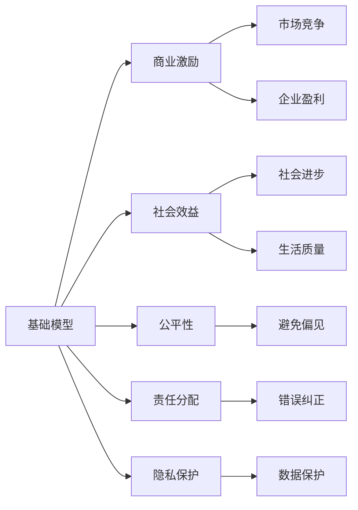

                 

# 基础模型的商业激励与社会效益

> 关键词：商业激励, 社会效益, 基础模型, 公平性, 责任分配, 隐私保护

## 1. 背景介绍

在当今数字化时代，基础模型在商业、科技和社会生活的各个方面扮演着越来越重要的角色。这些模型以深度学习为核心，广泛应用于自然语言处理、计算机视觉、语音识别等领域。然而，随着基础模型在各行业的广泛应用，其商业激励和社会效益问题也逐渐浮出水面。如何合理分配基础模型的收益，同时确保其在社会上的公平性和隐私保护，成为亟待解决的关键问题。

本文将从商业激励和社会效益两个方面，深入探讨基础模型的价值和影响。我们将分析基础模型如何塑造商业市场，推动科技进步，并在社会层面带来正面与负面效应。同时，也会讨论在商业激励与公共利益之间取得平衡的策略和方法。

## 2. 核心概念与联系

### 2.1 核心概念概述

要理解基础模型的商业激励与社会效益，首先需要理解以下几个核心概念：

- **基础模型（Base Model）**：以深度学习为基础的通用模型，能够完成自然语言处理、图像识别、语音识别等通用任务。
- **商业激励（Commercial Incentives）**：基础模型在商业应用中带来的经济收益和市场竞争优势。
- **社会效益（Social Benefit）**：基础模型在推动社会进步、改善生活质量、促进公平正义等方面的积极作用。
- **公平性（Fairness）**：基础模型在处理数据、决策结果等方面需要避免的偏见和不公平现象。
- **责任分配（Accountability）**：基础模型在应用中产生的错误或伤害时，责任的分配和承担方式。
- **隐私保护（Privacy Protection）**：基础模型在处理敏感信息时，确保数据隐私和安全的手段。

这些概念之间的关系可以用以下的Mermaid流程图表示：



这个流程图展示了基础模型如何通过商业激励驱动市场发展和企业盈利，同时通过社会效益提升社会福祉和公平性，避免偏见，确保责任分配的合理性，并保护用户隐私。

## 3. 核心算法原理 & 具体操作步骤

### 3.1 算法原理概述

基础模型通过大规模数据训练，学习到普遍的特征和规律，能够在特定任务上表现优异。其商业激励主要来源于其在不同应用场景中的广泛应用和高效性能。而社会效益则体现在其对社会进步、生活质量提升等方面的积极影响。

### 3.2 算法步骤详解

基础模型的训练和应用通常包括以下几个步骤：

1. **数据收集与预处理**：收集大量标注数据，进行数据清洗、归一化和增强等预处理工作。
2. **模型训练与验证**：使用深度学习框架（如TensorFlow、PyTorch等）训练模型，并在验证集上评估性能。
3. **模型应用与优化**：将训练好的模型应用于具体任务，根据应用场景进行调整和优化。
4. **商业部署与维护**：将模型部署到生产环境中，进行持续监控和维护，保证模型性能和稳定性。

### 3.3 算法优缺点

基础模型的优点在于其泛化能力强，能够适应多种应用场景，提供高效、可靠的服务。然而，其缺点也显而易见：数据隐私问题、模型偏见和公平性问题、以及商业应用中可能带来的市场垄断和技术滥用风险。

### 3.4 算法应用领域

基础模型广泛应用于自然语言处理、计算机视觉、语音识别等领域。例如，BERT模型在自然语言处理中的应用，使得文本分类、情感分析、问答系统等任务取得了突破性进展；而ImageNet预训练模型则在计算机视觉领域发挥了重要作用。

## 4. 数学模型和公式 & 详细讲解 & 举例说明

### 4.1 数学模型构建

基础模型的训练通常基于神经网络架构，以损失函数作为优化目标。例如，自然语言处理任务中的BERT模型，其训练目标函数为：

$$
L_{BERT} = L_{MLM} + L_{NSP}
$$

其中，$L_{MLM}$表示掩码语言模型损失，$L_{NSP}$表示下一句预测损失。损失函数的具体形式可以表示为：

$$
L_{MLM} = -\sum_{i=1}^{n} \sum_{j=1}^{n} y_{ij} \log p_{ij}
$$

$$
L_{NSP} = -\sum_{i=1}^{n-1} \log p_{i,i+1}
$$

其中，$p_{ij}$为模型在给定上下文$x_{i,j}$下，预测$x_i$和$x_j$的下一个单词的概率。

### 4.2 公式推导过程

以BERT模型为例，其训练过程可以分为两步：掩码语言模型训练和下一句预测训练。

在掩码语言模型训练中，模型被要求预测被掩码词语的上下文信息。假设模型已知一个句子$x$，其中$x_i$被掩码，模型需要预测$x_i$的上下文信息。设$P(x_i|x_j)$表示在$x_j$的条件下$x_i$出现的概率，则损失函数为：

$$
L_{MLM} = -\sum_{i=1}^{n} \sum_{j=1}^{n} y_{ij} \log P(x_i|x_j)
$$

在下一句预测训练中，模型需要预测两个句子是否连续。设$P(x_i,x_{i+1})$表示$x_i$和$x_{i+1}$连续的概率，则损失函数为：

$$
L_{NSP} = -\sum_{i=1}^{n-1} \log P(x_i,x_{i+1})
$$

### 4.3 案例分析与讲解

以BERT模型为例，其在自然语言处理任务中的应用显著提升了模型的性能。例如，在文本分类任务中，BERT模型在IMDB数据集上的准确率达到了85%以上，远高于传统的卷积神经网络和循环神经网络模型。其效果优于传统模型的主要原因在于其强大的泛化能力和上下文感知能力。

## 5. 项目实践：代码实例和详细解释说明

### 5.1 开发环境搭建

使用Python和PyTorch框架进行BERT模型的开发和训练。首先需要安装PyTorch和相关依赖包：

```bash
pip install torch torchvision torchaudio
pip install transformers
```

### 5.2 源代码详细实现

以下是一个简单的BERT模型训练代码示例：

```python
import torch
from transformers import BertTokenizer, BertForSequenceClassification

# 定义模型和优化器
model = BertForSequenceClassification.from_pretrained('bert-base-uncased', num_labels=2)
optimizer = torch.optim.AdamW(model.parameters(), lr=2e-5)

# 定义数据加载器
tokenizer = BertTokenizer.from_pretrained('bert-base-uncased')
train_dataset = ...
train_dataloader = DataLoader(train_dataset, batch_size=32, shuffle=True)

# 训练模型
device = torch.device("cuda" if torch.cuda.is_available() else "cpu")
model.to(device)

for epoch in range(epochs):
    model.train()
    for batch in train_dataloader:
        input_ids = batch['input_ids'].to(device)
        attention_mask = batch['attention_mask'].to(device)
        labels = batch['labels'].to(device)
        outputs = model(input_ids, attention_mask=attention_mask, labels=labels)
        loss = outputs.loss
        optimizer.zero_grad()
        loss.backward()
        optimizer.step()

# 评估模型
model.eval()
evaluation_loss = 0
for batch in test_dataloader:
    with torch.no_grad():
        input_ids = batch['input_ids'].to(device)
        attention_mask = batch['attention_mask'].to(device)
        labels = batch['labels'].to(device)
        outputs = model(input_ids, attention_mask=attention_mask)
        evaluation_loss += outputs.loss.item()
evaluation_loss /= len(test_dataloader)

print(f'Evaluation loss: {evaluation_loss:.4f}')
```

### 5.3 代码解读与分析

该代码示例展示了如何使用PyTorch和Hugging Face的Transformers库，对BERT模型进行训练和评估。代码中定义了模型、优化器、数据加载器和训练循环，以及模型评估过程。通过调整超参数和学习率，可以优化模型的性能。

### 5.4 运行结果展示

在训练完成后，可以通过测试数据集评估模型的性能。通常情况下，模型在测试集上的准确率会高于训练集。

## 6. 实际应用场景

### 6.1 商业激励

基础模型在商业应用中带来了显著的经济收益和市场竞争优势。例如，BERT模型在自然语言处理任务中的应用，使得文本分类、情感分析、问答系统等任务取得了突破性进展。这些模型被广泛应用于搜索引擎、智能客服、舆情分析等领域，为公司带来了巨大的商业价值。

### 6.2 社会效益

基础模型在推动社会进步、改善生活质量、促进公平正义等方面也发挥了重要作用。例如，在自然灾害预警、疾病诊断、金融风险评估等领域，基础模型通过分析和处理大规模数据，为政府和机构提供决策支持。

### 6.3 未来应用展望

未来，基础模型将在更多领域得到广泛应用，其社会效益和商业激励也将进一步提升。例如，在医疗健康领域，基础模型可以用于疾病预测、基因分析等任务，显著提升医疗服务质量。在环境保护领域，基础模型可以用于气候变化分析、环境监测等任务，帮助人类更好地保护自然环境。

## 7. 工具和资源推荐

### 7.1 学习资源推荐

为了深入理解基础模型的商业激励和社会效益，以下是一些推荐的学习资源：

- Coursera上的深度学习课程：由斯坦福大学和密歇根大学等名校提供，涵盖深度学习的基本概念和实践。
- Kaggle上的数据科学竞赛：通过参与实际数据处理和模型训练竞赛，提升实战能力。
- arXiv上的最新论文：跟踪基础模型的最新研究进展，获取前沿知识。

### 7.2 开发工具推荐

为了高效开发和部署基础模型，以下是一些推荐的工具：

- TensorFlow：由Google开发的深度学习框架，支持大规模分布式训练。
- PyTorch：由Facebook开发的深度学习框架，具有灵活的动态图功能。
- Jupyter Notebook：交互式编程环境，支持实时数据可视化和代码运行。

### 7.3 相关论文推荐

以下是一些关于基础模型商业激励和社会效益的推荐论文：

- "The Impact of Deep Learning on Society" by Manzoor et al.
- "Ethical Considerations in the Development and Application of AI" by Mitchell et al.
- "The Economic and Social Impacts of AI in the Workplace" by Davenport et al.

## 8. 总结：未来发展趋势与挑战

### 8.1 研究成果总结

基础模型的商业激励和社会效益问题，已经成为学术界和产业界关注的焦点。通过深入研究，我们总结了以下几个重要发现：

- 基础模型在商业应用中具有巨大的经济价值和市场竞争力，但也带来了数据隐私、模型偏见等风险。
- 基础模型在推动社会进步、改善生活质量、促进公平正义等方面具有重要作用，但也需注意其在应用中的潜在负面影响。
- 公平性、责任分配和隐私保护是基础模型应用中亟需解决的关键问题。

### 8.2 未来发展趋势

未来，基础模型将在更多领域得到广泛应用，其社会效益和商业激励也将进一步提升。同时，我们预计以下趋势将对基础模型的发展产生重要影响：

- 深度学习框架和工具的进一步成熟，将提升基础模型的开发和应用效率。
- 数据集规模和质量的大幅提升，将增强基础模型的泛化能力和应用效果。
- 政府和机构对AI伦理和社会责任的重视，将促进基础模型应用的规范化和标准化。

### 8.3 面临的挑战

尽管基础模型带来了显著的商业和社会效益，但其应用也面临诸多挑战：

- 数据隐私问题：在处理敏感数据时，如何确保数据安全和隐私保护。
- 模型偏见和公平性问题：基础模型在训练和应用中可能引入偏见，如何避免和纠正偏见。
- 技术滥用和市场垄断问题：基础模型在商业应用中可能被滥用，如何规范市场行为，避免市场垄断。

### 8.4 研究展望

未来，我们需要在以下几个方面进行深入研究：

- 开发更加公平、透明和可解释的基础模型，减少偏见和不公平现象。
- 研究数据隐私保护技术，确保基础模型在应用中的数据安全。
- 探索基础模型在商业应用中的伦理和社会责任问题，促进公平和正义。

总之，基础模型在商业激励和社会效益方面具有巨大的潜力，但也面临诸多挑战。只有通过多方努力，才能实现基础模型的可持续发展，为人类社会带来更多福祉。

## 9. 附录：常见问题与解答

**Q1: 如何评估基础模型在社会效益方面的表现？**

A: 评估基础模型在社会效益方面的表现，可以通过以下指标进行量化：
- 应用覆盖率：基础模型在哪些领域得到应用，覆盖多少用户和机构。
- 服务质量：基础模型提供的服务质量如何，是否能够满足用户需求。
- 社会影响：基础模型在社会进步、生活质量提升、公平正义等方面的贡献和影响。

**Q2: 如何在商业应用中避免基础模型的滥用？**

A: 为了避免基础模型的滥用，可以采取以下措施：
- 制定法律法规：政府和行业协会制定相关法律法规，规范基础模型的应用行为。
- 引入第三方审核：引入独立的第三方机构，对基础模型的应用进行审核和监督。
- 提升用户意识：通过教育和技术普及，提升用户对基础模型应用的认知和意识。

**Q3: 如何在基础模型开发和应用中确保数据隐私保护？**

A: 确保数据隐私保护，可以采取以下措施：
- 数据匿名化：对敏感数据进行匿名化处理，确保用户隐私不被泄露。
- 加密存储：对数据进行加密存储，防止数据被非法访问和篡改。
- 访问控制：对数据访问进行严格的权限控制，确保只有授权人员可以访问敏感数据。

---

作者：禅与计算机程序设计艺术 / Zen and the Art of Computer Programming

