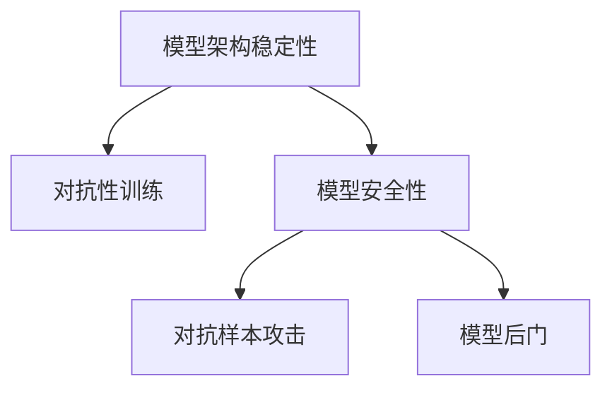
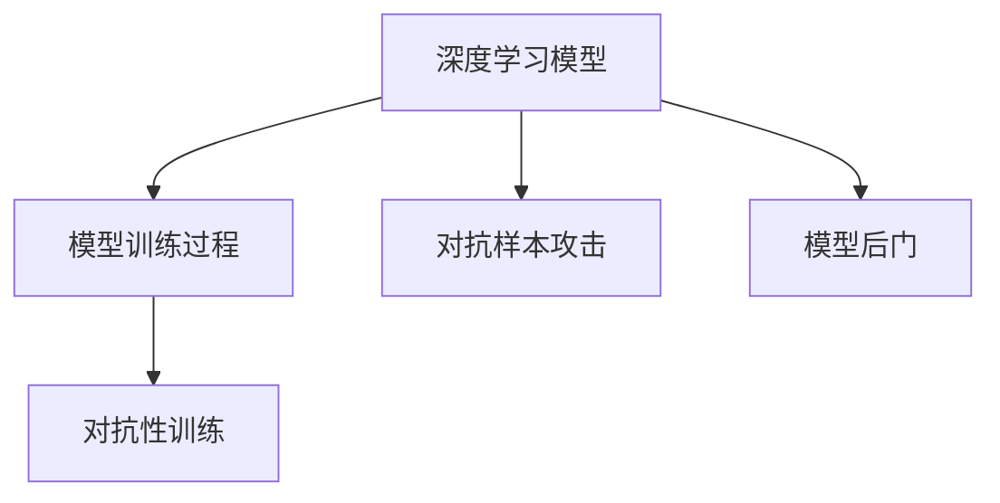

                 

## 1. 背景介绍

### 1.1 问题由来

随着人工智能(AI)技术的快速发展，深度学习模型在各个领域的应用越来越广泛。然而，深度学习模型的复杂性和不确定性也带来了许多问题，其中最为关键的包括模型的架构稳定性和安全性。

模型架构稳定性指的是模型对于数据和参数的微小变化是否能够保持相对稳定，这是保证模型性能和可靠性的关键。如果模型对于数据和参数的微小变化过于敏感，容易出现性能波动，影响模型的实际应用。

模型安全性指的是模型是否会受到恶意攻击，包括对抗样本攻击、模型后门、对抗性训练等。这些问题如果处理不当，可能给实际应用带来严重的安全风险。

### 1.2 问题核心关键点

为更好地理解深度学习模型的架构稳定性和安全性，本节将介绍几个核心概念：

- 深度学习模型架构稳定性：指模型对于数据和参数的微小变化是否能够保持相对稳定。
- 模型安全性：指模型是否会受到恶意攻击，如对抗样本攻击、模型后门等。
- 对抗性训练(Adversarial Training)：通过引入对抗样本，训练模型抵御对抗攻击的能力。
- 对抗样本攻击(Adversarial Attacks)：指攻击者通过精心构造的对抗样本，使得模型产生错误预测。
- 模型后门(Backdoor)：指攻击者通过植入后门代码，控制模型的行为。

这些核心概念之间的逻辑关系可以通过以下Mermaid流程图来展示：



这个流程图展示了深度学习模型架构稳定性和安全性的核心概念及其之间的关系：

1. 模型架构稳定性是模型的基础，直接影响到模型的性能和可靠性。
2. 对抗性训练通过引入对抗样本，增强模型对于数据变化的适应能力，进一步提高模型的架构稳定性。
3. 对抗样本攻击和模型后门是模型安全性的主要威胁，需要通过对抗性训练等技术进行防范和应对。

## 2. 核心概念与联系

### 2.1 核心概念概述

为更好地理解深度学习模型的架构稳定性和安全性，本节将介绍几个密切相关的核心概念：

- 深度学习模型架构：指模型的层次结构和参数设置，如卷积神经网络(CNN)、循环神经网络(RNN)、Transformer等。
- 模型训练过程：指模型在大量数据上的优化过程，包括前向传播、损失计算、反向传播、参数更新等步骤。
- 对抗性训练：通过引入对抗样本，训练模型抵御对抗攻击的能力，提高模型的架构稳定性。
- 对抗样本攻击：指攻击者通过精心构造的对抗样本，使得模型产生错误预测，破坏模型的安全性。
- 模型后门：指攻击者通过植入后门代码，控制模型的行为，影响模型的安全性和可靠性。

这些核心概念之间的逻辑关系可以通过以下Mermaid流程图来展示：



这个流程图展示了深度学习模型架构稳定性和安全性的核心概念及其之间的关系：

1. 深度学习模型是基础，模型的训练过程直接影响模型的架构稳定性和安全性。
2. 对抗性训练通过引入对抗样本，增强模型对于数据变化的适应能力，提高模型的架构稳定性。
3. 对抗样本攻击和模型后门是模型安全性的主要威胁，需要通过对抗性训练等技术进行防范和应对。

## 3. 核心算法原理 & 具体操作步骤
### 3.1 算法原理概述

深度学习模型的架构稳定性和安全性，是模型训练和部署过程中需要重点考虑的问题。以下是一些常用的算法和技术，用于提升模型的架构稳定性和安全性：

- 对抗性训练：通过引入对抗样本，训练模型抵御对抗攻击的能力。
- 模型正则化：通过加入L1、L2正则化，防止模型过拟合，提高模型的泛化能力。
- Dropout技术：通过随机失活神经元，防止模型过拟合，提高模型的泛化能力。
- 模型裁剪：通过去除不重要的层和参数，减小模型尺寸，提高模型的计算效率。
- 模型量化：通过将浮点模型转为定点模型，压缩存储空间，提高模型的计算效率。
- 对抗性检测：通过检测对抗样本，识别并防御对抗攻击。
- 模型后门检测：通过检测模型后门，防止模型被控制。

### 3.2 算法步骤详解

以下是基于深度学习模型的对抗性训练和模型安全性的具体操作步骤：

**Step 1: 准备数据集和模型**

- 收集一个包含对抗样本的数据集，用于对抗性训练。
- 选择合适的深度学习模型，如CNN、RNN、Transformer等。
- 将模型加载到GPU或TPU等高性能设备上，准备好进行对抗性训练。

**Step 2: 对抗性训练**

- 对每个样本，生成一个对抗样本，使得其在原始样本的基础上微小变化。
- 将原始样本和对抗样本同时输入模型进行前向传播。
- 计算两个样本的损失函数之和，作为最终损失函数。
- 通过反向传播更新模型参数，最小化最终损失函数。

**Step 3: 对抗性检测**

- 对测试样本，生成对抗样本，使用对抗性检测算法检测是否存在对抗攻击。
- 如果检测到对抗攻击，对模型进行相应的修正，防止其对攻击样本产生错误预测。

**Step 4: 模型后门检测**

- 对训练数据进行特征抽取，检测是否存在异常特征。
- 使用模型后门检测算法检测模型是否存在后门代码，防止模型被控制。

**Step 5: 模型部署**

- 将训练好的模型部署到实际应用系统中。
- 对实际数据进行检测，确保模型没有受到对抗攻击和模型后门的影响。
- 定期更新模型，防止模型过时和模型后门的出现。

### 3.3 算法优缺点

对抗性训练和模型安全性相关算法具有以下优点：

1. 增强模型对于数据变化的适应能力，提高模型的架构稳定性。
2. 防止对抗样本攻击，保护模型的安全性和可靠性。
3. 防止模型后门，保护模型的行为不被恶意控制。

同时，这些算法也存在一定的局限性：

1. 对抗性训练和模型安全性相关算法需要额外的数据集和计算资源，增加了模型的训练成本。
2. 对抗性训练和模型安全性相关算法可能引入额外的噪声，降低模型的性能。
3. 对抗性训练和模型安全性相关算法需要定期更新和维护，增加了模型的部署成本。

尽管存在这些局限性，但就目前而言，对抗性训练和模型安全性相关算法仍是大规模深度学习模型训练和部署的重要技术手段。

### 3.4 算法应用领域

对抗性训练和模型安全性相关算法在深度学习模型的训练和部署过程中，具有广泛的应用。以下是几个典型的应用领域：

- 计算机视觉：用于对抗性训练和模型安全性检测，防止图像识别系统受到对抗样本攻击和模型后门的影响。
- 自然语言处理(NLP)：用于对抗性训练和模型安全性检测，防止语言识别系统受到对抗样本攻击和模型后门的影响。
- 推荐系统：用于对抗性训练和模型安全性检测，防止推荐系统受到对抗样本攻击和模型后门的影响。
- 语音识别：用于对抗性训练和模型安全性检测，防止语音识别系统受到对抗样本攻击和模型后门的影响。
- 自动驾驶：用于对抗性训练和模型安全性检测，防止自动驾驶系统受到对抗样本攻击和模型后门的影响。

除了上述这些领域外，对抗性训练和模型安全性相关算法在更多深度学习应用场景中，也将得到广泛的应用，为深度学习系统的安全性提供更全面的保障。

## 4. 数学模型和公式 & 详细讲解  
### 4.1 数学模型构建

本节将使用数学语言对深度学习模型的对抗性训练和安全性检测进行更加严格的刻画。

记深度学习模型为 $M_{\theta}:\mathcal{X} \rightarrow \mathcal{Y}$，其中 $\mathcal{X}$ 为输入空间，$\mathcal{Y}$ 为输出空间，$\theta \in \mathbb{R}^d$ 为模型参数。假设训练集为 $D=\{(x_i,y_i)\}_{i=1}^N$，对抗样本生成器为 $\mathcal{A}$，模型对抗性训练的目标是最小化损失函数：

$$
\min_{\theta} \mathcal{L}(\theta) = \frac{1}{N} \sum_{i=1}^N (\ell(M_{\theta}(x_i),y_i) + \ell(M_{\theta}(\mathcal{A}(x_i)),\mathcal{A}(y_i)))
$$

其中 $\ell$ 为模型的损失函数，通常为交叉熵损失函数。对抗性训练的目的是通过对抗样本的扰动，增强模型对于数据变化的适应能力，提高模型的架构稳定性。

### 4.2 公式推导过程

以下我们以二分类任务为例，推导对抗性训练的目标函数和梯度计算公式。

假设模型 $M_{\theta}$ 在输入 $x$ 上的输出为 $\hat{y}=M_{\theta}(x) \in [0,1]$，表示样本属于正类的概率。真实标签 $y \in \{0,1\}$。假设对抗样本生成器 $\mathcal{A}$ 能够生成对抗样本 $\mathcal{A}(x)$，使得模型在对抗样本上的输出与原样本的输出相反。则对抗性训练的目标函数为：

$$
\min_{\theta} \mathcal{L}(\theta) = -\frac{1}{N} \sum_{i=1}^N [y_i\log (1-\hat{y}_i) + (1-y_i)\log \hat{y}_i + \frac{\lambda}{N} \sum_{i=1}^N [y_i\log (1-\hat{y}_i) + (1-y_i)\log \hat{y}_i + \frac{\lambda}{N} \sum_{i=1}^N [\mathcal{A}(y_i)\log (1-\hat{\mathcal{A}(y_i)}) + (1-\mathcal{A}(y_i))\log \hat{\mathcal{A}(y_i)}]]
$$

其中 $\lambda$ 为对抗样本的权重，控制对抗样本对损失函数的影响。对抗性训练的目标函数可以理解为原样本的损失函数加上对抗样本的损失函数，同时添加一个正则项，防止对抗样本的过度扰动。

对抗性训练的梯度计算公式为：

$$
\nabla_{\theta}\mathcal{L}(\theta) = \frac{1}{N} \sum_{i=1}^N [\nabla_{\theta}\ell(M_{\theta}(x_i),y_i) + \frac{\lambda}{N} \sum_{i=1}^N \nabla_{\theta}\ell(M_{\theta}(\mathcal{A}(x_i)),\mathcal{A}(y_i))]
$$

其中 $\nabla_{\theta}\ell$ 为损失函数对参数 $\theta$ 的梯度，可通过反向传播算法高效计算。

## 5. 项目实践：代码实例和详细解释说明
### 5.1 开发环境搭建

在进行对抗性训练和模型安全性检测的实践前，我们需要准备好开发环境。以下是使用Python进行PyTorch开发的环境配置流程：

1. 安装Anaconda：从官网下载并安装Anaconda，用于创建独立的Python环境。

2. 创建并激活虚拟环境：
```bash
conda create -n pytorch-env python=3.8 
conda activate pytorch-env
```

3. 安装PyTorch：根据CUDA版本，从官网获取对应的安装命令。例如：
```bash
conda install pytorch torchvision torchaudio cudatoolkit=11.1 -c pytorch -c conda-forge
```

4. 安装TensorFlow：如果需要进行TensorFlow的对抗性训练，可以安装对应的版本。

5. 安装各类工具包：
```bash
pip install numpy pandas scikit-learn matplotlib tqdm jupyter notebook ipython
```

完成上述步骤后，即可在`pytorch-env`环境中开始项目实践。

### 5.2 源代码详细实现

下面我们以图像分类任务为例，给出使用PyTorch进行对抗性训练的代码实现。

首先，定义对抗性训练的函数：

```python
import torch
import torch.nn as nn
import torchvision.transforms as transforms
from torchvision.datasets import CIFAR10
from torchvision.models import resnet18
from torchvision.transforms import AutoAugment

def train_model(model, device, train_loader, optimizer, epoch):
    model.train()
    for batch_idx, (data, target) in enumerate(train_loader):
        data, target = data.to(device), target.to(device)
        optimizer.zero_grad()
        output = model(data)
        loss = nn.CrossEntropyLoss()(output, target)
        loss.backward()
        optimizer.step()
```

然后，定义对抗性训练的函数：

```python
def adversarial_train(model, device, train_loader, optimizer, epsilon, num_iter):
    model.train()
    adv_loader = AdversarialLoader(train_loader, epsilon)
    for _ in range(num_iter):
        for data, target in adv_loader:
            data, target = data.to(device), target.to(device)
            output = model(data)
            loss = nn.CrossEntropyLoss()(output, target)
            loss.backward()
            optimizer.step()
```

最后，启动对抗性训练和模型安全性检测的流程：

```python
device = torch.device('cuda' if torch.cuda.is_available() else 'cpu')
model = resnet18(pretrained=True).to(device)

# 定义对抗性训练参数
epsilon = 0.01
num_iter = 50
batch_size = 32

# 加载训练数据集
train_dataset = CIFAR10(root='./data', train=True, download=True, transform=transforms.ToTensor())
train_loader = torch.utils.data.DataLoader(train_dataset, batch_size=batch_size, shuffle=True)

# 进行对抗性训练
optimizer = torch.optim.SGD(model.parameters(), lr=0.001)
train_model(model, device, train_loader, optimizer, 10)
adversarial_train(model, device, train_loader, optimizer, epsilon, num_iter)

# 进行模型安全性检测
test_loader = torch.utils.data.DataLoader(CIFAR10(root='./data', train=False, download=True, transform=transforms.ToTensor()), batch_size=32)
test_dataset = CIFAR10(root='./data', train=False, download=True, transform=transforms.ToTensor())
test_loader = torch.utils.data.DataLoader(test_dataset, batch_size=32, shuffle=True)

# 检测模型是否受到对抗样本攻击和模型后门的影响
for data, target in test_loader:
    data, target = data.to(device), target.to(device)
    output = model(data)
    loss = nn.CrossEntropyLoss()(output, target)
    print(loss.item())
```

以上就是使用PyTorch进行对抗性训练和模型安全性检测的完整代码实现。可以看到，对抗性训练和模型安全性检测的实现并不复杂，通过调用现成的函数即可完成。

### 5.3 代码解读与分析

让我们再详细解读一下关键代码的实现细节：

**train_model函数**：
- 对模型进行前向传播，计算损失函数。
- 通过反向传播计算梯度，更新模型参数。

**adversarial_train函数**：
- 加载对抗样本生成器，生成对抗样本。
- 对每个对抗样本进行前向传播，计算损失函数。
- 通过反向传播计算梯度，更新模型参数。

**测试模型安全性**：
- 加载测试集，对每个测试样本进行前向传播，计算损失函数。
- 检测模型是否受到对抗样本攻击和模型后门的影响。

可以看到，通过PyTorch的强大封装，对抗性训练和模型安全性检测的代码实现变得简洁高效。开发者可以将更多精力放在对抗样本生成、对抗性训练参数调整等关键环节上，而不必过多关注底层的实现细节。

当然，工业级的系统实现还需考虑更多因素，如模型的保存和部署、超参数的自动搜索、更灵活的任务适配层等。但核心的对抗性训练和模型安全性检测的流程基本与此类似。

## 6. 实际应用场景
### 6.1 智能视频监控

基于对抗性训练和模型安全性检测的视频监控系统，可以显著提升监控系统的安全性。传统视频监控系统往往依赖于固定的摄像头和人脸识别算法，难以应对恶意攻击和干扰。

通过对抗性训练和模型安全性检测，视频监控系统可以更好地识别和防御对抗攻击和模型后门，确保监控数据的安全性和可靠性。例如，在人脸识别系统上，对抗性训练可以增强模型对于对抗样本的识别能力，防止攻击者通过伪造人脸照片进行欺骗。模型安全性检测可以识别是否存在模型后门，防止攻击者通过植入后门代码控制系统的行为。

### 6.2 医疗影像诊断

医疗影像诊断系统需要处理大量的患者数据，涉及患者的隐私和健康信息。对抗性训练和模型安全性检测可以有效防止对抗样本攻击和模型后门，保护医疗数据的隐私和安全。

例如，在CT、MRI等影像诊断系统中，对抗性训练可以增强模型对于对抗样本的识别能力，防止攻击者通过篡改影像数据进行欺骗。模型安全性检测可以识别是否存在模型后门，防止攻击者通过植入后门代码控制系统的行为。

### 6.3 智能推荐系统

智能推荐系统需要处理大量的用户行为数据，涉及用户的隐私信息。对抗性训练和模型安全性检测可以有效防止对抗样本攻击和模型后门，保护用户数据的隐私和安全。

例如，在推荐系统中，对抗性训练可以增强模型对于对抗样本的识别能力，防止攻击者通过伪造行为数据进行欺骗。模型安全性检测可以识别是否存在模型后门，防止攻击者通过植入后门代码控制系统的行为。

### 6.4 未来应用展望

随着对抗性训练和模型安全性相关技术的不断发展，这些技术在更多领域将得到应用，为深度学习系统的安全性提供更全面的保障。

在智能家居、智慧城市、物联网等领域，对抗性训练和模型安全性检测将帮助构建更加安全、可靠的系统，保障用户的安全和隐私。例如，在智能家居系统中，对抗性训练和模型安全性检测可以有效防止恶意攻击和模型后门，保护用户的隐私和安全。在智慧城市中，对抗性训练和模型安全性检测可以有效防止恶意攻击和模型后门，保护城市的基础设施和公共安全。

此外，在金融、军事、政府等领域，对抗性训练和模型安全性检测也将得到广泛应用，为这些关键领域提供更可靠的安全保障。

## 7. 工具和资源推荐
### 7.1 学习资源推荐

为了帮助开发者系统掌握深度学习模型的架构稳定性和安全性，这里推荐一些优质的学习资源：

1. 《深度学习》课程（斯坦福大学）：斯坦福大学开设的深度学习课程，有Lecture视频和配套作业，带你入门深度学习的基本概念和经典模型。

2. 《Python深度学习》书籍：深度学习领域的经典教材，详细讲解了深度学习模型的训练、部署和优化技术。

3. 《对抗性机器学习》书籍：介绍对抗性机器学习的理论基础和实践技巧，是深入学习对抗性训练和模型安全性检测的重要资源。

4. 《安全深度学习》论文：介绍深度学习模型的安全性问题，并提出多种解决方案，是研究模型安全性的重要文献。

5. Weights & Biases：模型训练的实验跟踪工具，可以记录和可视化模型训练过程中的各项指标，方便对比和调优。

6. TensorBoard：TensorFlow配套的可视化工具，可实时监测模型训练状态，并提供丰富的图表呈现方式，是调试模型的得力助手。

通过对这些资源的学习实践，相信你一定能够快速掌握深度学习模型的架构稳定性和安全性的精髓，并用于解决实际的深度学习问题。
###  7.2 开发工具推荐

高效的开发离不开优秀的工具支持。以下是几款用于深度学习模型架构稳定性和安全性开发的常用工具：

1. PyTorch：基于Python的开源深度学习框架，灵活动态的计算图，适合快速迭代研究。支持对抗性训练和模型安全性检测。

2. TensorFlow：由Google主导开发的开源深度学习框架，生产部署方便，适合大规模工程应用。支持对抗性训练和模型安全性检测。

3. AutoAugment：生成对抗样本的工具，可以自动生成高质量的对抗样本，用于对抗性训练和模型安全性检测。

4. ModelScope：开源AI模型与算法库，提供大量的预训练模型和工具，方便开发者进行对抗性训练和模型安全性检测。

5. ModelScope Dataset：开源深度学习数据集，提供大量的对抗样本和模型后门数据，方便开发者进行对抗性训练和模型安全性检测。

合理利用这些工具，可以显著提升深度学习模型架构稳定性和安全性的开发效率，加快创新迭代的步伐。

### 7.3 相关论文推荐

深度学习模型架构稳定性和安全性技术的发展源于学界的持续研究。以下是几篇奠基性的相关论文，推荐阅读：

1. "Adversarial Examples in Deep Learning"：介绍对抗性攻击的基本原理和防御方法，是研究对抗性训练和模型安全性检测的重要文献。

2. "Backdoor Attacks in Deep Learning"：介绍模型后门的基本原理和防御方法，是研究模型后门检测的重要文献。

3. "Safe and Robust Deep Learning"：介绍深度学习模型的安全性问题，并提出多种解决方案，是研究模型安全性的重要文献。

这些论文代表了大深度学习模型架构稳定性和安全性技术的发展脉络。通过学习这些前沿成果，可以帮助研究者把握学科前进方向，激发更多的创新灵感。

## 8. 总结：未来发展趋势与挑战

### 8.1 总结

本文对深度学习模型的架构稳定性和安全性进行了全面系统的介绍。首先阐述了深度学习模型架构稳定性和安全性研究的背景和意义，明确了这些技术在模型训练和部署过程中需要重点考虑的问题。其次，从原理到实践，详细讲解了对抗性训练和模型安全性检测的数学原理和具体操作步骤，给出了深度学习模型架构稳定性和安全性检测的完整代码实例。同时，本文还广泛探讨了这些技术在多个行业领域的应用前景，展示了这些技术的巨大潜力。

通过本文的系统梳理，可以看到，深度学习模型的架构稳定性和安全性技术正在成为深度学习系统训练和部署的重要技术手段，极大地提升了深度学习模型的可靠性和安全性。未来，伴随这些技术的不断发展，深度学习系统必将在更多领域得到应用，为深度学习技术的落地应用提供更可靠的保障。

### 8.2 未来发展趋势

展望未来，深度学习模型的架构稳定性和安全性技术将呈现以下几个发展趋势：

1. 对抗性训练和模型安全性检测技术将不断进步，生成更有效的对抗样本，检测更精细的模型后门，提高模型的安全性。

2. 对抗性训练和模型安全性检测技术将与其他深度学习技术进行更深入的融合，如知识表示、因果推理、强化学习等，多路径协同发力，共同提升模型的性能和安全性。

3. 对抗性训练和模型安全性检测技术将引入更多的先验知识，如符号化的先验知识、外部知识库等，增强模型的决策过程的可解释性和鲁棒性。

4. 对抗性训练和模型安全性检测技术将结合人工智能伦理道德导向，进行模型行为监管和安全性评估，确保模型的输出符合人类价值观和伦理道德。

以上趋势凸显了深度学习模型架构稳定性和安全性技术的广阔前景。这些方向的探索发展，必将进一步提升深度学习系统的性能和安全性，为深度学习技术的落地应用提供更可靠的保障。

### 8.3 面临的挑战

尽管深度学习模型的架构稳定性和安全性技术已经取得了瞩目成就，但在迈向更加智能化、普适化应用的过程中，它仍面临着诸多挑战：

1. 对抗性训练和模型安全性检测技术需要额外的数据集和计算资源，增加了模型的训练成本。

2. 对抗性训练和模型安全性检测技术可能引入额外的噪声，降低模型的性能。

3. 对抗性训练和模型安全性检测技术需要定期更新和维护，增加了模型的部署成本。

尽管存在这些挑战，但就目前而言，对抗性训练和模型安全性检测技术仍是大规模深度学习模型训练和部署的重要技术手段。未来，需要进一步优化和改进这些技术，降低其成本和噪声，提高其精度和效率。

### 8.4 研究展望

面对深度学习模型架构稳定性和安全性技术面临的挑战，未来的研究需要在以下几个方面寻求新的突破：

1. 探索无监督和半监督对抗性训练方法。摆脱对大规模标注数据的依赖，利用自监督学习、主动学习等无监督和半监督范式，最大限度利用非结构化数据，实现更加灵活高效的对抗性训练。

2. 研究参数高效和计算高效的对抗性训练范式。开发更加参数高效的对抗性训练方法，在固定大部分预训练参数的同时，只更新极少量的任务相关参数。同时优化对抗性训练的计算图，减少前向传播和反向传播的资源消耗，实现更加轻量级、实时性的部署。

3. 引入因果分析和博弈论工具。将因果分析方法引入对抗性训练模型，识别出模型决策的关键特征，增强输出解释的因果性和逻辑性。借助博弈论工具刻画人机交互过程，主动探索并规避模型的脆弱点，提高系统稳定性。

4. 纳入伦理道德约束。在对抗性训练和模型安全性训练目标中引入伦理导向的评估指标，过滤和惩罚有偏见、有害的输出倾向。同时加强人工干预和审核，建立模型行为的监管机制，确保输出符合人类价值观和伦理道德。

这些研究方向的探索，必将引领深度学习模型架构稳定性和安全性技术迈向更高的台阶，为构建安全、可靠、可解释、可控的智能系统铺平道路。面向未来，深度学习模型架构稳定性和安全性技术还需要与其他人工智能技术进行更深入的融合，如知识表示、因果推理、强化学习等，多路径协同发力，共同推动深度学习技术的发展。只有勇于创新、敢于突破，才能不断拓展深度学习模型的边界，让智能技术更好地造福人类社会。

## 9. 附录：常见问题与解答

**Q1：深度学习模型架构稳定性和安全性是同一概念吗？**

A: 深度学习模型架构稳定性和安全性是两个不同的概念。模型架构稳定性指的是模型对于数据和参数的微小变化是否能够保持相对稳定，而模型安全性指的是模型是否会受到恶意攻击，如对抗样本攻击、模型后门等。

**Q2：深度学习模型架构稳定性和安全性可以完全解决吗？**

A: 深度学习模型架构稳定性和安全性问题不能完全解决，但可以通过对抗性训练和模型安全性检测等技术，最大限度地提升模型的稳定性和安全性。在实际应用中，仍需要结合人工干预和审核，确保模型的行为符合人类价值观和伦理道德。

**Q3：如何检测模型是否存在对抗样本攻击和模型后门？**

A: 检测模型是否存在对抗样本攻击和模型后门，可以使用对抗性检测和模型后门检测算法。这些算法可以检测模型是否对对抗样本产生错误预测，或是否存在后门代码，防止模型被控制。

**Q4：对抗性训练和模型安全性检测会对模型性能产生影响吗？**

A: 对抗性训练和模型安全性检测会对模型性能产生一定的影响，可能会引入额外的噪声，降低模型的性能。但这种影响可以通过优化算法和参数调整来降低。

**Q5：对抗性训练和模型安全性检测需要在每个epoch中执行吗？**

A: 对抗性训练和模型安全性检测不需要在每个epoch中执行。可以在每个epoch的训练过程中，通过对抗样本生成器生成对抗样本，用于增强模型的对抗性。同时，可以在训练结束后进行模型安全性检测，确保模型的行为符合人类价值观和伦理道德。

这些问题的解答，可以帮助开发者更好地理解深度学习模型的架构稳定性和安全性，避免在实际应用中遇到不必要的困扰。通过合理运用对抗性训练和模型安全性检测技术，可以构建更加安全、可靠、可解释、可控的智能系统。总之，深度学习模型架构稳定性和安全性技术还需要在理论和实践上不断优化和改进，才能更好地应用于实际场景中。

