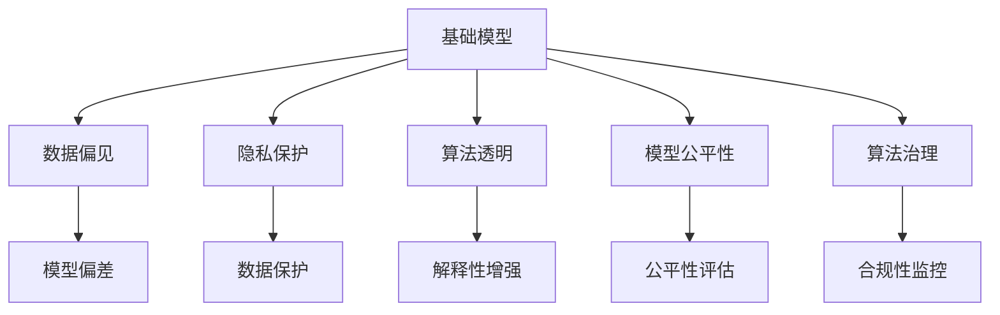

                 

# 基础模型的社会影响评估

> 关键词：基础模型,社会影响评估,机器学习伦理,数据偏见,隐私保护,算法透明,模型公平性,算法治理

## 1. 背景介绍

### 1.1 问题由来
在当今数字化和智能化的浪潮中，基础模型（Fundamental Models）在各个领域的应用日益广泛。这些模型基于大量的数据进行训练，在自然语言处理、计算机视觉、语音识别等领域展现出了强大的能力。然而，伴随着这些模型影响力的提升，其潜在的社会影响也逐渐被关注和讨论。一方面，基础模型在推动社会进步、优化决策过程、提高生活质量等方面发挥了巨大作用；另一方面，模型中可能包含的数据偏见、隐私泄露、算法不透明等问题也引起了广泛的社会关注。因此，对基础模型的社会影响进行全面评估，成为确保其技术发展与社会责任相平衡的关键。

### 1.2 问题核心关键点
基础模型社会影响评估的核心关键点包括：
- 数据偏见：基础模型训练依赖于大量数据，如何确保这些数据的多样性、公正性和代表性。
- 隐私保护：在基础模型开发和应用过程中，如何保护个人数据的隐私和安全。
- 算法透明：模型如何能够被合理地解释和理解，确保决策过程的透明度。
- 模型公平性：如何保证基础模型在不同群体中具有公平的输出，避免对某些群体的歧视或偏见。
- 算法治理：如何建立有效的算法治理机制，确保模型的开发、使用和评估符合伦理和法律要求。

## 2. 核心概念与联系

### 2.1 核心概念概述

为更好地理解基础模型社会影响评估，本节将介绍几个密切相关的核心概念：

- 基础模型（Fundamental Models）：指在大规模数据上经过深度学习训练的通用模型，如BERT、GPT等，具备强大的泛化能力，可用于各类NLP、CV等任务。

- 数据偏见（Data Bias）：指在数据集中存在对某些群体或属性的不平等对待，导致模型训练时学习到歧视性或偏见的知识。

- 隐私保护（Privacy Protection）：指在基础模型开发和应用过程中，对用户个人数据的保护，确保数据使用符合法律法规和伦理要求。

- 算法透明（Algorithmic Transparency）：指模型决策过程的可解释性和可理解性，用户能够理解模型如何得出结论。

- 模型公平性（Model Fairness）：指模型在不同群体中的预测结果能够公正地反映其属性和需求，避免对某些群体的歧视或偏见。

- 算法治理（Algorithmic Governance）：指在基础模型开发、应用和评估过程中，建立的规范和监管机制，确保算法行为符合伦理和法律标准。

这些核心概念之间的逻辑关系可以通过以下Mermaid流程图来展示：



这个流程图展示了几组核心概念之间的联系：

1. 基础模型通过数据偏见进行训练，可能学习到歧视性或偏见的知识。
2. 隐私保护和算法透明共同构成基础模型应用的伦理基础。
3. 模型公平性是算法治理的直接目标，旨在确保模型在不同群体中的公平性。
4. 算法治理是基础模型开发的规范性保障，确保模型开发、使用符合伦理和法律要求。

这些概念共同构成了基础模型社会影响评估的基础框架，使得我们能够从多个维度审视模型的潜在社会影响。

## 3. 核心算法原理 & 具体操作步骤
### 3.1 算法原理概述

基础模型的社会影响评估，本质上是一个多学科交叉的复杂问题，涉及数据科学、伦理学、法律等多领域的知识。其核心思想是：通过一系列的技术和伦理手段，评估基础模型在训练、使用和部署过程中对社会产生的各种影响，并提出改进措施，确保模型行为符合伦理和法律要求。

形式化地，假设基础模型为 $M$，训练数据集为 $D$，则社会影响评估的目标可以表述为：

$$
\text{Impact}_\text{评估} = \mathop{\arg\min}_{M,D} f_\text{影响}(M,D)
$$

其中 $f_\text{影响}$ 为影响评估函数，用于衡量模型在不同维度上的社会影响，包括但不限于数据偏见、隐私保护、算法透明、模型公平性等。通过优化 $M$ 和 $D$，使得模型在不同社会维度上的影响最小化，从而实现社会责任最大化的目标。

### 3.2 算法步骤详解

基础模型的社会影响评估一般包括以下几个关键步骤：

**Step 1: 数据收集与处理**

- 收集模型训练和应用过程中的所有相关数据，包括数据集、模型参数、用户反馈等。
- 对数据进行清洗、标注和划分，确保数据质量，为后续评估提供基础。

**Step 2: 影响因素分析**

- 对数据集进行偏见分析，识别和评估数据集中的各种偏见和歧视。
- 对模型进行隐私保护评估，确保模型在数据收集、存储和使用过程中符合隐私保护要求。
- 对模型进行透明性分析，评估模型的决策过程是否可解释、可理解。
- 对模型进行公平性评估，确保模型在不同群体中的预测结果公平、公正。

**Step 3: 影响量化与优化**

- 使用量化指标对模型在不同维度上的影响进行度量，如偏见度、隐私风险、透明性评分等。
- 根据量化结果，识别模型的潜在社会影响，提出改进措施，如数据再平衡、隐私保护策略、模型解释机制等。
- 通过优化模型参数和训练数据，提升模型在不同维度上的表现。

**Step 4: 合规性与伦理评估**

- 对模型开发、使用和部署过程中的合规性和伦理行为进行评估，确保模型开发符合伦理和法律要求。
- 建立透明的算法治理机制，确保模型开发、使用过程中有有效的监督和反馈机制。

**Step 5: 实施与反馈**

- 根据评估结果和改进措施，对模型进行优化和调整。
- 在模型部署和使用过程中，持续监测模型的社会影响，确保模型行为符合伦理和法律要求。
- 收集用户反馈，持续改进模型，确保模型与社会的良性互动。

以上是基础模型社会影响评估的一般流程。在实际应用中，还需要根据具体模型和任务的特点，对评估过程进行优化设计，如改进量化指标、引入更多社会维度评估等，以进一步提升评估的准确性和全面性。

### 3.3 算法优缺点

基础模型社会影响评估具有以下优点：
1. 全面性。通过多维度评估，确保模型在数据、隐私、公平、透明等方面符合社会要求。
2. 可操作性。基于量化指标，提出具体的改进措施，具有较强的实践指导意义。
3. 合规性。通过合规性和伦理评估，确保模型开发和使用符合伦理和法律要求。

同时，该方法也存在一定的局限性：
1. 高成本。社会影响评估需要大量时间和资源，特别是数据标注和模型优化环节。
2. 复杂性。评估涉及多学科知识，技术实现复杂，需要多方协作。
3. 主观性。量化指标和改进措施存在一定的主观性，不同评估者可能得出不同的结论。
4. 动态性。模型和数据会随着时间变化，需要持续监测和评估。

尽管存在这些局限性，但社会影响评估作为基础模型开发的重要环节，其必要性和重要性不容忽视。未来相关研究的方向应在于如何简化评估流程，提高评估效率，同时兼顾评估的全面性和深度。

### 3.4 算法应用领域

基础模型的社会影响评估在多个领域得到了广泛应用，包括但不限于：

- 自然语言处理：评估基于大规模语料训练的模型，如BERT、GPT等，在数据偏见、隐私保护、模型公平性等方面的表现。
- 计算机视觉：评估基于大规模图像数据训练的模型，如ResNet、Inception等，在数据多样性、隐私保护、模型透明性等方面的表现。
- 语音识别：评估基于语音数据训练的模型，如BERT、wav2vec等，在数据隐私、算法透明、模型公平性等方面的表现。
- 推荐系统：评估基于用户行为数据训练的模型，如Causal Matrix Factorization、Wide & Deep等，在隐私保护、算法透明、模型公平性等方面的表现。

除了这些常见领域外，基础模型的社会影响评估也被创新性地应用于更多场景中，如医疗诊断、智能合约、自动驾驶等，为技术落地应用提供了重要的保障。

## 4. 数学模型和公式 & 详细讲解 & 举例说明（备注：数学公式请使用latex格式，latex嵌入文中独立段落使用 $$，段落内使用 $)
### 4.1 数学模型构建

基础模型社会影响评估的数学模型构建，涉及多个维度的影响指标。以下以模型公平性评估为例，展示数学模型构建的过程。

假设基础模型为 $M$，训练数据集为 $D$，目标群体为 $G$，则模型公平性可以定义为：

$$
\text{Fairness}(M,D,G) = \frac{1}{|G|} \sum_{g \in G} \frac{1}{|D_g|} \sum_{(x,y) \in D_g} \mathbb{E}[\text{dist}(f(x),y) | g]
$$

其中 $D_g$ 为群体 $g$ 的样本数据集，$f(x)$ 为模型对输入 $x$ 的预测结果，$\text{dist}(f(x),y)$ 为预测结果与真实标签之间的距离（如欧式距离、KL散度等）。上述公式表示在目标群体 $G$ 中，模型对每个样本的预测误差在群体内分布的公平性。

### 4.2 公式推导过程

以下我们对模型公平性评估公式进行详细推导：

$$
\text{Fairness}(M,D,G) = \frac{1}{|G|} \sum_{g \in G} \frac{1}{|D_g|} \sum_{(x,y) \in D_g} \mathbb{E}[\text{dist}(f(x),y) | g]
$$

令 $\delta_g(x) = \mathbb{E}[\text{dist}(f(x),y) | g]$ 为群体 $g$ 内对样本 $x$ 的预测误差期望，则模型公平性公式可以重写为：

$$
\text{Fairness}(M,D,G) = \frac{1}{|G|} \sum_{g \in G} \frac{1}{|D_g|} \sum_{(x,y) \in D_g} \delta_g(x)
$$

根据公平性指标的不同定义，$\delta_g(x)$ 的计算方式也有所不同。例如，如果采用差值均值（difference of means）指标，则：

$$
\delta_g(x) = \mathbb{E}[f(x) | g] - \mathbb{E}[y | g]
$$

代入上述公平性公式，得：

$$
\text{Fairness}(M,D,G) = \frac{1}{|G|} \sum_{g \in G} \frac{1}{|D_g|} \sum_{(x,y) \in D_g} (\mathbb{E}[f(x) | g] - \mathbb{E}[y | g])
$$

该公式表示在目标群体 $G$ 中，模型对每个样本的预测误差在群体内分布的公平性。通过计算和优化模型在上述公式中的表现，可以评估模型在不同群体中的公平性。

### 4.3 案例分析与讲解

以Causal Matrix Factorization模型为例，分析其在推荐系统中的应用及其社会影响。

假设推荐系统基于用户行为数据 $D=\{(x_i,y_i)\}_{i=1}^N$ 进行训练，其中 $x_i$ 为用户的浏览记录，$y_i$ 为用户对推荐物品的评分。模型的目标是在推荐给用户物品时，保持用户评分的一致性和公平性。

首先，对训练数据进行特征工程和数据平衡处理，确保训练数据的多样性和代表性。然后，使用因果推断方法，计算模型在用户群体 $G$ 中的预测误差分布。最后，对模型公平性进行量化评估，判断模型在不同群体中的表现，提出改进措施，如数据重采样、算法优化等。

在实际应用中，还需要对模型的隐私保护、透明性、合规性等方面进行全面评估，确保模型行为符合伦理和法律要求。通过综合考虑这些维度，可以构建一个全面、系统的社会影响评估框架。

## 5. 项目实践：代码实例和详细解释说明
### 5.1 开发环境搭建

在进行社会影响评估实践前，我们需要准备好开发环境。以下是使用Python进行评估的开发环境配置流程：

1. 安装Anaconda：从官网下载并安装Anaconda，用于创建独立的Python环境。

2. 创建并激活虚拟环境：
```bash
conda create -n impact-assess-env python=3.8 
conda activate impact-assess-env
```

3. 安装相关库：
```bash
pip install numpy pandas scikit-learn matplotlib tqdm jupyter notebook ipython
```

4. 安装TensorFlow或PyTorch（视具体评估任务而定）：
```bash
pip install tensorflow
# 或
pip install torch
```

5. 安装相关的评估工具：
```bash
pip install fairness-indicators privacy-checker
```

完成上述步骤后，即可在`impact-assess-env`环境中开始社会影响评估实践。

### 5.2 源代码详细实现

这里我们以公平性评估为例，展示使用TensorFlow进行模型公平性评估的代码实现。

首先，定义公平性评估函数：

```python
import tensorflow as tf
from tensorflow.keras.metrics import Mean

def fairness_metric(y_true, y_pred, num_groups):
    group_mean_metrics = {}
    for group_id in range(num_groups):
        group_mask = tf.equal(y_true, group_id)
        group_mean = Mean()(y_true * group_mask)
        group_pred = y_pred * group_mask
        group_mean_pred = Mean()(group_pred)
        group_mean_metrics[group_id] = group_mean_pred - group_mean
        
    group_mean_metrics = tf.convert_to_tensor(group_mean_metrics)
    group_mean_metrics /= tf.cast(tf.reduce_sum(group_mask), tf.float32)
    
    return tf.reduce_mean(group_mean_metrics)
```

然后，加载数据集并进行公平性评估：

```python
# 加载数据集
train_data = ...
train_labels = ...

# 计算模型公平性
y_true = tf.reshape(train_labels, (-1,1))
y_pred = model.predict(train_data)
num_groups = len(set(train_labels))

# 评估公平性
fairness = fairness_metric(y_true, y_pred, num_groups)
```

最后，打印评估结果：

```python
print("模型公平性评估结果：", fairness.numpy())
```

以上就是使用TensorFlow进行模型公平性评估的完整代码实现。可以看到，公平性评估函数通过计算不同群体间的预测误差差异，实现了对模型公平性的量化评估。

### 5.3 代码解读与分析

让我们再详细解读一下关键代码的实现细节：

**fairness_metric函数**：
- 输入参数 $y_{true}$ 为真实标签，$y_{pred}$ 为模型预测结果。
- 使用掩码技术对不同群体进行分组，计算每个群体的平均预测误差和平均真实误差。
- 计算不同群体间的预测误差差异，并归一化至0到1之间。
- 返回模型在所有群体中的平均公平性分数。

**公平性评估**：
- 使用加载的数据集计算模型的预测结果。
- 调用fairness_metric函数，计算模型的公平性分数。
- 输出评估结果。

可以看到，公平性评估的核心在于对不同群体间的预测误差进行比较和归一化，从而量化模型的公平性。在实际应用中，还需要对数据偏见、隐私保护、透明性、合规性等方面进行全面评估，构建一个完整的社会影响评估框架。

## 6. 实际应用场景

### 6.1 医疗诊断

基础模型在医疗诊断中的应用广泛，如基于电子病历进行疾病预测、基于影像数据进行肿瘤检测等。这些模型对患者信息有较高的敏感性，涉及隐私保护和数据安全等问题。

具体而言，在医疗诊断中，需要评估模型的隐私保护措施，确保病历数据的安全性和匿名性。同时，也需要评估模型的透明性，确保医生和患者能够理解和信任模型的诊断结果。最后，还需要评估模型的公平性，确保不同性别、年龄、种族的患者能够得到公平的诊断和治疗。

### 6.2 智能合约

智能合约是区块链应用中的重要组成部分，用于自动执行和监管合约条款。基础模型在智能合约中的应用，如自动贷款审批、风险评估等，需要考虑模型的公平性、透明性和合规性。

具体而言，在智能合约中，需要评估模型的公平性，确保不同借款人和投资人的风险评估结果公平。同时，也需要评估模型的透明性，确保合约条款和执行过程透明可追溯。最后，还需要评估模型的合规性，确保合约执行符合法律法规要求。

### 6.3 自动驾驶

自动驾驶系统依赖基础模型进行环境感知、路径规划、决策制定等任务。模型的公平性、透明性和合规性直接关系到行车安全和社会责任。

具体而言，在自动驾驶中，需要评估模型的公平性，确保不同行人、车辆、障碍物的检测结果公平。同时，也需要评估模型的透明性，确保系统的决策过程透明可解释。最后，还需要评估模型的合规性，确保系统行为符合交通法律法规。

### 6.4 未来应用展望

随着基础模型的发展，其在更多领域的应用前景广阔。未来，基础模型的社会影响评估将在以下方面取得新的突破：

1. 数据多样性和代表性：在评估模型时，将更加注重数据的多样性和代表性，确保模型在不同群体中表现公平。
2. 隐私保护技术：开发更加先进的隐私保护技术，确保用户数据安全，同时提升模型应用的透明度。
3. 可解释性和透明性：进一步提升模型的可解释性和透明性，增强用户信任，提升模型应用的合规性。
4. 公平性和无偏性：开发更加公平和无偏的模型，确保模型在不同群体中的表现一致，避免歧视和偏见。
5. 算法治理机制：建立更加完善的算法治理机制，确保模型开发、使用和评估符合伦理和法律要求。

这些技术突破将进一步提升基础模型的应用价值，推动其在更多领域落地应用。相信在未来的技术发展中，基础模型的社会影响评估将发挥越来越重要的作用，成为推动技术进步和伦理发展的关键工具。

## 7. 工具和资源推荐
### 7.1 学习资源推荐

为了帮助开发者系统掌握基础模型社会影响评估的理论基础和实践技巧，这里推荐一些优质的学习资源：

1. 《公平性、透明性和隐私保护》（作者：Fayyaz & McDonald）：全面介绍公平性、透明性和隐私保护的最新研究进展，是理解相关概念和技术的必读书籍。

2. 《机器学习伦理与责任》（作者：Thrun）：讨论机器学习在伦理和责任方面的挑战，探讨如何在技术发展中实现伦理和社会责任的平衡。

3. 《深度学习与社会》（作者：Bolukbasi）：探讨深度学习在社会和伦理方面的影响，提出改进建议，以实现公平、透明和负责任的深度学习系统。

4. 《数据科学与伦理》（作者：Zheng）：讨论数据科学在伦理方面的挑战，提出数据伦理的基本原则和实践指南。

5. 《数据偏见与歧视》（作者：Varma）：探讨数据偏见和歧视在数据科学和机器学习中的问题，提出解决策略。

通过这些资源的学习实践，相信你一定能够快速掌握基础模型社会影响评估的精髓，并用于解决实际的伦理和社会问题。

### 7.2 开发工具推荐

高效的开发离不开优秀的工具支持。以下是几款用于基础模型社会影响评估开发的常用工具：

1. Python：灵活的编程语言，拥有丰富的数据处理和机器学习库，是社会影响评估的主要开发工具。

2. TensorFlow：谷歌主导的深度学习框架，支持分布式计算，适合大规模模型训练。

3. PyTorch：Facebook开发的深度学习框架，灵活高效，适合快速原型开发。

4. TensorBoard：TensorFlow配套的可视化工具，可实时监测模型训练状态，并提供丰富的图表呈现方式。

5. Weights & Biases：模型训练的实验跟踪工具，可以记录和可视化模型训练过程中的各项指标，方便对比和调优。

6. scikit-learn：简单易用的机器学习库，包含多种公平性、隐私保护等评估工具。

合理利用这些工具，可以显著提升基础模型社会影响评估的开发效率，加快创新迭代的步伐。

### 7.3 相关论文推荐

基础模型社会影响评估的研究源于学界的持续研究。以下是几篇奠基性的相关论文，推荐阅读：

1. The Fairness, Accountability, and Transparency (FAT) of Machine Learning: Six Key Issues for Future Research（作者：Zadrozny & el Alaoui）：探讨机器学习在公平性、透明性和责任方面的关键问题，提出未来研究的方向。

2. Assessing Fairness in Machine Learning: From Preparation to Evaluation（作者：Dwork & Roth）：讨论机器学习公平性评估的方法和挑战，提出多角度的评估指标。

3. Data Privacy in Machine Learning: A Survey（作者：Vaidya & Schafer）：全面综述数据隐私保护的技术和挑战，提出隐私保护的策略和方法。

4. Fairness, Accountability and Transparency in Machine Learning: Ten Guiding Principles（作者：Frasca & Ferrara）：提出机器学习公平性、透明性和责任性的十大原则，指导未来研究。

5. The Mathematics of Fairness in Machine Learning（作者：GMarkup & Holstein）：讨论机器学习公平性评估的数学方法和指标，提供多角度的评估思路。

这些论文代表了大模型社会影响评估的发展脉络。通过学习这些前沿成果，可以帮助研究者把握学科前进方向，激发更多的创新灵感。

## 8. 总结：未来发展趋势与挑战

### 8.1 总结

本文对基础模型社会影响评估进行了全面系统的介绍。首先阐述了基础模型的应用广泛性及其在数据偏见、隐私保护、透明性、公平性等方面的潜在影响。接着，从原理到实践，详细讲解了评估的数学模型和关键步骤，给出了社会影响评估的完整代码实例。同时，本文还探讨了基础模型在医疗诊断、智能合约、自动驾驶等多个领域的应用场景，展示了评估的广泛应用前景。最后，本文精选了社会影响评估的学习资源、开发工具和相关论文，力求为读者提供全方位的技术指引。

通过本文的系统梳理，可以看到，基础模型的社会影响评估对于确保模型开发和使用符合伦理和法律要求具有重要意义。这种评估不仅有助于提升模型的公平性、透明性和隐私保护，还能促进技术的良性发展，造福社会。

### 8.2 未来发展趋势

展望未来，基础模型社会影响评估将呈现以下几个发展趋势：

1. 数据多样性和代表性：随着数据多样性和代表性的重视，社会影响评估将更加注重数据的多样性和公平性，确保模型在不同群体中表现一致。

2. 隐私保护技术：随着隐私保护要求的提升，社会影响评估将进一步开发和应用先进的隐私保护技术，确保用户数据的安全和匿名。

3. 可解释性和透明性：未来的模型将更加注重可解释性和透明性，社会影响评估也将更加注重模型的解释性和透明性，增强用户信任。

4. 公平性和无偏性：未来的模型将更加公平和无偏，社会影响评估也将更加注重模型的公平性和无偏性，避免歧视和偏见。

5. 算法治理机制：未来的模型将建立更加完善的算法治理机制，社会影响评估也将更加注重算法的治理，确保模型开发和使用符合伦理和法律要求。

以上趋势凸显了基础模型社会影响评估的重要性。这些方向的探索发展，将进一步提升基础模型应用的伦理性和安全性，推动人工智能技术向更广泛的应用领域发展。

### 8.3 面临的挑战

尽管基础模型社会影响评估技术已经取得了一定的进展，但在迈向更加智能化、普适化应用的过程中，仍面临诸多挑战：

1. 高成本：社会影响评估需要大量时间和资源，特别是数据标注和模型优化环节，成本较高。

2. 复杂性：评估涉及多学科知识，技术实现复杂，需要多方协作。

3. 主观性：量化指标和改进措施存在一定的主观性，不同评估者可能得出不同的结论。

4. 动态性：模型和数据会随着时间变化，需要持续监测和评估。

尽管存在这些挑战，但社会影响评估作为基础模型开发的重要环节，其必要性和重要性不容忽视。未来相关研究的方向应在于如何简化评估流程，提高评估效率，同时兼顾评估的全面性和深度。

### 8.4 研究展望

面对基础模型社会影响评估所面临的挑战，未来的研究需要在以下几个方面寻求新的突破：

1. 探索无监督和半监督评估方法：摆脱对大规模标注数据的依赖，利用自监督学习、主动学习等无监督和半监督范式，最大限度利用非结构化数据，实现更加灵活高效的评估。

2. 开发更加高效和通用的评估工具：开发更加高效、易于使用的评估工具，提升评估效率和准确性。

3. 引入多学科知识：将社会科学、伦理学、法律等多学科知识引入评估过程，提升评估的全面性和深度。

4. 建立开放的评估平台：建立开放的评估平台，鼓励多方参与评估和改进，提升评估的透明度和公正性。

5. 探索跨领域评估方法：探索跨领域评估方法，提升评估的泛化性和普适性。

这些研究方向的探索，将引领基础模型社会影响评估技术迈向更高的台阶，为构建安全、可靠、可解释、可控的智能系统铺平道路。面向未来，基础模型社会影响评估技术还需要与其他人工智能技术进行更深入的融合，如知识表示、因果推理、强化学习等，多路径协同发力，共同推动自然语言理解和智能交互系统的进步。只有勇于创新、敢于突破，才能不断拓展基础模型的边界，让智能技术更好地造福人类社会。

## 9. 附录：常见问题与解答

**Q1：基础模型评估是否可以完全自动化？**

A: 基础模型评估的自动化是一个复杂且存在挑战性的问题。虽然目前已经有不少自动化评估工具，但在很多情况下，人工干预仍然是必要的。特别是在隐私保护、透明性和公平性等方面，往往需要专家团队进行人工评估和解释。因此，完全自动化的基础模型评估仍然是一个未来的研究方向。

**Q2：评估结果是否具有普适性？**

A: 评估结果的普适性取决于数据和模型的多样性。如果评估数据集和模型足够多样化，评估结果的普适性会更强。然而，实际应用中数据的多样性往往受到限制，特别是在特定领域或特定用户群体中，评估结果的普适性可能较弱。因此，需要在评估过程中进行多维度、多层次的评估，以确保评估结果的全面性和可靠性。

**Q3：如何平衡评估的全面性和效率？**

A: 评估全面性和效率的平衡是一个重要的问题。在资源有限的情况下，需要进行优先级排序，确保最重要的维度得到充分评估。同时，可以采用数据压缩、特征选择等方法，减少评估的数据量和计算量，提高评估效率。另外，也可以引入自动化评估工具，提升评估速度。

**Q4：如何确保评估指标的客观性？**

A: 评估指标的客观性是评估成功的关键。为了确保指标的客观性，需要采用多种评估方法，进行交叉验证。同时，可以引入第三方评估机构进行独立评估，确保评估结果的公正性和可靠性。另外，还需要进行定性和定量的评估，综合考虑技术和社会因素。

**Q5：如何确保评估结果的可解释性？**

A: 确保评估结果的可解释性是评估的重要目标之一。可以使用可视化工具、解释性模型等方法，帮助用户理解和解释评估结果。同时，可以提供详细的评估报告，说明评估过程和结果。另外，还可以与专家团队合作，提供专业的解释和建议。

通过以上问题的解答，可以看到，基础模型社会影响评估是一个复杂且多维度的问题。在实际应用中，需要综合考虑技术、伦理、法律等多方面的因素，确保评估结果的全面性和可靠性，为模型开发和应用提供有力支持。

---

作者：禅与计算机程序设计艺术 / Zen and the Art of Computer Programming

