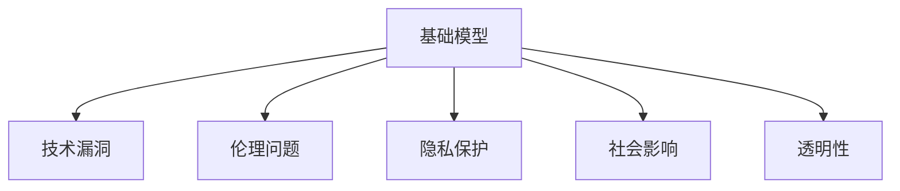

                 

# 基础模型的社会技术问题

> 关键词：基础模型,技术漏洞,伦理问题,隐私保护,社会影响,透明性

## 1. 背景介绍

### 1.1 问题由来
在人工智能(AI)领域，基础模型(即预训练模型)以其广泛的通用性和高效的迁移学习能力，成为许多应用的基础架构。从自然语言处理(NLP)的BERT、GPT-3，到计算机视觉领域的ResNet、Inception，基础模型在各行各业的应用已经深入人心。然而，随着这些模型影响力的日益扩大，其带来的社会技术问题也逐渐凸显。

基础模型不仅具有技术上的优越性，还涉及伦理、隐私、透明性等多方面的社会考量。如何在使用基础模型的同时，妥善解决这些复杂问题，是当前AI研究的重要方向。本文旨在深入探讨基础模型的社会技术问题，从原理到应用，提出全方位的解决方案。

### 1.2 问题核心关键点
基础模型的社会技术问题主要体现在以下几个方面：

1. **技术漏洞**：模型训练和应用的各个环节都可能存在漏洞，导致安全性和可靠性问题。
2. **伦理问题**：模型训练数据可能包含偏见和有害信息，模型决策过程难以解释，可能产生不公平和歧视性结果。
3. **隐私保护**：基础模型依赖大量用户数据进行训练，如何在保证性能的同时保护用户隐私，是一大挑战。
4. **社会影响**：基础模型的广泛应用可能带来不可预知的社会影响，如就业替代、信息过载等。
5. **透明性**：基础模型的决策过程和内部机制不够透明，用户难以理解和信任模型的输出结果。

这些问题不仅是技术上的挑战，更是社会伦理和法律层面的考量。解决这些问题需要跨学科合作，结合技术、法律、伦理等多方面的努力。

## 2. 核心概念与联系

### 2.1 核心概念概述

为更好地理解基础模型的社会技术问题，本节将介绍几个密切相关的核心概念：

- **基础模型(Base Model)**：即预训练模型，通过在大规模无标签数据上自监督学习获得通用表示的深度学习模型。常用的包括BERT、GPT、ResNet等。
- **技术漏洞**：指在模型训练、推理和应用过程中可能出现的安全漏洞和错误。
- **伦理问题**：指模型在训练、部署和应用过程中可能带来的伦理问题，如偏见、歧视、隐私侵犯等。
- **隐私保护**：指在模型训练和应用过程中保护用户数据隐私的措施和机制。
- **社会影响**：指基础模型对社会结构、经济、文化等方面的影响。
- **透明性**：指模型决策过程和内部机制的可解释性，使用户能够理解和信任模型的输出结果。

这些核心概念之间的逻辑关系可以通过以下Mermaid流程图来展示：



这个流程图展示了几大核心概念之间的相互关系：

1. 基础模型的存在是技术漏洞、伦理问题、隐私保护、社会影响和透明性的共同来源。
2. 技术漏洞和伦理问题可能导致模型的不公平、不可靠，进而影响社会影响和透明性。
3. 隐私保护是解决伦理问题的重要手段之一。
4. 社会影响和透明性又是衡量基础模型应用是否合理、公平的重要指标。

## 3. 核心算法原理 & 具体操作步骤
### 3.1 算法原理概述

基础模型的社会技术问题主要涉及以下几个方面：

1. **技术漏洞**：包括模型设计漏洞、数据处理漏洞、训练漏洞等。
2. **伦理问题**：如训练数据中的偏见、模型决策的透明性、模型决策的公平性等。
3. **隐私保护**：如何在模型训练和应用中保护用户隐私，防止数据泄露和滥用。
4. **社会影响**：基础模型对就业、信息过载、社会关系等社会层面的影响。
5. **透明性**：模型决策过程的可解释性和用户信任度的提升。

解决这些问题需要从多个层面进行技术设计和伦理考虑。

### 3.2 算法步骤详解

#### 3.2.1 技术漏洞分析

基础模型的技术漏洞主要包括：

1. **设计漏洞**：如模型架构的复杂性、训练数据的偏差、参数的过度拟合等。
2. **数据处理漏洞**：如数据标注的错误、数据泄露、数据注入等。
3. **训练漏洞**：如训练过程中的梯度消失、梯度爆炸、过拟合等。

这些问题需要通过模型优化、数据清洗、训练策略改进等方式来解决。例如，使用更稳定的模型架构、引入正则化、使用对抗样本训练等方法可以有效避免技术漏洞。

#### 3.2.2 伦理问题解决

基础模型的伦理问题主要涉及：

1. **训练数据中的偏见**：训练数据可能包含性别、种族、年龄等偏见，导致模型对某些群体不公平。
2. **模型决策的透明性**：模型的决策过程难以解释，用户难以理解模型为何做出某种决策。
3. **模型决策的公平性**：模型可能在不同群体中产生不公平的结果。

这些问题需要通过数据预处理、模型透明性提升和公平性优化等方式来解决。例如，使用公平性约束、引入可解释性技术、对模型进行公平性评估等方法可以缓解伦理问题。

#### 3.2.3 隐私保护措施

基础模型的隐私保护主要涉及：

1. **数据匿名化**：将训练数据中的个人身份信息去除，防止数据泄露。
2. **差分隐私**：在数据处理过程中引入噪声，防止攻击者通过分析数据推测个体信息。
3. **模型本地化**：将模型训练在本地设备上进行，减少数据传输和存储风险。

这些问题需要通过数据保护技术和隐私保护机制来解决。例如，使用差分隐私算法、分布式训练、本地模型推理等方法可以有效保护隐私。

#### 3.2.4 社会影响分析

基础模型的社会影响主要涉及：

1. **就业替代**：大规模自动化可能导致某些职业的消失。
2. **信息过载**：基础模型生成的信息量过大，可能使用户难以消化和理解。
3. **社会关系**：基础模型可能改变人与人之间的互动方式，影响社会结构。

这些问题需要通过社会经济分析和伦理规范来解决。例如，制定行业标准、推广终身学习、设计人机交互方式等方法可以有效缓解社会影响。

#### 3.2.5 透明性提升

基础模型的透明性主要涉及：

1. **模型可解释性**：使用户能够理解模型的决策过程和内部机制。
2. **决策过程可视化**：通过可视化工具展示模型推理过程。
3. **用户反馈机制**：建立用户反馈渠道，收集用户对模型输出的意见。

这些问题需要通过可解释性技术和用户交互设计来解决。例如，使用可视化工具、引入用户反馈、改进模型推理过程等方法可以提升透明性。

### 3.3 算法优缺点

基础模型的技术漏洞、伦理问题、隐私保护、社会影响和透明性问题，各自具有不同的优缺点：

- **技术漏洞**：
  - 优点：易于发现和修复，通常可以通过改进模型设计和训练策略来解决。
  - 缺点：某些漏洞可能难以完全消除，尤其是在复杂模型中。

- **伦理问题**：
  - 优点：可以通过明确伦理规范和改进算法来解决，逐步提升模型的公平性和透明性。
  - 缺点：在某些情况下，模型的决策可能难以完全避免偏见和不公平。

- **隐私保护**：
  - 优点：通过技术手段可以较好地保护用户隐私，降低数据泄露风险。
  - 缺点：某些隐私保护措施可能对模型性能产生负面影响。

- **社会影响**：
  - 优点：通过政策和社会规范可以控制基础模型的社会影响，减少负面影响。
  - 缺点：社会影响具有广泛性和复杂性，难以完全预测和控制。

- **透明性**：
  - 优点：提升模型透明性可以增加用户信任，改善人机交互体验。
  - 缺点：某些模型的复杂性和抽象性可能难以完全解释。

## 4. 数学模型和公式 & 详细讲解  
### 4.1 数学模型构建

为更好地理解基础模型的社会技术问题，本节将介绍几个数学模型构建相关的核心概念和公式：

- **基础模型**：$M_\theta(x)$，其中$\theta$为模型参数，$x$为输入数据。
- **技术漏洞**：$V(M_\theta)$，表示模型存在漏洞的概率。
- **伦理问题**：$E(M_\theta)$，表示模型伦理问题的严重程度。
- **隐私保护**：$P(M_\theta)$，表示模型隐私保护的有效性。
- **社会影响**：$S(M_\theta)$，表示模型对社会的影响程度。
- **透明性**：$T(M_\theta)$，表示模型透明性的水平。

### 4.2 公式推导过程

以下是几个与基础模型相关的数学公式：

1. **技术漏洞公式**：
   $$
   V(M_\theta) = \sum_{i=1}^n p_i V_i
   $$
   其中，$V_i$ 表示第 $i$ 个漏洞的概率，$p_i$ 表示漏洞 $i$ 对模型的影响程度。

2. **伦理问题公式**：
   $$
   E(M_\theta) = \sum_{j=1}^m p_j E_j
   $$
   其中，$E_j$ 表示第 $j$ 个伦理问题的严重程度，$p_j$ 表示伦理问题 $j$ 对模型的影响程度。

3. **隐私保护公式**：
   $$
   P(M_\theta) = \sum_{k=1}^K p_k P_k
   $$
   其中，$P_k$ 表示第 $k$ 个隐私保护措施的效果，$p_k$ 表示隐私保护措施 $k$ 对模型的影响程度。

4. **社会影响公式**：
   $$
   S(M_\theta) = \sum_{l=1}^L p_l S_l
   $$
   其中，$S_l$ 表示第 $l$ 个社会影响的严重程度，$p_l$ 表示社会影响 $l$ 对模型的影响程度。

5. **透明性公式**：
   $$
   T(M_\theta) = \sum_{t=1}^T p_t T_t
   $$
   其中，$T_t$ 表示第 $t$ 个透明性指标的数值，$p_t$ 表示透明性指标 $t$ 对模型的影响程度。

### 4.3 案例分析与讲解

以自然语言处理(NLP)中的BERT模型为例，分析其技术漏洞、伦理问题、隐私保护、社会影响和透明性问题。

#### 4.3.1 技术漏洞分析

BERT模型可能存在以下技术漏洞：

1. **过拟合**：在训练过程中，BERT模型可能在训练数据上过度拟合，导致泛化性能下降。
2. **梯度消失**：在深度网络中，梯度在反向传播过程中可能消失，导致某些层无法更新参数。
3. **数据注入**：在训练过程中，可能存在数据注入攻击，通过故意修改训练数据来影响模型训练结果。

这些问题需要通过模型优化、正则化和对抗样本训练等方法来解决。

#### 4.3.2 伦理问题解决

BERT模型可能存在以下伦理问题：

1. **训练数据偏见**：BERT模型训练数据可能包含性别、种族等偏见，导致模型对这些群体不公平。
2. **模型决策透明性**：BERT模型的决策过程难以解释，用户难以理解模型为何做出某种决策。
3. **模型决策公平性**：BERT模型可能在不同群体中产生不公平的结果。

这些问题需要通过数据清洗、可解释性技术和公平性评估等方法来解决。

#### 4.3.3 隐私保护措施

BERT模型的隐私保护问题主要涉及：

1. **数据匿名化**：在训练过程中，将训练数据中的个人身份信息去除，防止数据泄露。
2. **差分隐私**：在数据处理过程中引入噪声，防止攻击者通过分析数据推测个体信息。
3. **模型本地化**：将模型训练在本地设备上进行，减少数据传输和存储风险。

这些问题需要通过数据保护技术和隐私保护机制来解决。

#### 4.3.4 社会影响分析

BERT模型的社会影响问题主要涉及：

1. **就业替代**：BERT模型在自然语言生成任务上的应用可能导致某些职业的消失，如翻译、编辑等。
2. **信息过载**：BERT模型生成的文本可能量过大，导致用户难以消化和理解。
3. **社会关系**：BERT模型可能改变人与人之间的互动方式，影响社会结构。

这些问题需要通过社会经济分析和伦理规范来解决。

#### 4.3.5 透明性提升

BERT模型的透明性问题主要涉及：

1. **模型可解释性**：使用户能够理解BERT模型的决策过程和内部机制。
2. **决策过程可视化**：通过可视化工具展示BERT模型推理过程。
3. **用户反馈机制**：建立用户反馈渠道，收集用户对模型输出的意见。

这些问题需要通过可解释性技术和用户交互设计来解决。

## 5. 项目实践：代码实例和详细解释说明
### 5.1 开发环境搭建

在进行基础模型应用实践前，我们需要准备好开发环境。以下是使用Python进行PyTorch开发的环境配置流程：

1. 安装Anaconda：从官网下载并安装Anaconda，用于创建独立的Python环境。

2. 创建并激活虚拟环境：
```bash
conda create -n pytorch-env python=3.8 
conda activate pytorch-env
```

3. 安装PyTorch：根据CUDA版本，从官网获取对应的安装命令。例如：
```bash
conda install pytorch torchvision torchaudio cudatoolkit=11.1 -c pytorch -c conda-forge
```

4. 安装Transformers库：
```bash
pip install transformers
```

5. 安装各类工具包：
```bash
pip install numpy pandas scikit-learn matplotlib tqdm jupyter notebook ipython
```

完成上述步骤后，即可在`pytorch-env`环境中开始基础模型的应用实践。

### 5.2 源代码详细实现

下面我们以BERT模型为例，给出使用Transformers库对文本分类任务进行微调的PyTorch代码实现。

首先，定义文本分类任务的数据处理函数：

```python
from transformers import BertTokenizer
from torch.utils.data import Dataset
import torch

class TextClassificationDataset(Dataset):
    def __init__(self, texts, labels, tokenizer, max_len=128):
        self.texts = texts
        self.labels = labels
        self.tokenizer = tokenizer
        self.max_len = max_len
        
    def __len__(self):
        return len(self.texts)
    
    def __getitem__(self, item):
        text = self.texts[item]
        label = self.labels[item]
        
        encoding = self.tokenizer(text, return_tensors='pt', max_length=self.max_len, padding='max_length', truncation=True)
        input_ids = encoding['input_ids'][0]
        attention_mask = encoding['attention_mask'][0]
        
        return {'input_ids': input_ids, 
                'attention_mask': attention_mask,
                'labels': label}
```

然后，定义模型和优化器：

```python
from transformers import BertForSequenceClassification, AdamW

model = BertForSequenceClassification.from_pretrained('bert-base-cased', num_labels=2)

optimizer = AdamW(model.parameters(), lr=2e-5)
```

接着，定义训练和评估函数：

```python
from torch.utils.data import DataLoader
from tqdm import tqdm
from sklearn.metrics import classification_report

device = torch.device('cuda') if torch.cuda.is_available() else torch.device('cpu')
model.to(device)

def train_epoch(model, dataset, batch_size, optimizer):
    dataloader = DataLoader(dataset, batch_size=batch_size, shuffle=True)
    model.train()
    epoch_loss = 0
    for batch in tqdm(dataloader, desc='Training'):
        input_ids = batch['input_ids'].to(device)
        attention_mask = batch['attention_mask'].to(device)
        labels = batch['labels'].to(device)
        model.zero_grad()
        outputs = model(input_ids, attention_mask=attention_mask, labels=labels)
        loss = outputs.loss
        epoch_loss += loss.item()
        loss.backward()
        optimizer.step()
    return epoch_loss / len(dataloader)

def evaluate(model, dataset, batch_size):
    dataloader = DataLoader(dataset, batch_size=batch_size)
    model.eval()
    preds, labels = [], []
    with torch.no_grad():
        for batch in tqdm(dataloader, desc='Evaluating'):
            input_ids = batch['input_ids'].to(device)
            attention_mask = batch['attention_mask'].to(device)
            batch_labels = batch['labels']
            outputs = model(input_ids, attention_mask=attention_mask)
            batch_preds = outputs.logits.argmax(dim=1).to('cpu').tolist()
            batch_labels = batch_labels.to('cpu').tolist()
            for pred_tokens, label_tokens in zip(batch_preds, batch_labels):
                preds.append(pred_tokens)
                labels.append(label_tokens)
                
    print(classification_report(labels, preds))
```

最后，启动训练流程并在测试集上评估：

```python
epochs = 5
batch_size = 16

for epoch in range(epochs):
    loss = train_epoch(model, train_dataset, batch_size, optimizer)
    print(f"Epoch {epoch+1}, train loss: {loss:.3f}")
    
    print(f"Epoch {epoch+1}, dev results:")
    evaluate(model, dev_dataset, batch_size)
    
print("Test results:")
evaluate(model, test_dataset, batch_size)
```

以上就是使用PyTorch对BERT进行文本分类任务微调的完整代码实现。可以看到，得益于Transformers库的强大封装，我们可以用相对简洁的代码完成BERT模型的加载和微调。

### 5.3 代码解读与分析

让我们再详细解读一下关键代码的实现细节：

**TextClassificationDataset类**：
- `__init__`方法：初始化文本、标签、分词器等关键组件。
- `__len__`方法：返回数据集的样本数量。
- `__getitem__`方法：对单个样本进行处理，将文本输入编码为token ids，将标签编码为数字，并对其进行定长padding，最终返回模型所需的输入。

**模型和优化器**：
- 使用PyTorch的BertForSequenceClassification模块加载预训练的BERT模型，并进行微调。
- 设置AdamW优化器，控制学习率等超参数。

**训练和评估函数**：
- 使用PyTorch的DataLoader对数据集进行批次化加载，供模型训练和推理使用。
- 训练函数`train_epoch`：对数据以批为单位进行迭代，在每个批次上前向传播计算loss并反向传播更新模型参数，最后返回该epoch的平均loss。
- 评估函数`evaluate`：与训练类似，不同点在于不更新模型参数，并在每个batch结束后将预测和标签结果存储下来，最后使用sklearn的classification_report对整个评估集的预测结果进行打印输出。

**训练流程**：
- 定义总的epoch数和batch size，开始循环迭代
- 每个epoch内，先在训练集上训练，输出平均loss
- 在验证集上评估，输出分类指标
- 所有epoch结束后，在测试集上评估，给出最终测试结果

可以看到，PyTorch配合Transformers库使得BERT微调的代码实现变得简洁高效。开发者可以将更多精力放在数据处理、模型改进等高层逻辑上，而不必过多关注底层的实现细节。

当然，工业级的系统实现还需考虑更多因素，如模型的保存和部署、超参数的自动搜索、更灵活的任务适配层等。但核心的微调范式基本与此类似。

## 6. 实际应用场景
### 6.1 智能客服系统

基础模型的应用不仅限于技术领域，还可以在社会层面产生广泛影响。以智能客服系统为例，基础模型可以在该领域发挥重要作用。

传统的客服系统依赖人工客服，高峰期响应缓慢，且一致性和专业性难以保证。而使用基础模型进行智能客服系统构建，可以7x24小时不间断服务，快速响应客户咨询，用自然流畅的语言解答各类常见问题。

在技术实现上，可以收集企业内部的历史客服对话记录，将问题和最佳答复构建成监督数据，在此基础上对预训练基础模型进行微调。微调后的基础模型能够自动理解用户意图，匹配最合适的答复。对于客户提出的新问题，还可以接入检索系统实时搜索相关内容，动态组织生成回答。如此构建的智能客服系统，能大幅提升客户咨询体验和问题解决效率。

### 6.2 金融舆情监测

基础模型在金融领域也有广泛应用。金融机构需要实时监测市场舆论动向，以便及时应对负面信息传播，规避金融风险。

传统的人工监测方式成本高、效率低，难以应对网络时代海量信息爆发的挑战。基础模型可以用于金融舆情监测，通过收集金融领域相关的新闻、报道、评论等文本数据，进行情绪分析和主题分析，实时监测不同主题下的情感变化趋势，一旦发现负面信息激增等异常情况，系统便会自动预警，帮助金融机构快速应对潜在风险。

### 6.3 个性化推荐系统

基础模型在个性化推荐系统中也得到了广泛应用。当前的推荐系统往往只依赖用户的历史行为数据进行物品推荐，无法深入理解用户的真实兴趣偏好。

使用基础模型进行个性化推荐系统构建，可以通过收集用户浏览、点击、评论、分享等行为数据，提取和用户交互的物品标题、描述、标签等文本内容，对文本内容进行建模，从而得到用户的兴趣点。在生成推荐列表时，先用候选物品的文本描述作为输入，由基础模型预测用户的兴趣匹配度，再结合其他特征综合排序，便可以得到个性化程度更高的推荐结果。

### 6.4 未来应用展望

随着基础模型的不断发展，其在各个领域的广泛应用将进一步拓展。

在智慧医疗领域，基础模型可用于医疗问答、病历分析、药物研发等任务，提升医疗服务的智能化水平，辅助医生诊疗，加速新药开发进程。

在智能教育领域，基础模型可以用于作业批改、学情分析、知识推荐等方面，因材施教，促进教育公平，提高教学质量。

在智慧城市治理中，基础模型可用于城市事件监测、舆情分析、应急指挥等环节，提高城市管理的自动化和智能化水平，构建更安全、高效的未来城市。

此外，在企业生产、社会治理、文娱传媒等众多领域，基础模型的应用也将不断涌现，为传统行业带来变革性影响。

## 7. 工具和资源推荐
### 7.1 学习资源推荐

为了帮助开发者系统掌握基础模型的技术细节和应用场景，这里推荐一些优质的学习资源：

1. 《深度学习基础》系列博文：由深度学习专家撰写，深入浅出地介绍了深度学习的基本概念和算法原理，适合初学者入门。

2. 《Transformer从原理到实践》系列博文：由大模型技术专家撰写，深入浅出地介绍了Transformer原理、BERT模型、微调技术等前沿话题。

3. 《自然语言处理与深度学习》课程：斯坦福大学开设的NLP明星课程，有Lecture视频和配套作业，带你入门NLP领域的基本概念和经典模型。

4. 《Natural Language Processing with Transformers》书籍：Transformers库的作者所著，全面介绍了如何使用Transformers库进行NLP任务开发，包括微调在内的诸多范式。

5. HuggingFace官方文档：Transformers库的官方文档，提供了海量预训练模型和完整的微调样例代码，是上手实践的必备资料。

通过对这些资源的学习实践，相信你一定能够快速掌握基础模型的精髓，并用于解决实际的NLP问题。

### 7.2 开发工具推荐

高效的开发离不开优秀的工具支持。以下是几款用于基础模型应用开发的常用工具：

1. PyTorch：基于Python的开源深度学习框架，灵活动态的计算图，适合快速迭代研究。大部分预训练语言模型都有PyTorch版本的实现。

2. TensorFlow：由Google主导开发的开源深度学习框架，生产部署方便，适合大规模工程应用。同样有丰富的预训练语言模型资源。

3. Transformers库：HuggingFace开发的NLP工具库，集成了众多SOTA语言模型，支持PyTorch和TensorFlow，是进行基础模型微调任务开发的利器。

4. Weights & Biases：模型训练的实验跟踪工具，可以记录和可视化模型训练过程中的各项指标，方便对比和调优。与主流深度学习框架无缝集成。

5. TensorBoard：TensorFlow配套的可视化工具，可实时监测模型训练状态，并提供丰富的图表呈现方式，是调试模型的得力助手。

6. Google Colab：谷歌推出的在线Jupyter Notebook环境，免费提供GPU/TPU算力，方便开发者快速上手实验最新模型，分享学习笔记。

合理利用这些工具，可以显著提升基础模型应用开发的效率，加快创新迭代的步伐。

### 7.3 相关论文推荐

基础模型和微调技术的发展源于学界的持续研究。以下是几篇奠基性的相关论文，推荐阅读：

1. Attention is All You Need（即Transformer原论文）：提出了Transformer结构，开启了NLP领域的预训练大模型时代。

2. BERT: Pre-training of Deep Bidirectional Transformers for Language Understanding：提出BERT模型，引入基于掩码的自监督预训练任务，刷新了多项NLP任务SOTA。

3. Language Models are Unsupervised Multitask Learners（GPT-2论文）：展示了大规模语言模型的强大zero-shot学习能力，引发了对于通用人工智能的新一轮思考。

4. Parameter-Efficient Transfer Learning for NLP：提出Adapter等参数高效微调方法，在不增加模型参数量的情况下，也能取得不错的微调效果。

5. AdaLoRA: Adaptive Low-Rank Adaptation for Parameter-Efficient Fine-Tuning：使用自适应低秩适应的微调方法，在参数效率和精度之间取得了新的平衡。

这些论文代表了大语言模型微调技术的发展脉络。通过学习这些前沿成果，可以帮助研究者把握学科前进方向，激发更多的创新灵感。

## 8. 总结：未来发展趋势与挑战
### 8.1 总结

本文对基础模型的社会技术问题进行了全面系统的介绍。首先阐述了基础模型的技术漏洞、伦理问题、隐私保护、社会影响和透明性问题，明确了这些问题在基础模型应用中的重要性和复杂性。其次，从原理到实践，详细讲解了这些问题在实际应用中的解决策略，给出了微调任务开发的完整代码实例。同时，本文还广泛探讨了基础模型在各个领域的应用前景，展示了其巨大的潜力。

通过本文的系统梳理，可以看到，基础模型在技术漏洞、伦理问题、隐私保护、社会影响和透明性问题上仍面临诸多挑战，需要通过多方面的努力来解决。但正是这些复杂的问题，使得基础模型在社会技术层面产生了广泛影响，成为人工智能技术落地应用的重要组成部分。相信随着学界和产业界的共同努力，这些问题终将一一被克服，基础模型必将在构建人机协同的智能时代中扮演越来越重要的角色。

### 8.2 未来发展趋势

展望未来，基础模型的社会技术问题将呈现以下几个发展趋势：

1. **技术漏洞修复**：随着深度学习技术的发展，技术漏洞的修复方法和工具将不断进步，模型设计和训练策略也将更加科学和合理。

2. **伦理规范完善**：随着对伦理问题的重视，伦理规范将更加完善，模型的训练和应用将更加注重公平性和透明性。

3. **隐私保护加强**：随着数据隐私保护技术的提升，隐私保护措施将更加严格，用户数据将得到更好的保护。

4. **社会影响优化**：随着对社会影响的关注，基础模型将更加注重对就业、信息过载等问题的控制，模型设计将更加注重社会效益。

5. **透明性提升**：随着可解释性技术的发展，模型的透明性将逐步提升，用户对模型的信任度将更高。

这些趋势将推动基础模型在各个领域的广泛应用，为社会带来更多正能量。

### 8.3 面临的挑战

尽管基础模型在各个领域的应用取得了显著进展，但在迈向更加智能化、普适化应用的过程中，仍面临诸多挑战：

1. **技术漏洞**：随着模型复杂度的增加，技术漏洞的风险也在增加，模型设计和训练的复杂性也将带来新的挑战。

2. **伦理问题**：伦理问题的解决需要跨学科合作，涉及到法律、伦理等多个方面，难度较大。

3. **隐私保护**：在数据隐私保护和模型训练之间取得平衡，需要更多的技术手段和管理机制。

4. **社会影响**：基础模型的社会影响具有广泛性和复杂性，难以完全预测和控制。

5. **透明性**：模型的复杂性和抽象性使得其透明性提升存在一定难度，需要更多的技术创新。

这些挑战需要跨学科合作，结合技术、法律、伦理等多方面的努力，才能得到妥善解决。

### 8.4 研究展望

未来研究需要在以下几个方面寻求新的突破：

1. **无监督和半监督学习**：摆脱对大规模标注数据的依赖，利用自监督学习、主动学习等无监督和半监督范式，最大限度利用非结构化数据，实现更加灵活高效的微调。

2. **参数高效和计算高效微调**：开发更加参数高效的微调方法，在固定大部分预训练参数的同时，只更新极少量的任务相关参数。同时优化微调模型的计算图，减少前向传播和反向传播的资源消耗，实现更加轻量级、实时性的部署。

3. **因果分析和博弈论工具**：将因果分析方法引入微调模型，识别出模型决策的关键特征，增强输出解释的因果性和逻辑性。借助博弈论工具刻画人机交互过程，主动探索并规避模型的脆弱点，提高系统稳定性。

4. **融合伦理和法律规范**：在模型训练目标中引入伦理导向的评估指标，过滤和惩罚有偏见、有害的输出倾向。同时加强人工干预和审核，建立模型行为的监管机制，确保输出符合人类价值观和伦理道德。

5. **人机交互设计和用户反馈**：引入可解释性技术和用户交互设计，使用户能够理解模型的决策过程和内部机制，提升模型透明性和用户信任度。建立用户反馈渠道，收集用户对模型输出的意见，不断优化模型性能。

这些研究方向将推动基础模型向更加智能化、普适化应用迈进，为构建安全、可靠、可解释、可控的智能系统铺平道路。面向未来，基础模型的研究需要在技术、伦理、法律等多个层面协同发力，才能真正实现人工智能技术的广泛应用。

## 9. 附录：常见问题与解答

**Q1：基础模型是否适用于所有NLP任务？**

A: 基础模型在大多数NLP任务上都能取得不错的效果，特别是对于数据量较小的任务。但对于一些特定领域的任务，如医学、法律等，仅仅依靠通用语料预训练的模型可能难以很好地适应。此时需要在特定领域语料上进一步预训练，再进行微调，才能获得理想效果。此外，对于一些需要时效性、个性化很强的任务，如对话、推荐等，基础模型也需要针对性的改进优化。

**Q2：如何缓解基础模型中的技术漏洞？**

A: 缓解基础模型中的技术漏洞需要从模型设计和训练两个方面入手：

1. **模型设计**：选择更加稳定和可解释的模型架构，如使用Transformer等结构。引入正则化技术，如L2正则、Dropout等，防止模型过度拟合。

2. **训练策略**：使用对抗样本训练，增强模型对噪声和攻击的鲁棒性。引入数据增强技术，如数据扩充、标签平滑等，增加数据多样性。使用梯度裁剪、学习率衰减等技术，防止梯度爆炸和梯度消失。

**Q3：如何保护基础模型中的用户隐私？**

A: 保护基础模型中的用户隐私需要从数据保护和模型设计两个方面入手：

1. **数据保护**：在数据收集和处理过程中，采用数据匿名化、差分隐私等技术，防止数据泄露和滥用。限制数据访问权限，仅允许必要的角色和系统访问数据。

2. **模型设计**：在模型训练过程中，使用本地化训练和联邦学习等技术，将模型训练在本地设备上进行，减少数据传输和存储风险。设计差分隐私模型，在训练过程中引入噪声，防止攻击者通过分析数据推测个体信息。

**Q4：基础模型在实际应用中可能带来哪些社会影响？**

A: 基础模型在实际应用中可能带来的社会影响包括：

1. **就业替代**：大规模自动化可能导致某些职业的消失，如翻译、编辑等。

2. **信息过载**：基础模型生成的信息量过大，导致用户难以消化和理解。

3. **社会关系**：基础模型可能改变人与人之间的互动方式，影响社会结构。

这些影响需要通过社会经济分析和伦理规范来解决，例如制定行业标准、推广终身学习、设计人机交互方式等。

**Q5：如何提升基础模型的透明性？**

A: 提升基础模型的透明性需要从模型设计和用户交互两个方面入手：

1. **模型设计**：使用可解释性技术，如特征重要性可视化、决策树等，增加模型的可解释性。引入模型压缩和剪枝技术，减少模型复杂性，提高模型透明性。

2. **用户交互**：设计易用的用户界面，使用户能够理解模型的决策过程和内部机制。建立用户反馈渠道，收集用户对模型输出的意见，不断优化模型性能。使用可视化工具展示模型推理过程，增加用户对模型的信任度。

通过以上措施，可以显著提升基础模型的透明性，增加用户对模型的信任度，改善人机交互体验。

---

作者：禅与计算机程序设计艺术 / Zen and the Art of Computer Programming

