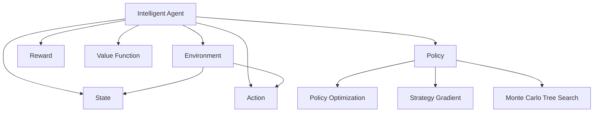

                 

# 增强学习 原理与代码实例讲解

> 关键词：增强学习,强化学习,深度强化学习,策略优化,动作选择,状态值,环境,奖励函数,深度神经网络,深度Q网络,策略梯度方法,蒙特卡罗树搜索

## 1. 背景介绍

### 1.1 问题由来

增强学习(Reinforcement Learning, RL)是人工智能领域的一个重要分支，其主要目标是让智能体(Agent)通过与环境(Environments)的交互，学习到一系列最优的行为策略(Policy)。增强学习在机器人控制、游戏AI、自动驾驶、金融交易等领域有着广泛的应用前景，是实现自主学习、自适应决策的核心技术。

近些年，随着深度学习技术的发展，深度强化学习(DRL)方法逐渐成为增强学习领域的主流范式。相比于传统的强化学习算法，DRL通过神经网络作为函数逼近器，可以更加高效地处理复杂环境和高维状态空间。此外，DRL结合了深度学习的大数据训练优势，可以训练出性能更优的策略模型。

### 1.2 问题核心关键点

深度强化学习的核心在于如何构建学习模型，使得智能体能够根据环境状态，选择最优动作策略，从而最大化累积奖励。传统的增强学习算法如Q-learning、SARSA等，由于其简单的数学模型和直观的奖励机制，被广泛应用于学术界和工业界。然而，这些算法在处理复杂环境和高维状态时，存在收敛速度慢、策略更新不稳定等问题。

相比之下，深度强化学习采用深度神经网络逼近Q值函数，可以更高效地处理复杂状态空间，并利用自监督学习任务提高模型的泛化能力。这一范式已经被证明在许多实际应用中，能够取得超乎传统方法的性能，如AlphaGo、AlphaZero、OpenAI Gym等。

## 2. 核心概念与联系

### 2.1 核心概念概述

为更好地理解深度强化学习的原理和实现方法，本节将介绍几个密切相关的核心概念：

- **智能体(Agent)**：是增强学习中的一个决策者，根据当前状态和环境信息，选择一系列动作。
- **环境(Environment)**：是智能体所处的外部世界，智能体的行为会影响环境状态。
- **状态(State)**：是描述环境当前状况的信息，状态空间可以是连续的也可以是离散的。
- **动作(Action)**：智能体可以采取的行动，动作空间可以是连续的也可以是离散的。
- **奖励(Reward)**：用于评价智能体行为的优劣，通常是非负值，奖励值越高，表示策略越好。
- **状态值(Value Function)**：描述某个状态的价值或优劣程度，是策略优化的重要参考。
- **策略(Policy)**：智能体从状态到动作的映射，策略优化是增强学习的核心目标。
- **深度Q网络(Deep Q Network, DQN)**：是深度强化学习中的一种模型架构，用于逼近Q值函数。
- **策略梯度方法(Strategy Gradient Methods)**：是一类基于策略优化的强化学习方法，包括Proximal Policy Optimization(PPO)、Trust Region Policy Optimization(TRPO)等。
- **蒙特卡罗树搜索(Monte Carlo Tree Search, MCTS)**：是一种基于模拟搜索的强化学习方法，特别适用于游戏AI等场景。

这些核心概念之间的逻辑关系可以通过以下Mermaid流程图来展示：



这个流程图展示了大语言模型的核心概念及其之间的关系：

1. 智能体通过与环境交互，选择动作并接收奖励。
2. 环境状态随智能体动作变化，策略优化目标是最大化累积奖励。
3. 状态值函数用于评估状态的价值，策略函数将状态映射到动作。
4. 深度Q网络等模型逼近Q值函数，辅助策略优化。
5. 蒙特卡罗树搜索等基于模拟的搜索算法，用于辅助策略的探索。

这些概念共同构成了深度强化学习的学习框架，使其能够在各种场景下发挥作用。通过理解这些核心概念，我们可以更好地把握深度强化学习的原理和实现方法。

## 3. 核心算法原理 & 具体操作步骤
### 3.1 算法原理概述

深度强化学习的核心思想是利用神经网络逼近Q值函数，通过学习函数近似来优化策略。其基本过程包括策略优化、状态值函数估计和动作选择三个步骤。

- **策略优化**：目标是通过优化策略，使得智能体在不同状态下的行为策略达到最优。
- **状态值函数估计**：目标是通过估计状态值函数，评估不同状态的价值。
- **动作选择**：目标是通过Q值函数，选择在不同状态下，最优的动作策略。

### 3.2 算法步骤详解

深度强化学习的算法步骤一般包括以下几个关键步骤：

**Step 1: 定义问题**

- 定义智能体、环境、状态、动作、奖励等基本组件。
- 明确问题目标，如最大化累积奖励、最小化消耗成本等。

**Step 2: 构建模型**

- 选择合适的模型架构，如Q-网络、策略网络等。
- 定义模型损失函数和优化目标。

**Step 3: 训练模型**

- 使用离线数据进行预训练，初始化模型参数。
- 在线数据上进行策略优化，更新模型参数。
- 定期使用在线数据进行策略评估，检测模型效果。

**Step 4: 测试与部署**

- 在测试集上评估模型性能，对比训练前后的指标提升。
- 使用训练好的模型进行在线部署，处理实际环境中的任务。

### 3.3 算法优缺点

深度强化学习的主要优点包括：

- 可以处理复杂环境和高维状态空间，适用于许多实际问题。
- 可以利用大数据和深度学习模型的自监督能力，提高模型的泛化能力。
- 结合了深度学习的大数据训练优势，可以训练出性能更优的策略模型。

其主要缺点包括：

- 模型训练过程中存在过拟合风险，尤其是复杂模型和高维数据。
- 模型评估和优化过程复杂，需要大量的计算资源和数据。
- 策略优化算法复杂，往往需要大量的超参数调优和经验积累。

尽管存在这些局限性，但就目前而言，深度强化学习已成为增强学习的主流范式。未来相关研究的重点在于如何进一步降低模型训练的计算成本，提高模型的鲁棒性和可解释性，同时兼顾实时性和普适性等因素。

### 3.4 算法应用领域

深度强化学习在许多领域都有广泛的应用，例如：

- 游戏AI：如AlphaGo、AlphaZero等，通过学习复杂的棋类游戏规则，获得超强的游戏水平。
- 机器人控制：如ROS-Industrial，用于工业机器人的自主导航和抓取。
- 自动驾驶：如Tesla Autopilot，利用强化学习优化车辆的路径规划和决策。
- 金融交易：如Alpha hedge，利用强化学习优化投资策略，获取更高的回报率。
- 智能推荐：如Netflix推荐系统，通过强化学习优化用户的推荐策略。
- 医疗诊断：如DeepDrug，利用强化学习优化药物组合，提高治疗效果。

除了上述这些经典应用外，深度强化学习还被创新性地应用到更多场景中，如风险管理、智能调度、社交网络优化等，为各行各业带来了新的技术突破。

## 4. 数学模型和公式 & 详细讲解 & 举例说明

### 4.1 数学模型构建

本节将使用数学语言对深度强化学习的模型构建进行更加严格的刻画。

记智能体为$A$，环境为$E$，状态空间为$S$，动作空间为$A$，奖励函数为$R$。假设智能体在状态$s$采取动作$a$，接收奖励$r$，状态变为$s'$。策略为$\pi(a|s)$，Q值函数为$Q_\theta(s,a)$，目标为最大化累积奖励$R_0=\sum_{t=0}^\infty \gamma^t R_t$，其中$\gamma$为折扣因子。

### 4.2 公式推导过程

以下我们以Q-learning为例，推导其数学原理和计算公式。

Q-learning的核心思想是通过状态-动作-奖励的三元组，构建Q值函数，并通过贝尔曼方程进行迭代更新。Q值函数定义为：

$$
Q_\theta(s,a) = r + \gamma \max_a Q_\theta(s',a')
$$

其中$r$为即时奖励，$s'$为下一个状态，$a'$为最优动作。目标是最小化Q值函数与真实Q值之间的差距，即：

$$
\min_\theta \mathbb{E}[(r + \gamma \max_a Q_\theta(s',a') - Q_\theta(s,a))]
$$

根据求解最优化的思路，Q-learning算法通过随机抽取数据$(s_t,a_t,r_t,s_{t+1})$，计算当前状态$s_t$和动作$a_t$的Q值，并更新Q值函数。具体计算公式为：

$$
Q_\theta(s_t,a_t) \leftarrow Q_\theta(s_t,a_t) + \alpha(r_t + \gamma \max_a Q_\theta(s_{t+1},a_{t+1}) - Q_\theta(s_t,a_t))
$$

其中$\alpha$为学习率，$(s_{t+1},a_{t+1})$为下一个状态和最优动作的Q值。

### 4.3 案例分析与讲解

以AlphaGo Zero为例，分析深度强化学习在复杂棋类游戏中的应用。

AlphaGo Zero的核心是利用深度神经网络逼近Q值函数，通过蒙特卡罗树搜索(MCTS)进行策略优化。具体流程如下：

1. 构建深度神经网络模型，用于逼近Q值函数。
2. 在随机对弈数据上进行预训练，初始化模型参数。
3. 利用蒙特卡罗树搜索生成策略树，选择最优动作。
4. 在当前状态下，执行动作并接收奖励，更新Q值函数。
5. 重复步骤2-4，直至达到预设轮数或时间限制。

AlphaGo Zero通过这种自我对弈的方式，不断优化策略，最终达到超强的棋类游戏水平。

## 5. 项目实践：代码实例和详细解释说明
### 5.1 开发环境搭建

在进行深度强化学习实践前，我们需要准备好开发环境。以下是使用Python进行TensorFlow开发的环境配置流程：

1. 安装Anaconda：从官网下载并安装Anaconda，用于创建独立的Python环境。

2. 创建并激活虚拟环境：
```bash
conda create -n drl-env python=3.8 
conda activate drl-env
```

3. 安装TensorFlow：根据CUDA版本，从官网获取对应的安装命令。例如：
```bash
conda install tensorflow
```

4. 安装Gym：用于构建和测试强化学习环境的Python库。
```bash
pip install gym
```

5. 安装OpenAI Gym：用于构建和测试强化学习环境的Python库。
```bash
pip install gym[TensorFlow]
```

6. 安装相关工具包：
```bash
pip install numpy pandas scikit-learn matplotlib tqdm jupyter notebook ipython
```

完成上述步骤后，即可在`drl-env`环境中开始深度强化学习的实践。

### 5.2 源代码详细实现

这里我们以深度Q网络(DQN)为例，给出一个使用TensorFlow实现Q-learning的完整代码实现。

```python
import tensorflow as tf
import numpy as np
import gym

class DQN:
    def __init__(self, env_name):
        self.env = gym.make(env_name)
        self.memory = []
        self.target_model = self.build_model()
        self.model = self.build_model()
        self.optimizer = tf.keras.optimizers.Adam(learning_rate=0.001)
        self.gamma = 0.95
        self.epsilon = 1.0
        self.epsilon_min = 0.01
        self.epsilon_decay = 0.995

    def build_model(self):
        model = tf.keras.Sequential([
            tf.keras.layers.Dense(256, input_shape=(env.observation_space.shape[0],), activation='relu'),
            tf.keras.layers.Dense(256, activation='relu'),
            tf.keras.layers.Dense(env.action_space.n)
        ])
        return model

    def act(self, state):
        if np.random.rand() < self.epsilon:
            return self.env.action_space.sample()
        q_values = self.model.predict(state)
        return np.argmax(q_values[0])

    def replay(self, batch_size):
        minibatch = np.random.choice(len(self.memory), batch_size)
        for i in minibatch:
            state_t, action_t, reward_t, state_t_plus_1, done_t = self.memory[i]
            q_next = self.target_model.predict(state_t_plus_1)
            q_target = reward_t + self.gamma * np.amax(q_next)
            q_value = self.model.predict(state_t)
            q_value[0][action_t] = q_target
            self.optimizer.minimize(tf.keras.losses.mean_squared_error(q_value, q_target), variables=self.model.trainable_variables)

    def remember(self, state, action, reward, state_next, done):
        self.memory.append((state, action, reward, state_next, done))

    def train(self, max_episodes=500):
        for episode in range(max_episodes):
            state = self.env.reset()
            state = np.reshape(state, [1, -1])
            done = False
            while not done:
                action = self.act(state)
                new_state, reward, done, _ = self.env.step(action)
                new_state = np.reshape(new_state, [1, -1])
                self.remember(state, action, reward, new_state, done)
                state = new_state
            self.epsilon *= self.epsilon_decay
            self.epsilon = max(self.epsilon_min, self.epsilon)
```

在这个代码中，我们定义了DQN类，并实现了Q-learning的核心算法。

**DQN类定义**：
- `__init__`方法：初始化环境、模型、优化器、折扣因子、学习率等参数。
- `build_model`方法：定义模型架构，使用深度神经网络逼近Q值函数。
- `act`方法：根据策略函数，选择动作。
- `replay`方法：根据样本数据，更新Q值函数。
- `remember`方法：保存样本数据。
- `train`方法：进行模型训练，优化策略。

**Q值函数计算**：
- 在`act`方法中，利用模型输出Q值，选择动作。
- 在`replay`方法中，根据贝尔曼方程，更新Q值函数。

**参数更新**：
- 在`replay`方法中，使用优化器更新模型参数。

**策略优化**：
- 在`train`方法中，重复执行状态-动作-奖励循环，优化策略。

**参数衰减**：
- 在`train`方法中，利用ε-贪心策略，逐步降低策略的随机性，提高模型稳定性。

**代码实现细节**：
- 在`__init__`方法中，初始化环境、模型、优化器等参数。
- 在`build_model`方法中，定义模型架构，包括全连接层。
- 在`act`方法中，根据策略函数，选择动作。
- 在`replay`方法中，根据样本数据，更新Q值函数。
- 在`remember`方法中，保存样本数据。
- 在`train`方法中，进行模型训练，优化策略。

### 5.3 代码解读与分析

让我们再详细解读一下关键代码的实现细节：

**DQN类定义**：
- `__init__`方法：初始化环境、模型、优化器、折扣因子、学习率等参数。
- `build_model`方法：定义模型架构，使用深度神经网络逼近Q值函数。
- `act`方法：根据策略函数，选择动作。
- `replay`方法：根据样本数据，更新Q值函数。
- `remember`方法：保存样本数据。
- `train`方法：进行模型训练，优化策略。

**Q值函数计算**：
- 在`act`方法中，利用模型输出Q值，选择动作。
- 在`replay`方法中，根据贝尔曼方程，更新Q值函数。

**参数更新**：
- 在`replay`方法中，使用优化器更新模型参数。

**策略优化**：
- 在`train`方法中，重复执行状态-动作-奖励循环，优化策略。

**参数衰减**：
- 在`train`方法中，利用ε-贪心策略，逐步降低策略的随机性，提高模型稳定性。

**代码实现细节**：
- 在`__init__`方法中，初始化环境、模型、优化器等参数。
- 在`build_model`方法中，定义模型架构，包括全连接层。
- 在`act`方法中，根据策略函数，选择动作。
- 在`replay`方法中，根据样本数据，更新Q值函数。
- 在`remember`方法中，保存样本数据。
- 在`train`方法中，进行模型训练，优化策略。

## 6. 实际应用场景
### 6.1 智能游戏AI

深度强化学习在游戏AI领域有着广泛的应用，如AlphaGo、AlphaZero等。通过学习复杂的棋类游戏规则，智能体可以在没有人类干预的情况下，达到甚至超越人类的游戏水平。

以AlphaGo为例，其核心是利用深度神经网络逼近Q值函数，通过蒙特卡罗树搜索进行策略优化。AlphaGo Zero通过这种自我对弈的方式，不断优化策略，最终达到超强的棋类游戏水平。

### 6.2 机器人控制

深度强化学习在机器人控制领域也有着广泛的应用，如ROS-Industrial等。通过学习复杂的运动规则，智能体可以自主导航和抓取物体，实现自动化生产线的作业。

以ROS-Industrial为例，其核心是利用深度神经网络逼近动作价值函数，通过策略优化控制机器人。智能体通过感知环境和执行动作，最大化累积奖励，从而实现自动化生产线的作业。

### 6.3 自动驾驶

深度强化学习在自动驾驶领域也有着广泛的应用，如Tesla Autopilot等。通过学习复杂的驾驶规则，智能体可以自主驾驶汽车，实现自动导航和避障。

以Tesla Autopilot为例，其核心是利用深度神经网络逼近Q值函数，通过策略优化控制汽车驾驶。智能体通过感知环境和执行动作，最大化累积奖励，从而实现自动导航和避障。

### 6.4 未来应用展望

随着深度强化学习技术的不断进步，未来的应用场景将更加广阔，例如：

- 自动交易：通过学习市场规则和风险管理策略，智能体可以实现自动交易，提高投资回报率。
- 智能推荐：通过学习用户行为和商品属性，智能体可以实现个性化推荐，提高用户满意度。
- 医疗诊断：通过学习医疗规则和诊断策略，智能体可以实现疾病预测和治疗建议，提高医疗效率。
- 智能客服：通过学习客服规则和客户行为，智能体可以实现自动回复和问题解决，提高客户满意度。
- 能源管理：通过学习能源消耗规则和需求管理策略，智能体可以实现能源优化，提高能源利用效率。

## 7. 工具和资源推荐
### 7.1 学习资源推荐

为了帮助开发者系统掌握深度强化学习的理论基础和实践技巧，这里推荐一些优质的学习资源：

1. 《强化学习》书籍：由Richard Sutton和Andrew Barto合著的经典教材，深入浅出地介绍了强化学习的基本概念和算法。
2. 《深度强化学习》书籍：由Ian Goodfellow等合著，全面介绍了深度强化学习的理论基础和实践技巧。
3. Coursera强化学习课程：由David Silver教授开设的强化学习课程，包括深度强化学习的相关内容。
4. Udacity深度学习课程：包括深度强化学习的内容，提供实际项目实践经验。
5. OpenAI Gym官方文档：Gym是深度强化学习中常用的环境库，提供了丰富的测试环境和示例代码。

通过对这些资源的学习实践，相信你一定能够快速掌握深度强化学习的精髓，并用于解决实际的智能体控制问题。

### 7.2 开发工具推荐

高效的开发离不开优秀的工具支持。以下是几款用于深度强化学习开发的常用工具：

1. TensorFlow：由Google主导开发的深度学习框架，生产部署方便，适合大规模工程应用。
2. PyTorch：基于Python的开源深度学习框架，灵活动态的计算图，适合快速迭代研究。
3. OpenAI Gym：深度强化学习中常用的环境库，提供了丰富的测试环境和示例代码。
4. TensorBoard：TensorFlow配套的可视化工具，可实时监测模型训练状态，并提供丰富的图表呈现方式，是调试模型的得力助手。
5. Weights & Biases：模型训练的实验跟踪工具，可以记录和可视化模型训练过程中的各项指标，方便对比和调优。

合理利用这些工具，可以显著提升深度强化学习的开发效率，加快创新迭代的步伐。

### 7.3 相关论文推荐

深度强化学习在近几年的发展迅速，以下是几篇奠基性的相关论文，推荐阅读：

1. Playing Atari with Deep Reinforcement Learning：DQN方法的奠基之作，提出了基于深度神经网络的Q值函数逼近方法。
2. Human-level Control through Deep Reinforcement Learning：AlphaGo的论文，展示了深度神经网络在棋类游戏中的强大能力。
3. DeepMind Lab：AlphaZero的论文，展示了无监督学习的强化学习技术，能够在没有人类干预的情况下，自主学习复杂的棋类游戏。
4. Cognitive Architecture for Creative AI：DeepMind的AI认知架构，展示了深度强化学习在创意生成和认知推理中的应用。
5. Super-Mario for Humans：通过深度强化学习训练的人类AI，展示了强化学习在复杂任务中的强大能力。

这些论文代表了大强化学习的发展脉络。通过学习这些前沿成果，可以帮助研究者把握学科前进方向，激发更多的创新灵感。

## 8. 总结：未来发展趋势与挑战

### 8.1 总结

本文对深度强化学习的原理和实践进行了全面系统的介绍。首先阐述了深度强化学习的背景和核心概念，明确了强化学习的核心思想和应用场景。其次，从原理到实践，详细讲解了深度强化学习的数学模型和算法步骤，给出了深度强化学习的完整代码实例。同时，本文还广泛探讨了深度强化学习在智能游戏、机器人控制、自动驾驶等多个领域的应用前景，展示了深度强化学习的巨大潜力。此外，本文精选了深度强化学习的各类学习资源，力求为读者提供全方位的技术指引。

通过本文的系统梳理，可以看到，深度强化学习正在成为人工智能领域的重要范式，极大地拓展了智能体的应用边界，催生了更多的落地场景。得益于深度学习的大数据训练优势和强大的函数逼近能力，深度强化学习在许多实际问题中，能够取得超乎传统方法的性能，为各行各业带来了新的技术突破。未来，伴随深度强化学习技术的不断进步，其在复杂环境和高维状态空间中的应用前景将更加广阔。

### 8.2 未来发展趋势

展望未来，深度强化学习将呈现以下几个发展趋势：

1. 模型规模持续增大。随着算力成本的下降和数据规模的扩张，深度强化学习模型规模还将持续增长。超大规模模型蕴含的丰富经验，有望支撑更加复杂多变的智能体行为。
2. 训练效率不断提升。随着优化算法的进步和硬件资源的丰富，深度强化学习模型训练的效率也将显著提高。自动超参优化和分布式训练技术的应用，将进一步降低训练成本。
3. 模型可解释性增强。通过引入可解释性模型和可视化工具，深度强化学习模型的决策过程将变得更加透明和可控。
4. 多模态学习拓展。未来的深度强化学习将不仅仅限于单一模态的数据，多模态数据的融合将为智能体提供更加全面、准确的环境信息。
5. 智能体自适应能力提升。未来的智能体将更加具备自适应和自学习的能力，能够在不断变化的环境中自主优化行为策略。
6. 联邦强化学习兴起。联邦强化学习结合了分布式优化和联邦学习，能够在保护隐私的前提下，训练出更加泛化的大规模模型。

以上趋势凸显了深度强化学习技术的广阔前景。这些方向的探索发展，必将进一步提升深度强化学习的性能和应用范围，为智能体的自主学习、自适应决策提供更坚实的技术保障。

### 8.3 面临的挑战

尽管深度强化学习技术已经取得了瞩目成就，但在迈向更加智能化、普适化应用的过程中，它仍面临着诸多挑战：

1. 模型训练的计算成本高。深度强化学习模型往往需要大量的计算资源和数据，模型训练过程较为耗时。
2. 模型复杂度增加，训练过程不稳定。模型规模的增大和参数的增加，可能导致训练过程的不稳定性和过拟合风险。
3. 模型泛化能力不足。深度强化学习模型往往在特定环境中训练效果良好，但对新环境的泛化能力不足。
4. 模型可解释性不足。深度强化学习模型的决策过程较为复杂，难以进行解释和调试。
5. 模型安全性问题。深度强化学习模型可能学习到有害的行为策略，导致系统的不稳定性和安全性问题。

这些挑战凸显了深度强化学习技术的复杂性和多样性。未来需要进一步探索更加高效、稳定、安全、可解释的深度强化学习技术，才能在更广阔的领域中得到广泛应用。

### 8.4 研究展望

面对深度强化学习所面临的挑战，未来的研究需要在以下几个方面寻求新的突破：

1. 探索新的优化算法。开发更加高效、稳定的优化算法，降低模型训练的计算成本和风险。
2. 研究新型的模型架构。开发更加高效、可解释的模型架构，提升模型的泛化能力和可解释性。
3. 引入先验知识。将符号化的先验知识，如知识图谱、逻辑规则等，与神经网络模型进行融合，提升模型的性能和可解释性。
4. 结合多模态数据。将视觉、语音、文本等多模态数据进行融合，提升模型的感知能力和决策能力。
5. 引入强化学习理论。将强化学习理论引入模型优化过程，提升模型的稳定性和安全性。
6. 结合联邦学习技术。结合联邦学习技术，在保护隐私的前提下，训练出更加泛化的大规模模型。

这些研究方向将进一步拓展深度强化学习的边界，推动深度强化学习技术的成熟化和落地化，为实现更加智能化的智能体控制提供坚实的技术保障。

## 9. 附录：常见问题与解答

**Q1：什么是深度强化学习？**

A: 深度强化学习是一种利用深度神经网络逼近Q值函数的强化学习算法。其核心思想是通过学习函数近似，最大化累积奖励，从而实现智能体的自主学习、自适应决策。

**Q2：深度强化学习与传统强化学习的区别是什么？**

A: 深度强化学习与传统强化学习的区别在于，深度强化学习利用深度神经网络逼近Q值函数，可以更加高效地处理复杂环境和高维状态空间。而传统强化学习通常使用简单的数学模型，如Q-learning、SARSA等，处理复杂环境的能力有限。

**Q3：深度强化学习如何处理连续状态空间？**

A: 深度强化学习通常使用连续值网络逼近Q值函数，对连续状态空间进行离散化处理。此外，也可以使用稀疏编码等技术，将连续状态空间映射为离散状态空间。

**Q4：深度强化学习的训练过程有什么特点？**

A: 深度强化学习的训练过程具有高复杂度、高计算成本的特点。模型训练需要大量的计算资源和数据，训练过程不稳定，容易过拟合。此外，模型训练过程需要结合优化算法和超参数调优，才能得到理想的模型效果。

**Q5：深度强化学习有哪些应用场景？**

A: 深度强化学习在许多领域都有广泛的应用，如智能游戏、机器人控制、自动驾驶、金融交易、智能推荐等。其核心在于利用深度神经网络逼近Q值函数，通过学习函数近似，最大化累积奖励，实现智能体的自主学习、自适应决策。

这些回答旨在帮助读者理解深度强化学习的基本概念、应用场景和技术细节，相信通过本文的系统梳理，读者将能够深入理解深度强化学习的原理和实现方法，掌握其在智能体控制中的应用技巧。

