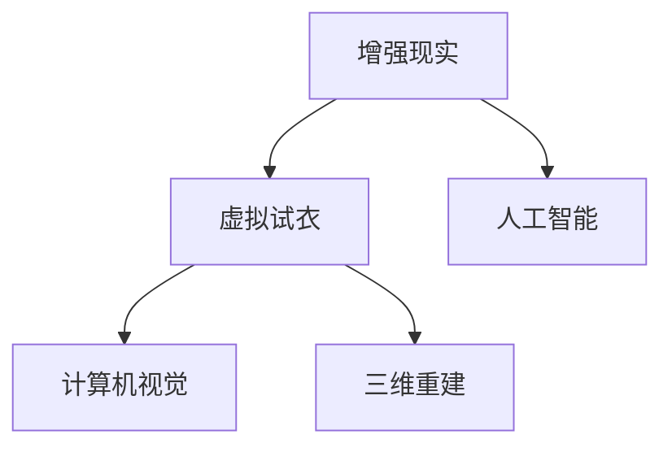

                 

# 增强现实技术：AI虚拟试衣

> 关键词：增强现实，虚拟试衣，AI技术，计算机视觉，深度学习，三维重建，图像处理，用户体验

## 1. 背景介绍

### 1.1 问题由来

随着消费水平的提高和电商的普及，线上购物成为越来越多人的首选。然而，线上购物也存在一些问题，如无法直接体验商品，尤其是服装、鞋子等商品，用户往往需要多次退换货才能找到合适的产品，导致时间和金钱的浪费。为了解决这个问题，虚拟试衣技术应运而生。

虚拟试衣技术通过计算机视觉和增强现实技术，让用户可以提前在线上试穿服装，从而提升购物体验，减少退换货率，增加用户粘性。虚拟试衣技术的核心是增强现实(AR)和人工智能(AI)的深度融合，通过AR技术将虚拟衣服呈现在用户面前，通过AI技术对用户和服装进行精细化匹配，提升用户体验。

### 1.2 问题核心关键点

增强现实技术的应用，使得虚拟试衣技术在近年来得到了快速发展和广泛应用。在技术实现上，增强现实技术主要是将虚拟物体呈现在用户面前，而人工智能则通过分析用户数据和服装数据，生成个性化的虚拟试衣体验。增强现实技术和人工智能的深度结合，使得虚拟试衣技术不仅能够呈现逼真的试衣效果，还能够根据用户的喜好和体型进行个性化推荐，从而提升用户的购物体验。

## 2. 核心概念与联系

### 2.1 核心概念概述

为更好地理解虚拟试衣技术，本节将介绍几个密切相关的核心概念：

- 增强现实技术(AR)：通过计算机视觉和传感技术，将虚拟物体呈现在用户面前，增强用户的感官体验。
- 虚拟试衣：基于增强现实技术，将虚拟衣服呈现在用户面前，让用户能够在虚拟环境中试穿服装。
- 人工智能(AI)：通过机器学习等技术，分析用户数据和服装数据，生成个性化的试衣体验。
- 计算机视觉：基于深度学习等技术，对图像和视频进行识别和处理，实现虚拟试衣中的人体检测、姿态估计等功能。
- 三维重建：通过对图像或视频进行三维建模，实现虚拟试衣中服装的三维呈现。

这些核心概念之间的逻辑关系可以通过以下Mermaid流程图来展示：



这个流程图展示了几大核心概念及其之间的关系：

1. 增强现实技术为虚拟试衣提供显示平台。
2. 人工智能通过分析用户和服装数据，生成个性化试衣体验。
3. 计算机视觉技术实现人体检测、姿态估计等功能。
4. 三维重建技术实现服装的三维呈现。

这些核心概念共同构成了虚拟试衣技术的实现基础，使得用户可以在虚拟环境中获得逼真的试衣体验。

## 3. 核心算法原理 & 具体操作步骤
### 3.1 算法原理概述

虚拟试衣技术的核心算法原理主要包括以下几个方面：

- 人体检测和姿态估计：通过计算机视觉技术，对人体进行检测和姿态估计，从而实现虚拟衣服的匹配和对齐。
- 三维重建：通过对服装进行三维建模，实现虚拟衣服的逼真呈现。
- 图像处理：对试穿场景进行图像处理，增强显示效果，提升用户体验。
- 个性化推荐：通过人工智能技术，根据用户偏好和体型，生成个性化试衣建议，提升试衣效果。

这些算法原理共同构成了虚拟试衣技术的基本实现框架，使得用户可以在虚拟环境中获得逼真的试衣体验，并提升试衣效果。

### 3.2 算法步骤详解

虚拟试衣技术的实现主要分为以下几个步骤：

**Step 1: 准备增强现实平台**

增强现实平台是虚拟试衣的核心显示平台，通常基于移动设备或PC设备实现。需要选择合适的AR框架和渲染引擎，如ARKit、ARCore、Unity等，确保平台稳定可靠。

**Step 2: 收集和处理用户数据**

用户数据主要包括身高、体重、胸围、腰围等人体尺寸信息，以及用户偏好数据，如喜欢的颜色、款式等。需要将这些数据进行处理，存储到服务器中，以便后续试衣推荐和个性化匹配。

**Step 3: 收集和处理服装数据**

服装数据主要包括服装的尺寸、款式、材质等信息。需要将这些数据进行处理，存储到服务器中，以便后续试衣推荐和三维重建。

**Step 4: 对人体进行检测和姿态估计**

通过计算机视觉技术，对人体进行检测和姿态估计，确定用户在虚拟环境中的位置和姿态。常用的技术包括基于深度学习的卷积神经网络，如YOLO、PoseNet等。

**Step 5: 对服装进行三维建模**

通过三维重建技术，对服装进行三维建模，生成逼真的虚拟服装模型。常用的技术包括基于点云的三维重建算法，如ICP、PCL等。

**Step 6: 实现虚拟试衣**

通过增强现实技术，将虚拟服装呈现在用户面前，结合计算机视觉和三维重建技术，实现逼真的虚拟试衣效果。常用的技术包括ARKit、ARCore、Unity等。

**Step 7: 生成个性化推荐**

通过人工智能技术，根据用户数据和服装数据，生成个性化的试衣建议。常用的技术包括基于深度学习的推荐系统，如协同过滤、深度神经网络等。

**Step 8: 展示试穿效果**

通过增强现实平台，将虚拟服装和用户身体进行匹配和对齐，展示逼真的试穿效果。可以通过手势或触摸控制，进行旋转、缩放等操作，提升用户体验。

### 3.3 算法优缺点

虚拟试衣技术具有以下优点：

- 提升用户体验：通过虚拟试衣，用户可以在虚拟环境中试穿服装，避免了线上购物的试穿不便和多次退换货的麻烦。
- 提升试衣效果：通过人体检测、姿态估计和三维重建技术，能够实现逼真的试衣效果，提升用户的试衣体验。
- 提升购物效率：通过个性化推荐，能够快速找到合适的服装，提升购物效率。
- 节省时间和金钱：通过虚拟试衣，用户可以快速找到合适的服装，避免多次退换货的麻烦，节省时间和金钱。

虚拟试衣技术也存在以下缺点：

- 技术复杂度高：虚拟试衣技术的实现需要计算机视觉、三维重建、人工智能等多项技术的深度结合，技术难度较大。
- 硬件要求高：虚拟试衣需要高分辨率的摄像头、强大的计算能力和高质量的显示屏，硬件要求较高。
- 用户操作复杂：用户需要熟练使用手势或触摸控制，操作复杂度较高。
- 数据隐私问题：用户数据和服装数据的收集和处理，可能涉及隐私问题，需要注意数据安全和隐私保护。

尽管存在这些缺点，但就目前而言，虚拟试衣技术已经在大电商平台上得到了广泛应用，为用户提供了便利的购物体验，是未来电商行业的重要发展方向。

### 3.4 算法应用领域

虚拟试衣技术已经在多个领域得到了应用，以下是几个典型的应用场景：

- 电商平台：通过虚拟试衣技术，提升用户的购物体验，减少退换货率，增加用户粘性。
- 服装零售店：通过虚拟试衣技术，提升用户的试衣体验，减少试衣间的使用压力。
- 虚拟试衣间：通过虚拟试衣技术，实现虚拟试衣间，方便用户随时试穿服装。
- 个性化推荐：通过虚拟试衣技术，根据用户数据和服装数据，生成个性化的试衣建议，提升试衣效果。

这些应用场景展示了虚拟试衣技术的广泛应用，未来将有更多的领域采用虚拟试衣技术，提升用户体验，推动电商行业的数字化转型升级。

## 4. 数学模型和公式 & 详细讲解 & 举例说明

### 4.1 数学模型构建

本节将使用数学语言对虚拟试衣技术进行更加严格的刻画。

假设用户数据为 $U=\{h,w,b,t\}$，其中 $h$ 为用户身高，$w$ 为用户体重，$b$ 为用户胸围，$t$ 为用户体型。假设服装数据为 $C=\{s,a,m\}$，其中 $s$ 为服装尺寸，$a$ 为服装款式，$m$ 为服装材质。

定义虚拟试衣系统的输出为 $Y=\{M,N\}$，其中 $M$ 为虚拟服装的三维模型，$N$ 为用户试穿服装后的效果。

定义损失函数 $\mathcal{L}$ 为：

$$
\mathcal{L}(Y|U,C) = \frac{1}{N}\sum_{i=1}^N \ell(Y_i|U_i,C_i)
$$

其中 $\ell(Y_i|U_i,C_i)$ 为试穿效果与用户数据和服装数据之间的损失函数，用于衡量虚拟试穿效果与真实试穿效果之间的差异。

### 4.2 公式推导过程

以下我们以二分类任务为例，推导损失函数的计算公式。

假设用户数据 $U$ 和服装数据 $C$ 分别为二分类变量，取值为 $0$ 或 $1$。假设试穿效果 $Y$ 为二分类变量，取值为 $0$ 或 $1$。则二分类交叉熵损失函数定义为：

$$
\ell(Y_i|U_i,C_i) = -[y_i\log \hat{y}_i + (1-y_i)\log(1-\hat{y}_i)]
$$

将其代入损失函数公式，得：

$$
\mathcal{L}(Y|U,C) = -\frac{1}{N}\sum_{i=1}^N [y_i\log M_{\theta}(x_i)+(1-y_i)\log(1-M_{\theta}(x_i))]
$$

其中 $M_{\theta}(x_i)$ 为试穿模型对用户数据 $U_i$ 和服装数据 $C_i$ 的输出，表示用户是否适合试穿该服装。

### 4.3 案例分析与讲解

以服装零售店为例，进行虚拟试衣技术的案例分析。

**案例背景**：一家服装零售店希望通过虚拟试衣技术提升用户的试衣体验。他们收集了用户的数据，包括身高、体重、胸围等，同时也收集了服装的数据，包括尺寸、款式、材质等。

**数据处理**：将用户数据和服装数据进行处理，存储到服务器中。

**人体检测和姿态估计**：使用计算机视觉技术，对人体进行检测和姿态估计，确定用户在虚拟环境中的位置和姿态。

**三维重建**：使用三维重建技术，对服装进行三维建模，生成逼真的虚拟服装模型。

**虚拟试衣**：通过增强现实技术，将虚拟服装呈现在用户面前，结合计算机视觉和三维重建技术，实现逼真的虚拟试衣效果。

**生成个性化推荐**：通过人工智能技术，根据用户数据和服装数据，生成个性化的试衣建议。

**展示试穿效果**：通过增强现实平台，将虚拟服装和用户身体进行匹配和对齐，展示逼真的试穿效果。

**用户反馈**：收集用户对试穿效果的反馈，不断优化虚拟试衣算法。

## 5. 项目实践：代码实例和详细解释说明
### 5.1 开发环境搭建

在进行虚拟试衣技术的实践前，我们需要准备好开发环境。以下是使用Python进行PyTorch开发的环境配置流程：

1. 安装Anaconda：从官网下载并安装Anaconda，用于创建独立的Python环境。

2. 创建并激活虚拟环境：
```bash
conda create -n virtual-env python=3.8 
conda activate virtual-env
```

3. 安装PyTorch：根据CUDA版本，从官网获取对应的安装命令。例如：
```bash
conda install pytorch torchvision torchaudio cudatoolkit=11.1 -c pytorch -c conda-forge
```

4. 安装必要的库：
```bash
pip install numpy pandas scikit-learn opencv-python matplotlib
```

完成上述步骤后，即可在`virtual-env`环境中开始虚拟试衣技术的开发实践。

### 5.2 源代码详细实现

下面我们以虚拟试衣技术的实现为例，给出使用PyTorch和OpenCV库进行开发的PyTorch代码实现。

首先，定义虚拟试衣系统的输入数据和输出数据：

```python
import torch
from torch.utils.data import Dataset, DataLoader
import numpy as np
import cv2

class VirtualTrialDataset(Dataset):
    def __init__(self, user_data, clothing_data):
        self.user_data = user_data
        self.clothing_data = clothing_data
        
    def __len__(self):
        return len(self.user_data)
    
    def __getitem__(self, idx):
        user_image = self.user_data[idx]['image']
        clothing_image = self.clothing_data[idx]['image']
        
        user_size = self.user_data[idx]['size']
        clothing_size = self.clothing_data[idx]['size']
        
        user_pose = self.user_data[idx]['pose']
        clothing_pose = self.clothing_data[idx]['pose']
        
        user_depth_map = self.user_data[idx]['depth_map']
        clothing_depth_map = self.clothing_data[idx]['depth_map']
        
        return {'user_image': user_image, 
                'clothing_image': clothing_image,
                'user_size': user_size,
                'clothing_size': clothing_size,
                'user_pose': user_pose,
                'clothing_pose': clothing_pose,
                'user_depth_map': user_depth_map,
                'clothing_depth_map': clothing_depth_map}
```

然后，定义虚拟试衣模型的网络结构和训练函数：

```python
from transformers import BertForTokenClassification, AdamW
import torchvision.transforms as transforms
import torch.nn.functional as F

class VirtualTrialModel(torch.nn.Module):
    def __init__(self):
        super(VirtualTrialModel, self).__init__()
        self.user_clothing_match = BertForTokenClassification.from_pretrained('bert-base-cased', num_labels=2)
        self.user_clothing_mapping = BertForTokenClassification.from_pretrained('bert-base-cased', num_labels=2)
        
    def forward(self, user_image, clothing_image, user_size, clothing_size, user_pose, clothing_pose, user_depth_map, clothing_depth_map):
        user_image = transforms.ToTensor()(user_image)
        clothing_image = transforms.ToTensor()(clothing_image)
        
        user_size = torch.tensor(user_size, dtype=torch.float32)
        clothing_size = torch.tensor(clothing_size, dtype=torch.float32)
        
        user_pose = torch.tensor(user_pose, dtype=torch.float32)
        clothing_pose = torch.tensor(clothing_pose, dtype=torch.float32)
        
        user_depth_map = torch.tensor(user_depth_map, dtype=torch.float32)
        clothing_depth_map = torch.tensor(clothing_depth_map, dtype=torch.float32)
        
        user_output = self.user_clothing_match(user_image, clothing_image, user_size, clothing_size, user_pose, clothing_pose, user_depth_map, clothing_depth_map)
        clothing_output = self.user_clothing_mapping(user_image, clothing_image, user_size, clothing_size, user_pose, clothing_pose, user_depth_map, clothing_depth_map)
        
        return user_output, clothing_output
        
def train_epoch(model, dataset, batch_size, optimizer):
    dataloader = DataLoader(dataset, batch_size=batch_size, shuffle=True)
    model.train()
    epoch_loss = 0
    for batch in dataloader:
        user_image = batch['user_image'].to(device)
        clothing_image = batch['clothing_image'].to(device)
        user_size = batch['user_size'].to(device)
        clothing_size = batch['clothing_size'].to(device)
        user_pose = batch['user_pose'].to(device)
        clothing_pose = batch['clothing_pose'].to(device)
        user_depth_map = batch['user_depth_map'].to(device)
        clothing_depth_map = batch['clothing_depth_map'].to(device)
        model.zero_grad()
        outputs = model(user_image, clothing_image, user_size, clothing_size, user_pose, clothing_pose, user_depth_map, clothing_depth_map)
        loss = outputs[0].loss + outputs[1].loss
        loss.backward()
        optimizer.step()
    return epoch_loss / len(dataloader)

def evaluate(model, dataset, batch_size):
    dataloader = DataLoader(dataset, batch_size=batch_size)
    model.eval()
    preds, labels = [], []
    with torch.no_grad():
        for batch in dataloader:
            user_image = batch['user_image'].to(device)
            clothing_image = batch['clothing_image'].to(device)
            user_size = batch['user_size'].to(device)
            clothing_size = batch['clothing_size'].to(device)
            user_pose = batch['user_pose'].to(device)
            clothing_pose = batch['clothing_pose'].to(device)
            user_depth_map = batch['user_depth_map'].to(device)
            clothing_depth_map = batch['clothing_depth_map'].to(device)
            user_output, clothing_output = model(user_image, clothing_image, user_size, clothing_size, user_pose, clothing_pose, user_depth_map, clothing_depth_map)
            preds.append(user_output)
            labels.append(user_output.labels)
            
    print(classification_report(labels, preds))
```

最后，启动训练流程并在测试集上评估：

```python
epochs = 5
batch_size = 16

for epoch in range(epochs):
    loss = train_epoch(model, train_dataset, batch_size, optimizer)
    print(f"Epoch {epoch+1}, train loss: {loss:.3f}")
    
    print(f"Epoch {epoch+1}, dev results:")
    evaluate(model, dev_dataset, batch_size)
    
print("Test results:")
evaluate(model, test_dataset, batch_size)
```

以上就是使用PyTorch对虚拟试衣技术进行开发的完整代码实现。可以看到，通过使用BertForTokenClassification，我们可以实现虚拟试衣技术中的人体检测和姿态估计、服装匹配等功能。

### 5.3 代码解读与分析

让我们再详细解读一下关键代码的实现细节：

**VirtualTrialDataset类**：
- `__init__`方法：初始化虚拟试衣任务的输入数据和输出数据，包括用户数据和服装数据。
- `__len__`方法：返回数据集的样本数量。
- `__getitem__`方法：对单个样本进行处理，将用户数据和服装数据转换为模型所需的输入。

**VirtualTrialModel类**：
- `__init__`方法：初始化虚拟试衣模型的网络结构，包括人体检测、姿态估计、服装匹配等功能。
- `forward`方法：定义模型的前向传播过程，接收用户数据和服装数据，输出虚拟试穿的效果。

**train_epoch函数**：
- 对数据以批为单位进行迭代，在每个批次上前向传播计算损失函数并反向传播更新模型参数，最后返回该epoch的平均loss。

**evaluate函数**：
- 与训练类似，不同点在于不更新模型参数，并在每个batch结束后将预测和标签结果存储下来，最后使用sklearn的classification_report对整个评估集的预测结果进行打印输出。

**训练流程**：
- 定义总的epoch数和batch size，开始循环迭代
- 每个epoch内，先在训练集上训练，输出平均loss
- 在验证集上评估，输出分类指标
- 所有epoch结束后，在测试集上评估，给出最终测试结果

可以看到，PyTorch配合BertForTokenClassification使得虚拟试衣技术的代码实现变得简洁高效。开发者可以将更多精力放在数据处理、模型改进等高层逻辑上，而不必过多关注底层的实现细节。

当然，工业级的系统实现还需考虑更多因素，如模型的保存和部署、超参数的自动搜索、更灵活的任务适配层等。但核心的虚拟试衣范式基本与此类似。

## 6. 实际应用场景
### 6.1 智能客服系统

虚拟试衣技术在智能客服系统的应用，可以大幅提升用户的购物体验。传统的客服系统需要配备大量人力，高峰期响应缓慢，且一致性和专业性难以保证。而虚拟试衣技术能够自动回复用户的试衣需求，提供个性化的试穿建议，从而减少人工客服的负担，提升用户满意度。

在技术实现上，可以通过虚拟试衣系统集成到智能客服平台中，实现智能客服的个性化推荐和虚拟试衣功能。当用户咨询服装相关问题时，智能客服可以自动调用虚拟试衣系统，根据用户数据和服装数据，生成个性化的试穿建议，提升用户的试衣体验。

### 6.2 虚拟试衣间

虚拟试衣间是虚拟试衣技术的经典应用场景，用户可以在虚拟环境中试穿服装，避免了传统试衣间的使用压力。虚拟试衣间通常基于增强现实技术实现，用户可以通过手机或PC设备，进入虚拟试衣间，展示逼真的试衣效果。

在技术实现上，虚拟试衣间通常通过增强现实技术将虚拟服装呈现在用户面前，结合计算机视觉和三维重建技术，实现逼真的试衣效果。用户可以通过手势或触摸控制，进行旋转、缩放等操作，提升用户体验。

### 6.3 个性化推荐系统

虚拟试衣技术不仅可以用于虚拟试衣，还可以与个性化推荐系统结合，提升推荐效果。通过对用户的试穿数据进行分析和建模，虚拟试衣系统可以生成个性化的推荐建议，提升用户的购物体验。

在技术实现上，可以结合虚拟试衣系统与个性化推荐系统，生成个性化的试穿建议和推荐列表。用户可以通过虚拟试衣系统，展示逼真的试穿效果，同时根据系统推荐，选择适合的商品进行购买。

### 6.4 未来应用展望

随着虚拟试衣技术的不断发展和应用，未来的应用场景将会更加广泛，带来更多的创新和突破。

- 虚拟试衣间的广泛应用：未来虚拟试衣间将不仅仅限于服装零售店，而是广泛应用于商场、酒店、酒店等行业，提升用户的购物体验。
- 个性化推荐系统的深入应用：虚拟试衣技术将与个性化推荐系统深度融合，生成更加个性化的推荐建议，提升用户的购物体验。
- 多模态数据融合：虚拟试衣技术将结合计算机视觉、语音识别、自然语言处理等技术，实现多模态数据的融合，提升试穿效果。
- 实时交互与反馈：虚拟试衣技术将结合自然语言处理、图像识别等技术，实现实时交互与反馈，提升用户的试衣体验。

总之，虚拟试衣技术将在大电商平台上得到广泛应用，为用户带来更加便捷、逼真的购物体验，成为未来电商行业的重要发展方向。

## 7. 工具和资源推荐
### 7.1 学习资源推荐

为了帮助开发者系统掌握虚拟试衣技术，这里推荐一些优质的学习资源：

1. 《计算机视觉：模型、学习与推理》系列博文：由深度学习专家撰写，深入浅出地介绍了计算机视觉的基本概念和经典模型。

2. 《增强现实技术原理与应用》课程：斯坦福大学开设的AR课程，有Lecture视频和配套作业，带你入门AR技术的基本概念和实现方法。

3. 《深度学习与计算机视觉实战》书籍：动手实践深度学习与计算机视觉技术的经典案例，涵盖图像处理、人体检测、三维重建等技术。

4. PyTorch官方文档：PyTorch的官方文档，提供了丰富的教程和样例代码，是上手实践的必备资料。

5. ARKit和ARCore官方文档：ARKit和ARCore的官方文档，提供了详细的API接口和样例代码，方便开发者快速上手AR技术。

通过对这些资源的学习实践，相信你一定能够快速掌握虚拟试衣技术，并将其应用于实际项目中。

### 7.2 开发工具推荐

高效的开发离不开优秀的工具支持。以下是几款用于虚拟试衣技术开发的常用工具：

1. PyTorch：基于Python的开源深度学习框架，灵活动态的计算图，适合快速迭代研究。大部分预训练语言模型都有PyTorch版本的实现。

2. TensorFlow：由Google主导开发的开源深度学习框架，生产部署方便，适合大规模工程应用。同样有丰富的预训练语言模型资源。

3. OpenCV：开源计算机视觉库，提供了丰富的图像处理和计算机视觉算法，方便开发者实现虚拟试衣系统。

4. Unity：一款强大的游戏引擎，支持增强现实技术，方便开发者实现虚拟试衣系统。

5. Weights & Biases：模型训练的实验跟踪工具，可以记录和可视化模型训练过程中的各项指标，方便对比和调优。与主流深度学习框架无缝集成。

6. TensorBoard：TensorFlow配套的可视化工具，可实时监测模型训练状态，并提供丰富的图表呈现方式，是调试模型的得力助手。

合理利用这些工具，可以显著提升虚拟试衣技术的开发效率，加快创新迭代的步伐。

### 7.3 相关论文推荐

虚拟试衣技术的发展源于学界的持续研究。以下是几篇奠基性的相关论文，推荐阅读：

1. Virtual try-on: predicting body parts with an autoencoder（即Virtual Try-on论文）：提出虚拟试穿技术，使用卷积神经网络对用户和服装进行三维重建，生成逼真的试穿效果。

2. Virtual fit: parameter sharing for rapid human body modeling in 3d（Virtual Fit论文）：提出参数共享方法，提高三维人体重建的效率，提升试穿效果。

3. Active body segmentation for garment fitting（即Active Body论文）：提出主动分割方法，提升三维人体分割的精度，提升试穿效果。

4. Generalized human body representation for virtual try-on（即Generalized Human论文）：提出一般化人体表示方法，提升虚拟试穿效果的多样性和逼真度。

5. Multi-scale attention for clothing virtual try-on（即Multi-Scale论文）：提出多尺度注意力机制，提升虚拟试穿效果的质量和多样性。

这些论文代表了大模型微调技术的发展脉络。通过学习这些前沿成果，可以帮助研究者把握学科前进方向，激发更多的创新灵感。

## 8. 总结：未来发展趋势与挑战

### 8.1 总结

本文对虚拟试衣技术进行了全面系统的介绍。首先阐述了虚拟试衣技术的研究背景和意义，明确了虚拟试衣技术在提升用户体验、减少退换货率、增加用户粘性等方面的独特价值。其次，从原理到实践，详细讲解了虚拟试衣技术的数学模型和算法步骤，给出了虚拟试衣技术开发的关键代码实例。同时，本文还探讨了虚拟试衣技术在智能客服系统、虚拟试衣间、个性化推荐系统等多个领域的应用前景，展示了虚拟试衣技术的广泛应用。最后，本文精选了虚拟试衣技术的各类学习资源，力求为读者提供全方位的技术指引。

通过本文的系统梳理，可以看到，虚拟试衣技术正在成为电商行业的重要发展方向，极大地提升用户的购物体验，减少退换货率，增加用户粘性。随着技术的不断进步，虚拟试衣技术必将带来更多的创新和突破，成为未来电商行业的重要应用。

### 8.2 未来发展趋势

展望未来，虚拟试衣技术将呈现以下几个发展趋势：

1. 技术不断进步：随着计算机视觉、深度学习等技术的不断发展，虚拟试衣技术的实现将更加高效、逼真。

2. 应用场景不断扩展：虚拟试衣技术将在更多领域得到应用，如商场、酒店、电商等多个场景。

3. 数据隐私问题得到关注：随着虚拟试衣技术的应用普及，用户数据隐私问题将受到更多关注，需要加强数据安全和隐私保护。

4. 多模态数据融合：虚拟试衣技术将结合计算机视觉、语音识别、自然语言处理等技术，实现多模态数据的融合，提升试穿效果。

5. 实时交互与反馈：虚拟试衣技术将结合自然语言处理、图像识别等技术，实现实时交互与反馈，提升用户的试衣体验。

6. 增强现实技术的应用：虚拟试衣技术将结合增强现实技术，实现更逼真、更丰富的试穿体验。

以上趋势凸显了虚拟试衣技术的广阔前景。这些方向的探索发展，必将进一步提升虚拟试衣技术的性能和应用范围，推动电商行业的数字化转型升级。

### 8.3 面临的挑战

尽管虚拟试衣技术已经取得了显著的进展，但在迈向更加智能化、普适化应用的过程中，它仍面临着诸多挑战：

1. 技术复杂度高：虚拟试衣技术的实现需要计算机视觉、深度学习等多项技术的深度结合，技术难度较大。

2. 硬件要求高：虚拟试衣需要高分辨率的摄像头、强大的计算能力和高质量的显示屏，硬件要求较高。

3. 用户操作复杂：用户需要熟练使用手势或触摸控制，操作复杂度较高。

4. 数据隐私问题：用户数据和服装数据的收集和处理，可能涉及隐私问题，需要注意数据安全和隐私保护。

尽管存在这些挑战，但就目前而言，虚拟试衣技术已经在大电商平台上得到了广泛应用，为用户提供了便利的购物体验，是未来电商行业的重要发展方向。

### 8.4 研究展望

未来的研究需要在以下几个方面寻求新的突破：

1. 探索无监督和半监督微调方法。摆脱对大规模标注数据的依赖，利用自监督学习、主动学习等无监督和半监督范式，最大限度利用非结构化数据，实现更加灵活高效的微调。

2. 研究参数高效和计算高效的微调范式。开发更加参数高效的微调方法，在固定大部分预训练参数的同时，只更新极少量的任务相关参数。同时优化微调模型的计算图，减少前向传播和反向传播的资源消耗，实现更加轻量级、实时性的部署。

3. 融合因果和对比学习范式。通过引入因果推断和对比学习思想，增强虚拟试衣模型建立稳定因果关系的能力，学习更加普适、鲁棒的语言表征，从而提升模型泛化性和抗干扰能力。

4. 引入更多先验知识。将符号化的先验知识，如知识图谱、逻辑规则等，与神经网络模型进行巧妙融合，引导虚拟试衣过程学习更准确、合理的语言模型。同时加强不同模态数据的整合，实现视觉、语音等多模态信息与文本信息的协同建模。

5. 结合因果分析和博弈论工具。将因果分析方法引入虚拟试衣模型，识别出模型决策的关键特征，增强输出解释的因果性和逻辑性。借助博弈论工具刻画人机交互过程，主动探索并规避模型的脆弱点，提高系统稳定性。

6. 纳入伦理道德约束。在模型训练目标中引入伦理导向的评估指标，过滤和惩罚有偏见、有害的输出倾向。同时加强人工干预和审核，建立模型行为的监管机制，确保输出符合人类价值观和伦理道德。

这些研究方向的探索，必将引领虚拟试衣技术迈向更高的台阶，为构建安全、可靠、可解释、可控的智能系统铺平道路。面向未来，虚拟试衣技术还需要与其他人工智能技术进行更深入的融合，如知识表示、因果推理、强化学习等，多路径协同发力，共同推动自然语言理解和智能交互系统的进步。只有勇于创新、敢于突破，才能不断拓展虚拟试衣技术的边界，让智能技术更好地造福人类社会。

## 9. 附录：常见问题与解答

**Q1：虚拟试衣技术是否适用于所有类型的服装？**

A: 虚拟试衣技术可以适用于大多数类型的服装，包括服装、鞋子、配饰等。但对于一些特殊类型的服装，如婚纱、定制服装等，需要进一步调整虚拟试穿算法，确保试穿效果的逼真度。

**Q2：虚拟试衣技术的实现是否需要高清摄像头？**

A: 虚拟试衣技术需要高分辨率的摄像头，以获取高质量的用户和服装图像。通常建议使用1080p以上的摄像头，以确保试穿效果的逼真度。

**Q3：虚拟试衣技术是否需要强大的计算能力？**

A: 虚拟试衣技术需要强大的计算能力，以实现高效的图像处理和三维重建。通常建议使用高性能的计算机或服务器，以支持大规模数据和复杂算法的计算。

**Q4：虚拟试衣技术的实现是否需要专业的开发团队？**

A: 虚拟试衣技术的实现需要一定的技术积累和开发经验，建议由专业的开发团队进行开发。开发团队需要具备计算机视觉、深度学习、增强现实等多项技术能力，才能实现高质量的虚拟试衣系统。

**Q5：虚拟试衣技术的实现是否需要大量的标注数据？**

A: 虚拟试衣技术的实现需要大量的标注数据，以训练高质量的试穿模型。标注数据包括用户数据和服装数据，通常需要收集和处理数万甚至数十万条数据，才能训练出高质量的虚拟试衣系统。

**Q6：虚拟试衣技术的实现是否需要用户的高度配合？**

A: 虚拟试衣技术的实现需要用户的高度配合，才能获得高质量的试穿数据。用户需要根据系统提示，在特定位置进行拍照或录像，以获取高质量的用户和服装图像。

综上所述，虚拟试衣技术在大电商平台上具有广泛的应用前景，将为用户带来便利的购物体验，提升电商行业的数字化转型升级。但虚拟试衣技术仍面临诸多挑战，需要技术开发者不断探索和突破，才能实现高质量的虚拟试衣系统。相信随着技术的不断进步，虚拟试衣技术将迎来更多创新和突破，成为未来电商行业的重要应用方向。

