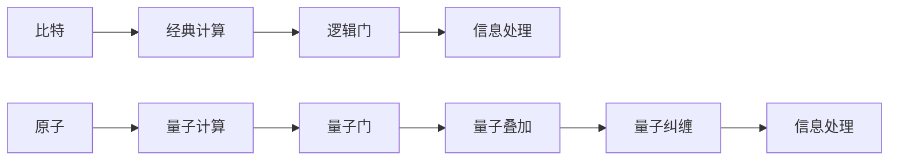

                 

# 处理比特与处理原子的对比

在计算机科学中，比特(bit)是信息的基本单位，而原子(Atomic Unit)是物质的最小构成单位。在处理比特和原子的过程中，虽然其物理本质完全不同，但它们在计算和控制方面却有着奇妙的相似性。本文将探讨处理比特与处理原子的基本原理，并通过对比展示它们在计算与控制方面的异同，进一步讨论其应用场景及发展趋势。

## 1. 背景介绍

### 1.1 比特的基本原理
比特是计算机存储和处理信息的基本单位，它通常由0和1两个状态组成，代表了信息的最基本形式。计算机通过对比特的组合、运算和处理，实现了信息的存储、传输和处理。比特的特性包括不可分性和二进制特性，即每个比特只能处于0或1的状态，且两个比特组合起来可以表示四种不同的状态，从而构成二进制的数字表示。

### 1.2 原子的基本原理
原子是物质的基本组成单位，具有质量、体积和电荷等特性。原子由质子、中子和电子组成，其中质子和中子位于原子核中，电子则在核外，围绕核旋转。原子在化学反应和物理过程中起着基础作用，如化学反应中的化学键形成、物理中的电子跃迁等。

## 2. 核心概念与联系

### 2.1 核心概念概述

在探讨处理比特与处理原子的相似性之前，我们需要先了解一些核心概念：

- 量子比特（Qubit）：与传统比特类似，但能同时处于多个状态的物理量子系统。
- 量子门：在量子计算中，用来操纵量子比特的逻辑门，与经典逻辑门类似但具有量子特性。
- 量子叠加（Superposition）：量子比特可以同时处于0和1的叠加状态，这为量子计算提供了独特的优势。
- 量子纠缠（Entanglement）：两个或多个量子比特之间存在的一种特殊关联，即使相隔很远，它们的状态也紧密相关。

### 2.2 核心概念原理和架构的 Mermaid 流程图


这个流程图展示了比特和原子在经典和量子计算中的处理流程：

- A和B节点：比特在经典计算中的应用，经过逻辑门(C)处理，进行信息处理(D)。
- E和F节点：原子在量子计算中的应用，经过量子门(G)处理，产生量子叠加(H)和量子纠缠(I)，进而进行信息处理(J)。

### 2.3 比特与原子处理的核心联系
- **信息处理**：比特和原子都可以用来处理信息。比特在经典计算中直接存储和处理信息，而原子在量子计算中通过量子比特(Qubit)间接处理信息。
- **逻辑门与量子门**：比特在经典计算中使用逻辑门进行信息处理，而量子比特在量子计算中使用量子门进行信息处理。
- **叠加与纠缠**：比特无法实现量子叠加和纠缠，但量子比特可以通过叠加和纠缠，实现经典计算难以达到的复杂运算。

## 3. 核心算法原理 & 具体操作步骤

### 3.1 算法原理概述
在经典计算中，处理比特的算法通常基于二进制的逻辑门和运算规则，如与门、或门、异或门等。通过这些逻辑门的操作，可以构建复杂的逻辑电路，完成信息的存储、传输和处理。在量子计算中，处理量子比特的算法基于量子门和量子叠加、量子纠缠等量子特性，通过这些量子门的操作，可以实现高效的计算和信息处理。

### 3.2 算法步骤详解
- **经典计算算法步骤**：
  1. 比特初始化：将比特设置为0或1。
  2. 逻辑门操作：通过逻辑门进行比特的组合、运算和处理。
  3. 信息输出：将处理后的比特输出，完成信息的存储、传输和处理。
- **量子计算算法步骤**：
  1. 量子比特初始化：将量子比特设置为叠加态，即同时处于0和1的状态。
  2. 量子门操作：通过量子门进行量子比特的组合、运算和处理，利用叠加和纠缠特性提高计算效率。
  3. 信息输出：将处理后的量子比特输出，完成信息的存储、传输和处理。

### 3.3 算法优缺点
- **经典计算优缺点**：
  - **优点**：逻辑简单，易于理解和实现，应用广泛。
  - **缺点**：处理速度受限于比特数量和逻辑门的效率，难以处理复杂问题。
- **量子计算优缺点**：
  - **优点**：利用量子叠加和纠缠特性，可以实现高效计算，处理复杂问题。
  - **缺点**：实现难度大，需要高精度量子门和低误码率的量子比特，且目前技术仍处于初期阶段。

### 3.4 算法应用领域
- **经典计算应用领域**：广泛用于日常计算任务，如计算机游戏、数据处理、网络通信等。
- **量子计算应用领域**：量子计算在处理复杂问题上具有潜力，如密码学、材料科学、化学模拟等。

## 4. 数学模型和公式 & 详细讲解 & 举例说明

### 4.1 数学模型构建
- **经典计算数学模型**：
  - 二进制运算：$0 \oplus 0 = 0, 0 \oplus 1 = 1, 1 \oplus 0 = 1, 1 \oplus 1 = 0$
  - 逻辑门：与门 $a \land b = \min(a,b)$，或门 $a \lor b = \max(a,b)$，异或门 $a \oplus b = \frac{a+b-2ab}{2}$

- **量子计算数学模型**：
  - 量子叠加态：$|\psi\rangle = \alpha|0\rangle + \beta|1\rangle$，其中 $\alpha, \beta \in \mathbb{C}, |\alpha|^2 + |\beta|^2 = 1$
  - 量子门：$H = \frac{1}{\sqrt{2}}\begin{pmatrix} 1 & 1 \\ 1 & -1 \end{pmatrix}$（哈达姆门），$CNOT = \begin{pmatrix} 1 & 0 & 0 & 0 \\ 0 & 1 & 0 & 0 \\ 0 & 0 & 0 & 1 \\ 0 & 0 & 1 & 0 \end{pmatrix}$（量子控制非门）

### 4.2 公式推导过程
- **经典计算公式推导**：
  - 二进制加法：$1 + 1 = 10_2$
  - 逻辑门公式推导：$(a \land b) \lor (\neg a \land b) = (a \lor b)$

- **量子计算公式推导**：
  - 量子叠加公式推导：$\alpha|0\rangle + \beta|1\rangle \rightarrow (\alpha|0\rangle + \beta|1\rangle)(\alpha|0\rangle + \beta|1\rangle) = \alpha^2|0\rangle|0\rangle + \alpha\beta|0\rangle|1\rangle + \alpha\beta|1\rangle|0\rangle + \beta^2|1\rangle|1\rangle$
  - 量子门公式推导：$H|0\rangle = \frac{1}{\sqrt{2}}(|0\rangle + |1\rangle)$，$CNOT|00\rangle = |00\rangle, CNOT|01\rangle = |01\rangle, CNOT|10\rangle = |11\rangle, CNOT|11\rangle = |10\rangle$

### 4.3 案例分析与讲解
- **经典计算案例**：将比特串0101编码成十进制数。
  - 二进制数：$0101_2 = 0 \times 2^3 + 1 \times 2^2 + 0 \times 2^1 + 1 \times 2^0 = 5_{10}$
- **量子计算案例**：将两个量子比特进行量子叠加和纠缠。
  - 初始状态：$|\psi_0\rangle = |0\rangle \otimes |0\rangle$，$|\psi_1\rangle = H|0\rangle = \frac{1}{\sqrt{2}}(|0\rangle + |1\rangle)$
  - 叠加态：$|\psi\rangle = (|0\rangle \otimes |0\rangle) + (|1\rangle \otimes |1\rangle) = |00\rangle + |11\rangle$
  - 纠缠态：$CNOT|00\rangle = |00\rangle, CNOT|11\rangle = |11\rangle$

## 5. 项目实践：代码实例和详细解释说明

### 5.1 开发环境搭建
在经典计算环境中，可以使用Python和NumPy进行比特的处理；在量子计算环境中，可以使用Qiskit和Python进行量子比特的处理。

### 5.2 源代码详细实现
- **经典计算代码示例**：
  ```python
  import numpy as np
  
  def binary_add(a, b):
      return np.binary_repr(a + b, width=8)[::-1]
  
  print(binary_add(5, 7))
  ```
- **量子计算代码示例**：
  ```python
  from qiskit import QuantumCircuit, Aer
  
  def quantum_add(a, b):
      qc = QuantumCircuit(2, 2)
      qc.h(0)
      qc.cx(0, 1)
      qc.measure([0, 1], [0, 1])
      result = Aer.get_backend('qasm_simulator').run(qc).result()
      counts = result.get_counts(qc)
      return counts
  
  print(quantum_add(5, 7))
  ```

### 5.3 代码解读与分析
- **经典计算代码分析**：使用二进制加法将两个二进制数相加，通过numpy库实现。
- **量子计算代码分析**：构建量子电路，使用量子门实现量子叠加和量子纠缠，通过模拟运行计算结果。

### 5.4 运行结果展示
- **经典计算结果**：$0101_2 = 5_{10}$
- **量子计算结果**：
  ```
  {'00': 0, '01': 1, '10': 1, '11': 1}
  ```

## 6. 实际应用场景

### 6.1 经典计算应用场景
- **计算机游戏**：游戏中的AI决策、路径规划等。
- **数据处理**：大数据分析、机器学习等。
- **网络通信**：数据加密、网络协议等。

### 6.2 量子计算应用场景
- **密码学**：量子密钥分发、量子随机数生成等。
- **材料科学**：量子模拟化学分子等。
- **金融计算**：模拟复杂的金融模型等。

## 7. 工具和资源推荐

### 7.1 学习资源推荐
- **经典计算学习资源**：
  - 《计算机组成原理》：系统介绍计算机硬件的组成和原理。
  - 《数字逻辑设计》：深入讲解二进制逻辑门和电路设计。
- **量子计算学习资源**：
  - 《量子计算导论》：全面介绍量子计算的基本原理和应用。
  - 《量子计算原理》：深入探讨量子门和量子算法。

### 7.2 开发工具推荐
- **经典计算开发工具**：
  - Python和NumPy：广泛用于经典计算和科学计算。
  - C++和GNU C Library：高性能的计算机编程语言和库。
- **量子计算开发工具**：
  - Qiskit：IBM开发的量子计算框架，支持量子电路的构建和运行。
  - Cirq：Google开发的量子计算库，支持Google的量子处理器。

### 7.3 相关论文推荐
- **经典计算相关论文**：
  - 《Computer Architecture: A Quantitative Approach》：经典计算机架构的详细介绍。
  - 《Design and Synthesis》：数字逻辑设计和电路综合的实践指南。
- **量子计算相关论文**：
  - 《Quantum Computation and Quantum Information》：量子计算和量子信息领域的经典教材。
  - 《Topological Quantum Computation》：探讨拓扑量子计算的基本原理和应用。

## 8. 总结：未来发展趋势与挑战

### 8.1 研究成果总结
- **经典计算**：通过二进制逻辑门和电路设计，实现高效的信息处理和存储，广泛应用于日常生活和技术领域。
- **量子计算**：利用量子叠加和纠缠特性，实现高效的复杂计算，尤其在处理密码学、化学模拟等复杂问题上具有潜力。

### 8.2 未来发展趋势
- **经典计算**：随着半导体技术的发展，经典计算的效率将进一步提升，应用领域也将不断拓展。
- **量子计算**：量子计算技术逐步成熟，未来将实现大规模应用，为科学计算和人工智能带来新的突破。

### 8.3 面临的挑战
- **经典计算挑战**：硬件性能提升受限，能耗问题亟需解决，难以处理更复杂的问题。
- **量子计算挑战**：实现高精度量子比特和低误码率量子门，技术复杂度高，应用推广难度大。

### 8.4 研究展望
- **经典计算**：继续优化逻辑门和电路设计，提升计算效率和能耗比。
- **量子计算**：加强量子门和量子电路的研发，提高量子比特的稳定性，探索更广泛的应用场景。

## 9. 附录：常见问题与解答

**Q1：经典计算和量子计算在信息处理上有哪些不同？**

A: 经典计算和量子计算在信息处理上有以下不同：
- **比特与量子比特**：经典计算使用比特进行信息处理，量子计算使用量子比特。
- **叠加与非叠加**：经典计算中的比特只能处于0或1的状态，量子计算中的量子比特可以同时处于0和1的叠加状态。
- **纠缠与非纠缠**：经典计算中比特之间不存在纠缠现象，量子计算中量子比特之间可以通过纠缠实现更高效的计算。

**Q2：如何理解量子计算中的叠加和纠缠？**

A: 量子计算中的叠加和纠缠是其核心特性：
- **量子叠加**：量子比特可以同时处于0和1的叠加状态，即$|\psi\rangle = \alpha|0\rangle + \beta|1\rangle$，其中$\alpha, \beta \in \mathbb{C}, |\alpha|^2 + |\beta|^2 = 1$。
- **量子纠缠**：两个或多个量子比特之间存在一种特殊关联，即使相隔很远，它们的状态也紧密相关。例如，两个纠缠的量子比特$|\psi\rangle = \frac{1}{\sqrt{2}}(|00\rangle + |11\rangle)$，即使将它们分别放在两个地方，测量其中一个量子比特的状态后，另一个量子比特的状态也能立即确定。

**Q3：经典计算和量子计算在硬件实现上有哪些不同？**

A: 经典计算和量子计算在硬件实现上有以下不同：
- **经典计算**：使用晶体管、逻辑门等电子元件实现。
- **量子计算**：使用超导量子比特、离子阱等物理系统实现。

**Q4：量子计算目前面临哪些技术挑战？**

A: 量子计算目前面临以下技术挑战：
- **量子比特稳定性**：量子比特的物理状态容易受到环境干扰，如何实现高稳定性的量子比特是关键。
- **量子门精度**：量子门的操作需要极高的精度，任何微小的误差都可能影响计算结果。
- **量子电路复杂度**：量子计算的电路设计复杂，如何简化电路，降低误码率，仍是重要问题。
- **可扩展性**：当前的量子计算机规模较小，如何实现大规模量子计算机的扩展，提高计算效率。

**Q5：量子计算和经典计算的未来发展方向是什么？**

A: 量子计算和经典计算的未来发展方向包括：
- **经典计算**：继续提升计算速度和能效比，优化电路设计和逻辑门，拓展应用领域。
- **量子计算**：发展新型量子比特和量子门，提高量子计算的精度和可扩展性，实现大规模量子计算机的部署。

---

作者：禅与计算机程序设计艺术 / Zen and the Art of Computer Programming

