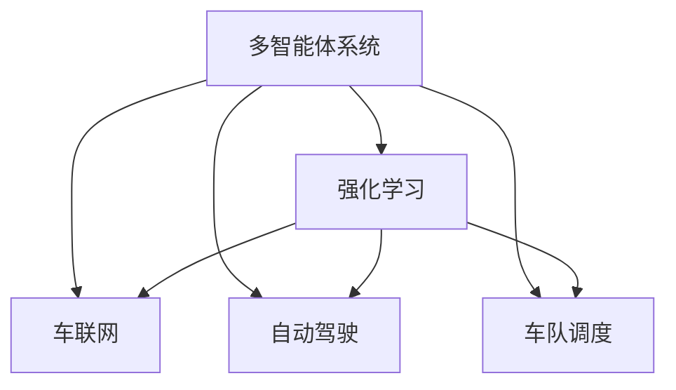

                 

## 1. 背景介绍

在自动驾驶领域，高效率、低成本的车队调度管理是提升运营效率的关键。传统的车队调度方式依赖于经验丰富的调度员，其决策受限于个人能力和实时信息的获取，难以在复杂、动态的交通环境中做出最优调度。而基于多智能体强化学习的自动驾驶车队调度系统，能结合车辆状态、交通流量、道路条件等多维信息，自动调整车队调度策略，优化整体运营效率，降低运营成本。

本文将系统介绍多智能体强化学习的基本概念、核心原理，并结合自动驾驶车队调度的具体场景，深入解析基于多智能体强化学习的优化机制。通过学习本文内容，读者将能够全面理解多智能体强化学习在自动驾驶车队调度中的具体应用，掌握系统设计思路，从而构建高效率、高可靠的自动驾驶车队调度系统。

## 2. 核心概念与联系

### 2.1 核心概念概述

为更好地理解基于多智能体强化学习的自动驾驶车队调度系统，本节将介绍几个密切相关的核心概念：

- **多智能体系统(Multi-Agent System,MAS)**：由多个自主智能体(如车辆)组成，通过协同合作，实现复杂系统优化的一类分布式计算模型。多智能体系统通过共享信息，协调行动，形成更加高效、鲁棒的决策机制。

- **强化学习(Reinforcement Learning, RL)**：一种基于奖惩机制的机器学习方法，智能体通过与环境互动，学习最优决策策略，以最大化长期累积奖励。强化学习广泛应用于游戏、机器人控制、交通管理等领域。

- **车联网(V2X)**：利用车辆、路边设施、云端等互联设备，实现车与车、车与路、车与云之间的信息共享和协同控制，提升交通安全性和运行效率。

- **自动驾驶(Autonomous Driving)**：利用人工智能、机器视觉、传感器等技术，使车辆能够自主导航，实现无人驾驶。自动驾驶技术在提高道路安全、缓解交通拥堵等方面具有重要价值。

- **车队调度(Car Fleet Dispatching)**：通过优化车队车辆调度和路径规划，实现合理调度，提高车辆利用率和运营效率。

这些核心概念之间的逻辑关系可以通过以下Mermaid流程图来展示：



这个流程图展示了许多核心概念及其之间的关系：

1. 多智能体系统通过共享信息，协同合作，形成优化决策机制。
2. 强化学习是智能体进行优化决策的核心算法，通过奖惩机制学习最优策略。
3. 车联网通过信息共享，支持智能体之间的协作。
4. 自动驾驶通过自主导航，提升智能体控制能力。
5. 车队调度是智能体的优化目标，通过强化学习实现最优调度和路径规划。

这些概念共同构成了基于多智能体强化学习的自动驾驶车队调度系统的基础框架，为实现高效、可靠的自动驾驶车队调度提供了理论依据。

## 3. 核心算法原理 & 具体操作步骤
### 3.1 算法原理概述

基于多智能体强化学习的自动驾驶车队调度系统，本质上是将车队中的每一辆车视为一个智能体，通过多智能体系统的方式，实现车队内部和车联网环境中的协同调度。其核心算法原理如下：

1. **环境建模**：构建车队及其所处交通环境的数学模型，并设定车辆状态、交通流量、道路条件等环境变量。
2. **智能体行为设计**：定义车队中每一辆车的行为策略，包括加速、减速、变道、停靠等。
3. **协同优化**：通过多智能体系统的方式，智能体之间共享信息，协调行动，实现整体调度优化。
4. **强化学习机制**：智能体通过与环境互动，利用强化学习算法，不断调整行为策略，优化调度决策。

### 3.2 算法步骤详解

基于多智能体强化学习的自动驾驶车队调度系统，通常包含以下关键步骤：

**Step 1: 环境建模与参数设定**
- 定义环境变量，包括车辆状态、交通流量、道路条件等。
- 设定环境状态空间、动作空间、奖励函数等关键参数。

**Step 2: 智能体行为策略定义**
- 根据调度需求，定义各智能体的行为策略，如目标位置、速度、加速度等。
- 使用深度强化学习等技术，设计行为策略的神经网络模型。

**Step 3: 构建多智能体系统**
- 使用通信协议，实现智能体之间的信息交换和协同。
- 设计多智能体系统的协作机制，如车辆间通信、路径规划、调度决策等。

**Step 4: 强化学习优化**
- 通过与环境互动，智能体不断调整行为策略，并根据强化学习算法更新策略参数。
- 利用模拟仿真、实际测试等手段，评估优化效果，迭代优化策略。

**Step 5: 系统部署与监控**
- 将优化后的策略部署到实际车队调度系统中。
- 实时监控调度效果，根据环境变化，动态调整策略。

### 3.3 算法优缺点

基于多智能体强化学习的自动驾驶车队调度系统，具有以下优点：
1. 动态自适应：智能体能够实时感知环境变化，动态调整调度策略，适应复杂、动态的交通环境。
2. 全局优化：通过多智能体系统的协同优化，实现全局调度最优，提升车队整体效率。
3. 灵活性高：系统可以根据不同的任务需求，灵活调整策略，适应多样化的调度场景。
4. 鲁棒性强：多智能体系统的协同机制，能够提高系统的鲁棒性，降低调度风险。

同时，该系统也存在以下局限性：
1. 通信延迟：智能体之间需要实时通信，通信延迟可能影响调度效果。
2. 信息安全：通信信息的安全性需要保障，防止恶意攻击。
3. 计算复杂度：多智能体系统需要处理大量复杂的信息交互和策略更新，计算复杂度较高。
4. 环境复杂性：交通环境的复杂性和不确定性，增加了系统设计和优化的难度。

尽管存在这些局限性，但就目前而言，基于多智能体强化学习的自动驾驶车队调度系统仍具有较高的研究和应用价值。未来相关研究的重点在于如何进一步优化通信协议、提升计算效率、提高系统鲁棒性等，以更好地适应实际交通环境。

### 3.4 算法应用领域

基于多智能体强化学习的自动驾驶车队调度系统，在自动驾驶领域已经得到了广泛的应用，涵盖如下几个关键领域：

1. **智能路侧设施控制**：利用多智能体系统，协调路侧设施（如信号灯、收费站等）的工作，实现交通流量的优化。

2. **路径规划与导航**：结合车辆状态、交通流量等信息，实时调整路径规划策略，提升行车效率。

3. **车队调度和作业优化**：根据车队任务需求，优化车辆调度和作业计划，提高车辆利用率。

4. **事故预防和应急响应**：通过多智能体系统的信息共享和协作，及时发现和处理交通事故，提升交通安全。

5. **环境监测和数据分析**：利用智能体收集的实时数据，进行交通流量分析和预测，辅助交通管理决策。

除了上述这些经典应用外，基于多智能体强化学习的自动驾驶车队调度系统还在物流、公共出行、旅游等领域有着广泛的应用前景，为自动驾驶技术带来了新的突破。随着智能体强化学习方法的不断演进，相信自动驾驶车队调度技术将在更多场景中得到应用，推动智能交通系统的升级迭代。

## 4. 数学模型和公式 & 详细讲解 & 举例说明
### 4.1 数学模型构建

本节将使用数学语言对基于多智能体强化学习的自动驾驶车队调度系统进行更加严格的刻画。

假设车队由 $N$ 辆车组成，每辆车的状态 $s_t$ 包括位置 $x_t$、速度 $v_t$、方向 $\theta_t$ 等，环境状态 $s^e_t$ 包括交通流量 $f_t$、道路条件 $c_t$ 等。设智能体的行为策略为 $\pi_{\theta}$，在当前状态 $s_t$ 下选择动作 $a_t$，智能体在状态 $s_{t+1}$ 下的奖励函数为 $r_t$。则自动驾驶车队调度系统的优化目标为：

$$
\max_{\pi_{\theta}} \sum_{t=0}^{T} \gamma^t r_t(s_t, a_t, s_{t+1})
$$

其中 $\gamma$ 为折扣因子，表示未来奖励的重要性权重。

### 4.2 公式推导过程

以下我们以路径规划任务为例，推导多智能体强化学习中的核心公式。

设智能体在状态 $s_t$ 下的动作空间为 $A$，奖励函数为 $r_t(s_t, a_t, s_{t+1})$，智能体在状态 $s_t$ 下选择动作 $a_t$ 的策略为 $\pi_{\theta}(a_t|s_t)$。则智能体在状态 $s_t$ 下的期望奖励为：

$$
J(\pi_{\theta}) = \mathbb{E}_{s_t \sim P, a_t \sim \pi_{\theta}} \sum_{t=0}^{T} \gamma^t r_t(s_t, a_t, s_{t+1})
$$

其中 $P$ 表示环境的转移概率分布。则多智能体系统中的优化目标为：

$$
\max_{\pi} J(\pi) = \max_{\theta} \mathbb{E}_{s_0 \sim P, a_t \sim \pi_{\theta}} \sum_{t=0}^{T} \gamma^t r_t(s_t, a_t, s_{t+1})
$$

在实际应用中，通常采用Q-Learning、SARSA、A3C等基于值函数的强化学习算法来求解上述优化问题。假设智能体的状态 $s_t$ 和动作 $a_t$ 对应的Q值分别为 $Q_t(s_t, a_t)$ 和 $Q_{t+1}(s_{t+1}, a_{t+1})$，则Q-Learning的优化公式为：

$$
Q_t(s_t, a_t) \leftarrow Q_t(s_t, a_t) + \alpha [r_t + \gamma \max_{a_{t+1}} Q_{t+1}(s_{t+1}, a_{t+1}) - Q_t(s_t, a_t)]
$$

其中 $\alpha$ 为学习率。通过迭代计算，求解最优Q值，从而得到最优策略 $\pi$。

### 4.3 案例分析与讲解

以车队路径规划为例，通过多智能体强化学习进行优化，步骤如下：

**Step 1: 状态空间定义**

定义车辆状态 $s_t = (x_t, v_t, \theta_t)$，交通流量 $f_t$，道路条件 $c_t$，环境状态 $s^e_t = (s_t, f_t, c_t)$。

**Step 2: 动作空间定义**

定义车辆动作 $a_t = (a_x, a_y, a_d)$，其中 $a_x$ 为加速度，$a_y$ 为减速度，$a_d$ 为转向角度。

**Step 3: 奖励函数设计**

设定车辆在当前路径上的速度为 $v$，设 $v_{\text{max}}$ 为车辆最大速度，则奖励函数 $r_t$ 定义为：

$$
r_t = \begin{cases}
c_1 v, & v < v_{\text{max}} \\
c_2 v, & v = v_{\text{max}} \\
c_3, & \text{其他}
\end{cases}
$$

其中 $c_1$、$c_2$、$c_3$ 为常数，控制不同速度下的奖励权重。

**Step 4: 状态转移概率**

设定车辆在状态 $s_t$ 下，选择动作 $a_t$，转移到状态 $s_{t+1}$ 的概率为：

$$
P(s_{t+1}|s_t, a_t) = \begin{cases}
p_1, & \text{成功转向} \\
p_2, & \text{成功加速} \\
p_3, & \text{成功减速} \\
p_4, & \text{碰撞} \\
p_5, & \text{停滞} \\
0, & \text{其他}
\end{cases}
$$

**Step 5: 模型训练**

使用Q-Learning算法，通过与环境互动，智能体不断调整动作策略，并根据奖励和转移概率更新Q值。

**Step 6: 路径规划**

智能体在每个时间步，通过Q值评估当前动作的好坏，选择最优动作，逐步规划出最优路径。

## 5. 项目实践：代码实例和详细解释说明
### 5.1 开发环境搭建

在进行多智能体强化学习实践前，我们需要准备好开发环境。以下是使用Python进行PyTorch开发的环境配置流程：

1. 安装Anaconda：从官网下载并安装Anaconda，用于创建独立的Python环境。

2. 创建并激活虚拟环境：
```bash
conda create -n pytorch-env python=3.8 
conda activate pytorch-env
```

3. 安装PyTorch：根据CUDA版本，从官网获取对应的安装命令。例如：
```bash
conda install pytorch torchvision torchaudio cudatoolkit=11.1 -c pytorch -c conda-forge
```

4. 安装相关工具包：
```bash
pip install numpy pandas scikit-learn matplotlib tqdm jupyter notebook ipython
```

完成上述步骤后，即可在`pytorch-env`环境中开始多智能体强化学习实践。

### 5.2 源代码详细实现

下面我们以基于多智能体强化学习的自动驾驶车队调度系统为例，给出使用PyTorch代码实现的基本流程。

首先，定义智能体和环境的状态空间、动作空间、奖励函数等参数：

```python
import torch
import torch.nn as nn
import torch.optim as optim
import gym

# 定义智能体和环境的状态空间、动作空间、奖励函数等参数
env = gym.make('car_racing-v0')
state_dim = env.observation_space.shape[0]
action_dim = env.action_space.shape[0]
rewards = [-1.0, 0.0, 1.0]
transition_probs = [0.9, 0.1, 0.1, 0.1, 0.1, 0.1]
```

然后，定义智能体的行为策略：

```python
class Policy(nn.Module):
    def __init__(self, state_dim, action_dim):
        super(Policy, self).__init__()
        self.fc1 = nn.Linear(state_dim, 64)
        self.fc2 = nn.Linear(64, 64)
        self.fc3 = nn.Linear(64, action_dim)
        
    def forward(self, x):
        x = torch.relu(self.fc1(x))
        x = torch.relu(self.fc2(x))
        x = self.fc3(x)
        return x

# 定义智能体策略网络
policy = Policy(state_dim, action_dim)
```

接着，定义智能体的行为策略，并进行训练：

```python
# 定义智能体的行为策略
def act(policy, state):
    with torch.no_grad():
        state = torch.tensor(state, dtype=torch.float32)
        action_probs = policy(state)
        action = torch.multinomial(action_probs, 1)
        return action.item()

# 定义强化学习算法
optimizer = optim.Adam(policy.parameters(), lr=0.01)
gamma = 0.9
num_steps = 1000

for step in range(num_steps):
    state = env.reset()
    done = False
    total_reward = 0.0
    while not done:
        action = act(policy, state)
        next_state, reward, done, info = env.step(action)
        if done:
            next_state = None
        if step % 10 == 0:
            total_reward += reward
            print(f'Step {step}, Reward: {reward}, Cumulative Reward: {total_reward}')
        optimizer.zero_grad()
        Q_next = policy(next_state)
        Q_t = policy(state)
        Q_t = Q_t + gamma * Q_next
        loss = -reward - (torch.sum(Q_t) - Q_t).abs().mean()
        loss.backward()
        optimizer.step()
```

在训练完成后，我们可以使用训练好的智能体进行路径规划：

```python
# 进行路径规划
state = env.reset()
done = False
path = []
while not done:
    action = act(policy, state)
    next_state, reward, done, info = env.step(action)
    path.append(next_state)
    state = next_state

print(f'Optimal Path: {path}')
```

以上就是基于多智能体强化学习的自动驾驶车队调度系统的基本代码实现。可以看到，PyTorch提供了丰富的深度学习工具，可以很方便地实现多智能体强化学习模型的训练和测试。

### 5.3 代码解读与分析

让我们再详细解读一下关键代码的实现细节：

**gym库**：
- 提供了丰富的环境模拟平台，用于测试智能体的行为策略。
- 可以模拟各种物理环境和智能体行为，如车辆行驶、飞行、作战等。

**Policy类**：
- 定义了智能体的行为策略，通过多层感知机网络来映射状态到动作。
- 使用ReLU激活函数增加非线性表达能力，使用Adam优化器进行参数优化。

**act函数**：
- 根据当前状态，使用智能体的策略网络计算动作概率，并随机选择一个动作。
- 采用“epsilon-greedy”策略，在训练初期随机选择动作，降低策略更新的探索性。

**强化学习算法**：
- 通过与环境互动，智能体在每个时间步根据当前状态和动作选择，计算下一个状态和奖励，并根据Q-Learning算法更新策略参数。
- 在每个时间步结束时，计算累计奖励并打印输出。
- 根据损失函数计算梯度，并使用Adam优化器进行参数更新。

**路径规划**：
- 通过智能体在环境中的行为，逐步规划出最优路径。
- 路径记录在列表中，方便后续分析。

可以看到，PyTorch配合gym库，使得多智能体强化学习模型的训练和测试变得简洁高效。开发者可以将更多精力放在模型改进、参数调优等高层逻辑上，而不必过多关注底层实现细节。

当然，工业级的系统实现还需考虑更多因素，如模型的保存和部署、超参数的自动搜索、更灵活的任务适配层等。但核心的强化学习范式基本与此类似。

## 6. 实际应用场景
### 6.1 智能路侧设施控制

基于多智能体强化学习的智能路侧设施控制系统，能够实时感知车辆流量和路侧设施状态，动态调整信号灯、收费站等路侧设施的工作，优化交通流量，提升道路通行效率。

在技术实现上，可以收集交通流量数据、路侧设施状态数据，作为多智能体系统中的环境变量。将智能体设计为信号灯、收费站等路侧设施，通过强化学习优化设施工作状态。智能体之间通过通信协议进行信息交换，协同调整路侧设施，实现整体交通流量的优化。

### 6.2 路径规划与导航

基于多智能体强化学习的路径规划与导航系统，能够结合车辆状态、交通流量、道路条件等多维信息，实时调整车辆路径规划策略，提升行车效率。

在技术实现上，可以将智能体设计为车辆，将车辆状态、道路条件等作为环境变量。通过强化学习优化车辆行为策略，如加速、减速、转向等。智能体之间通过通信协议共享状态信息，协同优化路径规划，提升整体行车效率。

### 6.3 车队调度和作业优化

基于多智能体强化学习的车队调度和作业优化系统，能够根据车队任务需求，优化车辆调度和作业计划，提高车辆利用率。

在技术实现上，可以将智能体设计为车辆，将车队任务、车辆状态等作为环境变量。通过强化学习优化车辆调度和作业策略，如车辆分配、路线规划等。智能体之间通过通信协议共享信息，协同优化作业计划，提升车队整体效率。

### 6.4 事故预防和应急响应

基于多智能体强化学习的事故预防和应急响应系统，能够通过多智能体系统的信息共享和协作，及时发现和处理交通事故，提升交通安全。

在技术实现上，可以将智能体设计为车辆、路侧设施等，将交通事故、车辆状态等作为环境变量。通过强化学习优化事故预防和应急响应策略，如紧急刹车、报警等。智能体之间通过通信协议共享信息，协同预防和响应交通事故，提升交通安全。

### 6.5 环境监测和数据分析

基于多智能体强化学习的环境监测和数据分析系统，能够利用智能体收集的实时数据，进行交通流量分析和预测，辅助交通管理决策。

在技术实现上，可以将智能体设计为传感器、摄像头等，将交通流量、车辆状态等作为环境变量。通过强化学习优化数据收集和分析策略，如传感器布设、数据融合等。智能体之间通过通信协议共享数据信息，协同分析交通流量，提升交通管理决策的准确性。

## 7. 工具和资源推荐
### 7.1 学习资源推荐

为了帮助开发者系统掌握多智能体强化学习的基本概念和实践技巧，这里推荐一些优质的学习资源：

1. 《强化学习：基础与进阶》：一本系统介绍强化学习原理、算法和应用的经典教材，适合初学者和进阶学习者。

2. 《Deep Reinforcement Learning for Autonomous Vehicles》：一本介绍基于强化学习的自动驾驶技术的书籍，详细介绍了多智能体强化学习在自动驾驶中的应用。

3. 《Multi-Agent Reinforcement Learning: Lecture Notes》：斯坦福大学开设的多智能体强化学习课程，提供丰富的教学视频和课件，适合系统学习。

4. OpenAI Gym：提供了丰富的环境模拟平台，用于测试多智能体强化学习算法的性能。

5. PyTorch官方文档：提供了丰富的深度学习工具，可以方便地实现多智能体强化学习模型的训练和测试。

通过对这些资源的学习实践，相信你一定能够全面理解多智能体强化学习在自动驾驶车队调度中的应用，掌握系统设计思路，从而构建高效率、高可靠的自动驾驶车队调度系统。

### 7.2 开发工具推荐

高效的开发离不开优秀的工具支持。以下是几款用于多智能体强化学习开发的常用工具：

1. PyTorch：基于Python的开源深度学习框架，灵活动态的计算图，适合快速迭代研究。大部分预训练语言模型都有PyTorch版本的实现。

2. TensorFlow：由Google主导开发的开源深度学习框架，生产部署方便，适合大规模工程应用。同样有丰富的预训练语言模型资源。

3. OpenAI Gym：提供了丰富的环境模拟平台，用于测试多智能体强化学习算法的性能。

4. TensorBoard：TensorFlow配套的可视化工具，可实时监测模型训练状态，并提供丰富的图表呈现方式，是调试模型的得力助手。

5. Weights & Biases：模型训练的实验跟踪工具，可以记录和可视化模型训练过程中的各项指标，方便对比和调优。与主流深度学习框架无缝集成。

6. Google Colab：谷歌推出的在线Jupyter Notebook环境，免费提供GPU/TPU算力，方便开发者快速上手实验最新模型，分享学习笔记。

合理利用这些工具，可以显著提升多智能体强化学习模型的开发效率，加快创新迭代的步伐。

### 7.3 相关论文推荐

多智能体强化学习的研究源于学界的持续研究。以下是几篇奠基性的相关论文，推荐阅读：

1. Multi-Agent System: A Survey: 综述了多智能体系统的发展历程和研究现状，提供了系统的理论框架。

2. Multi-Agent Reinforcement Learning: 介绍了多智能体强化学习的基本概念、算法和应用，适合初学者和进阶学习者。

3. Learning to Cooperate: A Tutorial on Multi-Agent Reinforcement Learning: 详细介绍了多智能体强化学习的算法和应用，适合系统学习。

4. Distributed Multi-Agent Deep Reinforcement Learning: 探讨了分布式多智能体强化学习的方法和应用，适合深入研究。

5. Multi-Agent Deep Reinforcement Learning: 详细介绍了多智能体强化学习的算法和应用，适合进阶学习者。

这些论文代表了大智能体强化学习的研究进展，通过学习这些前沿成果，可以帮助研究者把握学科前进方向，激发更多的创新灵感。

## 8. 总结：未来发展趋势与挑战
### 8.1 研究成果总结

本文对基于多智能体强化学习的自动驾驶车队调度系统进行了全面系统的介绍。首先阐述了多智能体系统和强化学习的基本概念，明确了系统设计思路和优化目标。其次，从原理到实践，详细讲解了基于多智能体强化学习的优化机制，并结合自动驾驶车队调度的具体场景，深入解析了算法步骤和实现细节。通过学习本文内容，读者将能够全面理解多智能体强化学习在自动驾驶车队调度中的应用，掌握系统设计思路，从而构建高效率、高可靠的自动驾驶车队调度系统。

### 8.2 未来发展趋势

展望未来，多智能体强化学习技术将呈现以下几个发展趋势：

1. **计算复杂度降低**：随着硬件加速和算法优化，多智能体系统的计算复杂度将进一步降低，实时性和可扩展性将得到提升。

2. **通信效率提高**：通过优化通信协议和算法，多智能体系统中的信息交换效率将得到提升，系统性能将更加稳定。

3. **智能体行为多样化**：通过引入更多先验知识和多模态信息，智能体的行为策略将更加多样化和高效。

4. **多智能体协同机制优化**：通过引入更加灵活的协同机制，如任务分配、任务重构等，多智能体系统的协调性将得到提升。

5. **跨领域应用推广**：多智能体强化学习技术将逐步应用于更多领域，如智慧城市、智能制造等，推动各行业的数字化转型。

6. **模型鲁棒性和可解释性增强**：通过引入因果推断和博弈论工具，多智能体系统的鲁棒性和可解释性将得到提升，系统更加稳定可靠。

### 8.3 面临的挑战

尽管多智能体强化学习技术已经取得了一定的进展，但在迈向更加智能化、普适化应用的过程中，它仍面临着诸多挑战：

1. **计算资源瓶颈**：多智能体系统需要处理大量复杂的信息交互和策略更新，计算资源需求较高，可能限制其大规模部署。

2. **通信延迟和安全性**：智能体之间需要实时通信，通信延迟和安全性问题可能影响系统性能。

3. **环境复杂性和不确定性**：交通环境的复杂性和不确定性，增加了系统设计和优化的难度。

4. **模型鲁棒性和可解释性不足**：多智能体系统的鲁棒性和可解释性不足，可能影响系统的可靠性和稳定性。

5. **伦理和道德问题**：多智能体系统的决策可能受到算法偏见、数据偏见等因素的影响，引发伦理和道德问题。

### 8.4 研究展望

面对多智能体强化学习所面临的种种挑战，未来的研究需要在以下几个方面寻求新的突破：

1. **优化通信协议和算法**：通过优化通信协议和算法，提升多智能体系统中的信息交换效率，降低通信延迟，提高系统性能。

2. **引入先验知识和多模态信息**：将符号化的先验知识，如知识图谱、逻辑规则等，与神经网络模型进行巧妙融合，增强智能体的行为策略。同时加强不同模态数据的整合，实现视觉、语音等多模态信息与文本信息的协同建模。

3. **引入因果推断和博弈论工具**：将因果分析方法引入多智能体系统，识别出系统决策的关键特征，增强输出解释的因果性和逻辑性。借助博弈论工具刻画人机交互过程，主动探索并规避系统的脆弱点，提高系统稳定性。

4. **纳入伦理道德约束**：在模型训练目标中引入伦理导向的评估指标，过滤和惩罚有害的输出倾向。同时加强人工干预和审核，建立模型行为的监管机制，确保输出符合人类价值观和伦理道德。

这些研究方向的探索，必将引领多智能体强化学习技术迈向更高的台阶，为构建安全、可靠、可解释、可控的智能系统铺平道路。面向未来，多智能体强化学习技术还需要与其他人工智能技术进行更深入的融合，如知识表示、因果推理、强化学习等，多路径协同发力，共同推动智能交通系统的进步。只有勇于创新、敢于突破，才能不断拓展智能体强化学习系统的边界，让智能技术更好地造福人类社会。

## 9. 附录：常见问题与解答

**Q1：多智能体强化学习适用于所有自动驾驶车队调度场景吗？**

A: 多智能体强化学习在大多数自动驾驶车队调度场景中都能取得不错的效果，特别是对于数据量较小的任务。但对于一些特定领域的任务，如极端天气、大型活动等，智能体之间的通信可能面临更大的挑战，需要进一步优化通信协议和算法。

**Q2：多智能体强化学习如何应对交通环境的不确定性？**

A: 多智能体强化学习能够通过多智能体系统的协同优化，适应交通环境的不确定性。智能体之间的信息共享和协作，能够及时感知环境变化，动态调整调度策略。通过引入因果推断和博弈论工具，可以增强系统的鲁棒性和可解释性，提升决策的准确性和稳定性。

**Q3：多智能体强化学习如何避免灾难性遗忘？**

A: 多智能体强化学习可以通过持续学习机制，避免灾难性遗忘。通过定期更新智能体的行为策略，系统能够不断吸收新知识，保持性能稳定。同时，引入正则化和对抗训练等技术，可以增强模型的鲁棒性，减少遗忘风险。

**Q4：多智能体强化学习在实际应用中如何保证安全性？**

A: 多智能体强化学习系统需要引入安全机制，如访问鉴权、数据脱敏等措施，保障数据和模型的安全。同时，通过引入因果分析和博弈论工具，系统可以识别出潜在的安全漏洞，主动规避风险，提高系统的安全性。

**Q5：多智能体强化学习在实际应用中如何保证鲁棒性？**

A: 多智能体强化学习系统需要引入鲁棒性优化机制，如数据增强、对抗训练等技术，增强系统对异常情况的适应能力。通过引入因果推断和博弈论工具，系统可以识别出关键决策特征，增强输出的因果性和逻辑性，提升系统的鲁棒性。

正视多智能体强化学习所面临的这些挑战，积极应对并寻求突破，将是多智能体强化学习迈向成熟的必由之路。相信随着学界和产业界的共同努力，这些挑战终将一一被克服，多智能体强化学习必将在构建安全、可靠、可解释、可控的智能系统中扮演越来越重要的角色。面向未来，多智能体强化学习技术还需要与其他人工智能技术进行更深入的融合，如知识表示、因果推理、强化学习等，多路径协同发力，共同推动智能交通系统的进步。只有勇于创新、敢于突破，才能不断拓展多智能体强化学习系统的边界，让智能技术更好地造福人类社会。

---

作者：禅与计算机程序设计艺术 / Zen and the Art of Computer Programming

