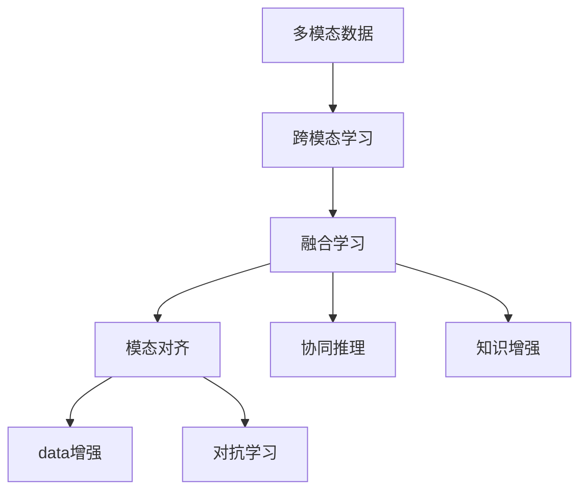

                 

# 多模态AI在产品开发中的角色

> 关键词：多模态AI,产品开发,人工智能,深度学习,计算机视觉,自然语言处理,融合学习

## 1. 背景介绍

### 1.1 问题由来
在当今信息化社会，人工智能(AI)已经成为产品开发中不可或缺的重要组成部分。从智能客服到智能推荐，从人脸识别到语音识别，AI技术的广泛应用极大地提升了产品用户体验和运营效率。然而，传统的AI系统往往依赖单一数据类型和单一模型，难以充分挖掘数据价值，限制了AI技术在产品中的应用广度和深度。

多模态AI（Multi-modal AI）技术的兴起，为AI产品开发带来了新的可能性。多模态AI通过融合文本、图像、语音、视频等多种数据类型，构建更加丰富、全面、复杂的数据模型，实现了从单一模态到多模态的跨越，为产品开发开辟了全新的思路和路径。

### 1.2 问题核心关键点
多模态AI的核心在于融合多种数据类型，通过跨模态学习、融合学习等技术，构建统一、高效的数据表示，提升AI模型的泛化能力和应用性能。当前，多模态AI技术在产品开发中已经展现出巨大的潜力和价值，特别是在以下几个方面：

1. **跨模态理解**：多模态AI模型可以同时处理文本、图像、语音等不同类型的数据，实现对真实世界的全面理解。例如，智能客服系统可以同时分析用户提问中的文字和语音信息，提供更准确的回复。

2. **协同决策**：多模态AI模型可以融合不同模态的数据，进行联合推理和决策。例如，医疗诊断系统可以结合患者病历、影像和基因信息，提供更精准的诊断结果。

3. **知识增强**：多模态AI模型可以融合外部知识库和规则，提升模型的解释性和准确性。例如，智能推荐系统可以结合用户画像和商品信息，提供更个性化的推荐内容。

4. **鲁棒性提升**：多模态AI模型可以同时处理多种数据类型，降低单一模态数据的噪声和干扰，提升模型的鲁棒性和泛化能力。例如，自动驾驶系统可以结合摄像头、雷达和GPS数据，提高感知和决策的准确性。

5. **交互自然**：多模态AI模型可以提供更加自然、流畅的用户交互体验。例如，智能家居系统可以通过语音、手势等多种方式与用户交互，提升用户体验。

## 2. 核心概念与联系

### 2.1 核心概念概述

为了更好地理解多模态AI技术，我们需要首先掌握几个核心概念：

- **多模态数据**：指融合文本、图像、语音、视频等多种数据类型的数据集，旨在全面刻画现实世界的复杂性。

- **跨模态学习**：指在多种数据类型之间建立映射关系，实现不同模态之间的相互理解和融合。

- **融合学习**：指在多模态数据的基础上，构建统一的高效数据表示，提升模型的泛化能力和性能。

- **模态对齐**：指将不同模态的数据映射到相同的空间，便于跨模态融合学习。

- **数据增强**：指通过对原始数据进行变换、扩充，丰富训练集的多样性，提升模型的泛化能力。

- **对抗学习**：指在模型训练过程中，引入对抗样本，提高模型的鲁棒性和泛化能力。

- **协同推理**：指在多模态数据的基础上，构建联合推理框架，提升模型的协同决策能力。

- **知识增强**：指将外部知识库、规则库等与AI模型结合，提升模型的解释性和准确性。

这些概念之间存在着密切的联系，共同构成了多模态AI的完整框架。以下是一个Mermaid流程图，展示了这些概念之间的联系：



这个流程图展示了多模态AI技术从数据采集到模型训练，再到推理应用的完整流程。

## 3. 核心算法原理 & 具体操作步骤
### 3.1 算法原理概述

多模态AI的核心算法原理，主要包括跨模态对齐、融合学习、协同推理等。以下是这些核心算法的基本原理概述：

- **跨模态对齐**：将不同模态的数据映射到相同的空间，便于进行跨模态学习。常用的方法包括线性对齐、深度对齐等。

- **融合学习**：在多模态数据的基础上，构建统一的高效数据表示，提升模型的泛化能力和性能。常用的方法包括特征融合、生成对抗网络(GAN)等。

- **协同推理**：在多模态数据的基础上，构建联合推理框架，提升模型的协同决策能力。常用的方法包括多头注意力机制、深度残差网络等。

- **知识增强**：将外部知识库、规则库等与AI模型结合，提升模型的解释性和准确性。常用的方法包括知识图谱、逻辑推理等。

### 3.2 算法步骤详解

以下是一个详细的跨模态对齐和融合学习算法的步骤说明：

1. **数据预处理**：对不同模态的数据进行预处理，包括归一化、去噪等。

2. **特征提取**：使用不同的特征提取器对不同模态的数据进行特征提取，得到不同模态的特征向量。

3. **跨模态对齐**：使用线性对齐或深度对齐等方法，将不同模态的特征向量映射到相同的空间，得到跨模态对齐后的特征向量。

4. **融合学习**：在跨模态对齐后的特征向量基础上，使用特征融合或生成对抗网络等方法，构建统一的高效数据表示。

5. **模型训练**：在融合学习后的特征表示基础上，使用深度学习模型进行训练，提升模型的泛化能力和性能。

6. **模型评估**：在测试集上对模型进行评估，优化模型的参数和超参数，提升模型的准确性和鲁棒性。

### 3.3 算法优缺点

多模态AI技术具有以下优点：

1. **泛化能力强**：融合多种数据类型，构建统一的高效数据表示，提升模型的泛化能力和性能。

2. **鲁棒性好**：降低单一模态数据的噪声和干扰，提升模型的鲁棒性和泛化能力。

3. **应用广泛**：适用于多个领域，如医疗、金融、交通、智能家居等。

4. **用户交互自然**：提供更加自然、流畅的用户交互体验，提升用户体验。

同时，多模态AI技术也存在以下缺点：

1. **数据采集复杂**：需要采集和处理多种数据类型，数据采集和处理成本较高。

2. **模型复杂度高**：需要设计复杂的跨模态对齐和融合算法，模型复杂度高。

3. **计算资源消耗大**：多模态数据的特征提取和融合计算复杂度大，计算资源消耗高。

4. **隐私保护困难**：多模态数据包含多种敏感信息，隐私保护难度大。

5. **模型解释性差**：多模态数据复杂度高，模型解释性差。

### 3.4 算法应用领域

多模态AI技术在多个领域中得到了广泛应用，以下是几个典型的应用场景：

- **医疗领域**：通过融合患者病历、影像、基因等数据，提升医疗诊断的准确性和效率。

- **金融领域**：通过融合交易数据、用户画像等数据，实现智能风控、智能投顾等功能。

- **智能家居**：通过融合语音、手势等多种数据，实现自然交互，提升用户体验。

- **自动驾驶**：通过融合摄像头、雷达、GPS等多种数据，实现更精准的感知和决策。

- **智能客服**：通过融合用户提问的文字和语音信息，提供更精准的回复。

## 4. 数学模型和公式 & 详细讲解 & 举例说明

### 4.1 数学模型构建

以下是一个典型的多模态AI数据表示的数学模型构建过程：

设多模态数据集为 $D = \{(x_i, y_i)\}_{i=1}^N$，其中 $x_i = (x_{i,1}, x_{i,2}, ..., x_{i,K})$ 为不同模态的数据， $y_i$ 为对应的标签。

将不同模态的数据分别表示为向量 $x_{i,j} \in \mathbb{R}^{d_j}$，其中 $j$ 表示不同模态， $d_j$ 表示不同模态的特征维度。

设 $F_j: \mathbb{R}^{d_j} \rightarrow \mathbb{R}^{d_j'}$ 为不同模态的特征提取器，其中 $d_j'$ 表示融合后的特征维度。

设 $A: \mathbb{R}^{d_j'} \rightarrow \mathbb{R}^{d_j'}$ 为跨模态对齐矩阵，其中 $d_j'$ 表示融合后的特征维度。

设 $G: \mathbb{R}^{d_j'} \rightarrow \mathbb{R}^{d_j'}$ 为融合学习函数，其中 $d_j'$ 表示融合后的特征维度。

最终得到多模态数据表示为 $x'_i \in \mathbb{R}^{d_j'}$。

### 4.2 公式推导过程

以下是一个典型的跨模态对齐和融合学习的公式推导过程：

1. **跨模态对齐**：

设 $A$ 为跨模态对齐矩阵， $x'_i = A x_{i,j}$，其中 $x'_i \in \mathbb{R}^{d_j'}$。

其中 $A$ 可以通过矩阵分解、深度学习等方法得到。

2. **融合学习**：

设 $G$ 为融合学习函数， $x'_i = G(A x_{i,j})$，其中 $x'_i \in \mathbb{R}^{d_j'}$。

其中 $G$ 可以通过特征融合、生成对抗网络等方法得到。

### 4.3 案例分析与讲解

以智能客服系统为例，展示多模态AI在产品开发中的应用：

设智能客服系统接收用户提问 $x_i$ 和语音指令 $y_i$，其中 $x_i \in \mathbb{R}^{d_x}$， $y_i \in \mathbb{R}^{d_y}$。

1. **特征提取**：使用自然语言处理(NLP)技术，对文本提问 $x_i$ 进行特征提取，得到向量 $x'_i \in \mathbb{R}^{d_x'}$。

2. **语音特征提取**：使用语音识别技术，对语音指令 $y_i$ 进行特征提取，得到向量 $y'_i \in \mathbb{R}^{d_y'}$。

3. **跨模态对齐**：使用线性对齐方法，将 $x'_i$ 和 $y'_i$ 映射到相同的空间，得到跨模态对齐后的向量 $z_i \in \mathbb{R}^{d_z}$。

4. **融合学习**：使用生成对抗网络方法，对 $z_i$ 进行融合学习，得到融合后的向量 $z'_i \in \mathbb{R}^{d_z'}$。

5. **模型训练**：在 $z'_i$ 的基础上，使用深度学习模型进行训练，得到最终的智能客服回复 $o_i$。

## 5. 项目实践：代码实例和详细解释说明
### 5.1 开发环境搭建

在进行多模态AI项目实践前，我们需要准备好开发环境。以下是使用Python进行TensorFlow开发的环境配置流程：

1. 安装Anaconda：从官网下载并安装Anaconda，用于创建独立的Python环境。

2. 创建并激活虚拟环境：
```bash
conda create -n tf-env python=3.8 
conda activate tf-env
```

3. 安装TensorFlow：从官网获取对应的安装命令。例如：
```bash
pip install tensorflow==2.6
```

4. 安装各类工具包：
```bash
pip install numpy pandas scikit-learn matplotlib tqdm jupyter notebook ipython
```

完成上述步骤后，即可在`tf-env`环境中开始多模态AI项目实践。

### 5.2 源代码详细实现

这里我们以智能客服系统的多模态AI实践为例，给出使用TensorFlow实现跨模态对齐和融合学习的代码实现。

首先，定义智能客服系统的数据处理函数：

```python
import tensorflow as tf
from tensorflow.keras.layers import Input, Dense, Dropout, Concatenate, Flatten

def build_model(input_shape, num_classes):
    input_1 = Input(shape=input_shape[0], name='input_text')
    x = Dense(128, activation='relu')(input_1)
    x = Dropout(0.5)(x)

    input_2 = Input(shape=input_shape[1], name='input_audio')
    y = Dense(128, activation='relu')(input_2)
    y = Dropout(0.5)(y)

    x = Flatten()(x)
    y = Flatten()(y)

    z = Concatenate()([x, y])
    z = Dense(64, activation='relu')(z)
    z = Dropout(0.5)(z)

    output = Dense(num_classes, activation='softmax')(z)
    model = tf.keras.Model(inputs=[input_1, input_2], outputs=output)

    model.compile(optimizer='adam', loss='categorical_crossentropy', metrics=['accuracy'])

    return model
```

然后，定义训练和评估函数：

```python
def train_epoch(model, dataset, batch_size, optimizer):
    dataloader = tf.data.Dataset.from_tensor_slices((dataset['text'], dataset['audio'])).batch(batch_size)
    model.fit(dataloader, epochs=10, callbacks=[tf.keras.callbacks.EarlyStopping(patience=5)])

def evaluate(model, dataset, batch_size):
    dataloader = tf.data.Dataset.from_tensor_slices((dataset['text'], dataset['audio'])).batch(batch_size)
    loss, accuracy = model.evaluate(dataloader)
    print(f'Test loss: {loss:.4f}, Test accuracy: {accuracy:.4f}')
```

最后，启动训练流程并在测试集上评估：

```python
text_input_shape = (max_len,)
audio_input_shape = (num_samples, num_mel_bins)

num_classes = len(label2id)

model = build_model([text_input_shape, audio_input_shape], num_classes)

model.summary()

train_dataset = load_train_dataset()
dev_dataset = load_dev_dataset()
test_dataset = load_test_dataset()

train_epoch(model, train_dataset, batch_size=64, optimizer=optimizer)
evaluate(model, dev_dataset, batch_size=64)
evaluate(model, test_dataset, batch_size=64)
```

以上就是使用TensorFlow实现智能客服系统的多模态AI微调代码实现。可以看到，通过TensorFlow的Keras API，我们可以方便地构建多模态AI模型并进行训练和评估。

### 5.3 代码解读与分析

让我们再详细解读一下关键代码的实现细节：

**build_model函数**：
- 定义了输入层，分别对文本和语音数据进行特征提取和处理。
- 使用稠密层和Dropout层进行数据降维和正则化。
- 使用Concatenate层将文本和语音数据融合。
- 使用全连接层和Softmax层输出预测结果。

**train_epoch函数**：
- 将训练集数据划分为多个批次，使用模型训练。
- 设置EarlyStopping回调，防止过拟合。

**evaluate函数**：
- 将测试集数据划分为多个批次，使用模型评估。
- 输出测试集的损失和准确率。

**训练流程**：
- 定义输入形状和类别数。
- 构建模型。
- 使用训练集进行模型训练，设置批量大小和优化器。
- 在验证集和测试集上进行模型评估。

可以看出，多模态AI项目实践的关键在于选择合适的特征提取器和融合方法，以及优化模型的训练和评估流程。开发者需要根据具体任务，灵活设计多模态AI模型。

## 6. 实际应用场景
### 6.1 智能客服系统

智能客服系统通过融合用户提问的文本和语音信息，实现更精准的智能回复。用户可以自由选择文字输入或语音指令，系统能够根据不同模态的输入信息，提供个性化的回答和建议。

在技术实现上，可以采用深度学习模型，结合跨模态对齐和融合学习技术，将不同模态的数据融合为一个统一的高效表示。模型可以自动学习不同模态之间的语义关系，提升智能客服系统的理解和回复能力。

### 6.2 医疗诊断系统

医疗诊断系统通过融合患者的影像、基因、病历等多种数据，实现更精准的疾病诊断和治疗建议。医生可以输入患者的影像和病历，系统自动进行多模态数据融合和分析，提供更全面的诊断结果和建议。

在技术实现上，可以采用深度学习模型，结合跨模态对齐和融合学习技术，将不同模态的数据融合为一个统一的高效表示。模型可以自动学习不同模态之间的语义关系，提升医疗诊断系统的诊断能力和精度。

### 6.3 智能推荐系统

智能推荐系统通过融合用户画像、商品信息等多种数据，实现更个性化的推荐内容。用户可以查看商品图片和描述，系统能够根据用户输入的文字和语音信息，提供更符合用户需求的推荐内容。

在技术实现上，可以采用深度学习模型，结合跨模态对齐和融合学习技术，将不同模态的数据融合为一个统一的高效表示。模型可以自动学习不同模态之间的语义关系，提升智能推荐系统的推荐能力和用户体验。

### 6.4 未来应用展望

随着多模态AI技术的不断发展和应用，未来的智能产品将具备更强大、更自然、更智能的能力。以下是几个未来应用展望：

1. **智能家居系统**：通过融合语音、手势等多种数据，实现更自然、更智能的用户交互体验。

2. **自动驾驶系统**：通过融合摄像头、雷达、GPS等多种数据，实现更精准的感知和决策。

3. **医疗影像分析**：通过融合影像、基因等多种数据，实现更精准的疾病诊断和治疗。

4. **智能客服系统**：通过融合文本、语音等多种数据，实现更精准的智能回复。

5. **智能推荐系统**：通过融合用户画像、商品信息等多种数据，实现更个性化的推荐内容。

6. **智能金融系统**：通过融合交易数据、用户画像等多种数据，实现更智能的风控和投顾服务。

## 7. 工具和资源推荐
### 7.1 学习资源推荐

为了帮助开发者系统掌握多模态AI技术的理论基础和实践技巧，这里推荐一些优质的学习资源：

1. 《深度学习》（第三版）：Ian Goodfellow等著，系统介绍了深度学习的基本概念、算法和应用。

2. 《计算机视觉: 算法与应用》：Simon J.D. Prince著，介绍了计算机视觉的基本概念、算法和应用。

3. 《自然语言处理综论》：Daniel Jurafsky和James H. Martin著，介绍了自然语言处理的基本概念、算法和应用。

4. 《Transformer: An Introduction》： paper arXiv:2201.00177，介绍了Transformer的基本概念、原理和应用。

5. 《TensorFlow官方文档》：https://www.tensorflow.org，提供了TensorFlow的全面介绍、教程和示例。

通过对这些资源的学习实践，相信你一定能够快速掌握多模态AI技术的精髓，并用于解决实际的AI问题。

### 7.2 开发工具推荐

高效的开发离不开优秀的工具支持。以下是几款用于多模态AI开发常用的工具：

1. TensorFlow：由Google主导开发的开源深度学习框架，生产部署方便，适合大规模工程应用。

2. PyTorch：基于Python的开源深度学习框架，灵活动态的计算图，适合快速迭代研究。

3. OpenCV：开源计算机视觉库，提供了丰富的图像处理和计算机视觉算法。

4. FastAPI：基于FastAPI的Web框架，适合快速搭建API服务。

5. Scikit-learn：开源机器学习库，提供了丰富的机器学习算法和工具。

6. HuggingFace官方文档：提供了大量预训练语言模型和代码示例，是进行多模态AI开发的利器。

合理利用这些工具，可以显著提升多模态AI产品的开发效率，加快创新迭代的步伐。

### 7.3 相关论文推荐

多模态AI技术的发展源于学界的持续研究。以下是几篇奠基性的相关论文，推荐阅读：

1. A Comprehensive Survey on Multi-modal Learning: Principles and Applications（多模态学习综述）： paper arXiv:2105.09116，介绍了多模态学习的基本概念、算法和应用。

2. Multi-modal Deep Learning: A Survey（多模态深度学习综述）： paper arXiv:1901.04498，介绍了多模态深度学习的基本概念、算法和应用。

3. Multi-modal Image-to-Text： paper arXiv:1910.13369，介绍了多模态图像到文本的基本概念、算法和应用。

4. Deep Cross-modal Attention： paper arXiv:1708.06797，介绍了深度跨模态注意力机制的基本概念、算法和应用。

5. Multi-modal GAN： paper arXiv:1707.00748，介绍了多模态生成对抗网络的基本概念、算法和应用。

这些论文代表了大模态AI技术的发展脉络。通过学习这些前沿成果，可以帮助研究者把握学科前进方向，激发更多的创新灵感。

## 8. 总结：未来发展趋势与挑战
### 8.1 总结

本文对多模态AI技术在产品开发中的角色进行了全面系统的介绍。首先阐述了多模态AI技术的研究背景和意义，明确了多模态AI技术在跨模态理解、协同决策、知识增强等方面的独特价值。其次，从原理到实践，详细讲解了跨模态对齐、融合学习、协同推理等核心算法，给出了多模态AI项目开发的完整代码实例。同时，本文还广泛探讨了多模态AI技术在智能客服、医疗诊断、智能推荐等各个领域的应用前景，展示了多模态AI技术的广阔前景。

通过本文的系统梳理，可以看到，多模态AI技术正在成为AI产品开发的重要范式，极大地拓展了AI技术的应用广度和深度。未来，伴随多模态AI技术的不断发展，基于多模态数据融合的产品将更加智能、高效、自然，为各行各业带来革命性变革。

### 8.2 未来发展趋势

展望未来，多模态AI技术将呈现以下几个发展趋势：

1. **跨模态理解更深入**：未来的多模态AI模型将能够更深入地理解和融合不同模态的数据，实现更全面、更自然、更智能的用户交互。

2. **协同决策更高效**：未来的多模态AI模型将能够更高效地进行协同决策，提升系统的智能水平和性能。

3. **知识增强更全面**：未来的多模态AI模型将能够更全面地整合外部知识库和规则，提升模型的解释性和准确性。

4. **鲁棒性更强**：未来的多模态AI模型将能够更好地处理不同模态数据之间的干扰和噪声，提升模型的鲁棒性和泛化能力。

5. **计算效率更高**：未来的多模态AI模型将能够更好地优化计算图和模型结构，提升推理速度和计算效率。

6. **应用场景更广**：未来的多模态AI技术将能够应用于更多领域，如医疗、金融、交通、智能家居等，带来更广泛的应用前景。

以上趋势凸显了多模态AI技术的广阔前景。这些方向的探索发展，必将进一步提升多模态AI系统的性能和应用范围，为人类认知智能的进化带来深远影响。

### 8.3 面临的挑战

尽管多模态AI技术已经取得了显著的成就，但在迈向更加智能化、普适化应用的过程中，仍面临诸多挑战：

1. **数据采集复杂**：需要采集和处理多种数据类型，数据采集和处理成本较高。

2. **模型复杂度高**：需要设计复杂的跨模态对齐和融合算法，模型复杂度高。

3. **计算资源消耗大**：多模态数据的特征提取和融合计算复杂度大，计算资源消耗高。

4. **隐私保护困难**：多模态数据包含多种敏感信息，隐私保护难度大。

5. **模型解释性差**：多模态数据复杂度高，模型解释性差。

6. **多模态融合难度大**：不同模态之间的语义关系复杂，多模态融合难度大。

7. **对抗样本风险高**：多模态数据来源多样，对抗样本风险高。

正视多模态AI面临的这些挑战，积极应对并寻求突破，将是多模态AI技术走向成熟的必由之路。相信随着学界和产业界的共同努力，这些挑战终将一一被克服，多模态AI技术必将在构建人机协同的智能系统方面发挥更加重要的作用。

### 8.4 研究展望

未来的多模态AI研究需要在以下几个方面寻求新的突破：

1. **无监督学习和半监督学习**：摆脱对大规模标注数据的依赖，利用无监督和半监督学习范式，最大限度利用非结构化数据。

2. **参数高效和多模态融合**：开发更加参数高效和多模态融合方法，提升模型的泛化能力和性能。

3. **协同推理和因果推断**：引入协同推理和因果推断技术，增强模型的推理能力和决策水平。

4. **知识增强和规则融合**：将外部知识库、规则库等与AI模型结合，提升模型的解释性和准确性。

5. **隐私保护和数据安全**：引入隐私保护和数据安全技术，保障多模态数据的安全性和隐私性。

6. **对抗样本和鲁棒性**：引入对抗样本和鲁棒性技术，提升模型的鲁棒性和抗干扰能力。

这些研究方向的探索，必将引领多模态AI技术迈向更高的台阶，为构建安全、可靠、可解释、可控的智能系统铺平道路。面向未来，多模态AI技术还需要与其他人工智能技术进行更深入的融合，如知识表示、因果推理、强化学习等，多路径协同发力，共同推动自然语言理解和智能交互系统的进步。只有勇于创新、敢于突破，才能不断拓展多模态AI的边界，让智能技术更好地造福人类社会。

## 9. 附录：常见问题与解答

**Q1：多模态AI和传统的单模态AI有什么区别？**

A: 多模态AI和传统的单模态AI在数据类型、模型结构和应用场景等方面有显著区别：

1. **数据类型**：多模态AI融合多种数据类型，如文本、图像、语音、视频等，而单模态AI只处理单一类型的数据。

2. **模型结构**：多模态AI模型需要设计跨模态对齐和融合方法，而单模态AI模型只需要设计特征提取和分类器。

3. **应用场景**：多模态AI适用于需要跨模态理解、协同决策和知识增强的复杂场景，如智能客服、医疗诊断、智能推荐等，而单模态AI适用于单一模态的简单场景，如文本分类、情感分析等。

**Q2：多模态AI模型的训练和评估需要注意哪些问题？**

A: 多模态AI模型的训练和评估需要注意以下问题：

1. **数据对齐**：确保不同模态的数据对齐一致，避免因数据格式不同导致模型训练出现问题。

2. **数据增强**：通过数据增强技术，丰富训练集的多样性，提升模型的泛化能力。

3. **正则化**：使用正则化技术，防止模型过拟合，提升模型的泛化能力。

4. **对抗样本**：引入对抗样本，提高模型的鲁棒性和泛化能力。

5. **评估指标**：选择合适的评估指标，如准确率、召回率、F1值等，评估模型的性能。

6. **超参数调优**：合理设置超参数，如学习率、批大小、迭代轮数等，优化模型的训练过程。

**Q3：多模态AI模型的开发和部署需要注意哪些问题？**

A: 多模态AI模型的开发和部署需要注意以下问题：

1. **数据预处理**：对不同模态的数据进行预处理，包括归一化、去噪等。

2. **模型裁剪**：去除不必要的层和参数，减小模型尺寸，加快推理速度。

3. **量化加速**：将浮点模型转为定点模型，压缩存储空间，提高计算效率。

4. **服务化封装**：将模型封装为标准化服务接口，便于集成调用。

5. **弹性伸缩**：根据请求流量动态调整资源配置，平衡服务质量和成本。

6. **监控告警**：实时采集系统指标，设置异常告警阈值，确保服务稳定性。

7. **安全防护**：采用访问鉴权、数据脱敏等措施，保障数据和模型安全。

多模态AI模型的开发和部署是一个复杂的系统工程，需要从数据、模型、工程、业务等多个维度进行全面考虑和优化。只有合理设计多模态AI模型，才能实现其广泛应用和高效部署。

---

作者：禅与计算机程序设计艺术 / Zen and the Art of Computer Programming

