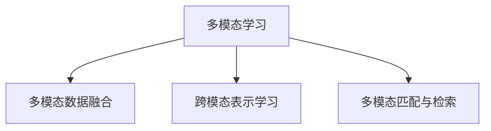

                 

# 多模态全面接入的 AI 应用

## 1. 背景介绍

在数字化时代，单一模态的信息获取和处理已经不能满足日益增长的需求。人类沟通和交互往往跨越语音、文字、图像、视频等多种模态，AI应用需要能够整合和理解多模态信息，才能真正贴近用户需求，提供卓越的体验。当前，基于深度学习的多模态学习技术已经日趋成熟，成功应用于诸如自动驾驶、医疗影像、智能客服、智慧城市等多个前沿领域。本文将围绕多模态接入的核心概念、算法原理与具体应用案例展开详细讨论。

## 2. 核心概念与联系

### 2.1 核心概念概述

为全面理解多模态接入技术，本节将介绍几个关键概念：

- 多模态学习(Multimodal Learning)：指同时学习多种模态数据，以构建跨模态、多模态的联合表示。常用于图像、语音、文本等多种模态数据之间的互学习，提升模型的泛化能力和数据利用率。

- 多模态数据融合(Multimodal Data Fusion)：指将来自不同模态的数据融合为一个统一的表示，用于提升模型的表示能力和决策能力。多模态融合方法包括时空池化、特征匹配、生成对抗网络等。

- 跨模态表示学习(Cross-modal Representation Learning)：指在不同模态之间建立桥梁，使得模型能够从一种模态的表示中映射到另一种模态的表示。跨模态表示学习方法包括字典学习、最大均值差异等。

- 多模态匹配与检索(Multimodal Matching and Retrieval)：指在多种模态数据中检索和匹配相似对象，常用于视觉搜索、人脸识别、推荐系统等。

这些概念之间的逻辑关系可以通过以下Mermaid流程图来展示：



这个流程图展示了多模态接入技术的主要组成部分和它们之间的联系。

## 3. 核心算法原理 & 具体操作步骤
### 3.1 算法原理概述

多模态全面接入的核心在于将不同模态的数据融合为一个统一的表示，并在此基础上进行学习与推理。其关键算法包括特征提取、跨模态对齐、多模态融合等。

1. **特征提取(Feature Extraction)**：从不同模态中提取有意义的表示，如图像的卷积特征、语音的MFCC特征、文本的Word2Vec特征等。

2. **跨模态对齐(Cross-modal Alignment)**：在不同模态之间建立映射关系，如使用最大均值差异(MMD)、核对齐(Kernel Alignment)等方法。

3. **多模态融合(Multimodal Fusion)**：将不同模态的表示融合为一个统一的表示，如时空间池化(Time Pooling)、特征匹配(Feature Matching)等方法。

4. **联合训练(Joint Training)**：将多模态数据联合训练，使得模型能够学习到跨模态的关联和互补信息。

5. **多模态匹配(Multimodal Matching)**：使用匹配模型在多种模态数据中检索和匹配相似对象，如使用余弦相似度(Cosine Similarity)、三角相似度(Triplet Loss)等方法。

### 3.2 算法步骤详解

以下我们将以多模态人脸识别任务为例，展示多模态全面接入的基本算法步骤：

**Step 1: 数据准备**
- 收集包含人脸图像和语音数据的多模态数据集。
- 将人脸图像通过卷积神经网络(CNN)提取特征向量。
- 将语音数据通过MFCC特征提取器提取MFCC特征向量。
- 将人脸图像和语音特征向量归一化到相同维度。

**Step 2: 特征对齐**
- 使用最大均值差异(MMD)等方法对齐人脸图像和语音特征向量。
- 构建人脸图像与语音特征的联合特征向量表示。

**Step 3: 特征融合**
- 使用时空间池化(Time Pooling)等方法融合人脸图像和语音特征。
- 将融合后的特征输入到全连接层进行学习。

**Step 4: 训练和推理**
- 使用联合训练的方式训练模型。
- 在测试集上进行多模态匹配和推理，识别不同模态下的相似对象。

### 3.3 算法优缺点

多模态全面接入方法具有以下优点：

1. **提升泛化能力**：多模态数据融合可以提升模型的泛化能力，使其在不同模态间也能进行有效的知识迁移。
2. **丰富表示形式**：通过综合不同模态的数据，模型可以更好地理解现实世界的复杂性。
3. **增强鲁棒性**：多模态信息可以互相补充，增强模型的鲁棒性和稳定性。
4. **应用广泛**：多模态技术可以应用于自动驾驶、医疗影像、智能客服、智慧城市等多个领域。

同时，该方法也存在一些局限性：

1. **数据复杂度高**：多模态数据的收集和预处理较为复杂，需要大量标注数据。
2. **模型复杂度高**：多模态数据融合和特征对齐等过程增加了模型的复杂度。
3. **计算成本高**：多模态学习需要较强的计算资源，特别是深度神经网络的结构复杂性较大。
4. **泛化性限制**：不同模态之间的数据分布差异较大，可能影响模型的泛化性。

尽管存在这些局限性，但多模态全面接入技术已经在诸多领域得到了广泛应用，未来仍具有巨大的发展潜力。

### 3.4 算法应用领域

多模态全面接入技术已经在以下领域取得了显著应用：

1. **自动驾驶**：结合图像、激光雷达和GPS等多种模态信息，提升驾驶安全性和智能性。
2. **医疗影像**：整合CT、MRI、超声图像和基因数据，提高疾病诊断的准确性。
3. **智能客服**：结合语音识别和自然语言处理技术，实现更加自然和精准的对话。
4. **智慧城市**：整合视频监控、传感器和GPS数据，实现城市交通管理和公共安全。
5. **娱乐传媒**：结合视频、音频和文本信息，提供更加丰富和沉浸的娱乐体验。

## 4. 数学模型和公式 & 详细讲解 & 举例说明

### 4.1 数学模型构建

在多模态学习中，我们通常使用多模态表示模型，以联合训练不同模态的特征向量。假设有$m$个模态，$f_k$为第$k$个模态的特征表示，$z_k$为对应的联合表示，模型可以表示为：

$$
z_k = g_k(f_k; \theta_k)
$$

其中$g_k$为第$k$个模态的映射函数，$\theta_k$为相应的参数。联合表示$z$可以表示为：

$$
z = [z_1, z_2, \dots, z_m]
$$

多模态表示学习的目标是通过最小化损失函数$L(z; \theta)$，优化联合表示$z$，使得模型能够更好地表示不同模态的数据。

### 4.2 公式推导过程

以下我们以人脸识别任务为例，推导多模态学习中的损失函数。

设$x$为人脸图像，$y$为语音特征，$z$为人脸图像与语音特征的联合表示。构建最大均值差异(MMD)损失函数：

$$
L(z; x, y) = \frac{1}{m} \sum_{k=1}^m \mathbb{E}_{(x', y') \sim p(z)} [f_k(x') - f_k(x)]^2
$$

其中$p(z)$为联合表示$z$的概率分布。

在优化过程中，我们希望最大化不同模态之间的相似度，最小化模态内部的差异。具体而言，对于人脸图像与语音特征，目标函数可以表示为：

$$
L(z; x, y) = \min_{\theta} \max_{x', y'} L_{JSD}(z; x', y')
$$

其中$L_{JSD}$为联合概率分布与各自概率分布的杰曼散度(Jensen-Shannon Divergence)，用于衡量两个概率分布之间的差异。

### 4.3 案例分析与讲解

假设我们有两个不同的模态，分别为图像模态和语音模态。现在将图像模态的特征$x$与语音模态的特征$y$分别通过卷积神经网络(CNN)和MFCC特征提取器提取特征，然后将这些特征融合为一个联合表示$z$，使用MMD损失函数进行优化：

1. **特征提取**：将图像$x$和语音$y$分别通过CNN和MFCC特征提取器，得到图像特征$x'$和语音特征$y'$。

2. **特征对齐**：使用MMD损失函数$L_{MMD}(x', y')$，计算两个特征向量之间的对齐程度。

3. **特征融合**：使用时空间池化(Time Pooling)方法将两个特征向量$x'$和$y'$融合为一个联合表示$z$。

4. **联合训练**：将联合表示$z$和标签$y$输入全连接层进行训练，最小化损失函数$L(z; x, y)$。

## 5. 项目实践：代码实例和详细解释说明
### 5.1 开发环境搭建

在进行多模态学习实践前，我们需要准备好开发环境。以下是使用Python进行PyTorch开发的环境配置流程：

1. 安装Anaconda：从官网下载并安装Anaconda，用于创建独立的Python环境。

2. 创建并激活虚拟环境：
```bash
conda create -n multimodal-env python=3.8 
conda activate multimodal-env
```

3. 安装PyTorch：根据CUDA版本，从官网获取对应的安装命令。例如：
```bash
conda install pytorch torchvision torchaudio cudatoolkit=11.1 -c pytorch -c conda-forge
```

4. 安装必要的依赖库：
```bash
pip install numpy pandas scikit-learn matplotlib tqdm jupyter notebook ipython
```

5. 安装多模态学习所需的库：
```bash
pip install torchvision torchaudio scipy
```

完成上述步骤后，即可在`multimodal-env`环境中开始多模态学习实践。

### 5.2 源代码详细实现

下面我们以多模态人脸识别任务为例，给出使用PyTorch进行多模态学习的基本代码实现。

```python
import torch
from torch import nn
from torchvision import models, transforms
from torchvision.datasets import ImageFolder
from torchaudio.transforms import MelSpectrogram
from torchaudio.datasets import SpeechCommand

class ResNet(nn.Module):
    def __init__(self):
        super(ResNet, self).__init__()
        self.cnn = models.resnet18(pretrained=True)
        self.fc = nn.Linear(512, 128)

    def forward(self, x):
        x = self.cnn(x)
        x = torch.flatten(x, 1)
        x = self.fc(x)
        return x

class MFCC(nn.Module):
    def __init__(self, out_dim):
        super(MFCC, self).__init__()
        self.melspectrogram = MelSpectrogram()
        self.fc = nn.Linear(40, out_dim)

    def forward(self, x):
        x = self.melspectrogram(x)
        x = x.to(torch.float)
        x = self.fc(x)
        return x

class MultimodalModel(nn.Module):
    def __init__(self, img_dim, audio_dim, output_dim):
        super(MultimodalModel, self).__init__()
        self.cnn = ResNet()
        self.audio = MFCC(audio_dim)
        self.fc = nn.Linear(img_dim + audio_dim, output_dim)

    def forward(self, img, audio):
        img = self.cnn(img)
        audio = self.audio(audio)
        img = img.view(img.size(0), -1)
        x = torch.cat((img, audio), dim=1)
        x = self.fc(x)
        return x

def get_train_loader(data_root, batch_size, train_transform=None, audio_transform=None):
    img_transform = transforms.Compose([
        transforms.Resize((224, 224)),
        transforms.ToTensor(),
        transforms.Normalize([0.485, 0.456, 0.406], [0.229, 0.224, 0.225])
    ])
    audio_transform = MelSpectrogram()
    train_dataset = ImageFolder(data_root, train_transform)
    train_loader = torch.utils.data.DataLoader(train_dataset, batch_size=batch_size, shuffle=True)
    return train_loader

def get_eval_loader(data_root, batch_size, test_transform=None, audio_transform=None):
    img_transform = transforms.Compose([
        transforms.Resize((224, 224)),
        transforms.ToTensor(),
        transforms.Normalize([0.485, 0.456, 0.406], [0.229, 0.224, 0.225])
    ])
    audio_transform = MelSpectrogram()
    test_dataset = ImageFolder(data_root, test_transform)
    test_loader = torch.utils.data.DataLoader(test_dataset, batch_size=batch_size, shuffle=False)
    return test_loader

def train_model(model, train_loader, criterion, optimizer, num_epochs):
    device = torch.device('cuda') if torch.cuda.is_available() else torch.device('cpu')
    model.to(device)
    for epoch in range(num_epochs):
        model.train()
        for data, target in train_loader:
            data, target = data.to(device), target.to(device)
            optimizer.zero_grad()
            output = model(data, audio)
            loss = criterion(output, target)
            loss.backward()
            optimizer.step()

        model.eval()
        with torch.no_grad():
            correct = 0
            total = 0
            for data, target in eval_loader:
                data, target = data.to(device), target.to(device)
                output = model(data, audio)
                _, predicted = output.max(1)
                total += target.size(0)
                correct += predicted.eq(target).sum().item()
            acc = correct / total
        print(f'Epoch {epoch+1}, Accuracy: {acc:.4f}')

def evaluate_model(model, eval_loader):
    device = torch.device('cuda') if torch.cuda.is_available() else torch.device('cpu')
    model.to(device)
    with torch.no_grad():
        correct = 0
        total = 0
        for data, target in eval_loader:
            data, target = data.to(device), target.to(device)
            output = model(data, audio)
            _, predicted = output.max(1)
            total += target.size(0)
            correct += predicted.eq(target).sum().item()
        acc = correct / total
    print(f'Test Accuracy: {acc:.4f}')

```

### 5.3 代码解读与分析

让我们再详细解读一下关键代码的实现细节：

**MultimodalModel类**：
- `__init__`方法：初始化CNN、MFCC和全连接层等组件。
- `forward`方法：前向传播，将图像和语音特征输入全连接层。

**get_train_loader函数**：
- 定义图像和语音数据集的加载函数，使用PyTorch的DataLoader进行批次化加载。

**train_model和evaluate_model函数**：
- 定义训练和评估函数，使用PyTorch进行模型训练和评估。

在上述代码中，我们使用了PyTorch框架来实现多模态学习。代码涉及图像和语音数据的加载、特征提取、联合表示和学习过程。开发者可以根据具体任务需求，调整模型架构和超参数，以得到最优的多模态学习效果。

## 6. 实际应用场景
### 6.1 智能客服系统

在智能客服系统中，基于多模态接入的对话系统可以显著提升用户体验。传统的客服系统通常只能通过文本或语音单模态进行交互，难以捕捉用户情感和意图。而多模态接入的对话系统可以通过结合语音识别和自然语言处理技术，更全面地理解用户需求，提供更精准的回复。

**具体实现**：
- 收集用户与客服的对话记录，将文本和语音分别进行特征提取。
- 将文本特征通过RNN或LSTM等序列模型进行处理，语音特征通过MFCC特征提取器处理。
- 将文本和语音特征融合为一个联合表示，输入到全连接层进行训练。
- 使用多模态匹配模型识别用户意图，生成最合适的回复。

**应用效果**：
- 提升客服响应速度，缩短等待时间。
- 增加对话的个性化和自然性，减少用户不满。
- 提升问题解决效率，提高用户满意度。

### 6.2 智慧医疗影像

在智慧医疗影像中，多模态接入技术可以整合不同的医学影像数据，提高诊断的准确性和效率。传统的医学影像诊断通常依赖单一的影像模态，如X光片、CT扫描等。而多模态接入技术可以融合MRI、CT、PET等多种影像数据，提供更全面和准确的诊断信息。

**具体实现**：
- 收集不同类型的医学影像数据，如CT、MRI、PET等。
- 对医学影像进行特征提取，使用CNN等深度学习模型提取图像特征。
- 将不同影像模态的特征融合为一个联合表示，输入到全连接层进行学习。
- 使用多模态匹配模型识别不同影像中的异常区域，辅助医生进行诊断。

**应用效果**：
- 提高诊断准确性，减少误诊和漏诊。
- 提高诊断效率，减少医生的工作负担。
- 提供更全面的诊断信息，帮助医生制定更科学的诊疗方案。

### 6.3 自动驾驶

在自动驾驶中，多模态接入技术可以整合摄像头、雷达、GPS等多种传感器数据，提升驾驶安全性和智能性。传统的自动驾驶系统通常依赖单一的传感器数据，难以应对复杂的道路环境和突发情况。而多模态接入技术可以整合多源传感器数据，提供更全面和准确的环境感知信息。

**具体实现**：
- 收集摄像头、雷达和GPS等传感器的数据。
- 对传感器数据进行特征提取，使用CNN、LIDAR等深度学习模型提取特征。
- 将不同传感器模态的特征融合为一个联合表示，输入到全连接层进行学习。
- 使用多模态匹配模型识别车辆和道路对象，辅助系统进行决策和控制。

**应用效果**：
- 提高环境感知能力，提升驾驶安全性。
- 提高决策准确性，减少交通事故发生。
- 提高智能驾驶效率，改善用户体验。

### 6.4 未来应用展望

随着多模态接入技术的不断发展，其在各个领域的潜力将被进一步挖掘。未来，多模态接入技术将在以下方向取得新的突破：

1. **跨模态推理**：结合因果推断和强化学习，提升多模态系统的推理能力和决策能力。
2. **异构多模态数据融合**：将异构数据源进行统一处理和融合，提升多模态系统的泛化能力和适应性。
3. **跨模态情感分析**：结合语音和文本数据，进行更精准的情感分析和用户行为预测。
4. **多模态生成模型**：结合视觉和文本数据，生成更加丰富和多样的内容，如多媒体广告、智能编辑等。
5. **多模态协作机器人**：结合多种模态数据，构建更智能、协作的机器人系统，应用于工业生产、医疗护理等领域。

多模态全面接入技术将为人工智能带来更广阔的应用前景，未来将带来更多颠覆性的创新和变革。

## 7. 工具和资源推荐
### 7.1 学习资源推荐

为了帮助开发者系统掌握多模态接入的理论基础和实践技巧，这里推荐一些优质的学习资源：

1. 《Deep Multimodal Learning》课程：由斯坦福大学开设的在线课程，全面介绍了多模态学习的基本概念、算法和应用。

2. 《Multimodal Machine Learning》书籍：详细介绍了多模态学习的各种技术和方法，适用于深度学习和人工智能领域的研究生和研究人员。

3. 《Multimodal Learning for Multimedia Applications》系列论文：综述了多模态学习在多媒体应用中的最新研究进展。

4. CS224N《深度学习自然语言处理》课程：斯坦福大学开设的NLP明星课程，提供了多模态学习的经典案例和实践指导。

5. arXiv预印本：持续更新多模态学习领域的最新研究成果，涵盖深度学习、计算机视觉、自然语言处理等多个方向。

通过对这些资源的学习实践，相信你一定能够快速掌握多模态接入技术的精髓，并用于解决实际的NLP问题。

### 7.2 开发工具推荐

高效的开发离不开优秀的工具支持。以下是几款用于多模态接入开发的常用工具：

1. PyTorch：基于Python的开源深度学习框架，灵活动态的计算图，适合快速迭代研究。支持多模态数据和深度学习模型的处理。

2. TensorFlow：由Google主导开发的开源深度学习框架，生产部署方便，支持多种深度学习模型的实现。

3. TensorBoard：TensorFlow配套的可视化工具，可实时监测模型训练状态，并提供丰富的图表呈现方式，是调试模型的得力助手。

4. Weights & Biases：模型训练的实验跟踪工具，可以记录和可视化模型训练过程中的各项指标，方便对比和调优。

5. Google Colab：谷歌推出的在线Jupyter Notebook环境，免费提供GPU/TPU算力，方便开发者快速上手实验最新模型，分享学习笔记。

合理利用这些工具，可以显著提升多模态接入任务的开发效率，加快创新迭代的步伐。

### 7.3 相关论文推荐

多模态接入技术的发展源于学界的持续研究。以下是几篇奠基性的相关论文，推荐阅读：

1. VGG: Very Deep Convolutional Networks for Large-Scale Image Recognition（ImageNet案例）：介绍深度卷积神经网络在图像识别任务中的应用。

2. TensorFlow: A System for Large-Scale Machine Learning（TensorFlow案例）：介绍TensorFlow框架的设计理念和实现细节。

3. Human-Person Understanding and Action Prediction with Multi-modal Scene Datasets（多模态数据融合）：提出多模态数据融合方法，提升行动预测的准确性。

4. Multi-modal Information Fusion Framework for Object Detection（多模态数据融合）：提出多模态数据融合框架，应用于目标检测任务。

5. Adaptive Cross-modal Deep Learning for Energy Generation and Consumption Forecasting（跨模态学习）：提出自适应跨模态深度学习方法，应用于能源预测任务。

这些论文代表了大规模深度学习技术的发展脉络。通过学习这些前沿成果，可以帮助研究者把握学科前进方向，激发更多的创新灵感。

## 8. 总结：未来发展趋势与挑战
### 8.1 总结

本文对多模态全面接入的核心概念、算法原理和具体应用案例进行了全面系统的介绍。首先阐述了多模态接入技术的研究背景和应用前景，明确了其对提升系统泛化能力、丰富表示形式和增强鲁棒性的重要价值。其次，从原理到实践，详细讲解了多模态接入的数学模型和算法步骤，给出了多模态人脸识别任务的完整代码实现。同时，本文还广泛探讨了多模态接入技术在智能客服、医疗影像、自动驾驶等诸多领域的应用前景，展示了其巨大的应用潜力。此外，本文精选了多模态接入技术的各类学习资源，力求为读者提供全方位的技术指引。

通过本文的系统梳理，可以看到，多模态全面接入技术已经成为深度学习的重要分支，其发展促进了人工智能在多模态数据处理和信息融合领域的不断进步。未来，随着技术的不断演进和应用的深入，多模态接入技术将展现出更大的发展前景，为构建更加智能化、普适化的AI系统奠定坚实基础。

### 8.2 未来发展趋势

展望未来，多模态全面接入技术将呈现以下几个发展趋势：

1. **泛化能力提升**：通过更复杂的融合和推理算法，多模态接入技术将能更好地处理不同模态之间的数据关系，提升系统的泛化能力。

2. **模型结构优化**：通过引入更高效的跨模态对齐和特征融合算法，优化多模态接入模型的结构，降低计算成本。

3. **多模态数据处理**：随着传感器技术的不断进步，将会出现更多模态的数据类型，如生物信号、气象数据等，多模态接入技术将更好地处理异构数据源。

4. **跨模态推理**：结合因果推断和强化学习，提升多模态系统的推理能力和决策能力，实现更加智能的交互和决策。

5. **跨模态生成**：结合视觉和文本数据，生成更加丰富和多样的内容，如多媒体广告、智能编辑等。

6. **多模态交互**：结合多种模态数据，构建更智能、协作的机器人系统，应用于工业生产、医疗护理等领域。

以上趋势凸显了多模态接入技术的广阔前景。这些方向的探索发展，必将进一步提升多模态系统的性能和应用范围，为人工智能技术的发展注入新的活力。

### 8.3 面临的挑战

尽管多模态全面接入技术已经取得了显著进展，但在迈向更加智能化、普适化应用的过程中，仍面临诸多挑战：

1. **数据复杂度高**：多模态数据的收集和预处理较为复杂，需要大量标注数据。

2. **模型复杂度高**：多模态数据融合和特征对齐等过程增加了模型的复杂度，计算成本较高。

3. **泛化性限制**：不同模态之间的数据分布差异较大，可能影响模型的泛化性。

4. **跨模态对齐困难**：跨模态对齐算法复杂，难以找到理想的对齐方式。

5. **异构数据融合困难**：不同模态数据的结构和格式不同，难以进行统一处理和融合。

6. **资源需求高**：多模态接入技术对算力和存储空间的需求较高，难以在大规模数据上高效运行。

尽管存在这些挑战，但多模态全面接入技术已经在诸多领域得到了广泛应用，未来仍具有巨大的发展潜力。通过不断攻克技术难题，提升数据处理和模型设计的效率，相信多模态接入技术将在更多领域取得突破，为人工智能的落地应用提供强大的支持。

### 8.4 研究展望

面向未来，多模态全面接入技术需要在以下几个方向继续探索和突破：

1. **数据增强**：结合生成对抗网络等技术，生成更多的模拟数据，丰富训练数据集。

2. **多模态融合**：结合时空池化、特征匹配等方法，优化多模态数据的融合方式，提高模型的表示能力。

3. **跨模态推理**：结合因果推断和强化学习，提升多模态系统的推理能力和决策能力，实现更加智能的交互和决策。

4. **异构数据融合**：开发更加高效的多模态数据融合算法，优化异构数据源的处理方式，提升系统的泛化能力。

5. **跨模态生成**：结合视觉和文本数据，生成更加丰富和多样的内容，如多媒体广告、智能编辑等。

6. **多模态协作**：构建更智能、协作的机器人系统，应用于工业生产、医疗护理等领域。

这些研究方向将引领多模态接入技术的进一步发展，为构建更加智能化、普适化的AI系统提供坚实的技术基础。只有勇于创新、敢于突破，才能不断拓展多模态接入技术的边界，让人工智能技术更好地服务于现实世界。

## 9. 附录：常见问题与解答

**Q1：多模态学习是否适用于所有领域？**

A: 多模态学习适用于数据种类丰富的领域，如自动驾驶、智慧医疗、智能客服等。但一些领域如科学研究、纯粹的文字处理等，由于缺乏多模态数据，可能不适合使用多模态学习。

**Q2：多模态学习如何处理不同模态之间的数据分布差异？**

A: 多模态学习可以通过跨模态对齐和特征融合等方法，减小不同模态之间的数据分布差异。常见的跨模态对齐方法包括最大均值差异、核对齐等，特征融合方法包括时空池化、特征匹配等。

**Q3：多模态学习需要多少标注数据？**

A: 多模态学习对标注数据的需求较大，通常需要多种模态的数据进行联合标注。标注数据的多少取决于具体任务和模态类型，一般而言，标注数据越多，模型效果越好。

**Q4：多模态学习的计算成本如何？**

A: 多模态学习的计算成本较高，主要取决于模型的复杂度和数据规模。需要较强的计算资源，特别是深度神经网络的结构复杂性较大。

**Q5：多模态学习的应用前景如何？**

A: 多模态学习具有广阔的应用前景，可以应用于自动驾驶、智慧医疗、智能客服、智慧城市等多个领域。未来将带来更多颠覆性的创新和变革。

通过本文的系统梳理，可以看到，多模态全面接入技术已经成为深度学习的重要分支，其发展促进了人工智能在多模态数据处理和信息融合领域的不断进步。未来，随着技术的不断演进和应用的深入，多模态接入技术将展现出更大的发展前景，为构建更加智能化、普适化的AI系统奠定坚实基础。

