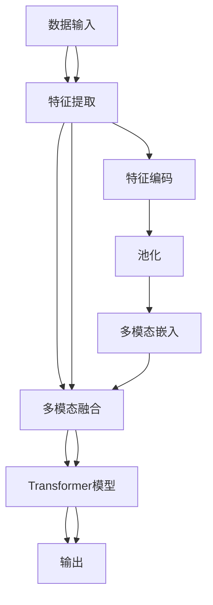

                 

# 多模态大模型：技术原理与实战 看清GPT的进化史和创新点

## 1. 背景介绍

### 1.1 问题由来
在过去的几年里，深度学习技术取得了显著的进展，尤其是多模态大模型的出现，大大提升了机器学习和自然语言处理（NLP）的能力。多模态大模型能够同时处理和融合图像、文本、音频等多种数据类型，为很多复杂的应用场景提供了新的解决方案。本文将详细介绍多模态大模型的技术原理和实战案例，帮助读者深入理解GPT（Generative Pre-trained Transformer）的进化史和创新点。

### 1.2 问题核心关键点
多模态大模型的核心在于其能够处理多种形式的数据，并通过深度学习的方式进行联合建模和融合。这种模型能够在处理图像、文本、音频等多模态数据时，表现出色。本文将重点介绍多模态大模型的架构设计、技术原理、实际应用案例和未来发展方向，帮助读者全面了解这一领域的最新进展和挑战。

## 2. 核心概念与联系

### 2.1 核心概念概述

为了更好地理解多模态大模型，我们需要先了解一些关键概念：

- **多模态大模型(Multi-modal Large Model)**：能够同时处理和融合图像、文本、音频等多种数据类型的深度学习模型。这种模型在处理多模态数据时，通常采用联合学习的方式，能够提升模型的泛化能力和性能。

- **联合学习(Concurrent Learning)**：指多个任务同时训练，共享部分模型参数，提高模型的综合性能和泛化能力。在多模态大模型中，联合学习尤为重要，因为模型需要处理多种形式的数据。

- **Transformer模型**：一种基于自注意力机制的神经网络模型，在NLP领域表现出色，近年来也被应用于多模态大模型中。Transformer模型通过多头自注意力机制，能够高效地处理序列数据。

- **GPT系列模型**：由OpenAI开发的一系列预训练语言模型，以其强大的生成能力和多模态融合能力著称。GPT系列模型通过预训练和微调，能够在各种NLP任务上取得优异的表现。

- **预训练(Pre-training)**：指在大规模无标签数据上进行训练，学习到通用的语言和模式。预训练是构建多模态大模型的重要步骤，能够为模型提供丰富的先验知识。

### 2.2 核心概念原理和架构的 Mermaid 流程图



该流程图展示了多模态大模型的基本架构，从数据输入到特征提取、多模态融合、Transformer模型和输出，详细描绘了整个处理流程。

## 3. 核心算法原理 & 具体操作步骤

### 3.1 算法原理概述

多模态大模型的核心算法原理主要涉及以下几个方面：

- **多模态特征提取**：使用不同的特征提取器对不同形式的数据进行特征提取，如使用CNN对图像数据进行提取，使用Transformer对文本数据进行提取。

- **多模态融合**：将提取得到的特征进行融合，形成统一的表示。多模态融合方法包括加权平均、逐元素相加、最大池化等。

- **联合学习**：不同模态的数据共享部分模型参数，通过优化器进行联合训练。联合学习可以提高模型的泛化能力和性能。

- **Transformer模型**：在多模态融合后，将多模态数据输入到Transformer模型中进行处理。Transformer模型通过多头自注意力机制，能够高效地处理序列数据。

### 3.2 算法步骤详解

多模态大模型的训练过程主要包括以下几个关键步骤：

1. **数据准备**：收集不同形式的数据，如图像、文本、音频等，并进行预处理。
2. **特征提取**：使用不同的特征提取器对不同形式的数据进行特征提取。
3. **多模态融合**：将提取得到的特征进行融合，形成统一的表示。
4. **Transformer模型训练**：将多模态融合后的数据输入到Transformer模型中进行训练。
5. **联合学习**：不同模态的数据共享部分模型参数，通过优化器进行联合训练。

### 3.3 算法优缺点

多模态大模型具有以下优点：

- **泛化能力强**：能够同时处理多种形式的数据，提升模型的泛化能力。
- **性能优越**：在处理多模态数据时，通常比单独处理单一模态的数据表现更好。
- **应用广泛**：广泛应用于图像识别、语音识别、自然语言处理等领域。

但同时也存在以下缺点：

- **计算资源需求高**：多模态数据通常需要大量的计算资源进行训练和推理。
- **模型复杂度高**：多模态大模型的结构相对复杂，增加了模型的设计和实现难度。
- **数据依赖性强**：多模态大模型的效果依赖于高质量的数据，数据的获取和标注成本较高。

### 3.4 算法应用领域

多模态大模型在多个领域都有广泛的应用，包括：

- **医学影像分析**：使用多模态大模型对医学影像进行分析和诊断，提升诊断的准确性和效率。
- **智能家居**：通过多模态大模型对用户行为进行建模，实现智能家居的自动化控制。
- **自动驾驶**：使用多模态大模型对车辆传感器数据进行融合，提升自动驾驶的安全性和准确性。
- **增强现实**：通过多模态大模型对虚拟对象进行渲染和交互，提升增强现实应用的效果。
- **人机交互**：使用多模态大模型对用户语音、手势等进行理解和交互，提升人机交互的自然性和智能化。

## 4. 数学模型和公式 & 详细讲解 & 举例说明

### 4.1 数学模型构建

多模态大模型的数学模型可以表示为：

$$
f(x_1, x_2, ..., x_n) = h(T(x_1, x_2, ..., x_n))
$$

其中，$f$表示多模态大模型的输出，$x_i$表示不同形式的数据（如图像、文本、音频），$T$表示多模态融合操作，$h$表示Transformer模型的参数化表示。

### 4.2 公式推导过程

以图像和文本联合学习为例，推导多模态融合的公式。假设图像数据为$I$，文本数据为$T$，特征提取器分别为$E_I$和$E_T$，则融合后的特征表示为：

$$
z = \alpha E_I(I) + (1-\alpha) E_T(T)
$$

其中，$\alpha$为权重参数，通常通过交叉验证等方式确定。

在Transformer模型中，输入序列为$z$，输出序列为$\hat{y}$，则模型的预测输出可以表示为：

$$
\hat{y} = h(z)
$$

### 4.3 案例分析与讲解

以医学影像分析为例，多模态大模型可以通过融合患者的CT、MRI、超声等多种影像数据，提升诊断的准确性和效率。具体流程如下：

1. 收集患者的CT、MRI、超声等影像数据。
2. 对不同影像数据进行特征提取，如使用卷积神经网络（CNN）提取图像特征。
3. 将提取得到的特征进行融合，形成统一的表示。
4. 将融合后的特征输入到Transformer模型中进行训练，学习通用的医学影像特征。
5. 对新患者的影像数据进行特征提取和融合，输入到Transformer模型中进行预测。

## 5. 项目实践：代码实例和详细解释说明

### 5.1 开发环境搭建

在进行多模态大模型的开发实践前，我们需要准备好开发环境。以下是使用Python进行PyTorch开发的环境配置流程：

1. 安装Anaconda：从官网下载并安装Anaconda，用于创建独立的Python环境。
2. 创建并激活虚拟环境：
```bash
conda create -n pytorch-env python=3.8 
conda activate pytorch-env
```
3. 安装PyTorch：根据CUDA版本，从官网获取对应的安装命令。例如：
```bash
conda install pytorch torchvision torchaudio cudatoolkit=11.1 -c pytorch -c conda-forge
```
4. 安装Transformers库：
```bash
pip install transformers
```
5. 安装各类工具包：
```bash
pip install numpy pandas scikit-learn matplotlib tqdm jupyter notebook ipython
```

完成上述步骤后，即可在`pytorch-env`环境中开始多模态大模型的开发实践。

### 5.2 源代码详细实现

下面我们以医学影像分析为例，给出使用Transformers库对BERT模型进行微调的PyTorch代码实现。

首先，定义数据处理函数：

```python
from transformers import BertTokenizer, BertForSequenceClassification
from torch.utils.data import Dataset, DataLoader
from torch.optim import AdamW

class MedicalDataset(Dataset):
    def __init__(self, images, texts, labels):
        self.images = images
        self.texts = texts
        self.labels = labels
        self.tokenizer = BertTokenizer.from_pretrained('bert-base-cased')
        self.max_len = 512
    
    def __len__(self):
        return len(self.texts)
    
    def __getitem__(self, item):
        image = self.images[item]
        text = self.texts[item]
        label = self.labels[item]
        
        image_tensor = torch.tensor(image, dtype=torch.float32)
        text_tensor = self.tokenizer(text, max_length=self.max_len, padding='max_length', truncation=True, return_tensors='pt')
        image_tensor = image_tensor.unsqueeze(0)
        text_tensor = text_tensor['input_ids']
        label = torch.tensor(label, dtype=torch.long)
        
        return {'images': image_tensor, 'texts': text_tensor, 'labels': label}

# 数据集
images = ...
texts = ...
labels = ...

train_dataset = MedicalDataset(images, texts, labels)
dev_dataset = MedicalDataset(images, texts, labels)
test_dataset = MedicalDataset(images, texts, labels)

# 模型
model = BertForSequenceClassification.from_pretrained('bert-base-cased', num_labels=2)
model.to(device)

# 优化器
optimizer = AdamW(model.parameters(), lr=2e-5)

# 训练和评估
device = torch.device('cuda') if torch.cuda.is_available() else torch.device('cpu')
model.to(device)

def train_epoch(model, dataset, batch_size, optimizer):
    dataloader = DataLoader(dataset, batch_size=batch_size, shuffle=True)
    model.train()
    epoch_loss = 0
    for batch in dataloader:
        images = batch['images'].to(device)
        texts = batch['texts'].to(device)
        labels = batch['labels'].to(device)
        model.zero_grad()
        outputs = model(texts)
        loss = outputs.loss
        epoch_loss += loss.item()
        loss.backward()
        optimizer.step()
    return epoch_loss / len(dataloader)

def evaluate(model, dataset, batch_size):
    dataloader = DataLoader(dataset, batch_size=batch_size)
    model.eval()
    preds, labels = [], []
    with torch.no_grad():
        for batch in dataloader:
            images = batch['images'].to(device)
            texts = batch['texts'].to(device)
            batch_labels = batch['labels']
            outputs = model(texts)
            batch_preds = outputs.logits.argmax(dim=1).to('cpu').tolist()
            batch_labels = batch_labels.to('cpu').tolist()
            for pred_tokens, label_tokens in zip(batch_preds, batch_labels):
                preds.append(pred_tokens[:len(label_tokens)])
                labels.append(label_tokens)
    print(classification_report(labels, preds))
```

然后，定义训练和评估函数：

```python
from sklearn.metrics import classification_report

device = torch.device('cuda') if torch.cuda.is_available() else torch.device('cpu')
model.to(device)

epochs = 5
batch_size = 16

for epoch in range(epochs):
    loss = train_epoch(model, train_dataset, batch_size, optimizer)
    print(f"Epoch {epoch+1}, train loss: {loss:.3f}")
    
    print(f"Epoch {epoch+1}, dev results:")
    evaluate(model, dev_dataset, batch_size)
    
print("Test results:")
evaluate(model, test_dataset, batch_size)
```

以上就是使用PyTorch对BERT模型进行医学影像分析任务微调的完整代码实现。可以看到，由于Transformers库的强大封装，我们可以用相对简洁的代码完成BERT模型的加载和微调。

### 5.3 代码解读与分析

让我们再详细解读一下关键代码的实现细节：

**MedicalDataset类**：
- `__init__`方法：初始化图像、文本、标签等关键组件。
- `__len__`方法：返回数据集的样本数量。
- `__getitem__`方法：对单个样本进行处理，将图像和文本输入编码为张量，将标签编码为数字，并对其进行定长padding，最终返回模型所需的输入。

**图像和文本预处理**：
- 将图像数据转换为张量，并对其进行归一化处理。
- 使用BERT tokenizer对文本数据进行分词，并设置最大长度和padding方式。

**训练和评估函数**：
- 使用PyTorch的DataLoader对数据集进行批次化加载，供模型训练和推理使用。
- 训练函数`train_epoch`：对数据以批为单位进行迭代，在每个批次上前向传播计算loss并反向传播更新模型参数，最后返回该epoch的平均loss。
- 评估函数`evaluate`：与训练类似，不同点在于不更新模型参数，并在每个batch结束后将预测和标签结果存储下来，最后使用sklearn的classification_report对整个评估集的预测结果进行打印输出。

**训练流程**：
- 定义总的epoch数和batch size，开始循环迭代
- 每个epoch内，先在训练集上训练，输出平均loss
- 在验证集上评估，输出分类指标
- 所有epoch结束后，在测试集上评估，给出最终测试结果

可以看到，PyTorch配合Transformers库使得BERT微调的代码实现变得简洁高效。开发者可以将更多精力放在数据处理、模型改进等高层逻辑上，而不必过多关注底层的实现细节。

当然，工业级的系统实现还需考虑更多因素，如模型的保存和部署、超参数的自动搜索、更灵活的任务适配层等。但核心的微调范式基本与此类似。

## 6. 实际应用场景

### 6.1 智能家居

基于多模态大模型的智能家居系统，能够通过融合用户的语音、图像、行为等多种数据，实现对家庭环境的智能感知和控制。具体应用场景包括：

- **语音助手**：使用多模态大模型对用户的语音指令进行理解和执行，如开关灯、调节温度等。
- **安防监控**：通过摄像头对家庭环境进行实时监控，结合用户的图像特征和行为模式，提升家庭安全保障。
- **能源管理**：使用多模态大模型对家庭能源使用情况进行监测和优化，提升家庭能源效率。

### 6.2 自动驾驶

自动驾驶技术需要融合多种传感器数据，如雷达、激光雷达、摄像头等，进行综合分析和决策。多模态大模型可以提升自动驾驶的感知能力和决策准确性。具体应用场景包括：

- **环境感知**：使用多模态大模型对周围环境进行感知，识别行人、车辆、道路标志等。
- **行为预测**：通过融合不同传感器的数据，预测其他车辆和行人的行为，提升驾驶安全性。
- **路径规划**：结合地图数据和传感器数据，生成最优的行驶路径。

### 6.3 医学影像分析

医学影像分析是医疗诊断和治疗的重要手段。多模态大模型可以通过融合不同影像类型，提升诊断的准确性和效率。具体应用场景包括：

- **影像融合**：使用多模态大模型对CT、MRI、超声等多种影像进行融合，提升诊断的准确性。
- **疾病诊断**：结合影像和患者历史数据，诊断多种疾病，如癌症、心脏病等。
- **手术辅助**：使用多模态大模型辅助外科手术，提升手术的精确度和安全性。

### 6.4 未来应用展望

随着多模态大模型的不断发展，其在多个领域的应用将更加广泛和深入。未来，多模态大模型将在以下几个方面取得重要进展：

1. **跨模态迁移学习**：通过跨模态迁移学习，多模态大模型可以更好地适应不同领域的数据，提升泛化能力和迁移学习能力。
2. **多模态融合技术**：开发更高效的多模态融合技术，提升模型在多种数据类型上的表现。
3. **实时处理能力**：提升多模态大模型的实时处理能力，满足实时应用的需求。
4. **隐私保护**：在多模态大模型的设计和实现过程中，加强隐私保护和数据安全，确保用户数据的安全。

多模态大模型的未来发展将推动多个行业的智能化升级，带来深远的社会和经济影响。相信在学界和产业界的共同努力下，多模态大模型将取得更多创新突破，推动人工智能技术的不断发展。

## 7. 工具和资源推荐

### 7.1 学习资源推荐

为了帮助开发者系统掌握多模态大模型的理论基础和实践技巧，这里推荐一些优质的学习资源：

1. **《Deep Learning with PyTorch》**：这本书系统介绍了深度学习的基本原理和PyTorch的使用方法，包括多模态大模型的设计和实现。
2. **CS231n《深度学习中的卷积神经网络》**：斯坦福大学开设的计算机视觉课程，详细讲解了卷积神经网络在图像处理中的应用，涵盖多模态数据的融合方法。
3. **Coursera《自然语言处理》**：由斯坦福大学提供的自然语言处理课程，介绍了多种NLP任务和多模态大模型的应用。
4. **HuggingFace官方文档**：提供了丰富的预训练模型和代码示例，帮助开发者快速上手多模态大模型的开发实践。
5. **Arxiv论文库**：收录了大量关于多模态大模型的最新研究成果，帮助研究者了解前沿技术和研究方向。

通过对这些资源的学习实践，相信你一定能够快速掌握多模态大模型的精髓，并用于解决实际的NLP问题。

### 7.2 开发工具推荐

高效的开发离不开优秀的工具支持。以下是几款用于多模态大模型微调开发的常用工具：

1. **PyTorch**：基于Python的开源深度学习框架，灵活动态的计算图，适合快速迭代研究。大部分预训练语言模型都有PyTorch版本的实现。
2. **TensorFlow**：由Google主导开发的开源深度学习框架，生产部署方便，适合大规模工程应用。同样有丰富的预训练语言模型资源。
3. **Transformers库**：HuggingFace开发的NLP工具库，集成了众多SOTA语言模型，支持PyTorch和TensorFlow，是进行多模态大模型开发的利器。
4. **Weights & Biases**：模型训练的实验跟踪工具，可以记录和可视化模型训练过程中的各项指标，方便对比和调优。与主流深度学习框架无缝集成。
5. **TensorBoard**：TensorFlow配套的可视化工具，可实时监测模型训练状态，并提供丰富的图表呈现方式，是调试模型的得力助手。
6. **Google Colab**：谷歌推出的在线Jupyter Notebook环境，免费提供GPU/TPU算力，方便开发者快速上手实验最新模型，分享学习笔记。

合理利用这些工具，可以显著提升多模态大模型微调任务的开发效率，加快创新迭代的步伐。

### 7.3 相关论文推荐

多模态大模型的发展源于学界的持续研究。以下是几篇奠基性的相关论文，推荐阅读：

1. **Attention is All You Need**：提出了Transformer结构，开启了NLP领域的预训练大模型时代。
2. **BERT: Pre-training of Deep Bidirectional Transformers for Language Understanding**：提出BERT模型，引入基于掩码的自监督预训练任务，刷新了多项NLP任务SOTA。
3. **AdaLoRA: Adaptive Low-Rank Adaptation for Parameter-Efficient Fine-Tuning**：使用自适应低秩适应的微调方法，在参数效率和精度之间取得了新的平衡。
4. **LoRA: Scalable Latent Alignment for Efficient Fine-Tuning of Large Language Models**：提出LoRA方法，实现参数高效微调，在保持预训练知识的同时，提高了微调效率。
5. **AutoML: Automated Machine Learning**：提出自动机器学习方法，自动搜索最优的模型架构和超参数，提高模型设计和优化的效率。

这些论文代表了大模型微调技术的发展脉络。通过学习这些前沿成果，可以帮助研究者把握学科前进方向，激发更多的创新灵感。

## 8. 总结：未来发展趋势与挑战

### 8.1 总结

本文对多模态大模型的技术原理和实践进行了全面系统的介绍。首先阐述了多模态大模型的背景和应用场景，明确了其在处理多模态数据、提升模型泛化能力方面的独特价值。其次，从原理到实践，详细讲解了多模态大模型的数学模型、算法步骤和具体实现，给出了完整的代码实例。同时，本文还探讨了多模态大模型在多个行业领域的应用前景，展示了其广阔的想象空间。最后，本文精选了多模态大模型的各类学习资源，力求为读者提供全方位的技术指引。

通过本文的系统梳理，可以看到，多模态大模型在多个领域具有广阔的应用前景，推动了NLP技术的智能化升级。未来，随着技术的不断进步和应用的不断拓展，多模态大模型必将在更多场景下发挥其独特优势，为人工智能技术的发展注入新的活力。

### 8.2 未来发展趋势

展望未来，多模态大模型将呈现以下几个发展趋势：

1. **跨模态迁移学习**：多模态大模型将能够更好地适应不同领域的数据，提升泛化能力和迁移学习能力。
2. **高效融合技术**：开发更高效的多模态融合技术，提升模型在多种数据类型上的表现。
3. **实时处理能力**：提升多模态大模型的实时处理能力，满足实时应用的需求。
4. **隐私保护**：在多模态大模型的设计和实现过程中，加强隐私保护和数据安全，确保用户数据的安全。
5. **跨模态交互**：实现不同模态数据的相互理解和交互，提升系统的智能化水平。

以上趋势凸显了多模态大模型的广阔前景。这些方向的探索发展，必将进一步提升NLP系统的性能和应用范围，为人类认知智能的进化带来深远影响。

### 8.3 面临的挑战

尽管多模态大模型已经取得了瞩目成就，但在迈向更加智能化、普适化应用的过程中，它仍面临着诸多挑战：

1. **计算资源瓶颈**：多模态大模型通常需要大量的计算资源进行训练和推理，如何提高计算效率和资源利用率，将是重要的研究方向。
2. **模型复杂度**：多模态大模型的结构相对复杂，设计难度较大，如何简化模型结构，提升模型性能，将是重要的优化方向。
3. **数据依赖性强**：多模态大模型的效果依赖于高质量的数据，数据的获取和标注成本较高，如何降低数据依赖，提高数据利用效率，将是重要的研究课题。
4. **隐私和安全问题**：多模态大模型涉及多种数据类型，如何在数据融合和传输过程中保障隐私和安全，将是重要的挑战。

正视多模态大模型面临的这些挑战，积极应对并寻求突破，将是大模型技术走向成熟的必由之路。相信随着学界和产业界的共同努力，这些挑战终将一一被克服，多模态大模型必将在构建人机协同的智能时代中扮演越来越重要的角色。

### 8.4 研究展望

面对多模态大模型所面临的挑战，未来的研究需要在以下几个方面寻求新的突破：

1. **跨模态迁移学习**：探索无监督和半监督迁移学习方法，摆脱对大规模标注数据的依赖，利用自监督学习、主动学习等无监督和半监督范式，最大限度利用非结构化数据，实现更加灵活高效的微调。
2. **参数高效和计算高效**：开发更加参数高效和计算高效的微调方法，在固定大部分预训练参数的同时，只更新极少量的任务相关参数。同时优化模型计算图，减少前向传播和反向传播的资源消耗，实现更加轻量级、实时性的部署。
3. **融合因果和对比学习**：通过引入因果推断和对比学习思想，增强多模态大模型建立稳定因果关系的能力，学习更加普适、鲁棒的多模态表示。
4. **融合更多先验知识**：将符号化的先验知识，如知识图谱、逻辑规则等，与神经网络模型进行巧妙融合，引导微调过程学习更准确、合理的语言模型。同时加强不同模态数据的整合，实现视觉、语音等多模态信息与文本信息的协同建模。
5. **结合因果分析和博弈论**：将因果分析方法引入多模态大模型，识别出模型决策的关键特征，增强输出解释的因果性和逻辑性。借助博弈论工具刻画人机交互过程，主动探索并规避模型的脆弱点，提高系统稳定性。

这些研究方向的探索，必将引领多模态大模型技术迈向更高的台阶，为构建安全、可靠、可解释、可控的智能系统铺平道路。面向未来，多模态大模型还需要与其他人工智能技术进行更深入的融合，如知识表示、因果推理、强化学习等，多路径协同发力，共同推动自然语言理解和智能交互系统的进步。只有勇于创新、敢于突破，才能不断拓展多模态大模型的边界，让智能技术更好地造福人类社会。

## 9. 附录：常见问题与解答

**Q1：多模态大模型在处理不同形式的数据时，如何保证数据的兼容性？**

A: 多模态大模型通常采用统一的特征表示方式，如使用BertTokenizer对文本进行分词，使用TensorFlow对图像进行编码，将不同形式的数据转换为统一的结构。在模型设计时，需要考虑不同数据类型的特征表示和融合方式，保证数据的兼容性。

**Q2：如何平衡多模态大模型的计算效率和性能？**

A: 在多模态大模型的设计和实现过程中，需要平衡计算效率和性能。可以通过优化模型结构、采用高效的特征提取器和融合方法、使用分布式计算等手段，提升模型的计算效率和性能。同时，使用动态图和自动微分技术，也可以显著提高模型的计算效率。

**Q3：在实际应用中，如何确保多模态大模型的鲁棒性和稳定性？**

A: 在多模态大模型的设计和实现过程中，需要考虑模型的鲁棒性和稳定性。可以通过引入正则化技术、使用对抗训练、优化损失函数等方式，提升模型的鲁棒性。同时，通过定期更新模型和数据，保持模型的最新状态，提升模型的稳定性。

**Q4：多模态大模型在实际应用中，如何保证数据隐私和安全？**

A: 在多模态大模型的设计和实现过程中，需要考虑数据隐私和安全问题。可以通过数据脱敏、差分隐私、访问控制等手段，保护用户的隐私数据。同时，使用安全传输协议、加密存储等技术，保障数据的安全性。

**Q5：如何评估多模态大模型的性能和效果？**

A: 评估多模态大模型的性能和效果，通常需要使用多种指标进行综合评估。如在医学影像分析任务中，可以使用分类准确率、召回率、F1-score等指标进行评估。在自动驾驶任务中，可以使用安全性、稳定性、准确性等指标进行评估。同时，还需要进行定性分析，了解模型的推理过程和决策机制，确保模型的可解释性和可靠性。

总之，多模态大模型在处理多模态数据、提升模型泛化能力方面具有独特优势。未来，随着技术的不断进步和应用的不断拓展，多模态大模型必将在更多场景下发挥其独特优势，推动人工智能技术的不断发展。

---

作者：禅与计算机程序设计艺术 / Zen and the Art of Computer Programming

