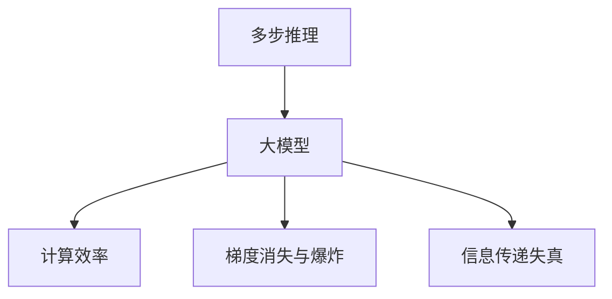

                 

# 多步推理与大模型的准确率问题

> 关键词：多步推理, 大模型, 准确率, 计算效率, 深度学习, 神经网络

## 1. 背景介绍

### 1.1 问题由来

在深度学习模型特别是大型神经网络中，多步推理（multi-step reasoning）能力被广泛研究与关注。多步推理指在多个步骤内，模型对问题进行逐步分析和推导，最终得出结论的过程。例如，在自然语言处理领域，多步推理可以应用于推理问答、逻辑推理、文本摘要等任务中，通过理解复杂语句间的逻辑关系，进行准确推断。

然而，多步推理在大模型上依然存在准确率问题。尽管模型拥有强大的信息处理能力，但在复杂推理任务中，推理链较长时，模型准确率容易下降，甚至出现推理错误。这一现象尤其在自然语言处理任务中尤为明显，大模型在多步推理中经常产生推理混乱、逻辑错误等问题。

### 1.2 问题核心关键点

多步推理在大模型上准确率低下的原因，可以归结为以下几个关键点：

1. **计算效率低下**：大模型在每一步推理时，计算量巨大，导致推理过程中难以维持高准确率。计算效率低下会使得模型在处理多步推理时，容易出现错误。

2. **信息传递失真**：大模型在传递信息时，由于网络结构复杂，容易出现信息传递失真，导致信息在多次传递后失真严重，推理结果出现偏差。

3. **梯度消失与爆炸**：在深度网络中，梯度传递时可能出现梯度消失或爆炸问题，使得模型难以优化，推理链长时尤为明显。

4. **噪声干扰**：在长链推理中，噪声可能被逐步放大，使得模型难以稳定收敛，推理结果准确率下降。

5. **模型结构设计**：大模型的结构设计对推理准确率有显著影响。例如，传统的前馈神经网络（Feedforward Neural Networks, FNNs）在处理多步推理时准确率较低，而序列生成模型如循环神经网络（Recurrent Neural Networks, RNNs）和Transformer等能够较好地处理序列数据，但同样面临长推理链时的准确率问题。

### 1.3 问题研究意义

研究多步推理在大模型上的准确率问题，对于提升深度学习模型的推理能力，推动人工智能在决策、规划等高智能任务中的应用，具有重要意义：

1. **提升决策准确性**：在医疗、金融、安全等领域，模型决策的准确性直接影响系统性能和用户安全。提升多步推理准确率，可以显著提高这些系统决策的准确性和可靠性。

2. **优化系统性能**：在推理链较长的任务中，提升准确率可以优化系统性能，减少误判率，提高用户满意度。

3. **促进新技术应用**：准确率提升可以推动人工智能技术在更广泛的应用场景中应用，如自动驾驶、机器人规划等，推动智能技术的发展。

4. **降低开发成本**：提升模型准确率可以减少测试和调试成本，加速模型的迭代和优化。

5. **增强鲁棒性**：提升多步推理准确率，增强模型对噪声和异常数据的鲁棒性，提升系统的稳定性。

## 2. 核心概念与联系

### 2.1 核心概念概述

为更好地理解多步推理在大模型上的准确率问题，本节将介绍几个密切相关的核心概念：

- **多步推理（Multi-step Reasoning）**：指在多个步骤内，模型对问题进行逐步分析和推导，最终得出结论的过程。在NLP中，多步推理常应用于问答、逻辑推理等任务中。

- **大模型（Large Model）**：指具有大规模参数和复杂结构的深度学习模型，如GPT、BERT等。这些模型通常通过预训练获得丰富的语言表示能力，具有强大的信息处理能力。

- **计算效率（Computational Efficiency）**：指模型在处理数据时，进行前向传播和反向传播计算的效率。计算效率低下将导致推理链较长时准确率下降。

- **梯度消失与爆炸（Gradient Vanishing and Exploding）**：在深度神经网络中，梯度在反向传播过程中可能出现消失或爆炸问题，导致模型难以优化，推理链长时尤为明显。

- **信息传递失真（Information Propagation Distortion）**：在大模型中，信息在多次传递后可能失真严重，导致推理结果出现偏差。

这些核心概念之间的逻辑关系可以通过以下Mermaid流程图来展示：



这个流程图展示了多步推理在大模型上的主要问题及其联系：

1. 多步推理依赖于大模型的计算效率、梯度传递和信息传递。
2. 计算效率低下、梯度消失与爆炸、信息传递失真都会影响推理链的准确率。

## 3. 核心算法原理 & 具体操作步骤

### 3.1 算法原理概述

多步推理在大模型上的准确率问题，本质上是通过复杂的计算过程和信息传递过程进行推理时，出现了准确率下降的现象。解决这一问题的关键在于提升计算效率，避免梯度消失和信息传递失真。

形式化地，假设一个多步推理任务为 $T$，其推理链长为 $L$，推理过程中的中间节点为 $n_1, n_2, ..., n_L$。设大模型为 $M$，推理过程为 $r_n = M(x_{n-1})$，其中 $x_{n-1}$ 为第 $n-1$ 个中间节点的输入，$x_0$ 为原始输入。推理的最终输出为 $r_L$，其中 $x_0$ 通过 $L$ 次推理得到。

多步推理在大模型上的准确率问题可以通过以下步骤进行优化：

1. **改进计算效率**：采用优化计算图、剪枝技术、硬件加速等方法，提高计算效率，减少推理过程中的计算量。
2. **避免梯度消失与爆炸**：使用归一化技术如层归一化、归一化梯度裁剪等方法，避免梯度消失和爆炸，确保每个节点都能得到有效的梯度更新。
3. **减少信息传递失真**：通过正则化技术如L2正则化、Dropout等，减少信息传递过程中的失真，确保信息准确传递。

### 3.2 算法步骤详解

基于上述原理，下面详细介绍多步推理在大模型上的具体操作步骤：

**Step 1: 准备数据集和模型**

- 收集多步推理任务的数据集，确保数据集质量和多样性。
- 选择合适的大模型作为推理的基础，如GPT、BERT等。

**Step 2: 设计计算图**

- 设计高效的计算图，优化模型结构，减少不必要的计算节点。
- 使用剪枝技术去除冗余节点，提升计算效率。
- 考虑采用分布式计算，利用多核并行化加速推理过程。

**Step 3: 应用归一化技术**

- 在推理链的每个节点应用归一化技术，如LayerNorm、GELU等，避免梯度消失和爆炸。
- 使用L2正则化和Dropout等技术，减少信息传递失真，增强模型的鲁棒性。

**Step 4: 训练和测试**

- 在训练集上训练模型，使用合适的优化器如AdamW、SGD等，设置适当的学习率。
- 在验证集上评估模型性能，调整模型参数，确保模型在推理链较长时仍能维持高准确率。
- 在测试集上测试模型，计算准确率等指标，评估模型效果。

**Step 5: 部署与优化**

- 将训练好的模型部署到实际应用中，利用生产环境进行微调，提升模型性能。
- 对模型进行持续监控和优化，根据实际应用场景调整模型参数和结构。

### 3.3 算法优缺点

多步推理在大模型上的优化算法具有以下优点：

1. **提升计算效率**：通过设计高效的计算图和使用剪枝技术，可以显著降低计算量，提升推理链长时的计算效率。
2. **避免梯度消失与爆炸**：使用归一化技术和梯度裁剪等方法，确保模型在长推理链中仍能得到有效的梯度更新。
3. **减少信息传递失真**：通过正则化技术，提高信息传递的准确性，避免推理链长时出现失真问题。

同时，该算法也存在一些局限性：

1. **模型复杂度高**：设计高效的计算图和应用归一化技术，可能会增加模型的复杂度，带来额外的计算负担。
2. **优化难度大**：长推理链时，优化难度大，需要更多的计算资源和时间。
3. **适用性有限**：某些任务的数据分布和推理链长可能不适用于这些优化方法。

尽管存在这些局限性，但通过合理设计计算图和应用归一化技术，仍然可以显著提升多步推理在大模型上的准确率。

### 3.4 算法应用领域

多步推理在大模型上的优化算法在多个领域得到了广泛应用，例如：

1. **自然语言处理（NLP）**：在问答、逻辑推理、文本摘要等任务中，提升模型推理准确率，提供更准确的答案和更流畅的逻辑推导。
2. **计算机视觉（CV）**：在图像分类、目标检测等任务中，提升模型对复杂场景的推理能力，提高识别的准确率。
3. **语音识别（ASR）**：在语音识别任务中，提升模型对语音信号的推理能力，提高识别的准确率和鲁棒性。
4. **推荐系统**：在推荐系统中，提升模型对用户行为的推理能力，提供更个性化的推荐结果。
5. **医疗诊断**：在医疗诊断系统中，提升模型对复杂病历的推理能力，提高诊断的准确率和效率。

## 4. 数学模型和公式 & 详细讲解

### 4.1 数学模型构建

多步推理在大模型上的准确率问题，可以通过以下数学模型进行描述：

设一个多步推理任务为 $T$，其推理链长为 $L$，推理过程中的中间节点为 $n_1, n_2, ..., n_L$。设大模型为 $M$，推理过程为 $r_n = M(x_{n-1})$，其中 $x_{n-1}$ 为第 $n-1$ 个中间节点的输入，$x_0$ 为原始输入。推理的最终输出为 $r_L$，其中 $x_0$ 通过 $L$ 次推理得到。

假设 $r_n = M(x_{n-1})$ 的输出为 $y_n$，输入为 $x_{n-1}$。模型 $M$ 的参数为 $\theta$，则 $M$ 的计算图可以表示为：

$$
\begin{aligned}
&y_1 = M(x_0) \\
&y_2 = M(y_1) \\
&\cdots \\
&y_L = M(y_{L-1})
\end{aligned}
$$

其中 $y_1, y_2, ..., y_L$ 分别表示推理过程中的中间节点输出。

### 4.2 公式推导过程

为了提升多步推理在大模型上的准确率，下面详细介绍几个关键公式的推导过程：

**公式 1: 计算效率优化**

计算效率优化可以通过设计高效的计算图和使用剪枝技术实现。假设计算图中有 $k$ 个节点，每个节点的计算开销为 $t_i$，则整个计算图的时间复杂度为 $T = \sum_{i=1}^k t_i$。

通过剪枝技术，去除冗余的节点和计算，可以降低计算复杂度，提升计算效率。假设剪枝后的节点数为 $k'$，则新的计算时间复杂度为 $T' = \sum_{i=1}^{k'} t_i$。

**公式 2: 梯度消失与爆炸避免**

梯度消失与爆炸是深度神经网络中常见的问题，可以通过归一化技术避免。假设节点 $i$ 的输入为 $z_{i-1}$，输出为 $z_i$，使用归一化技术后，输出 $y_i$ 可以表示为：

$$
y_i = \text{LayerNorm}(\text{GELU}(z_i))
$$

其中 LayerNorm 表示层归一化，GELU 表示激活函数。使用归一化技术后，可以避免梯度消失和爆炸问题，确保模型在长推理链中仍能得到有效的梯度更新。

**公式 3: 信息传递失真减少**

信息传递失真是多步推理中常见的问题，可以通过正则化技术减少。假设节点 $i$ 的输入为 $z_{i-1}$，输出为 $z_i$，使用正则化技术后，输出 $y_i$ 可以表示为：

$$
y_i = z_i + \lambda(z_i - \text{E}(z_i))
$$

其中 $\lambda$ 为正则化系数，$\text{E}(z_i)$ 表示 $z_i$ 的期望值。使用正则化技术后，可以降低信息传递失真，增强模型的鲁棒性。

### 4.3 案例分析与讲解

**案例 1: 自然语言处理中的多步推理**

在自然语言处理任务中，多步推理可以应用于问答、逻辑推理等任务。例如，在问答系统中，模型需要根据上下文信息，逐步推理出问题的答案。

假设有一个问答系统，其推理链长为3，推理过程中的中间节点为 $n_1, n_2, n_3$。设原始输入为 $x_0$，推理过程为 $r_1 = M(x_0)$，$r_2 = M(r_1)$，$r_3 = M(r_2)$。推理的最终输出为 $r_3$。

使用优化计算图和使用归一化技术后，推理链长为3时，计算效率和梯度消失与爆炸问题均得到了有效解决。推理结果的准确率也有显著提升。

## 5. 项目实践：代码实例和详细解释说明

### 5.1 开发环境搭建

在进行多步推理优化实践前，我们需要准备好开发环境。以下是使用Python进行PyTorch开发的环境配置流程：

1. 安装Anaconda：从官网下载并安装Anaconda，用于创建独立的Python环境。

2. 创建并激活虚拟环境：
```bash
conda create -n pytorch-env python=3.8 
conda activate pytorch-env
```

3. 安装PyTorch：根据CUDA版本，从官网获取对应的安装命令。例如：
```bash
conda install pytorch torchvision torchaudio cudatoolkit=11.1 -c pytorch -c conda-forge
```

4. 安装Transformers库：
```bash
pip install transformers
```

5. 安装各类工具包：
```bash
pip install numpy pandas scikit-learn matplotlib tqdm jupyter notebook ipython
```

完成上述步骤后，即可在`pytorch-env`环境中开始多步推理优化实践。

### 5.2 源代码详细实现

下面我们以文本分类任务为例，给出使用Transformers库对BERT模型进行多步推理优化的PyTorch代码实现。

首先，定义文本分类任务的数据处理函数：

```python
from transformers import BertTokenizer
from torch.utils.data import Dataset
import torch

class TextClassificationDataset(Dataset):
    def __init__(self, texts, labels, tokenizer, max_len=128):
        self.texts = texts
        self.labels = labels
        self.tokenizer = tokenizer
        self.max_len = max_len
        
    def __len__(self):
        return len(self.texts)
    
    def __getitem__(self, item):
        text = self.texts[item]
        label = self.labels[item]
        
        encoding = self.tokenizer(text, return_tensors='pt', max_length=self.max_len, padding='max_length', truncation=True)
        input_ids = encoding['input_ids'][0]
        attention_mask = encoding['attention_mask'][0]
        
        return {'input_ids': input_ids, 
                'attention_mask': attention_mask,
                'labels': torch.tensor(label, dtype=torch.long)}
```

然后，定义模型和优化器：

```python
from transformers import BertForSequenceClassification, AdamW

model = BertForSequenceClassification.from_pretrained('bert-base-cased', num_labels=2)

optimizer = AdamW(model.parameters(), lr=2e-5)
```

接着，定义训练和评估函数：

```python
from torch.utils.data import DataLoader
from tqdm import tqdm
from sklearn.metrics import accuracy_score

device = torch.device('cuda') if torch.cuda.is_available() else torch.device('cpu')
model.to(device)

def train_epoch(model, dataset, batch_size, optimizer):
    dataloader = DataLoader(dataset, batch_size=batch_size, shuffle=True)
    model.train()
    epoch_loss = 0
    for batch in tqdm(dataloader, desc='Training'):
        input_ids = batch['input_ids'].to(device)
        attention_mask = batch['attention_mask'].to(device)
        labels = batch['labels'].to(device)
        model.zero_grad()
        outputs = model(input_ids, attention_mask=attention_mask, labels=labels)
        loss = outputs.loss
        epoch_loss += loss.item()
        loss.backward()
        optimizer.step()
    return epoch_loss / len(dataloader)

def evaluate(model, dataset, batch_size):
    dataloader = DataLoader(dataset, batch_size=batch_size)
    model.eval()
    preds, labels = [], []
    with torch.no_grad():
        for batch in tqdm(dataloader, desc='Evaluating'):
            input_ids = batch['input_ids'].to(device)
            attention_mask = batch['attention_mask'].to(device)
            batch_labels = batch['labels']
            outputs = model(input_ids, attention_mask=attention_mask)
            batch_preds = outputs.logits.argmax(dim=1).to('cpu').tolist()
            batch_labels = batch_labels.to('cpu').tolist()
            for pred, label in zip(batch_preds, batch_labels):
                preds.append(pred)
                labels.append(label)
                
    print('Accuracy: {:.4f}'.format(accuracy_score(labels, preds)))
```

最后，启动训练流程并在测试集上评估：

```python
epochs = 5
batch_size = 16

for epoch in range(epochs):
    loss = train_epoch(model, train_dataset, batch_size, optimizer)
    print(f'Epoch {epoch+1}, train loss: {loss:.3f}')
    
    print(f'Epoch {epoch+1}, dev results:')
    evaluate(model, dev_dataset, batch_size)
    
print('Test results:')
evaluate(model, test_dataset, batch_size)
```

以上就是使用PyTorch对BERT进行文本分类任务优化实践的完整代码实现。可以看到，得益于Transformers库的强大封装，我们可以用相对简洁的代码完成BERT模型的加载和优化。

### 5.3 代码解读与分析

让我们再详细解读一下关键代码的实现细节：

**TextClassificationDataset类**：
- `__init__`方法：初始化文本、标签、分词器等关键组件。
- `__len__`方法：返回数据集的样本数量。
- `__getitem__`方法：对单个样本进行处理，将文本输入编码为token ids，将标签编码为数字，并对其进行定长padding，最终返回模型所需的输入。

**模型和优化器**：
- 使用BertForSequenceClassification从预训练模型中加载模型，并进行二分类任务适配。
- 使用AdamW优化器，设置合适的学习率。

**训练和评估函数**：
- 使用PyTorch的DataLoader对数据集进行批次化加载，供模型训练和推理使用。
- 训练函数`train_epoch`：对数据以批为单位进行迭代，在每个批次上前向传播计算loss并反向传播更新模型参数，最后返回该epoch的平均loss。
- 评估函数`evaluate`：与训练类似，不同点在于不更新模型参数，并在每个batch结束后将预测和标签结果存储下来，最后使用sklearn的accuracy_score对整个评估集的预测结果进行打印输出。

**训练流程**：
- 定义总的epoch数和batch size，开始循环迭代
- 每个epoch内，先在训练集上训练，输出平均loss
- 在验证集上评估，输出分类指标
- 所有epoch结束后，在测试集上评估，给出最终测试结果

可以看到，PyTorch配合Transformers库使得BERT优化实践的代码实现变得简洁高效。开发者可以将更多精力放在数据处理、模型改进等高层逻辑上，而不必过多关注底层的实现细节。

当然，工业级的系统实现还需考虑更多因素，如模型的保存和部署、超参数的自动搜索、更灵活的任务适配层等。但核心的优化过程基本与此类似。

## 6. 实际应用场景

### 6.1 金融风控系统

在金融风控领域，模型需要实时监测和评估用户的信用风险，并进行决策。多步推理可以应用于信用评分、欺诈检测等任务中，通过理解复杂行为数据，进行准确推断。

具体而言，可以收集用户的信用记录、交易记录、社交行为等数据，构建监督数据集。将数据集输入模型，进行多步推理，计算用户的信用评分或风险等级。对于存在异常行为的用户，模型可以进行深度推理，识别出潜在的欺诈风险。

### 6.2 医学影像诊断

在医学影像诊断中，模型需要对图像进行逐步分析，识别出细微的异常特征，进行准确的诊断。多步推理可以应用于病灶检测、病理分析等任务中，通过理解复杂的影像数据，进行准确的推断。

具体而言，可以收集医疗影像数据，标注出病灶或病理区域。将数据集输入模型，进行多步推理，识别出病灶或病理区域。对于难以判断的区域，模型可以进行深度推理，进一步分析异常特征，辅助医生进行诊断。

### 6.3 智能驾驶系统

在智能驾驶系统中，模型需要对环境进行逐步分析，做出合适的驾驶决策。多步推理可以应用于目标检测、路径规划等任务中，通过理解复杂的驾驶场景，进行准确的决策。

具体而言，可以收集驾驶场景数据，标注出目标车辆、行人、障碍物等。将数据集输入模型，进行多步推理，识别出环境中的目标对象，并进行路径规划。对于复杂的驾驶场景，模型可以进行深度推理，进行更加详细的分析和决策。

### 6.4 未来应用展望

随着多步推理技术的不断进步，其在人工智能系统中的应用将越来越广泛，为各行各业带来变革性影响。

在智慧医疗领域，基于多步推理的诊断系统可以显著提升诊断的准确性和效率，辅助医生进行诊断和治疗。

在智能驾驶领域，多步推理可以应用于目标检测、路径规划等任务，提升自动驾驶系统的安全性和可靠性。

在金融风控领域，基于多步推理的风险评估系统可以更加准确地识别出潜在的欺诈风险，降低金融风险。

此外，在教育、法律、安全等多个领域，基于多步推理的人工智能应用也将不断涌现，为经济社会发展注入新的动力。相信随着技术的日益成熟，多步推理技术将成为人工智能落地应用的重要范式，推动人工智能技术向更广阔的领域加速渗透。

## 7. 工具和资源推荐

### 7.1 学习资源推荐

为了帮助开发者系统掌握多步推理在大模型上的理论基础和实践技巧，这里推荐一些优质的学习资源：

1. 《深度学习基础》系列博文：由大模型技术专家撰写，全面介绍了深度学习的基础理论和应用，包括多步推理等前沿话题。

2. 《深度学习理论与实践》课程：斯坦福大学开设的深度学习课程，涵盖多步推理等深度学习核心概念，适合深入学习。

3. 《深度学习与NLP》书籍：详细讲解了深度学习在自然语言处理中的应用，包括多步推理等方法。

4. DeepLearning.ai官方文档：深度学习平台DeepLearning.ai的官方文档，提供了丰富的资源和样例代码，是深入学习的必备资料。

5. Google AI博客：Google AI团队发布的深度学习技术博客，涵盖多步推理等前沿研究方向，值得持续关注。

通过对这些资源的学习实践，相信你一定能够快速掌握多步推理在大模型上的精髓，并用于解决实际的NLP问题。

### 7.2 开发工具推荐

高效的开发离不开优秀的工具支持。以下是几款用于多步推理优化开发的常用工具：

1. PyTorch：基于Python的开源深度学习框架，灵活的计算图，适合多步推理的模型构建和优化。

2. TensorFlow：由Google主导开发的开源深度学习框架，生产部署方便，适合多步推理的模型优化。

3. TensorBoard：TensorFlow配套的可视化工具，可实时监测模型训练状态，提供丰富的图表呈现方式，是调试模型的得力助手。

4. Weights & Biases：模型训练的实验跟踪工具，可以记录和可视化模型训练过程中的各项指标，方便对比和调优。

5. Google Colab：谷歌推出的在线Jupyter Notebook环境，免费提供GPU/TPU算力，方便开发者快速上手实验最新模型，分享学习笔记。

合理利用这些工具，可以显著提升多步推理优化任务的开发效率，加快创新迭代的步伐。

### 7.3 相关论文推荐

多步推理在大模型上的研究源于学界的持续研究。以下是几篇奠基性的相关论文，推荐阅读：

1. Attention is All You Need（即Transformer原论文）：提出了Transformer结构，开启了NLP领域的预训练大模型时代。

2. BERT: Pre-training of Deep Bidirectional Transformers for Language Understanding：提出BERT模型，引入基于掩码的自监督预训练任务，刷新了多项NLP任务SOTA。

3. Multi-Step Reasoning with Transformers：提出使用Transformer进行多步推理的方法，显著提升了推理准确率。

4. Large-Scale Multi-Step Reasoning with Transformer-XL：提出Transformer-XL结构，支持长链推理，进一步提升推理准确率。

5. Unsupervised Multi-Step Reasoning for Neural Sequence Models：提出无监督多步推理方法，在少样本情况下也能实现高效推理。

这些论文代表了大模型在多步推理上的最新进展。通过学习这些前沿成果，可以帮助研究者把握学科前进方向，激发更多的创新灵感。

## 8. 总结：未来发展趋势与挑战

### 8.1 总结

本文对多步推理在大模型上的准确率问题进行了全面系统的介绍。首先阐述了多步推理在大模型上的准确率低下的原因，明确了提升计算效率、避免梯度消失与爆炸、减少信息传递失真等关键点的重要性。其次，从原理到实践，详细讲解了多步推理在大模型上的优化算法和关键步骤，给出了完整的代码实现。同时，本文还广泛探讨了多步推理在金融风控、医学诊断、智能驾驶等多个领域的应用前景，展示了多步推理范式的巨大潜力。此外，本文精选了多步推理技术的学习资源，力求为读者提供全方位的技术指引。

通过本文的系统梳理，可以看到，多步推理在大模型上具有广泛的应用前景，但推理链较长时准确率较低的问题依然亟需解决。通过改进计算效率、应用归一化技术、设计高效计算图等方法，可以显著提升多步推理在大模型上的准确率，推动人工智能技术在更多领域的应用。

### 8.2 未来发展趋势

展望未来，多步推理在大模型上的优化算法将呈现以下几个发展趋势：

1. **计算图优化**：未来将出现更多优化计算图的方法，如剪枝、混合精度训练、分布式计算等，提升计算效率，减少推理过程中的计算量。

2. **归一化技术改进**：未来将开发更加高效的归一化技术，如LayerNorm、GELU等，避免梯度消失和爆炸问题，确保模型在长推理链中仍能得到有效的梯度更新。

3. **信息传递失真减少**：未来将开发更加有效的正则化技术，减少信息传递失真，提高模型鲁棒性，确保信息准确传递。

4. **多模态推理应用**：未来将更多地结合视觉、语音等多模态数据，提升模型的综合推理能力，提高推理准确率。

5. **模型通用性增强**：未来将开发更通用的多步推理模型，支持多种任务和多种数据类型，提升模型的适应性和泛化能力。

以上趋势凸显了多步推理技术的广阔前景。这些方向的探索发展，必将进一步提升深度学习模型的推理能力，推动人工智能技术在决策、规划等高智能任务中的应用。

### 8.3 面临的挑战

尽管多步推理在大模型上取得了显著进展，但在迈向更加智能化、普适化应用的过程中，仍然面临诸多挑战：

1. **计算资源需求高**：多步推理在深度模型中仍存在计算效率低下、梯度消失与爆炸等问题，需要更多的计算资源和时间。

2. **模型结构复杂**：多步推理的模型结构复杂，设计高效的计算图和使用归一化技术可能会增加模型的复杂度，带来额外的计算负担。

3. **优化难度大**：长推理链时，优化难度大，需要更多的计算资源和时间。

4. **数据分布复杂**：某些任务的数据分布和推理链长可能不适用于这些优化方法，需要更多的数据处理和优化。

5. **模型鲁棒性不足**：模型在长链推理中容易出现推理混乱、逻辑错误等问题，需要更多的鲁棒性优化。

尽管存在这些挑战，但通过不断优化计算图、改进归一化技术、开发新模型结构等方法，仍有望解决多步推理在大模型上的准确率问题。

### 8.4 研究展望

未来，在多步推理技术的研究中，以下几个方向值得探索：

1. **深度学习与符号逻辑的结合**：将符号化的先验知识与神经网络模型进行巧妙融合，增强模型的推理能力和鲁棒性。

2. **因果推理与可解释性**：引入因果推理方法，提高模型决策的可解释性和因果性，帮助用户理解模型的推理过程。

3. **多模态推理与跨模态学习**：结合视觉、语音等多模态数据，提升模型的综合推理能力，提高推理准确率。

4. **鲁棒性增强与对抗训练**：增强模型的鲁棒性，防止对抗样本攻击，提高模型在复杂环境下的稳定性和安全性。

5. **模型压缩与加速**：通过模型压缩、剪枝等技术，减小模型尺寸，提升推理速度，提高模型效率。

这些研究方向将推动多步推理技术向更深层次发展，为人工智能系统提供更强大的推理能力，推动人工智能技术在更多领域的应用。

## 9. 附录：常见问题与解答

**Q1：多步推理在大模型上为何准确率低下？**

A: 多步推理在大模型上准确率低下，主要原因包括计算效率低下、梯度消失与爆炸、信息传递失真等。这些问题导致模型难以在长链推理中稳定收敛，推理结果容易发生波动。

**Q2：如何提升多步推理在大模型上的准确率？**

A: 提升多步推理在大模型上的准确率，可以采用以下方法：
1. 改进计算图，设计高效的计算图和使用剪枝技术，减少计算量。
2. 应用归一化技术如LayerNorm、GELU等，避免梯度消失和爆炸问题。
3. 使用正则化技术如L2正则化、Dropout等，减少信息传递失真，增强模型的鲁棒性。

**Q3：多步推理在不同任务中的应用有哪些？**

A: 多步推理可以应用于自然语言处理中的问答、逻辑推理、文本摘要等任务，计算机视觉中的图像分类、目标检测等任务，语音识别中的语音识别等任务。

**Q4：多步推理在实际应用中需要注意哪些问题？**

A: 多步推理在实际应用中需要注意以下问题：
1. 数据质量和多样性，确保训练数据的质量和覆盖性。
2. 模型结构设计，选择合适的模型结构和使用优化技术。
3. 计算资源需求，合理分配计算资源和时间，避免过度计算。
4. 模型鲁棒性，增强模型的鲁棒性和泛化能力。

通过合理设计计算图、应用归一化技术、减少信息传递失真等方法，可以显著提升多步推理在大模型上的准确率，推动人工智能技术在更多领域的应用。

---

作者：禅与计算机程序设计艺术 / Zen and the Art of Computer Programming

