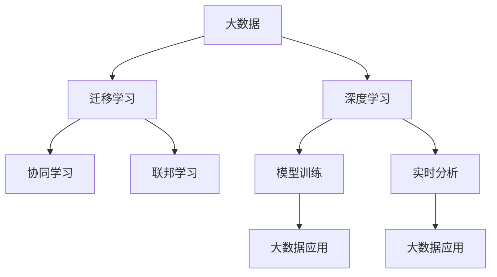

                 

## 1. 背景介绍

### 1.1 问题由来
随着技术的不断进步，人工智能（AI）和大数据（Big Data）已经成为推动现代科技发展的两个重要引擎。大数据为AI提供了强大的数据基础，而AI则为大数据的处理、分析和应用提供了智能化的解决方案。二者在相互促进中不断发展，共同开创了全新的技术应用领域。

### 1.2 问题核心关键点
大数据与AI之间的紧密联系可以从以下几个方面来理解：
- **数据来源**：大数据提供了AI算法训练和优化所需的海量数据，而AI通过算法对大数据进行深度学习和分析，提升了数据的利用效率。
- **模型训练**：AI依赖于大数据的训练，大数据的质量直接影响到AI模型的精度和泛化能力。
- **实时分析**：大数据支持AI进行实时分析和预测，而AI则为大数据分析提供更加智能和高效的方法。
- **应用场景**：大数据和AI相互结合，可以应用于诸多领域，如金融、医疗、交通、安全等，提升各行业的效率和决策能力。

### 1.3 问题研究意义
研究大数据与AI学习之间的关系，有助于深入理解二者在技术应用和产业发展中的协同作用。通过对这种关系的探讨，可以帮助从业者更好地设计和使用AI模型，提升数据处理和应用效率，推动各行业的数字化转型。

## 2. 核心概念与联系

### 2.1 核心概念概述

为更好地理解大数据与AI学习的关系，本节将介绍几个关键概念：

- **大数据（Big Data）**：指无法在传统数据库软件工具内捕获、存储、管理和分析的海量、多样和快速生成的数据集合。大数据通常包括结构化数据、半结构化数据和非结构化数据。

- **人工智能（AI）**：一种通过计算机程序实现的模拟人类智能的技术，包括机器学习、深度学习、自然语言处理、计算机视觉等多个子领域。

- **深度学习（Deep Learning）**：一种基于神经网络的机器学习方法，通过对大数据的训练，可以自动提取数据的高级特征。

- **迁移学习（Transfer Learning）**：指将在一个任务上训练得到的模型参数，迁移到另一个相关但不同的任务上，以减少在新任务上从头训练的需求。

- **协同学习（Co-learning）**：多个AI模型共同学习，共享数据和模型信息，以提升整体的性能和学习效率。

- **联邦学习（Federated Learning）**：指在不共享本地数据的前提下，多个设备或节点通过模型参数的交换进行协作学习，保障数据隐私和安全。

这些核心概念之间的逻辑关系可以通过以下Mermaid流程图来展示：



这个流程图展示了大数据与AI学习之间的核心概念及其相互联系：

1. 大数据为深度学习提供了训练基础，通过模型训练，深度学习可以从大数据中提取有用信息。
2. 迁移学习、协同学习和联邦学习是大数据与AI学习的协同机制，通过这些机制，大数据和AI可以更加高效地学习。
3. 大数据在经过深度学习处理后，可以用于各种实时分析和应用场景，而AI则为大数据分析提供更智能的方法。

## 3. 核心算法原理 & 具体操作步骤
### 3.1 算法原理概述

大数据与AI学习的关系主要体现在数据驱动的模型训练和应用过程中。大数据提供了模型训练所需的标签数据，而AI通过深度学习算法，从大数据中学习和提取特征。具体而言，深度学习算法在大数据上的训练过程可以分为以下几个步骤：

1. **数据收集与预处理**：收集大规模的标签数据，并进行清洗、归一化等预处理，确保数据的质量和可用性。
2. **模型设计**：选择合适的深度学习模型架构，如卷积神经网络（CNN）、循环神经网络（RNN）、变分自编码器（VAE）等，以适应不同的数据类型和应用场景。
3. **模型训练**：使用大数据对模型进行训练，调整模型参数，最小化损失函数，使得模型能够准确预测标签。
4. **模型评估与优化**：在验证集上评估模型性能，通过交叉验证、超参数调优等方法提升模型泛化能力。
5. **模型部署与应用**：将训练好的模型部署到生产环境，用于实时预测和决策支持。

### 3.2 算法步骤详解

以下是一个具体的深度学习模型训练流程示例：

1. **数据收集与预处理**：
   ```python
   import pandas as pd
   from sklearn.model_selection import train_test_split
   from sklearn.preprocessing import StandardScaler
   
   # 加载数据
   data = pd.read_csv('data.csv')
   
   # 数据预处理
   X = data[['feature1', 'feature2', 'feature3']]
   y = data['label']
   X_train, X_test, y_train, y_test = train_test_split(X, y, test_size=0.2, random_state=42)
   scaler = StandardScaler()
   X_train = scaler.fit_transform(X_train)
   X_test = scaler.transform(X_test)
   ```

2. **模型设计**：
   ```python
   from keras.models import Sequential
   from keras.layers import Dense, Dropout
   
   # 定义模型
   model = Sequential()
   model.add(Dense(64, input_dim=X_train.shape[1], activation='relu'))
   model.add(Dropout(0.5))
   model.add(Dense(32, activation='relu'))
   model.add(Dropout(0.5))
   model.add(Dense(1, activation='sigmoid'))
   
   # 编译模型
   model.compile(loss='binary_crossentropy', optimizer='adam', metrics=['accuracy'])
   ```

3. **模型训练**：
   ```python
   # 训练模型
   model.fit(X_train, y_train, epochs=10, batch_size=32, validation_data=(X_test, y_test))
   ```

4. **模型评估与优化**：
   ```python
   # 评估模型
   loss, accuracy = model.evaluate(X_test, y_test)
   print(f'Test loss: {loss}, Test accuracy: {accuracy}')
   ```

5. **模型部署与应用**：
   ```python
   # 保存模型
   model.save('my_model.h5')
   
   # 加载模型进行预测
   loaded_model = tf.keras.models.load_model('my_model.h5')
   new_data = pd.read_csv('new_data.csv')
   new_data = scaler.transform(new_data)
   predictions = loaded_model.predict(new_data)
   ```

### 3.3 算法优缺点

大数据与AI学习相结合的优势在于：
- **数据量大**：大数据提供了海量的数据源，使得深度学习模型能够从中找到更丰富的特征和模式。
- **学习能力强**：深度学习模型能够自动提取数据的高级特征，从而提升预测精度。
- **泛化能力强**：通过大数据的训练，深度学习模型能够更好地适应新数据和新场景。

然而，大数据与AI学习也存在一些缺点：
- **计算资源需求高**：大数据和深度学习模型需要大量的计算资源，特别是高性能的GPU或TPU。
- **数据隐私问题**：大数据涉及大量的个人隐私数据，如何保护数据隐私和安全性是一个重要问题。
- **模型复杂度**：深度学习模型参数众多，难以解释和调试，且容易过拟合。

### 3.4 算法应用领域

大数据与AI学习在多个领域得到了广泛应用，例如：

- **金融**：通过大数据分析客户行为和市场趋势，AI可以提供个性化的金融产品和服务，如信用评估、风险控制、股票预测等。
- **医疗**：利用医疗大数据，AI可以辅助诊断疾病、个性化治疗、药物研发等，提升医疗服务的质量和效率。
- **交通**：通过分析交通流量和大数据分析，AI可以优化交通路线、减少拥堵、提升交通安全。
- **安全**：利用大数据和AI进行实时监控和预测，提升安全防范和应急响应能力。

## 4. 数学模型和公式 & 详细讲解 & 举例说明

### 4.1 数学模型构建

在大数据与AI学习的背景下，常用的数学模型包括线性回归、逻辑回归、支持向量机、神经网络等。以下是线性回归模型的数学模型构建：

假设数据集为 $\{(x_i, y_i)\}_{i=1}^N$，其中 $x_i \in \mathbb{R}^d$ 为特征向量，$y_i \in \mathbb{R}$ 为标签。

线性回归模型定义为：

$$
y_i = \mathbf{w}^T\mathbf{x}_i + b
$$

其中 $\mathbf{w} \in \mathbb{R}^d$ 为模型参数，$b$ 为偏置项。

### 4.2 公式推导过程

线性回归模型的损失函数通常采用均方误差（MSE），即：

$$
\mathcal{L}(\mathbf{w}, b) = \frac{1}{2N}\sum_{i=1}^N (y_i - \mathbf{w}^T\mathbf{x}_i - b)^2
$$

通过梯度下降算法，更新模型参数 $\mathbf{w}$ 和 $b$：

$$
\frac{\partial \mathcal{L}}{\partial \mathbf{w}} = -\frac{1}{N}\sum_{i=1}^N (y_i - \mathbf{w}^T\mathbf{x}_i - b)\mathbf{x}_i
$$

$$
\frac{\partial \mathcal{L}}{\partial b} = -\frac{1}{N}\sum_{i=1}^N (y_i - \mathbf{w}^T\mathbf{x}_i - b)
$$

### 4.3 案例分析与讲解

以金融领域中的信用评分为例，假设要训练一个线性回归模型来预测客户的信用评分。收集历史客户的信用数据，包括年龄、收入、信用记录等特征，以及对应的信用评分。将数据集分为训练集和测试集，使用交叉验证进行模型训练和调优。最后，将训练好的模型部署到生产环境中，用于新客户的信用评分预测。

## 5. 项目实践：代码实例和详细解释说明

### 5.1 开发环境搭建

在进行大数据与AI学习的项目实践前，我们需要准备好开发环境。以下是使用Python进行PyTorch和TensorFlow开发的环境配置流程：

1. 安装Anaconda：从官网下载并安装Anaconda，用于创建独立的Python环境。

2. 创建并激活虚拟环境：
```bash
conda create -n pytorch-env python=3.8 
conda activate pytorch-env
```

3. 安装PyTorch：根据CUDA版本，从官网获取对应的安装命令。例如：
```bash
conda install pytorch torchvision torchaudio cudatoolkit=11.1 -c pytorch -c conda-forge
```

4. 安装TensorFlow：
```bash
pip install tensorflow
```

5. 安装各类工具包：
```bash
pip install numpy pandas scikit-learn matplotlib tqdm jupyter notebook ipython
```

完成上述步骤后，即可在`pytorch-env`环境中开始大数据与AI学习的项目实践。

### 5.2 源代码详细实现

这里我们以金融领域的信用评分预测为例，使用TensorFlow进行深度学习模型的训练和部署。

首先，定义数据集和模型：

```python
import tensorflow as tf
import pandas as pd

# 加载数据
data = pd.read_csv('credit.csv')

# 数据预处理
X = data[['age', 'income', 'credit_score']]
y = data['default']
X_train, X_test, y_train, y_test = train_test_split(X, y, test_size=0.2, random_state=42)

# 定义模型
model = tf.keras.Sequential([
    tf.keras.layers.Dense(64, activation='relu', input_shape=(X_train.shape[1],)),
    tf.keras.layers.Dense(32, activation='relu'),
    tf.keras.layers.Dense(1, activation='sigmoid')
])

# 编译模型
model.compile(loss='binary_crossentropy', optimizer='adam', metrics=['accuracy'])
```

然后，训练和评估模型：

```python
# 训练模型
model.fit(X_train, y_train, epochs=10, batch_size=32, validation_data=(X_test, y_test))

# 评估模型
loss, accuracy = model.evaluate(X_test, y_test)
print(f'Test loss: {loss}, Test accuracy: {accuracy}')
```

最后，保存模型并部署：

```python
# 保存模型
model.save('credit_model.h5')

# 加载模型进行预测
loaded_model = tf.keras.models.load_model('credit_model.h5')
new_data = pd.read_csv('new_data.csv')
new_data = new_data[['age', 'income']]
predictions = loaded_model.predict(new_data)
```

以上就是使用TensorFlow进行信用评分预测模型的完整代码实现。可以看到，TensorFlow的Keras API使得深度学习模型的构建和训练变得非常便捷，可以轻松处理各种类型的任务。

### 5.3 代码解读与分析

让我们再详细解读一下关键代码的实现细节：

**数据预处理**：
- `pd.read_csv('credit.csv')`：从CSV文件中加载数据。
- `train_test_split`：将数据集分为训练集和测试集。
- `StandardScaler`：对特征进行标准化处理，以加快模型收敛速度。

**模型设计**：
- `Sequential`：定义一个按顺序连接的层列表。
- `Dense`：定义全连接层，其中激活函数为ReLU和Sigmoid，分别用于特征提取和二分类任务。

**模型训练**：
- `model.fit`：在训练集上训练模型，使用二分类交叉熵损失函数和Adam优化器。
- `validation_data`：指定验证集用于模型性能评估。

**模型评估**：
- `model.evaluate`：在测试集上评估模型性能，输出损失和准确率。

**模型部署**：
- `model.save`：将训练好的模型保存到磁盘上。
- `tf.keras.models.load_model`：加载保存的模型进行预测。

以上代码展示了使用TensorFlow进行信用评分预测模型的完整流程，从数据加载、模型训练、模型评估到模型部署，每一步都非常清晰和规范。

## 6. 实际应用场景

### 6.1 金融领域

在大数据与AI学习的应用中，金融领域占据了重要地位。大数据技术可以用于客户行为分析、风险评估、股票预测等多个方面，而AI技术则提供了高效精准的解决方案。

例如，利用大数据和AI技术，金融机构可以：
- **信用评分**：通过分析客户的交易记录、社交媒体信息等，构建个性化的信用评分模型，用于贷款审批和风险控制。
- **风险管理**：利用大数据分析市场动向和金融风险，AI可以构建实时风险监控系统，及时预警和响应风险事件。
- **投资决策**：通过分析海量金融数据，AI可以提供个性化的投资建议和资产配置方案，提升投资回报率。

### 6.2 医疗领域

医疗领域是大数据与AI学习的重要应用领域之一。大数据技术可以用于医学数据的收集和存储，而AI技术则提供先进的诊断和治疗方案。

例如，利用大数据和AI技术，医疗机构可以：
- **疾病预测**：通过分析患者的电子病历、基因数据、医疗影像等，AI可以预测疾病风险，提供个性化的预防和干预措施。
- **智能诊断**：利用医疗大数据和AI技术，构建智能诊断系统，辅助医生进行疾病诊断和治疗。
- **药物研发**：通过大数据和AI技术，加速新药的发现和研发，提升药物的疗效和安全性。

### 6.3 智能交通

智能交通领域是大数据与AI学习的重要应用场景。通过实时分析交通流量和大数据，AI可以提供更智能、高效的交通管理方案。

例如，利用大数据和AI技术，交通管理部门可以：
- **交通预测**：通过分析交通流量数据，AI可以预测未来的交通状况，优化交通信号控制。
- **路径规划**：利用大数据和AI技术，AI可以提供个性化的路线规划和导航建议，减少交通拥堵。
- **安全预警**：通过分析交通监控数据，AI可以实时监测和预警交通事故和异常情况，提升交通安全。

### 6.4 未来应用展望

随着大数据与AI学习的不断发展，未来的应用场景将更加广泛和深入。

- **智慧城市**：通过大数据和AI技术，构建智能城市管理系统，提升城市管理的自动化和智能化水平。
- **智能制造**：利用大数据和AI技术，优化生产流程和资源配置，提升制造业的效率和灵活性。
- **个性化推荐**：通过分析用户行为数据和偏好，AI可以提供个性化的产品推荐和广告投放，提升用户体验。
- **社会治理**：利用大数据和AI技术，分析社会数据和舆情，提升社会治理的智能化水平。

## 7. 工具和资源推荐

### 7.1 学习资源推荐

为了帮助开发者系统掌握大数据与AI学习的关系，这里推荐一些优质的学习资源：

1. **《大数据分析与机器学习》**：由数据科学家撰写，深入浅出地介绍了大数据分析、机器学习的基本概念和实践方法。
2. **《深度学习入门》**：由深度学习专家撰写，全面介绍了深度学习的基本原理和常用模型，适合初学者入门。
3. **《Python数据科学手册》**：由数据科学社区领袖撰写，介绍了Python在数据科学和机器学习中的应用，包含丰富的代码示例和实战案例。
4. **Coursera《机器学习》课程**：由斯坦福大学Andrew Ng教授主讲的机器学习课程，提供了丰富的视频和作业资源，适合初学者和进阶学习者。
5. **Kaggle平台**：全球最大的数据科学竞赛平台，提供大量的数据集和比赛，适合数据科学家和机器学习爱好者实践和提升。

通过学习这些资源，可以全面掌握大数据与AI学习的关系和应用，提升数据科学和机器学习的实践能力。

### 7.2 开发工具推荐

高效的开发离不开优秀的工具支持。以下是几款用于大数据与AI学习的常用工具：

1. **Hadoop和Spark**：用于处理海量大数据的分布式计算框架，支持大规模数据存储和处理。
2. **TensorFlow和PyTorch**：两大主流深度学习框架，提供了丰富的API和工具，支持模型训练和推理。
3. **Jupyter Notebook**：数据科学和机器学习的交互式开发工具，支持Python、R等多种语言，提供代码编写、数据可视化和互动协作功能。
4. **Scikit-learn**：开源机器学习库，提供了常用的机器学习算法和工具，适合快速原型设计和模型评估。
5. **Keras**：高级深度学习框架，提供了简单易用的API，适合快速开发和部署深度学习模型。

合理利用这些工具，可以显著提升大数据与AI学习的开发效率，加快创新迭代的步伐。

### 7.3 相关论文推荐

大数据与AI学习的发展离不开学术界的持续研究。以下是几篇奠基性的相关论文，推荐阅读：

1. **《Google Scholar: A System for Automatic Document Discovery》**：介绍了一种基于大数据的学术文献发现系统，通过爬虫和索引技术，自动发现和推荐相关文献。
2. **《BigQuery: A Fault Tolerant Serving Infrastructure for Big Data》**：介绍了一种分布式大数据处理系统BigQuery，通过计算和存储分离，支持海量数据的实时分析和查询。
3. **《Deep Learning》**：由深度学习专家撰写，全面介绍了深度学习的基本原理和常用模型，适合初学者和进阶学习者。
4. **《A Survey on Federated Learning》**：综述了联邦学习的研究现状和发展趋势，介绍了联邦学习在数据隐私和安全方面的应用。
5. **《FedLearn: A Platform for Scalable, Decentralized, Privacy-Preserving Deep Learning》**：介绍了一种联邦学习平台FedLearn，支持跨设备和跨机构的数据联合训练。

这些论文代表了大数据与AI学习的发展脉络。通过学习这些前沿成果，可以帮助研究者把握学科前进方向，激发更多的创新灵感。

## 8. 总结：未来发展趋势与挑战

### 8.1 总结

本文对大数据与AI学习的关系进行了全面系统的介绍。首先阐述了大数据和AI学习在技术应用和产业发展中的协同作用，明确了大数据为AI提供训练基础，AI则为大数据提供智能化解决方案的核心关系。其次，从原理到实践，详细讲解了深度学习模型的训练和应用过程，给出了大数据与AI学习的完整代码实现。同时，本文还广泛探讨了大数据与AI学习在金融、医疗、交通等多个领域的应用前景，展示了大数据与AI学习的巨大潜力。

通过本文的系统梳理，可以看到，大数据与AI学习的技术融合是大数据时代的重要趋势，二者在相互促进中不断发展，共同开创了新的技术应用领域。未来，伴随大数据和AI技术的持续演进，大数据与AI学习的结合将更加紧密，为各行各业带来更广阔的发展空间。

### 8.2 未来发展趋势

展望未来，大数据与AI学习将呈现以下几个发展趋势：

1. **数据集成与共享**：随着数据共享标准的制定和数据治理技术的提升，大数据将更加集成和开放，AI模型可以更方便地访问和利用这些数据。
2. **模型自动化**：通过自动化机器学习（AutoML）和模型压缩技术，提升模型的构建和部署效率，降低人工干预。
3. **联邦学习与分布式计算**：联邦学习和分布式计算技术将进一步发展，支持大规模、隐私保护的数据联合训练。
4. **知识图谱与语义计算**：通过构建知识图谱和语义计算技术，提升AI模型的推理能力和知识整合能力。
5. **跨领域应用**：大数据与AI学习将更多地应用于跨领域领域，如智慧城市、智能制造、智能医疗等，提升各行业的智能化水平。
6. **多模态融合**：通过融合视觉、语音、文本等多模态数据，提升AI模型的泛化能力和应用范围。

以上趋势凸显了大数据与AI学习的广阔前景。这些方向的探索发展，必将进一步提升AI模型的性能和应用范围，为各行各业带来更广阔的发展空间。

### 8.3 面临的挑战

尽管大数据与AI学习已经取得了瞩目成就，但在迈向更加智能化、普适化应用的过程中，它仍面临着诸多挑战：

1. **数据隐私与安全**：大数据涉及大量个人隐私数据，如何保护数据隐私和安全是一个重要问题。
2. **模型复杂度与可解释性**：深度学习模型参数众多，难以解释和调试，且容易过拟合。
3. **计算资源需求**：大数据与AI学习需要大量的计算资源，特别是高性能的GPU或TPU。
4. **知识整合能力**：现有的大数据与AI模型往往局限于任务内数据，难以灵活吸收和运用更广泛的先验知识。
5. **跨领域应用难度**：大数据与AI学习在跨领域应用中面临数据格式、计算平台、算法适用性等多重挑战。

正视大数据与AI学习面临的这些挑战，积极应对并寻求突破，将是大数据与AI学习走向成熟的必由之路。相信随着学界和产业界的共同努力，这些挑战终将一一被克服，大数据与AI学习必将在构建智能社会中扮演越来越重要的角色。

### 8.4 未来突破

面对大数据与AI学习所面临的种种挑战，未来的研究需要在以下几个方面寻求新的突破：

1. **数据隐私保护**：研究数据匿名化、差分隐私等技术，保障数据隐私和安全。
2. **模型压缩与优化**：研究模型压缩、剪枝等技术，减少模型参数，提升模型的计算效率。
3. **可解释性与透明度**：引入可解释性模型和算法，提升模型的可解释性和透明度，增强可信度。
4. **跨领域知识整合**：结合符号化知识库、规则库等专家知识，提升模型的知识整合能力，支持跨领域应用。
5. **多模态融合与协同计算**：研究多模态数据的融合与协同计算技术，提升模型的泛化能力和应用范围。
6. **联邦学习与分布式计算**：研究联邦学习与分布式计算技术，支持大规模、隐私保护的数据联合训练。

这些研究方向的探索，必将引领大数据与AI学习技术迈向更高的台阶，为构建安全、可靠、可解释、可控的智能系统铺平道路。面向未来，大数据与AI学习还需要与其他人工智能技术进行更深入的融合，如知识表示、因果推理、强化学习等，多路径协同发力，共同推动自然语言理解和智能交互系统的进步。只有勇于创新、敢于突破，才能不断拓展大数据与AI学习的边界，让智能技术更好地造福人类社会。

## 9. 附录：常见问题与解答

**Q1：大数据与AI学习在实际应用中需要注意哪些问题？**

A: 大数据与AI学习在实际应用中需要注意以下问题：
- **数据质量**：大数据需要高质量的数据源，确保数据准确、完整、一致。
- **数据隐私**：大数据涉及大量个人隐私数据，需要采取加密、匿名化等措施保障数据隐私。
- **模型复杂度**：深度学习模型参数众多，难以解释和调试，需要选择合适的模型和算法。
- **计算资源**：大数据与AI学习需要大量的计算资源，需要合理配置计算资源和优化算法。
- **跨领域应用**：大数据与AI学习在跨领域应用中面临数据格式、计算平台、算法适用性等多重挑战。

**Q2：如何有效地进行大数据与AI学习的数据预处理？**

A: 大数据与AI学习的数据预处理可以从以下几个方面入手：
- **数据清洗**：去除重复、缺失、异常值等不合理的记录，确保数据质量。
- **数据归一化**：将数据进行标准化处理，缩小数据范围，加速模型训练。
- **特征工程**：通过特征选择、特征提取等手段，提升数据的信息量和可解释性。
- **数据采样**：通过随机采样、分层采样等方法，确保训练集和测试集的数据分布一致。

**Q3：大数据与AI学习中的模型调优有哪些常用方法？**

A: 大数据与AI学习中的模型调优可以从以下几个方面入手：
- **超参数调优**：通过网格搜索、随机搜索、贝叶斯优化等方法，选择最优的模型参数。
- **模型压缩与剪枝**：通过模型压缩、剪枝等技术，减少模型参数，提升模型的计算效率。
- **模型融合**：通过模型融合技术，结合多个模型的优势，提升模型的泛化能力和性能。
- **模型蒸馏**：通过知识蒸馏技术，将大型复杂模型转换为小型轻量模型，提升模型的推理速度和应用效率。

**Q4：如何在实际应用中平衡大数据与AI学习的计算资源需求？**

A: 在实际应用中，平衡大数据与AI学习的计算资源需求可以从以下几个方面入手：
- **分布式计算**：利用分布式计算框架如Hadoop、Spark等，将大数据处理任务分布到多个计算节点，提升计算效率。
- **模型压缩与优化**：通过模型压缩、剪枝等技术，减少模型参数，提升模型的计算效率。
- **混合精度训练**：利用混合精度训练技术，将模型参数分为高精度和低精度两部分，提升模型的计算效率和存储空间利用率。
- **模型并行与异步训练**：通过模型并行和异步训练技术，提升模型的训练速度和资源利用率。

**Q5：大数据与AI学习中如何处理模型过拟合问题？**

A: 大数据与AI学习中处理模型过拟合问题可以从以下几个方面入手：
- **数据增强**：通过数据增强技术，扩充训练数据，提升模型的泛化能力。
- **正则化**：通过L1正则、L2正则等技术，抑制模型的复杂度，减少过拟合风险。
- **早停策略**：通过早停策略，在验证集性能不再提升时，停止训练，避免过拟合。
- **模型集成**：通过模型集成技术，结合多个模型的预测结果，减少单一模型的过拟合风险。

这些方法可以在大数据与AI学习的实际应用中有效平衡计算资源需求，提升模型的泛化能力和应用效率。

---

作者：禅与计算机程序设计艺术 / Zen and the Art of Computer Programming

