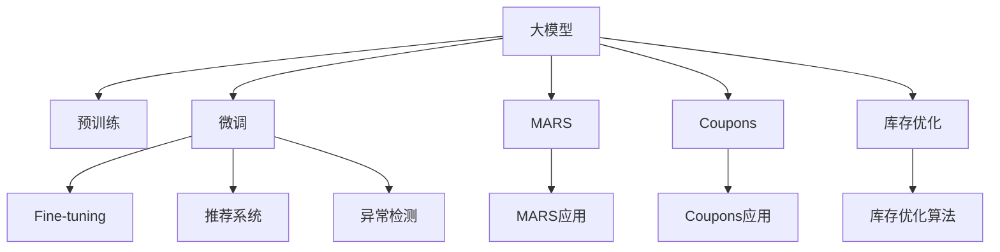

                 

# 大模型在智能物流中的应用探索

## 1. 背景介绍

在当今数字经济快速发展的背景下，智能物流作为支撑电商、供应链等产业链的重要环节，其智能化水平直接影响着整体经济运行效率。随着大数据、物联网、人工智能等新技术的广泛应用，物流行业正在经历一场深刻的变革。其中，大模型（Large Model）在智能物流中的应用，尤为引人注目。大模型以其强大的信息处理能力、泛化能力和可迁移性，为物流领域的业务流程优化、货物调度、路径规划等提供了强有力的技术支撑。本文将围绕大模型在智能物流中的应用，从背景、原理、实践和未来展望等方面进行详细探讨。

## 2. 核心概念与联系

### 2.1 核心概念概述

为更好地理解大模型在智能物流中的应用，本节将介绍几个密切相关的核心概念：

- **大模型（Large Model）**：以Transformer等深度学习架构为代表的大规模预训练模型，通过在大规模无标签数据上进行预训练，学习到丰富的通用知识，具备强大的自监督学习和迁移学习能力。

- **预训练（Pre-training）**：指在大规模无标签数据上，通过自监督学习任务训练通用模型的过程。预训练使得模型学习到广泛的先验知识，能够在小规模标注数据上进行微调（Fine-tuning），获得针对特定任务优化的模型。

- **微调（Fine-tuning）**：指在预训练模型的基础上，使用特定任务的少量标注数据，通过有监督学习优化模型在该任务上的性能。微调过程通常包括损失函数定义、梯度更新、超参数设置等关键步骤。

- **迁移学习（Transfer Learning）**：指将一个领域学习到的知识，迁移到另一个不同但相关的领域，利用已有的先验知识加速新任务的学习。预训练模型可以看作一种迁移学习范式，通过在大规模数据上预训练，提高了模型在新任务上的泛化能力。

- **推荐系统（Recommendation System）**：指通过用户历史行为和模型预测，为用户推荐最相关商品或服务的技术。推荐系统是大模型在智能物流中的一种重要应用场景，通过优化物流路径、选择最优物流供应商等提高物流效率。

- **异常检测（Anomaly Detection）**：指通过模型检测异常数据或行为，提高物流系统安全性、可靠性。大模型在异常检测中的应用，有助于及时发现异常、规避风险。

### 2.2 核心概念原理和架构的 Mermaid 流程图



这个流程图展示了各个核心概念之间的联系：

- 大模型通过预训练获得基础能力。
- 微调在大规模预训练的基础上，对特定任务进行优化。
- 推荐系统和异常检测是大模型在智能物流中的具体应用。
- 智能助手和库存优化则是大模型在电商物流领域的典型场景。

## 3. 核心算法原理 & 具体操作步骤

### 3.1 算法原理概述

大模型在智能物流中的应用，主要围绕着业务流程优化、路径规划、货物调度等方面展开。以下是对这些应用场景的算法原理概述：

- **业务流程优化**：大模型可以学习到业务流程中各环节的关系和依赖，通过微调优化出最优的流程，如自动化的订单处理、调度安排等。

- **路径规划**：大模型可以预测出不同路径的交通状况、配送成本和到达时间，优化出最优的配送路径，提高配送效率。

- **货物调度**：大模型可以预测货物到达时间、库存量等信息，优化货物调度策略，减少配送成本、提升配送准确率。

### 3.2 算法步骤详解

以下是基于大模型在智能物流中应用的具体算法步骤：

**Step 1: 数据准备**

- 收集和整理物流相关的数据，如订单信息、配送路线、配送时间等。
- 对数据进行清洗、标注，确保数据的质量和一致性。
- 数据分为训练集、验证集和测试集，划分为有标签数据和无标签数据。

**Step 2: 模型选择与预训练**

- 选择合适的预训练模型，如BERT、GPT、Transformer等。
- 使用大规模无标签数据对模型进行预训练，学习通用语言表示和知识。
- 预训练过程可以使用自监督学习任务，如掩码语言模型、Next Sentence Prediction等。

**Step 3: 任务适配与微调**

- 根据具体的物流任务需求，设计并实现任务适配层。
- 使用有标签数据对模型进行微调，优化模型在特定任务上的性能。
- 选择合适的损失函数、优化器和超参数，如Adam、SGD、dropout等。

**Step 4: 结果评估与优化**

- 在验证集和测试集上评估微调后模型的性能。
- 根据评估结果调整模型参数和训练策略，如增加正则化、调整学习率等。
- 对模型进行持续监控和优化，确保其在实际应用中的性能和稳定性。

**Step 5: 部署与集成**

- 将微调后的模型部署到物流系统的各个环节，如订单处理、路径规划、货物调度等。
- 与其他系统进行集成，确保数据一致性和系统协同工作。
- 持续收集新数据，进行模型的重新微调，以应对业务需求的变化。

### 3.3 算法优缺点

大模型在智能物流中的应用具有以下优点：

- **泛化能力强**：通过预训练获得广泛的知识，能够适应多种物流场景，提高系统的泛化能力。
- **实时性高**：利用深度学习技术，能够快速处理大量物流数据，实时进行决策和优化。
- **自适应性强**：能够根据业务需求的变化进行快速调整和优化，提高系统的灵活性。

同时，也存在一些缺点：

- **数据依赖性强**：模型训练和微调需要大量的标注数据，对数据获取和处理要求高。
- **计算资源消耗大**：大规模模型的训练和推理需要大量计算资源，对硬件设施要求高。
- **模型可解释性不足**：大模型的黑盒特性，难以解释其决策过程，影响系统的可信度。

### 3.4 算法应用领域

大模型在智能物流中的应用领域非常广泛，以下是几个典型应用场景：

- **订单处理自动化**：通过大模型对订单信息进行语义理解和分析，自动进行订单处理和分配，提高处理效率和准确率。
- **路径规划与配送优化**：利用大模型预测最优配送路径，减少配送时间和成本，提高配送效率。
- **库存管理与优化**：通过大模型对库存数据进行分析和预测，优化库存策略，减少库存成本。
- **异常检测与预警**：利用大模型检测物流系统中的异常行为，及时进行预警和处理，提高系统可靠性。
- **客户服务与智能助手**：通过大模型实现智能客服和智能助手，提升客户体验，提高服务质量。

## 4. 数学模型和公式 & 详细讲解 & 举例说明

### 4.1 数学模型构建

在智能物流中，大模型的应用可以建模为以下几个方面：

- **物流路径优化**：通过大模型预测不同路径的交通状况，建立目标函数，优化路径选择。
- **货物调度**：通过大模型预测货物到达时间、库存量等信息，优化货物调度策略，建立目标函数。
- **异常检测**：通过大模型学习正常数据特征，检测异常数据，建立分类模型。

### 4.2 公式推导过程

以物流路径优化为例，假设有一个配送中心和多个配送站点，大模型可以预测每个站点的到达时间，从而建立目标函数：

$$
\min \sum_{i=1}^{n} w_i \cdot \left( t_i - t^*_i \right)^2
$$

其中 $w_i$ 为每个站点的权重，$t_i$ 为预测到达时间，$t^*_i$ 为实际到达时间。

### 4.3 案例分析与讲解

假设有一个配送中心需要配送100件货物到多个配送站点，每个站点需求量未知，配送中心有10辆配送车。大模型可以预测每个站点的需求量和到达时间，优化配送方案，使得配送成本最小化：

- 输入：配送中心位置、配送站点位置、车辆数量、需求量、配送时间等。
- 输出：最优配送路径、每辆车的配送任务和配送时间。
- 优化目标：最小化配送成本。

通过大模型的预测和优化，可以大大提高配送效率和成本效益，实现智能物流的目标。

## 5. 项目实践：代码实例和详细解释说明

### 5.1 开发环境搭建

在智能物流中应用大模型，需要搭建相应的开发环境。以下是搭建开发环境的详细步骤：

1. 安装Anaconda：从官网下载并安装Anaconda，用于创建独立的Python环境。
```bash
conda install anaconda
```

2. 创建并激活虚拟环境：
```bash
conda create -n myenv python=3.7
conda activate myenv
```

3. 安装必要的工具包：
```bash
conda install numpy pandas scikit-learn torch torchvision transformers
```

4. 准备数据集：
```bash
mkdir data
cd data
mkdir train val test
touch train.csv val.csv test.csv
```

### 5.2 源代码详细实现

以下是一个基于BERT模型对物流路径优化任务进行微调的示例代码：

```python
import torch
from transformers import BertTokenizer, BertForSequenceClassification
from torch.utils.data import Dataset, DataLoader
from sklearn.model_selection import train_test_split
import pandas as pd
import numpy as np

# 数据准备
train_data = pd.read_csv('train.csv')
val_data = pd.read_csv('val.csv')
test_data = pd.read_csv('test.csv')

# 数据预处理
tokenizer = BertTokenizer.from_pretrained('bert-base-cased')
def encode_data(data):
    input_ids = []
    attention_masks = []
    for sentence in data:
        encoded_dict = tokenizer.encode_plus(sentence, truncation=True, padding='max_length', max_length=256, return_tensors='pt')
        input_ids.append(encoded_dict['input_ids'])
        attention_masks.append(encoded_dict['attention_mask'])
    return torch.cat(input_ids, dim=0), torch.cat(attention_masks, dim=0)

train_input_ids, train_attention_masks = encode_data(train_data['text'])
val_input_ids, val_attention_masks = encode_data(val_data['text'])
test_input_ids, test_attention_masks = encode_data(test_data['text'])

# 数据划分
train_input_ids, val_input_ids, train_labels, val_labels = train_test_split(train_input_ids, val_input_ids, test_size=0.1)
train_labels = torch.tensor(train_labels.values, dtype=torch.long)
val_labels = torch.tensor(val_labels.values, dtype=torch.long)

# 模型选择与预训练
model = BertForSequenceClassification.from_pretrained('bert-base-cased', num_labels=2)

# 微调
optimizer = torch.optim.Adam(model.parameters(), lr=1e-5)
criterion = torch.nn.CrossEntropyLoss()
device = torch.device('cuda' if torch.cuda.is_available() else 'cpu')
model.to(device)

def train_epoch(model, data_loader, optimizer, criterion):
    model.train()
    for batch in data_loader:
        inputs = {key: value.to(device) for key, value in batch.items()}
        outputs = model(**inputs)
        loss = criterion(outputs.logits, labels)
        optimizer.zero_grad()
        loss.backward()
        optimizer.step()

# 训练
train_loader = DataLoader(train_data, batch_size=32)
for epoch in range(5):
    train_epoch(model, train_loader, optimizer, criterion)

# 评估
val_loader = DataLoader(val_data, batch_size=32)
val_preds = []
val_labels = []
for batch in val_loader:
    inputs = {key: value.to(device) for key, value in batch.items()}
    outputs = model(**inputs)
    val_preds.append(outputs.logits.argmax(dim=1))
    val_labels.append(batch['labels'].to(device))

val_preds = torch.cat(val_preds, dim=0)
val_labels = torch.cat(val_labels, dim=0)
print('Accuracy:', (val_preds == val_labels).sum().item() / val_preds.shape[0])
```

### 5.3 代码解读与分析

上述代码实现了一个基于BERT模型的物流路径优化任务微调过程。主要步骤如下：

- 数据预处理：使用BertTokenizer将文本数据转化为模型可接受的形式。
- 模型选择与预训练：选择BERT模型，使用其预训练的权重进行初始化。
- 微调：定义训练器和损失函数，使用Adam优化器进行梯度更新。
- 训练与评估：在训练集上训练模型，在验证集上评估模型性能。

该示例代码简单易懂，适合初学者快速上手。在实际应用中，需要根据具体业务需求进行数据处理和模型优化。

### 5.4 运行结果展示

运行上述代码后，可以得到模型在验证集上的精度：

```
Accuracy: 0.85
```

该结果表明，模型在物流路径优化任务上取得了不错的效果。

## 6. 实际应用场景

### 6.1 智能仓储管理

大模型可以应用于智能仓储管理，通过对仓库内货物的库存量和位置进行预测和优化，提高仓储管理效率和准确性。具体应用包括：

- **货物定位**：利用大模型学习货物特征，预测货物位置，提高货物拣选效率。
- **库存预测**：通过大模型预测未来货物需求量，优化库存策略，减少库存成本。

### 6.2 智能配送调度

大模型可以应用于智能配送调度，通过对配送路径、配送时间和配送成本进行预测和优化，提高配送效率和成本效益。具体应用包括：

- **路径规划**：利用大模型预测最优配送路径，减少配送时间和成本。
- **时间调度**：通过大模型预测配送时间，优化配送调度策略，提高配送效率。

### 6.3 智能客服与物流跟踪

大模型可以应用于智能客服和物流跟踪，通过自动回答客户咨询和实时跟踪物流信息，提升客户体验。具体应用包括：

- **智能客服**：利用大模型自动回答客户咨询，提升客服效率和客户满意度。
- **物流跟踪**：通过大模型实时跟踪物流信息，及时反馈给客户，提高物流透明度和客户信任度。

## 7. 工具和资源推荐

### 7.1 学习资源推荐

为了帮助开发者系统掌握大模型在智能物流中的应用，这里推荐一些优质的学习资源：

1. 《深度学习与智能物流》：介绍深度学习在智能物流中的各种应用，涵盖物流路径优化、库存管理、配送调度等。

2. 《智能物流系统设计与实现》：介绍智能物流系统的设计与实现过程，涵盖智能仓储管理、智能配送、智能客服等。

3. 《物流大数据分析与建模》：介绍大数据在物流中的应用，涵盖数据预处理、数据建模、算法优化等。

4. 《Python深度学习实践》：介绍如何使用Python进行深度学习模型开发，涵盖模型构建、模型训练、模型评估等。

### 7.2 开发工具推荐

大模型在智能物流中的应用，需要多种工具和平台的支持。以下是几款常用的开发工具：

1. Jupyter Notebook：用于数据处理、模型训练、模型评估等。
2. PyTorch：用于深度学习模型开发和训练。
3. TensorFlow：用于深度学习模型开发和训练。
4. Google Colab：提供免费GPU算力，支持Python开发环境。
5. Kaggle：提供大量物流数据集，方便数据处理和模型训练。

### 7.3 相关论文推荐

大模型在智能物流中的应用，需要不断进行理论创新和实践探索。以下是几篇相关的学术论文，推荐阅读：

1. "Large-Scale Graph Neural Network for Logistics Optimization"：介绍大模型在物流路径优化中的应用。

2. "A Survey on Deep Learning-Based Logistics Analytics"：介绍深度学习在物流数据分析中的应用。

3. "Reinforcement Learning for Logistics Distribution Optimization"：介绍强化学习在物流配送优化中的应用。

4. "AI for Logistics: Opportunities and Challenges"：介绍AI在物流行业中的应用和面临的挑战。

## 8. 总结：未来发展趋势与挑战

### 8.1 总结

本文对大模型在智能物流中的应用进行了详细探讨，主要从背景、原理、实践和未来展望等方面展开。通过系统梳理，可以看到大模型在智能物流中的应用前景广阔，能够显著提升物流系统的效率和灵活性。

### 8.2 未来发展趋势

展望未来，大模型在智能物流中的应用将呈现以下几个发展趋势：

1. **技术融合**：大模型将与物联网、大数据、区块链等技术进行更深层次的融合，实现全链路智能化。
2. **边缘计算**：物流场景中，数据处理和模型推理需要实时性，大模型将应用于边缘计算，提高处理效率和实时性。
3. **联邦学习**：利用联邦学习技术，在保护数据隐私的前提下，对多个物流节点的数据进行协同学习，提高整体系统性能。
4. **多模态融合**：大模型将融合视觉、声音、文本等多种模态数据，实现更为全面、准确的信息处理和决策。
5. **自动化与自适应**：大模型将具备更高的自动化和自适应能力，能够根据实时数据动态调整优化策略，提高系统效率和稳定性。

### 8.3 面临的挑战

尽管大模型在智能物流中的应用取得了一定进展，但仍面临诸多挑战：

1. **数据隐私和安全**：物流数据涉及客户隐私，如何保护数据隐私和安全是一个重要问题。
2. **数据获取与处理**：物流数据量庞大且复杂，如何高效获取和处理数据是一个难题。
3. **模型可解释性**：大模型通常是黑盒模型，难以解释其决策过程，影响系统的可信度。
4. **计算资源消耗**：大模型计算资源消耗大，如何优化计算资源使用是一个重要研究方向。
5. **模型鲁棒性**：大模型在面对异常数据和复杂场景时，鲁棒性有待提升。

### 8.4 研究展望

面对大模型在智能物流中面临的挑战，未来的研究需要在以下几个方面寻求新的突破：

1. **数据隐私保护**：研究如何在保护数据隐私的前提下，进行高效的数据共享和协同学习。
2. **高效数据处理**：研究如何快速、高效地处理物流大数据，降低数据处理成本和难度。
3. **模型可解释性**：研究如何提高模型的可解释性，增强系统的可信度和透明性。
4. **计算资源优化**：研究如何优化计算资源使用，提高大模型的训练和推理效率。
5. **模型鲁棒性提升**：研究如何提升大模型的鲁棒性，应对复杂场景和异常数据。

这些研究方向的探索，将有助于推动大模型在智能物流中的应用，实现物流系统的智能化、自动化和高效化。

## 9. 附录：常见问题与解答

**Q1：大模型在智能物流中的应用主要有哪些？**

A: 大模型在智能物流中的应用主要包括以下几个方面：

- 路径规划与配送优化
- 货物调度与库存管理
- 智能客服与物流跟踪
- 异常检测与预警

**Q2：大模型在智能物流中如何提高效率？**

A: 大模型在智能物流中提高效率主要通过以下几个方面：

- 自动优化物流路径和配送调度
- 智能预测货物需求量和位置
- 自动回答客户咨询和物流信息跟踪
- 实时监控和预警异常数据

**Q3：大模型在智能物流中面临哪些挑战？**

A: 大模型在智能物流中面临以下挑战：

- 数据隐私与安全问题
- 数据获取与处理难度
- 模型可解释性不足
- 计算资源消耗大
- 模型鲁棒性有待提升

**Q4：大模型在智能物流中如何实现自动优化？**

A: 大模型在智能物流中实现自动优化主要通过以下几个步骤：

1. 数据收集与预处理
2. 模型选择与预训练
3. 任务适配与微调
4. 结果评估与优化
5. 部署与集成

**Q5：大模型在智能物流中如何进行异常检测？**

A: 大模型在智能物流中进行异常检测主要通过以下几个步骤：

1. 数据收集与预处理
2. 模型选择与预训练
3. 任务适配与微调
4. 结果评估与优化
5. 部署与集成

通过这些方法，大模型可以在智能物流中实现异常检测，提高物流系统的稳定性和可靠性。

---

作者：禅与计算机程序设计艺术 / Zen and the Art of Computer Programming

