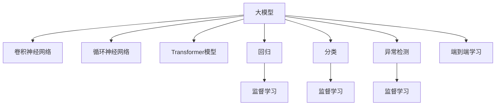

                 

# 大模型在预测分析中的应用前景

> 关键词：大模型,预测分析,深度学习,监督学习,卷积神经网络,循环神经网络,Transformer,回归,分类,异常检测

## 1. 背景介绍

### 1.1 问题由来
预测分析（Predictive Analysis）是数据科学中的一个核心领域，旨在通过分析历史数据，预测未来的趋势和行为。传统的预测方法主要依赖于统计学模型，如回归分析、时间序列分析等。然而，随着深度学习技术的发展，基于大模型的预测分析方法开始崭露头角，并在多个行业领域展现出了显著的潜力。

### 1.2 问题核心关键点
大模型在预测分析中的应用主要体现在以下几个方面：
- 高效特征提取：大模型通过在大规模数据上预训练，能够自动学习到复杂、高级的特征表示，从而提升了特征提取的能力。
- 泛化能力强：相较于传统模型，大模型具有更强的泛化能力，能够更好地适应未知数据的分布。
- 多模态融合：大模型能够处理多源、多模态的数据，如文本、图像、音频等，进行联合预测分析。
- 端到端学习：大模型能够实现端到端的预测分析，避免了繁琐的数据预处理和模型集成，简化了流程。

## 2. 核心概念与联系

### 2.1 核心概念概述

为更好地理解大模型在预测分析中的应用，本节将介绍几个关键概念及其相互关系：

- **大模型（Large Models）**：如Transformer、BERT、GPT等，通过在大规模数据上进行预训练，学习到丰富的语义和知识。
- **监督学习（Supervised Learning）**：一种有监督的学习范式，使用带有标签的训练数据进行模型训练，从而做出预测。
- **卷积神经网络（Convolutional Neural Networks, CNNs）**：常用于图像处理，通过卷积操作提取局部特征，适用于像素级别的预测。
- **循环神经网络（Recurrent Neural Networks, RNNs）**：用于序列数据的预测，如文本、时间序列等，能够捕捉数据之间的时序依赖关系。
- **Transformer模型**：基于自注意力机制，能够高效地处理长序列数据，适用于各种序列预测任务。
- **回归（Regression）**：预测连续数值，如房价预测、股票价格预测等。
- **分类（Classification）**：预测离散标签，如文本情感分析、疾病诊断等。
- **异常检测（Anomaly Detection）**：识别异常数据点，如欺诈检测、系统故障预测等。

这些概念之间的逻辑关系可以通过以下Mermaid流程图来展示：



这个流程图展示了各个概念之间的联系：

1. 大模型通过预训练学习到通用的特征表示。
2. CNNs、RNNs、Transformer等是实现大模型的具体架构。
3. 回归、分类、异常检测等是大模型在预测分析中常见的应用场景。
4. 监督学习是进行预测分析的主要方法。
5. 端到端学习简化了预测分析流程。

## 3. 核心算法原理 & 具体操作步骤
### 3.1 算法原理概述

基于大模型的预测分析方法，主要基于监督学习范式，通过在大规模标注数据上训练模型，使其能够对未来数据进行准确预测。其核心思想是利用预训练模型的强大特征提取能力，在少量标注数据上进行微调，提升模型在特定任务上的性能。

### 3.2 算法步骤详解

基于大模型的预测分析通常包括以下几个关键步骤：

**Step 1: 准备数据集**
- 收集相关领域的标注数据集，划分为训练集、验证集和测试集。数据集应尽可能覆盖预测任务的关键特征。
- 数据预处理，如数据清洗、归一化、特征工程等。

**Step 2: 选择大模型和架构**
- 根据任务类型选择合适的预训练模型，如使用Transformer、CNNs或RNNs。
- 根据数据特性选择合适的模型架构，如序列模型、图像模型或多模态模型。

**Step 3: 微调模型**
- 冻结大模型中的某些层，仅更新顶层参数，避免破坏预训练的权重。
- 设置合适的学习率和正则化参数，防止过拟合。
- 使用验证集监控模型性能，避免提前停止。

**Step 4: 评估和部署**
- 在测试集上评估模型性能，对比微调前后的效果。
- 将微调后的模型部署到实际预测系统中，进行实时预测。

### 3.3 算法优缺点

基于大模型的预测分析方法具有以下优点：
- 高效特征提取：大模型通过大规模预训练，能够自动学习到高级特征表示，提升特征提取能力。
- 泛化能力强：大模型能够更好地适应未知数据分布，提升预测准确性。
- 端到端学习：大模型能够实现从数据预处理到模型训练再到预测的端到端流程，简化流程。

同时，该方法也存在一些局限性：
- 数据依赖：需要大量标注数据进行微调，数据获取成本较高。
- 计算资源需求高：大模型参数量庞大，计算和存储需求高。
- 模型解释性差：大模型为黑盒模型，难以解释其内部决策过程。

尽管存在这些局限性，但基于大模型的预测分析方法在准确性、泛化能力和处理复杂任务方面具有显著优势，是未来预测分析技术的重要方向。

### 3.4 算法应用领域

基于大模型的预测分析方法已经在多个领域得到广泛应用，例如：

- **金融风险预测**：通过分析历史交易数据，预测股票价格、市场波动等。
- **医疗诊断**：利用患者历史数据，预测疾病发展趋势，辅助医生诊断。
- **智能制造**：通过分析生产设备运行数据，预测设备故障，优化生产流程。
- **供应链管理**：分析市场趋势和需求数据，预测库存需求，优化供应链管理。
- **客户行为预测**：通过分析客户交易数据，预测客户购买行为，提升客户满意度。

## 4. 数学模型和公式 & 详细讲解 & 举例说明

### 4.1 数学模型构建

假设我们使用大模型 $M$ 进行回归预测，输入为 $x$，输出为 $y$。假设训练集为 $D=\{(x_i,y_i)\}_{i=1}^N$。

我们的目标是最小化预测值与真实值之间的平方误差：

$$
\min_{\theta} \sum_{i=1}^N (y_i - M(x_i; \theta))^2
$$

其中 $\theta$ 为模型参数， $M(x; \theta)$ 为模型在输入 $x$ 上的预测值。

### 4.2 公式推导过程

使用均方误差（Mean Squared Error, MSE）作为损失函数，通过梯度下降法最小化损失：

$$
\min_{\theta} \frac{1}{N} \sum_{i=1}^N (y_i - M(x_i; \theta))^2
$$

假设我们使用多层感知器（MLP）作为模型架构，通过反向传播算法计算梯度：

$$
\frac{\partial L}{\partial \theta} = -\frac{2}{N} \sum_{i=1}^N (y_i - M(x_i; \theta)) \frac{\partial M(x_i; \theta)}{\partial \theta}
$$

其中 $\frac{\partial M(x_i; \theta)}{\partial \theta}$ 为模型在输入 $x_i$ 上的梯度。

### 4.3 案例分析与讲解

以医疗诊断为例，假设我们有一个包含患者年龄、性别、血压、血糖等特征的数据集，目标是对每个患者进行疾病预测。我们可以使用BERT模型作为预训练模型，在训练集上进行微调，得到一个能够预测患者是否患有糖尿病的模型。具体步骤如下：

1. 收集包含疾病标签的数据集。
2. 对数据集进行预处理，如数据清洗、归一化、特征工程等。
3. 冻结BERT模型的底层参数，仅微调顶层参数。
4. 设置合适的学习率和正则化参数，如Adam优化器，学习率为0.001，L2正则化系数为0.001。
5. 使用验证集监控模型性能，避免提前停止。
6. 在测试集上评估模型性能，对比微调前后的效果。

通过以上步骤，我们可以得到一个能够在医疗领域进行疾病预测的模型。

## 5. 项目实践：代码实例和详细解释说明
### 5.1 开发环境搭建

在进行预测分析项目开发前，我们需要准备好开发环境。以下是使用Python进行PyTorch开发的详细环境配置流程：

1. 安装Anaconda：从官网下载并安装Anaconda，用于创建独立的Python环境。

2. 创建并激活虚拟环境：
```bash
conda create -n pytorch-env python=3.8 
conda activate pytorch-env
```

3. 安装PyTorch：根据CUDA版本，从官网获取对应的安装命令。例如：
```bash
conda install pytorch torchvision torchaudio cudatoolkit=11.1 -c pytorch -c conda-forge
```

4. 安装相关库：
```bash
pip install torch numpy pandas scikit-learn torchvision torchaudio
```

完成上述步骤后，即可在`pytorch-env`环境中开始项目开发。

### 5.2 源代码详细实现

下面我们以金融风险预测为例，给出使用BERT模型进行回归预测的PyTorch代码实现。

```python
import torch
from transformers import BertForRegression
from torch.utils.data import Dataset, DataLoader
from sklearn.model_selection import train_test_split
from torch import nn

class FinanceDataset(Dataset):
    def __init__(self, X, y):
        self.X = X
        self.y = y
        
    def __len__(self):
        return len(self.X)
    
    def __getitem__(self, idx):
        return torch.tensor(self.X[idx]), torch.tensor(self.y[idx])

X_train, X_test, y_train, y_test = train_test_split(X, y, test_size=0.2, random_state=42)

train_dataset = FinanceDataset(X_train, y_train)
test_dataset = FinanceDataset(X_test, y_test)

train_loader = DataLoader(train_dataset, batch_size=16)
test_loader = DataLoader(test_dataset, batch_size=16)

device = torch.device('cuda') if torch.cuda.is_available() else torch.device('cpu')

model = BertForRegression.from_pretrained('bert-base-uncased')
model.to(device)

criterion = nn.MSELoss()
optimizer = torch.optim.Adam(model.parameters(), lr=0.001)

def train_epoch(model, loader, criterion, optimizer):
    model.train()
    total_loss = 0
    for batch in loader:
        inputs, labels = batch
        inputs = inputs.to(device)
        labels = labels.to(device)
        outputs = model(inputs)
        loss = criterion(outputs, labels)
        optimizer.zero_grad()
        loss.backward()
        optimizer.step()
        total_loss += loss.item()
    return total_loss / len(loader)

def evaluate(model, loader, criterion):
    model.eval()
    total_loss = 0
    for batch in loader:
        inputs, labels = batch
        inputs = inputs.to(device)
        labels = labels.to(device)
        outputs = model(inputs)
        loss = criterion(outputs, labels)
        total_loss += loss.item()
    return total_loss / len(loader)

def main():
    epochs = 10
    for epoch in range(epochs):
        train_loss = train_epoch(model, train_loader, criterion, optimizer)
        test_loss = evaluate(model, test_loader, criterion)
        print(f'Epoch {epoch+1}, Train Loss: {train_loss:.4f}, Test Loss: {test_loss:.4f}')
        
if __name__ == '__main__':
    main()
```

### 5.3 代码解读与分析

让我们再详细解读一下关键代码的实现细节：

**FinanceDataset类**：
- `__init__`方法：初始化训练和测试数据。
- `__len__`方法：返回数据集的样本数量。
- `__getitem__`方法：获取单个样本，返回输入和标签。

**训练和评估函数**：
- `train_epoch`函数：对数据以批为单位进行迭代，在每个批次上前向传播计算损失并反向传播更新模型参数。
- `evaluate`函数：与训练类似，不同点在于不更新模型参数，直接计算评估集上的损失。

**训练流程**：
- 定义总的epoch数，开始循环迭代
- 每个epoch内，先在训练集上训练，输出训练损失
- 在验证集上评估，输出验证损失
- 重复上述过程直至收敛

通过以上步骤，我们可以使用BERT模型进行金融风险预测。可以看到，使用Transformers库能够显著简化模型的微调过程。开发者可以将更多精力放在数据处理、模型改进等高层逻辑上，而不必过多关注底层的实现细节。

当然，在工业级的系统实现中，还需要考虑更多因素，如模型的保存和部署、超参数的自动搜索、更灵活的任务适配层等。但核心的预测分析范式基本与此类似。

## 6. 实际应用场景
### 6.1 金融风险预测

在金融领域，基于大模型的预测分析技术可以用于预测股票价格、市场波动、信用风险等。具体而言，可以通过分析历史交易数据、财务报表、新闻资讯等，构建监督数据集，在大模型上进行微调，得到一个能够预测未来金融数据的模型。微调后的模型可以实时监控市场动态，及时预警潜在的风险。

### 6.2 医疗诊断

在医疗领域，预测分析技术可以用于疾病诊断、治疗方案优化等。通过分析患者的病历数据、基因数据、影像数据等，构建监督数据集，在大模型上进行微调，得到一个能够预测疾病发展趋势的模型。微调后的模型可以帮助医生进行早期诊断，优化治疗方案，提高医疗服务质量。

### 6.3 智能制造

在制造业，预测分析技术可以用于设备维护、生产调度、供应链管理等。通过分析生产设备的运行数据、供应链数据、市场需求数据等，构建监督数据集，在大模型上进行微调，得到一个能够预测设备故障、优化生产流程的模型。微调后的模型可以提高生产效率，降低生产成本，提升企业竞争力。

### 6.4 客户行为预测

在零售、电商等领域，预测分析技术可以用于客户购买行为预测、市场趋势预测等。通过分析用户的交易数据、浏览数据、行为数据等，构建监督数据集，在大模型上进行微调，得到一个能够预测客户行为的模型。微调后的模型可以帮助企业进行个性化推荐、库存管理、市场营销等，提升客户满意度和企业收益。

## 7. 工具和资源推荐
### 7.1 学习资源推荐

为了帮助开发者系统掌握大模型在预测分析中的应用，这里推荐一些优质的学习资源：

1. 《深度学习》系列书籍：如《Deep Learning》（Ian Goodfellow等著）、《Deep Learning Specialization》（Andrew Ng等讲授），全面介绍了深度学习的基本原理和应用。

2. Kaggle竞赛平台：提供丰富的数据集和比赛，帮助开发者练习预测分析技能，提升实战能力。

3. Coursera《机器学习》课程：斯坦福大学开设的机器学习课程，涵盖了机器学习的基本概念和算法，适合入门学习。

4. 《Python机器学习》书籍：介绍机器学习算法的Python实现，包括回归、分类、聚类等。

5. HuggingFace官方文档：提供了大量预训练语言模型的使用示例，以及微调和部署的详细指南。

通过对这些资源的学习实践，相信你一定能够快速掌握大模型在预测分析中的应用技巧，并用于解决实际的预测分析问题。

### 7.2 开发工具推荐

高效的开发离不开优秀的工具支持。以下是几款用于大模型预测分析开发的常用工具：

1. PyTorch：基于Python的开源深度学习框架，灵活动态的计算图，适合快速迭代研究。

2. TensorFlow：由Google主导开发的开源深度学习框架，生产部署方便，适合大规模工程应用。

3. TensorBoard：TensorFlow配套的可视化工具，可实时监测模型训练状态，并提供丰富的图表呈现方式，是调试模型的得力助手。

4. Weights & Biases：模型训练的实验跟踪工具，可以记录和可视化模型训练过程中的各项指标，方便对比和调优。

5. Kaggle平台：提供在线数据分析和机器学习竞赛环境，提供丰富的数据集和数据预处理工具。

合理利用这些工具，可以显著提升大模型预测分析任务的开发效率，加快创新迭代的步伐。

### 7.3 相关论文推荐

大模型在预测分析领域的发展源于学界的持续研究。以下是几篇奠基性的相关论文，推荐阅读：

1. **Recurrent Neural Network Learning in Direct Sequence Prediction**：Jordan等人的经典论文，提出了循环神经网络，用于序列数据预测。

2. **Convolutional Neural Networks for General Natural Language Understanding**：Yann LeCun等人提出的卷积神经网络，用于图像和文本数据的预测分析。

3. **Deep Residual Learning for Image Recognition**：He等人提出的残差网络，用于图像分类和预测分析。

4. **BERT: Pre-training of Deep Bidirectional Transformers for Language Understanding**：BERT模型，通过大规模预训练，提升了语言模型在各种预测任务中的性能。

5. **Transformers are Architectures for Machine Learning**：Vaswani等人提出的Transformer模型，用于序列数据预测分析，提升了模型的效率和效果。

这些论文代表了大模型在预测分析领域的发展脉络。通过学习这些前沿成果，可以帮助研究者把握学科前进方向，激发更多的创新灵感。

## 8. 总结：未来发展趋势与挑战
### 8.1 研究成果总结

本文对大模型在预测分析中的应用进行了全面系统的介绍。首先阐述了大模型和预测分析的研究背景和意义，明确了大模型在特征提取、泛化能力、端到端学习等方面的优势。其次，从原理到实践，详细讲解了大模型的核心算法和具体操作步骤，给出了预测分析任务开发的完整代码实例。同时，本文还探讨了大模型在金融、医疗、制造等多个行业领域的应用前景，展示了预测分析技术的巨大潜力。最后，本文精选了预测分析技术的各类学习资源，力求为读者提供全方位的技术指引。

通过本文的系统梳理，可以看到，大模型在预测分析技术中的广泛应用，大大提升了预测分析的精度和泛化能力，为各行各业带来了新的机遇和挑战。未来，伴随大模型和预测分析方法的持续演进，相信预测分析技术必将在更多领域大放异彩，深刻影响人类的生产生活方式。

### 8.2 未来发展趋势

展望未来，大模型在预测分析技术将呈现以下几个发展趋势：

1. 模型规模持续增大。随着算力成本的下降和数据规模的扩张，大模型的参数量将继续增长，从而提升预测分析的精度和泛化能力。

2. 预测分析方法的融合。大模型可以与其他预测分析方法（如统计学、机器学习、人工智能等）进行融合，提升预测分析的综合性能。

3. 实时性和在线化。基于大模型的预测分析系统可以实时处理大量数据，实现在线化的预测分析，提升决策效率。

4. 多模态融合。大模型可以处理多源、多模态的数据，如文本、图像、音频等，进行联合预测分析，提升预测的全面性和准确性。

5. 自动化和智能化。未来的大模型预测分析系统将更加自动化、智能化，具备自主学习和优化能力，提升预测分析的灵活性和效率。

以上趋势凸显了大模型在预测分析技术的广阔前景。这些方向的探索发展，必将进一步提升预测分析的性能和应用范围，为人类社会的各个领域带来新的变革。

### 8.3 面临的挑战

尽管大模型在预测分析技术中取得了显著的进展，但在迈向更加智能化、普适化应用的过程中，仍面临诸多挑战：

1. 数据获取成本高。预测分析需要大量标注数据进行微调，数据获取成本较高，特别是在数据稀疏的领域。

2. 计算资源需求大。大模型参数量庞大，计算和存储需求高，需要高性能设备支持。

3. 模型鲁棒性不足。大模型在面对新数据时，可能出现过拟合或泛化性能下降的问题。

4. 模型解释性差。大模型为黑盒模型，难以解释其内部决策过程，影响模型的可信度。

5. 数据隐私和安全。预测分析涉及大量敏感数据，数据隐私和安全问题不容忽视。

6. 伦理道德问题。预测分析模型的使用需要考虑伦理道德问题，避免对社会造成负面影响。

这些挑战需要从数据、模型、算法、伦理等多个维度进行综合考虑和优化，才能使大模型在预测分析技术中发挥更大的作用。

### 8.4 研究展望

面对大模型在预测分析技术中面临的挑战，未来的研究需要在以下几个方面寻求新的突破：

1. 探索无监督和半监督学习。摆脱对大规模标注数据的依赖，利用自监督学习、主动学习等方法，提升数据获取效率。

2. 研究参数高效和计算高效的预测分析方法。开发更加参数高效的模型，提升预测分析的效率和准确性。

3. 引入更多先验知识。将符号化的先验知识，如知识图谱、逻辑规则等，与神经网络模型进行融合，提升预测分析的全面性和准确性。

4. 引入因果分析和博弈论工具。通过引入因果分析和博弈论思想，增强预测分析模型的决策能力和稳定性。

5. 结合多模态数据融合。将文本、图像、音频等多源数据进行联合预测分析，提升预测分析的全面性和准确性。

6. 引入伦理和隐私保护机制。在预测分析模型的设计中，引入伦理和隐私保护机制，确保模型使用的合规性和安全性。

这些研究方向将引领预测分析技术迈向更高的台阶，为人类社会的各个领域带来新的机遇和挑战。只有勇于创新、敢于突破，才能不断拓展预测分析技术的边界，让人工智能更好地服务于人类社会。

## 9. 附录：常见问题与解答

**Q1：大模型在预测分析中如何处理数据？**

A: 大模型通常使用序列化输入数据进行预测分析。对于文本数据，可以将文本转换为token序列，使用Bert、GPT等预训练模型进行微调。对于图像数据，可以使用卷积神经网络进行处理，提取像素级别的特征。对于多模态数据，可以采用Transformer等模型进行联合预测。

**Q2：大模型在预测分析中需要注意哪些问题？**

A: 大模型在预测分析中需要注意以下问题：
1. 数据预处理：数据清洗、归一化、特征工程等，提升数据质量。
2. 模型超参数设置：选择合适的优化器、学习率、正则化参数等，避免过拟合。
3. 模型训练：避免过拟合，使用早停等策略。
4. 模型部署：考虑模型压缩、量化加速、模型并行等技术，提升推理效率。
5. 模型评估：使用交叉验证、AUC、MSE等指标进行模型评估，确保模型效果。

**Q3：如何构建大模型预测分析的训练集？**

A: 构建大模型预测分析的训练集，需要考虑以下步骤：
1. 收集相关领域的数据集，如金融交易数据、医疗病历数据、制造设备数据等。
2. 对数据集进行预处理，如数据清洗、归一化、特征工程等。
3. 划分训练集、验证集和测试集，确保数据分布一致。
4. 使用大模型进行微调，如BERT、GPT等，冻结部分层，仅更新顶层参数。

**Q4：如何提高大模型在预测分析中的泛化能力？**

A: 提高大模型在预测分析中的泛化能力，可以考虑以下策略：
1. 使用更多的数据进行训练，确保模型能够捕捉更多的数据特征。
2. 引入正则化技术，如L2正则、Dropout等，防止过拟合。
3. 使用数据增强技术，如回译、近义替换等，扩充训练集。
4. 使用集成学习方法，如Bagging、Boosting等，提升模型性能。

这些策略可以综合使用，确保大模型在预测分析中具有良好的泛化能力。

---

作者：禅与计算机程序设计艺术 / Zen and the Art of Computer Programming

