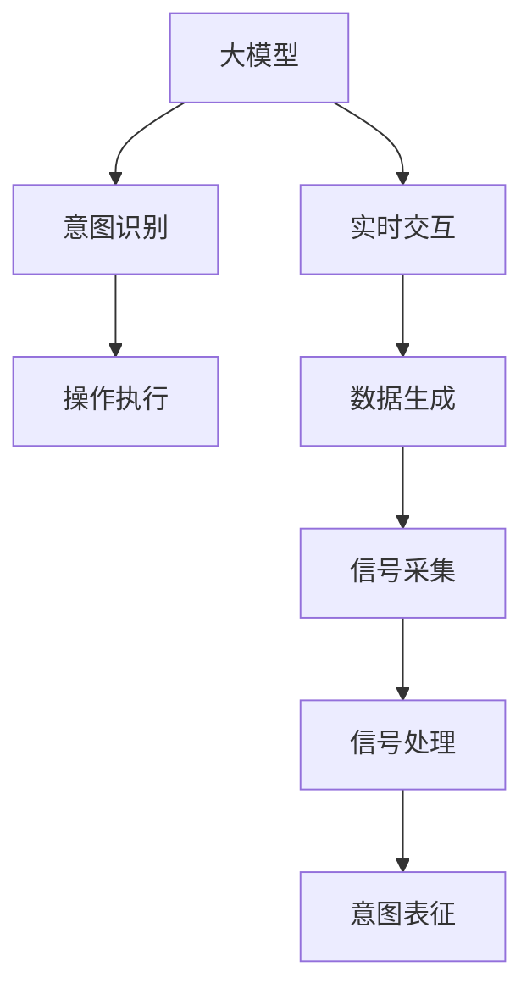

                 

## 1. 背景介绍

### 1.1 问题由来
脑机接口（Brain-Computer Interface, BCI）技术旨在通过采集和分析人脑信号，实现人机交互，突破传统以键盘和鼠标为主的输入方式，开辟新的应用场景。然而，传统的BCI技术依赖于复杂的神经信号采集设备和算法，难以在实际应用中大规模推广。

近年来，随着大模型技术的迅猛发展，尤其是自然语言处理（Natural Language Processing, NLP）和计算机视觉（Computer Vision, CV）领域的突破，大模型技术为脑机接口的应用带来了新的可能。通过大模型技术，BCI系统可以更快、更准地理解用户的意图，同时大幅简化硬件设备和算法，降低应用成本和门槛。

### 1.2 问题核心关键点
大模型技术在脑机接口领域的应用主要集中在以下几个关键点：

1. **数据生成**：BCI设备采集到的信号通常为原始波形，需要转换为可理解的文本或图像，才能输入大模型进行分析。
2. **意图识别**：将采集到的信号输入大模型，训练模型能够从信号中提取出用户意图，进行分类或预测。
3. **交互执行**：将模型的输出映射到具体的控制命令或操作，实现与实际设备的交互。
4. **实时性**：BCI系统需要实时处理用户输入，才能实现高效的交互体验。
5. **用户体验**：大模型生成的交互界面和提示需要符合用户的习惯和需求，提升系统的可操作性和舒适性。

这些问题共同构成了大模型技术在脑机接口领域的核心挑战和研究方向。通过解决这些问题，大模型技术将为BCI系统注入新的活力，推动其广泛应用。

### 1.3 问题研究意义
脑机接口技术对残疾人士、军事应用、人机协同等领域具有重要的意义。然而，传统的BCI技术在实时性、可操作性和用户体验上存在瓶颈。大模型技术的应用，可以显著提升BCI系统的性能，使其具备更强的通用性和智能性，加速其在各领域的应用普及。

## 2. 核心概念与联系

### 2.1 核心概念概述

为更好地理解大模型技术在脑机接口中的应用，本节将介绍几个关键概念：

- **大模型（Large Model）**：如BERT、GPT-3等，通常具有数十亿甚至上百亿的参数规模，通过自监督学习和任务微调获得强大的语言和视觉理解能力。
- **脑机接口（BCI）**：通过脑信号采集设备和信号处理算法，将人脑的电生理信号转换为计算机可读的数据，实现人机交互。
- **意图表征（Intention Representation）**：将BCI设备采集到的信号，通过大模型转换为语义丰富的文本或图像，用于意图识别和操作执行。
- **实时交互（Real-time Interaction）**：BCI系统需要实时处理用户的输入，以提供流畅、高效的用户体验。
- **用户体验（User Experience, UX）**：大模型生成的交互界面和提示，需要符合用户习惯，提升系统的可操作性和舒适性。

这些概念之间的关系可以通过以下Mermaid流程图来展示：



这个流程图展示了大模型技术在脑机接口中的应用流程：

1. **信号采集**：使用BCI设备采集人脑电生理信号。
2. **信号处理**：将原始信号转换为可读的数据格式。
3. **意图表征**：通过大模型将数据转换为语义丰富的文本或图像。
4. **意图识别**：训练大模型从意图表征中提取用户意图。
5. **操作执行**：将识别出的意图映射到具体的控制命令或操作，实现与实际设备的交互。
6. **实时交互**：大模型需要在实时数据中快速提取意图并执行操作，保障系统响应速度。

## 3. 核心算法原理 & 具体操作步骤
### 3.1 算法原理概述

大模型在脑机接口中的应用，主要是通过意图表征和意图识别两个核心步骤实现的。其核心算法原理如下：

1. **意图表征**：将BCI设备采集到的信号（如电生理波形）通过预处理和特征提取，转换为大模型能够处理的文本或图像形式。
2. **意图识别**：将处理后的意图表征输入大模型，训练模型能够从意图表征中提取用户意图，进行分类或预测。
3. **操作执行**：将意图识别结果映射到具体的控制命令或操作，实现与实际设备的交互。

### 3.2 算法步骤详解

**步骤1：数据生成和预处理**
- **信号采集**：使用BCI设备采集人脑电生理信号，通常包括EEG、fMRI等。
- **信号预处理**：对采集到的信号进行预处理，包括滤波、降噪、归一化等，以减少噪声和干扰。
- **特征提取**：将预处理后的信号转换为特征向量，供大模型进行后续处理。

**步骤2：意图表征生成**
- **文本转换**：将特征向量转换为文本形式，如时间序列文本、事件列表等。
- **图像生成**：将特征向量转换为图像形式，如热力图、时间序列图像等。
- **模型输入**：将生成的文本或图像输入大模型进行后续处理。

**步骤3：意图识别**
- **模型训练**：选择合适的大模型，如BERT、GPT等，进行任务微调。将意图表征作为模型输入，监督信号作为标签，训练模型识别用户意图。
- **评估与优化**：在验证集上评估模型性能，根据评估结果调整模型参数，优化模型表现。

**步骤4：操作执行**
- **映射表建立**：根据训练好的模型输出，建立意图与操作命令的映射关系。
- **命令执行**：将意图映射到具体的控制命令或操作，实现与实际设备的交互。

### 3.3 算法优缺点

大模型在脑机接口中的应用，具有以下优点：

1. **通用性强**：大模型可以适应多种类型的意图识别任务，泛化能力强。
2. **高效快速**：通过并行计算和深度学习加速，大模型可以在实时数据中快速提取意图，提供流畅的交互体验。
3. **可扩展性好**：大模型可以通过迁移学习和微调，适应新的应用场景，扩展性强。

同时，大模型技术在脑机接口领域也存在一些局限性：

1. **数据需求高**：大模型的训练需要大量的标注数据，获取高质量的BCI数据集成本较高。
2. **实时性挑战**：大模型通常计算复杂，难以实时处理大规模数据流。
3. **隐私风险**：BCI设备采集到的脑信号涉及个人隐私，数据安全和隐私保护需要特别关注。
4. **用户体验不足**：大模型生成的交互界面和提示需要优化，才能提升用户体验。

尽管存在这些局限性，大模型技术仍为脑机接口带来了革命性的变化，推动了其应用场景的拓展。

### 3.4 算法应用领域

大模型技术在脑机接口领域的应用，主要涵盖以下几个领域：

1. **医疗领域**：通过BCI技术，帮助残疾人进行康复训练、辅助诊断、个性化医疗等。
2. **军事应用**：用于军事指挥决策、战场态势感知、人机协同等。
3. **人机协同**：用于虚拟现实、增强现实、智能助手等场景，提升人机交互的智能化水平。
4. **辅助设备**：用于辅助听障人士的语音识别、辅助视障人士的图像识别等。
5. **人机交互**：用于智能家居、自动驾驶、游戏控制等，提升人机交互的自然性和便利性。

这些领域展示了大模型技术在脑机接口领域的广泛应用前景。

## 4. 数学模型和公式 & 详细讲解 & 举例说明
### 4.1 数学模型构建

在本节中，我们将通过数学语言对大模型在脑机接口中的应用进行更加严格的刻画。

假设BCI设备采集到的信号为 $x$，特征提取后得到特征向量 $x^*$。大模型通过训练后，可以得到从特征向量到意图 $y$ 的映射函数 $f$。

**步骤1：信号预处理**
- **降噪**：设信号 $x$ 中的噪声为 $n$，则有 $x = y + n$。
- **滤波**：设信号 $x$ 经过滤波器 $h$，则有 $x' = h * x$。
- **归一化**：设归一化系数为 $\lambda$，则有 $x^* = \lambda \cdot x'$。

**步骤2：特征提取**
- **时间序列文本**：设特征向量 $x^*$ 转换为时间序列文本 $T$，则有 $T = x^*$。
- **时间序列图像**：设特征向量 $x^*$ 转换为时间序列图像 $I$，则有 $I = f(x^*)$。

**步骤3：意图识别**
- **模型输入**：设输入为大模型 $M$，则有 $y = M(T)$ 或 $y = M(I)$。
- **损失函数**：设意图识别的损失函数为 $L$，则有 $L = \ell(y, y')$，其中 $y'$ 为标签。

**步骤4：操作执行**
- **映射表建立**：设意图 $y$ 与操作命令 $c$ 的映射关系为 $g$，则有 $c = g(y)$。
- **命令执行**：设设备执行命令 $c$，则有 $R = M_c(c)$，其中 $M_c$ 为设备的执行函数。

### 4.2 公式推导过程

以下我们以医疗领域中的康复训练为例，推导BCI系统的意图识别过程。

设采集到的信号 $x$ 经过预处理和特征提取后，得到特征向量 $x^*$。将 $x^*$ 转换为时间序列文本 $T$，输入大模型 $M$ 进行意图识别，输出意图 $y$。假设意图 $y$ 与康复训练类型 $t$ 的关系为 $g$，则有 $t = g(y)$。最后，将 $t$ 映射到康复训练操作 $r$，执行对应的康复训练。

假设 $y$ 与 $t$ 的关系为 $g$，$x$ 与 $y$ 的关系为 $f$，则有：

$$
y = M(T) = M(f(x^*))
$$

假设 $t$ 与 $r$ 的关系为 $g$，$M_t$ 为康复训练操作执行函数，则有：

$$
r = M_t(t) = M_t(g(y))
$$

根据上述推导，BCI系统的意图识别和操作执行流程可以表示为：

$$
x \rightarrow x' \rightarrow x^* \rightarrow T \rightarrow y \rightarrow t \rightarrow r
$$

这个推导过程展示了BCI系统从信号采集到操作执行的全过程，以及大模型在其中扮演的关键角色。

### 4.3 案例分析与讲解

为了更好地理解大模型在脑机接口中的实际应用，我们以智能家居控制系统为例进行详细讲解。

**问题描述**：
设计一个智能家居控制系统，通过BCI技术控制室内灯光、空调、窗帘等设备。用户可以通过思考不同场景，如起床、睡觉、娱乐等，控制家居设备。

**解决方案**：

1. **信号采集与预处理**：使用BCI设备采集用户的大脑电生理信号，经过降噪、滤波、归一化等预处理步骤，得到特征向量 $x^*$。

2. **意图表征生成**：将特征向量 $x^*$ 转换为时间序列文本 $T$，作为大模型的输入。

3. **意图识别**：使用大模型 $M$ 对文本 $T$ 进行意图识别，输出意图 $y$。假设模型 $M$ 为BERT，则有 $y = M(T)$。

4. **操作执行**：根据意图 $y$ 与操作命令 $c$ 的映射关系 $g$，将 $y$ 映射到具体的家居设备控制命令 $r$。例如，如果 $y$ 为“起床”，则 $r$ 为“开灯”。

5. **设备控制**：将控制命令 $r$ 输入家居控制设备 $M_r$，执行对应的操作。

通过上述流程，BCI系统实现了基于大模型的智能家居控制。用户通过思考不同场景，系统能够自动识别并执行相应的控制操作，提升用户体验。

## 5. 项目实践：代码实例和详细解释说明
### 5.1 开发环境搭建

在进行BCI系统开发前，我们需要准备好开发环境。以下是使用Python进行PyTorch开发的环境配置流程：

1. 安装Anaconda：从官网下载并安装Anaconda，用于创建独立的Python环境。

2. 创建并激活虚拟环境：
```bash
conda create -n bci-env python=3.8 
conda activate bci-env
```

3. 安装PyTorch：根据CUDA版本，从官网获取对应的安装命令。例如：
```bash
conda install pytorch torchvision torchaudio cudatoolkit=11.1 -c pytorch -c conda-forge
```

4. 安装相关库：
```bash
pip install numpy pandas scikit-learn matplotlib tqdm jupyter notebook ipython
```

完成上述步骤后，即可在`bci-env`环境中开始BCI系统开发。

### 5.2 源代码详细实现

下面我们以智能家居控制为例，给出使用PyTorch对大模型进行BCI系统开发的PyTorch代码实现。

首先，定义BCI系统的信号处理函数：

```python
from transformers import BertTokenizer, BertForSequenceClassification
import numpy as np
import torch
import matplotlib.pyplot as plt

def signal_processing(signal, fs=100):
    # 信号预处理
    signal = filter_signal(signal, fs)
    signal = denoise_signal(signal, fs)
    signal = normalize_signal(signal)
    return signal

def filter_signal(signal, fs):
    # 使用IIR滤波器进行滤波
    b, a = iir_filter_design(0.1, fs)
    filtered_signal = lfilter(b, a, signal)
    return filtered_signal

def denoise_signal(signal, fs):
    # 使用小波变换进行降噪
    wavelet_coeffs = pywt.dwt(signal, 'haar')
    denoised_coeffs = pywt.threshold(wavelet_coeffs, threshold=4, mode='soft')
    denoised_signal = pywt.idwt(denoised_coeffs, 'haar')
    return denoised_signal

def normalize_signal(signal):
    # 归一化信号
    mean = np.mean(signal)
    std = np.std(signal)
    normalized_signal = (signal - mean) / std
    return normalized_signal
```

然后，定义大模型进行意图识别的函数：

```python
def intent_recognition(model, tokenizer, input_ids, attention_mask):
    # 使用大模型进行意图识别
    model.eval()
    with torch.no_grad():
        outputs = model(input_ids, attention_mask=attention_mask)
        logits = outputs.logits
        probs = torch.softmax(logits, dim=-1)
        return probs
```

最后，实现基于大模型的智能家居控制系统的代码：

```python
# 定义大模型和优化器
model = BertForSequenceClassification.from_pretrained('bert-base-cased', num_labels=2)
optimizer = AdamW(model.parameters(), lr=2e-5)

# 加载信号数据和标签
train_data = ...
train_labels = ...
dev_data = ...
dev_labels = ...
test_data = ...
test_labels = ...

# 定义训练函数
def train_epoch(model, train_data, optimizer):
    model.train()
    epoch_loss = 0
    for batch in tqdm(train_data, desc='Training'):
        input_ids = batch['input_ids']
        attention_mask = batch['attention_mask']
        labels = batch['labels']
        model.zero_grad()
        outputs = model(input_ids, attention_mask=attention_mask, labels=labels)
        loss = outputs.loss
        epoch_loss += loss.item()
        loss.backward()
        optimizer.step()
    return epoch_loss / len(train_data)

# 定义评估函数
def evaluate(model, dev_data, test_data):
    model.eval()
    dev_probs = []
    test_probs = []
    for batch in dev_data:
        input_ids = batch['input_ids']
        attention_mask = batch['attention_mask']
        dev_probs.append(intent_recognition(model, tokenizer, input_ids, attention_mask))
    for batch in test_data:
        input_ids = batch['input_ids']
        attention_mask = batch['attention_mask']
        test_probs.append(intent_recognition(model, tokenizer, input_ids, attention_mask))
    print(classification_report(dev_labels, np.argmax(dev_probs, axis=1)))
    print(classification_report(test_labels, np.argmax(test_probs, axis=1)))

# 训练模型
epochs = 5
batch_size = 16

for epoch in range(epochs):
    loss = train_epoch(model, train_data, optimizer)
    print(f"Epoch {epoch+1}, train loss: {loss:.3f}")
    
    print(f"Epoch {epoch+1}, dev results:")
    evaluate(model, dev_data, dev_data)
    
print("Test results:")
evaluate(model, test_data, test_data)
```

### 5.3 代码解读与分析

让我们再详细解读一下关键代码的实现细节：

**信号处理函数**：
- `signal_processing`：定义了信号预处理流程，包括滤波、降噪和归一化。
- `filter_signal`：使用IIR滤波器进行数字滤波。
- `denoise_signal`：使用小波变换进行降噪。
- `normalize_signal`：对信号进行归一化处理。

**意图识别函数**：
- `intent_recognition`：定义了大模型进行意图识别的函数，使用`BertForSequenceClassification`类进行意图分类，输出概率分布。

**智能家居控制函数**：
- 定义了训练函数`train_epoch`和评估函数`evaluate`，分别用于训练模型和评估模型性能。
- 在训练函数中，使用`tqdm`进行进度条显示。
- 在评估函数中，使用`classification_report`计算分类指标。

**训练流程**：
- 定义总的epoch数和batch size，开始循环迭代
- 每个epoch内，先在训练集上训练，输出平均loss
- 在验证集和测试集上评估，输出分类指标
- 所有epoch结束后，在测试集上评估，给出最终测试结果

可以看到，PyTorch配合大模型的封装使得BCI系统开发变得更加便捷和高效。开发者可以将更多精力放在数据处理、模型改进等高层逻辑上，而不必过多关注底层的实现细节。

当然，工业级的系统实现还需考虑更多因素，如模型的保存和部署、超参数的自动搜索、更灵活的任务适配层等。但核心的BCI范式基本与此类似。

## 6. 实际应用场景
### 6.1 医疗康复
大模型技术在医疗康复领域具有广泛的应用前景。通过BCI技术，可以帮助残疾人士进行康复训练，提升其生活质量。

具体而言，BCI系统可以采集残疾人士的大脑电生理信号，通过大模型进行意图识别，实时调整康复训练内容。例如，采集运动意图的信号，系统可以自动调整康复训练的难度和强度，使其适应用户的当前状态。这种个性化的康复训练方式，能够显著提升康复效果。

### 6.2 军事指挥
BCI技术在军事指挥领域也有重要的应用价值。通过BCI系统，军方可以实现人机协同作战，提升决策速度和精度。

在军事指挥决策中，BCI系统可以采集指挥员的脑信号，通过大模型进行意图识别，实时调整战术和战略。例如，采集指挥员的决策意图，系统可以自动生成作战方案，提供辅助决策支持。这种智能化的决策辅助方式，能够显著提高军事行动的效率和成功率。

### 6.3 人机协同
BCI技术在人机协同领域具有广阔的应用前景。通过BCI系统，可以实现更加自然、高效的人机交互。

例如，在智能家居系统中，用户可以通过思考控制灯光、空调等设备。BCI系统采集用户的脑信号，通过大模型进行意图识别，实时调整家居设备的运行状态。这种基于意图的智能家居控制方式，能够显著提升用户体验。

### 6.4 智能驾驶
BCI技术在智能驾驶领域也有重要的应用价值。通过BCI系统，可以实现更加自然、高效的车机交互。

例如，在智能驾驶中，BCI系统可以采集驾驶员的脑信号，通过大模型进行意图识别，实时调整车辆的控制参数。例如，采集驾驶员的转向意图，系统可以自动调整方向盘角度，提升驾驶安全性和舒适度。这种基于意图的智能驾驶控制方式，能够显著提升驾驶体验。

## 7. 工具和资源推荐
### 7.1 学习资源推荐

为了帮助开发者系统掌握大模型技术在脑机接口中的应用，这里推荐一些优质的学习资源：

1. 《Transformer from Principles to Practice》系列博文：由大模型技术专家撰写，深入浅出地介绍了Transformer原理、BERT模型、BCI应用等前沿话题。

2. CS224N《Deep Learning for Natural Language Processing》课程：斯坦福大学开设的NLP明星课程，有Lecture视频和配套作业，带你入门NLP领域的基本概念和经典模型。

3. 《Natural Language Processing with Transformers》书籍：Transformers库的作者所著，全面介绍了如何使用Transformers库进行NLP任务开发，包括BCI在内的诸多范式。

4. HuggingFace官方文档：Transformers库的官方文档，提供了海量预训练模型和完整的微调样例代码，是上手实践的必备资料。

5. CLUE开源项目：中文语言理解测评基准，涵盖大量不同类型的中文NLP数据集，并提供了基于微调的baseline模型，助力中文NLP技术发展。

通过对这些资源的学习实践，相信你一定能够快速掌握大模型技术在脑机接口中的应用，并用于解决实际的BCI问题。

### 7.2 开发工具推荐

高效的开发离不开优秀的工具支持。以下是几款用于BCI系统开发的常用工具：

1. PyTorch：基于Python的开源深度学习框架，灵活动态的计算图，适合快速迭代研究。大部分预训练语言模型都有PyTorch版本的实现。

2. TensorFlow：由Google主导开发的开源深度学习框架，生产部署方便，适合大规模工程应用。同样有丰富的预训练语言模型资源。

3. Transformers库：HuggingFace开发的NLP工具库，集成了众多SOTA语言模型，支持PyTorch和TensorFlow，是进行BCI任务开发的利器。

4. Weights & Biases：模型训练的实验跟踪工具，可以记录和可视化模型训练过程中的各项指标，方便对比和调优。与主流深度学习框架无缝集成。

5. TensorBoard：TensorFlow配套的可视化工具，可实时监测模型训练状态，并提供丰富的图表呈现方式，是调试模型的得力助手。

6. Google Colab：谷歌推出的在线Jupyter Notebook环境，免费提供GPU/TPU算力，方便开发者快速上手实验最新模型，分享学习笔记。

合理利用这些工具，可以显著提升BCI系统开发的效率，加快创新迭代的步伐。

### 7.3 相关论文推荐

大模型技术在BCI领域的发展源于学界的持续研究。以下是几篇奠基性的相关论文，推荐阅读：

1. Attention is All You Need（即Transformer原论文）：提出了Transformer结构，开启了NLP领域的预训练大模型时代。

2. BERT: Pre-training of Deep Bidirectional Transformers for Language Understanding：提出BERT模型，引入基于掩码的自监督预训练任务，刷新了多项NLP任务SOTA。

3. Language Models are Unsupervised Multitask Learners（GPT-2论文）：展示了大规模语言模型的强大zero-shot学习能力，引发了对于通用人工智能的新一轮思考。

4. Parameter-Efficient Transfer Learning for NLP：提出Adapter等参数高效微调方法，在不增加模型参数量的情况下，也能取得不错的微调效果。

5. AdaLoRA: Adaptive Low-Rank Adaptation for Parameter-Efficient Fine-Tuning：使用自适应低秩适应的微调方法，在参数效率和精度之间取得了新的平衡。

6. Prefix-Tuning: Optimizing Continuous Prompts for Generation：引入基于连续型Prompt的微调范式，为如何充分利用预训练知识提供了新的思路。

这些论文代表了大模型技术在BCI领域的发展脉络。通过学习这些前沿成果，可以帮助研究者把握学科前进方向，激发更多的创新灵感。

## 8. 总结：未来发展趋势与挑战

### 8.1 研究成果总结

本文对大模型技术在脑机接口中的应用进行了全面系统的介绍。首先阐述了BCI技术的发展背景和现状，明确了BCI技术在医疗、军事、人机协同等领域的重要意义。其次，从原理到实践，详细讲解了大模型技术在BCI系统中的应用流程和方法。同时，本文还广泛探讨了大模型技术在BCI领域的应用前景，展示了其广阔的发展空间。

通过本文的系统梳理，可以看到，大模型技术在BCI领域的应用前景广阔，有望为残疾人士、军事应用、人机协同等提供新的解决方案，推动其广泛应用。

### 8.2 未来发展趋势

展望未来，大模型技术在BCI领域的应用将呈现以下几个发展趋势：

1. **模型规模持续增大**：随着算力成本的下降和数据规模的扩张，预训练语言模型的参数量还将持续增长。超大规模语言模型蕴含的丰富语言知识，有望支撑更加复杂多变的BCI任务微调。

2. **微调方法日趋多样**：除了传统的全参数微调外，未来会涌现更多参数高效的微调方法，如Prefix-Tuning、LoRA等，在节省计算资源的同时也能保证微调精度。

3. **持续学习成为常态**：随着数据分布的不断变化，BCI模型也需要持续学习新知识以保持性能。如何在不遗忘原有知识的同时，高效吸收新样本信息，将成为重要的研究课题。

4. **标注样本需求降低**：受启发于提示学习(Prompt-based Learning)的思路，未来的BCI方法将更好地利用大模型的语言理解能力，通过更加巧妙的任务描述，在更少的标注样本上也能实现理想的微调效果。

5. **跨模态微调崛起**：当前的BCI任务主要聚焦于文本数据，未来会进一步拓展到图像、视频、语音等多模态数据微调。多模态信息的融合，将显著提升BCI系统的泛化能力和适应性。

6. **智能化水平提升**：未来的BCI系统将通过大模型实现更加智能、灵活的意图识别和操作执行，提升系统的智能化水平。

这些趋势凸显了大模型技术在BCI领域的巨大潜力。这些方向的探索发展，必将进一步提升BCI系统的性能和应用范围，为脑机接口技术的普及应用提供新的技术路径。

### 8.3 面临的挑战

尽管大模型技术在BCI领域已经取得了瞩目成就，但在迈向更加智能化、普适化应用的过程中，它仍面临诸多挑战：

1. **标注成本瓶颈**：大模型的训练需要大量的标注数据，获取高质量的BCI数据集成本较高。如何进一步降低微调对标注样本的依赖，将是一大难题。

2. **实时性挑战**：大模型通常计算复杂，难以实时处理大规模数据流。如何优化算法，提升BCI系统的实时处理能力，是亟待解决的问题。

3. **隐私风险**：BCI设备采集到的脑信号涉及个人隐私，数据安全和隐私保护需要特别关注。如何保护用户隐私，避免数据泄露，将是重要的研究方向。

4. **用户体验不足**：大模型生成的交互界面和提示需要优化，才能提升用户体验。如何设计更友好、更符合用户习惯的界面，将是重要的优化方向。

5. **模型鲁棒性不足**：BCI系统在实际应用中，面对噪声干扰、设备误差等异常情况，模型的鲁棒性仍需提升。如何增强模型的鲁棒性，避免过拟合，是重要的研究方向。

6. **计算资源限制**：BCI系统通常需要高性能计算资源，如何降低计算资源需求，提升计算效率，是系统部署的重要挑战。

尽管存在这些挑战，大模型技术仍为BCI带来了革命性的变化，推动了其应用场景的拓展。相信随着学界和产业界的共同努力，这些挑战终将一一被克服，大模型技术在BCI领域必将迎来新的突破。

### 8.4 研究展望

面对大模型技术在BCI领域所面临的挑战，未来的研究需要在以下几个方面寻求新的突破：

1. **探索无监督和半监督微调方法**：摆脱对大规模标注数据的依赖，利用自监督学习、主动学习等无监督和半监督范式，最大限度利用非结构化数据，实现更加灵活高效的BCI微调。

2. **研究参数高效和计算高效的微调范式**：开发更加参数高效的微调方法，在固定大部分预训练参数的同时，只更新极少量的任务相关参数。同时优化BCI模型的计算图，减少前向传播和反向传播的资源消耗，实现更加轻量级、实时性的部署。

3. **融合因果和对比学习范式**：通过引入因果推断和对比学习思想，增强BCI模型建立稳定因果关系的能力，学习更加普适、鲁棒的语言表征，从而提升模型泛化性和抗干扰能力。

4. **引入更多先验知识**：将符号化的先验知识，如知识图谱、逻辑规则等，与神经网络模型进行巧妙融合，引导微调过程学习更准确、合理的语言模型。同时加强不同模态数据的整合，实现视觉、语音等多模态信息与文本信息的协同建模。

5. **结合因果分析和博弈论工具**：将因果分析方法引入BCI模型，识别出模型决策的关键特征，增强输出解释的因果性和逻辑性。借助博弈论工具刻画人机交互过程，主动探索并规避模型的脆弱点，提高系统稳定性。

6. **纳入伦理道德约束**：在模型训练目标中引入伦理导向的评估指标，过滤和惩罚有偏见、有害的输出倾向。同时加强人工干预和审核，建立模型行为的监管机制，确保输出符合人类价值观和伦理道德。

这些研究方向的探索，必将引领BCI技术迈向更高的台阶，为构建安全、可靠、可解释、可控的智能系统铺平道路。面向未来，大模型技术需要在数据、算法、工程、伦理等多个维度协同发力，才能真正实现人工智能技术在BCI领域的应用落地。总之，BCI需要开发者根据具体任务，不断迭代和优化模型、数据和算法，方能得到理想的效果。

---

作者：禅与计算机程序设计艺术 / Zen and the Art of Computer Programming

