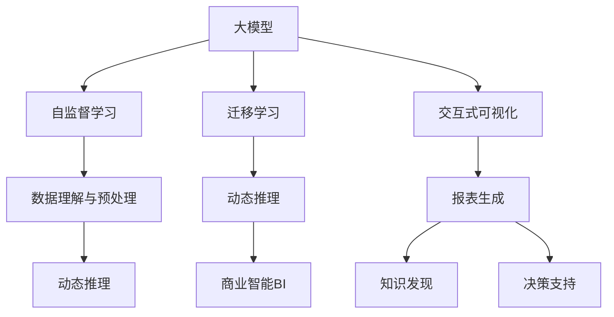

                 

# 大模型时代下的新型商业智能

在大模型时代，商业智能(BI)正处于深刻的变革之中。传统的BI系统基于统计学和SQL等传统方法，主要依赖人工提取数据、构建模型、解释结果等步骤。而随着深度学习和大模型的兴起，新型商业智能(NBIS)应运而生，以其强大的自我学习和推理能力，正在重塑BI领域的技术格局。

本文将系统地探讨大模型时代下新型商业智能的核心原理与实现路径，详细介绍大模型的基础算法、核心组件、应用场景及未来发展趋势，并通过代码实例和详细解释，帮助读者深入理解新型商业智能的技术细节和实际应用。

## 1. 背景介绍

### 1.1 问题由来

随着互联网和移动互联网的普及，数据量呈指数级增长，商业智能需求也随之水涨船高。传统的BI系统已经无法应对海量数据的实时处理和智能分析需求。在此背景下，深度学习和大模型成为新的技术突破口，推动了商业智能领域的深刻变革。

大模型通过自监督或监督学习的方式，在大规模数据上进行了预先训练，学习到了丰富的知识表示和推理能力。这些大模型具备以下优势：

1. 自动学习数据规律，无需人工提取特征。
2. 可以处理复杂结构化的数据，如文本、图像、视频等。
3. 支持端到端的数据分析和推理，省去了中间的人工干预环节。
4. 能实时响应海量数据流，支持实时查询和更新。

### 1.2 问题核心关键点

新型商业智能(NBIS)在大模型的基础上，进一步提升了BI系统的智能化水平，其核心关键点如下：

1. 数据理解与预处理：利用大模型的语言理解能力，自动提取和处理多模态数据。
2. 动态推理与预测：通过模型预测未来趋势和因果关系，支持决策支持系统。
3. 高效智能分析：结合自动学习与人类经验，实现智能报表生成和知识发现。
4. 交互式可视化：借助自然语言交互技术，提升报表生成和数据理解的便捷性。

本文将围绕这些核心关键点，深入探讨大模型时代下新型商业智能的原理与实现。

## 2. 核心概念与联系

### 2.1 核心概念概述

本节将介绍大模型时代下新型商业智能(NBIS)所需的一些核心概念：

1. **大模型**：如BERT、GPT、DALL·E等，通过大规模数据训练，学习到丰富的语言、视觉、音频等多模态表示能力。
2. **商业智能(BI)**：利用数据分析、统计、机器学习等技术，帮助企业从数据中提取有价值的信息，辅助决策。
3. **自监督学习**：在大规模无标签数据上进行预训练，无需人工标注，利用数据内在的规律进行学习。
4. **迁移学习**：利用大模型在不同任务间的迁移能力，减少特定任务的数据需求。
5. **动态推理**：基于模型对新数据的推理能力，自动进行趋势预测和因果分析。
6. **交互式可视化**：通过自然语言交互，使报表生成和数据理解更加便捷。

这些核心概念相互联系，共同构成了大模型时代下新型商业智能的基础框架。

### 2.2 核心概念原理和架构的 Mermaid 流程图



这个流程图展示了新型商业智能(NBIS)的核心概念及其之间的关系：

1. 大模型通过自监督学习获得基础知识表示。
2. 迁移学习使得大模型能够适应特定任务。
3. 动态推理利用模型对新数据的理解，进行趋势预测和因果分析。
4. 交互式可视化提升了报表生成和数据理解的便捷性。
5. 商业智能BI系统基于以上模块，实现高效的数据分析和决策支持。

## 3. 核心算法原理 & 具体操作步骤

### 3.1 算法原理概述

新型商业智能(NBIS)的核心算法原理主要基于大模型的迁移学习能力和动态推理能力。具体来说，NBIS系统通过以下步骤实现：

1. 利用大模型在无标签数据上自监督预训练，获得通用的知识表示。
2. 根据特定任务的数据集，对大模型进行迁移学习，微调其参数以适应该任务。
3. 通过模型对新数据的推理，自动进行趋势预测和因果分析。
4. 利用自然语言交互技术，实现报表生成和数据理解的便捷性。

### 3.2 算法步骤详解

#### 3.2.1 数据理解与预处理

在数据理解与预处理阶段，NBIS系统首先需要将多模态数据转换为模型可接受的格式，并进行必要的特征提取。具体步骤如下：

1. **数据采集**：从不同的数据源（如数据库、文件、API等）采集数据。
2. **数据清洗**：去除重复、缺失、异常等无用数据，确保数据质量。
3. **特征提取**：利用大模型的语言理解能力，自动提取文本、图像、视频等多模态数据的特征。
4. **数据增强**：通过数据增强技术（如回译、近义替换等）丰富数据集。

#### 3.2.2 迁移学习

在迁移学习阶段，NBIS系统利用大模型在不同任务间的迁移能力，减少特定任务的数据需求。具体步骤如下：

1. **任务定义**：明确商业智能系统的具体任务，如客户分析、市场预测、销售预测等。
2. **模型选择**：根据任务需求，选择合适的预训练大模型（如BERT、GPT等）。
3. **数据准备**：准备特定任务的数据集，进行必要的标注和清洗。
4. **模型微调**：利用任务数据集，对预训练大模型进行微调，适应特定任务。

#### 3.2.3 动态推理

在动态推理阶段，NBIS系统利用模型对新数据的推理能力，进行趋势预测和因果分析。具体步骤如下：

1. **模型推理**：输入新数据到微调后的模型，得到预测结果。
2. **因果分析**：利用模型提取的因果关系，分析预测结果的生成原因。
3. **趋势预测**：根据历史数据和当前数据，预测未来的趋势。

#### 3.2.4 交互式可视化

在交互式可视化阶段，NBIS系统利用自然语言交互技术，提升报表生成和数据理解的便捷性。具体步骤如下：

1. **报表生成**：根据用户需求，自动生成动态报表和可视化结果。
2. **自然语言交互**：通过自然语言交互技术（如Chatbot、NLG等），实现人与系统的自然交互。
3. **知识发现**：利用模型的推理能力，自动发现数据中的隐含知识。

### 3.3 算法优缺点

#### 3.3.1 优点

1. **自监督学习**：无需人工标注数据，大大降低了标注成本。
2. **多模态处理**：可以处理文本、图像、视频等多模态数据，提供更丰富的信息。
3. **端到端分析**：自动完成数据提取、模型训练、结果推理，省去了人工干预环节。
4. **实时响应**：支持实时数据处理和预测，及时响应业务需求。

#### 3.3.2 缺点

1. **数据依赖**：依赖高质量的数据，数据获取和处理成本较高。
2. **模型复杂**：大模型参数量大，对硬件要求较高。
3. **可解释性**：模型的决策过程缺乏可解释性，难以解释其内部工作机制。

### 3.4 算法应用领域

新型商业智能(NBIS)在多个领域得到了广泛应用，以下是一些典型案例：

1. **客户分析**：利用客户历史行为数据，预测客户流失风险，制定个性化营销策略。
2. **市场预测**：通过分析市场趋势和消费者行为，预测市场变化，辅助决策。
3. **销售预测**：根据销售历史数据和市场动态，预测未来销售额，优化库存管理。
4. **供应链管理**：分析供应链数据，预测物料需求，优化物流和生产计划。
5. **财务分析**：利用财务报表和市场数据，进行财务风险评估和投资分析。

## 4. 数学模型和公式 & 详细讲解 & 举例说明

### 4.1 数学模型构建

新型商业智能(NBIS)的数学模型构建主要围绕以下三个方面进行：

1. **数据表示**：将多模态数据转换为模型可接受的格式，如文本向量、图像向量等。
2. **模型训练**：利用大模型的迁移学习能力，对特定任务进行微调。
3. **动态推理**：通过模型的预测能力，进行趋势预测和因果分析。

### 4.2 公式推导过程

#### 4.2.1 数据表示

假设有一组文本数据 $\{x_i\}_{i=1}^N$，表示为向量形式，每个文本 $x_i$ 表示为一个 $d$ 维向量 $\vec{x_i} \in \mathbb{R}^d$。

#### 4.2.2 模型训练

假设选择的预训练大模型为 $M_{\theta}$，其中 $\theta$ 为模型参数。具体模型训练步骤如下：

1. **损失函数**：定义损失函数 $\mathcal{L}(\theta)$，用于衡量模型在新数据上的预测与真实标签之间的差异。
2. **优化器**：选择优化算法（如Adam、SGD等），设定学习率 $\eta$ 和正则化系数 $\lambda$。
3. **梯度更新**：通过反向传播算法，计算损失函数对参数 $\theta$ 的梯度，更新模型参数。

#### 4.2.3 动态推理

假设输入新数据 $x_{new}$，通过微调后的模型 $M_{\hat{\theta}}$ 进行推理，得到预测结果 $\hat{y}$。预测结果与真实标签 $y$ 之间的差异用损失函数 $\ell$ 衡量。

### 4.3 案例分析与讲解

以客户流失预测为例，介绍NBIS系统的应用流程。

1. **数据采集**：从CRM系统中获取客户历史行为数据，如购买记录、投诉记录等。
2. **数据清洗**：去除缺失、异常数据，确保数据质量。
3. **特征提取**：利用BERT模型自动提取文本特征，转换为向量表示。
4. **模型训练**：选择BERT模型，在标注数据集上进行微调。
5. **动态推理**：输入新客户数据，通过微调后的模型进行预测，得到流失概率。
6. **报表生成**：根据预测结果，生成流失风险报表，辅助决策。

## 5. 项目实践：代码实例和详细解释说明

### 5.1 开发环境搭建

在进行NBIS项目开发前，需要先搭建好开发环境。以下是使用Python和PyTorch进行环境配置的步骤：

1. 安装Anaconda，创建虚拟环境。
2. 安装PyTorch和相关工具包，如TensorBoard、Weights & Biases等。
3. 配置GPU环境，以便进行深度学习模型的训练和推理。

### 5.2 源代码详细实现

以下是一个简单的NBIS系统代码实现，以客户流失预测为例：

```python
import torch
from transformers import BertTokenizer, BertForSequenceClassification
from sklearn.metrics import classification_report

# 准备数据
tokenizer = BertTokenizer.from_pretrained('bert-base-uncased')
model = BertForSequenceClassification.from_pretrained('bert-base-uncased', num_labels=2)
train_data = ...
test_data = ...

# 数据预处理
train_encodings = tokenizer(train_data, padding='max_length', truncation=True, max_length=128)
train_labels = train_data[:, 0]
test_encodings = tokenizer(test_data, padding='max_length', truncation=True, max_length=128)
test_labels = test_data[:, 0]

# 模型训练
model.train()
optimizer = torch.optim.Adam(model.parameters(), lr=2e-5)
for epoch in range(10):
    for batch in train_encodings:
        inputs = {key: torch.tensor(val) for key, val in batch.items()}
        outputs = model(**inputs)
        loss = outputs.loss
        loss.backward()
        optimizer.step()
    train_loss = ...

# 模型评估
model.eval()
with torch.no_grad():
    predictions = []
    labels = []
    for batch in test_encodings:
        inputs = {key: torch.tensor(val) for key, val in batch.items()}
        outputs = model(**inputs)
        predictions.append(outputs.logits.argmax(dim=1))
        labels.append(test_labels)
    test_loss = ...
    classification_report(labels, predictions)
```

### 5.3 代码解读与分析

上述代码展示了NBIS系统的一个基本流程，包括数据预处理、模型训练、模型评估等步骤。

- **数据预处理**：使用BERT分词器对文本数据进行分词和编码，得到输入特征。
- **模型训练**：使用Adam优化器对模型进行训练，设定学习率。
- **模型评估**：在测试集上评估模型的性能，输出分类报告。

## 6. 实际应用场景

### 6.1 客户分析

利用NBIS系统，企业可以对客户行为进行深度分析，预测客户流失风险，制定个性化营销策略。具体应用如下：

1. **客户行为分析**：通过分析客户历史行为数据，发现客户兴趣点、购买偏好等特征。
2. **流失风险预测**：利用预测模型，预测客户流失概率，识别高风险客户。
3. **个性化营销**：根据流失风险，制定个性化的营销策略，提升客户粘性。

### 6.2 市场预测

市场预测是企业决策支持的重要环节，NBIS系统可以通过以下步骤实现：

1. **市场趋势分析**：利用历史市场数据，分析市场趋势变化。
2. **销售预测**：根据趋势数据，预测未来销售额，优化库存管理。
3. **市场策略调整**：根据预测结果，调整市场策略，规避风险。

### 6.3 财务分析

财务分析是企业财务管理的重要工具，NBIS系统可以通过以下步骤实现：

1. **财务报表分析**：利用财务报表数据，分析企业财务状况。
2. **风险评估**：根据财务数据，评估企业财务风险。
3. **投资分析**：利用预测模型，进行投资决策分析。

### 6.4 供应链管理

供应链管理涉及物料需求预测、物流计划等多个环节，NBIS系统可以通过以下步骤实现：

1. **物料需求预测**：利用历史需求数据，预测未来物料需求。
2. **物流计划优化**：根据需求预测，优化物流计划，降低成本。
3. **库存管理**：根据需求预测，优化库存水平，提高供应链效率。

## 7. 工具和资源推荐

### 7.1 学习资源推荐

1. 《深度学习》一书，涵盖深度学习基础和实践。
2. 《NLP with PyTorch》一书，介绍利用PyTorch进行自然语言处理。
3. CS231n《深度学习视觉表示与卷积神经网络》课程，学习图像处理的深度学习模型。
4. HuggingFace官方文档，提供丰富的预训练模型和微调示例。

### 7.2 开发工具推荐

1. PyTorch：Python深度学习框架，支持动态计算图。
2. TensorFlow：Google主导的深度学习框架，支持分布式计算。
3. Weights & Biases：模型训练实验跟踪工具，记录和可视化训练过程。
4. TensorBoard：TensorFlow配套的可视化工具，实时监测训练状态。

### 7.3 相关论文推荐

1. Attention is All You Need（Transformer论文）。
2. BERT: Pre-training of Deep Bidirectional Transformers for Language Understanding。
3. Parameter-Efficient Transfer Learning for NLP。
4. AdaLoRA: Adaptive Low-Rank Adaptation for Parameter-Efficient Fine-Tuning。
5. Prefix-Tuning: Optimizing Continuous Prompts for Generation。

## 8. 总结：未来发展趋势与挑战

### 8.1 研究成果总结

新型商业智能(NBIS)利用大模型的知识表示和推理能力，实现了高效的数据理解和智能分析，成为企业决策支持的重要工具。目前，NBIS在客户分析、市场预测、财务分析等多个领域得到了广泛应用。

### 8.2 未来发展趋势

1. **自监督学习**：未来NBIS系统将更多地利用自监督学习，减少标注数据需求。
2. **多模态处理**：随着图像、视频等非文本数据的增加，NBIS系统将支持更多模态数据处理。
3. **因果推理**：引入因果推理技术，增强预测结果的解释性和可解释性。
4. **端到端分析**：结合自监督学习和迁移学习，实现更高效的端到端分析。
5. **实时响应**：支持实时数据流处理和预测，及时响应业务需求。

### 8.3 面临的挑战

1. **数据获取成本**：高质量的数据获取和处理成本较高，限制了NBIS系统的应用。
2. **模型复杂度**：大模型参数量庞大，硬件资源需求较高。
3. **可解释性**：模型的决策过程缺乏可解释性，难以解释内部工作机制。

### 8.4 研究展望

1. **模型压缩与优化**：通过模型压缩、稀疏化等技术，提高模型推理速度和效率。
2. **数据增强与扩充**：通过数据增强、扩充等技术，丰富训练集，提升模型泛化能力。
3. **因果推理**：引入因果推理技术，增强预测结果的解释性和可解释性。
4. **多模态融合**：将文本、图像、视频等多模态数据进行融合，提升系统性能。

## 9. 附录：常见问题与解答

**Q1：如何提高NBIS系统的可解释性？**

A: 可以通过引入因果推理和交互式可视化技术，提高模型的可解释性。利用自然语言交互技术，展示模型推理过程和结果，帮助用户理解模型的决策依据。

**Q2：NBIS系统如何处理多模态数据？**

A: 利用大模型的多模态处理能力，自动提取和融合文本、图像、视频等多模态数据特征。可以采用Transformer等结构，实现不同模态数据的协同建模。

**Q3：如何降低NBIS系统的标注数据需求？**

A: 利用自监督学习技术，减少对标注数据的需求。例如，使用掩码语言模型（如BERT）进行预训练，利用数据内在的规律进行学习。

**Q4：NBIS系统在实际应用中需要注意哪些问题？**

A: 在实际应用中，NBIS系统需要考虑数据质量、模型复杂度、硬件资源等多个因素。需要合理设计数据处理流程，优化模型结构和参数，确保系统的实时响应和稳定性。

**Q5：NBIS系统的应用场景有哪些？**

A: NBIS系统可以应用于客户分析、市场预测、财务分析、供应链管理等多个领域，帮助企业从数据中提取有价值的信息，辅助决策。

---

作者：禅与计算机程序设计艺术 / Zen and the Art of Computer Programming

