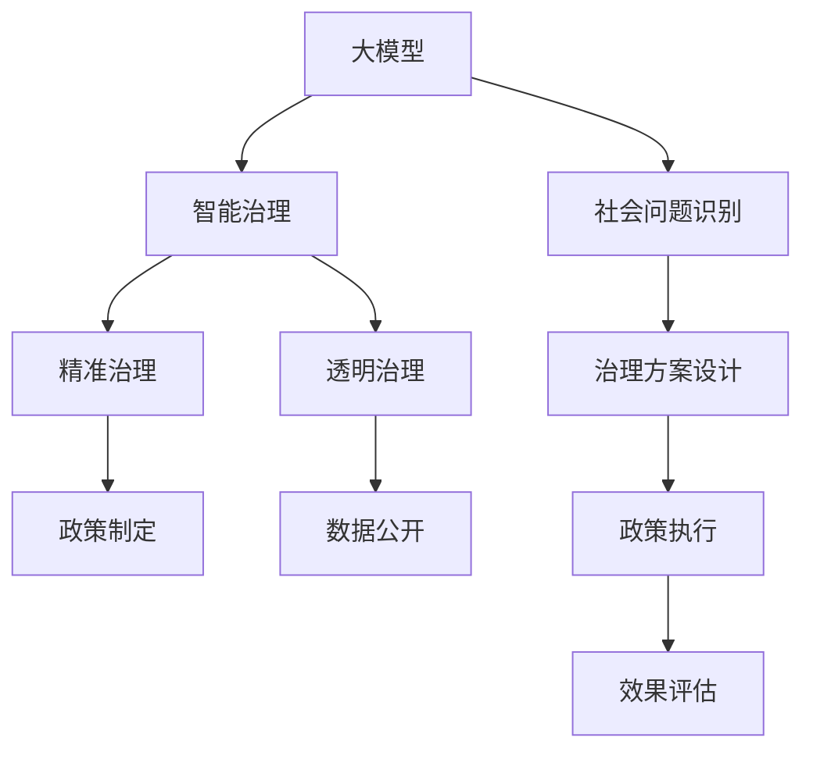

                 

# 大模型时代下的新型社会治理模式

## 1. 背景介绍

### 1.1 问题由来
随着人工智能技术的飞速发展，大模型（如GPT-3、BERT等）开始逐步渗透到社会的各个角落，从自动化客服到智能安防，从金融风控到医疗诊断，大模型以其卓越的表现，展现出极大的潜力和价值。然而，大模型带来的深远影响，并不仅限于技术层面，其对社会治理模式也将产生重大变革。

### 1.2 问题核心关键点
大模型技术对于社会治理的主要影响包括以下几个方面：
- 提升治理效率：大模型可以处理海量数据，挖掘潜在规律，辅助政府决策。
- 实现精准施策：通过精准预测，为不同区域、不同人群提供定制化政策。
- 增强公平性：大数据分析揭示社会问题，为弱势群体提供更多关怀和支持。
- 提高透明度：政府数据公开，使得决策过程透明化、可追踪。

同时，大模型应用在社会治理中也可能引发一些新问题：
- 隐私保护：如何保护数据隐私，防止数据滥用。
- 伦理道德：模型可能存在偏见，如何保证决策公正性。
- 法律合规：模型在决策过程中需要遵循法律、道德等规范。
- 技术依赖：政府对大模型的过度依赖，可能削弱人力资源优势。

### 1.3 问题研究意义
研究大模型在社会治理中的应用，对于提升治理能力，实现精准化、智能化、透明化的治理目标具有重要意义：

1. 提升治理效率：通过大模型的预测分析能力，政府可以更快地做出决策，提高治理速度。
2. 实现精准施策：大模型能够根据不同群体的特性，提供定制化政策，提高政策效果。
3. 增强公平性：通过大数据分析，揭示社会问题，为弱势群体提供更多支持和保障。
4. 提高透明度：公开透明的数据和决策过程，使得治理更具公信力。

同时，研究大模型应用在社会治理中的问题，也具有重要价值：

1. 保护隐私：防止数据滥用，保障公民隐私安全。
2. 保证公正：避免模型偏见，确保决策公正性。
3. 法律合规：确保模型决策符合法律法规要求。
4. 平衡依赖：合理使用大模型，保护人力资源优势。

本文将详细探讨大模型在社会治理中的应用，同时深入分析其可能面临的挑战，并提出应对策略。

## 2. 核心概念与联系

### 2.1 核心概念概述

为更好地理解大模型在社会治理中的应用，本节将介绍几个关键概念及其之间的联系：

- 大模型：以深度学习为基础，在大量数据上进行预训练的大型神经网络模型，如GPT、BERT等。
- 社会治理：政府及社会组织运用各种资源和手段，维护社会秩序，提升社会福祉的过程。
- 智能治理：利用人工智能技术，提高社会治理的智能化水平。
- 精准治理：通过大数据分析和预测，实现对社会问题的精准识别和精准施策。
- 透明治理：通过数据公开和透明决策，提升治理过程的可信度和公信力。

这些概念之间的逻辑关系可以通过以下Mermaid流程图来展示：



该流程图展示了大模型在社会治理中的应用路径：

1. 大模型帮助识别社会问题。
2. 智能治理通过大数据分析预测，实现精准治理。
3. 透明治理通过数据公开，提升治理过程的公信力。

## 3. 核心算法原理 & 具体操作步骤
### 3.1 算法原理概述

大模型在社会治理中的应用，主要依赖于其强大的数据处理和分析能力。其核心思想是：

- 数据收集：通过传感器、网络爬虫等手段，收集社会治理相关的海量数据。
- 模型训练：利用大规模数据对大模型进行训练，使其能够识别、预测和分析社会问题。
- 决策辅助：将训练好的大模型应用于政策制定、方案设计、执行监控等环节，辅助政府决策。

大模型在社会治理中的具体应用流程，主要包括以下几个步骤：

1. 数据预处理：清洗、标注和处理原始数据，使其符合模型输入要求。
2. 模型选择与训练：选择合适的模型架构和训练策略，在大规模数据集上进行预训练。
3. 应用部署：将训练好的模型部署到实际应用场景中，进行实时处理和预测。
4. 效果评估：通过指标评估模型性能，并根据评估结果进行模型优化。

### 3.2 算法步骤详解

以下将以智能交通为例，详细讲解基于大模型的社会治理流程：

**Step 1: 数据收集**
- 通过视频监控、传感器、GPS等手段，收集交通流量、事故发生等数据。
- 使用网络爬虫从新闻网站、社交媒体获取交通信息，如道路封堵、施工信息等。
- 处理和清洗数据，去除噪声和冗余信息，提取有用特征。

**Step 2: 模型选择与训练**
- 选择合适的模型架构，如注意力机制、Transformer等。
- 在大型交通数据集上进行预训练，学习交通模式和规律。
- 使用监督学习任务，如预测交通流量、识别交通事故等，进一步优化模型。

**Step 3: 应用部署**
- 将训练好的模型部署到交通管理中心，进行实时预测。
- 根据预测结果，优化交通信号灯、调整公交线路等。
- 将模型嵌入到移动应用中，为用户提供实时交通信息。

**Step 4: 效果评估**
- 通过准确率、召回率、F1值等指标，评估模型性能。
- 结合专家意见，调整模型参数，优化模型效果。
- 定期更新模型，适应不断变化的社会环境。

### 3.3 算法优缺点

基于大模型的社会治理应用具有以下优点：

- 数据驱动：大模型能够处理海量数据，提供基于数据的决策支持。
- 实时响应：大模型可以实时处理和预测，提高治理效率。
- 预测精准：通过模型训练，能够实现对社会问题的精准识别和预测。

同时，也存在一些缺点：

- 数据质量依赖：模型的性能高度依赖于数据质量，数据噪声和缺失可能影响预测结果。
- 模型复杂度高：大模型的复杂性可能导致计算资源和计算时间消耗较大。
- 模型透明性不足：黑箱模型难以解释，可能影响决策的透明度和可解释性。
- 隐私保护难度大：处理大量敏感数据时，隐私保护问题难以完全解决。

### 3.4 算法应用领域

大模型在社会治理中的应用领域非常广泛，以下是一些典型的应用场景：

- 智能交通：通过大模型分析交通流量、识别事故、预测拥堵等，优化交通管理。
- 医疗健康：利用大模型预测疫情发展、诊断疾病、制定防控策略等。
- 公共安全：通过大模型分析犯罪模式、预测犯罪风险、优化警力部署等。
- 环境保护：利用大模型监测环境污染、预测气候变化、制定环保政策等。
- 教育公平：通过大模型分析教育资源分配、预测学生成绩、制定教育政策等。
- 社会福利：利用大模型分析贫困人口、评估社会福利、制定救助政策等。

## 4. 数学模型和公式 & 详细讲解
### 4.1 数学模型构建

在社会治理中，大模型通常用于以下几个数学模型：

- 回归模型：预测连续型数据，如交通流量、房价等。
- 分类模型：分类离散型数据，如交通事故、犯罪类型等。
- 聚类模型：对数据进行分组和分类，如社区划分、人群分类等。
- 预测模型：基于历史数据预测未来事件，如疫情传播、股市波动等。

以回归模型为例，假设大模型用于预测城市交通流量 $y$，输入特征为 $x$，回归模型可以表示为：

$$
y = f(x; \theta)
$$

其中 $\theta$ 为模型参数，$f(x; \theta)$ 为模型函数。

### 4.2 公式推导过程

以线性回归模型为例，假设模型函数为：

$$
f(x; \theta) = \theta_0 + \theta_1 x_1 + \theta_2 x_2 + ... + \theta_n x_n
$$

训练数据集为 $\{(x_i, y_i)\}_{i=1}^N$，其中 $x_i = (x_{i1}, x_{i2}, ..., x_{in})$，$y_i$ 为真实流量，模型参数 $\theta$ 需通过最小化损失函数来确定：

$$
\min_{\theta} \sum_{i=1}^N (y_i - f(x_i; \theta))^2
$$

利用梯度下降等优化算法，求解上述最小化问题，得到最优模型参数 $\hat{\theta}$。

$$
\hat{\theta} = \arg\min_{\theta} \frac{1}{N} \sum_{i=1}^N (y_i - f(x_i; \theta))^2
$$

### 4.3 案例分析与讲解

以智能交通中的拥堵预测为例，假设交通数据集为 $(x_i, y_i)$，其中 $x_i$ 为历史交通流量、道路施工等信息，$y_i$ 为未来交通流量预测值。

利用线性回归模型进行训练，损失函数为均方误差损失：

$$
\mathcal{L}(\theta) = \frac{1}{N} \sum_{i=1}^N (y_i - f(x_i; \theta))^2
$$

通过梯度下降等优化算法求解模型参数 $\hat{\theta}$：

$$
\hat{\theta} = \arg\min_{\theta} \mathcal{L}(\theta)
$$

模型训练完成后，即可用于实时预测未来交通流量，优化交通信号灯、调整公交线路等。

## 5. 项目实践：代码实例和详细解释说明
### 5.1 开发环境搭建

在进行大模型应用实践前，我们需要准备好开发环境。以下是使用Python进行PyTorch开发的环境配置流程：

1. 安装Anaconda：从官网下载并安装Anaconda，用于创建独立的Python环境。

2. 创建并激活虚拟环境：
```bash
conda create -n pytorch-env python=3.8 
conda activate pytorch-env
```

3. 安装PyTorch：根据CUDA版本，从官网获取对应的安装命令。例如：
```bash
conda install pytorch torchvision torchaudio cudatoolkit=11.1 -c pytorch -c conda-forge
```

4. 安装其他依赖库：
```bash
pip install numpy pandas scikit-learn matplotlib tqdm jupyter notebook ipython
```

完成上述步骤后，即可在`pytorch-env`环境中开始实践。

### 5.2 源代码详细实现

以下以交通流量预测为例，给出使用PyTorch对大模型进行训练的代码实现。

首先，定义数据处理函数：

```python
import pandas as pd
import numpy as np
from sklearn.preprocessing import StandardScaler

class TrafficDataLoader:
    def __init__(self, data_file, features, targets, scaler=None):
        self.data = pd.read_csv(data_file)
        self.scaler = scaler
        self.scaler = StandardScaler() if scaler is None else scaler
        self.data[features] = self.scaler.fit_transform(self.data[features])
        self.targets = self.data[targets]
        self.data = self.data.drop(targets, axis=1)

    def __len__(self):
        return len(self.data)

    def __getitem__(self, idx):
        features = self.data.iloc[idx]
        targets = self.targets.iloc[idx]
        return (torch.tensor(features), torch.tensor(targets))
```

然后，定义模型和优化器：

```python
from torch import nn
import torch.nn.functional as F

class TrafficRegressionModel(nn.Module):
    def __init__(self, input_dim, output_dim):
        super(TrafficRegressionModel, self).__init__()
        self.linear = nn.Linear(input_dim, output_dim)

    def forward(self, x):
        return self.linear(x)

model = TrafficRegressionModel(input_dim=5, output_dim=1)
optimizer = torch.optim.Adam(model.parameters(), lr=0.001)
```

接着，定义训练和评估函数：

```python
def train_epoch(model, data_loader, batch_size, optimizer):
    model.train()
    loss = 0
    for batch in data_loader:
        features, targets = batch
        optimizer.zero_grad()
        outputs = model(features)
        loss += F.mse_loss(outputs, targets)
        loss.backward()
        optimizer.step()
    return loss / len(data_loader)

def evaluate(model, data_loader, batch_size):
    model.eval()
    loss = 0
    mse = 0
    with torch.no_grad():
        for batch in data_loader:
            features, targets = batch
            outputs = model(features)
            loss += F.mse_loss(outputs, targets)
            mse += torch.mean((outputs - targets) ** 2)
    return mse / len(data_loader)
```

最后，启动训练流程并在验证集上评估：

```python
epochs = 100
batch_size = 32

for epoch in range(epochs):
    train_loss = train_epoch(model, train_loader, batch_size, optimizer)
    val_loss = evaluate(model, val_loader, batch_size)
    print(f"Epoch {epoch+1}, train loss: {train_loss:.3f}, val loss: {val_loss:.3f}")
    
if best_loss is None or val_loss < best_loss:
    best_loss = val_loss
    torch.save(model.state_dict(), 'model.pth')
```

以上就是使用PyTorch对大模型进行交通流量预测的完整代码实现。可以看到，得益于深度学习框架的强大支持，大模型的应用开发变得简单高效。

### 5.3 代码解读与分析

让我们再详细解读一下关键代码的实现细节：

**TrafficDataLoader类**：
- `__init__`方法：初始化数据、特征、目标等关键变量，并进行数据标准化。
- `__len__`方法：返回数据集长度。
- `__getitem__`方法：返回单个数据样本的特征和目标。

**TrafficRegressionModel类**：
- `__init__`方法：定义模型结构，包含一个线性层。
- `forward`方法：实现前向传播，将输入特征映射到目标变量。

**训练和评估函数**：
- 利用PyTorch的自动微分功能，计算模型输出与真实目标的均方误差，并反向传播更新模型参数。
- 在训练过程中，通过计算均方误差损失，实时监控模型性能。
- 在验证集上评估模型性能，比较当前模型与最佳模型（Best Model）的性能差距。

**训练流程**：
- 定义总epoch数和批大小，开始循环迭代。
- 每个epoch内，在训练集上训练模型，并在验证集上评估性能。
- 根据评估结果，保存性能最佳的模型参数。

可以看到，大模型的应用开发主要依赖于深度学习框架的强大功能和简单API，使得开发者能够快速迭代和优化模型。

## 6. 实际应用场景
### 6.1 智能交通

智能交通是社会治理中应用大模型的典型场景。通过大模型分析交通流量、预测拥堵、优化信号灯，可以实现交通的智能化管理。

在具体应用中，可以收集历史交通数据，包括车辆速度、道路施工、天气状况等。通过这些数据训练回归模型，实现交通流量的预测。模型输出可用于优化交通信号灯，减少拥堵，提升道路通行效率。

### 6.2 医疗健康

在医疗健康领域，大模型可以用于疾病预测、诊断和治疗建议。利用大模型学习海量病历数据，建立疾病与症状之间的映射关系。

具体应用中，可以收集医院病历数据，包括症状、诊断、治疗等。通过这些数据训练分类模型，实现疾病的快速诊断。模型输出可用于医生决策支持，提供精准的治疗建议。

### 6.3 公共安全

公共安全领域面临诸多挑战，如犯罪预测、反恐预警、社会治安等。大模型可以通过分析历史数据，预测犯罪模式，优化警力部署。

具体应用中，可以收集犯罪数据，包括时间、地点、类型等。通过这些数据训练分类模型，实现犯罪预测。模型输出可用于警方决策支持，优化警力部署，提升社会安全。

### 6.4 环境保护

环境保护是大模型在社会治理中的重要应用场景。通过大模型监测环境污染、预测气候变化，实现环保决策支持。

具体应用中，可以收集环境数据，包括气象、水质、空气污染等。通过这些数据训练回归模型，实现环境污染的预测。模型输出可用于制定环保政策，优化环保措施。

## 7. 工具和资源推荐
### 7.1 学习资源推荐

为了帮助开发者系统掌握大模型在社会治理中的应用，这里推荐一些优质的学习资源：

1. 《深度学习理论与实践》系列博文：由大模型技术专家撰写，深入浅出地介绍了深度学习理论、模型训练、应用案例等前沿话题。

2. 《Python深度学习》书籍：涵盖了深度学习模型的原理、实现和应用，是深度学习入门的经典教材。

3. Coursera《深度学习专项课程》：由斯坦福大学等知名学府开设的深度学习课程，涵盖深度学习基础、卷积神经网络、循环神经网络等。

4. 《社会治理中的人工智能》书籍：详细介绍人工智能在社会治理中的应用，包括数据收集、模型训练、政策制定等。

5. Kaggle竞赛：参与社会治理相关的机器学习竞赛，如智能交通预测、医疗数据分析等，积累实战经验。

通过对这些资源的学习实践，相信你一定能够快速掌握大模型在社会治理中的应用技巧，并用于解决实际的社会问题。

### 7.2 开发工具推荐

高效的开发离不开优秀的工具支持。以下是几款用于大模型应用的常用工具：

1. PyTorch：基于Python的开源深度学习框架，灵活动态的计算图，适合快速迭代研究。

2. TensorFlow：由Google主导开发的开源深度学习框架，生产部署方便，适合大规模工程应用。

3. Weights & Biases：模型训练的实验跟踪工具，可以记录和可视化模型训练过程中的各项指标，方便对比和调优。

4. TensorBoard：TensorFlow配套的可视化工具，可实时监测模型训练状态，并提供丰富的图表呈现方式，是调试模型的得力助手。

5. Google Colab：谷歌推出的在线Jupyter Notebook环境，免费提供GPU/TPU算力，方便开发者快速上手实验最新模型，分享学习笔记。

合理利用这些工具，可以显著提升大模型应用的开发效率，加快创新迭代的步伐。

### 7.3 相关论文推荐

大模型在社会治理中的应用研究起步较晚，但已经在诸多领域展现出巨大潜力。以下是几篇奠基性的相关论文，推荐阅读：

1. "Deep Learning in Social Sciences"：综述了深度学习在社会治理中的应用，包括智能交通、医疗健康、环境保护等。

2. "AI for Social Good"：讨论了人工智能在公共安全、教育、扶贫等方面的应用，强调了人工智能的伦理和社会责任。

3. "Big Data Analytics for Public Administration"：介绍大数据分析在政府治理中的应用，包括数据收集、存储、分析和应用。

4. "Predictive Policing with Machine Learning"：通过机器学习预测犯罪，提高警察效率，减少犯罪率。

5. "Environmental Predictive Modeling using Deep Learning"：利用深度学习预测环境污染，制定环保政策。

这些论文代表了大模型在社会治理中的应用方向，通过学习这些前沿成果，可以帮助研究者把握学科前进方向，激发更多的创新灵感。

## 8. 总结：未来发展趋势与挑战

### 8.1 研究成果总结

本文对大模型在社会治理中的应用进行了全面系统的介绍。首先阐述了大模型和智能治理的研究背景和意义，明确了社会治理中应用大模型的必要性和优势。其次，从原理到实践，详细讲解了大模型在社会治理中的数学模型构建、算法步骤、代码实现等关键环节，给出了实际应用案例。

通过本文的系统梳理，可以看到，大模型在社会治理中的应用前景广阔，其在提升治理效率、实现精准施策、增强公平性、提高透明度等方面具有重要价值。但同时，大模型应用也面临诸多挑战，如数据质量、模型复杂度、隐私保护等，需要进一步研究和优化。

### 8.2 未来发展趋势

展望未来，大模型在社会治理中的应用将呈现以下几个发展趋势：

1. 数据驱动治理：大模型将进一步推动数据驱动的社会治理，提高决策的科学性和准确性。

2. 精准治理：利用大模型的预测能力，实现对社会问题的精准识别和预测，提高治理的精准性。

3. 透明治理：通过公开数据和模型，提高治理过程的透明性和公信力。

4. 多模态治理：结合图像、视频、语音等多模态数据，提升治理的全面性和深度。

5. 智能协同治理：将大模型与人类专家结合，实现人机协同，提高治理的效率和效果。

6. 公平与公正：研究如何避免模型偏见，确保治理的公平性和公正性。

以上趋势凸显了大模型在社会治理中的巨大潜力，未来的大模型应用将在各个方面带来深远变革。

### 8.3 面临的挑战

尽管大模型在社会治理中展现了巨大的价值，但其应用也面临诸多挑战：

1. 数据质量问题：大模型高度依赖于数据质量，数据噪声和缺失可能影响预测结果。

2. 模型复杂度问题：大模型结构复杂，需要大量计算资源和存储资源，可能面临资源瓶颈。

3. 隐私保护问题：处理敏感数据时，隐私保护问题难以完全解决，需要严格的数据管理和隐私保护措施。

4. 模型透明性问题：大模型通常为黑箱模型，难以解释，可能影响决策的透明性和可解释性。

5. 法律合规问题：大模型在决策过程中需要遵循法律、道德等规范，确保合法合规。

6. 技术依赖问题：过度依赖大模型可能导致人力资源优势削弱，需要平衡模型与人的协同作用。

这些挑战需要多方协作，共同应对，才能保证大模型在社会治理中的应用效果和公平性。

### 8.4 研究展望

未来研究需要在以下几个方面寻求新的突破：

1. 数据增强与清洗：进一步提升数据质量，清洗和处理数据中的噪声和缺失值。

2. 模型优化与压缩：开发更加高效的模型架构和压缩算法，降低资源消耗。

3. 隐私保护技术：研究隐私保护技术，确保数据处理和模型训练中的隐私安全。

4. 可解释性与透明性：开发可解释性模型，提高决策过程的透明性和可解释性。

5. 法律合规研究：研究大模型在决策过程中的法律合规问题，制定相关法律法规。

6. 人机协同机制：研究人机协同机制，提高治理的效率和效果，避免过度依赖模型。

通过这些研究方向的探索，可以进一步推动大模型在社会治理中的应用，为构建安全、可靠、智能的社会治理体系铺平道路。

## 9. 附录：常见问题与解答

**Q1：大模型在社会治理中的应用是否存在数据隐私问题？**

A: 大模型在社会治理中的应用确实存在数据隐私问题。在处理敏感数据时，需要采用严格的数据管理和隐私保护措施，如数据匿名化、差分隐私等。同时，还需要制定相关的法律法规，规范数据的收集、存储和使用。

**Q2：如何避免大模型在社会治理中的偏见问题？**

A: 避免大模型偏见的关键在于数据和模型的公平性。需要采用公平性数据集进行训练，并在模型设计中引入公平性约束。同时，对模型输出进行公平性评估，确保不同群体得到公平对待。

**Q3：大模型在社会治理中如何保证决策的透明性和可解释性？**

A: 保证决策透明性和可解释性的关键在于开发可解释性模型，如基于规则的模型、解释性训练等。同时，在决策过程中，需要引入人工审核机制，确保决策过程公开透明。

**Q4：大模型在社会治理中如何避免过度依赖？**

A: 避免过度依赖大模型，需要平衡模型与人的协同作用。大模型可用于辅助决策，但不能替代人类的判断和经验。同时，需要制定明确的政策，确保模型决策的合法合规。

**Q5：大模型在社会治理中的应用前景如何？**

A: 大模型在社会治理中的应用前景非常广阔，通过数据驱动、精准治理、透明治理等手段，能够显著提升治理效率和效果。但同时，也需要解决数据质量、隐私保护、模型透明性等挑战，才能充分发挥大模型的潜力。

总之，大模型在社会治理中的应用前景光明，但也需要不断优化和完善。通过多方协作，共同推动大模型在社会治理中的健康应用，将为构建更加安全、智能、透明的社会治理体系贡献力量。

---

作者：禅与计算机程序设计艺术 / Zen and the Art of Computer Programming

