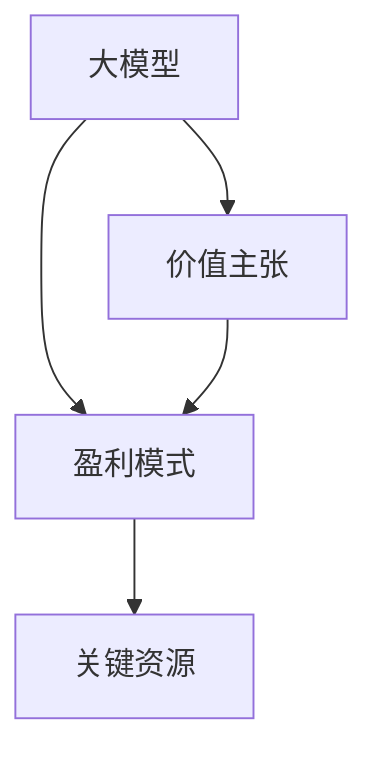

                 

# 大模型时代的创业者商业模式设计：价值主张、盈利模式与关键资源

> 关键词：大模型，商业模式，价值主张，盈利模式，关键资源

## 1. 背景介绍

### 1.1 问题由来

在人工智能（AI）领域，大模型（Large Models）正成为行业发展的核心驱动力。大型预训练模型，如OpenAI的GPT-3，Google的BERT和XLNet，已经展示出在多个NLP（自然语言处理）任务上的卓越表现。这些模型在大规模语料上进行预训练，学习了广泛的通用知识，可以极大地提升下游任务（如机器翻译、文本分类、对话系统等）的性能。

然而，大模型也带来了新的挑战。一方面，它们通常具有数亿甚至数十亿的参数，需要强大的计算资源和资金支持进行开发和维护。另一方面，这些模型往往需要持续更新和迭代，以适应不断变化的数据分布和任务需求。

在这样的背景下，如何设计出既能发挥大模型优势，又能实现商业可持续的商业模式，成为AI创业者面临的重要课题。本文将从价值主张、盈利模式和关键资源三个维度，深入探讨大模型时代的创业者商业模式设计。

## 2. 核心概念与联系

### 2.1 核心概念概述

为更好地理解大模型时代的商业模式设计，我们首先需要明确几个核心概念：

- **大模型（Large Models）**：指的是那些在大规模无标签数据上进行预训练的深度学习模型，如GPT、BERT等。这些模型通常具有数亿参数，能够在多项NLP任务上达到或超过人类水平的表现。
- **价值主张（Value Proposition）**：指的是企业提供的独特价值，用以吸引客户并区别于竞争对手。对于大模型企业，价值主张可能包括但不限于模型的精度、性能、适用范围、成本效益等。
- **盈利模式（Revenue Model）**：指的是企业通过何种方式实现收入。常见的盈利模式包括订阅制、按需付费、基于使用量收费等。
- **关键资源（Key Resources）**：指的是实现商业模式所需的重要资源，包括但不限于技术专利、数据资产、人才团队等。

这些概念之间的关系可以通过以下Mermaid流程图来展示：



这个流程图展示了大模型、价值主张、盈利模式和关键资源之间的逻辑关系：

1. 大模型是商业模式的基础，提供技术能力支撑。
2. 价值主张通过大模型的应用实现，吸引客户并创造价值。
3. 盈利模式直接关联价值主张，指导商业模式的货币化。
4. 关键资源是实现商业模式的重要保障，确保价值主张和盈利模式的有效实施。

## 3. 核心算法原理 & 具体操作步骤

### 3.1 算法原理概述

大模型时代的商业模式设计，本质上是将大模型的技术能力转化为商业价值的系统化过程。这一过程通常包括以下几个关键步骤：

1. **技术研发**：开发和优化大模型，提升其性能和适应性。
2. **市场定位**：确定目标客户和应用场景，明确价值主张。
3. **盈利策略**：设计收入模型，确保可持续发展。
4. **资源管理**：配置和优化关键资源，支撑商业模式的实现。

### 3.2 算法步骤详解

以下是具体步骤的详细讲解：

**Step 1: 技术研发**

- **数据准备**：收集和处理大规模语料，构建预训练数据集。数据质量直接影响模型的性能。
- **模型选择**：选择合适的预训练模型进行微调或迁移学习，确保模型对目标任务的适应性。
- **模型优化**：应用正则化、对抗训练、参数高效微调等技术，提升模型的泛化能力和效率。
- **性能评估**：在验证集和测试集上进行评估，确保模型能够满足实际应用的需求。

**Step 2: 市场定位**

- **目标客户**：识别并细分目标客户群体，了解其需求和痛点。
- **应用场景**：明确模型在实际应用中的场景和用途，如文本分类、机器翻译、对话系统等。
- **价值主张**：基于大模型的优势和应用场景，设计独特的价值主张，如高效、准确、易用等。
- **竞争分析**：分析竞争对手的优势和不足，寻找差异化竞争策略。

**Step 3: 盈利策略**

- **定价模型**：设计合理的定价策略，如订阅制、按需付费、按使用量收费等。
- **销售渠道**：选择适合的销售渠道，如直接销售、合作伙伴、在线市场等。
- **市场推广**：制定有效的市场推广计划，吸引潜在客户。
- **客户支持**：提供优质的客户支持服务，增强客户粘性。

**Step 4: 资源管理**

- **数据资产**：管理好数据资产，确保数据安全和合规性。
- **人才团队**：招募和培养高水平的技术和管理人才，提升团队竞争力。
- **技术专利**：申请和保护关键技术专利，增强企业核心竞争力。
- **资金筹集**：合理规划和筹集资金，确保商业模式能够持续运作。

### 3.3 算法优缺点

大模型时代的商业模式设计具有以下优点：

- **技术领先**：利用大模型的技术优势，提供高精度和高效率的解决方案。
- **广泛适用**：大模型可以在多个领域和任务中应用，形成多元化的产品线。
- **可扩展性强**：大模型的开发和应用可以灵活扩展，适应不同的市场需求。

同时，也存在一些挑战和局限：

- **成本高昂**：大模型的研发和维护需要高昂的计算资源和资金投入。
- **数据依赖**：模型的性能依赖于高质量的数据，获取和处理数据成本较高。
- **模型更新**：需要持续更新和迭代模型，以适应数据分布的变化和技术的进步。
- **竞争激烈**：市场上存在大量竞争对手，如何在竞争中脱颖而出，需要持续创新。

### 3.4 算法应用领域

大模型时代的商业模式设计，广泛应用于以下几个领域：

- **NLP应用**：如文本分类、机器翻译、对话系统、情感分析等。这些应用可以直接应用大模型，提供高效准确的解决方案。
- **医疗健康**：利用大模型进行病历分析、诊断辅助、医学知识图谱构建等。这些应用可以显著提升医疗服务的质量和效率。
- **金融科技**：利用大模型进行舆情监测、欺诈检测、金融市场预测等。这些应用有助于金融机构更好地管理风险和提升服务质量。
- **智能制造**：利用大模型进行设备维护、生产调度、质量控制等。这些应用可以优化生产流程，提升制造效率和产品质量。

## 4. 数学模型和公式 & 详细讲解

### 4.1 数学模型构建

大模型时代的商业模式设计，涉及到多个领域的数学模型。以下以机器翻译为例，说明如何构建数学模型：

**输入**：
- 源语言句子 $s$。
- 目标语言句子 $t$。

**输出**：
- 翻译后的目标语言句子 $\hat{t}$。

**模型**：
- 基于Transformer的序列到序列模型，参数为 $\theta$。

**目标函数**：
- 最小化翻译后的句子与真实句子之间的编辑距离（Edit Distance），即 $\min_{\theta} \mathcal{L}(s, \hat{t})$。

### 4.2 公式推导过程

翻译模型的目标函数可以表示为：

$$
\mathcal{L}(s, \hat{t}) = \sum_{i=1}^{|t|} \lambda_i d_i(s_i, \hat{t}_i)
$$

其中 $d_i$ 是编辑距离函数，$|t|$ 是目标句子的长度。$\lambda_i$ 是权重，通常与字符的重要性相关。

对于每个字符 $s_i$ 和 $\hat{t}_i$，可以定义多种编辑距离，如Levenshtein距离、Damerau-Levenshtein距离等。

### 4.3 案例分析与讲解

以Google Translate为例，分析其商业模式的数学模型构建和应用：

**技术研发**：
- 使用Transformer架构进行预训练和微调，提升模型精度。
- 在大规模语料上预训练，获取通用语言知识。

**市场定位**：
- 定位为在线翻译服务提供商，目标客户包括个人和企业。
- 应用场景包括实时翻译、离线翻译、文档翻译等。

**盈利策略**：
- 采用按需付费和按使用量收费的方式，用户根据翻译量支付费用。
- 通过广告和增值服务（如高级翻译服务、定制化解决方案）实现二次盈利。

**资源管理**：
- 数据资产：获取和处理大规模语料，确保数据安全和合规性。
- 人才团队：招募和培养翻译和机器学习专家，提升技术能力。
- 技术专利：申请和保护关键技术专利，增强企业竞争力。
- 资金筹集：通过融资和投资，支持技术研发和商业化运作。

## 5. 项目实践：代码实例和详细解释说明

### 5.1 开发环境搭建

在进行大模型商业化实践前，首先需要搭建开发环境。以下是Python和PyTorch的搭建流程：

1. 安装Anaconda：从官网下载并安装Anaconda，用于创建独立的Python环境。

2. 创建并激活虚拟环境：
```bash
conda create -n pytorch-env python=3.8 
conda activate pytorch-env
```

3. 安装PyTorch：根据CUDA版本，从官网获取对应的安装命令。例如：
```bash
conda install pytorch torchvision torchaudio cudatoolkit=11.1 -c pytorch -c conda-forge
```

4. 安装TensorBoard：用于可视化训练过程。
```bash
pip install tensorboard
```

5. 安装HuggingFace Transformers库：
```bash
pip install transformers
```

6. 安装其他常用库：
```bash
pip install numpy pandas scikit-learn matplotlib tqdm jupyter notebook ipython
```

完成上述步骤后，即可在`pytorch-env`环境中开始大模型商业化实践。

### 5.2 源代码详细实现

以下是使用PyTorch和HuggingFace Transformers库进行机器翻译模型微调的代码实现：

```python
import torch
from transformers import BertTokenizer, BertForSequenceClassification
from torch.utils.data import Dataset, DataLoader
from transformers import AdamW

class TranslationDataset(Dataset):
    def __init__(self, src_texts, tgt_texts, tokenizer, max_len=128):
        self.src_texts = src_texts
        self.tgt_texts = tgt_texts
        self.tokenizer = tokenizer
        self.max_len = max_len
        
    def __len__(self):
        return len(self.src_texts)
    
    def __getitem__(self, item):
        src_text = self.src_texts[item]
        tgt_text = self.tgt_texts[item]
        
        encoding = self.tokenizer(src_text, return_tensors='pt', max_length=self.max_len, padding='max_length', truncation=True)
        input_ids = encoding['input_ids'][0]
        attention_mask = encoding['attention_mask'][0]
        
        tgt_text = self.tokenizer(tgt_text, return_tensors='pt', max_length=self.max_len, padding='max_length', truncation=True)
        tgt_input_ids = tgt_text['input_ids'][0]
        tgt_attention_mask = tgt_text['attention_mask'][0]
        
        return {'input_ids': input_ids, 
                'attention_mask': attention_mask,
                'target_ids': tgt_input_ids,
                'target_mask': tgt_attention_mask}

# 加载数据集
tokenizer = BertTokenizer.from_pretrained('bert-base-cased')
train_dataset = TranslationDataset(train_src_texts, train_tgt_texts, tokenizer)
dev_dataset = TranslationDataset(dev_src_texts, dev_tgt_texts, tokenizer)
test_dataset = TranslationDataset(test_src_texts, test_tgt_texts, tokenizer)

# 定义模型
model = BertForSequenceClassification.from_pretrained('bert-base-cased', num_labels=2)

# 定义优化器
optimizer = AdamW(model.parameters(), lr=2e-5)

# 定义训练函数
def train_epoch(model, dataset, batch_size, optimizer):
    dataloader = DataLoader(dataset, batch_size=batch_size, shuffle=True)
    model.train()
    epoch_loss = 0
    for batch in dataloader:
        input_ids = batch['input_ids'].to(device)
        attention_mask = batch['attention_mask'].to(device)
        targets = batch['target_ids'].to(device)
        targets = targets.view(-1).to(device)
        outputs = model(input_ids, attention_mask=attention_mask, labels=targets)
        loss = outputs.loss
        epoch_loss += loss.item()
        loss.backward()
        optimizer.step()
    return epoch_loss / len(dataloader)

# 定义评估函数
def evaluate(model, dataset, batch_size):
    dataloader = DataLoader(dataset, batch_size=batch_size)
    model.eval()
    preds, labels = [], []
    with torch.no_grad():
        for batch in dataloader:
            input_ids = batch['input_ids'].to(device)
            attention_mask = batch['attention_mask'].to(device)
            batch_labels = batch['target_ids']
            batch_labels = batch_labels.view(-1).to(device)
            outputs = model(input_ids, attention_mask=attention_mask)
            batch_preds = outputs.logits.argmax(dim=2).to('cpu').tolist()
            batch_labels = batch_labels.to('cpu').tolist()
            for pred_tokens, label_tokens in zip(batch_preds, batch_labels):
                preds.append(pred_tokens[:len(label_tokens)])
                labels.append(label_tokens)
                
    print(classification_report(labels, preds))

# 训练和评估模型
epochs = 5
batch_size = 16

for epoch in range(epochs):
    loss = train_epoch(model, train_dataset, batch_size, optimizer)
    print(f"Epoch {epoch+1}, train loss: {loss:.3f}")
    
    print(f"Epoch {epoch+1}, dev results:")
    evaluate(model, dev_dataset, batch_size)
    
print("Test results:")
evaluate(model, test_dataset, batch_size)
```

### 5.3 代码解读与分析

代码的各个部分解释如下：

- `TranslationDataset`：自定义数据集类，用于处理源语言和目标语言文本。
- `train_epoch`和`evaluate`：定义训练和评估函数，分别在训练集和验证集上执行模型训练和评估。
- `classification_report`：使用scikit-learn库生成分类指标报告。

通过这段代码，我们可以看到如何利用PyTorch和Transformers库进行大模型的微调和评估。

## 6. 实际应用场景

### 6.1 智能客服系统

基于大模型的智能客服系统可以提供7x24小时不间断服务，快速响应客户咨询，用自然流畅的语言解答各类常见问题。微调后的模型能够自动理解用户意图，匹配最合适的答案模板进行回复，从而提升客户咨询体验和问题解决效率。

### 6.2 金融舆情监测

金融机构需要实时监测市场舆论动向，以便及时应对负面信息传播，规避金融风险。微调后的文本分类和情感分析模型可以自动判断文本属于何种主题，情感倾向是正面、中性还是负面，帮助金融机构快速应对潜在风险。

### 6.3 个性化推荐系统

微调后的个性化推荐系统可以更好地挖掘用户行为背后的语义信息，从而提供更精准、多样的推荐内容。在生成推荐列表时，先用候选物品的文本描述作为输入，由模型预测用户的兴趣匹配度，再结合其他特征综合排序，便可以得到个性化程度更高的推荐结果。

### 6.4 未来应用展望

随着大模型的不断发展和优化，其在更多领域的应用将不断拓展。未来，大模型将在智慧医疗、智能制造、智能家居等多个领域发挥重要作用，成为推动社会进步的重要力量。

## 7. 工具和资源推荐

### 7.1 学习资源推荐

为帮助开发者系统掌握大模型商业化开发的理论基础和实践技巧，这里推荐一些优质的学习资源：

1. **《Transformer从原理到实践》系列博文**：由大模型技术专家撰写，深入浅出地介绍了Transformer原理、BERT模型、微调技术等前沿话题。

2. **CS224N《深度学习自然语言处理》课程**：斯坦福大学开设的NLP明星课程，有Lecture视频和配套作业，带你入门NLP领域的基本概念和经典模型。

3. **《Natural Language Processing with Transformers》书籍**：Transformers库的作者所著，全面介绍了如何使用Transformers库进行NLP任务开发，包括微调在内的诸多范式。

4. **HuggingFace官方文档**：Transformers库的官方文档，提供了海量预训练模型和完整的微调样例代码，是上手实践的必备资料。

5. **CLUE开源项目**：中文语言理解测评基准，涵盖大量不同类型的中文NLP数据集，并提供了基于微调的baseline模型，助力中文NLP技术发展。

通过对这些资源的学习实践，相信你一定能够快速掌握大模型商业化开发的精髓，并用于解决实际的商业问题。

### 7.2 开发工具推荐

高效的开发离不开优秀的工具支持。以下是几款用于大模型商业化开发的常用工具：

1. **PyTorch**：基于Python的开源深度学习框架，灵活动态的计算图，适合快速迭代研究。大部分预训练语言模型都有PyTorch版本的实现。

2. **TensorFlow**：由Google主导开发的开源深度学习框架，生产部署方便，适合大规模工程应用。同样有丰富的预训练语言模型资源。

3. **Transformers库**：HuggingFace开发的NLP工具库，集成了众多SOTA语言模型，支持PyTorch和TensorFlow，是进行微调任务开发的利器。

4. **Weights & Biases**：模型训练的实验跟踪工具，可以记录和可视化模型训练过程中的各项指标，方便对比和调优。与主流深度学习框架无缝集成。

5. **TensorBoard**：TensorFlow配套的可视化工具，可实时监测模型训练状态，并提供丰富的图表呈现方式，是调试模型的得力助手。

6. **Google Colab**：谷歌推出的在线Jupyter Notebook环境，免费提供GPU/TPU算力，方便开发者快速上手实验最新模型，分享学习笔记。

合理利用这些工具，可以显著提升大模型商业化开发的效率，加快创新迭代的步伐。

### 7.3 相关论文推荐

大模型和微调技术的发展源于学界的持续研究。以下是几篇奠基性的相关论文，推荐阅读：

1. **Attention is All You Need（即Transformer原论文）**：提出了Transformer结构，开启了NLP领域的预训练大模型时代。

2. **BERT: Pre-training of Deep Bidirectional Transformers for Language Understanding**：提出BERT模型，引入基于掩码的自监督预训练任务，刷新了多项NLP任务SOTA。

3. **Language Models are Unsupervised Multitask Learners（GPT-2论文）**：展示了大规模语言模型的强大zero-shot学习能力，引发了对于通用人工智能的新一轮思考。

4. **Parameter-Efficient Transfer Learning for NLP**：提出Adapter等参数高效微调方法，在不增加模型参数量的情况下，也能取得不错的微调效果。

5. **Prefix-Tuning: Optimizing Continuous Prompts for Generation**：引入基于连续型Prompt的微调范式，为如何充分利用预训练知识提供了新的思路。

6. **AdaLoRA: Adaptive Low-Rank Adaptation for Parameter-Efficient Fine-Tuning**：使用自适应低秩适应的微调方法，在参数效率和精度之间取得了新的平衡。

这些论文代表了大模型微调技术的发展脉络。通过学习这些前沿成果，可以帮助研究者把握学科前进方向，激发更多的创新灵感。

## 8. 总结：未来发展趋势与挑战

### 8.1 总结

本文对大模型时代的商业模式设计进行了全面系统的介绍。首先阐述了大模型和微调技术的背景和意义，明确了其在大模型商业化过程中的核心作用。其次，从价值主张、盈利模式和关键资源三个维度，详细讲解了商业模式设计的具体步骤和方法。

通过本文的系统梳理，可以看到，大模型和微调技术正在成为AI商业化的重要驱动力，极大地拓展了AI技术的落地应用范围。未来，伴随大模型技术的不断进步，更多领域将迎来AI的变革，为人类社会带来深刻影响。

### 8.2 未来发展趋势

展望未来，大模型时代的商业模式设计将呈现以下几个发展趋势：

1. **技术迭代加速**：大模型的规模和性能将不断提升，新的算法和架构也将不断涌现，推动AI技术的进一步发展。

2. **应用场景多元化**：大模型将在更多领域实现应用，如智慧医疗、金融科技、智能制造等，形成多元化、交叉融合的产品生态。

3. **用户体验提升**：通过优化模型和应用设计，提升用户体验和满意度，增强客户粘性和忠诚度。

4. **生态系统完善**：建立完善的生态系统，促进合作伙伴和开发者之间的协同创新，共同推动AI技术的进步。

5. **监管合规加强**：随着AI技术的发展，监管和合规问题将日益重要，企业需要建立健全的合规体系，确保技术应用的合法性和道德性。

### 8.3 面临的挑战

尽管大模型和微调技术带来了巨大的商业机会，但在实现过程中，仍面临诸多挑战：

1. **技术复杂度高**：大模型和微调技术涉及复杂的数学模型和算法，对技术团队的专业能力要求较高。

2. **数据质量瓶颈**：高质量的数据是大模型和微调技术的基础，但获取和处理数据需要投入大量资源和时间。

3. **商业化难度大**：大模型的研发和应用需要高昂的资金投入，且市场竞争激烈，盈利模式需要创新和突破。

4. **安全性和隐私风险**：大模型的广泛应用可能带来隐私和伦理问题，企业需要建立相应的安全保障机制。

5. **持续更新和优化**：大模型需要持续更新和优化，以应对数据分布的变化和技术的进步，对企业的技术能力和资源投入提出了挑战。

### 8.4 研究展望

面对大模型和微调技术所面临的挑战，未来的研究需要在以下几个方面寻求新的突破：

1. **算法和架构创新**：开发更加高效、易用的算法和架构，降低技术复杂度，提高模型性能和效率。

2. **数据管理和治理**：建立健全的数据治理机制，确保数据的质量和安全，促进数据的高效利用。

3. **盈利模式创新**：探索多种盈利模式，如订阅制、按需付费、按使用量收费等，满足不同客户需求，实现商业化目标。

4. **用户体验优化**：提升用户体验和满意度，增强客户粘性和忠诚度，构建良好的用户生态。

5. **社会责任和伦理**：建立健全的社会责任和伦理机制，确保技术应用的合法性和道德性，赢得公众信任和支持。

这些研究方向的发展，必将引领大模型和微调技术的商业化进程，推动AI技术在更多领域的广泛应用，为人类社会的进步做出更大贡献。

## 9. 附录：常见问题与解答

**Q1：大模型和微调技术是否适用于所有应用场景？**

A: 大模型和微调技术适用于多种应用场景，如NLP、医疗健康、金融科技、智能制造等。但对于一些特定领域，如法律、金融、医疗等，可能需要进一步预训练和微调，以提升模型的精度和鲁棒性。

**Q2：如何选择适合的大模型？**

A: 选择大模型时，需要考虑模型的规模、精度、泛化能力、易用性等因素。常见的选择包括BERT、GPT系列、XLNet等，具体选择应根据应用场景和需求进行评估。

**Q3：微调过程中如何避免过拟合？**

A: 避免过拟合的方法包括数据增强、正则化、对抗训练、参数高效微调等。需要根据具体任务和数据特点灵活选择和组合。

**Q4：大模型和微调技术需要哪些关键资源？**

A: 大模型和微调技术需要关键资源，如高质量的数据、高性能的计算资源、高水平的技术人才等。这些资源是实现商业化的基础。

**Q5：大模型的商业化过程中，如何平衡创新与成本？**

A: 在商业化过程中，需要平衡创新与成本，合理规划和分配资源，以实现可持续发展。同时，通过优化模型和应用设计，降低成本，提升商业效益。

---

作者：禅与计算机程序设计艺术 / Zen and the Art of Computer Programming

