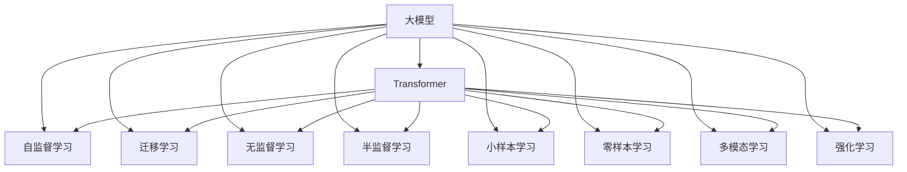

                 

# 大模型的技术演进与市场前景

> 关键词：大模型,技术演进,市场前景,深度学习,迁移学习,Transformer,自监督学习,BERT

## 1. 背景介绍

### 1.1 问题由来
近年来，深度学习技术的迅猛发展推动了大规模模型(即大模型)的崛起。这些模型通常包含数十亿个参数，能够处理复杂的多模态数据，并在各种任务上取得了突破性的成果。其中，Transformer架构和自监督学习的引入，使得这些大模型在自然语言处理(Natural Language Processing, NLP)、计算机视觉(Computer Vision, CV)等领域的性能快速提升。

大模型之所以能取得如此显著的成就，主要得益于其庞大的参数量和丰富的训练数据。通过自监督学习任务(如语言建模、对比学习等)，大模型能够学习到广泛的先验知识，从而在诸如图像分类、机器翻译、对话系统等各类任务中，表现出色。然而，随着模型规模的不断增大，训练和推理的计算资源需求也随之增长，进一步提升了对硬件的要求，同时也带来了成本增加、效率下降等问题。

## 2. 核心概念与联系

### 2.1 核心概念概述

为更好地理解大模型的技术演进与市场前景，本节将介绍几个关键概念：

- **大模型(Large Model)**：指具有大量参数的深度学习模型，通常由Transformer等架构构成。通过在大规模数据上训练，大模型能够学习到丰富的领域知识，适用于多种任务。

- **Transformer**：一种先进的神经网络架构，通过多头自注意力机制和多层次编码器解码器结构，可以高效地处理大规模序列数据。

- **自监督学习(Self-Supervised Learning)**：指使用未标注数据进行训练，通过自构建的监督信号(如掩码语言建模)，让模型学习数据的内在结构。

- **迁移学习(Transfer Learning)**：指将一个领域学到的知识迁移到另一个领域的学习范式，常见于将预训练模型在特定任务上进行微调。

- **无监督学习(Unsupervised Learning)**：指在无标注数据上训练模型，通过密度估计、聚类等技术学习数据的潜在结构。

- **半监督学习(Semi-Supervised Learning)**：指结合少量标注数据和大量未标注数据进行训练，通常通过标签传播、伪标注等技术进行优化。

- **小样本学习(Few-shot Learning)**：指在仅有少量标注数据的情况下，通过提示学习、少样本学习等方法进行模型训练。

- **零样本学习(Zero-shot Learning)**：指在完全没有标注数据的情况下，通过预训练和任务适配等方法，使模型能够对新任务进行推理。

- **多模态学习(Multi-Modal Learning)**：指融合多种类型数据(如文本、图像、音频等)进行联合建模。

- **强化学习(Reinforcement Learning)**：指通过与环境的交互，让模型通过奖励信号进行学习。

这些核心概念之间的逻辑关系可以通过以下Mermaid流程图来展示：



这个流程图展示了大模型的核心概念及其之间的联系，说明了大模型在各种学习范式下的应用场景和潜力。

## 3. 核心算法原理 & 具体操作步骤
### 3.1 算法原理概述

大模型的技术演进主要体现在架构创新和训练方法改进上。以Transformer为核心的大模型架构，通过多头自注意力机制，有效解决了传统卷积神经网络在序列数据处理上的局限性，提升了模型表达能力和泛化性能。自监督学习和大规模数据训练则为大模型的成功奠定了基础。

大模型通常通过两种方式进行训练：

- **自监督预训练**：在大规模无标签数据上，通过自构建的监督信号(如掩码语言建模、对比学习等)，让模型学习到通用的语言或视觉表示。
- **下游任务微调**：将预训练模型作为初始化参数，在特定任务的有标注数据上，通过有监督学习对模型进行微调，提升模型在该任务上的性能。

### 3.2 算法步骤详解

基于自监督预训练和大规模微调的大模型训练通常分为以下几个步骤：

**Step 1: 选择预训练任务**
- 选择合适的预训练任务，如掩码语言建模、图像分类、对比学习等。
- 准备大规模无标签数据集，划分为训练集、验证集和测试集。

**Step 2: 设计预训练模型**
- 设计大模型的架构，如Transformer模型，确定输入输出格式。
- 选择适合预训练任务的损失函数和优化器。

**Step 3: 训练预训练模型**
- 在预训练数据集上，以单任务或联合训练的方式进行预训练，通常需几周到几个月的时间。
- 通过模型性能在验证集上的提升，决定是否继续训练。

**Step 4: 微调预训练模型**
- 选择合适的下游任务，收集少量标注数据。
- 对预训练模型进行微调，通常使用小批量数据和较小的学习率。
- 在微调过程中，应用正则化、对抗训练、数据增强等技术。

**Step 5: 评估和部署**
- 在测试集上评估微调后的模型性能，对比微调前后的精度提升。
- 使用微调后的模型进行实际应用，如对话系统、机器翻译等。

### 3.3 算法优缺点

大模型的训练方法具有以下优点：

1. **泛化能力强**：通过自监督预训练和下游任务微调，大模型能够在各种任务上取得出色的表现，提升模型的泛化能力。
2. **参数效率高**：大模型通过微调方法，可以有效利用预训练模型的参数，减少从头训练所需的时间和数据量。
3. **模型复杂度低**：通过模块化和预训练的方式，大模型通常比传统的端到端模型更易于理解和调试。

然而，大模型的训练方法也存在一些缺点：

1. **计算资源需求高**：大模型的参数量大，训练和推理所需的计算资源较多，增加了硬件成本。
2. **数据质量要求高**：自监督预训练对数据质量有较高要求，数据偏差可能导致模型学习到的表示有偏。
3. **模型解释性差**：大模型通常是"黑盒"模型，难以解释其内部工作机制。
4. **迁移能力有限**：大模型在特定任务上的微调效果往往依赖于任务的复杂度和数据量。

尽管存在这些限制，但大模型的优势在于其强大的学习能力，能够处理复杂多模态数据，并在特定领域取得显著成果。未来，随着算力成本的降低和数据质量的提高，大模型将发挥更大的作用。

### 3.4 算法应用领域

大模型的训练方法已经在多个领域得到了广泛应用，包括但不限于：

- **自然语言处理(NLP)**：在文本分类、情感分析、对话系统、机器翻译等任务中，大模型表现出色。
- **计算机视觉(CV)**：在图像分类、目标检测、图像生成等任务中，大模型取得了新突破。
- **音频处理(Audio)**：在语音识别、音乐生成、情感识别等任务中，大模型表现优异。
- **多模态融合(Multi-Modal)**：在视觉、文本、音频等多模态数据联合建模中，大模型展现了强大的整合能力。
- **推荐系统(Recommender)**：在电商、视频、新闻等领域，大模型通过学习用户行为和偏好，提供个性化推荐。
- **智能交互(Interactive)**：在聊天机器人、语音助手等场景中，大模型提升了用户体验和系统智能度。

## 4. 数学模型和公式 & 详细讲解  
### 4.1 数学模型构建

本节将使用数学语言对大模型的训练过程进行更加严格的刻画。

假设大模型 $M_{\theta}$ 输入为 $x$，输出为 $y$，其中 $x \in \mathbb{R}^n$，$y \in \mathbb{R}^m$。记损失函数为 $\ell$，优化目标为 $\mathcal{L}$，则训练过程如下：

$$
\theta^* = \mathop{\arg\min}_{\theta} \mathcal{L}(M_{\theta}, x, y)
$$

其中 $\mathcal{L}(M_{\theta}, x, y) = \ell(M_{\theta}(x), y)$。

### 4.2 公式推导过程

以自监督语言建模任务为例，推导掩码语言建模的训练过程。假设输入序列 $x = \{x_i\}_{i=1}^n$，其中 $x_i$ 为第 $i$ 个单词。目标为预测被掩码单词 $x_{i_m}$，其中 $m$ 为掩码位置。

**掩码语言建模的训练公式**：

$$
\mathcal{L} = -\frac{1}{N} \sum_{i=1}^N \sum_{m=1}^n \log p(x_{i_m} \mid x_{-i})
$$

其中 $N$ 为训练样本数，$x_{-i}$ 为除去 $x_{i_m}$ 的剩余序列。$p$ 为预测概率，可以通过Transformer模型计算得到。

在训练过程中，对于每个掩码位置 $i_m$，模型需预测出所有可能的单词概率分布，并将目标单词概率加入训练损失。通过反向传播更新模型参数，最小化上述损失函数，使得模型能够学习到语言的规律和语义表示。

### 4.3 案例分析与讲解

**案例：BERT模型训练**

BERT模型的训练过程如下：

1. **准备数据**：从大规模语料中随机选择掩码位置，生成掩码语言建模的训练样本。
2. **设计模型**：使用Transformer架构，包含编码器和解码器，输入为掩码序列，输出为掩码位置上的单词概率分布。
3. **定义损失**：使用交叉熵损失函数计算预测概率与真实概率的差异。
4. **优化器**：使用AdamW优化器，设定学习率、批量大小等参数。
5. **训练**：在预训练数据集上，循环迭代训练，更新模型参数。
6. **验证**：在验证集上评估模型性能，确保训练过程中不过拟合。
7. **微调**：将预训练模型作为初始参数，在特定任务上使用小批量数据和较小学习率进行微调，提升模型在该任务上的性能。

在实际应用中，BERT模型通过在大规模语料上进行自监督预训练，学习到语言的通用表示，通过在特定任务上微调，获得了显著的性能提升。

## 5. 项目实践：代码实例和详细解释说明
### 5.1 开发环境搭建

在进行大模型训练前，我们需要准备好开发环境。以下是使用Python进行PyTorch开发的环境配置流程：

1. 安装Anaconda：从官网下载并安装Anaconda，用于创建独立的Python环境。

2. 创建并激活虚拟环境：
```bash
conda create -n pytorch-env python=3.8 
conda activate pytorch-env
```

3. 安装PyTorch：根据CUDA版本，从官网获取对应的安装命令。例如：
```bash
conda install pytorch torchvision torchaudio cudatoolkit=11.1 -c pytorch -c conda-forge
```

4. 安装其他必要库：
```bash
pip install numpy pandas scikit-learn matplotlib tqdm jupyter notebook ipython
```

5. 安装必要的深度学习库：
```bash
pip install torch torchvision torchaudio
```

完成上述步骤后，即可在`pytorch-env`环境中开始大模型训练实践。

### 5.2 源代码详细实现

下面以BERT模型训练为例，给出使用PyTorch进行掩码语言建模训练的代码实现。

```python
import torch
import torch.nn as nn
import torch.optim as optim
from torch.utils.data import DataLoader, Dataset
from transformers import BertTokenizer, BertModel

class MaskedLanguageModelingDataset(Dataset):
    def __init__(self, texts, tokenizer, max_len=512):
        self.texts = texts
        self.tokenizer = tokenizer
        self.max_len = max_len
        
    def __len__(self):
        return len(self.texts)
    
    def __getitem__(self, item):
        text = self.texts[item]
        tokens = self.tokenizer(text, return_tensors='pt', max_length=self.max_len, padding='max_length', truncation=True)
        input_ids = tokens['input_ids']
        attention_mask = tokens['attention_mask']
        masked_tokens = input_ids.clone().detach()
        masked_positions = torch.randint(0, input_ids.shape[-1], (input_ids.shape[0],))
        masked_tokens.scatter_(1, masked_positions, -100)
        return {'input_ids': input_ids, 
                'attention_mask': attention_mask,
                'labels': masked_tokens}

# 加载BERT模型和分词器
model = BertModel.from_pretrained('bert-base-uncased')
tokenizer = BertTokenizer.from_pretrained('bert-base-uncased')

# 准备数据
train_data = MaskedLanguageModelingDataset(train_texts, tokenizer)
val_data = MaskedLanguageModelingDataset(val_texts, tokenizer)

# 定义损失和优化器
loss_fn = nn.CrossEntropyLoss()
optimizer = optim.AdamW(model.parameters(), lr=2e-5)

# 训练循环
for epoch in range(num_epochs):
    model.train()
    for batch in DataLoader(train_data, batch_size=batch_size):
        input_ids = batch['input_ids'].to(device)
        attention_mask = batch['attention_mask'].to(device)
        labels = batch['labels'].to(device)
        optimizer.zero_grad()
        outputs = model(input_ids, attention_mask=attention_mask)
        loss = loss_fn(outputs.logits, labels)
        loss.backward()
        optimizer.step()
    val_loss = calculate_validation_loss(val_data, model, device)
    print(f'Epoch {epoch+1}, train loss: {train_loss:.3f}, val loss: {val_loss:.3f}')
```

在上述代码中，我们首先定义了掩码语言建模的训练数据集 `MaskedLanguageModelingDataset`，然后使用PyTorch的BERT模型和分词器，定义了损失函数和优化器。最后，通过循环迭代训练，更新模型参数，并在验证集上评估模型性能。

### 5.3 代码解读与分析

在上述代码中，我们使用PyTorch和Transformer库实现了掩码语言建模的训练过程。关键步骤包括：

1. **数据准备**：将文本数据转换为模型可接受的格式，并进行掩码处理。
2. **模型加载**：加载预训练的BERT模型和分词器。
3. **损失定义**：使用交叉熵损失函数计算预测概率与真实概率的差异。
4. **优化器选择**：使用AdamW优化器，进行参数更新。
5. **训练循环**：在每个epoch内，循环迭代训练，更新模型参数。
6. **评估验证集**：在验证集上计算损失，评估模型性能。

此代码仅作为示例，实际应用中还需要更多的细节优化，如模型裁剪、量化加速、多GPU训练等。

## 6. 实际应用场景
### 6.1 智能客服系统

智能客服系统是当前大模型应用的重要场景之一。通过使用大模型微调技术，智能客服系统能够高效处理用户咨询，提供准确的信息和解决方案。例如，Bing的M conversational model 使用大模型训练的对话模型，可以回答用户提出的各种问题，提升客户满意度和服务效率。

### 6.2 金融舆情监测

在金融领域，大模型被广泛用于舆情监测和风险预警。通过分析金融新闻、社交媒体等数据，大模型可以识别出市场情绪和潜在的金融风险，为金融机构提供决策支持。例如，花旗银行的AI舆情分析系统，使用BERT模型分析社交媒体数据，帮助投资者做出更明智的投资决策。

### 6.3 个性化推荐系统

个性化推荐系统是电商、视频等平台的核心功能之一。大模型通过学习用户行为和偏好，能够提供更为精准和个性化的推荐结果。例如，Amazon使用BERT模型进行用户行为分析，提供商品推荐和搜索建议，提升了用户体验和平台转化率。

### 6.4 未来应用展望

随着技术的不断进步，大模型在未来将会有更广阔的应用前景。以下是一些可能的应用方向：

1. **医疗健康**：大模型可以用于医学影像分析、电子病历分析等任务，提升医疗诊断和治疗效果。
2. **智能交通**：通过分析交通数据，大模型可以优化交通流量，减少交通事故。
3. **智慧城市**：大模型可以用于城市事件监测、环境监测等任务，提升城市管理效率。
4. **教育培训**：大模型可以用于智能辅导、语言学习等任务，提升教学效果和学生学习体验。
5. **环境保护**：大模型可以用于环境监测、自然灾害预测等任务，帮助保护生态环境。

## 7. 工具和资源推荐
### 7.1 学习资源推荐

为了帮助开发者系统掌握大模型训练的理论基础和实践技巧，这里推荐一些优质的学习资源：

1. 《Deep Learning Specialization》系列课程：由Andrew Ng教授主讲，全面介绍了深度学习理论和实践。
2. 《PyTorch Tutorials》：由PyTorch官方文档提供，包括各种模型和算法的详细教程。
3. 《Transformers》书籍：作者Jacob Devlin等，详细介绍了Transformer架构和自监督学习。
4. HuggingFace官方文档：提供丰富的预训练模型和训练样例，适合快速上手实践。
5. CLUE开源项目：提供大量中文NLP数据集和预训练模型，支持多种任务微调。

通过对这些资源的学习实践，相信你一定能够快速掌握大模型训练的精髓，并用于解决实际的NLP问题。

### 7.2 开发工具推荐

高效的开发离不开优秀的工具支持。以下是几款用于大模型训练开发的常用工具：

1. PyTorch：基于Python的开源深度学习框架，灵活的计算图，适合快速迭代研究。
2. TensorFlow：由Google主导开发的开源深度学习框架，生产部署方便。
3. HuggingFace Transformers库：提供丰富的预训练模型和训练函数，方便微调任务开发。
4. Weights & Biases：模型训练的实验跟踪工具，记录和可视化模型训练过程。
5. TensorBoard：TensorFlow配套的可视化工具，实时监测模型训练状态。
6. Google Colab：免费的在线Jupyter Notebook环境，支持GPU/TPU算力。

合理利用这些工具，可以显著提升大模型训练的开发效率，加快创新迭代的步伐。

### 7.3 相关论文推荐

大模型训练和微调技术的发展源于学界的持续研究。以下是几篇奠基性的相关论文，推荐阅读：

1. Attention is All You Need（Transformer原论文）：提出了Transformer架构，开启了预训练大模型的时代。
2. BERT: Pre-training of Deep Bidirectional Transformers for Language Understanding：提出BERT模型，引入掩码语言建模任务，刷新了多项NLP任务SOTA。
3. Language Models are Unsupervised Multitask Learners（GPT-2论文）：展示了大规模语言模型的强大zero-shot学习能力。
4. AdaLoRA: Adaptive Low-Rank Adaptation for Parameter-Efficient Fine-Tuning：提出AdaLoRA方法，在参数效率和精度之间取得新的平衡。
5. AdaLoRA: Adaptive Low-Rank Adaptation for Parameter-Efficient Fine-Tuning：提出AdaLoRA方法，在参数效率和精度之间取得新的平衡。
6. Spatial Transformer Networks：提出空间变换器网络，实现了任意角度和比例的图像变换。
7. Convolutional Neural Networks for Sentence Classification：提出CNN模型，用于文本分类任务，展示了在NLP中应用卷积神经网络的效果。

这些论文代表了大模型训练技术的发展脉络，通过学习这些前沿成果，可以帮助研究者把握学科前进方向，激发更多的创新灵感。

## 8. 总结：未来发展趋势与挑战

### 8.1 总结

本文对大模型的技术演进与市场前景进行了全面系统的介绍。首先阐述了大模型训练的背景和意义，明确了大模型在深度学习中的重要地位及其带来的变革性影响。其次，从原理到实践，详细讲解了大模型训练过程，包括数据准备、模型设计、损失定义、优化器选择等关键步骤。同时，本文还广泛探讨了大模型在智能客服、金融舆情、个性化推荐等多个行业领域的应用前景，展示了其强大的潜力和应用空间。

通过本文的系统梳理，可以看到，大模型训练技术已经广泛应用于多个领域，为各行各业带来了显著的创新和效益。未来，伴随技术的不断进步，大模型训练技术还将继续拓展，为更多的应用场景提供强大的支持。

### 8.2 未来发展趋势

展望未来，大模型训练技术将呈现以下几个发展趋势：

1. **模型规模持续增大**：随着算力成本的降低和数据规模的扩张，预训练模型和微调模型的参数量还将持续增长，模型复杂度将进一步提升。
2. **训练方法不断优化**：自监督学习、迁移学习、无监督学习等训练方法将继续发展，提高模型的泛化能力和适应性。
3. **多模态融合**：大模型将越来越多地应用于多模态数据联合建模，融合视觉、语音、文本等多类型数据，提升模型的表达能力和理解能力。
4. **联邦学习**：在大规模数据分布不均的情况下，联邦学习技术能够实现分布式训练，提高模型的泛化能力和隐私保护水平。
5. **自动化模型选择**：模型选择自动化技术将进一步发展，通过自动搜索和评估，帮助用户选择最适合特定任务的模型。
6. **实时训练**：结合流式数据和在线学习技术，实现实时训练和在线更新，提升模型的时效性和适应性。

以上趋势凸显了大模型训练技术的广阔前景。这些方向的探索发展，必将进一步提升模型的性能和应用范围，为人工智能技术在垂直行业的落地应用提供新的动力。

### 8.3 面临的挑战

尽管大模型训练技术已经取得了显著成果，但在迈向更加智能化、普适化应用的过程中，它仍面临着诸多挑战：

1. **计算资源瓶颈**：大模型训练所需的高性能硬件资源，如GPU、TPU等，仍然昂贵且有限。如何降低训练成本，提高硬件利用率，是未来研究的重要方向。
2. **数据质量和多样性**：训练数据的质量和多样性直接影响模型的性能，如何收集和处理高质量、多样化的数据，是大模型训练的关键问题。
3. **模型泛化能力**：模型在大规模数据上的泛化能力通常较好，但在特定任务上的表现仍需进一步提升。如何提高模型的泛化性和适应性，是一个长期的研究方向。
4. **模型解释性**：大模型通常是黑盒模型，难以解释其内部工作机制和决策逻辑，影响其在实际应用中的可信度。如何提高模型的可解释性，增强用户信任，是大模型训练面临的重要挑战。
5. **隐私和安全**：大模型训练涉及大量数据，如何保护数据隐私和安全，防止模型被恶意使用，是一个亟待解决的问题。
6. **模型鲁棒性**：大模型在面对输入噪声、对抗攻击等情况下，鲁棒性仍需进一步提升。如何提高模型的鲁棒性和稳定性，是一个重要的研究方向。

### 8.4 未来突破

面对大模型训练所面临的种种挑战，未来的研究需要在以下几个方面寻求新的突破：

1. **高效训练算法**：开发更高效的训练算法，如深度学习加速器、分布式训练、优化器改进等，提高训练效率和模型性能。
2. **模型压缩与优化**：研究模型压缩、量化等技术，减小模型大小，提高推理速度，降低硬件成本。
3. **自监督与无监督学习**：通过引入自监督学习、无监督学习等技术，提升模型的泛化能力和适应性，减少对标注数据的依赖。
4. **多模态融合**：研究多模态联合建模技术，融合视觉、语音、文本等多种类型数据，提高模型的综合表现能力。
5. **自动化模型选择**：研究自动化模型选择技术，通过自动搜索和评估，帮助用户选择最适合特定任务的模型，提高模型开发效率。
6. **模型可解释性**：研究模型可解释性技术，提高模型的透明性和可信度，增强用户信任。
7. **模型隐私保护**：研究模型隐私保护技术，保护用户数据隐私，防止模型被恶意使用。
8. **鲁棒性提升**：研究鲁棒性提升技术，提高模型对输入噪声、对抗攻击的鲁棒性，增强模型稳定性和可靠性。

这些研究方向的探索，必将引领大模型训练技术迈向更高的台阶，为构建安全、可靠、可解释、可控的智能系统铺平道路。面向未来，大模型训练技术还需要与其他人工智能技术进行更深入的融合，如知识表示、因果推理、强化学习等，多路径协同发力，共同推动人工智能技术的发展。只有勇于创新、敢于突破，才能不断拓展大模型的边界，让智能技术更好地造福人类社会。

## 9. 附录：常见问题与解答

**Q1：大模型训练过程中如何缓解过拟合？**

A: 缓解过拟合的方法包括数据增强、正则化、早停等策略。在训练过程中，可以通过以下方法缓解过拟合：

1. **数据增强**：对训练数据进行扩充，如随机裁剪、旋转、翻转等，增加数据的多样性。
2. **正则化**：使用L2正则、Dropout等技术，防止模型过度适应训练数据。
3. **早停**：在验证集上监测模型性能，当性能不再提升时，停止训练，防止过拟合。
4. **模型裁剪**：去除模型中的冗余参数，减小模型规模，提高泛化能力。

**Q2：大模型训练过程中如何选择模型参数？**

A: 选择模型参数需要考虑多个因素，如任务复杂度、数据量、计算资源等。通常，模型参数的选择如下：

1. **任务复杂度**：复杂任务需要更多的参数以捕捉更多的特征，但过多参数会增加计算成本。
2. **数据量**：数据量少的任务可以使用较小的模型参数，数据量大时则可以使用更多的参数。
3. **计算资源**：计算资源有限的场景下，应选择较小的模型参数以降低训练成本。
4. **模型结构**：不同的模型结构（如CNN、RNN、Transformer）对参数量有不同的要求，需要根据具体任务选择合适的结构。
5. **超参数调优**：通过网格搜索、随机搜索等方法，对模型参数进行调优，找到最优参数组合。

**Q3：大模型训练过程中如何提高训练速度？**

A: 提高训练速度的方法包括模型裁剪、量化加速、混合精度训练等。在训练过程中，可以通过以下方法提高训练速度：

1. **模型裁剪**：去除模型中的冗余参数，减小模型规模，提高训练速度。
2. **量化加速**：将浮点模型转为定点模型，压缩存储空间，提高计算效率。
3. **混合精度训练**：使用混合精度技术，降低计算精度，提高计算效率，减少内存使用。
4. **分布式训练**：通过多GPU、多节点等分布式训练方式，提高训练速度。
5. **模型并行**：采用模型并行技术，提高计算效率。

**Q4：大模型训练过程中如何提高模型泛化能力？**

A: 提高模型泛化能力的方法包括正则化、对抗训练、自监督学习等。在训练过程中，可以通过以下方法提高模型泛化能力：

1. **正则化**：使用L2正则、Dropout等技术，防止模型过度拟合训练数据。
2. **对抗训练**：通过引入对抗样本，提高模型鲁棒性，防止模型在对抗攻击下失灵。
3. **自监督学习**：使用自监督学习任务，如掩码语言建模、对比学习等，提高模型泛化能力。
4. **迁移学习**：通过在其他任务上预训练模型，提高模型的泛化能力。
5. **多任务学习**：在多个任务上联合训练模型，提高模型的泛化能力。

**Q5：大模型训练过程中如何选择优化器？**

A: 选择优化器需要考虑多个因素，如学习率、收敛速度、计算资源等。通常，优化器选择如下：

1. **学习率**：学习率是优化器的重要参数，需要根据任务和数据量进行调整。
2. **收敛速度**：收敛速度快的优化器可以加快训练过程，如SGD、AdamW等。
3. **计算资源**：计算资源有限的场景下，应选择计算效率高的优化器。
4. **超参数调优**：通过网格搜索、随机搜索等方法，对优化器参数进行调优，找到最优参数组合。

**Q6：大模型训练过程中如何选择损失函数？**

A: 选择损失函数需要考虑多个因素，如任务类型、模型结构、数据分布等。通常，损失函数选择如下：

1. **分类任务**：使用交叉熵损失函数，计算预测概率与真实标签的差异。
2. **回归任务**：使用均方误差损失函数，计算预测值与真实值之间的差异。
3. **多任务学习**：使用联合损失函数，综合多个任务的目标。
4. **对抗攻击**：使用对抗损失函数，提升模型对抗攻击的鲁棒性。
5. **无监督学习**：使用自构建的损失函数，如重建误差、自编码器损失等。

以上是对大模型训练过程中常见问题的详细解答，希望这些信息能帮助你在实际应用中更好地进行模型训练。

