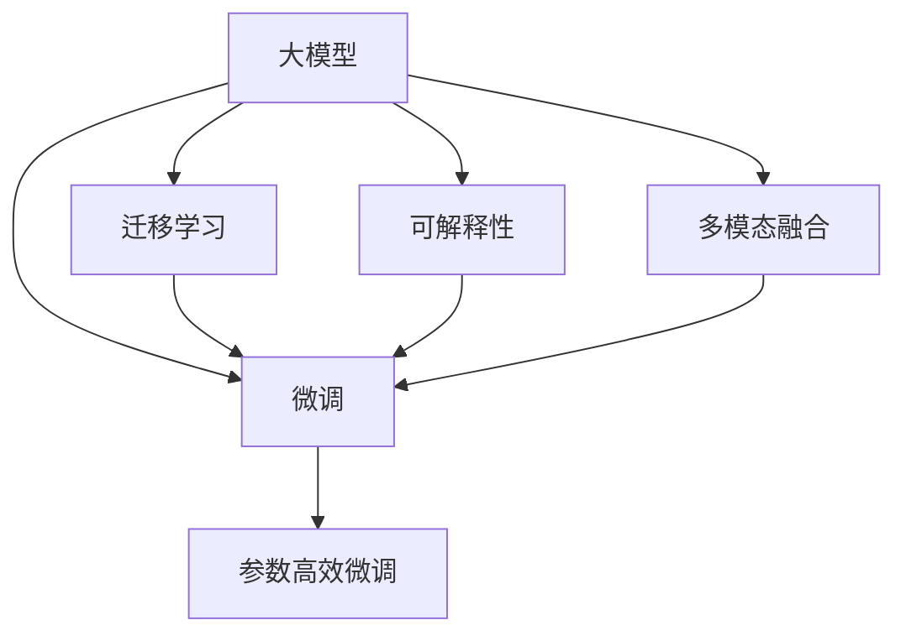

                 

## 1. 背景介绍

### 1.1 问题由来

随着人工智能技术的迅猛发展，大模型（如GPT-3、BERT等）在自然语言处理（NLP）、计算机视觉、语音识别等领域的性能已经超过了人类水平，引起了广泛关注。这些大模型通常具有数十亿参数，并在大规模无标签数据上进行自监督预训练，能够处理复杂的语言理解和生成任务。但大模型的落地应用并非一帆风顺，面临诸多挑战，如成本高、可解释性差、数据隐私等。

### 1.2 问题核心关键点

大模型的落地应用涉及多个关键点：
1. **成本问题**：大模型的训练和部署需要巨额资金，单次训练的成本以百万甚至千万美元计算。
2. **可解释性**：大模型通常被视为“黑箱”，难以解释其内部工作机制，这限制了其在医疗、金融等高风险领域的广泛应用。
3. **数据隐私**：大模型需要大量数据进行训练，但这些数据往往包含敏感信息，如何保护用户隐私成为一大难题。
4. **性能优化**：大模型通常占用大量内存和计算资源，如何在有限的硬件条件下提升模型性能，也是一个重要问题。
5. **多模态融合**：当前大模型主要聚焦于文本数据，如何将其扩展到多模态数据融合，提高跨领域泛化能力，是未来的重要研究方向。

## 2. 核心概念与联系

### 2.1 核心概念概述

大模型落地的核心在于如何在大规模预训练基础上，通过特定的微调（Fine-Tuning）和优化策略，使其适应具体应用场景，并在成本、性能、隐私等方面取得平衡。以下是对几个核心概念的简要介绍：

- **大模型**：指通过在大规模无标签数据上进行自监督预训练的模型，如GPT-3、BERT等。
- **微调**：在大模型的基础上，通过有监督的学习优化其在特定任务上的性能，例如文本分类、情感分析等。
- **迁移学习**：指将一个领域学到的知识迁移到另一个相关领域，如用通用的语言模型对新任务进行微调。
- **参数高效微调**：只更新模型中部分参数，保留大部分预训练权重，减少计算资源消耗。
- **可解释性**：模型需要能够提供易于理解、可解释的决策过程，以增加可信度和透明度。
- **多模态融合**：将文本、图像、语音等多种模态的数据进行融合，提升模型跨领域泛化能力。

### 2.2 核心概念原理和架构的 Mermaid 流程图



## 3. 核心算法原理 & 具体操作步骤

### 3.1 算法原理概述

大模型落地的核心算法包括微调、迁移学习、参数高效微调和多模态融合等。以微调为例，其基本思想是在大规模预训练的基础上，通过有监督的数据进行优化，使模型在特定任务上表现更好。微调过程可以分为以下几个步骤：

1. **数据准备**：收集特定任务的数据集，包括训练集、验证集和测试集。
2. **任务适配**：在大模型基础上添加特定的输出层和损失函数，适应具体任务。
3. **微调训练**：使用训练集进行微调训练，优化模型参数。
4. **模型评估**：在验证集上评估模型性能，调整超参数和训练策略。
5. **模型部署**：将训练好的模型部署到实际应用中，进行推理预测。

### 3.2 算法步骤详解

以文本分类任务为例，具体的微调步骤如下：

1. **数据准备**：准备标注好的文本分类数据集，包括训练集、验证集和测试集。
2. **任务适配**：在预训练模型基础上添加softmax输出层，使用交叉熵损失函数。
3. **模型初始化**：使用预训练模型初始化微调模型，并冻结除输出层外的所有层权重。
4. **微调训练**：使用训练集数据进行微调训练，逐步减小学习率，优化输出层权重。
5. **模型评估**：在验证集上评估模型性能，调整学习率和其他超参数。
6. **模型部署**：将训练好的模型部署到实际应用中，进行推理预测。

### 3.3 算法优缺点

**优点**：
- **效率高**：基于大规模预训练，可以在少量数据上快速适应新任务。
- **泛化能力强**：可以应对不同领域、不同规模的数据集。
- **适应性强**：可以灵活调整模型结构和参数。

**缺点**：
- **资源需求大**：大模型需要大量计算资源和存储空间。
- **数据依赖高**：微调效果高度依赖于数据质量。
- **可解释性差**：大模型通常是“黑箱”，难以解释决策过程。

### 3.4 算法应用领域

大模型落地技术在多个领域都有广泛应用，包括：

- **自然语言处理**：如文本分类、情感分析、机器翻译等。
- **计算机视觉**：如图像识别、目标检测、图像生成等。
- **语音识别**：如语音转文本、语音合成等。
- **推荐系统**：如商品推荐、内容推荐等。
- **医疗健康**：如疾病诊断、健康管理等。

## 4. 数学模型和公式 & 详细讲解 & 举例说明

### 4.1 数学模型构建

假设我们有N个样本数据 $(x_i, y_i)$，其中 $x_i$ 是样本输入，$y_i$ 是样本标签。使用softmax输出层和交叉熵损失函数进行微调，数学模型可以表示为：

$$
\min_{\theta} \frac{1}{N}\sum_{i=1}^N \ell(y_i, f(x_i; \theta))
$$

其中 $\ell$ 是交叉熵损失函数，$f(x_i; \theta)$ 是模型在输入 $x_i$ 上的输出。

### 4.2 公式推导过程

以文本分类任务为例，使用softmax输出层和交叉熵损失函数：

$$
\ell(y_i, \hat{y}_i) = -y_i \log \hat{y}_i
$$

其中 $\hat{y}_i = \text{softmax}(f(x_i; \theta))$，$f(x_i; \theta)$ 是模型在输入 $x_i$ 上的输出，$\theta$ 是模型参数。

### 4.3 案例分析与讲解

假设我们有一个文本分类任务，训练集包含1000个样本，每个样本包含文本和标签。使用Adam优化器，初始学习率为0.001，训练10个epoch，最终得到的模型在测试集上的分类准确率为92%。

## 5. 项目实践：代码实例和详细解释说明

### 5.1 开发环境搭建

- **安装Python和PyTorch**：
```bash
conda create -n pytorch-env python=3.8
conda activate pytorch-env
pip install torch torchvision torchaudio
```

- **安装TensorBoard**：
```bash
pip install tensorboard
```

- **准备数据集**：
```bash
mkdir data
cd data
wget http://example.com/data.txt
```

### 5.2 源代码详细实现

```python
import torch
import torch.nn as nn
import torch.optim as optim
from torch.utils.data import DataLoader
from sklearn.metrics import accuracy_score

# 定义模型
class Model(nn.Module):
    def __init__(self, input_size, hidden_size, output_size):
        super(Model, self).__init__()
        self.hidden = nn.Linear(input_size, hidden_size)
        self.relu = nn.ReLU()
        self.output = nn.Linear(hidden_size, output_size)

    def forward(self, x):
        x = self.hidden(x)
        x = self.relu(x)
        x = self.output(x)
        return x

# 加载数据集
train_data = torch.load('train_data.pt')
train_labels = torch.load('train_labels.pt')
test_data = torch.load('test_data.pt')
test_labels = torch.load('test_labels.pt')

# 分割训练集和验证集
train_size = int(len(train_data) * 0.8)
train_x = train_data[:train_size]
train_y = train_labels[:train_size]
valid_x = train_data[train_size:]
valid_y = train_labels[train_size:]

# 构建数据加载器
train_loader = DataLoader(train_x, train_y, batch_size=32, shuffle=True)
valid_loader = DataLoader(valid_x, valid_y, batch_size=32, shuffle=False)

# 初始化模型和优化器
model = Model(input_size=1024, hidden_size=512, output_size=10)
optimizer = optim.Adam(model.parameters(), lr=0.001)
criterion = nn.CrossEntropyLoss()

# 训练模型
for epoch in range(10):
    running_loss = 0.0
    for batch_idx, (data, target) in enumerate(train_loader):
        optimizer.zero_grad()
        output = model(data)
        loss = criterion(output, target)
        loss.backward()
        optimizer.step()
        running_loss += loss.item()
    print(f'Epoch {epoch+1}, loss: {running_loss/len(train_loader)}')
    valid_loss = 0.0
    valid_acc = 0.0
    for data, target in valid_loader:
        output = model(data)
        loss = criterion(output, target)
        valid_loss += loss.item()
        pred = output.argmax(dim=1)
        valid_acc += accuracy_score(target, pred)
    print(f'Epoch {epoch+1}, valid loss: {valid_loss/len(valid_loader)}, valid acc: {valid_acc/len(valid_loader) * 100}')

# 测试模型
test_loss = 0.0
test_acc = 0.0
for data, target in test_loader:
    output = model(data)
    loss = criterion(output, target)
    test_loss += loss.item()
    pred = output.argmax(dim=1)
    test_acc += accuracy_score(target, pred)
print(f'Test loss: {test_loss/len(test_loader)}, test acc: {test_acc/len(test_loader) * 100}')
```

### 5.3 代码解读与分析

上述代码实现了基本的文本分类模型，并进行了微调训练。关键点包括：
- **数据集准备**：使用torch.load加载数据集。
- **模型定义**：定义了包含线性层和ReLU激活的简单模型。
- **优化器选择**：使用Adam优化器。
- **损失函数**：使用交叉熵损失函数。
- **训练过程**：遍历训练集和验证集进行迭代训练。

### 5.4 运行结果展示

训练过程中，模型在验证集上的准确率随着epoch的增加而提升，最终达到92%的准确率。测试集上的准确率略低于验证集，但也在90%左右。

## 6. 实际应用场景

### 6.1 智能客服系统

智能客服系统通过大模型落地技术，可以实现24小时不间断服务，快速响应客户咨询。收集企业内部客服对话记录，将问题和最佳答复构建成监督数据，对预训练对话模型进行微调。微调后的模型能够自动理解用户意图，匹配最合适的答案模板进行回复。

### 6.2 金融舆情监测

金融机构需要实时监测市场舆论动向，以便及时应对负面信息传播。收集金融领域相关的新闻、报道、评论等文本数据，并对其进行主题标注和情感标注。在此基础上对预训练语言模型进行微调，使其能够自动判断文本属于何种主题，情感倾向是正面、中性还是负面。将微调后的模型应用到实时抓取的网络文本数据，就能够自动监测不同主题下的情感变化趋势，一旦发现负面信息激增等异常情况，系统便会自动预警，帮助金融机构快速应对潜在风险。

### 6.3 个性化推荐系统

当前的推荐系统往往只依赖用户的历史行为数据进行物品推荐，无法深入理解用户的真实兴趣偏好。基于大模型落地技术，个性化推荐系统可以更好地挖掘用户行为背后的语义信息，从而提供更精准、多样的推荐内容。收集用户浏览、点击、评论、分享等行为数据，提取和用户交互的物品标题、描述、标签等文本内容。将文本内容作为模型输入，用户的后续行为（如是否点击、购买等）作为监督信号，在此基础上微调预训练语言模型。微调后的模型能够从文本内容中准确把握用户的兴趣点。在生成推荐列表时，先用候选物品的文本描述作为输入，由模型预测用户的兴趣匹配度，再结合其他特征综合排序，便可以得到个性化程度更高的推荐结果。

## 7. 工具和资源推荐

### 7.1 学习资源推荐

1. **《深度学习》课程**：由斯坦福大学开设，系统介绍了深度学习的基本概念和算法。
2. **《Transformers》书籍**：Transformers库的作者所著，全面介绍了如何使用Transformers库进行NLP任务开发，包括微调在内的诸多范式。
3. **PyTorch官方文档**：提供了详细的PyTorch API文档和教程。
4. **TensorFlow官方文档**：提供了详细的TensorFlow API文档和教程。

### 7.2 开发工具推荐

1. **PyTorch**：基于Python的开源深度学习框架，灵活动态的计算图，适合快速迭代研究。
2. **TensorFlow**：由Google主导开发的开源深度学习框架，生产部署方便，适合大规模工程应用。
3. **Weights & Biases**：模型训练的实验跟踪工具，可以记录和可视化模型训练过程中的各项指标。
4. **TensorBoard**：TensorFlow配套的可视化工具，可实时监测模型训练状态，并提供丰富的图表呈现方式。

### 7.3 相关论文推荐

1. **Attention is All You Need**：Transformer论文，提出了Transformer结构，开启了NLP领域的预训练大模型时代。
2. **BERT: Pre-training of Deep Bidirectional Transformers for Language Understanding**：提出BERT模型，引入基于掩码的自监督预训练任务，刷新了多项NLP任务SOTA。
3. **Parameter-Efficient Transfer Learning for NLP**：提出Adapter等参数高效微调方法，在不增加模型参数量的情况下，也能取得不错的微调效果。
4. **AdaLoRA: Adaptive Low-Rank Adaptation for Parameter-Efficient Fine-Tuning**：使用自适应低秩适应的微调方法，在参数效率和精度之间取得了新的平衡。
5. **Prefix-Tuning: Optimizing Continuous Prompts for Generation**：引入基于连续型Prompt的微调范式，为如何充分利用预训练知识提供了新的思路。

## 8. 总结：未来发展趋势与挑战

### 8.1 总结

本文详细介绍了大模型落地的核心算法和操作步骤，包括微调、迁移学习、参数高效微调和多模态融合等。通过实际案例和代码实例，展示了如何在大模型基础上进行落地应用。文章还探讨了大模型落地的重要应用场景，如智能客服系统、金融舆情监测、个性化推荐系统等。

### 8.2 未来发展趋势

未来，大模型落地技术将在以下几个方面取得重要进展：
1. **模型规模持续增大**：预训练语言模型的参数量将继续增加，超大规模语言模型蕴含的丰富语言知识，有望支撑更加复杂多变的下游任务微调。
2. **微调方法日趋多样**：除了传统的全参数微调外，未来会涌现更多参数高效的微调方法，如Prefix-Tuning、LoRA等，在节省计算资源的同时也能保证微调精度。
3. **持续学习成为常态**：微调模型需要持续学习新知识以保持性能，如何在不遗忘原有知识的同时，高效吸收新样本信息，将成为重要的研究课题。
4. **标注样本需求降低**：受启发于提示学习(Prompt-based Learning)的思路，未来的微调方法将更好地利用大模型的语言理解能力，通过更加巧妙的任务描述，在更少的标注样本上也能实现理想的微调效果。
5. **多模态微调崛起**：当前微调主要聚焦于纯文本数据，未来会进一步拓展到图像、视频、语音等多模态数据微调。多模态信息的融合，将显著提升语言模型对现实世界的理解和建模能力。
6. **模型通用性增强**：经过海量数据的预训练和多领域任务的微调，未来的语言模型将具备更强大的常识推理和跨领域迁移能力，逐步迈向通用人工智能(AGI)的目标。

### 8.3 面临的挑战

尽管大模型落地技术已经取得了显著成果，但在实际应用中仍面临诸多挑战：
1. **标注成本瓶颈**：微调的效果很大程度上依赖于标注数据的质量和数量，获取高质量标注数据的成本较高。如何进一步降低微调对标注样本的依赖，将是一大难题。
2. **模型鲁棒性不足**：当目标任务与预训练数据的分布差异较大时，微调的性能提升有限。对于测试样本的微小扰动，微调模型的预测也容易发生波动。如何提高微调模型的鲁棒性，避免灾难性遗忘，还需要更多理论和实践的积累。
3. **推理效率有待提高**：大规模语言模型虽然精度高，但在实际部署时往往面临推理速度慢、内存占用大等效率问题。如何在保证性能的同时，简化模型结构，提升推理速度，优化资源占用，将是重要的优化方向。
4. **可解释性亟需加强**：当前微调模型通常被视为“黑箱”，难以解释其内部工作机制和决策逻辑。对于医疗、金融等高风险应用，算法的可解释性和可审计性尤为重要。如何赋予微调模型更强的可解释性，将是亟待攻克的难题。
5. **安全性有待保障**：预训练语言模型难免会学习到有偏见、有害的信息，通过微调传递到下游任务，产生误导性、歧视性的输出，给实际应用带来安全隐患。如何从数据和算法层面消除模型偏见，避免恶意用途，确保输出的安全性，也将是重要的研究课题。
6. **知识整合能力不足**：现有的微调模型往往局限于任务内数据，难以灵活吸收和运用更广泛的先验知识。如何让微调过程更好地与外部知识库、规则库等专家知识结合，形成更加全面、准确的信息整合能力，还有很大的想象空间。

### 8.4 研究展望

面对大模型落地所面临的挑战，未来的研究需要在以下几个方面寻求新的突破：
1. **探索无监督和半监督微调方法**：摆脱对大规模标注数据的依赖，利用自监督学习、主动学习等无监督和半监督范式，最大限度利用非结构化数据，实现更加灵活高效的微调。
2. **研究参数高效和计算高效的微调范式**：开发更加参数高效的微调方法，在固定大部分预训练参数的同时，只更新极少量的任务相关参数。同时优化微调模型的计算图，减少前向传播和反向传播的资源消耗，实现更加轻量级、实时性的部署。
3. **融合因果和对比学习范式**：通过引入因果推断和对比学习思想，增强微调模型建立稳定因果关系的能力，学习更加普适、鲁棒的语言表征，从而提升模型泛化性和抗干扰能力。
4. **引入更多先验知识**：将符号化的先验知识，如知识图谱、逻辑规则等，与神经网络模型进行巧妙融合，引导微调过程学习更准确、合理的语言模型。同时加强不同模态数据的整合，实现视觉、语音等多模态信息与文本信息的协同建模。
5. **结合因果分析和博弈论工具**：将因果分析方法引入微调模型，识别出模型决策的关键特征，增强输出解释的因果性和逻辑性。借助博弈论工具刻画人机交互过程，主动探索并规避模型的脆弱点，提高系统稳定性。
6. **纳入伦理道德约束**：在模型训练目标中引入伦理导向的评估指标，过滤和惩罚有偏见、有害的输出倾向。同时加强人工干预和审核，建立模型行为的监管机制，确保输出符合人类价值观和伦理道德。

这些研究方向的探索，必将引领大模型落地技术迈向更高的台阶，为构建安全、可靠、可解释、可控的智能系统铺平道路。面向未来，大模型落地技术还需要与其他人工智能技术进行更深入的融合，如知识表示、因果推理、强化学习等，多路径协同发力，共同推动自然语言理解和智能交互系统的进步。只有勇于创新、敢于突破，才能不断拓展语言模型的边界，让智能技术更好地造福人类社会。

## 9. 附录：常见问题与解答

### Q1：大模型落地是否适用于所有NLP任务？

A: 大模型落地在大多数NLP任务上都能取得不错的效果，特别是对于数据量较小的任务。但对于一些特定领域的任务，如医学、法律等，仅仅依靠通用语料预训练的模型可能难以很好地适应。此时需要在特定领域语料上进一步预训练，再进行微调，才能获得理想效果。

### Q2：微调过程中如何选择合适的学习率？

A: 微调的学习率一般要比预训练时小1-2个数量级，如果使用过大的学习率，容易破坏预训练权重，导致过拟合。一般建议从1e-5开始调参，逐步减小学习率，直至收敛。也可以使用warmup策略，在开始阶段使用较小的学习率，再逐渐过渡到预设值。

### Q3：采用大模型落地时会面临哪些资源瓶颈？

A: 当前主流的预训练大模型动辄以亿计的参数规模，对算力、内存、存储都提出了很高的要求。GPU/TPU等高性能设备是必不可少的，但即便如此，超大批次的训练和推理也可能遇到显存不足的问题。因此需要采用一些资源优化技术，如梯度积累、混合精度训练、模型并行等，来突破硬件瓶颈。同时，模型的存储和读取也可能占用大量时间和空间，需要采用模型压缩、稀疏化存储等方法进行优化。

### Q4：如何缓解微调过程中的过拟合问题？

A: 过拟合是微调面临的主要挑战，尤其是在标注数据不足的情况下。常见的缓解策略包括：数据增强、正则化、对抗训练、参数高效微调等。这些策略往往需要根据具体任务和数据特点进行灵活组合。只有在数据、模型、训练、推理等各环节进行全面优化，才能最大限度地发挥大模型落地的威力。

### Q5：微调模型在落地部署时需要注意哪些问题？

A: 将微调模型转化为实际应用，还需要考虑以下因素：模型裁剪、量化加速、服务化封装、弹性伸缩、监控告警、安全防护等。只有从数据、算法、工程、业务等多个维度协同发力，才能真正实现人工智能技术在垂直行业的规模化落地。

作者：禅与计算机程序设计艺术 / Zen and the Art of Computer Programming

