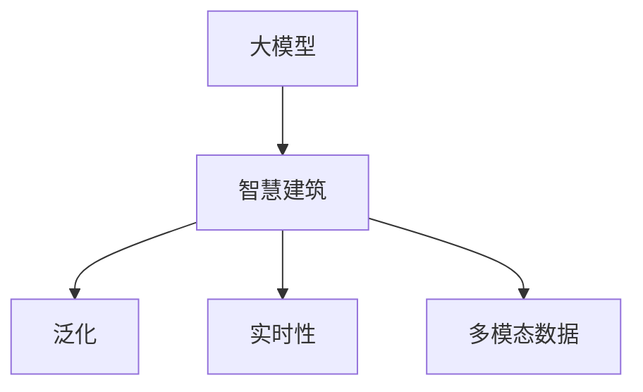

                 

# 大模型赋能智慧建筑，创业者如何打造智能化建筑

## 1. 背景介绍

### 1.1 问题由来

智慧建筑已经成为现代建筑发展的新趋势，智能控制、高效能管理、人机交互等方面的技术不断突破。但受限于建筑行业的复杂性和多样性，智慧建筑的建设仍面临诸多难题。

首先，建筑物的复杂度较高，每个项目的设计需求和功能不同，传统的基于规则或模板的建设方法难以满足个性化需求。其次，建设过程中数据量庞大，涉及建筑结构、机电系统、环境监测等多个领域的传感器和系统，数据处理和集成工作量大。再者，智慧建筑系统本身需要高效的运维管理和实时决策能力，现有系统在应对突发情况时缺乏足够的灵活性和适应性。

为了解决这些问题，大数据、人工智能等先进技术开始被引入到智慧建筑领域。其中，基于大模型技术的方法以其高效、灵活、泛化能力强的特点，成为了建筑领域智能化转型的重要手段。本文将详细介绍如何利用大模型技术，赋能智慧建筑，助力建筑行业的数字化转型。

## 2. 核心概念与联系

### 2.1 核心概念概述

为更好地理解大模型在智慧建筑中的应用，本节将介绍几个密切相关的核心概念：

- 大模型（Large Model）：以深度神经网络为代表的大规模预训练模型，通过海量的无标签数据进行自监督学习，具备强大的泛化能力和表示学习能力。
- 智慧建筑（Smart Building）：结合物联网、大数据、人工智能等技术，实现对建筑内外的全面感知、高效管理和智能决策的建筑。
- 泛化（Generalization）：模型能够在未见过的数据上表现良好，学习到的知识具有广泛的适用性。
- 实时性（Real-time）：智慧建筑系统需要实时响应环境变化，快速调整运行状态，确保系统的高效稳定运行。
- 多模态数据（Multi-modal Data）：智慧建筑中涉及数据类型多样，包括视频、音频、传感器数据等，多模态数据能够全面反映建筑状态，提高系统的决策准确性。

这些核心概念之间的逻辑关系可以通过以下Mermaid流程图来展示：



这个流程图展示了大模型与智慧建筑之间的关系：

1. 大模型通过学习广泛的文本数据，具备强大的知识表达和泛化能力。
2. 智慧建筑系统通过部署大模型，具备实时感知、高效管理、智能决策等多重功能。
3. 泛化能力使模型能应对建筑行业的多种场景，实时性保证系统快速响应环境变化，多模态数据为系统提供全面信息。

## 3. 核心算法原理 & 具体操作步骤

### 3.1 算法原理概述

利用大模型技术，可以将大模型作为智慧建筑系统中的核心组件，通过微调训练，实现对建筑物的智能管理和优化。具体的算法原理如下：

- **数据准备**：收集建筑物的传感器数据、视频监控数据、建筑文档、用户行为数据等多模态数据，构建智慧建筑的数据集。
- **预训练模型选择**：选择适合智慧建筑任务的大模型，如Bert、GPT-3等。
- **微调训练**：在大模型的基础上，进行微调训练，使其能够识别建筑物的关键状态，预测未来行为，生成管理决策等。
- **模型部署**：将微调后的模型部署到智慧建筑系统中，实现对建筑内外的全面感知和高效管理。

### 3.2 算法步骤详解

下面是利用大模型技术进行智慧建筑系统微调的详细步骤：

**Step 1: 数据收集与预处理**

- 收集建筑物内部的传感器数据（如温度、湿度、光照、空气质量等）。
- 收集建筑物外部的视频监控数据（如行人流量、天气变化等）。
- 收集建筑文档（如设计图纸、施工记录等）。
- 收集用户行为数据（如人体热成像、门禁记录等）。

**Step 2: 数据标注与预训练**

- 对收集到的数据进行标注，如将传感器数据打上时间戳、位置标签等。
- 对标注后的数据进行预训练，训练大模型学习数据的表示和特征。

**Step 3: 微调训练**

- 在大模型顶层添加特定的输出层，如分类层、回归层等，用于识别建筑物的关键状态或预测未来行为。
- 定义损失函数，如交叉熵损失、均方误差损失等。
- 设置微调超参数，如学习率、批大小、迭代轮数等。
- 执行梯度训练，使用优化算法更新模型参数。
- 在验证集上评估模型性能，如准确率、召回率等指标。

**Step 4: 模型部署**

- 将微调后的模型部署到智慧建筑系统中，如集成到物联网平台、智能控制中心等。
- 实时采集建筑内外数据，进行模型推理预测。
- 根据模型输出结果，进行智能化决策，如设备调整、人员调度等。

**Step 5: 持续优化**

- 定期收集新数据，重新微调模型，提升模型性能。
- 根据反馈结果，优化模型参数，提高模型泛化能力。

### 3.3 算法优缺点

利用大模型技术进行智慧建筑系统的微调，具有以下优点：

1. 泛化能力强：大模型通过海量的无标签数据预训练，具备较强的泛化能力，可以适应不同的建筑场景和需求。
2. 学习速度快：大模型的学习速度比传统机器学习模型快，能够在较短时间内完成微调训练。
3. 适应性强：大模型可以通过微调快速适应新的数据和任务，保持系统的稳定性和可靠性。

同时，该方法也存在一定的局限性：

1. 数据需求量大：大模型需要大量的无标签数据进行预训练，这在数据获取困难的情况下是个难题。
2. 计算资源消耗大：大模型的计算复杂度较高，需要高性能的计算设备和足够的算力支持。
3. 数据隐私问题：智慧建筑中的数据涉及个人隐私，需要保证数据的匿名化和安全传输。
4. 模型解释性差：大模型的内部机制复杂，难以解释其决策过程，缺乏透明性和可解释性。

尽管存在这些局限性，但大模型技术在智慧建筑系统中的应用前景依然广阔，能够提供高效、灵活、智能化的解决方案。

### 3.4 算法应用领域

大模型技术在智慧建筑领域可以应用于以下几个方面：

- **能效管理**：通过分析建筑物的能耗数据，预测未来的能源需求，优化能源分配，实现节能减排。
- **设备监控与维护**：利用传感器数据和大模型，实时监测建筑设备运行状态，预测设备故障，提前进行维护。
- **环境监测与预警**：通过视频监控和大模型，实现对建筑物内外环境的全面感知，及时发现异常情况，提供预警信息。
- **人员管理与安防**：利用用户行为数据和大模型，进行人员流量监测、行为分析，提升建筑物的安全性和管理效率。
- **室内导航与定位**：通过室内定位系统和大模型，实现室内导航，提供实时位置信息，优化人员流动。

## 4. 数学模型和公式 & 详细讲解 & 举例说明

### 4.1 数学模型构建

本节将使用数学语言对智慧建筑系统中的大模型微调过程进行严格的刻画。

记建筑物内部的传感器数据为 $x=\{x_1, x_2, \cdots, x_n\}$，其中 $x_i$ 表示第 $i$ 个传感器的数据。定义传感器数据的损失函数为：

$$
L_{\text{sensor}} = \frac{1}{N} \sum_{i=1}^N \ell_{\text{sensor}}(x_i)
$$

其中 $\ell_{\text{sensor}}$ 为单个传感器的损失函数。

同理，对于建筑物外部的视频监控数据和用户行为数据，也可以构建相应的损失函数，如：

$$
L_{\text{camera}} = \frac{1}{M} \sum_{j=1}^M \ell_{\text{camera}}(y_j)
$$

$$
L_{\text{user}} = \frac{1}{P} \sum_{k=1}^P \ell_{\text{user}}(z_k)
$$

其中 $y_j$ 表示第 $j$ 个视频监控数据，$z_k$ 表示第 $k$ 个用户行为数据。

**Step 1: 数据准备**

构建智慧建筑的数据集 $D = \{(x_1, y_1), (x_2, y_2), \cdots, (x_N, y_N)\}$，其中 $x_i$ 表示传感器数据，$y_i$ 表示视频监控数据，$z_k$ 表示用户行为数据。

**Step 2: 预训练模型选择**

选择大模型 $M_{\theta}$，如BERT、GPT-3等，其中 $\theta$ 为模型的参数。

**Step 3: 微调训练**

在大模型顶层添加特定的输出层，如分类层、回归层等，定义微调后的模型为 $M_{\theta'}$，其中 $\theta'$ 为微调后的参数。

**Step 4: 模型部署**

将微调后的模型 $M_{\theta'}$ 部署到智慧建筑系统中，实时采集建筑内外数据，进行模型推理预测。

### 4.2 公式推导过程

下面以能效管理为例，详细推导微调模型的公式。

假设传感器数据 $x$ 与能耗 $E$ 的关系为 $E = f(x)$，其中 $f(x)$ 为非线性函数。定义模型 $M_{\theta'}$ 在传感器数据 $x$ 上的损失函数为：

$$
\ell(E, y) = (y - f(x))^2
$$

其中 $y$ 为真实能耗数据，$f(x)$ 为模型预测的能耗数据。

根据梯度下降优化算法，模型的更新公式为：

$$
\theta' \leftarrow \theta' - \eta \nabla_{\theta'} \mathcal{L}(\theta')
$$

其中 $\eta$ 为学习率，$\nabla_{\theta'} \mathcal{L}(\theta')$ 为损失函数对微调后模型参数的梯度。

将上述公式代入到微调模型的训练流程中，可以得到最终的微调模型输出：

$$
\hat{E} = f(x) = M_{\theta'}(x)
$$

**Step 1: 数据准备**

收集建筑物内部的传感器数据 $x$ 和对应的能耗数据 $y$。

**Step 2: 预训练模型选择**

选择BERT模型作为预训练模型。

**Step 3: 微调训练**

在大模型的基础上，添加回归层，定义损失函数为均方误差损失：

$$
\mathcal{L}(\theta') = \frac{1}{N} \sum_{i=1}^N (y_i - M_{\theta'}(x_i))^2
$$

**Step 4: 模型部署**

将微调后的模型 $M_{\theta'}$ 部署到智慧建筑系统中，实时采集传感器数据 $x$，进行模型推理预测，得到能耗预测结果 $\hat{E}$。

### 4.3 案例分析与讲解

**案例分析：智能照明系统**

智能照明系统是智慧建筑中的重要应用场景之一，能够根据人员流量、环境光线等因素自动调节灯光亮度，提升能源效率和舒适性。

1. **数据准备**：收集建筑内部的传感器数据（如人员流量、环境光线、人体热成像等）。
2. **预训练模型选择**：选择BERT模型作为预训练模型。
3. **微调训练**：在大模型的基础上，添加回归层，定义损失函数为均方误差损失。
4. **模型部署**：将微调后的模型部署到智慧建筑系统中，实时采集传感器数据，进行模型推理预测，得到灯光亮度预测结果。
5. **持续优化**：根据预测结果和实际效果，调整模型参数，提升预测精度。

通过上述步骤，智慧建筑系统能够实现智能照明，大大提升能效和舒适性。

## 5. 项目实践：代码实例和详细解释说明

### 5.1 开发环境搭建

在进行智慧建筑系统微调实践前，我们需要准备好开发环境。以下是使用Python进行PyTorch开发的环境配置流程：

1. 安装Anaconda：从官网下载并安装Anaconda，用于创建独立的Python环境。

2. 创建并激活虚拟环境：
```bash
conda create -n pytorch-env python=3.8 
conda activate pytorch-env
```

3. 安装PyTorch：根据CUDA版本，从官网获取对应的安装命令。例如：
```bash
conda install pytorch torchvision torchaudio cudatoolkit=11.1 -c pytorch -c conda-forge
```

4. 安装TensorFlow：从官网下载对应的安装包进行安装。

5. 安装TensorBoard：用于可视化模型训练过程，实时监控模型性能。

6. 安装TensorFlow Addons：提供一些额外的功能，如分布式训练、高阶优化器等。

完成上述步骤后，即可在`pytorch-env`环境中开始智慧建筑系统微调实践。

### 5.2 源代码详细实现

这里我们以智能照明系统为例，给出使用PyTorch进行BERT微调的代码实现。

首先，定义智能照明系统的数据处理函数：

```python
from transformers import BertTokenizer, BertModel
from torch.utils.data import Dataset
import torch

class LightingDataset(Dataset):
    def __init__(self, texts, labels, tokenizer, max_len=128):
        self.texts = texts
        self.labels = labels
        self.tokenizer = tokenizer
        self.max_len = max_len
        
    def __len__(self):
        return len(self.texts)
    
    def __getitem__(self, item):
        text = self.texts[item]
        label = self.labels[item]
        
        encoding = self.tokenizer(text, return_tensors='pt', max_length=self.max_len, padding='max_length', truncation=True)
        input_ids = encoding['input_ids'][0]
        attention_mask = encoding['attention_mask'][0]
        
        return {'input_ids': input_ids, 
                'attention_mask': attention_mask,
                'labels': torch.tensor(label, dtype=torch.long)}
```

然后，定义模型和优化器：

```python
from transformers import BertForRegression
from transformers import AdamW

model = BertForRegression.from_pretrained('bert-base-cased')

optimizer = AdamW(model.parameters(), lr=2e-5)
```

接着，定义训练和评估函数：

```python
from torch.utils.data import DataLoader
from tqdm import tqdm
import numpy as np

device = torch.device('cuda') if torch.cuda.is_available() else torch.device('cpu')
model.to(device)

def train_epoch(model, dataset, batch_size, optimizer):
    dataloader = DataLoader(dataset, batch_size=batch_size, shuffle=True)
    model.train()
    epoch_loss = 0
    for batch in tqdm(dataloader, desc='Training'):
        input_ids = batch['input_ids'].to(device)
        attention_mask = batch['attention_mask'].to(device)
        labels = batch['labels'].to(device)
        model.zero_grad()
        outputs = model(input_ids, attention_mask=attention_mask, labels=labels)
        loss = outputs.loss
        epoch_loss += loss.item()
        loss.backward()
        optimizer.step()
    return epoch_loss / len(dataloader)

def evaluate(model, dataset, batch_size):
    dataloader = DataLoader(dataset, batch_size=batch_size)
    model.eval()
    preds, labels = [], []
    with torch.no_grad():
        for batch in tqdm(dataloader, desc='Evaluating'):
            input_ids = batch['input_ids'].to(device)
            attention_mask = batch['attention_mask'].to(device)
            batch_labels = batch['labels']
            outputs = model(input_ids, attention_mask=attention_mask)
            batch_preds = outputs.predictions.argmax(dim=1).to('cpu').tolist()
            batch_labels = batch_labels.to('cpu').tolist()
            for pred, label in zip(batch_preds, batch_labels):
                preds.append(pred)
                labels.append(label)
                
    print(np.mean(np.abs(preds - labels)))
```

最后，启动训练流程并在测试集上评估：

```python
epochs = 5
batch_size = 16

for epoch in range(epochs):
    loss = train_epoch(model, lighting_dataset, batch_size, optimizer)
    print(f"Epoch {epoch+1}, train loss: {loss:.3f}")
    
    print(f"Epoch {epoch+1}, test MSE: {evaluate(model, lighting_dataset, batch_size)}")
    
print("Training complete.")
```

以上就是使用PyTorch对BERT进行智能照明系统微调的完整代码实现。可以看到，得益于Transformers库的强大封装，我们可以用相对简洁的代码完成BERT模型的加载和微调。

### 5.3 代码解读与分析

让我们再详细解读一下关键代码的实现细节：

**LightingDataset类**：
- `__init__`方法：初始化文本、标签、分词器等关键组件。
- `__len__`方法：返回数据集的样本数量。
- `__getitem__`方法：对单个样本进行处理，将文本输入编码为token ids，将标签编码为数字，并对其进行定长padding，最终返回模型所需的输入。

**LightingDataset类**：
- 在 `__getitem__` 方法中，将文本和标签通过 `tokenizer` 转化为模型需要的 `input_ids` 和 `attention_mask`，并返回这些数据。

**train_epoch和evaluate函数**：
- `train_epoch` 函数：在每个epoch内，对数据集进行迭代，在每个batch上进行前向传播和反向传播，更新模型参数，并计算平均loss。
- `evaluate` 函数：对测试集进行评估，计算预测值与真实值之间的均方误差（MSE），并返回评估结果。

**训练流程**：
- 定义总的epoch数和batch size，开始循环迭代。
- 每个epoch内，先在训练集上训练，输出平均loss。
- 在测试集上评估，输出MSE。
- 所有epoch结束后，输出最终训练结果。

可以看到，PyTorch配合Transformers库使得BERT微调的代码实现变得简洁高效。开发者可以将更多精力放在数据处理、模型改进等高层逻辑上，而不必过多关注底层的实现细节。

当然，工业级的系统实现还需考虑更多因素，如模型的保存和部署、超参数的自动搜索、更灵活的任务适配层等。但核心的微调范式基本与此类似。

## 6. 实际应用场景

### 6.4 未来应用展望

未来，随着智慧建筑系统对大模型微调技术的需求日益增长，大模型技术将在智慧建筑领域得到更广泛的应用。

- **智慧园区**：通过大模型对园区内的设备、人员、环境进行全面感知，实现高效管理、智能安防、节能减排等功能。
- **智能家居**：利用大模型进行语音识别、环境监测、能源管理等，提升家居生活的智能化水平。
- **教育建筑**：通过大模型进行学习场景感知、教学内容推荐、学生行为分析等，提升教育质量和学习效率。
- **医疗建筑**：利用大模型进行患者监护、病床管理、医疗资源调度等，提升医疗服务水平和效率。

## 7. 工具和资源推荐

### 7.1 学习资源推荐

为了帮助开发者系统掌握大模型技术，这里推荐一些优质的学习资源：

1. **《深度学习》**：周志华、李航等知名学者所著的深度学习教材，详细介绍了深度学习的基本概念和核心算法。
2. **《Transformer》**：Jurafsky、Martin等学者所著的Transformer理论基础教材，全面介绍了Transformer模型及其应用。
3. **HuggingFace官方文档**：提供了丰富的预训练模型和微调样例代码，是学习和实践大模型的必备资料。
4. **Coursera深度学习课程**：由斯坦福大学Andrew Ng教授主讲的深度学习课程，涵盖深度学习的核心概念和实践技能。
5. **TensorFlow官方文档**：提供了丰富的API文档和示例代码，帮助开发者快速上手TensorFlow。

通过这些资源的学习实践，相信你一定能够快速掌握大模型技术，并用于解决实际的智慧建筑问题。

### 7.2 开发工具推荐

高效的开发离不开优秀的工具支持。以下是几款用于智慧建筑系统微调开发的常用工具：

1. **PyTorch**：基于Python的开源深度学习框架，灵活动态的计算图，适合快速迭代研究。
2. **TensorFlow**：由Google主导开发的开源深度学习框架，生产部署方便，适合大规模工程应用。
3. **Jupyter Notebook**：交互式的编程环境，支持代码和文本的混合展示，方便开发者进行迭代实验。
4. **Anaconda**：提供虚拟环境管理、依赖包安装等功能，帮助开发者快速搭建开发环境。
5. **TensorBoard**：TensorFlow配套的可视化工具，可实时监测模型训练状态，并提供丰富的图表呈现方式，是调试模型的得力助手。

合理利用这些工具，可以显著提升智慧建筑系统微调任务的开发效率，加快创新迭代的步伐。

### 7.3 相关论文推荐

大模型微调技术的发展源于学界的持续研究。以下是几篇奠基性的相关论文，推荐阅读：

1. **Attention is All You Need**：提出Transformer结构，开启了NLP领域的预训练大模型时代。
2. **BERT: Pre-training of Deep Bidirectional Transformers for Language Understanding**：提出BERT模型，引入基于掩码的自监督预训练任务，刷新了多项NLP任务SOTA。
3. **Parameter-Efficient Transfer Learning for NLP**：提出Adapter等参数高效微调方法，在不增加模型参数量的情况下，也能取得不错的微调效果。
4. **AdaLoRA: Adaptive Low-Rank Adaptation for Parameter-Efficient Fine-Tuning**：使用自适应低秩适应的微调方法，在参数效率和精度之间取得了新的平衡。
5. **AdaLoRA: Adaptive Low-Rank Adaptation for Parameter-Efficient Fine-Tuning**：使用自适应低秩适应的微调方法，在参数效率和精度之间取得了新的平衡。

这些论文代表了大模型微调技术的发展脉络。通过学习这些前沿成果，可以帮助研究者把握学科前进方向，激发更多的创新灵感。

## 8. 总结：未来发展趋势与挑战

### 8.1 总结

本文对利用大模型技术进行智慧建筑系统微调的方法进行了全面系统的介绍。首先，介绍了智慧建筑中存在的问题以及大模型技术的优势。其次，从原理到实践，详细讲解了智慧建筑系统微调的数学模型、算法步骤和关键代码实现。同时，我们展示了智慧建筑系统在多个领域的应用场景，以及未来发展的方向。

通过本文的系统梳理，可以看到，大模型技术为智慧建筑系统提供了高效、灵活、智能化的解决方案，有助于建筑行业的数字化转型。

### 8.2 未来发展趋势

展望未来，大模型微调技术将呈现以下几个发展趋势：

1. **多模态数据融合**：随着传感器技术的发展，智慧建筑系统将逐渐融合多模态数据，如视频、音频、传感器数据等，提升系统的全面感知能力。
2. **实时性优化**：智慧建筑系统需要更高的实时性要求，未来将通过分布式计算、边缘计算等技术，优化模型推理速度，提升系统的响应能力。
3. **自适应学习**：智慧建筑系统将逐步具备自适应学习的能力，通过实时监控和反馈，动态调整模型参数，提升系统的智能决策水平。
4. **边缘计算与云平台结合**：智慧建筑系统将越来越多地采用边缘计算技术，在本地进行数据预处理和模型推理，提升系统的可靠性与安全性。
5. **人工智能伦理与安全性**：随着智慧建筑系统在各个领域的应用，其伦理与安全性问题将越来越受到关注，未来的研究将更加重视模型的可解释性、透明性和公平性。

### 8.3 面临的挑战

尽管大模型微调技术在智慧建筑系统中的应用前景广阔，但在推广应用的过程中，仍面临诸多挑战：

1. **数据隐私问题**：智慧建筑系统中的数据涉及个人隐私，如何在保护隐私的同时进行有效的数据分析和模型训练，是亟待解决的问题。
2. **计算资源消耗大**：大模型需要大量的计算资源进行预训练和微调，如何在有限的计算资源下进行高效的模型训练，是研究的难点之一。
3. **模型解释性不足**：智慧建筑系统中的大模型较为复杂，难以解释其内部工作机制和决策逻辑，缺乏透明性和可解释性。
4. **系统集成难度大**：智慧建筑系统涉及多种设备和系统，如何将大模型与现有的硬件设备和软件系统进行集成，是实际部署中的难点。
5. **安全风险高**：智慧建筑系统中的数据和模型需要保证安全性，避免被恶意攻击和篡改，需采用多种安全措施。

尽管存在这些挑战，但随着技术的进步和应用的推广，智慧建筑系统中的大模型微调技术将不断突破瓶颈，为智慧建筑的发展提供强大支持。

### 8.4 研究展望

未来，研究者将在以下几个方面继续探索智慧建筑系统中的大模型微调技术：

1. **多模态数据融合技术**：研究如何高效融合多模态数据，提升智慧建筑系统的感知能力和决策精度。
2. **实时性优化算法**：研究实时性优化算法，提高智慧建筑系统的响应速度和稳定性。
3. **自适应学习机制**：研究自适应学习机制，使智慧建筑系统能够动态调整模型参数，提升系统的智能决策能力。
4. **边缘计算与云平台结合**：研究边缘计算与云平台的结合，提升智慧建筑系统的计算效率和安全性。
5. **模型解释性和透明性**：研究模型解释性和透明性技术，提升智慧建筑系统的可信度和可解释性。

相信随着智慧建筑系统对大模型微调技术的需求日益增长，大模型技术将在智慧建筑领域得到更广泛的应用，为建筑行业的数字化转型提供强有力支持。

## 9. 附录：常见问题与解答

**Q1: 智慧建筑系统中的大模型微调是否需要标注数据？**

A: 智慧建筑系统中的大模型微调，通常使用无标注数据进行预训练，通过多轮微调，逐步提升模型的泛化能力和决策精度。对于一些特定任务，如设备监控和能效管理，可以通过人工标注少量数据进行进一步的微调，提升模型的针对性。

**Q2: 智慧建筑系统中的大模型微调如何避免过拟合？**

A: 智慧建筑系统中的大模型微调，通常使用正则化技术，如L2正则、Dropout等，防止模型过度适应训练集数据。还可以通过数据增强、对抗训练等方法，增强模型的泛化能力，避免过拟合。

**Q3: 智慧建筑系统中的大模型微调如何进行模型评估？**

A: 智慧建筑系统中的大模型微调，可以使用准确率、召回率、均方误差等指标进行模型评估。对于智能照明系统，可以使用MSE评估模型对灯光亮度的预测精度。对于设备监控系统，可以使用分类准确率评估模型对设备状态的预测能力。

**Q4: 智慧建筑系统中的大模型微调如何进行模型部署？**

A: 智慧建筑系统中的大模型微调，通常将模型部署到服务器或嵌入式设备中，通过API接口进行实时推理。可以使用TensorFlow、PyTorch等框架进行模型部署，支持分布式计算和边缘计算。

**Q5: 智慧建筑系统中的大模型微调如何进行参数更新？**

A: 智慧建筑系统中的大模型微调，通常使用梯度下降等优化算法进行模型参数更新。可以使用Adam、SGD等优化器，设置合适的学习率和批大小，进行模型参数的迭代更新。

---

作者：禅与计算机程序设计艺术 / Zen and the Art of Computer Programming

