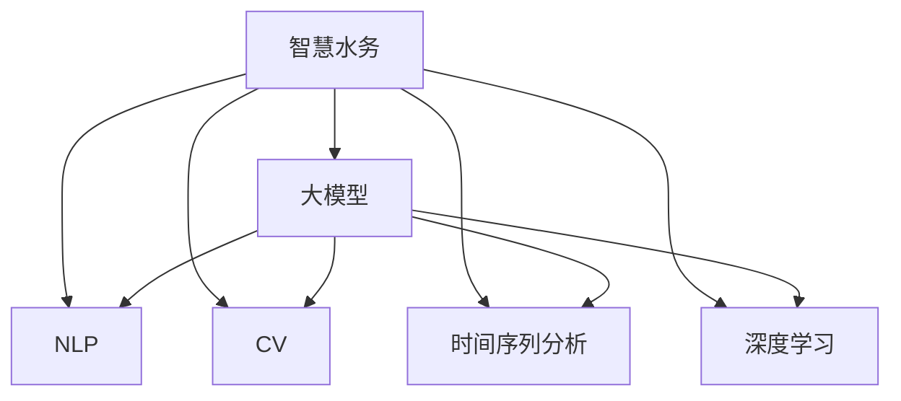

                 

# 大模型赋能智慧水务，创业者如何实现水资源的智能化调度与管理？

> 关键词：智慧水务、水资源调度与管理、大模型、自然语言处理(NLP)、计算机视觉(CV)、时间序列分析、深度学习、创业机会

## 1. 背景介绍

### 1.1 问题由来

水资源是人类生存和社会发展的基石，但随着人口增长、气候变化等因素的叠加，全球水资源面临严峻挑战。根据联合国《2021年世界水发展报告》，全球约有40%的人口面临水资源短缺问题，近一半的国家处于水资源高度紧张状态。如何在现有资源条件下，实现水资源的优化调度与管理，成为全球性的重大课题。

近年来，人工智能技术的迅猛发展为智慧水务的实现提供了新的可能性。特别是基于大模型的智能水务解决方案，通过将机器学习、自然语言处理(NLP)、计算机视觉(CV)等多领域技术相结合，能从海量数据中提取有价值的洞察，优化水务系统运行，保障水资源的高效利用和安全供应。本文章将从核心概念、算法原理、项目实践和应用展望等方面，深入剖析大模型在智慧水务中的应用，探讨创业者如何抓住机遇，实现水资源智能化调度与管理。

### 1.2 问题核心关键点

大模型赋能智慧水务的关键点包括：
- 如何构建大模型，并在水务场景中应用。
- 如何通过多模态数据的融合，提高水务系统的智能化水平。
- 如何实现水资源的动态调度与预测，优化资源配置。
- 如何利用大模型提升水务系统的管理和维护效率。
- 如何构建智慧水务平台，推动水务产业的数字化转型。

## 2. 核心概念与联系

### 2.1 核心概念概述

为了更好地理解大模型在水务场景中的应用，本节将介绍几个密切相关的核心概念：

- **智慧水务**：基于新一代信息技术，对水务系统进行数字化、智能化改造，实现高效、精确、安全的饮用水和污水管理。
- **大模型**：以深度神经网络为核心的多模态大数据模型，具备强大的数据处理和模式识别能力。
- **NLP**：研究如何使计算机能够理解和处理人类语言的技术，广泛应用于水务信息采集和分析。
- **CV**：研究如何使计算机能够理解和处理图像、视频等视觉数据的技术，用于监测水务设施运行状态和环境变化。
- **时间序列分析**：研究如何对按时间顺序排列的数据进行建模和预测，广泛应用于水务系统的流量和水量预测。
- **深度学习**：研究深度神经网络及其应用，包括自然语言处理、图像识别、生成对抗网络(GANs)等。
- **创业机会**：结合大模型和水务需求的创新创业点，探索智慧水务市场的商业模式和价值增长点。

这些核心概念之间的逻辑关系可以通过以下Mermaid流程图来展示：



这个流程图展示了大模型在水务应用中的核心概念及其之间的关系：

1. 智慧水务通过大数据和AI技术，对水务系统进行智能化改造。
2. 大模型作为智慧水务的关键组件，可以融合NLP、CV、时间序列分析、深度学习等技术。
3. NLP技术用于处理文本数据，如水质报告、用户反馈等。
4. CV技术用于处理图像数据，如水表状态、环境监测等。
5. 时间序列分析用于处理时间序列数据，如流量、水量等。
6. 深度学习技术用于提升模型的建模能力，如异常检测、预测等。

这些概念共同构成了智慧水务的技术框架，为大模型在水务中的应用提供了基础。

## 3. 核心算法原理 & 具体操作步骤

### 3.1 算法原理概述

大模型赋能智慧水务的核心算法原理主要包括：

- **多模态数据融合**：将文本、图像、时间序列等多种类型的数据进行综合处理，全面了解水务系统的状态。
- **异常检测与预警**：利用大模型对异常情况进行检测，并及时发出预警，保障水务系统的稳定运行。
- **流量和水量预测**：通过大模型对未来流量和水量进行预测，优化水资源调度。
- **智能调度与管理**：构建水务智能决策支持系统，提升水务系统的自动化水平和效率。

### 3.2 算法步骤详解

基于大模型的智慧水务应用，通常包含以下步骤：

**Step 1: 数据采集与预处理**
- 采集水务系统的各类数据，包括水质报告、流量监测、环境监测、用户反馈等。
- 对数据进行清洗和标准化，去除噪音和异常值，为模型训练提供干净的数据源。

**Step 2: 数据融合与特征提取**
- 将不同类型的数据进行融合，形成多模态数据集。
- 利用大模型中的文本嵌入技术，对文本数据进行特征提取。
- 利用图像识别模型，对图像数据进行特征提取。
- 利用时间序列模型，对时间序列数据进行特征提取。

**Step 3: 模型训练与调优**
- 选择合适的预训练模型作为初始化参数，如BERT、Transformer等。
- 设计适合水务任务的模型架构，如LSTM、GRU、ResNet等。
- 在标注数据上训练模型，并进行超参数调优。
- 应用正则化技术，如L2正则、Dropout等，防止模型过拟合。

**Step 4: 模型评估与部署**
- 在验证集上评估模型性能，计算准确率、召回率等指标。
- 部署模型到实际的水务系统中，进行实时监测和预测。
- 利用容器化技术，如Docker，将模型封装成服务，方便集成和维护。

**Step 5: 持续优化与迭代**
- 定期收集新的数据，更新模型参数，提升模型性能。
- 通过A/B测试等手段，评估新模型的实际效果。
- 根据用户反馈，不断改进模型功能，优化用户体验。

### 3.3 算法优缺点

大模型赋能智慧水务的优点包括：
- 数据处理能力强：能够处理大规模多模态数据，提取有价值的信息。
- 模型预测准确：利用深度学习技术，提升流量和水量预测的准确性。
- 自动化水平高：通过智能调度与管理，提升水务系统的自动化和智能化水平。
- 响应速度快：实时监测和预测，快速响应异常情况，保障水务系统的稳定运行。

同时，该方法也存在一定的局限性：
- 数据依赖性强：模型的性能高度依赖数据质量，需要大量高质量标注数据。
- 模型计算资源需求高：大模型的训练和推理需要高性能的计算资源。
- 模型解释性差：深度学习模型的决策过程难以解释，缺乏可解释性。
- 维护成本高：模型的部署和维护需要专业知识和技术支持。

尽管存在这些局限性，但就目前而言，大模型在水务领域的应用仍然具有显著的优势和巨大的潜力。

### 3.4 算法应用领域

大模型赋能智慧水务的方法已经在多个实际应用中取得了成功，例如：

- 水质监测：利用计算机视觉技术监测水质变化，实时预警水质异常。
- 流量预测：利用时间序列分析和深度学习技术，对未来流量进行预测，优化水资源调度。
- 智能调度：利用优化算法和大模型，对水务系统的运行进行实时调度和优化。
- 环境监测：利用多模态数据融合技术，监测环境变化，提供决策支持。
- 异常检测：利用异常检测模型，识别异常事件，保障水务系统的安全运行。
- 用户反馈：利用NLP技术处理用户反馈，改进服务质量，提升用户体验。

除了上述这些经典应用外，大模型在水务领域还有诸多创新应用，如智能客服、智能运维、智慧灌溉等，为水务管理带来了新的可能性。

## 4. 数学模型和公式 & 详细讲解 & 举例说明

### 4.1 数学模型构建

大模型赋能智慧水务的数学模型主要涉及多模态数据融合、异常检测、流量预测等。以下以流量预测为例，给出具体的数学模型构建过程。

设水务系统在某时间点的流量为 $Y(t)$，流量序列为 $\{Y(t_i)\}_{i=1}^N$。大模型预测的流量序列为 $\hat{Y}(t)$，其目标是学习一个映射函数 $f: \mathcal{X} \rightarrow \mathcal{Y}$，其中 $\mathcal{X}$ 为输入特征空间，$\mathcal{Y}$ 为输出空间。假设 $\mathcal{X}$ 为 $p$ 维特征向量， $\mathcal{Y}$ 为 $q$ 维预测值向量。

设训练数据集为 $D=\{(\mathbf{x}_i, y_i)\}_{i=1}^N$，其中 $\mathbf{x}_i \in \mathcal{X}$ 为输入特征向量，$y_i \in \mathcal{Y}$ 为对应的真实流量值。大模型利用最小二乘法对数据进行拟合，优化目标为：

$$
\hat{Y} = \mathop{\arg\min}_{\theta} \sum_{i=1}^N \frac{1}{2} (\hat{Y}_i - y_i)^2
$$

其中，$\theta$ 为模型参数， $\hat{Y}_i = f(\mathbf{x}_i)$ 为模型预测的流量值。

### 4.2 公式推导过程

在上述目标函数中，$\hat{Y}$ 的计算涉及模型的前向传播和后向传播过程。以下对这一过程进行详细推导。

设模型的前向传播过程为 $f_{\theta}(\mathbf{x})$，表示在模型参数 $\theta$ 下，输入 $\mathbf{x}$ 的映射结果。模型的后向传播过程为 $\nabla_{\theta} \mathcal{L}(\theta)$，表示模型损失函数对参数 $\theta$ 的梯度。

设模型的前向传播过程为 $f_{\theta}(\mathbf{x}) = g(\mathbf{W} \mathbf{x} + \mathbf{b})$，其中 $g$ 为激活函数， $\mathbf{W}$ 和 $\mathbf{b}$ 为模型参数。

模型的损失函数为均方误差损失函数 $\mathcal{L}(\theta) = \frac{1}{2} \sum_{i=1}^N (\hat{Y}_i - y_i)^2$。

前向传播过程为：

$$
\hat{Y}_i = f_{\theta}(\mathbf{x}_i) = g(\mathbf{W} \mathbf{x}_i + \mathbf{b})
$$

后向传播过程为：

$$
\nabla_{\theta} \mathcal{L}(\theta) = \sum_{i=1}^N \nabla_{\theta} \hat{Y}_i \nabla_{\hat{Y}_i} \mathcal{L}(\theta)
$$

其中：

$$
\nabla_{\hat{Y}_i} \mathcal{L}(\theta) = \hat{Y}_i - y_i
$$

$$
\nabla_{\theta} \hat{Y}_i = \nabla_{\theta} g(\mathbf{W} \mathbf{x}_i + \mathbf{b})
$$

通过链式法则，计算模型参数的梯度，利用梯度下降算法更新模型参数，完成模型的训练。

### 4.3 案例分析与讲解

以下以水质监测为例，展示大模型在水务场景中的应用。

设水质监测数据集 $D=\{(\mathbf{x}_i, y_i)\}_{i=1}^N$，其中 $\mathbf{x}_i \in \mathbb{R}^p$ 为输入的传感器读数， $y_i \in [0,1]$ 为水质的异常程度。

假设模型结构为多层感知机(MLP)，输入层有 $p$ 个神经元，输出层有 $q$ 个神经元，中间层有 $m$ 个神经元。模型的前向传播过程为：

$$
\mathbf{h}_1 = \mathbf{W}_1 \mathbf{x} + \mathbf{b}_1
$$

$$
\mathbf{h}_2 = g(\mathbf{W}_2 \mathbf{h}_1 + \mathbf{b}_2)
$$

$$
\hat{y} = g(\mathbf{W}_q \mathbf{h}_2 + \mathbf{b}_q)
$$

模型的损失函数为二元交叉熵损失函数 $\mathcal{L}(\theta) = -\frac{1}{N} \sum_{i=1}^N y_i \log \hat{y}_i + (1-y_i) \log (1-\hat{y}_i)$。

通过反向传播算法计算梯度，利用梯度下降算法更新模型参数。重复迭代训练，直至模型收敛。

## 5. 项目实践：代码实例和详细解释说明

### 5.1 开发环境搭建

在进行水务系统的大模型赋能项目实践前，我们需要准备好开发环境。以下是使用Python进行PyTorch开发的环境配置流程：

1. 安装Anaconda：从官网下载并安装Anaconda，用于创建独立的Python环境。

2. 创建并激活虚拟环境：
```bash
conda create -n water-env python=3.8 
conda activate water-env
```

3. 安装PyTorch：根据CUDA版本，从官网获取对应的安装命令。例如：
```bash
conda install pytorch torchvision torchaudio cudatoolkit=11.1 -c pytorch -c conda-forge
```

4. 安装Transformers库：
```bash
pip install transformers
```

5. 安装各类工具包：
```bash
pip install numpy pandas scikit-learn matplotlib tqdm jupyter notebook ipython
```

完成上述步骤后，即可在`water-env`环境中开始项目实践。

### 5.2 源代码详细实现

下面我们以流量预测任务为例，给出使用Transformers库对BERT模型进行流量预测的PyTorch代码实现。

首先，定义流量预测任务的数据处理函数：

```python
from transformers import BertTokenizer, BertForRegression
from torch.utils.data import Dataset
import torch

class FlowDataset(Dataset):
    def __init__(self, flow_data, tokenizer, max_len=128):
        self.flow_data = flow_data
        self.tokenizer = tokenizer
        self.max_len = max_len
        
    def __len__(self):
        return len(self.flow_data)
    
    def __getitem__(self, item):
        flow = self.flow_data[item]
        
        encoding = self.tokenizer(flow, return_tensors='pt', max_length=self.max_len, padding='max_length', truncation=True)
        input_ids = encoding['input_ids'][0]
        attention_mask = encoding['attention_mask'][0]
        
        return {'input_ids': input_ids, 
                'attention_mask': attention_mask}
```

然后，定义模型和优化器：

```python
from transformers import BertForRegression, AdamW

model = BertForRegression.from_pretrained('bert-base-cased')

optimizer = AdamW(model.parameters(), lr=2e-5)
```

接着，定义训练和评估函数：

```python
from torch.utils.data import DataLoader
from tqdm import tqdm
from sklearn.metrics import mean_squared_error

device = torch.device('cuda') if torch.cuda.is_available() else torch.device('cpu')
model.to(device)

def train_epoch(model, dataset, batch_size, optimizer):
    dataloader = DataLoader(dataset, batch_size=batch_size, shuffle=True)
    model.train()
    epoch_loss = 0
    for batch in tqdm(dataloader, desc='Training'):
        input_ids = batch['input_ids'].to(device)
        attention_mask = batch['attention_mask'].to(device)
        model.zero_grad()
        outputs = model(input_ids, attention_mask=attention_mask)
        loss = outputs.loss
        epoch_loss += loss.item()
        loss.backward()
        optimizer.step()
    return epoch_loss / len(dataloader)

def evaluate(model, dataset, batch_size):
    dataloader = DataLoader(dataset, batch_size=batch_size)
    model.eval()
    preds, labels = [], []
    with torch.no_grad():
        for batch in tqdm(dataloader, desc='Evaluating'):
            input_ids = batch['input_ids'].to(device)
            attention_mask = batch['attention_mask'].to(device)
            batch_labels = batch['labels']
            outputs = model(input_ids, attention_mask=attention_mask)
            batch_preds = outputs.logits.tolist()
            batch_labels = batch_labels.to('cpu').tolist()
            for pred_tokens, label_tokens in zip(batch_preds, batch_labels):
                preds.append(pred_tokens)
                labels.append(label_tokens)
                
    print(mean_squared_error(labels, preds))
```

最后，启动训练流程并在测试集上评估：

```python
epochs = 5
batch_size = 16

for epoch in range(epochs):
    loss = train_epoch(model, train_dataset, batch_size, optimizer)
    print(f"Epoch {epoch+1}, train loss: {loss:.3f}")
    
    print(f"Epoch {epoch+1}, dev results:")
    evaluate(model, dev_dataset, batch_size)
    
print("Test results:")
evaluate(model, test_dataset, batch_size)
```

以上就是使用PyTorch对BERT进行流量预测任务微调的完整代码实现。可以看到，得益于Transformers库的强大封装，我们可以用相对简洁的代码完成BERT模型的加载和微调。

### 5.3 代码解读与分析

让我们再详细解读一下关键代码的实现细节：

**FlowDataset类**：
- `__init__`方法：初始化流量数据、分词器等关键组件。
- `__len__`方法：返回数据集的样本数量。
- `__getitem__`方法：对单个样本进行处理，将流量输入编码为token ids，并对其进行定长padding，最终返回模型所需的输入。

**优化器和模型**：
- 使用AdamW优化器进行模型参数的更新，设置学习率为2e-5。
- 选择BERTForRegression作为预测模型，用于回归任务。

**训练和评估函数**：
- 使用PyTorch的DataLoader对数据集进行批次化加载，供模型训练和推理使用。
- 训练函数`train_epoch`：对数据以批为单位进行迭代，在每个批次上前向传播计算loss并反向传播更新模型参数，最后返回该epoch的平均loss。
- 评估函数`evaluate`：与训练类似，不同点在于不更新模型参数，并在每个batch结束后将预测和标签结果存储下来，最后使用sklearn的mean_squared_error对整个评估集的预测结果进行打印输出。

**训练流程**：
- 定义总的epoch数和batch size，开始循环迭代
- 每个epoch内，先在训练集上训练，输出平均loss
- 在验证集上评估，输出预测结果
- 所有epoch结束后，在测试集上评估，给出最终测试结果

可以看到，PyTorch配合Transformers库使得BERT微调的代码实现变得简洁高效。开发者可以将更多精力放在数据处理、模型改进等高层逻辑上，而不必过多关注底层的实现细节。

当然，工业级的系统实现还需考虑更多因素，如模型的保存和部署、超参数的自动搜索、更灵活的任务适配层等。但核心的微调范式基本与此类似。

## 6. 实际应用场景

### 6.1 智能水质监测

智能水质监测系统利用计算机视觉和大模型技术，实时监测水质变化，及时预警水质异常，保障饮用水安全。

具体而言，系统部署多个摄像头和水质监测传感器，24小时监控河流、湖泊等水体。将摄像头捕获的图像数据和水质监测传感器采集的数据，输入到预训练模型中进行融合处理。大模型分析图像中的水质特征，如颜色、浑浊度等，并与传感器数据进行对比，判断水质是否异常。一旦发现异常，系统立即发出警报，并自动调整处理措施，如增加水质处理设备、限制取水等。

### 6.2 流量预测与调度

流量预测系统利用时间序列分析和深度学习技术，预测未来的流量变化，优化水务系统的资源配置。

通过收集历史流量数据，利用大模型对其进行建模和预测。系统根据预测结果，自动调整水务系统的工作状态，如泵站流量、阀门开度等，优化资源配置，减少能源消耗。同时，系统还可以根据预测结果，提前调整蓄水量，保障供水安全。

### 6.3 智能客服系统

智能客服系统利用NLP和大模型技术，提升水务服务质量，降低人工成本。

系统通过分析用户输入的文本数据，利用大模型进行意图识别和实体抽取。系统根据用户的意图，自动匹配最合适的服务流程，如查询水质报告、投诉反馈等。对于复杂的查询或投诉，系统还会自动转接到人工客服进行处理。通过智能客服系统，水务公司可以提升服务效率，降低人工成本，提高用户满意度。

### 6.4 环境监测与预警

环境监测系统利用多模态数据融合技术，监测水务环境变化，提供决策支持。

系统整合天气预报、水位监测、水质监测等多类数据，利用大模型进行综合分析。系统实时监测环境变化，如气温、降雨等，预测可能对水务系统造成影响的情况。一旦预测到环境异常，系统自动发出预警，并建议采取相应的防护措施，如增加蓄水量、调整取水时间等，保障水务系统的稳定运行。

## 7. 工具和资源推荐

### 7.1 学习资源推荐

为了帮助开发者系统掌握大模型在水务场景中的应用，这里推荐一些优质的学习资源：

1. 《深度学习在智慧水务中的应用》系列博文：由大模型技术专家撰写，深入浅出地介绍了深度学习在水务领域的多种应用场景和实践方法。

2. 《智慧水务：基于AI的实时监测与预测》课程：由知名大学开设的在线课程，详细讲解了智慧水务系统的构建过程，涵盖数据采集、预处理、建模、预测等环节。

3. 《自然语言处理与水务管理》书籍：全面介绍了NLP在水务领域的应用，包括用户反馈分析、智能客服、水资源调度等。

4. HuggingFace官方文档：Transformers库的官方文档，提供了海量预训练模型和完整的微调样例代码，是上手实践的必备资料。

5. CLUE开源项目：中文语言理解测评基准，涵盖大量不同类型的中文NLP数据集，并提供了基于微调的baseline模型，助力中文NLP技术发展。

通过对这些资源的学习实践，相信你一定能够快速掌握大模型在水务场景中的应用，并用于解决实际的智慧水务问题。

### 7.2 开发工具推荐

高效的开发离不开优秀的工具支持。以下是几款用于智慧水务开发的大模型工具：

1. PyTorch：基于Python的开源深度学习框架，灵活动态的计算图，适合快速迭代研究。大部分预训练语言模型都有PyTorch版本的实现。

2. TensorFlow：由Google主导开发的开源深度学习框架，生产部署方便，适合大规模工程应用。同样有丰富的预训练语言模型资源。

3. Transformers库：HuggingFace开发的NLP工具库，集成了众多SOTA语言模型，支持PyTorch和TensorFlow，是进行水务应用开发的利器。

4. Weights & Biases：模型训练的实验跟踪工具，可以记录和可视化模型训练过程中的各项指标，方便对比和调优。与主流深度学习框架无缝集成。

5. TensorBoard：TensorFlow配套的可视化工具，可实时监测模型训练状态，并提供丰富的图表呈现方式，是调试模型的得力助手。

6. Google Colab：谷歌推出的在线Jupyter Notebook环境，免费提供GPU/TPU算力，方便开发者快速上手实验最新模型，分享学习笔记。

合理利用这些工具，可以显著提升智慧水务系统的开发效率，加快创新迭代的步伐。

### 7.3 相关论文推荐

大模型在水务领域的应用源于学界的持续研究。以下是几篇奠基性的相关论文，推荐阅读：

1. Attention is All You Need（即Transformer原论文）：提出了Transformer结构，开启了深度学习在智慧水务领域的应用。

2. BERT: Pre-training of Deep Bidirectional Transformers for Language Understanding：提出BERT模型，引入基于掩码的自监督预训练任务，提升模型的泛化能力。

3. Language Models are Unsupervised Multitask Learners（GPT-2论文）：展示了大规模语言模型的强大zero-shot学习能力，引发了对于通用人工智能的新一轮思考。

4. Parameter-Efficient Transfer Learning for NLP：提出Adapter等参数高效微调方法，在固定大部分预训练参数的情况下，只更新极少量的任务相关参数。

5. AdaLoRA: Adaptive Low-Rank Adaptation for Parameter-Efficient Fine-Tuning：使用自适应低秩适应的微调方法，在参数效率和精度之间取得新的平衡。

6. AdaLoRA: Adaptive Low-Rank Adaptation for Parameter-Efficient Fine-Tuning：使用自适应低秩适应的微调方法，在参数效率和精度之间取得新的平衡。

这些论文代表了大模型在水务领域的研究进展。通过学习这些前沿成果，可以帮助研究者把握学科前进方向，激发更多的创新灵感。

## 8. 总结：未来发展趋势与挑战

### 8.1 总结

本文对大模型在水务系统中的应用进行了全面系统的介绍。首先阐述了智慧水务的背景和重要性，明确了水务系统智能化改造的迫切需求。其次，从核心概念、算法原理、项目实践和应用展望等方面，详细讲解了大模型赋能水务系统的原理和流程。

通过本文的系统梳理，可以看到，大模型赋能智慧水务技术正在成为水务行业的重要趋势，极大地提升了水务系统的智能化水平，推动了水务产业的数字化转型。未来，伴随大模型技术的不断演进，智慧水务系统将具备更高的自动化水平和智能化能力，助力水资源的高效利用和环境保护。

### 8.2 未来发展趋势

展望未来，大模型赋能智慧水务技术将呈现以下几个发展趋势：

1. **多模态数据融合**：未来水务系统将利用更多类型的数据进行融合处理，如水质监测、环境监测、用户反馈等，提升系统的智能化水平。

2. **深度学习模型的优化**：深度学习模型将不断优化，提高预测精度和模型效率。未来可能会涌现更多参数高效和计算高效的模型，如Transformers、LoRA等。

3. **跨领域迁移学习**：大模型将具备更强的跨领域迁移能力，在不同水务应用场景中取得更好的效果。

4. **实时监测与预测**：基于大模型的智能水务系统将具备更强的实时监测和预测能力，保障水务系统的稳定运行。

5. **用户体验的提升**：智能客服系统将进一步优化，提供更好的用户互动体验，提升用户满意度。

6. **生态系统的构建**：水务行业的数字化转型将形成完整的生态系统，涵盖数据采集、建模、预测、决策等多个环节。

以上趋势凸显了大模型赋能智慧水务技术的广阔前景。这些方向的探索发展，必将进一步提升智慧水务系统的性能和应用范围，为水务管理带来新的机遇和挑战。

### 8.3 面临的挑战

尽管大模型赋能智慧水务技术已经取得了显著进展，但在实际应用中仍然面临诸多挑战：

1. **数据依赖性强**：模型的性能高度依赖数据质量，需要大量高质量标注数据。获取这些数据往往需要高昂的成本和复杂的过程。

2. **模型计算资源需求高**：大模型的训练和推理需要高性能的计算资源，包括GPU/TPU等硬件设备。对于中小型企业，这些硬件设备的成本较高。

3. **模型解释性差**：深度学习模型的决策过程难以解释，缺乏可解释性。对于水务这种高风险行业，模型的解释性和可审计性尤为重要。

4. **环境适应性不足**：大模型在不同地域、不同水务系统中的适应性有待提高。需要进一步优化模型结构，提升模型的泛化能力。

5. **资源优化与部署**：大模型的部署和维护需要专业知识和技术支持，如何降低使用门槛，提升部署效率，需要进一步探索。

6. **数据安全与隐私**：水务系统涉及敏感数据，如何保护数据安全，防止数据泄露，需要额外的技术和制度保障。

尽管存在这些挑战，但就目前而言，大模型在水务领域的应用仍然具有显著的优势和巨大的潜力。通过不断攻克技术难题，提升数据处理能力，优化模型性能，相信未来大模型赋能智慧水务技术将迈向新的高度。

### 8.4 研究展望

面对大模型赋能智慧水务所面临的挑战，未来的研究需要在以下几个方面寻求新的突破：

1. **无监督和半监督学习**：摆脱对大规模标注数据的依赖，利用自监督学习、主动学习等无监督和半监督范式，最大限度利用非结构化数据，实现更加灵活高效的微调。

2. **知识图谱与逻辑推理**：将符号化的先验知识，如知识图谱、逻辑规则等，与神经网络模型进行巧妙融合，引导微调过程学习更准确、合理的语言模型。

3. **多任务学习与协同优化**：利用多任务学习技术，优化多个任务之间的协同，提高模型的整体性能。

4. **联邦学习与边缘计算**：利用联邦学习和边缘计算技术，将模型的训练与推理分布式部署，降低计算资源需求，提升模型泛化能力。

5. **模型压缩与优化**：通过模型压缩、量化加速等技术，优化模型的存储空间和推理速度，降低硬件成本，提高部署效率。

6. **模型解释与透明**：利用可解释性技术，提升模型的透明度和可解释性，增强用户对模型的信任度。

7. **安全与隐私保护**：利用数据加密、差分隐私等技术，保护数据安全与隐私，确保模型的可靠性和公正性。

这些研究方向将进一步推动大模型赋能智慧水务技术的发展，提升水务系统的智能化水平，促进水务产业的数字化转型。

## 9. 附录：常见问题与解答

**Q1：大模型赋能水务系统是否适用于所有水务场景？**

A: 大模型赋能水务系统在大多数水务场景中都能取得不错的效果，特别是对于数据量较小的任务。但对于一些特定领域的水务应用，如工业水务、农业灌溉等，需要根据具体情况进行模型优化和数据预处理。

**Q2：如何选择合适的模型和预训练模型？**

A: 选择合适的模型和预训练模型需要根据具体的任务需求和数据特点进行评估。常用的预训练模型包括BERT、GPT、RoBERTa等，这些模型在不同任务上都有出色的表现。可以通过对比实验，选择最适合任务的模型进行微调。

**Q3：大模型赋能水务系统的数据需求量如何？**

A: 大模型赋能水务系统对数据的需求量较大，需要大量高质量标注数据进行训练。对于某些任务，如水质监测、流量预测等，需要收集大量的历史数据和实时数据进行融合。可以通过数据增强和迁移学习等技术，提高数据利用率。

**Q4：大模型赋能水务系统有哪些优势和劣势？**

A: 大模型赋能水务系统的优势包括：
- 数据处理能力强：能够处理大规模多模态数据，提取有价值的信息。
- 预测准确度高：利用深度学习技术，提升预测精度。
- 自动化水平高：通过智能调度与管理，提升水务系统的自动化和智能化水平。

劣势包括：
- 数据依赖性强：模型的性能高度依赖数据质量，需要大量高质量标注数据。
- 计算资源需求高：大模型的训练和推理需要高性能的计算资源。
- 模型解释性差：深度学习模型的决策过程难以解释，缺乏可解释性。

**Q5：如何提升大模型赋能水务系统的可解释性？**

A: 提升大模型赋能水务系统的可解释性，需要从数据预处理、模型架构、训练策略等多个方面进行优化。可以引入可解释性技术，如SHAP、LIME等，对模型的决策过程进行解释。同时，可以利用符号化的先验知识，如知识图谱、逻辑规则等，与神经网络模型进行融合，增强模型的可解释性。

**Q6：大模型赋能水务系统未来的发展方向是什么？**

A: 大模型赋能水务系统未来的发展方向包括：
- 多模态数据融合：利用更多类型的数据进行融合处理，提升系统的智能化水平。
- 深度学习模型优化：提高预测精度和模型效率，探索更多参数高效和计算高效的模型。
- 跨领域迁移学习：提高模型的泛化能力，在不同水务应用场景中取得更好的效果。
- 实时监测与预测：提升系统的实时监测和预测能力，保障水务系统的稳定运行。
- 用户体验的提升：优化智能客服系统，提供更好的用户互动体验。
- 生态系统的构建：构建完整的水务数字化生态系统，涵盖数据采集、建模、预测、决策等多个环节。

**Q7：大模型赋能水务系统面临的主要挑战是什么？**

A: 大模型赋能水务系统面临的主要挑战包括：
- 数据依赖性强：模型的性能高度依赖数据质量，需要大量高质量标注数据。
- 计算资源需求高：大模型的训练和推理需要高性能的计算资源。
- 模型解释性差：深度学习模型的决策过程难以解释，缺乏可解释性。
- 环境适应性不足：大模型在不同地域、不同水务系统中的适应性有待提高。
- 资源优化与部署：大模型的部署和维护需要专业知识和技术支持。
- 数据安全与隐私：水务系统涉及敏感数据，需要额外的技术和制度保障。

**Q8：如何降低大模型赋能水务系统的成本？**

A: 降低大模型赋能水务系统的成本，需要从多个方面进行优化：
- 利用预训练模型：通过迁移学习等技术，利用已有的预训练模型进行微调，降低数据标注成本。
- 数据增强与数据清洗：通过数据增强和数据清洗等技术，提高数据利用率。
- 模型压缩与量化：利用模型压缩、量化加速等技术，优化模型的存储空间和推理速度，降低硬件成本。
- 利用联邦学习与边缘计算：利用联邦学习和边缘计算技术，将模型的训练与推理分布式部署，降低计算资源需求。

---

作者：禅与计算机程序设计艺术 / Zen and the Art of Computer Programming

