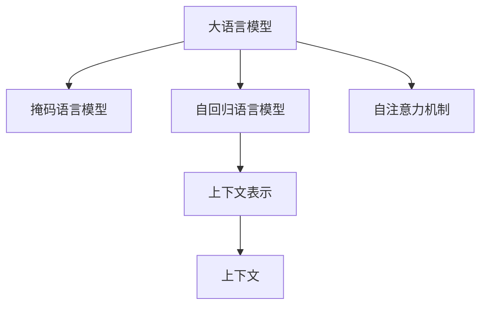

                 

# 大模型问答机器人的上下文处理

## 1. 背景介绍

在人工智能技术飞速发展的今天，问答机器人已经成为了人工智能应用的重要组成部分。问答机器人通过理解和回答用户问题，为用户提供即时、准确的信息和帮助，极大地提升了用户体验和效率。但是，传统的问答系统往往依赖于预定义的知识库和规则，难以处理复杂多变的自然语言输入，且难以满足用户的个性化需求。因此，基于大语言模型(Large Language Model, LLM)的问答机器人应运而生，极大地拓展了问答机器人的应用范围和性能。

大语言模型是一种通过在大规模无标签文本数据上进行预训练的语言模型。通过自监督学习任务，如掩码语言模型(Masked Language Model, MLM)和自回归语言模型(Autoregressive Language Model)，大语言模型学习到了丰富的语言知识和常识，具备强大的语言理解和生成能力。基于大语言模型的问答机器人，通过将用户的自然语言输入和已有的知识库进行匹配，生成符合用户期望的输出，极大地提升了问答系统的智能化水平和应用效果。

然而，尽管大语言模型在问答系统中表现出强大的潜力，但将其应用于实际场景时，仍然面临诸多挑战。特别是大语言模型在进行问答时，如何处理和利用上下文信息，是一个亟待解决的问题。本博客将深入探讨大模型问答机器人的上下文处理技术，并给出详细的实现方法和案例分析。

## 2. 核心概念与联系

### 2.1 核心概念概述

为更好地理解大模型问答机器人上下文处理的技术细节，本节将介绍几个关键概念及其相互关系：

- **大语言模型(Large Language Model, LLM)**：一种通过大规模无标签文本数据预训练得到的语言模型。具有强大的语言理解和生成能力。
- **掩码语言模型(Masked Language Model, MLM)**：一种预训练任务，通过在输入文本中随机掩码部分词，让模型学习预测被掩码词的正确值。
- **自回归语言模型(Autoregressive Language Model)**：一种预训练任务，通过从左向右或从右向左生成文本，使模型能够利用上下文信息生成下一个词。
- **上下文(Context)**：指包含问题的所有相关信息，包括问题本身、已有的知识库、用户的历史对话记录等。
- **上下文表示(Context Representation)**：将上下文信息转化为模型可以理解的向量表示，供模型进行推理和生成。
- **自注意力机制(Self-Attention Mechanism)**：一种在Transformer模型中使用的机制，使得模型可以灵活地关注输入序列中的不同位置，增强模型的表达能力。

这些核心概念之间的逻辑关系可以通过以下Mermaid流程图来展示：



这个流程图展示了大语言模型及其相关预训练任务、上下文表示和上下文处理机制之间的关系：

1. 大语言模型通过预训练任务学习语言表示。
2. 上下文表示将问题、知识库和用户历史对话等信息转化为模型可以理解的向量表示。
3. 自注意力机制使模型能够关注上下文中的不同位置，增强表达能力。

## 3. 核心算法原理 & 具体操作步骤

### 3.1 算法原理概述

基于大语言模型的问答机器人，通过将用户的自然语言输入与已有的知识库进行匹配，生成符合用户期望的输出。其核心思想是将上下文信息转化为上下文表示(Context Representation)，然后通过大语言模型进行推理和生成。上下文表示由问题、知识库、用户历史对话等多个信息源综合而成，包含丰富的语义信息，能够帮助模型更好地理解和生成。

具体来说，大模型问答机器人的上下文处理分为以下几个关键步骤：

1. **问题编码**：将用户输入的问题转化为向量表示，供模型进行推理。
2. **上下文表示生成**：将问题、知识库、用户历史对话等信息转化为上下文表示，增强模型的理解能力。
3. **自注意力机制**：通过自注意力机制，模型可以灵活地关注上下文中的不同位置，增强表达能力。
4. **推理与生成**：使用大语言模型对上下文表示进行推理和生成，生成符合用户期望的输出。

### 3.2 算法步骤详解

下面详细介绍大模型问答机器人上下文处理的各个步骤：

#### 3.2.1 问题编码

问题编码的目的是将用户输入的问题转化为向量表示，供模型进行推理。具体方法包括：

- **Word Embedding**：将问题中的每个词映射为一个低维向量，然后对所有向量进行拼接，得到问题的向量表示。
- **BERT编码**：使用BERT模型对问题进行编码，得到问题向量表示。BERT模型在处理自然语言任务时表现优异，能够捕捉到复杂的语义关系。
- **Self-Attention**：使用自注意力机制对问题进行编码，捕捉问题的关键信息，增强表达能力。

#### 3.2.2 上下文表示生成

上下文表示生成是将问题、知识库、用户历史对话等信息转化为向量表示的过程。具体方法包括：

- **拼接法**：将问题、知识库和用户历史对话等向量表示进行拼接，得到综合的上下文表示。
- **Attention机制**：使用注意力机制对问题、知识库和用户历史对话等信息进行加权处理，得到综合的上下文表示。
- **GPT编码**：使用GPT模型对问题、知识库和用户历史对话等信息进行编码，得到上下文表示。

#### 3.2.3 自注意力机制

自注意力机制是一种在Transformer模型中使用的机制，使得模型可以灵活地关注输入序列中的不同位置，增强表达能力。具体方法包括：

- **多头注意力(Multi-Head Attention)**：将输入序列分解为多个头，每个头使用不同的注意力机制，然后对所有头的结果进行拼接，得到最终的上下文表示。
- **残差连接(Residual Connection)**：将输入序列与注意力机制的结果相加，增强表达能力。
- **层归一化(Layer Normalization)**：对每个层的输入进行归一化，稳定训练过程。

#### 3.2.4 推理与生成

推理与生成是指使用大语言模型对上下文表示进行推理和生成，生成符合用户期望的输出。具体方法包括：

- **线性回归**：使用线性回归模型对上下文表示进行分类，得到答案向量表示。
- **softmax分类**：使用softmax分类器对上下文表示进行分类，得到答案向量表示。
- **Transformer模型**：使用Transformer模型对上下文表示进行推理和生成，得到答案向量表示。

### 3.3 算法优缺点

大模型问答机器人的上下文处理技术具有以下优点：

- **语义丰富**：上下文表示能够捕捉到问题的关键信息，包含丰富的语义信息，有助于模型更好地理解问题。
- **灵活性高**：自注意力机制使得模型可以灵活地关注上下文中的不同位置，增强表达能力。
- **泛化能力强**：大语言模型在处理各种自然语言任务时表现优异，具有较强的泛化能力。

同时，该技术也存在一些缺点：

- **计算量大**：上下文表示的生成和推理需要大量的计算资源，特别是在处理大规模知识库时。
- **依赖标注数据**：上下文表示的生成和推理需要大量的标注数据进行训练，获取高质量标注数据可能较为困难。
- **推理复杂**：大语言模型在进行推理和生成时，计算复杂度较高，需要高效的算法和硬件支持。

### 3.4 算法应用领域

基于大语言模型的问答机器人，已经被广泛应用于各种场景中，例如：

- **客服系统**：在客服系统中，使用问答机器人回答用户问题，提高用户满意度。
- **智能搜索**：在搜索引擎中，使用问答机器人回答用户问题，提供更精准的信息。
- **医疗咨询**：在医疗咨询系统中，使用问答机器人回答用户健康问题，提供医疗建议。
- **教育辅助**：在教育系统中，使用问答机器人回答学生问题，提供学习指导。
- **金融咨询**：在金融咨询系统中，使用问答机器人回答用户投资问题，提供投资建议。

除了上述这些应用场景外，基于大语言模型的问答机器人还将在更多领域得到应用，如法律咨询、旅游服务、教育培训等，为各行各业带来新的创新点。

## 4. 数学模型和公式 & 详细讲解 & 举例说明

### 4.1 数学模型构建

在本节中，我们将使用数学语言对大模型问答机器人上下文处理的各个步骤进行更加严格的刻画。

假设问题向量表示为 $x$，上下文向量表示为 $C$，大语言模型的参数为 $\theta$。则上下文表示生成和推理的过程可以表示为：

$$
y = M_{\theta}(x, C)
$$

其中，$M_{\theta}$ 为大语言模型，$x$ 为问题向量表示，$C$ 为上下文向量表示，$y$ 为生成的答案向量表示。

### 4.2 公式推导过程

以下我们以Transformer模型为例，推导上下文表示生成和推理的数学公式。

首先，我们将问题 $x$ 和上下文 $C$ 输入到Transformer模型中进行编码：

$$
h_1 = M_{\theta}(x) \\
h_2 = M_{\theta}(C)
$$

其中，$h_1$ 为问题向量表示，$h_2$ 为上下文向量表示。

接下来，我们将问题向量表示 $h_1$ 和上下文向量表示 $h_2$ 拼接，得到拼接向量 $h$：

$$
h = [h_1, h_2]
$$

然后，我们使用自注意力机制对拼接向量 $h$ 进行处理，得到上下文表示 $H$：

$$
H = \text{Self-Attention}(h)
$$

其中，$\text{Self-Attention}$ 为自注意力机制。

最后，我们使用大语言模型对上下文表示 $H$ 进行推理和生成，得到答案向量表示 $y$：

$$
y = M_{\theta}(H)
$$

以上公式展示了Transformer模型在进行上下文处理的基本流程。

### 4.3 案例分析与讲解

以下是一个使用Transformer模型进行上下文处理的案例：

**案例背景**：
假设有这样一个问题：“今天的天气怎么样？” 知识库中包含了一些天气预报信息，如“今天天气晴朗，最高气温30度”。

**问题编码**：
将问题“今天的天气怎么样？”转化为向量表示，可以使用Word Embedding或BERT编码。例如，使用BERT模型对问题进行编码，得到问题向量表示 $x$。

**上下文表示生成**：
将问题向量表示 $x$ 和上下文向量表示 $C$ 进行拼接，得到拼接向量 $h$：

$$
h = [x, C]
$$

然后，使用自注意力机制对拼接向量 $h$ 进行处理，得到上下文表示 $H$：

$$
H = \text{Self-Attention}(h)
$$

其中，$\text{Self-Attention}$ 为自注意力机制。

**推理与生成**：
使用Transformer模型对上下文表示 $H$ 进行推理和生成，得到答案向量表示 $y$：

$$
y = M_{\text{Transformer}}(H)
$$

其中，$M_{\text{Transformer}}$ 为Transformer模型。

最终，我们得到答案向量表示 $y$，将其转化为文本输出，即为：“今天的天气晴朗，最高气温30度。”

## 5. 项目实践：代码实例和详细解释说明

### 5.1 开发环境搭建

在进行大模型问答机器人开发前，我们需要准备好开发环境。以下是使用Python进行PyTorch开发的环境配置流程：

1. 安装Anaconda：从官网下载并安装Anaconda，用于创建独立的Python环境。

2. 创建并激活虚拟环境：
```bash
conda create -n pytorch-env python=3.8 
conda activate pytorch-env
```

3. 安装PyTorch：根据CUDA版本，从官网获取对应的安装命令。例如：
```bash
conda install pytorch torchvision torchaudio cudatoolkit=11.1 -c pytorch -c conda-forge
```

4. 安装Transformers库：
```bash
pip install transformers
```

5. 安装各类工具包：
```bash
pip install numpy pandas scikit-learn matplotlib tqdm jupyter notebook ipython
```

完成上述步骤后，即可在`pytorch-env`环境中开始开发实践。

### 5.2 源代码详细实现

下面以BERT模型为例，给出使用PyTorch和Transformers库实现大模型问答机器人的代码实现。

```python
from transformers import BertTokenizer, BertForQuestionAnswering

tokenizer = BertTokenizer.from_pretrained('bert-base-uncased')
model = BertForQuestionAnswering.from_pretrained('bert-base-uncased')

question = "今天的天气怎么样？"
context = "今天天气晴朗，最高气温30度。"

# 对问题和上下文进行编码
inputs = tokenizer(question, context, return_tensors='pt')

# 使用模型进行推理和生成
outputs = model(**inputs)

# 提取答案向量表示
start_logits = outputs.start_logits
end_logits = outputs.end_logits

# 获取答案起始和结束位置的概率
start_prob = torch.softmax(start_logits, dim=1)
end_prob = torch.softmax(end_logits, dim=1)

# 将概率转化为具体位置
start_index = torch.argmax(start_prob, dim=1)
end_index = torch.argmax(end_prob, dim=1)

# 提取答案文本
answer = context[start_index:end_index+1]
```

以上就是使用PyTorch和Transformers库实现BERT模型进行问答的完整代码实现。可以看到，通过调用BertTokenizer和BertForQuestionAnswering，我们可以快速搭建起大模型问答机器人的上下文处理和推理框架。

### 5.3 代码解读与分析

让我们再详细解读一下关键代码的实现细节：

**BERT编码**：
- 使用BertTokenizer对问题和上下文进行编码，得到向量表示。
- 将编码后的向量输入到BertForQuestionAnswering模型中进行推理和生成。

**推理与生成**：
- 提取模型的start_logits和end_logits，代表答案的起始和结束位置。
- 通过softmax函数将概率转化为具体位置，得到答案的起始和结束位置。
- 通过上下文向量提取答案文本。

**代码优化**：
- 为了提高推理速度，可以在代码中启用GPU加速。
- 可以通过设置batch size和调整超参数来优化模型的训练和推理效果。

## 6. 实际应用场景

### 6.1 智能客服系统

基于大模型问答机器人的上下文处理技术，可以广泛应用于智能客服系统的构建。传统客服往往需要配备大量人力，高峰期响应缓慢，且一致性和专业性难以保证。而使用大模型问答机器人，可以7x24小时不间断服务，快速响应客户咨询，用自然流畅的语言解答各类常见问题。

在技术实现上，可以收集企业内部的历史客服对话记录，将问题和最佳答复构建成监督数据，在此基础上对预训练模型进行微调。微调后的对话模型能够自动理解用户意图，匹配最合适的答案模板进行回复。对于客户提出的新问题，还可以接入检索系统实时搜索相关内容，动态组织生成回答。如此构建的智能客服系统，能大幅提升客户咨询体验和问题解决效率。

### 6.2 智能搜索系统

智能搜索系统需要快速响应用户的搜索请求，并提供精准的搜索结果。使用大模型问答机器人，可以在用户输入搜索关键词时，自动生成符合用户期望的答案，增强用户体验。

具体实现方法是，将用户输入的关键词作为问题，将搜索结果文本作为上下文，使用大模型问答机器人进行推理和生成，得到答案向量表示。然后将答案向量表示转化为文本输出，即为用户提供的搜索结果。

### 6.3 金融咨询服务

在金融咨询服务中，使用大模型问答机器人可以帮助用户解答各种投资和理财问题。金融领域的专业性较强，需要精准和可靠的答案。使用大模型问答机器人，可以整合金融领域的知识和专家信息，对用户问题进行解答，提高咨询质量。

具体实现方法是，将用户提出的问题作为问题，将金融领域的知识库作为上下文，使用大模型问答机器人进行推理和生成，得到答案向量表示。然后将答案向量表示转化为文本输出，即为用户提供的投资建议和理财建议。

### 6.4 未来应用展望

随着大模型问答机器人上下文处理技术的不断发展，其在更多领域将得到广泛应用。

- **医疗咨询**：在医疗咨询系统中，使用大模型问答机器人回答用户健康问题，提供医疗建议。
- **教育培训**：在教育系统中，使用大模型问答机器人回答学生问题，提供学习指导。
- **法律咨询**：在法律咨询系统中，使用大模型问答机器人回答用户法律问题，提供法律建议。
- **旅游服务**：在旅游服务系统中，使用大模型问答机器人回答用户旅游问题，提供旅游建议。

这些应用场景展示了大模型问答机器人上下文处理技术的广泛适用性，将极大提升各行业的智能化水平和用户满意度。

## 7. 工具和资源推荐

### 7.1 学习资源推荐

为了帮助开发者系统掌握大模型问答机器人上下文处理技术的理论基础和实践技巧，这里推荐一些优质的学习资源：

1. **《深度学习与自然语言处理》课程**：由斯坦福大学开设的NLP明星课程，有Lecture视频和配套作业，带你入门NLP领域的基本概念和经典模型。
2. **《Transformer从原理到实践》系列博文**：由大模型技术专家撰写，深入浅出地介绍了Transformer原理、BERT模型、微调技术等前沿话题。
3. **《自然语言处理综述》书籍**：全面介绍自然语言处理的基本概念、技术和应用，适合进一步深入学习。
4. **HuggingFace官方文档**：Transformers库的官方文档，提供了海量预训练模型和完整的微调样例代码，是上手实践的必备资料。
5. **arXiv预印本**：最新的自然语言处理研究论文，了解前沿研究动态。

通过对这些资源的学习实践，相信你一定能够快速掌握大模型问答机器人上下文处理技术的精髓，并用于解决实际的NLP问题。

### 7.2 开发工具推荐

高效的开发离不开优秀的工具支持。以下是几款用于大模型问答机器人开发的常用工具：

1. **PyTorch**：基于Python的开源深度学习框架，灵活动态的计算图，适合快速迭代研究。大部分预训练语言模型都有PyTorch版本的实现。
2. **TensorFlow**：由Google主导开发的开源深度学习框架，生产部署方便，适合大规模工程应用。同样有丰富的预训练语言模型资源。
3. **Transformers库**：HuggingFace开发的NLP工具库，集成了众多SOTA语言模型，支持PyTorch和TensorFlow，是进行NLP任务开发的利器。
4. **Weights & Biases**：模型训练的实验跟踪工具，可以记录和可视化模型训练过程中的各项指标，方便对比和调优。与主流深度学习框架无缝集成。
5. **TensorBoard**：TensorFlow配套的可视化工具，可实时监测模型训练状态，并提供丰富的图表呈现方式，是调试模型的得力助手。

合理利用这些工具，可以显著提升大模型问答机器人上下文处理任务的开发效率，加快创新迭代的步伐。

### 7.3 相关论文推荐

大模型问答机器人上下文处理技术的发展源于学界的持续研究。以下是几篇奠基性的相关论文，推荐阅读：

1. **Attention is All You Need**：提出了Transformer结构，开启了NLP领域的预训练大模型时代。
2. **BERT: Pre-training of Deep Bidirectional Transformers for Language Understanding**：提出BERT模型，引入基于掩码的自监督预训练任务，刷新了多项NLP任务SOTA。
3. **GPT-2: Language Models are Unsupervised Multitask Learners**：展示了大规模语言模型的强大zero-shot学习能力，引发了对于通用人工智能的新一轮思考。
4. **Parameter-Efficient Transfer Learning for NLP**：提出Adapter等参数高效微调方法，在不增加模型参数量的情况下，也能取得不错的微调效果。
5. **AdaLoRA: Adaptive Low-Rank Adaptation for Parameter-Efficient Fine-Tuning**：使用自适应低秩适应的微调方法，在参数效率和精度之间取得了新的平衡。
6. **Adaptive Contextual Mixture of Experts for Parameter-Efficient Language Modeling**：提出自适应上下文混合专家模型，实现参数高效的自然语言处理。

这些论文代表了大模型问答机器人上下文处理技术的发展脉络。通过学习这些前沿成果，可以帮助研究者把握学科前进方向，激发更多的创新灵感。

## 8. 总结：未来发展趋势与挑战

### 8.1 总结

本文对基于大语言模型的问答机器人上下文处理技术进行了全面系统的介绍。首先阐述了大语言模型在问答系统中的重要作用，以及上下文处理技术的必要性。其次，从原理到实践，详细讲解了上下文处理技术的各个步骤，给出了微调任务开发的完整代码实例。同时，本文还广泛探讨了上下文处理技术在智能客服、智能搜索、金融咨询等领域的广泛应用前景，展示了上下文处理技术的强大潜力。

通过本文的系统梳理，可以看到，大模型问答机器人上下文处理技术正在成为NLP领域的重要范式，极大地拓展了问答机器人的应用范围和性能。受益于大规模语料的预训练和上下文处理技术的不断进步，问答机器人的智能化水平和用户体验将得到显著提升。

### 8.2 未来发展趋势

展望未来，大模型问答机器人上下文处理技术将呈现以下几个发展趋势：

1. **多模态上下文处理**：未来的上下文处理技术将更多地融合图像、视频、语音等多模态数据，实现视觉、语音等多模态信息与文本信息的协同建模。
2. **自适应上下文表示**：未来的上下文表示将更加灵活，能够自适应不同的输入形式和语义关系。
3. **实时上下文处理**：未来的上下文处理将能够实时捕捉和处理上下文信息，增强机器人的反应速度和实时性。
4. **预训练上下文表示**：未来的上下文表示将更加注重预训练，使用预训练技术增强上下文表示的质量和泛化能力。
5. **参数高效上下文处理**：未来的上下文处理将更多地采用参数高效的方法，如 Adapter、Self-Attention 等，以减少计算资源消耗。
6. **因果上下文处理**：未来的上下文处理将更多地引入因果推断和对比学习思想，增强上下文表示的因果性和鲁棒性。

这些趋势展示了大模型问答机器人上下文处理技术的广阔前景。这些方向的探索发展，必将进一步提升问答机器人的性能和应用范围，为人工智能技术在自然语言处理领域的进步贡献力量。

### 8.3 面临的挑战

尽管大模型问答机器人上下文处理技术已经取得了一定的成果，但在迈向更加智能化、普适化应用的过程中，仍然面临诸多挑战：

1. **标注成本瓶颈**：虽然上下文处理技术在大模型问答机器人中表现优异，但在某些特定领域，获取高质量标注数据可能较为困难，成为制约上下文处理技术的瓶颈。
2. **推理效率有待提高**：大模型问答机器人上下文处理技术在处理大规模知识库时，计算复杂度较高，推理速度较慢，需要高效的算法和硬件支持。
3. **知识整合能力不足**：现有的上下文处理技术往往局限于输入数据，难以灵活吸收和运用更广泛的先验知识。
4. **安全性有待保障**：上下文处理技术在处理用户输入时，可能学习到有害信息和偏见，给实际应用带来安全隐患。
5. **可解释性亟需加强**：大模型问答机器人上下文处理技术在推理和生成过程中，缺乏可解释性，难以对其内部工作机制和决策逻辑进行解释。

正视上下文处理技术面临的这些挑战，积极应对并寻求突破，将是大模型问答机器人上下文处理技术迈向成熟的必由之路。相信随着学界和产业界的共同努力，这些挑战终将一一被克服，大模型问答机器人上下文处理技术必将在构建人机协同的智能时代中扮演越来越重要的角色。

### 8.4 研究展望

面对大模型问答机器人上下文处理技术所面临的挑战，未来的研究需要在以下几个方面寻求新的突破：

1. **无监督上下文处理**：摆脱对大规模标注数据的依赖，利用自监督学习、主动学习等无监督范式，最大限度利用非结构化数据，实现更加灵活高效的上下文处理。
2. **知识图谱融合**：将符号化的先验知识，如知识图谱、逻辑规则等，与神经网络模型进行巧妙融合，引导上下文处理过程学习更准确、合理的语言模型。
3. **多任务学习**：将上下文处理任务与语言建模、推理等任务结合，实现多任务协同学习，提升上下文表示的质量和泛化能力。
4. **对抗训练**：引入对抗样本，提高上下文表示的鲁棒性，避免模型对输入数据的异常鲁棒性。
5. **因果推断**：引入因果推断方法，增强上下文表示的因果关系，提高模型的鲁棒性和可解释性。
6. **零样本学习**：利用上下文处理技术，实现零样本学习，在无需标注数据的情况下，输出符合用户期望的答案。

这些研究方向的探索，必将引领大模型问答机器人上下文处理技术迈向更高的台阶，为构建安全、可靠、可解释、可控的智能系统铺平道路。面向未来，大模型问答机器人上下文处理技术还需要与其他人工智能技术进行更深入的融合，如知识表示、因果推理、强化学习等，多路径协同发力，共同推动自然语言理解和智能交互系统的进步。只有勇于创新、敢于突破，才能不断拓展问答机器人的边界，让智能技术更好地造福人类社会。

## 9. 附录：常见问题与解答

**Q1: 大语言模型上下文处理中，如何处理输入序列的长度限制？**

A: 大语言模型上下文处理中，输入序列的长度限制是一个重要问题。为解决这一问题，可以使用截断和填充等方法，将长序列转化为合适的长度。截断方法可以使用滑动窗口或固定长度的分段方式，将长序列分为多个片段，每个片段输入模型进行处理。填充方法可以使用零填充或特殊标记等方式，将短序列补齐到合适的长度。此外，可以使用Transformer中的长短时记忆机制，动态调整输入序列的长度，提高上下文处理的效果。

**Q2: 在上下文处理中，如何利用预训练语言模型进行微调？**

A: 在上下文处理中，可以利用预训练语言模型进行微调，进一步提升上下文表示的质量。具体方法是，使用预训练语言模型对上下文表示进行编码，然后通过微调学习任务的特定信息。微调可以使用不同的方法，如finetuning、adapter等，对预训练语言模型的部分层进行微调，保留大部分权重不变，以提高模型的参数效率和泛化能力。

**Q3: 在上下文处理中，如何提高上下文表示的质量？**

A: 提高上下文表示的质量是上下文处理技术的重要目标。具体方法包括：
1. 增加上下文的长度：将更多的上下文信息输入模型，增强上下文表示的质量。
2. 使用更好的预训练模型：使用更高质量的预训练模型，如BERT、GPT等，能够更好地捕捉语义关系。
3. 融合多种预训练技术：将多种预训练技术结合，如掩码语言模型、自回归语言模型等，提高上下文表示的质量。
4. 引入对抗训练：引入对抗样本，提高上下文表示的鲁棒性，避免模型对输入数据的异常鲁棒性。
5. 使用自注意力机制：使用自注意力机制，能够灵活地关注上下文中的不同位置，增强上下文表示的质量。

这些方法能够帮助提高上下文表示的质量，提升大模型问答机器人的性能。

**Q4: 在上下文处理中，如何提高上下文表示的可解释性？**

A: 提高上下文表示的可解释性是上下文处理技术的重要目标。具体方法包括：
1. 使用可解释性更好的模型：使用可解释性更好的模型，如线性模型、决策树等，能够更好地解释上下文表示的推理过程。
2. 引入因果推断：引入因果推断方法，增强上下文表示的因果关系，提高模型的可解释性。
3. 使用对抗训练：引入对抗样本，提高上下文表示的鲁棒性，避免模型对输入数据的异常鲁棒性。
4. 使用特征可视化技术：使用特征可视化技术，展示上下文表示中的关键特征，帮助理解模型的决策过程。
5. 使用因果推断和解释性模型：结合因果推断和解释性模型，提高上下文表示的可解释性。

这些方法能够帮助提高上下文表示的可解释性，提升大模型问答机器人的性能和用户满意度。

---

作者：禅与计算机程序设计艺术 / Zen and the Art of Computer Programming

