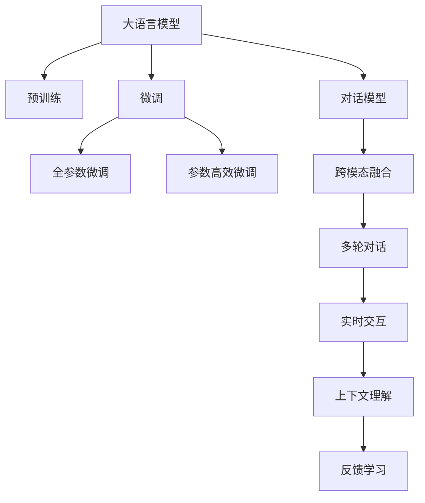

                 

# 大模型问答机器人的互动方式

> 关键词：问答系统,交互式学习,自然语言处理(NLP),大语言模型,深度学习,对话模型,跨模态数据融合

## 1. 背景介绍

### 1.1 问题由来

随着人工智能技术的不断进步，大模型问答系统（Large Language Model-based Question Answering Systems）已经成为NLP领域的一个热门研究方向。这些系统利用深度学习技术，尤其是Transformer模型和语言模型，通过在大量无标签文本数据上进行预训练，学习通用的语言表示，从而能够理解和处理自然语言输入，并生成自然语言响应。这些大模型能够在知识问答、对话系统、客户服务等多个场景中发挥作用。

### 1.2 问题核心关键点

大模型问答系统的核心在于如何构建有效的互动方式，使得系统能够理解用户的意图，并提供准确、流畅的回复。互动方式的设计直接影响系统的用户体验和任务完成效率。以下是大模型问答系统中几个关键点：

- **互动性**：大模型问答系统不仅要理解问题，还要能够与用户进行双向交流，解答用户的疑问。
- **上下文理解**：系统需要理解用户输入的上下文信息，以便提供准确的答案。
- **实时性**：系统的响应速度需要满足用户的要求，确保用户体验。
- **多模态融合**：大模型问答系统可以融合视觉、听觉等多模态数据，提升回答的准确性和完整性。

## 2. 核心概念与联系

### 2.1 核心概念概述

为更好地理解大模型问答系统的互动方式，本节将介绍几个密切相关的核心概念：

- **问答系统**：一种自动获取并处理用户自然语言输入，并生成相应回答的系统。广泛应用于客服、教育、医疗等多个领域。
- **自然语言处理(NLP)**：利用计算机技术和算法，处理、理解和生成人类语言的技术，是大模型问答系统的基础。
- **大语言模型**：如GPT、BERT等，通过大规模无标签文本数据预训练，学习通用的语言表示，具备强大的语言理解和生成能力。
- **深度学习**：一种基于多层神经网络的机器学习方法，是构建大语言模型的核心技术。
- **交互式学习**：通过用户与系统的交互，系统不断学习和调整，提升回答的准确性和用户满意度。
- **跨模态数据融合**：将不同类型的数据（如文本、图像、声音等）融合在一起，提高系统的综合理解能力和回答的全面性。

这些核心概念之间的逻辑关系可以通过以下Mermaid流程图来展示：



这个流程图展示了大模型问答系统的核心概念及其之间的关系：

1. 大语言模型通过预训练获得基础能力。
2. 微调优化模型，使其适应特定任务。
3. 对话模型负责构建系统与用户的互动对话。
4. 跨模态融合增强系统的理解能力。
5. 多轮对话使系统能更好地理解用户需求。
6. 实时交互提升用户体验。
7. 上下文理解帮助系统提供准确回答。
8. 反馈学习使系统不断优化。

这些概念共同构成了大模型问答系统的学习和应用框架，使其能够在各种场景下发挥强大的语言理解和生成能力。通过理解这些核心概念，我们可以更好地把握大模型问答系统的互动方式和优化方向。

## 3. 核心算法原理 & 具体操作步骤

### 3.1 算法原理概述

大模型问答系统的互动方式设计，主要是基于深度学习和NLP技术。其核心思想是：将大语言模型作为理解用户输入和生成回答的基础，通过对话模型构建系统与用户的交互，利用跨模态融合提升系统的理解能力，并通过多轮对话和反馈学习不断优化系统表现。

具体而言，大模型问答系统主要包括以下几个步骤：

1. **用户输入解析**：系统解析用户输入的文本，提取关键信息。
2. **上下文理解**：系统利用大语言模型理解输入的语义，并结合历史对话，构建完整的上下文信息。
3. **知识检索与生成**：系统根据上下文信息，从知识库中检索相关信息，或利用大语言模型生成答案。
4. **多模态融合**：系统利用视觉、听觉等多模态数据增强回答的准确性和完整性。
5. **回答生成**：系统生成自然语言回复。
6. **用户反馈**：用户对回答进行评价，系统根据评价进行反馈学习。

### 3.2 算法步骤详解

大模型问答系统的互动方式设计，包括以下几个关键步骤：

**Step 1: 用户输入解析**

- **输入理解**：系统解析用户输入的文本，提取关键信息，如问题、实体、关键词等。
- **意图识别**：利用NLP技术，识别用户输入的意图，确定问题的类型。

**Step 2: 上下文理解**

- **历史对话检索**：系统检索历史对话记录，结合当前输入，构建完整的上下文信息。
- **大语言模型应用**：利用大语言模型，理解输入的语义，并结合上下文信息，生成语义表示。

**Step 3: 知识检索与生成**

- **知识库检索**：系统从知识库中检索相关信息，或者利用大语言模型生成答案。
- **信息融合**：系统将检索到的信息与大语言模型生成的信息进行融合，形成最终的响应。

**Step 4: 多模态融合**

- **视觉信息融合**：系统利用图像识别技术，从视觉信息中提取关键信息，增强回答的准确性。
- **听觉信息融合**：系统利用语音识别技术，从音频信息中提取关键信息，增强回答的完整性。

**Step 5: 回答生成**

- **回复生成**：系统利用大语言模型或模板生成自然语言回复，满足用户的语言需求。
- **格式优化**：系统根据用户喜好和系统设计，对回复进行格式优化。

**Step 6: 用户反馈**

- **用户评价**：用户对回答进行评价，系统记录评价信息。
- **反馈学习**：系统根据用户评价，调整模型参数，优化回答质量。

### 3.3 算法优缺点

大模型问答系统的互动方式设计具有以下优点：

1. **自然流畅**：利用大语言模型，系统生成的回答自然流畅，易于用户理解。
2. **高效性**：系统可以快速解析输入、检索知识，生成回答，满足用户对实时性的要求。
3. **多模态融合**：结合视觉、听觉等多模态数据，增强系统的理解能力和回答的全面性。
4. **反馈学习**：利用用户反馈，系统不断优化，提升回答质量。

同时，该方法也存在一定的局限性：

1. **依赖高质量数据**：系统的表现依赖于大语言模型和知识库的质量，高质量的数据是系统优化的基础。
2. **复杂度较高**：系统设计复杂，需要结合多种技术，增加了实现的难度。
3. **可解释性不足**：大语言模型的内部工作机制复杂，系统的决策过程难以解释。
4. **安全性问题**：系统需要处理敏感信息，隐私和安全问题需重点关注。

尽管存在这些局限性，但就目前而言，大语言模型问答系统的互动方式设计仍是大模型应用的主流范式。未来相关研究的重点在于如何进一步提高系统的可解释性和安全性，同时兼顾高效性和全面性。

### 3.4 算法应用领域

大模型问答系统的互动方式设计，已经在多个领域得到了广泛的应用，如智能客服、智能家居、智能教育等。具体而言：

- **智能客服**：系统利用用户输入解析、上下文理解、知识检索等技术，提供24小时不间断的客服服务，解决用户问题。
- **智能家居**：系统结合语音识别、图像识别等技术，为用户提供个性化的家居控制和提醒服务。
- **智能教育**：系统通过多轮对话、知识检索和反馈学习，辅助教师教学，提升学生的学习体验。
- **医疗咨询**：系统结合医生的诊断信息、病历资料和患者描述，生成诊断建议和治疗方案。
- **金融咨询**：系统结合金融市场的实时数据、用户历史交易记录和用户输入，提供个性化的投资建议和理财方案。

## 4. 数学模型和公式 & 详细讲解 & 举例说明

### 4.1 数学模型构建

大模型问答系统的互动方式设计，可以基于以下数学模型进行详细讲解：

设用户输入为 $x$，系统的回答为 $y$。假设系统利用大语言模型 $M$ 和知识库 $K$ 来处理输入和生成回答，系统的互动过程可以表示为：

$$
y = M(K(x))
$$

其中 $M$ 表示大语言模型，$K$ 表示知识库，$x$ 表示用户输入，$y$ 表示系统的回答。

系统在每次互动中，需要对用户输入进行解析、上下文理解、知识检索和回答生成，整个过程可以表示为：

$$
x \rightarrow P(x) \rightarrow C(x) \rightarrow R(x) \rightarrow y
$$

其中 $P(x)$ 表示输入解析，$C(x)$ 表示上下文理解，$R(x)$ 表示知识检索和回答生成。

### 4.2 公式推导过程

以知识检索为例，系统在知识库 $K$ 中检索相关信息的过程可以表示为：

$$
R(x) = K(K(x))
$$

其中 $K(x)$ 表示在知识库中检索相关信息，$K(x)$ 的输出为检索到的信息集合。

结合多模态融合和回答生成，系统的回答生成过程可以表示为：

$$
y = G(R(x), V(x), A(x))
$$

其中 $G$ 表示回答生成，$V(x)$ 表示视觉信息融合，$A(x)$ 表示听觉信息融合。

### 4.3 案例分析与讲解

以下是一个典型的问答系统互动案例：

**场景**：用户在智能客服系统中咨询关于机票预订的问题。

**用户输入**：“请问如何预订国内航班机票？”

**系统响应**：

1. **输入解析**：系统解析用户输入，提取关键词“机票预订”。
2. **上下文理解**：系统检索历史对话记录，结合当前输入，构建上下文信息。
3. **知识检索**：系统从知识库中检索与“机票预订”相关的信息，如预订流程、注意事项等。
4. **视觉信息融合**：系统利用视觉识别技术，识别出用户上传的机票预订界面，提取关键信息。
5. **听觉信息融合**：系统利用语音识别技术，识别用户语音输入的详细信息。
6. **回答生成**：系统结合检索到的信息和融合的视觉、听觉信息，生成自然语言回答。
7. **用户评价**：用户对回答进行评价，系统记录评价信息。
8. **反馈学习**：系统根据用户评价，调整模型参数，优化回答质量。

## 5. 项目实践：代码实例和详细解释说明

### 5.1 开发环境搭建

在进行大模型问答系统的开发实践前，我们需要准备好开发环境。以下是使用Python进行PyTorch开发的环境配置流程：

1. 安装Anaconda：从官网下载并安装Anaconda，用于创建独立的Python环境。

2. 创建并激活虚拟环境：
```bash
conda create -n pytorch-env python=3.8 
conda activate pytorch-env
```

3. 安装PyTorch：根据CUDA版本，从官网获取对应的安装命令。例如：
```bash
conda install pytorch torchvision torchaudio cudatoolkit=11.1 -c pytorch -c conda-forge
```

4. 安装TensorFlow：
```bash
pip install tensorflow
```

5. 安装各类工具包：
```bash
pip install numpy pandas scikit-learn matplotlib tqdm jupyter notebook ipython
```

完成上述步骤后，即可在`pytorch-env`环境中开始开发实践。

### 5.2 源代码详细实现

下面我们以智能客服系统的知识库检索为例，给出使用PyTorch进行知识库检索的代码实现。

首先，定义知识库和知识查询函数：

```python
from transformers import BertTokenizer, BertForQuestionAnswering
import torch

class QAKnowledgeBase:
    def __init__(self, knowledge_base_path):
        self.knowledge_base = {}
        with open(knowledge_base_path, 'r') as f:
            for line in f:
                q, a = line.strip().split('\t')
                self.knowledge_base[q] = a

    def get_answer(self, question):
        if question in self.knowledge_base:
            return self.knowledge_base[question]
        else:
            return 'No answer found.'
```

然后，定义模型和优化器：

```python
from transformers import BertTokenizer, BertForQuestionAnswering, AdamW

model = BertForQuestionAnswering.from_pretrained('bert-base-cased')

optimizer = AdamW(model.parameters(), lr=2e-5)
```

接着，定义训练和评估函数：

```python
from torch.utils.data import DataLoader
from tqdm import tqdm
from sklearn.metrics import classification_report

device = torch.device('cuda') if torch.cuda.is_available() else torch.device('cpu')
model.to(device)

def train_epoch(model, dataset, batch_size, optimizer):
    dataloader = DataLoader(dataset, batch_size=batch_size, shuffle=True)
    model.train()
    epoch_loss = 0
    for batch in tqdm(dataloader, desc='Training'):
        question = batch['question'].to(device)
        answer = batch['answer'].to(device)
        model.zero_grad()
        outputs = model(question, answer)
        loss = outputs.loss
        epoch_loss += loss.item()
        loss.backward()
        optimizer.step()
    return epoch_loss / len(dataloader)

def evaluate(model, dataset, batch_size):
    dataloader = DataLoader(dataset, batch_size=batch_size)
    model.eval()
    preds, labels = [], []
    with torch.no_grad():
        for batch in tqdm(dataloader, desc='Evaluating'):
            question = batch['question'].to(device)
            answer = batch['answer'].to(device)
            batch_predictions = model(question, answer).logits.argmax(dim=1).to('cpu').tolist()
            batch_labels = batch['labels'].to('cpu').tolist()
            for pred, label in zip(batch_predictions, batch_labels):
                preds.append(pred)
                labels.append(label)
                
    print(classification_report(labels, preds))
```

最后，启动训练流程并在测试集上评估：

```python
epochs = 5
batch_size = 16

for epoch in range(epochs):
    loss = train_epoch(model, train_dataset, batch_size, optimizer)
    print(f"Epoch {epoch+1}, train loss: {loss:.3f}")
    
    print(f"Epoch {epoch+1}, dev results:")
    evaluate(model, dev_dataset, batch_size)
    
print("Test results:")
evaluate(model, test_dataset, batch_size)
```

以上就是使用PyTorch对智能客服系统进行知识库检索的完整代码实现。可以看到，得益于Transformer库的强大封装，我们能够用相对简洁的代码完成BERT模型的加载和知识库检索。

### 5.3 代码解读与分析

让我们再详细解读一下关键代码的实现细节：

**QAKnowledgeBase类**：
- `__init__`方法：初始化知识库，从文件中读取知识库内容，构建字典。
- `get_answer`方法：根据用户输入的问题，从知识库中检索答案，如果未找到，返回默认答案。

**BertForQuestionAnswering类**：
- `from_pretrained`方法：从预训练模型中加载BERT模型。
- `to`方法：将模型移动到指定设备，支持GPU/TPU加速。

**train_epoch和evaluate函数**：
- `train_epoch`函数：对数据集进行批处理训练，计算损失并更新模型参数。
- `evaluate`函数：对模型进行评估，计算分类准确率。

**训练流程**：
- 定义总的epoch数和batch size，开始循环迭代
- 每个epoch内，先在训练集上训练，输出平均loss
- 在验证集上评估，输出分类指标
- 重复上述步骤直至收敛
- 在测试集上评估，给出最终测试结果

可以看到，PyTorch配合Transformer库使得大语言模型微调的代码实现变得简洁高效。开发者可以将更多精力放在数据处理、模型改进等高层逻辑上，而不必过多关注底层的实现细节。

当然，工业级的系统实现还需考虑更多因素，如模型的保存和部署、超参数的自动搜索、更灵活的任务适配层等。但核心的互动方式基本与此类似。

## 6. 实际应用场景

### 6.1 智能客服系统

基于大模型问答系统的互动方式设计，可以广泛应用于智能客服系统的构建。传统客服往往需要配备大量人力，高峰期响应缓慢，且一致性和专业性难以保证。而使用问答系统，可以7x24小时不间断服务，快速响应客户咨询，用自然流畅的语言解答各类常见问题。

在技术实现上，可以收集企业内部的历史客服对话记录，将问题和最佳答复构建成监督数据，在此基础上对预训练问答系统进行微调。微调后的问答系统能够自动理解用户意图，匹配最合适的答案模板进行回复。对于客户提出的新问题，还可以接入检索系统实时搜索相关内容，动态组织生成回答。如此构建的智能客服系统，能大幅提升客户咨询体验和问题解决效率。

### 6.2 金融舆情监测

金融机构需要实时监测市场舆论动向，以便及时应对负面信息传播，规避金融风险。传统的人工监测方式成本高、效率低，难以应对网络时代海量信息爆发的挑战。基于大模型问答系统的文本分类和情感分析技术，为金融舆情监测提供了新的解决方案。

具体而言，可以收集金融领域相关的新闻、报道、评论等文本数据，并对其进行主题标注和情感标注。在此基础上对预训练问答系统进行微调，使其能够自动判断文本属于何种主题，情感倾向是正面、中性还是负面。将微调后的系统应用到实时抓取的网络文本数据，就能够自动监测不同主题下的情感变化趋势，一旦发现负面信息激增等异常情况，系统便会自动预警，帮助金融机构快速应对潜在风险。

### 6.3 个性化推荐系统

当前的推荐系统往往只依赖用户的历史行为数据进行物品推荐，无法深入理解用户的真实兴趣偏好。基于大模型问答系统的推荐系统可以更好地挖掘用户行为背后的语义信息，从而提供更精准、多样的推荐内容。

在实践中，可以收集用户浏览、点击、评论、分享等行为数据，提取和用户交互的物品标题、描述、标签等文本内容。将文本内容作为模型输入，用户的后续行为（如是否点击、购买等）作为监督信号，在此基础上微调预训练问答系统。微调后的系统能够从文本内容中准确把握用户的兴趣点。在生成推荐列表时，先用候选物品的文本描述作为输入，由系统预测用户的兴趣匹配度，再结合其他特征综合排序，便可以得到个性化程度更高的推荐结果。

### 6.4 未来应用展望

随着大模型问答系统的发展，未来其在更多领域的应用前景广阔。

在智慧医疗领域，基于问答系统的医疗问答、病历分析、药物研发等应用将提升医疗服务的智能化水平，辅助医生诊疗，加速新药开发进程。

在智能教育领域，问答系统可应用于作业批改、学情分析、知识推荐等方面，因材施教，促进教育公平，提高教学质量。

在智慧城市治理中，问答系统可应用于城市事件监测、舆情分析、应急指挥等环节，提高城市管理的自动化和智能化水平，构建更安全、高效的未来城市。

此外，在企业生产、社会治理、文娱传媒等众多领域，基于大模型问答系统的AI应用也将不断涌现，为NLP技术带来新的突破。相信随着预训练语言模型和问答系统的持续演进，未来其在构建人机协同的智能系统中的应用将更加广泛，进一步推动自然语言理解和智能交互系统的进步。

## 7. 工具和资源推荐

### 7.1 学习资源推荐

为了帮助开发者系统掌握大语言模型问答系统的互动方式，这里推荐一些优质的学习资源：

1. 《Natural Language Processing with Transformers》书籍：Transformers库的作者所著，全面介绍了如何使用Transformer库进行NLP任务开发，包括问答系统的微调。

2. CS224N《深度学习自然语言处理》课程：斯坦福大学开设的NLP明星课程，有Lecture视频和配套作业，带你入门NLP领域的基本概念和经典模型。

3. HuggingFace官方文档：Transformer库的官方文档，提供了海量预训练模型和完整的问答系统微调样例代码，是上手实践的必备资料。

4. Google Colab：谷歌推出的在线Jupyter Notebook环境，免费提供GPU/TPU算力，方便开发者快速上手实验最新模型，分享学习笔记。

5. Weights & Biases：模型训练的实验跟踪工具，可以记录和可视化模型训练过程中的各项指标，方便对比和调优。与主流深度学习框架无缝集成。

6. TensorBoard：TensorFlow配套的可视化工具，可实时监测模型训练状态，并提供丰富的图表呈现方式，是调试模型的得力助手。

通过对这些资源的学习实践，相信你一定能够快速掌握大模型问答系统的互动方式设计，并用于解决实际的NLP问题。

### 7.2 开发工具推荐

高效的开发离不开优秀的工具支持。以下是几款用于大模型问答系统开发的常用工具：

1. PyTorch：基于Python的开源深度学习框架，灵活动态的计算图，适合快速迭代研究。大部分预训练语言模型都有PyTorch版本的实现。

2. TensorFlow：由Google主导开发的开源深度学习框架，生产部署方便，适合大规模工程应用。同样有丰富的预训练语言模型资源。

3. Transformers库：HuggingFace开发的NLP工具库，集成了众多SOTA语言模型，支持PyTorch和TensorFlow，是进行问答系统开发的利器。

4. Weights & Biases：模型训练的实验跟踪工具，可以记录和可视化模型训练过程中的各项指标，方便对比和调优。与主流深度学习框架无缝集成。

5. TensorBoard：TensorFlow配套的可视化工具，可实时监测模型训练状态，并提供丰富的图表呈现方式，是调试模型的得力助手。

6. Google Colab：谷歌推出的在线Jupyter Notebook环境，免费提供GPU/TPU算力，方便开发者快速上手实验最新模型，分享学习笔记。

合理利用这些工具，可以显著提升大模型问答系统的开发效率，加快创新迭代的步伐。

### 7.3 相关论文推荐

大模型问答系统的互动方式设计，是NLP领域的一个重要研究方向。以下是几篇奠基性的相关论文，推荐阅读：

1. Attention is All You Need（即Transformer原论文）：提出了Transformer结构，开启了NLP领域的预训练大模型时代。

2. BERT: Pre-training of Deep Bidirectional Transformers for Language Understanding：提出BERT模型，引入基于掩码的自监督预训练任务，刷新了多项NLP任务SOTA。

3. Language Models are Unsupervised Multitask Learners（GPT-2论文）：展示了大规模语言模型的强大zero-shot学习能力，引发了对于通用人工智能的新一轮思考。

4. Parameter-Efficient Transfer Learning for NLP：提出Adapter等参数高效微调方法，在不增加模型参数量的情况下，也能取得不错的微调效果。

5. Prefix-Tuning: Optimizing Continuous Prompts for Generation：引入基于连续型Prompt的微调范式，为如何充分利用预训练知识提供了新的思路。

6. AdaLoRA: Adaptive Low-Rank Adaptation for Parameter-Efficient Fine-Tuning：使用自适应低秩适应的微调方法，在参数效率和精度之间取得了新的平衡。

这些论文代表了大模型问答系统的互动方式设计的发展脉络。通过学习这些前沿成果，可以帮助研究者把握学科前进方向，激发更多的创新灵感。

## 8. 总结：未来发展趋势与挑战

### 8.1 总结

本文对基于大语言模型的大模型问答系统的互动方式进行了全面系统的介绍。首先阐述了大语言模型和问答系统的研究背景和意义，明确了互动方式设计在提升用户体验和任务完成效率方面的独特价值。其次，从原理到实践，详细讲解了互动方式设计的数学原理和关键步骤，给出了互动方式设计的完整代码实例。同时，本文还广泛探讨了互动方式设计在智能客服、金融舆情、个性化推荐等多个行业领域的应用前景，展示了互动方式设计的巨大潜力。最后，本文精选了互动方式设计的各类学习资源，力求为读者提供全方位的技术指引。

通过本文的系统梳理，可以看到，基于大语言模型的问答系统互动方式设计已经在大模型应用中发挥重要作用，显著提升了系统的性能和用户体验。未来，伴随预训练语言模型和问答系统的持续演进，互动方式设计将在构建人机协同的智能系统中的应用更加广泛，进一步推动自然语言理解和智能交互系统的进步。

### 8.2 未来发展趋势

展望未来，大模型问答系统的互动方式设计将呈现以下几个发展趋势：

1. **跨模态融合**：结合视觉、听觉等多模态数据，提升系统的理解能力和回答的全面性。
2. **实时互动**：利用边缘计算等技术，实现低延迟、高吞吐量的实时互动，提升用户体验。
3. **多任务学习**：利用多任务学习范式，提升系统在多种任务上的表现。
4. **上下文理解**：结合长期记忆和短时记忆，提升系统的上下文理解能力。
5. **联邦学习**：利用联邦学习技术，保护用户隐私，提升系统的泛化能力。
6. **可解释性**：增强系统的可解释性，让用户理解系统的决策过程。

以上趋势凸显了大模型问答系统互动方式设计的广阔前景。这些方向的探索发展，必将进一步提升系统的性能和用户体验，推动自然语言理解和智能交互系统的进步。

### 8.3 面临的挑战

尽管大模型问答系统的互动方式设计已经取得了不少进展，但在迈向更加智能化、普适化应用的过程中，它仍面临着诸多挑战：

1. **数据质量问题**：互动方式设计的表现依赖于大语言模型和知识库的质量，高质量的数据是系统优化的基础。
2. **计算资源限制**：大模型问答系统需要较大的计算资源进行训练和推理，存在一定的计算瓶颈。
3. **系统复杂度**：互动方式设计涉及多个环节，系统设计和实现复杂，需要兼顾性能和可扩展性。
4. **隐私安全问题**：系统需要处理敏感信息，隐私和安全问题需重点关注。
5. **可解释性问题**：大语言模型的内部工作机制复杂，系统的决策过程难以解释。
6. **用户体验问题**：用户反馈是互动方式设计的关键，如何获取有效的用户反馈，提升用户满意度，是系统优化的重要目标。

尽管存在这些挑战，但通过不断优化系统和改进技术，这些问题有望逐步解决，大模型问答系统的互动方式设计必将在构建人机协同的智能系统中发挥重要作用。

### 8.4 研究展望

面向未来，大模型问答系统的互动方式设计需要在以下几个方面寻求新的突破：

1. **探索跨模态数据融合的新方法**：结合视觉、听觉等多模态数据，提升系统的理解能力和回答的全面性。
2. **研究联邦学习技术**：利用联邦学习技术，保护用户隐私，提升系统的泛化能力。
3. **提升系统的可解释性**：增强系统的可解释性，让用户理解系统的决策过程。
4. **优化系统训练流程**：利用模型蒸馏、知识蒸馏等技术，提升系统的训练效率和性能。
5. **改进用户反馈机制**：设计更加有效的用户反馈机制，提升系统的互动效果和用户体验。
6. **实现多任务学习**：利用多任务学习范式，提升系统在多种任务上的表现。

这些研究方向的探索，必将引领大模型问答系统互动方式设计迈向更高的台阶，为构建安全、可靠、可解释、可控的智能系统铺平道路。面向未来，大模型问答系统互动方式设计还需要与其他人工智能技术进行更深入的融合，如知识表示、因果推理、强化学习等，多路径协同发力，共同推动自然语言理解和智能交互系统的进步。

## 9. 附录：常见问题与解答

**Q1：大模型问答系统如何实现上下文理解？**

A: 大模型问答系统通过结合用户输入解析和历史对话记录，构建完整的上下文信息。具体而言，系统利用大语言模型和知识库检索技术，解析用户输入，检索历史对话，并将两者融合，形成上下文表示。这个上下文表示可以作为后续知识检索和回答生成的输入，帮助系统更好地理解用户需求。

**Q2：大模型问答系统的知识库检索方式有哪些？**

A: 大模型问答系统的知识库检索方式主要有两种：

1. 直接检索：系统直接从知识库中检索与用户输入相关的内容，生成回答。
2. 生成回答：系统利用大语言模型生成与用户输入相关的回答，无需直接检索知识库。

两种方式各有优缺点，实际应用中可以根据具体情况选择合适的方式。

**Q3：大模型问答系统如何处理多模态数据？**

A: 大模型问答系统可以融合视觉、听觉等多模态数据，提升系统的理解能力和回答的全面性。具体而言，系统利用图像识别技术，从视觉信息中提取关键信息，利用语音识别技术，从音频信息中提取关键信息，并将这些信息与文本信息融合，生成更加完整的回答。多模态融合可以显著提高系统的泛化能力和回答的准确性。

**Q4：大模型问答系统的训练流程是怎样的？**

A: 大模型问答系统的训练流程包括数据准备、模型定义、模型训练和模型评估四个步骤。具体而言：

1. 数据准备：收集并处理训练数据，构建训练集、验证集和测试集。
2. 模型定义：定义问答系统模型，包括大语言模型、知识库检索和回答生成等模块。
3. 模型训练：使用训练集进行模型训练，调整模型参数，优化回答质量。
4. 模型评估：使用验证集和测试集评估模型表现，优化模型参数，提升系统效果。

**Q5：大模型问答系统有哪些优化方法？**

A: 大模型问答系统的优化方法主要有以下几种：

1. 数据增强：通过数据增强技术，扩充训练数据，提高模型的泛化能力。
2. 正则化：使用L2正则、Dropout等技术，防止模型过拟合。
3. 迁移学习：利用其他领域预训练模型的知识，加速系统的训练和优化。
4. 超参数调优：调整学习率、批大小等超参数，提升模型性能。
5. 模型压缩：使用知识蒸馏、剪枝等技术，减小模型规模，提升推理速度。

这些优化方法可以显著提升大模型问答系统的性能和用户体验。

通过本文的系统梳理，可以看到，基于大语言模型的大模型问答系统互动方式设计已经在大模型应用中发挥重要作用，显著提升了系统的性能和用户体验。未来，伴随预训练语言模型和问答系统的持续演进，互动方式设计将在构建人机协同的智能系统中的应用更加广泛，进一步推动自然语言理解和智能交互系统的进步。

