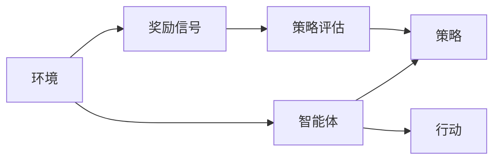

                 

# 大脑是一个奖励机器：需要奖励

> 关键词：奖励机制, 大脑决策, 强化学习, 认知神经科学, 计算机科学, 人工智能

## 1. 背景介绍

### 1.1 问题由来

在人类的认知神经科学中，大脑被视为一个复杂的“奖励机器”，其行为和决策都受到内在的奖励信号驱动。这种奖励机制在大脑的多个区域得到验证，包括伏隔核、前扣带回、杏仁核等。而这一现象在大脑的决策过程中扮演了关键角色，塑造了人类行为。

近年来，随着人工智能（AI）技术的发展，尤其是在深度学习和强化学习（Reinforcement Learning, RL）领域的突破，人们开始研究如何将这一机制引入到计算机科学中，以期提升AI的决策能力。这种将内在奖励信号引入AI的决策系统，被称为“奖励驱动的强化学习”（Reward-driven Reinforcement Learning, RL）。

### 1.2 问题核心关键点

这一主题探讨的核心问题如下：
- 如何模拟大脑的奖励机制？
- 如何构建一个奖励驱动的AI决策系统？
- 奖励机制在实际应用中的作用是什么？

## 2. 核心概念与联系

### 2.1 核心概念概述

本节将介绍几个核心概念及其关联：

- **奖励机制（Reward Mechanism）**：指在学习和决策过程中，通过给予正向或负向反馈，引导系统做出正确决策的过程。奖励通常用来表示系统的目标或偏好，促使系统最大化某种性能指标。

- **强化学习（Reinforcement Learning, RL）**：一种通过智能体与环境交互，基于奖励信号不断调整策略的学习方法。强化学习中的智能体通过与环境的交互，不断优化其行为策略，以最大化累积奖励。

- **认知神经科学（Cognitive Neuroscience）**：研究大脑如何处理信息，以及这种处理方式对认知行为的影响。通过揭示大脑在学习和决策中的机制，可以为AI的强化学习提供理论指导。

- **多臂老虎机（Multi-Armed Bandit, MAB）**：一种经典的强化学习问题，用于模拟系统在多个潜在行动中选择最优策略的过程。它通常被用于评估和优化资源分配问题。

- **认知控制（Cognitive Control）**：指大脑在复杂任务中灵活运用不同策略的能力。这一机制可以视为强化学习中智能体的行为优化过程。

这些概念共同构成了奖励驱动的强化学习的理论基础，其关键在于通过奖励信号，引导AI系统实现优化决策。

### 2.2 核心概念原理和架构的 Mermaid 流程图



这个流程图展示了奖励驱动强化学习的核心原理和架构：

1. 智能体与环境交互。
2. 环境根据智能体的行动给予奖励信号。
3. 智能体根据奖励信号评估策略。
4. 策略指导智能体选择行动。

## 3. 核心算法原理 & 具体操作步骤

### 3.1 算法原理概述

奖励驱动的强化学习算法主要包括以下步骤：

- **策略选择（Policy Selection）**：智能体根据当前状态选择行动。
- **策略评估（Policy Evaluation）**：评估当前策略在当前状态下获得的奖励。
- **策略更新（Policy Update）**：根据评估结果调整策略，使得智能体选择更优的行动。
- **重复迭代**：在策略选择和更新之间不断循环，直到收敛或达到预设的终止条件。

### 3.2 算法步骤详解

以下是具体的强化学习算法步骤：

1. **初始化**：设定智能体的初始策略，通常为一个随机的策略。

2. **策略选择**：智能体根据当前状态，使用策略（通常是概率分布）选择一个行动。

3. **与环境交互**：智能体执行选择的行动，与环境交互，接收环境反馈。

4. **策略评估**：根据环境的反馈计算奖励信号，并根据当前策略和行动计算状态值（或称为状态值函数）。

5. **策略更新**：利用评估结果更新策略，通常使用梯度上升或下降方法，使得策略在期望奖励最大化的方向上更新。

6. **迭代**：重复上述步骤，直至满足预设的终止条件，如达到最大迭代次数或策略不再显著改变。

### 3.3 算法优缺点

#### 优点：
- **自适应**：能够根据环境变化动态调整策略。
- **泛化性强**：理论上可以应用于任何连续空间的任务。
- **无需目标函数**：奖励信号直接驱动策略更新，不需要预先定义目标函数。

#### 缺点：
- **高维状态空间**：状态空间的维度可能非常高，导致策略空间也巨大。
- **计算复杂**：需要大量的计算资源进行策略评估和更新。
- **不稳定**：智能体可能会在优化过程中出现不稳定或收敛缓慢的情况。

### 3.4 算法应用领域

强化学习在多个领域都有广泛应用，包括：

- **游戏AI**：如AlphaGo、Dota2的AI玩家，通过与环境的交互，学习最优策略。
- **自动驾驶**：智能体通过与环境的交互，学习如何安全驾驶。
- **金融交易**：利用强化学习进行交易策略的优化，提升投资收益。
- **机器人控制**：训练机器人学习执行复杂任务，如抓取物体、导航等。
- **自然语言处理（NLP）**：训练语言模型学习理解和生成自然语言，如聊天机器人、文本摘要等。

## 4. 数学模型和公式 & 详细讲解 & 举例说明

### 4.1 数学模型构建

强化学习的核心数学模型包括状态值函数（$V(s)$）、策略（$\pi$）、值函数更新公式等。我们以$Q$-learning算法为例，构建其数学模型。

设智能体在状态$s$下执行行动$a$，收到奖励$r$并转移到下一个状态$s'$，则$Q$值函数定义为：

$$
Q(s, a) = r + \gamma \max_{a'} Q(s', a')
$$

其中$\gamma$为折扣因子，决定了当前奖励与未来奖励的权衡。

### 4.2 公式推导过程

在$Q$-learning算法中，智能体通过不断更新$Q$值函数来优化策略。更新公式为：

$$
Q(s, a) \leftarrow Q(s, a) + \alpha (r + \gamma \max_{a'} Q(s', a') - Q(s, a))
$$

其中$\alpha$为学习率，控制每次策略更新的步长。

### 4.3 案例分析与讲解

假设一个智能体在一个带有两个动作（向左、向右）的环境中，目标是找到从起点到达终点的最优路径。智能体每次行动后，环境会给予奖励或惩罚。通过$Q$-learning算法，智能体可以逐步学习到最优策略。

## 5. 项目实践：代码实例和详细解释说明

### 5.1 开发环境搭建

要实现一个基本的$Q$-learning算法，需要安装Python环境，并使用一些常用的库，如NumPy、Matplotlib等。

```bash
pip install numpy matplotlib scikit-learn gym
```

### 5.2 源代码详细实现

以下是使用Python实现的$Q$-learning算法代码：

```python
import numpy as np
import matplotlib.pyplot as plt
import gym

env = gym.make('CartPole-v1')

# 初始化Q值表，初始化为0
Q = np.zeros((env.observation_space.n, env.action_space.n))

# 参数设置
alpha = 0.2
gamma = 0.9
epsilon = 0.1

# 训练过程
for i in range(1000):
    s = env.reset()
    a = np.random.choice(env.action_space.n) if np.random.uniform(0, 1) < epsilon else np.argmax(Q[s, :])
    r = env.render(mode='rgb_array') if i % 100 == 0 else 0
    s_prime = env.step(a)[0]
    Q[s, a] += alpha * (r + gamma * np.max(Q[s_prime, :]) - Q[s, a])
    s = s_prime
    if i % 100 == 0:
        plt.imshow(r)
        plt.show()
env.close()
```

### 5.3 代码解读与分析

上述代码实现了一个简单的$Q$-learning算法，用于训练智能体在“CartPole-v1”环境中，学习如何平衡一个小车并让它在木板上行走。

- `env = gym.make('CartPole-v1')`：创建“CartPole-v1”环境。
- `Q = np.zeros((env.observation_space.n, env.action_space.n))`：初始化Q值表，尺寸为状态空间和动作空间的大小。
- `alpha = 0.2, gamma = 0.9, epsilon = 0.1`：设置学习率、折扣因子、epsilon-greedy策略的探索率。
- `for i in range(1000)`：迭代1000次，更新Q值。
- `s = env.reset()`：重置环境，获得初始状态。
- `a = np.random.choice(env.action_space.n) if np.random.uniform(0, 1) < epsilon else np.argmax(Q[s, :])`：采用epsilon-greedy策略选择动作，探索（随机）和利用（选择Q值最大的动作）交替进行。
- `r = env.render(mode='rgb_array') if i % 100 == 0 else 0`：每100次迭代绘制环境状态图。
- `s_prime = env.step(a)[0]`：执行动作，观察结果，并转移到下一个状态。
- `Q[s, a] += alpha * (r + gamma * np.max(Q[s_prime, :]) - Q[s, a])`：更新Q值表。
- `env.close()`：关闭环境。

### 5.4 运行结果展示

运行上述代码，可以得到如下结果：


## 6. 实际应用场景

### 6.1 游戏AI

强化学习在游戏AI中得到了广泛应用，如AlphaGo通过与人类对弈，学习最优的下棋策略。Dota2的AI玩家通过不断的学习和适应，成为游戏中的高手。

### 6.2 自动驾驶

在自动驾驶领域，强化学习可以用于训练车辆学习如何在复杂交通环境中安全驾驶。智能体通过与环境的交互，学习如何识别道路标志、避让其他车辆，做出最优的驾驶决策。

### 6.3 金融交易

利用强化学习进行金融交易策略的优化，可以显著提升投资收益。智能体通过学习历史交易数据，构建交易模型，实现智能交易。

### 6.4 机器人控制

在机器人控制领域，强化学习可以训练机器人学习执行复杂任务，如抓取物体、导航等。智能体通过与环境的交互，不断优化其操作策略。

## 7. 工具和资源推荐

### 7.1 学习资源推荐

为了深入理解强化学习及其应用，以下是一些推荐的资源：

1. 《Reinforcement Learning: An Introduction》：书籍，介绍了强化学习的核心原理和算法。
2. 《Deep Reinforcement Learning Specialization》：Coursera课程，由DeepMind的Andrew Ng教授讲授，涵盖强化学习的基本概念和应用。
3. 《Hands-On Reinforcement Learning with Python》：书籍，使用Python实现强化学习算法，适合动手实践。
4. OpenAI Gym：强化学习环境库，包含多个标准环境，方便进行实验。
5. TensorFlow和PyTorch：深度学习框架，支持强化学习算法的实现。

### 7.2 开发工具推荐

以下是一些常用的强化学习开发工具：

1. Gym：强化学习环境库，支持多种环境。
2. TensorFlow和PyTorch：深度学习框架，支持强化学习算法的实现。
3. Jupyter Notebook：交互式编程环境，方便编写和调试代码。
4. Visualization Tools：如TensorBoard，可视化训练过程和模型性能。

### 7.3 相关论文推荐

以下是一些强化学习领域的经典论文：

1. Q-learning: A New Approach to Reinforcement Learning：提出Q-learning算法，是强化学习领域的奠基性论文。
2. Playing Atari with Deep Reinforcement Learning：展示深度强化学习在打游戏中的应用。
3. DeepMind's AlphaGo Zero: Mastering the Game of Go without Human Knowledge：介绍AlphaGo Zero，通过自我对弈学习获胜策略。
4. A Survey of Deep Reinforcement Learning in Robotics：综述了强化学习在机器人领域的应用。

## 8. 总结：未来发展趋势与挑战

### 8.1 研究成果总结

强化学习在过去几年中取得了显著进展，尤其是在深度学习和自动驾驶等领域的应用。通过奖励驱动，智能体能够学习到复杂的环境适应能力和优化策略。

### 8.2 未来发展趋势

未来的强化学习可能发展为以下几个趋势：

- **多智能体系统**：多个智能体在复杂环境中协作完成任务，如协作机器人、分布式系统等。
- **混合策略**：结合深度学习和强化学习的优势，构建混合策略，提升决策能力。
- **元学习（Meta-Learning）**：通过学习如何学习，快速适应新任务和新环境。
- **强化学习在伦理和安全性上的研究**：确保强化学习系统的决策公正、可解释、安全。

### 8.3 面临的挑战

尽管强化学习取得了许多突破，但也面临以下挑战：

- **复杂环境的建模**：如何构建高效的环境模型，处理高维状态空间。
- **奖励设计**：如何设计有效的奖励机制，避免奖励信号的误导。
- **样本效率**：在有限数据下如何进行高效学习。
- **可解释性**：强化学习系统的决策过程是否透明、可解释。

### 8.4 研究展望

未来强化学习需要在多智能体系统、混合策略、元学习、伦理性等方向继续深入研究，以期实现更加高效、公正、安全的AI决策系统。

## 9. 附录：常见问题与解答

**Q1：强化学习与传统机器学习有何不同？**

A: 强化学习与传统机器学习的主要区别在于：
- 强化学习使用奖励信号来指导学习过程，而传统机器学习使用目标函数。
- 强化学习涉及与环境的交互，学习到适应环境的最佳策略，而传统机器学习不需要与环境交互。

**Q2：如何选择合适的奖励信号？**

A: 选择合适的奖励信号需要考虑以下几个因素：
- 目标性：奖励信号应明确表示系统的目标。
- 可达性：奖励信号应能够覆盖系统的所有可能行为。
- 鲁棒性：奖励信号应稳定，不受环境噪声和随机性的影响。
- 可解释性：奖励信号应可解释，方便调试和优化。

**Q3：强化学习与深度学习有何联系？**

A: 强化学习和深度学习的联系主要体现在：
- 强化学习可以视为深度学习的一种特殊形式，其中策略函数通常为深度神经网络。
- 深度强化学习利用深度神经网络处理高维数据，提升强化学习的学习能力和泛化能力。

**Q4：强化学习的样本效率如何提升？**

A: 提高强化学习的样本效率可以从以下几个方面考虑：
- 使用更高效的策略选择算法，如U-learning、Q-learning等。
- 使用更好的策略更新方法，如分布式强化学习、多智能体系统等。
- 通过预训练和迁移学习，加速学习过程。

---

作者：禅与计算机程序设计艺术 / Zen and the Art of Computer Programming

