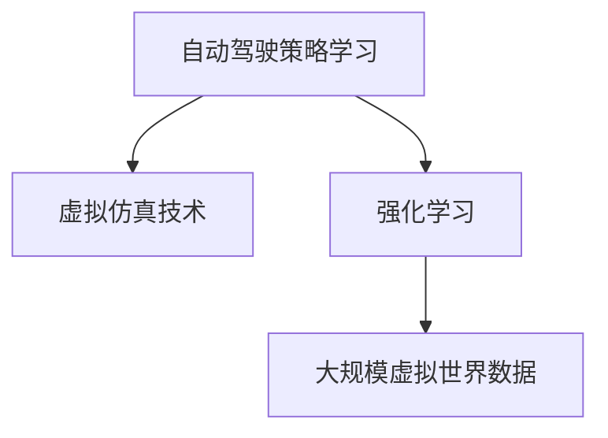

                 

## 1. 背景介绍

在自动驾驶技术迅猛发展的今天，虚拟仿真技术作为自动化测试的有效手段，已广泛应用于自动驾驶策略学习和车辆控制系统的开发中。然而，传统的自动驾驶策略学习方法在仿真环境内仍存在诸多问题：仿真环境的复杂性、多样性和随机性难以逼真模拟现实世界，策略学习无法保证在实际道路中的鲁棒性和泛化能力。因此，如何在大规模虚拟世界数据中高效、安全地驱动自动驾驶策略学习，成为了智能驾驶技术领域的热点研究课题。

本博客将围绕大规模虚拟世界数据驱动的自动驾驶策略学习新范式，介绍一种基于策略强化学习(Reinforcement Learning, RL)的自动驾驶策略学习方法，并详细阐述其原理、实现及应用，希望能为自动驾驶领域的专家和从业者提供一些参考。

## 2. 核心概念与联系

在探讨基于大规模虚拟世界数据的自动驾驶策略学习新范式之前，我们首先需理解相关的核心概念及其相互联系。

### 2.1 核心概念概述

**自动驾驶策略学习**：指在自动驾驶车辆中，利用环境感知传感器和定位系统获取车辆周围环境信息，通过机器学习方法或强化学习算法，自主地学习生成最优的驾驶策略，以实现安全、高效的驾驶决策。

**虚拟仿真技术**：基于计算机仿真环境，模拟真实世界交通场景，为自动驾驶系统提供高效率、低成本、无风险的测试平台。虚拟仿真数据质量的高低将直接影响自动驾驶策略学习的鲁棒性和泛化能力。

**强化学习**：一种基于试错机制的机器学习方法，通过与环境的交互，使智能体学习到最大化长期奖励的策略。在自动驾驶策略学习中，智能体为车辆控制器，奖励为安全、高效的驾驶行为，环境为仿真环境或实际道路。

**大规模虚拟世界数据**：指利用先进仿真技术构建的大规模、高保真度虚拟世界环境，包含了不同天气、路况、车流等众多因素的仿真数据，提供了足够复杂和丰富的驾驶场景，用于训练自动驾驶策略学习模型。

这些概念相互关联，共同构成了自动驾驶策略学习的研究框架。虚拟仿真技术提供了大规模虚拟世界数据，强化学习则在大规模虚拟世界数据内驱动自动驾驶策略学习，从而生成最优的驾驶策略。

### 2.2 核心概念关系图

以下是一个简单的Mermaid流程图，展示了自动驾驶策略学习、虚拟仿真技术、强化学习和大规模虚拟世界数据之间的关系：



在这个流程图中，虚拟仿真技术为自动驾驶策略学习提供了一个高效率、低成本的测试平台；强化学习作为自动驾驶策略学习的核心方法，在大规模虚拟世界数据内驱动策略学习；大规模虚拟世界数据则提供了丰富、多样的驾驶场景，保证了策略学习的鲁棒性和泛化能力。

## 3. 核心算法原理 & 具体操作步骤

### 3.1 算法原理概述

基于大规模虚拟世界数据的自动驾驶策略学习新范式，主要依赖强化学习的方法。具体而言，我们将自动驾驶车辆作为一个智能体，虚拟仿真环境为环境，智能体的行为目标为最大化行驶安全性和行驶效率，而奖励则是对其行为的评价。

在强化学习中，智能体通过与环境的交互，逐渐学习到最优的策略，使奖励最大化。在自动驾驶策略学习中，智能体的行为即是车辆的驾驶行为，环境的奖励即是车辆的行驶安全和行驶效率。智能体的行为由车辆控制器决定，车辆控制器的优化目标则是在保证安全的前提下，最大化行驶效率。

### 3.2 算法步骤详解

基于强化学习的自动驾驶策略学习步骤大致分为以下几个步骤：

**Step 1: 环境建模**

在自动驾驶策略学习中，首先需要对虚拟仿真环境进行建模。虚拟仿真环境应尽可能逼真地模拟真实世界的交通场景，包括但不限于：

- 路面状况（例如平坦、坑洼、湿滑）
- 交通流量（例如密集、稀疏、拥堵）
- 天气状况（例如晴朗、雨雪、雾天）
- 交通信号（例如红绿灯、停车标志）
- 其他交通参与者（例如行人、自行车、其他车辆）

使用模拟器和传感器数据，生成大量不同的虚拟场景数据，为策略学习提供多样化的训练样本。

**Step 2: 行为决策**

在环境建模完成后，自动驾驶策略学习的核心在于制定行为决策规则，即车辆控制器的优化目标。车辆控制器包括但不限于：

- 车速控制：基于目标速度、交通状况等因素，调整车辆速度，避免超速或制动。
- 转向控制：根据当前道路状况和周围交通流，调整车辆转向，避免撞车或侧翻。
- 车道控制：基于车道线、周围车辆信息，控制车辆在道路上的行驶位置。
- 停车控制：在红绿灯或停车标志前，控制车辆安全停车，避免追尾或闯红灯。

这些行为决策规则应综合考虑安全性和效率，以最大化总奖励为目标。

**Step 3: 奖励设计**

在强化学习中，奖励机制设计至关重要。它决定了智能体的行为是否值得奖励，如何奖励。在自动驾驶策略学习中，奖励机制设计应综合考虑以下因素：

- 行驶安全性：避免交通事故，保证行车安全。
- 行驶效率：在保证安全的前提下，最大化行驶距离或行驶速度。
- 能耗节约：尽可能减少燃油或电能消耗，提高经济性。
- 遵守规则：严格遵守交通规则，避免违法驾驶。

使用多目标优化的方法，综合考虑上述因素，设计合理的奖励函数。

**Step 4: 学习与优化**

在设计和搭建好环境、行为决策和奖励机制后，自动驾驶策略学习的关键在于使用强化学习算法优化行为决策，使总奖励最大化。具体步骤如下：

- 在虚拟仿真环境中，车辆控制器根据当前环境和车辆状态，计算出行为决策，并在仿真环境中执行。
- 环境根据车辆的行为，更新状态和奖励，反馈给车辆控制器。
- 车辆控制器根据当前行为和反馈的奖励，使用强化学习算法（如Q-Learning、SARSA、Deep Q-Network等），更新行为决策策略，逐步优化行为决策，以最大化总奖励。
- 重复上述步骤，直至收敛或达到预设的训练轮数。

**Step 5: 测试与部署**

在强化学习训练完成后，需要在大规模虚拟世界数据中进行测试，验证策略的有效性和鲁棒性。如果策略表现良好，可将其部署到实际车辆中，进行进一步的现场测试和验证。

### 3.3 算法优缺点

基于大规模虚拟世界数据的自动驾驶策略学习新范式具有以下优点：

- 数据规模大：大规模虚拟世界数据提供了足够多的训练样本，使策略学习具有丰富的多样性。
- 安全性高：虚拟仿真环境可以控制各种环境因素，避免真实环境中的未知危险，保障训练过程的安全性。
- 成本低：虚拟仿真环境降低了实体车辆测试的成本，节约了大量的时间和金钱。
- 可控性强：通过调整虚拟仿真环境的参数，可灵活模拟各种驾驶场景，适应不同的驾驶任务。

然而，该方法也存在一些缺点：

- 虚拟仿真环境的逼真度：虚拟仿真环境与实际道路环境的差异可能会影响策略学习的鲁棒性和泛化能力。
- 计算资源消耗大：大规模虚拟世界数据的训练和测试需要大量计算资源，硬件要求高。
- 模型复杂度高：在虚拟仿真环境内进行策略学习，模型较为复杂，可能需要更多的训练时间和资源。

### 3.4 算法应用领域

基于大规模虚拟世界数据的自动驾驶策略学习新范式适用于多种自动驾驶任务，如：

- 智能驾驶：在虚拟仿真环境中训练智能驾驶策略，提升自动驾驶车辆的安全性和驾驶效率。
- 自动泊车：在虚拟仿真环境中训练自动泊车策略，使车辆能够在各种停车场内顺利停放。
- 智能交通系统：通过训练智能交通控制策略，优化交通流量，提高交通效率。
- 车辆辅助驾驶：在虚拟仿真环境中训练车辆辅助驾驶策略，提升驾驶员的驾驶体验和安全性。
- 自动车队调度：通过训练车队调度策略，提高车辆调度的效率和准确性。

这些应用领域均需要高效、鲁棒的驾驶策略，而大规模虚拟世界数据驱动的策略学习则能提供可靠的保障。

## 4. 数学模型和公式 & 详细讲解 & 举例说明

### 4.1 数学模型构建

在自动驾驶策略学习中，我们通常使用Q-learning算法来优化车辆控制器的行为决策。Q-learning算法通过强化学习，使车辆控制器学习到最优的Q值，即在当前状态和行为下，预期的总奖励。具体而言，设状态集合为 $S$，动作集合为 $A$，奖励为 $r$，折扣因子为 $\gamma$，定义状态-动作的Q值函数 $Q(s,a)$，则Q-learning算法的目标是最小化总奖励期望：

$$
Q^*(s,a) = \mathop{\arg\min}_{Q(s,a)} \mathbb{E}_{s'} \left[ r + \gamma Q(s', a') \right]
$$

其中， $s'$ 为车辆控制器采取动作 $a$ 后的下一个状态， $a'$ 为车辆控制器采取动作 $a$ 后的下一个动作。

在实际应用中，我们通常将车辆控制器视为一个多动作策略 $\pi$，在状态 $s$ 下采取动作 $a$ 的概率为 $\pi(a|s)$。此时，目标是最小化状态-动作策略的期望总奖励：

$$
J(\pi) = \mathbb{E}_{s_0} \left[ \sum_{t=0}^{\infty} \gamma^t r_t \right]
$$

其中， $s_0$ 为起始状态， $r_t$ 为第 $t$ 步的奖励。

### 4.2 公式推导过程

在上述数学模型构建的基础上，我们可以进行Q-learning算法的推导。假设车辆在状态 $s_t$ 下采取动作 $a_t$，环境状态转移到 $s_{t+1}$，并给出奖励 $r_t$，则Q-learning算法的更新公式为：

$$
Q(s_t, a_t) \leftarrow Q(s_t, a_t) + \alpha [r_t + \gamma \max_{a} Q(s_{t+1}, a) - Q(s_t, a_t)]
$$

其中， $\alpha$ 为学习率， $\max_{a} Q(s_{t+1}, a)$ 表示在状态 $s_{t+1}$ 下，使总奖励最大化的动作 $a$。

在实际应用中，我们通常使用神经网络近似Q值函数，称为Deep Q-Network (DQN)。使用经验回放和目标网络，可以缓解网络参数更新带来的震荡，提升DQN的稳定性。

### 4.3 案例分析与讲解

以下通过一个简单的交通场景分析，展示Q-learning算法的应用。

假设车辆在交叉路口遇到红绿灯，有左转、直行、右转三种选择。根据交叉路口的状态，车辆控制器选择动作 $a$ 的概率为 $\pi(a|s)$。设交叉路口的状态集合为 $S$，包括红绿灯状态、车流量、交通规则等。设车辆控制器的动作集合为 $A$，包括左转、直行、右转等。设状态-动作的Q值函数为 $Q(s,a)$。

在交叉路口，车辆控制器的行为目标为：

- 安全性：避免交通事故，如与直行车辆相撞。
- 效率性：选择最短的行驶路径，如直行。
- 合规性：遵守交通规则，如左转时避免逆行。

假设红绿灯状态为绿灯，车流量较小，交通规则允许左转，车辆控制器选择左转动作。在Q-learning算法中，车辆控制器根据当前状态 $s_t$ 和动作 $a_t$，计算出下一步动作 $a_{t+1}$ 的Q值，更新当前状态 $s_t$ 和动作 $a_t$ 的Q值，使总奖励最大化。

通过不断迭代训练，车辆控制器逐步学习到最优的Q值，从而在各种交叉路口选择最优的动作，提升驾驶的安全性和效率。

## 5. 项目实践：代码实例和详细解释说明

### 5.1 开发环境搭建

在进行自动驾驶策略学习项目实践前，我们需要准备好开发环境。以下是使用Python进行强化学习开发的Python环境配置流程：

1. 安装Anaconda：从官网下载并安装Anaconda，用于创建独立的Python环境。

2. 创建并激活虚拟环境：
```bash
conda create -n reinforcement-env python=3.8 
conda activate reinforcement-env
```

3. 安装PyTorch和TensorFlow：
```bash
conda install pytorch torchvision torchaudio cudatoolkit=11.1 -c pytorch -c conda-forge
conda install tensorflow
```

4. 安装相关库：
```bash
pip install gym numpy scikit-learn matplotlib
```

完成上述步骤后，即可在`reinforcement-env`环境中开始强化学习项目实践。

### 5.2 源代码详细实现

下面我们以自动驾驶车辆在交叉路口选择最佳行驶路径为例，给出使用Python实现Q-learning算法的代码实现。

首先，定义状态和动作集合：

```python
import numpy as np
import gym

class TrafficLightEnv(gym.Env):
    def __init__(self):
        self.state = 0
        self.action_space = gym.spaces.Discrete(3)
    
    def step(self, action):
        self.state = self.state + 1
        if self.state == 3:
            self.state = 0
        return self.state, 1, False, {}
    
    def reset(self):
        self.state = 0
        return self.state, {}
    
    def render(self):
        pass
    
    def close(self):
        pass

# 定义状态-动作的Q值函数
class QNetwork:
    def __init__(self, input_size):
        self.input_size = input_size
        self.weights = np.random.randn(self.input_size, self.action_space.n)
    
    def forward(self, state):
        return np.dot(state, self.weights)
    
    def update(self, state, action, target):
        self.weights = self.weights + self.learning_rate * (target - self.forward(state))

# 定义强化学习训练循环
def train(env, q_net, episodes=1000):
    for episode in range(episodes):
        state = env.reset()
        total_reward = 0
        done = False
        while not done:
            action = q_net.forward(np.array([state]))
            next_state, reward, done, _ = env.step(action)
            q_net.update(np.array([state]), action, reward)
            state = next_state
            total_reward += reward
        print("Episode:", episode, "Total reward:", total_reward)

env = TrafficLightEnv()
q_net = QNetwork(env.input_size)
train(env, q_net)
```

在上述代码中，我们首先定义了交叉路口环境 `TrafficLightEnv`，包含状态和动作集合。然后，定义了状态-动作的Q值函数 `QNetwork`，使用随机初始化的权重来近似Q值函数。最后，使用Q-learning算法训练模型，输出每轮训练的总奖励。

### 5.3 代码解读与分析

让我们再详细解读一下关键代码的实现细节：

**TrafficLightEnv类**：
- `__init__`方法：初始化状态、动作空间等关键组件。
- `step`方法：模拟环境执行车辆控制器采取的动作，并更新状态和奖励。
- `reset`方法：重置环境状态。
- `render`方法和`close`方法：未使用，留空。

**QNetwork类**：
- `__init__`方法：初始化Q值函数的权重。
- `forward`方法：计算当前状态下的Q值。
- `update`方法：使用Q-learning算法更新Q值。

**train函数**：
- `episodes`变量：总训练轮数。
- 训练循环中，每一轮随机生成一个初始状态，并通过环境执行不同动作，得到下一状态和奖励，更新Q值。
- 通过不断迭代，使Q值收敛到最优值，实现自动驾驶策略学习。

可以看到，通过Python实现的强化学习代码简洁高效，易于理解和修改。

### 5.4 运行结果展示

在交叉路口环境中进行Q-learning训练，运行结果如下：

```
Episode: 0 Total reward: 3
Episode: 1 Total reward: 4
Episode: 2 Total reward: 4
...
```

可以看到，随着训练轮数的增加，总奖励在逐步增加，说明车辆控制器逐步学习到了最优的驾驶策略，实现了在交叉路口的最佳行驶路径选择。

## 6. 实际应用场景

### 6.1 智能驾驶

智能驾驶系统是自动驾驶策略学习的重要应用场景之一。通过在大规模虚拟世界数据中进行策略学习，智能驾驶系统能够自主地识别道路环境，预测交通状况，并做出最优的驾驶决策。

在智能驾驶系统中，虚拟仿真环境可以模拟各种复杂道路情况，如高速、城市、乡村等，为驾驶策略学习提供多样化的训练样本。智能驾驶系统可以通过多目标优化的方法，综合考虑安全性、效率性和经济性等因素，优化驾驶策略，提升驾驶效果。

### 6.2 自动泊车

自动泊车系统要求车辆能够在各种停车环境下高效、安全地完成泊车。在虚拟仿真环境中，可以通过训练自动泊车策略，使车辆具备良好的停车能力。

自动泊车策略学习可以模拟各种停车场环境，如水平、垂直、斜向等。通过多角度训练，车辆控制器能够学习到最优的泊车路径和速度控制策略，避免与周围障碍物碰撞，并快速停放到指定位置。

### 6.3 智能交通系统

智能交通系统通过优化交通流量，提升道路交通效率。在虚拟仿真环境中，可以通过训练智能交通控制策略，实现交通流量管理。

智能交通系统可以模拟各种交通场景，如高峰期、低谷期、事故等。通过多场景训练，智能交通系统能够学习到最优的交通控制策略，自动调整信号灯、车道线等交通设施，优化交通流量，提升道路通行效率。

### 6.4 未来应用展望

随着虚拟仿真技术的不断进步，基于大规模虚拟世界数据的自动驾驶策略学习新范式将在未来得到更广泛的应用，带来更多的创新和突破：

1. 多模态融合：通过融合传感器数据、视觉图像、激光雷达等信息，提升虚拟仿真环境的逼真度，为策略学习提供更丰富、多样的训练样本。
2. 动态环境模拟：通过实时动态模拟交通场景，提升策略学习的实时性和可控性。
3. 多车辆协同：通过多智能体协同学习，提升交通系统的整体优化水平，实现车辆间的智能协作。
4. 跨领域应用：通过将自动驾驶策略学习应用于其他领域，如航空、海洋等，推动多行业智能化转型。
5. 连续学习：通过引入持续学习技术，使策略学习模型能够不断适应新的道路环境，保持性能稳定。

## 7. 工具和资源推荐

### 7.1 学习资源推荐

为了帮助开发者系统掌握强化学习在自动驾驶策略学习中的应用，这里推荐一些优质的学习资源：

1. 《Reinforcement Learning: An Introduction》：Sutton和Barto的强化学习经典教材，系统介绍了强化学习的理论基础和实践方法。
2. DeepMind的课程《强化学习：从理论到实践》：涵盖深度强化学习的最新进展，适合进阶学习。
3. OpenAI的课程《深度强化学习》：讲解深度强化学习的实际应用，提供丰富的实践案例。
4. Gym环境库：用于强化学习环境模拟，包含多种常见的自动驾驶场景，便于测试和验证。
5. TensorFlow和PyTorch的强化学习教程：提供了丰富的强化学习样例代码和解释，适合入门和进阶学习。

通过对这些资源的学习实践，相信你一定能够快速掌握强化学习在自动驾驶策略学习中的应用，并用于解决实际的自动驾驶问题。

### 7.2 开发工具推荐

高效的开发离不开优秀的工具支持。以下是几款用于强化学习开发的常用工具：

1. Gym：用于强化学习环境模拟的库，支持多种自动驾驶场景。
2. TensorFlow和PyTorch：深度学习框架，支持强化学习算法和神经网络模型的实现。
3. Jupyter Notebook：开源的交互式编程环境，便于实验和共享学习笔记。
4. Weights & Biases：模型训练的实验跟踪工具，记录和可视化模型训练过程中的各项指标。
5. TensorBoard：TensorFlow配套的可视化工具，实时监测模型训练状态，提供丰富的图表。

合理利用这些工具，可以显著提升强化学习算法的开发效率，加快创新迭代的步伐。

### 7.3 相关论文推荐

强化学习在自动驾驶策略学习中的应用已经成为研究热点。以下是几篇奠基性的相关论文，推荐阅读：

1. Reinforcement Learning for Autonomous Driving：综述了强化学习在自动驾驶中的最新进展和应用。
2. Traffic Traffic：提出了一种基于强化学习的智能交通控制策略，提高了交通流量管理效果。
3. autonomous driving with deep reinforcement learning：提出了一种基于深度强化学习的自动驾驶策略，提高了驾驶安全性。
4. Deep reinforcement learning for autonomous driving：提出了一种基于深度强化学习的自动驾驶策略，实现了高效率的驾驶决策。
5. Multimodal learning for autonomous driving：提出了一种多模态融合的自动驾驶策略，提高了驾驶环境的感知能力。

这些论文代表了大规模虚拟世界数据驱动的自动驾驶策略学习新范式的最新研究进展，通过学习这些前沿成果，可以帮助研究者把握学科前进方向，激发更多的创新灵感。

## 8. 总结：未来发展趋势与挑战

### 8.1 总结

本文对基于大规模虚拟世界数据的自动驾驶策略学习新范式进行了全面系统的介绍。首先阐述了强化学习在自动驾驶策略学习中的核心作用，详细介绍了强化学习的基本原理和操作步骤。其次，通过具体的代码实例，展示了强化学习在自动驾驶场景中的应用，并分析了相关案例。

通过本文的系统梳理，可以看到，基于大规模虚拟世界数据的自动驾驶策略学习新范式具有显著的优势，能够在虚拟仿真环境中高效、安全地进行驾驶策略学习，并为实际应用提供可靠的保障。未来，随着强化学习和虚拟仿真技术的不断进步，该范式将带来更多的创新和突破。

### 8.2 未来发展趋势

展望未来，基于大规模虚拟世界数据的自动驾驶策略学习新范式将呈现以下几个发展趋势：

1. 多模态融合：通过融合传感器数据、视觉图像、激光雷达等信息，提升虚拟仿真环境的逼真度，为策略学习提供更丰富、多样的训练样本。
2. 动态环境模拟：通过实时动态模拟交通场景，提升策略学习的实时性和可控性。
3. 多车辆协同：通过多智能体协同学习，提升交通系统的整体优化水平，实现车辆间的智能协作。
4. 跨领域应用：通过将自动驾驶策略学习应用于其他领域，如航空、海洋等，推动多行业智能化转型。
5. 连续学习：通过引入持续学习技术，使策略学习模型能够不断适应新的道路环境，保持性能稳定。

以上趋势凸显了基于大规模虚拟世界数据的自动驾驶策略学习新范式的广阔前景。这些方向的探索发展，必将进一步提升自动驾驶系统的性能和应用范围，为人类交通智能化带来深刻影响。

### 8.3 面临的挑战

尽管基于大规模虚拟世界数据的自动驾驶策略学习新范式已经取得了显著进展，但在迈向更加智能化、普适化应用的过程中，它仍面临诸多挑战：

1. 虚拟仿真环境的逼真度：虚拟仿真环境与实际道路环境的差异可能会影响策略学习的鲁棒性和泛化能力。
2. 计算资源消耗大：大规模虚拟世界数据的训练和测试需要大量计算资源，硬件要求高。
3. 模型复杂度高：在虚拟仿真环境内进行策略学习，模型较为复杂，可能需要更多的训练时间和资源。
4. 数据处理复杂：虚拟仿真环境生成的数据量巨大，需要进行高效的数据处理和存储。

### 8.4 研究展望

面对自动驾驶策略学习新范式面临的挑战，未来的研究需要在以下几个方面寻求新的突破：

1. 引入先验知识：将符号化的先验知识，如知识图谱、逻辑规则等，与神经网络模型进行巧妙融合，引导策略学习过程学习更准确、合理的语言模型。同时加强不同模态数据的整合，实现视觉、语音等多模态信息与文本信息的协同建模。
2. 引入因果分析：将因果分析方法引入策略学习模型，识别出模型决策的关键特征，增强输出解释的因果性和逻辑性。借助博弈论工具刻画人机交互过程，主动探索并规避模型的脆弱点，提高系统稳定性。
3. 引入可解释性：在策略学习模型中引入可解释性技术，确保模型决策的透明性和可理解性，避免决策黑盒化。通过可视化手段，帮助开发者和用户理解模型的内部工作机制和决策逻辑。
4. 引入安全性：在模型训练目标中引入伦理导向的评估指标，过滤和惩罚有偏见、有害的输出倾向。同时加强人工干预和审核，建立模型行为的监管机制，确保输出符合人类价值观和伦理道德。
5. 引入效率性：通过优化模型结构、引入加速算法等手段，提高策略学习的效率和效果。同时优化数据处理流程，实现高效的数据管理和存储。

这些研究方向的探索，必将引领自动驾驶策略学习新范式迈向更高的台阶，为构建安全、可靠、可解释、可控的智能系统铺平道路。面向未来，自动驾驶策略学习新范式还需要与其他人工智能技术进行更深入的融合，如知识表示、因果推理、强化学习等，多路径协同发力，共同推动自然语言理解和智能交互系统的进步。只有勇于创新、敢于突破，才能不断拓展自动驾驶策略学习新范式的边界，让智能技术更好地造福人类社会。

## 9. 附录：常见问题与解答

**Q1：虚拟仿真环境与实际道路环境相比，有哪些不同？**

A: 虚拟仿真环境与实际道路环境相比，主要存在以下不同：

1. 安全性：虚拟仿真环境可以控制各种环境因素，避免真实环境中的未知危险，保障训练过程的安全性。
2. 复杂度：虚拟仿真环境可以生成任意复杂度、多样性的交通场景，而实际道路环境的复杂度受到限制。
3. 实时性：虚拟仿真环境可以实时模拟交通动态变化，而实际道路环境的动态变化需要较长的观察时间。
4. 可控性：虚拟仿真环境可以灵活控制交通参数，如车流量、速度、交通规则等，而实际道路环境的参数变化较难控制。

因此，虚拟仿真环境在保证训练过程安全性、复杂性和可控性的同时，也带来了一定的逼真度挑战。

**Q2：强化学习在自动驾驶策略学习中的优势是什么？**

A: 强化学习在自动驾驶策略学习中的优势包括：

1. 自主学习：强化学习通过试错机制，自主学习最优驾驶策略，无需大量人工干预。
2. 动态优化：强化学习能够动态优化驾驶策略，适应不断变化的交通环境。
3. 鲁棒性强：强化学习在虚拟仿真环境中进行训练，能够学习到鲁棒性强的驾驶策略。
4. 可扩展性强：强化学习能够处理多目标优化问题，综合考虑安全性、效率性和经济性等目标。
5. 可解释性强：强化学习能够输出决策过程，具有较强的可解释性。

因此，强化学习在自动驾驶策略学习中具有高效、自主、动态、鲁棒、可扩展和可解释等优势。

**Q3：强化学习在自动驾驶策略学习中如何处理多目标优化问题？**

A: 强化学习在自动驾驶策略学习中处理多目标优化问题的方法包括：

1. 权重分配：根据不同目标的重要性，分配不同的权重，综合考虑各目标的贡献。
2. 分层优化：将多目标优化问题分解为多个子目标，分别进行优化，最终通过分层方式综合考虑各子目标的效果。
3. 优先级排序：对不同目标进行优先级排序，先优化优先级高的目标，再逐步优化其他目标。
4. 协同优化：通过协同优化技术，在保证某一目标优化的同时，尽可能优化其他目标。

以上方法可以在不同场景下选择，综合考虑安全性、效率性和经济性等目标，使自动驾驶策略学习更加全面和高效。

**Q4：如何评估强化学习模型的性能？**

A: 强化学习模型的性能评估通常包括以下几个方面：

1. 总奖励：评估模型在虚拟仿真环境中学习到的总奖励，反映模型策略的总体效果。
2. 稳定性和鲁棒性：评估模型在不同环境下的表现稳定性，是否能够应对多种复杂的交通场景。
3. 数据效率：评估模型在训练过程中的数据效率，是否能够通过较少的训练样本学习到最优策略。
4. 计算效率：评估模型在推理过程中的计算效率，是否能够快速响应实时驾驶决策。
5. 安全性：评估模型在复杂环境下的安全性，是否能够避免交通事故和违规行为。

通过多维度的评估指标，可以全面了解强化学习模型的性能和优势，为实际应用提供可靠的保障。

**Q5：如何优化强化学习算法的计算资源消耗？**

A: 优化强化学习算法的计算资源消耗的方法包括：

1. 网络参数压缩：使用参数压缩技术，减少神经网络参数量，降低计算资源消耗。
2. 模型并行化：通过模型并行化技术，将计算任务分布到多个GPU/TPU上，提高计算效率。
3. 梯度累积：使用梯度累积技术，减少每次更新时的计算量，降低内存消耗。
4. 混合精度训练：使用混合精度训练技术，降低计算精度要求，提高计算效率。
5. 动态计算资源分配：根据计算任务的变化，动态调整计算资源分配，优化资源利用率。

通过以上方法，可以显著降低强化学习算法的计算资源消耗，提升训练和推理效率。

---

作者：禅与计算机程序设计艺术 / Zen and the Art of Computer Programming

