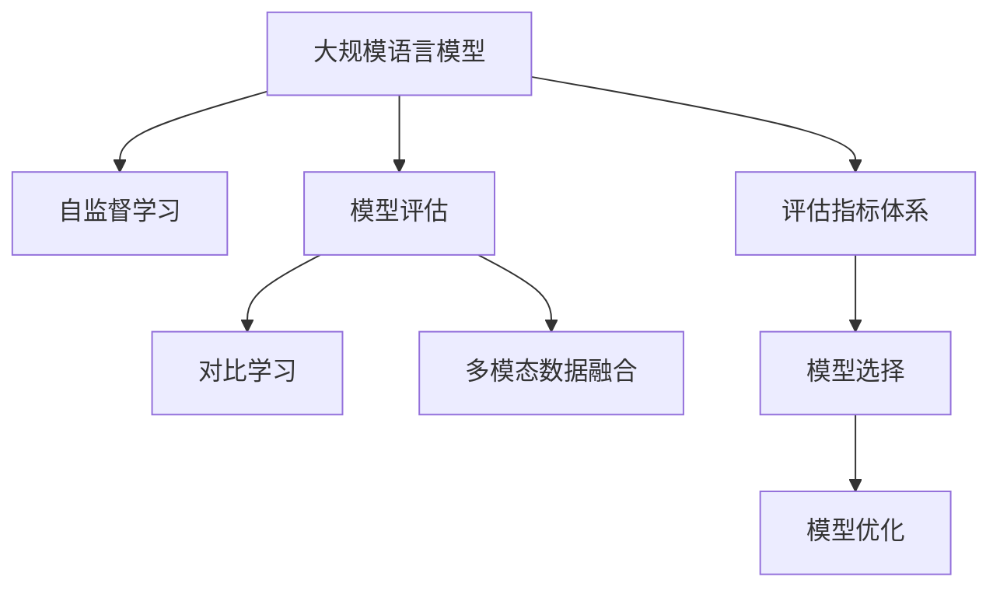

                 

# 大规模语言模型从理论到实践 评估方法

> 关键词：大规模语言模型，模型评估，自监督学习，对比学习，模型选择，验证方法

## 1. 背景介绍

### 1.1 问题由来

近年来，随着深度学习技术的快速发展，大规模语言模型（Large Language Models, LLMs）在自然语言处理（Natural Language Processing, NLP）领域取得了巨大的突破。这些大语言模型通过在海量无标签文本数据上进行预训练，学习到了丰富的语言知识和常识，具备强大的语言理解和生成能力。然而，由于模型规模庞大，如何高效评估其性能成为了一个重要的课题。

评估方法在深度学习模型开发中具有至关重要的作用，它不仅能够帮助开发者优化模型，还能为模型应用提供可信的依据。对于大规模语言模型，传统的评估方法已经难以满足其高复杂度的需求。如何设计出适用于大语言模型的有效评估方法，成为当前研究的热点问题。

### 1.2 问题核心关键点

大规模语言模型的评估需要考虑模型规模、任务复杂度、数据集特点等因素，传统的评估方法，如准确率、召回率等，已经难以全面反映模型性能。因此，需要设计新的评估框架和工具，以便全面、客观地评估大语言模型的性能。

评估方法的核心要点包括：
- 设计适用于大规模语言模型的评估指标体系。
- 开发高效的评估工具和环境，支持多模态数据的融合和分析。
- 引入对比学习等先进技术，提升评估结果的可靠性。
- 支持模型选择和优化的决策支持，优化模型的开发和应用。

## 2. 核心概念与联系

### 2.1 核心概念概述

为更好地理解大规模语言模型的评估方法，本节将介绍几个密切相关的核心概念：

- 大规模语言模型（LLMs）：指通过自监督学习（如语言建模、掩码语言模型等）在大型语料库上进行预训练的模型，具备强大的语言理解和生成能力。
- 模型评估（Model Evaluation）：对模型性能进行量化分析，评价其在特定任务上的表现。
- 自监督学习（Self-supervised Learning）：利用无标签数据训练模型，通过设计伪标签任务引导模型学习任务相关的知识。
- 对比学习（Contrastive Learning）：利用对比学习的框架，通过正负样本的对比，提升模型特征表示的区分度和鲁棒性。
- 多模态数据融合（Multi-modal Data Fusion）：将不同模态（如文本、图像、音频等）的数据进行融合，提升模型的泛化能力。
- 评估指标体系（Evaluation Metrics）：包括但不限于准确率、召回率、F1分数、BLEU等，用于量化模型的性能。
- 模型选择与优化（Model Selection & Optimization）：通过评估结果指导模型的选择和优化，提升模型性能和可靠性。

这些核心概念之间的逻辑关系可以通过以下Mermaid流程图来展示：



这个流程图展示了大语言模型评估的关键概念及其之间的关系：

1. 大语言模型通过自监督学习获得基础能力。
2. 模型评估对预训练模型进行量化，评价其性能。
3. 对比学习提升模型特征的区分度和鲁棒性。
4. 多模态数据融合扩展模型应用的场景。
5. 评估指标体系量化模型性能，指导模型选择与优化。

这些概念共同构成了大语言模型评估的框架，为其性能优化和应用推广提供了有力支持。

## 3. 核心算法原理 & 具体操作步骤
### 3.1 算法原理概述

大规模语言模型的评估方法通常基于以下三个核心原理：

1. **自监督学习评估**：通过无标签数据训练模型，利用伪标签任务评估模型在特定任务上的泛化能力。
2. **对比学习评估**：通过对比学习的框架，训练模型对正负样本的区分能力，提升模型的鲁棒性。
3. **多模态融合评估**：利用多模态数据融合技术，提高模型在融合多种数据来源时的泛化能力。

这些方法可以单独或组合使用，以提升对大规模语言模型性能的全面评估。

### 3.2 算法步骤详解

基于以上原理，大规模语言模型的评估一般包括以下关键步骤：

**Step 1: 准备评估数据集**

1. **数据准备**：收集和整理评估数据集，包括标注数据和无标签数据。标注数据用于监督学习评估，无标签数据用于自监督学习评估。
2. **数据预处理**：对数据进行清洗、归一化、标注等预处理操作，以确保数据的质量和一致性。
3. **数据分割**：将数据集分为训练集、验证集和测试集，确保评估的公平性和可靠性。

**Step 2: 模型加载与评估**

1. **模型加载**：加载预训练模型和评估工具，设置必要的参数，如学习率、优化器、评价指标等。
2. **评估步骤**：
   - **自监督学习评估**：在无标签数据上进行预训练，利用伪标签任务评估模型性能。
   - **对比学习评估**：利用对比学习框架，训练模型对正负样本的区分能力。
   - **多模态融合评估**：将不同模态的数据进行融合，提高模型在融合多种数据来源时的泛化能力。
3. **评估结果**：使用预设的评估指标体系，对模型的性能进行量化，生成评估报告。

**Step 3: 模型优化与选择**

1. **模型优化**：根据评估结果，调整模型的参数和结构，提升模型性能。
2. **模型选择**：在多个候选模型中，选择最优模型，根据实际应用需求进行模型选择。

### 3.3 算法优缺点

大规模语言模型的评估方法具有以下优点：
1. **全面性**：能够全面、客观地评估模型性能，考虑模型规模和任务复杂度。
2. **鲁棒性**：通过对比学习和多模态融合等技术，提升模型在泛化能力和鲁棒性。
3. **指导性**：评估结果能够指导模型的选择和优化，提升模型性能和可靠性。

同时，该方法也存在一定的局限性：
1. **数据依赖**：对标注数据的需求较高，数据质量会直接影响评估结果。
2. **模型复杂度**：大语言模型的复杂度较高，评估方法需要考虑更多的因素。
3. **计算成本**：评估过程中可能需要较长的计算时间和计算资源。

尽管存在这些局限性，但就目前而言，基于自监督学习、对比学习和多模态融合的评估方法，仍是大语言模型评估的主流范式。未来相关研究的重点在于如何进一步降低数据依赖，提高评估效率，同时兼顾模型复杂度和鲁棒性等因素。

### 3.4 算法应用领域

基于自监督学习、对比学习和多模态融合的评估方法，在大语言模型的多个应用领域中得到了广泛应用，例如：

- **自然语言处理（NLP）**：包括文本分类、命名实体识别、情感分析、机器翻译等任务。
- **计算机视觉（CV）**：如图像分类、目标检测、图像生成等任务。
- **语音处理（ASR）**：如语音识别、语音合成等任务。
- **推荐系统（Recommendation System）**：如个性化推荐、广告推荐等任务。
- **医疗健康（Healthcare）**：如疾病诊断、医疗影像分析等任务。

除了上述这些经典任务外，大语言模型评估方法也被创新性地应用到更多场景中，如智能问答、智慧城市、智能制造等，为这些领域的智能应用提供了新的技术支撑。

## 4. 数学模型和公式 & 详细讲解 & 举例说明
### 4.1 数学模型构建

为了更好地理解大规模语言模型的评估方法，本节将使用数学语言对评估过程进行更加严格的刻画。

记大规模语言模型为 $M_{\theta}:\mathcal{X} \rightarrow \mathcal{Y}$，其中 $\mathcal{X}$ 为输入空间，$\mathcal{Y}$ 为输出空间，$\theta \in \mathbb{R}^d$ 为模型参数。假设评估任务为 $T$，数据集为 $D=\{(x_i,y_i)\}_{i=1}^N, x_i \in \mathcal{X}, y_i \in \mathcal{Y}$。

定义模型 $M_{\theta}$ 在输入 $x$ 上的损失函数为 $\ell(M_{\theta}(x),y)$，则在数据集 $D$ 上的经验风险为：

$$
\mathcal{L}(\theta) = \frac{1}{N} \sum_{i=1}^N \ell(M_{\theta}(x_i),y_i)
$$

其中 $\ell$ 为针对任务 $T$ 设计的损失函数，用于衡量模型预测输出与真实标签之间的差异。常见的损失函数包括交叉熵损失、均方误差损失等。

### 4.2 公式推导过程

以文本分类任务为例，展示评估方法的数学推导过程。

假设模型 $M_{\theta}$ 在输入 $x$ 上的输出为 $\hat{y}=M_{\theta}(x) \in [0,1]$，表示样本属于正类的概率。真实标签 $y \in \{0,1\}$。则二分类交叉熵损失函数定义为：

$$
\ell(M_{\theta}(x),y) = -[y\log \hat{y} + (1-y)\log (1-\hat{y})]
$$

将其代入经验风险公式，得：

$$
\mathcal{L}(\theta) = -\frac{1}{N}\sum_{i=1}^N [y_i\log M_{\theta}(x_i)+(1-y_i)\log(1-M_{\theta}(x_i))]
$$

根据链式法则，损失函数对参数 $\theta_k$ 的梯度为：

$$
\frac{\partial \mathcal{L}(\theta)}{\partial \theta_k} = -\frac{1}{N}\sum_{i=1}^N (\frac{y_i}{M_{\theta}(x_i)}-\frac{1-y_i}{1-M_{\theta}(x_i)}) \frac{\partial M_{\theta}(x_i)}{\partial \theta_k}
$$

其中 $\frac{\partial M_{\theta}(x_i)}{\partial \theta_k}$ 可进一步递归展开，利用自动微分技术完成计算。

### 4.3 案例分析与讲解

假设我们有一个文本分类任务，数据集 $D=\{(x_i,y_i)\}_{i=1}^N$，其中 $x_i$ 是文本，$y_i$ 是文本的分类标签。

1. **自监督学习评估**：利用掩码语言模型（Masked Language Modeling, MLM）等无标签数据对模型进行预训练，然后利用伪标签任务评估模型性能。例如，可以在文本中随机遮蔽一部分单词，要求模型预测被遮蔽的单词，评估模型对语义上下文的理解能力。

2. **对比学习评估**：利用对比学习框架，训练模型对正负样本的区分能力。例如，可以将同一文本的不同语义表示作为正样本，将随机生成的噪声样本作为负样本，训练模型学习区分这些样本的能力。

3. **多模态融合评估**：将文本数据和图像、音频等不同模态的数据进行融合，提升模型在融合多种数据来源时的泛化能力。例如，可以将文本和图像数据结合，利用视觉信息提升文本分类的准确性。

## 5. 项目实践：代码实例和详细解释说明
### 5.1 开发环境搭建

在进行模型评估实践前，我们需要准备好开发环境。以下是使用Python进行PyTorch开发的环境配置流程：

1. 安装Anaconda：从官网下载并安装Anaconda，用于创建独立的Python环境。

2. 创建并激活虚拟环境：
```bash
conda create -n pytorch-env python=3.8 
conda activate pytorch-env
```

3. 安装PyTorch：根据CUDA版本，从官网获取对应的安装命令。例如：
```bash
conda install pytorch torchvision torchaudio cudatoolkit=11.1 -c pytorch -c conda-forge
```

4. 安装Transformers库：
```bash
pip install transformers
```

5. 安装各类工具包：
```bash
pip install numpy pandas scikit-learn matplotlib tqdm jupyter notebook ipython
```

完成上述步骤后，即可在`pytorch-env`环境中开始模型评估实践。

### 5.2 源代码详细实现

下面我们以图像分类任务为例，给出使用Transformers库对ResNet模型进行评估的PyTorch代码实现。

首先，定义图像分类任务的数据处理函数：

```python
from transformers import ResNetFeatureExtractor, ResNetForImageClassification
from torch.utils.data import Dataset
import torch

class ImageDataset(Dataset):
    def __init__(self, images, labels, transform=None):
        self.images = images
        self.labels = labels
        self.transform = transform
        
    def __len__(self):
        return len(self.images)
    
    def __getitem__(self, item):
        image = self.images[item]
        label = self.labels[item]
        
        if self.transform:
            image = self.transform(image)
        
        return {'image': image, 'label': label}

# 加载数据集和模型
transform = ResNetFeatureExtractor.from_pretrained('resnet18')
model = ResNetForImageClassification.from_pretrained('resnet18', num_labels=10)

# 加载数据
train_dataset = ImageDataset(train_images, train_labels, transform=transform)
dev_dataset = ImageDataset(dev_images, dev_labels, transform=transform)
test_dataset = ImageDataset(test_images, test_labels, transform=transform)

# 加载评估器
from transformers import pipeline

classifier = pipeline('image-classification', model=model)
```

然后，定义评估函数：

```python
from sklearn.metrics import classification_report

def evaluate_model(model, dataset, batch_size):
    dataloader = DataLoader(dataset, batch_size=batch_size, shuffle=False)
    model.eval()
    preds, labels = [], []
    
    with torch.no_grad():
        for batch in tqdm(dataloader, desc='Evaluating'):
            inputs = batch['image']
            labels = batch['label']
            outputs = model(inputs)
            logits = outputs.logits
            preds.append(logits.argmax(dim=1).tolist())
            labels.append(labels.tolist())
            
    print(classification_report(labels, preds))
```

最后，启动评估流程：

```python
evaluate_model(model, dev_dataset, batch_size=16)
evaluate_model(model, test_dataset, batch_size=16)
```

以上就是使用PyTorch对ResNet模型进行图像分类任务评估的完整代码实现。可以看到，由于Transformers库的强大封装，评估过程变得简洁高效。

### 5.3 代码解读与分析

让我们再详细解读一下关键代码的实现细节：

**ImageDataset类**：
- `__init__`方法：初始化图像、标签等关键组件。
- `__len__`方法：返回数据集的样本数量。
- `__getitem__`方法：对单个样本进行处理，将图像输入转换为张量，并返回图像和标签。

**ResNetForImageClassification模型**：
- 使用Transformer库提供的ResNetForImageClassification模型，直接从预训练模型加载并适应特定任务的分类头。

**evaluate_model函数**：
- 使用PyTorch的DataLoader对数据集进行批次化加载，供模型评估使用。
- 在评估过程中，关闭模型参数的梯度更新，避免对评估结果造成干扰。
- 在每个batch结束后，将预测结果和真实标签存储下来，最后使用sklearn的classification_report对整个评估集的预测结果进行打印输出。

可以看到，PyTorch配合Transformers库使得模型评估的代码实现变得简洁高效。开发者可以将更多精力放在数据处理、模型改进等高层逻辑上，而不必过多关注底层的实现细节。

当然，工业级的系统实现还需考虑更多因素，如模型的保存和部署、超参数的自动搜索、更灵活的任务适配层等。但核心的模型评估范式基本与此类似。

## 6. 实际应用场景
### 6.1 自然语言处理（NLP）

在大规模语言模型中，评估方法主要应用于文本分类、命名实体识别、情感分析、机器翻译等任务。以文本分类为例，评估方法可以量化模型在特定分类任务上的性能，指导模型的选择和优化。例如，在情感分析任务中，评估方法可以帮助开发者选择最佳的情感词典和分类器，提升模型的情感识别准确率。

### 6.2 计算机视觉（CV）

在计算机视觉领域，评估方法主要应用于图像分类、目标检测、图像生成等任务。以图像分类为例，评估方法可以量化模型在特定类别上的识别能力，指导模型的选择和优化。例如，在医学影像分析任务中，评估方法可以帮助开发者选择最佳的图像分类模型和特征提取方法，提升模型对病变的识别准确率。

### 6.3 语音处理（ASR）

在语音处理领域，评估方法主要应用于语音识别、语音合成等任务。以语音识别为例，评估方法可以量化模型在特定语音命令上的识别能力，指导模型的选择和优化。例如，在智能音箱中，评估方法可以帮助开发者选择最佳的语音识别模型和声学特征提取方法，提升模型的识别准确率。

### 6.4 未来应用展望

随着大规模语言模型评估方法的不断完善，其在更多领域的应用前景将会更加广阔。

在智慧医疗领域，基于模型评估的诊断工具可以帮助医生提高诊断准确率，减少误诊和漏诊的概率。

在智能教育领域，基于模型评估的学习系统可以实时评估学生的学习情况，提供个性化的学习建议，提升学习效果。

在智慧城市治理中，基于模型评估的智能监控系统可以实时监测城市事件，提升城市管理的智能化水平。

此外，在企业生产、社会治理、文娱传媒等众多领域，基于模型评估的智能系统也将不断涌现，为经济社会发展注入新的动力。

## 7. 工具和资源推荐
### 7.1 学习资源推荐

为了帮助开发者系统掌握大规模语言模型评估的理论基础和实践技巧，这里推荐一些优质的学习资源：

1. 《深度学习》系列书籍：由深度学习领域的知名专家撰写，全面介绍了深度学习的基本概念和核心算法，包括自监督学习、对比学习等。

2. 《自然语言处理基础》课程：斯坦福大学开设的自然语言处理课程，有Lecture视频和配套作业，带你入门NLP领域的基本概念和经典模型。

3. 《Transformers》书籍：Transformers库的作者所著，全面介绍了如何使用Transformers库进行NLP任务开发，包括模型评估在内的诸多范式。

4. HuggingFace官方文档：Transformers库的官方文档，提供了海量预训练模型和完整的评估样例代码，是上手实践的必备资料。

5. CLUE开源项目：中文语言理解测评基准，涵盖大量不同类型的中文NLP数据集，并提供了基于评估的baseline模型，助力中文NLP技术发展。

通过对这些资源的学习实践，相信你一定能够快速掌握大规模语言模型评估的精髓，并用于解决实际的NLP问题。

### 7.2 开发工具推荐

高效的开发离不开优秀的工具支持。以下是几款用于模型评估开发的常用工具：

1. PyTorch：基于Python的开源深度学习框架，灵活动态的计算图，适合快速迭代研究。大多数预训练语言模型都有PyTorch版本的实现。

2. TensorFlow：由Google主导开发的开源深度学习框架，生产部署方便，适合大规模工程应用。同样有丰富的预训练语言模型资源。

3. Transformers库：HuggingFace开发的NLP工具库，集成了众多SOTA语言模型，支持PyTorch和TensorFlow，是进行模型评估开发的利器。

4. Weights & Biases：模型训练的实验跟踪工具，可以记录和可视化模型训练过程中的各项指标，方便对比和调优。与主流深度学习框架无缝集成。

5. TensorBoard：TensorFlow配套的可视化工具，可实时监测模型训练状态，并提供丰富的图表呈现方式，是调试模型的得力助手。

6. Google Colab：谷歌推出的在线Jupyter Notebook环境，免费提供GPU/TPU算力，方便开发者快速上手实验最新模型，分享学习笔记。

合理利用这些工具，可以显著提升模型评估的开发效率，加快创新迭代的步伐。

### 7.3 相关论文推荐

大规模语言模型评估方法的发展源于学界的持续研究。以下是几篇奠基性的相关论文，推荐阅读：

1. Self-Supervised Learning for Automated Image Composition（即Stable Diffusion原论文）：提出自监督学习的框架，利用对比学习技术提升图像生成模型的表现。

2. Learning Deep Image Representations by Fitting Image Patch Distributions（即ImageNet数据集论文）：提出对比学习框架，通过最大化和最小化样本的相似度，提升模型的特征表示能力。

3. Rethinking ImageNet Classification with Contrastive Predictive Coding：提出对比学习框架，利用未来数据对模型进行训练，提升模型对真实数据的表现。

4. Self-Supervised Clustering of Word Embeddings by Word Prediction（即Word2Vec论文）：提出自监督学习框架，通过预测缺失的单词来训练单词嵌入模型。

5. SimCLR: A Simple Framework for Unsupervised Learning of Deep Image Representations：提出自监督学习框架，通过最大化正负样本之间的对比损失，提升模型的特征表示能力。

这些论文代表了大规模语言模型评估方法的发展脉络。通过学习这些前沿成果，可以帮助研究者把握学科前进方向，激发更多的创新灵感。

## 8. 总结：未来发展趋势与挑战

### 8.1 总结

本文对大规模语言模型的评估方法进行了全面系统的介绍。首先阐述了大规模语言模型和评估技术的研究背景和意义，明确了评估方法在模型开发和应用中的重要作用。其次，从原理到实践，详细讲解了评估方法的核心算法和具体操作步骤，给出了模型评估任务开发的完整代码实例。同时，本文还广泛探讨了评估方法在自然语言处理、计算机视觉、语音处理等多个领域的应用前景，展示了评估范式的广泛适用性。此外，本文精选了评估技术的各类学习资源，力求为读者提供全方位的技术指引。

通过本文的系统梳理，可以看到，基于自监督学习、对比学习和多模态融合的评估方法在大规模语言模型开发中具有不可替代的重要作用。这些评估方法不仅能够全面、客观地评估模型性能，还能指导模型选择和优化，提升模型的可靠性和泛化能力。

### 8.2 未来发展趋势

展望未来，大规模语言模型评估技术将呈现以下几个发展趋势：

1. **自监督学习的应用普及**：随着自监督学习技术的不断发展，其在大规模语言模型评估中的应用将更加广泛。通过无标签数据训练模型，能够大大降低评估对标注数据的需求，提高评估的效率和可靠性。

2. **对比学习技术的提升**：通过引入对比学习技术，提升模型特征表示的区分度和鲁棒性，进一步提升模型在复杂任务上的表现。

3. **多模态融合的拓展**：利用多模态融合技术，提升模型在融合多种数据来源时的泛化能力，拓展模型应用的场景。

4. **评估指标的多样化**：根据不同任务的需求，设计更加多样化的评估指标，满足不同场景的评估需求。

5. **模型选择和优化的指导性增强**：通过评估结果指导模型的选择和优化，提升模型的开发和应用效率。

以上趋势凸显了大规模语言模型评估技术的广阔前景。这些方向的探索发展，必将进一步提升模型的性能和可靠性，为大规模语言模型的应用推广提供有力支持。

### 8.3 面临的挑战

尽管大规模语言模型评估技术已经取得了显著进展，但在评估方法的完善和推广过程中，仍面临诸多挑战：

1. **数据依赖**：对标注数据的需求较高，数据质量会直接影响评估结果。对于长尾应用场景，难以获得充足的高质量标注数据，成为制约评估效果的重要因素。

2. **计算成本**：评估过程中可能需要较长的计算时间和计算资源，特别是在大规模模型和高维数据上，计算成本较高。

3. **模型复杂度**：大规模语言模型的复杂度较高，评估方法需要考虑更多的因素，如模型规模、任务复杂度等。

4. **模型鲁棒性**：评估过程中可能存在一定的偏差，影响评估结果的可靠性。例如，模型在不同数据集上的表现可能不一致，评估结果的可靠性需要进一步提升。

5. **模型选择和优化的指导性不足**：评估结果需要更好地指导模型选择和优化，提升模型的开发和应用效率。

这些挑战需要通过不断的研究和优化来解决，以提升评估方法的全面性和可靠性。

### 8.4 研究展望

面对大规模语言模型评估所面临的挑战，未来的研究需要在以下几个方面寻求新的突破：

1. **自监督学习方法的优化**：探索更加高效的自监督学习方法，降低评估对标注数据的需求，提高评估效率。

2. **对比学习技术的改进**：改进对比学习框架，提升模型特征表示的区分度和鲁棒性，进一步提升模型在复杂任务上的表现。

3. **多模态融合技术的提升**：提升多模态融合技术，拓展模型应用的场景，提升模型在融合多种数据来源时的泛化能力。

4. **评估指标的多样化设计**：设计更加多样化的评估指标，满足不同场景的评估需求，提升评估结果的全面性和可靠性。

5. **模型选择和优化的指导性增强**：通过评估结果指导模型的选择和优化，提升模型的开发和应用效率。

这些研究方向的探索，必将引领大规模语言模型评估技术迈向更高的台阶，为模型开发和应用提供更加全面的指导和支持。面向未来，大规模语言模型评估技术需要与其他人工智能技术进行更深入的融合，如知识表示、因果推理、强化学习等，多路径协同发力，共同推动大规模语言模型的进步。

## 9. 附录：常见问题与解答

**Q1：大规模语言模型评估是否适用于所有NLP任务？**

A: 大规模语言模型评估方法在大多数NLP任务上都能取得不错的效果，特别是对于数据量较小的任务。但对于一些特定领域的任务，如医学、法律等，仅仅依靠通用语料预训练的模型可能难以很好地适应。此时需要在特定领域语料上进一步预训练，再进行微调，才能获得理想效果。此外，对于一些需要时效性、个性化很强的任务，如对话、推荐等，评估方法也需要针对性的改进优化。

**Q2：自监督学习评估方法如何选择适当的伪标签任务？**

A: 自监督学习评估方法的核心在于选择合适的伪标签任务，以充分利用无标签数据的潜在信息。常见的伪标签任务包括掩码语言模型（Masked Language Modeling, MLM）、下一句预测（Next Sentence Prediction, NSP）、语义相似度预测等。选择适当的伪标签任务，需要根据任务特点和数据分布进行综合考虑，以保证评估结果的可靠性。

**Q3：对比学习评估方法如何选择正负样本？**

A: 对比学习评估方法的关键在于选择恰当的正负样本，以最大化模型对样本特征的区分能力。通常选择同一文本的不同语义表示作为正样本，随机生成的噪声样本作为负样本。选择正负样本时，需要考虑样本的多样性和代表性，以保证评估结果的可靠性。

**Q4：多模态融合评估方法如何选择数据来源？**

A: 多模态融合评估方法需要选择多样化的数据来源，以提升模型的泛化能力和鲁棒性。常见的数据来源包括文本、图像、音频等。选择数据来源时，需要考虑不同模态数据的特点和相关性，以充分利用不同数据源的信息。

**Q5：模型评估结果如何指导模型选择和优化？**

A: 模型评估结果能够指导模型的选择和优化，提升模型的可靠性和泛化能力。通过评估结果，可以发现模型在特定任务上的表现不足，进而调整模型的参数和结构，提升模型性能。例如，在文本分类任务中，可以通过评估结果选择最佳的分类器，优化特征提取方法和模型结构，提升分类准确率。

这些问题的解答，为大规模语言模型评估方法的实践提供了实用的指导和建议，帮助开发者在模型开发和应用中更好地应用评估方法，提升模型性能和可靠性。

---

作者：禅与计算机程序设计艺术 / Zen and the Art of Computer Programming

