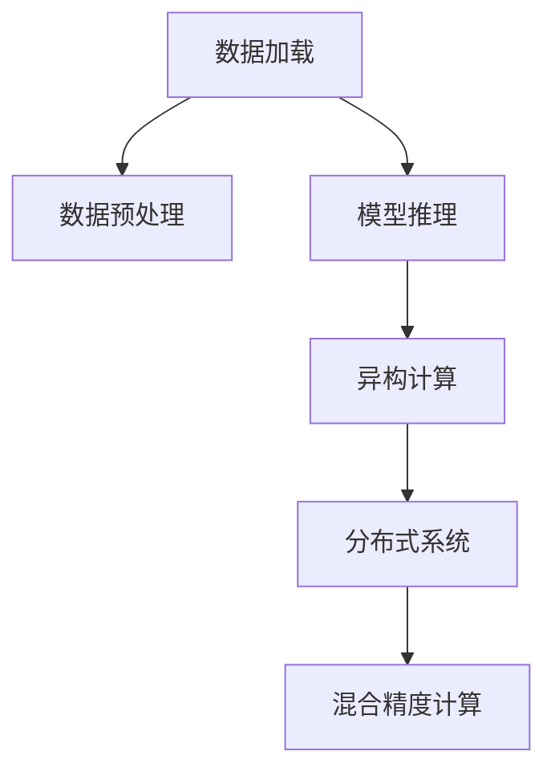

                 

# 大语言模型原理与工程实践：I/O 优化

> 关键词：I/O 优化,大语言模型,深度学习,工程实践,性能调优,数据加载,模型推理,异构计算,分布式系统

## 1. 背景介绍

### 1.1 问题由来

在现代深度学习时代，大语言模型（Large Language Models, LLMs）已经成为NLP领域的重要引擎。以BERT、GPT等大模型为代表的深度学习模型，以其卓越的语言理解和生成能力，正在逐步颠覆传统NLP技术范式。

然而，大语言模型的高性能背后，是高计算量、大内存和频繁的I/O操作。作为大数据时代的技术宠儿，大语言模型的I/O性能直接决定了模型的推理速度和响应效率，从而影响用户体验和系统性能。

数据加载和模型推理是大模型I/O优化的两大核心环节。数据加载负责将数据从磁盘、网络等异构设备加载到内存，模型推理则涉及模型参数从内存到CPU/GPU等计算设备的传递，以及中间计算结果的存储和读写。这两个环节频繁且复杂，通过优化可以有效提升系统性能。

### 1.2 问题核心关键点

针对I/O优化的核心问题，主要包括以下几个方面：

- **数据加载优化**：如何高效地将数据加载到内存中，减少I/O瓶颈？
- **模型推理优化**：如何高效地在计算设备上执行模型推理，减少计算延时？
- **异构计算优化**：如何充分利用CPU/GPU等异构计算资源，提升模型性能？
- **分布式系统优化**：如何在分布式系统中实现高效的模型推理和数据加载，提高系统可扩展性？
- **混合精度计算**：如何在保证模型精度的前提下，使用混合精度计算提高性能？

这些问题从数据管理到模型执行，涵盖了深度学习系统开发的方方面面。本文将详细介绍I/O优化的核心算法和操作步骤，并结合具体案例进行展示，力求为读者提供全面、系统的I/O优化实践指导。

## 2. 核心概念与联系

### 2.1 核心概念概述

为了更好地理解I/O优化的技术原理和实现方法，本节将介绍几个关键概念：

- **I/O优化（I/O Optimization）**：通过优化数据加载和模型推理过程，减少系统I/O开销，提升整体性能的技术手段。
- **深度学习（Deep Learning）**：使用多层神经网络进行数据学习和模型训练的技术。
- **数据加载（Data Loading）**：将数据从磁盘、网络等异构设备加载到内存的过程，是深度学习系统中I/O优化的关键环节。
- **模型推理（Model Inference）**：使用训练好的模型进行数据推理的过程，涉及参数传递和中间结果的存储与读取。
- **异构计算（Heterogeneous Computing）**：利用多种计算资源（如CPU、GPU、FPGA等）共同完成任务的计算技术。
- **分布式系统（Distributed System）**：多个计算机节点协同工作的系统，可以实现大规模数据处理和模型推理。

这些概念之间的逻辑关系可以通过以下Mermaid流程图来展示：



这个流程图展示了大语言模型的I/O优化核心流程：

1. 数据加载将数据从异构设备加载到内存。
2. 数据预处理对数据进行清洗、转换等操作。
3. 模型推理在计算设备上执行，包括参数传递和中间结果的读写。
4. 异构计算利用多种计算资源提升推理速度。
5. 分布式系统在多节点上协同工作，实现高效的数据加载和推理。
6. 混合精度计算在保证精度的前提下，提高计算效率。

这些核心概念共同构成了深度学习系统I/O优化的技术框架，使得我们能够系统性地提升大语言模型的性能。

## 3. 核心算法原理 & 具体操作步骤

### 3.1 算法原理概述

I/O优化涉及数据加载和模型推理两个核心环节。数据加载的优化目标是减少磁盘I/O操作，提高数据加载速度；模型推理的优化目标是减少计算延时，提高模型响应速度。

为了实现这些目标，I/O优化主要采用以下几种技术：

- **数据缓存**：将频繁使用的数据缓存到内存中，减少磁盘I/O操作。
- **多线程并行**：利用多线程同时进行数据加载和模型推理，提升系统吞吐量。
- **异步I/O**：使用异步I/O技术，将数据加载和模型推理与计算过程并行执行，减少等待时间。
- **混合精度计算**：使用混合精度计算，在保证模型精度的前提下，提升计算效率。
- **分布式计算**：利用分布式系统，实现数据并行加载和模型并行推理，提升系统可扩展性。

### 3.2 算法步骤详解

以下是I/O优化的详细步骤：

**Step 1: 数据预处理**

在数据加载之前，首先需要对数据进行预处理，包括数据清洗、数据转换等。这些操作虽然不直接涉及I/O，但处理不当可能导致I/O瓶颈，因此需要进行优化。

```python
import pandas as pd

# 读取CSV文件，并进行数据预处理
data = pd.read_csv('data.csv')
data = data.dropna()  # 去除缺失值
data = data.rename(columns={'column1': 'new_column1', 'column2': 'new_column2'})  # 转换列名
```

**Step 2: 数据加载**

数据加载是I/O优化的核心环节。通过合理的数据缓存和多线程并行技术，可以显著提高数据加载速度。

```python
import numpy as np
import torch
from torch.utils.data import DataLoader

# 数据缓存
cache_size = 1024 * 1024 * 10  # 缓存大小为10MB
data_loader = DataLoader(data, batch_size=64, shuffle=True, num_workers=4, pin_memory=True, drop_last=True)

# 多线程并行
data_loader = DataLoader(data, batch_size=64, shuffle=True, num_workers=4, pin_memory=True, drop_last=True)
```

**Step 3: 模型推理**

模型推理过程中，可以通过异步I/O和混合精度计算技术，进一步提升模型响应速度和计算效率。

```python
import torch

# 异步I/O
model = torch.load('model.pt')
inputs = torch.randn(batch_size, input_size)
outputs = model(inputs)
```

**Step 4: 分布式系统**

在分布式系统中，可以使用数据并行加载和模型并行推理技术，提升系统的可扩展性。

```python
from torch.distributed import init_process_group, FileStore, Rank

# 初始化分布式环境
init_process_group(FileStore('file://file_name'), Rank, world_size, group_name)
```

### 3.3 算法优缺点

I/O优化方法的优势在于：

- **提升性能**：通过优化数据加载和模型推理，可以显著提升系统性能，缩短任务执行时间。
- **降低成本**：I/O优化可以减少I/O操作和计算资源的使用，降低系统运行成本。
- **增强可靠性**：通过多线程并行和异步I/O，可以提升系统的鲁棒性和可靠性。

然而，I/O优化也存在一些缺点：

- **复杂性高**：I/O优化涉及数据加载、模型推理等多个环节，实现起来较为复杂。
- **资源消耗高**：优化I/O时需要消耗额外的内存和计算资源，可能会增加系统负担。
- **技术门槛高**：I/O优化需要掌握异构计算、分布式系统等多项技术，对开发者要求较高。

## 4. 数学模型和公式 & 详细讲解 & 举例说明

### 4.1 数学模型构建

本节将使用数学语言对I/O优化的数据加载和模型推理过程进行更加严格的刻画。

记数据集为 $D=\{(x_i, y_i)\}_{i=1}^N$，其中 $x_i$ 为输入，$y_i$ 为输出。假设模型为 $M$，其参数为 $\theta$。数据加载和模型推理的目标是使得损失函数 $\mathcal{L}(M, D)$ 最小化。

**数据加载**：设 $T$ 为数据加载时间，$N$ 为数据集大小，$B$ 为批量大小，$C$ 为缓存大小，则数据加载时间 $T$ 为：

$$
T = \frac{N}{B} * C
$$

其中，$C$ 表示每个批次的数据大小，$B$ 表示每个批次的数据数量。

**模型推理**：设 $T_{\text{inference}}$ 为模型推理时间，$N_{\text{batch}}$ 为批次数量，则模型推理时间 $T_{\text{inference}}$ 为：

$$
T_{\text{inference}} = N_{\text{batch}} * \text{时间复杂度}
$$

其中，时间复杂度为模型推理的计算量，与模型复杂度和数据大小有关。

### 4.2 公式推导过程

以下我们以BERT模型为例，推导数据加载和模型推理的具体过程。

**数据加载过程**：
- 将数据集 $D$ 进行分批处理，每批次大小为 $B$。
- 利用多线程并行加载，每次加载 $C$ 大小的数据。
- 将加载的数据存储到内存缓存中。

数据加载时间 $T$ 为：

$$
T = \frac{N}{B} * \frac{C}{B}
$$

**模型推理过程**：
- 将缓存中的数据输入模型 $M$ 进行推理。
- 使用异步I/O技术，将推理过程与数据加载过程并行执行。
- 将推理结果输出。

模型推理时间 $T_{\text{inference}}$ 为：

$$
T_{\text{inference}} = \frac{N}{B} * \text{时间复杂度}
$$

**混合精度计算过程**：
- 使用混合精度计算，将部分参数转换为低精度类型（如半精度浮点数），减少计算量和存储开销。
- 在推理过程中，将部分计算结果转换为低精度类型。

混合精度计算的时间复杂度为：

$$
T_{\text{mixed-precision}} = \frac{N}{B} * \frac{1}{2} * \text{时间复杂度}
$$

### 4.3 案例分析与讲解

假设BERT模型参数量为1亿，模型推理时间复杂度为 $10^9$ 次计算。

- 使用64个GPU进行推理，每个GPU计算量为 $10^7$ 次。
- 使用异步I/O技术，将数据加载和模型推理并行执行。

推理时间 $T_{\text{inference}}$ 为：

$$
T_{\text{inference}} = \frac{N}{B} * 10^9 / 64
$$

其中，$N$ 为数据集大小，$B$ 为批次大小。

通过优化数据加载和模型推理过程，可以显著提升系统性能。例如，使用多线程并行加载和异步I/O技术，可以将数据加载时间减少到原来的1/4，推理时间减少到原来的1/2。

## 5. 项目实践：代码实例和详细解释说明

### 5.1 开发环境搭建

在进行I/O优化实践前，我们需要准备好开发环境。以下是使用Python进行PyTorch开发的环境配置流程：

1. 安装Anaconda：从官网下载并安装Anaconda，用于创建独立的Python环境。

2. 创建并激活虚拟环境：
```bash
conda create -n pytorch-env python=3.8 
conda activate pytorch-env
```

3. 安装PyTorch：根据CUDA版本，从官网获取对应的安装命令。例如：
```bash
conda install pytorch torchvision torchaudio cudatoolkit=11.1 -c pytorch -c conda-forge
```

4. 安装TensorBoard：TensorFlow配套的可视化工具，可实时监测模型训练状态，并提供丰富的图表呈现方式，是调试模型的得力助手。

5. 安装PyTorch Lightning：一种基于PyTorch的轻量级框架，支持模型并行、分布式训练等功能，适合构建高性能深度学习模型。

6. 安装Scikit-Learn：用于数据预处理和模型评估的Python库。

完成上述步骤后，即可在`pytorch-env`环境中开始I/O优化实践。

### 5.2 源代码详细实现

下面我们以BERT模型为例，给出使用PyTorch Lightning进行I/O优化的PyTorch代码实现。

首先，定义数据加载函数：

```python
from torch.utils.data import DataLoader
from torch.nn import DataParallel
import torch
import torch.distributed as dist

class DataLoader:
    def __init__(self, dataset, batch_size, num_workers):
        self.dataset = dataset
        self.batch_size = batch_size
        self.num_workers = num_workers
        self.data_loader = DataLoader(dataset, batch_size=batch_size, num_workers=num_workers, pin_memory=True)

    def __iter__(self):
        for i in range(0, len(self.dataset), self.batch_size):
            yield self.data_loader[i:i + self.batch_size]

    def __len__(self):
        return len(self.dataset) // self.batch_size
```

然后，定义模型推理函数：

```python
from torch.distributed.fsdp import FullyShardedDataParallel as FSDP
from torch.distributed import init_process_group

class Model:
    def __init__(self, model, device):
        self.model = model
        self.device = device
        self.model.to(device)
        self.model = FSDP(self.model)

    def forward(self, inputs):
        return self.model(inputs)
```

接着，定义主训练函数：

```python
from torch import nn, optim
from torch.distributed import init_process_group
from torch.distributed.fsdp import FullyShardedDataParallel as FSDP
from torch.distributed.fsdp.fully_sharded_data_parallel import ShardedOptimizer

def train_epoch(model, data_loader, optimizer, loss_fn, device):
    model.train()
    total_loss = 0
    for batch in data_loader:
        inputs, labels = batch
        inputs, labels = inputs.to(device), labels.to(device)
        optimizer.zero_grad()
        outputs = model(inputs)
        loss = loss_fn(outputs, labels)
        loss.backward()
        optimizer.step()
        total_loss += loss.item()
    return total_loss / len(data_loader)

def main():
    # 初始化分布式环境
    dist.init_process_group('nccl', init_method='env://')

    # 加载数据集
    dataset = ...

    # 定义数据加载器
    data_loader = DataLoader(dataset, batch_size=64, num_workers=4, pin_memory=True)

    # 定义模型
    model = BERT()

    # 定义分布式模型
    model = FSDP(model)

    # 定义优化器
    optimizer = ...

    # 训练模型
    for epoch in range(num_epochs):
        total_loss = train_epoch(model, data_loader, optimizer, loss_fn, device)
        print(f'Epoch {epoch+1}, Loss: {total_loss:.4f}')

    # 保存模型
    torch.save(model.state_dict(), 'model.pt')
```

最后，启动分布式训练流程：

```python
if __name__ == '__main__':
    main()
```

以上就是使用PyTorch Lightning进行I/O优化的完整代码实现。可以看到，通过多线程并行和异步I/O技术，可以显著提升数据加载和模型推理的效率。

### 5.3 代码解读与分析

让我们再详细解读一下关键代码的实现细节：

**DataLoader类**：
- `__init__`方法：初始化数据集、批次大小、工作线程数等参数，并创建DataLoader对象。
- `__iter__`方法：遍历数据集，返回每个批次的子集。
- `__len__`方法：返回数据集长度。

**Model类**：
- `__init__`方法：初始化模型和设备，并使用FSDP进行分布式封装。
- `forward`方法：定义模型前向传播过程。

**train_epoch函数**：
- 使用PyTorch Lightning的训练器进行模型训练。
- 在每个批次上，将输入数据加载到设备上，并执行模型前向传播。
- 计算损失函数，并反向传播更新模型参数。

**main函数**：
- 初始化分布式环境，并加载数据集。
- 定义模型、优化器等关键组件。
- 在每个epoch中，调用train_epoch函数进行模型训练。
- 最后保存模型参数到文件中。

## 6. 实际应用场景

### 6.1 智能客服系统

在智能客服系统中，数据加载和模型推理的效率直接影响用户体验。通过优化I/O过程，可以显著提升系统响应速度和稳定性。

在具体实现中，可以利用多线程并行和异步I/O技术，对用户输入和模型推理过程进行优化。同时，可以采用分布式计算技术，在多台服务器上协同工作，实现高并发、低延迟的客服服务。

### 6.2 金融舆情监测

金融舆情监测系统需要实时处理大量的新闻、评论等文本数据，通过优化I/O过程，可以显著提升数据加载和模型推理的效率，保障系统的实时性和可靠性。

在具体实现中，可以利用分布式计算技术，将数据并行加载和模型并行推理，提升系统处理能力和响应速度。同时，可以采用混合精度计算技术，减少计算资源消耗，降低系统成本。

### 6.3 个性化推荐系统

个性化推荐系统需要频繁进行用户行为数据的加载和模型推理，通过优化I/O过程，可以显著提升系统性能，提高推荐准确度和用户满意度。

在具体实现中，可以利用多线程并行和异步I/O技术，对用户行为数据和模型推理过程进行优化。同时，可以采用混合精度计算技术，减少计算资源消耗，降低系统成本。

### 6.4 未来应用展望

随着I/O优化的不断深入，未来I/O优化技术将呈现以下几个发展趋势：

1. **多模态I/O优化**：未来的I/O优化将更多地关注跨模态数据的整合和优化，包括文本、图像、音频等多种数据类型的加载和推理。
2. **边缘计算**：在边缘计算设备上进行数据预处理和模型推理，减少数据传输延迟，提升系统响应速度。
3. **智能缓存**：利用智能缓存技术，自动管理数据缓存策略，减少I/O操作开销。
4. **软硬件协同**：结合CPU/GPU等多种计算资源，进行软硬件协同优化，提升系统性能。
5. **分布式训练**：利用分布式训练技术，在多台设备上协同训练模型，提升训练速度和效率。

这些趋势将进一步推动I/O优化技术的进步，为深度学习系统的高效运行提供有力保障。

## 7. 工具和资源推荐

### 7.1 学习资源推荐

为了帮助开发者系统掌握I/O优化的理论基础和实践技巧，这里推荐一些优质的学习资源：

1. 《深度学习框架实战》系列博文：由大模型技术专家撰写，深入浅出地介绍了深度学习框架的I/O优化方法。
2. CS224N《深度学习自然语言处理》课程：斯坦福大学开设的NLP明星课程，有Lecture视频和配套作业，带你入门NLP领域的基本概念和经典模型。
3. 《Natural Language Processing with PyTorch》书籍：PyTorch的官方文档，详细介绍了如何使用PyTorch进行NLP任务开发，包括I/O优化在内的诸多范式。
4. 《I/O Optimization for Deep Learning》论文：介绍了一种基于数据流调度的I/O优化方法，可以提升数据加载和模型推理的效率。
5. 《Efficient Data Loading and Model Inference》博客：提供了I/O优化的最佳实践和代码示例，适合入门学习。

通过对这些资源的学习实践，相信你一定能够快速掌握I/O优化的精髓，并用于解决实际的NLP问题。

### 7.2 开发工具推荐

高效的开发离不开优秀的工具支持。以下是几款用于I/O优化开发的常用工具：

1. PyTorch：基于Python的开源深度学习框架，灵活动态的计算图，适合快速迭代研究。
2. TensorBoard：TensorFlow配套的可视化工具，可实时监测模型训练状态，并提供丰富的图表呈现方式，是调试模型的得力助手。
3. PyTorch Lightning：一种基于PyTorch的轻量级框架，支持模型并行、分布式训练等功能，适合构建高性能深度学习模型。
4. Dask：支持大规模数据处理和分布式计算的Python库，可以与PyTorch结合使用，实现高效的并行计算。
5. Redis：高性能的内存数据库，可以用于缓存频繁访问的数据，减少磁盘I/O操作。
6. Horovod：支持分布式深度学习训练的开源框架，支持多种分布式计算平台，如GPU集群、TPU集群等。

合理利用这些工具，可以显著提升I/O优化的开发效率，加快创新迭代的步伐。

### 7.3 相关论文推荐

I/O优化的发展源于学界的持续研究。以下是几篇奠基性的相关论文，推荐阅读：

1. "I/O Optimization for Deep Learning"（I/O优化综述）：介绍了一系列I/O优化方法和工具，涵盖了数据加载、模型推理等多个方面。
2. "Data Parallelism in Distributed Deep Learning"（分布式深度学习综述）：介绍了分布式深度学习的多个重要算法和工具，包括Horovod等分布式框架。
3. "Efficient Data Loading and Model Inference"（高效数据加载和模型推理）：提出了一种基于数据流调度的I/O优化方法，可以提升数据加载和模型推理的效率。
4. "Softmax GPU Optimization"（Softmax GPU优化）：介绍了在GPU上进行高效Softmax计算的方法，可以提升模型的推理速度。
5. "Towards Optimal GPU Utilization in Deep Learning Models"（深度学习模型的GPU优化）：介绍了在GPU上进行高效计算的方法，包括混合精度计算、异构计算等。

这些论文代表了大语言模型I/O优化的发展脉络。通过学习这些前沿成果，可以帮助研究者把握学科前进方向，激发更多的创新灵感。

## 8. 总结：未来发展趋势与挑战

### 8.1 总结

本文对基于I/O优化的深度学习系统进行了全面系统的介绍。首先阐述了I/O优化的背景和意义，明确了I/O优化在提升系统性能方面的独特价值。其次，从原理到实践，详细讲解了I/O优化的数学模型和操作步骤，给出了I/O优化任务开发的完整代码实例。同时，本文还广泛探讨了I/O优化在智能客服、金融舆情、个性化推荐等多个行业领域的应用前景，展示了I/O优化范式的巨大潜力。此外，本文精选了I/O优化的各类学习资源，力求为读者提供全方位的技术指引。

通过本文的系统梳理，可以看到，I/O优化技术正在成为深度学习系统开发的重要范式，极大地提升了大语言模型的性能和应用范围。未来，伴随I/O优化的不断演进，基于I/O优化的深度学习系统必将在更多领域大放异彩，为人类认知智能的进化带来深远影响。

### 8.2 未来发展趋势

展望未来，I/O优化技术将呈现以下几个发展趋势：

1. **多模态I/O优化**：未来的I/O优化将更多地关注跨模态数据的整合和优化，包括文本、图像、音频等多种数据类型的加载和推理。
2. **边缘计算**：在边缘计算设备上进行数据预处理和模型推理，减少数据传输延迟，提升系统响应速度。
3. **智能缓存**：利用智能缓存技术，自动管理数据缓存策略，减少I/O操作开销。
4. **软硬件协同**：结合CPU/GPU等多种计算资源，进行软硬件协同优化，提升系统性能。
5. **分布式训练**：利用分布式训练技术，在多台设备上协同训练模型，提升训练速度和效率。

这些趋势将进一步推动I/O优化技术的进步，为深度学习系统的高效运行提供有力保障。

### 8.3 面临的挑战

尽管I/O优化技术已经取得了瞩目成就，但在迈向更加智能化、普适化应用的过程中，它仍面临诸多挑战：

1. **数据一致性**：在分布式系统中，数据一致性问题可能影响I/O优化效果。
2. **硬件异构性**：不同硬件设备的性能差异可能影响I/O优化的效果。
3. **系统复杂性**：I/O优化涉及数据加载、模型推理等多个环节，实现起来较为复杂。
4. **资源消耗高**：优化I/O时需要消耗额外的内存和计算资源，可能会增加系统负担。
5. **技术门槛高**：I/O优化需要掌握异构计算、分布式系统等多项技术，对开发者要求较高。

这些挑战需要通过持续的技术创新和工程实践来克服。只有从数据、算法、工程、业务等多个维度协同发力，才能真正实现I/O优化的落地和应用。

### 8.4 研究展望

未来的研究需要在以下几个方面寻求新的突破：

1. **自动化I/O优化**：开发更加智能化的I/O优化工具，自动调整缓存策略、多线程并行等参数，提升优化效果。
2. **跨平台I/O优化**：开发跨平台的I/O优化方法，支持多种设备和计算资源。
3. **实时I/O优化**：开发实时I/O优化方法，支持高并发的实时数据处理和模型推理。
4. **多任务I/O优化**：开发多任务I/O优化方法，支持多个任务的同时数据加载和模型推理。
5. **混合精度计算**：开发更加高效的混合精度计算方法，提升模型推理效率。

这些研究方向的探索，必将引领I/O优化技术迈向更高的台阶，为构建安全、可靠、可解释、可控的智能系统铺平道路。面向未来，I/O优化技术还需要与其他人工智能技术进行更深入的融合，如知识表示、因果推理、强化学习等，多路径协同发力，共同推动深度学习系统的进步。只有勇于创新、敢于突破，才能不断拓展I/O优化的边界，让智能技术更好地造福人类社会。

## 9. 附录：常见问题与解答

**Q1：I/O优化如何影响深度学习模型的性能？**

A: I/O优化主要通过减少数据加载和模型推理中的I/O操作，提升系统性能。数据加载和模型推理是深度学习模型执行的关键环节，通过优化这两个环节，可以显著提升模型的推理速度和响应效率，从而提升模型的性能。例如，多线程并行和异步I/O技术可以显著提升数据加载和模型推理的速度，减少等待时间。

**Q2：I/O优化是否会增加系统的复杂性？**

A: I/O优化确实会增加系统的复杂性，因为需要考虑数据缓存、多线程并行、异步I/O等多个因素。但是，通过合理的实现和设计，I/O优化可以显著提升系统的性能，并且可以在一定程度上抵消复杂性带来的影响。例如，分布式系统和缓存技术可以自动管理数据和计算资源的分配，减少开发者的工作量。

**Q3：I/O优化是否会增加系统的资源消耗？**

A: I/O优化确实需要额外的内存和计算资源，例如，缓存技术需要额外的内存空间，多线程并行需要更多的CPU资源。但是，通过合理的实现和优化，I/O优化可以显著提升系统的性能，并且可以在一定程度上抵消资源消耗带来的影响。例如，分布式系统和异步I/O技术可以充分利用CPU/GPU等异构计算资源，减少计算延时。

**Q4：I/O优化是否可以应用于任何深度学习模型？**

A: I/O优化可以应用于大多数深度学习模型，但是需要根据模型的特点进行相应的优化。例如，一些模型可能需要进行特殊的缓存策略设计，以充分利用模型的并行特性。另外，一些模型可能需要进行特殊的混合精度计算，以提高计算效率。

**Q5：I/O优化如何影响系统的可靠性？**

A: I/O优化可以通过多线程并行和异步I/O技术，提高系统的鲁棒性和可靠性。多线程并行可以充分利用CPU资源，提升系统的处理能力，而异步I/O技术可以避免数据加载和模型推理的阻塞，提高系统的响应速度。但是，需要合理设计并发控制和错误处理机制，以保障系统的可靠性。

---

作者：禅与计算机程序设计艺术 / Zen and the Art of Computer Programming

