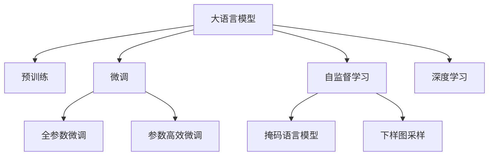

                 

# 大语言模型原理与工程实践：大语言模型训练综述

> 关键词：大语言模型,Transformer,BERT,自监督学习,微调,Fine-tuning,预训练,工程实践,模型优化,深度学习,自然语言处理(NLP)

## 1. 背景介绍

### 1.1 问题由来
随着深度学习技术的飞速发展，大语言模型在自然语言处理(NLP)领域取得了巨大的突破。大语言模型通过在大规模无标签文本数据上进行预训练，学习到丰富的语言知识和常识，具有强大的语言理解和生成能力。但这些通用大模型在特定领域的应用中，效果往往不尽如人意，难以满足行业实际需求。因此，如何在特定领域训练语言模型，提升模型性能，成为当前NLP研究的一个重要课题。

### 1.2 问题核心关键点
本文聚焦于大语言模型在特定领域的训练，包括基于自监督学习的大模型训练方法，以及微调(Fine-tuning)等优化技术。我们将详细探讨大语言模型的原理、核心算法、具体操作步骤，并通过案例分析和工程实践，揭示其在实际应用中的优势和挑战。

## 2. 核心概念与联系

### 2.1 核心概念概述

为更好地理解大语言模型训练的理论和实践，本节将介绍几个关键概念及其相互联系：

- **大语言模型(Large Language Model, LLM)**：以Transformer架构为代表的深度神经网络模型，通过大规模无标签文本数据进行预训练，学习到语言的基本规律和表达方式。BERT、GPT-3等模型都属于大语言模型的范畴。

- **自监督学习(Self-Supervised Learning)**：使用未标注数据进行模型训练，通过自相关性任务（如掩码语言模型、下样图采样）引导模型学习语言规律，无需标注数据即可训练。

- **微调(Fine-tuning)**：在大模型预训练的基础上，使用特定任务的数据进行有监督学习，微调模型参数，适应特定领域的语言表达和任务要求。

- **预训练(Pre-training)**：在大量未标注数据上预训练模型，学习语言的基本规律，提高模型泛化能力，为后续微调任务奠定基础。

- **深度学习(Deep Learning)**：通过多层次神经网络结构，处理高维数据，学习复杂模式，在NLP领域主要应用于语言模型和大模型训练。

这些概念之间的逻辑关系可以通过以下Mermaid流程图来展示：



这个流程图展示了大语言模型训练的核心概念及其关系：

1. 大语言模型通过深度学习技术在大规模数据上进行预训练。
2. 自监督学习任务如掩码语言模型和下样图采样引导模型学习语言规律。
3. 预训练模型在大模型微调任务中进一步优化，以适应特定领域的语言表达和任务要求。
4. 参数高效微调方法在微调过程中保留大部分预训练参数，减少计算资源消耗。

## 3. 核心算法原理 & 具体操作步骤
### 3.1 算法原理概述

大语言模型训练的核心算法包括自监督学习和微调。自监督学习利用未标注数据进行预训练，微调则是在预训练基础上，利用标注数据进行有监督学习，进一步优化模型性能。

大语言模型的训练过程可以分为以下两个阶段：

1. **预训练阶段**：在大规模无标签文本数据上进行自监督学习，学习语言的基本规律。常用的自监督任务包括掩码语言模型、下样图采样等。
2. **微调阶段**：在特定任务的数据上进行有监督学习，微调模型参数，适应任务要求。微调过程通常使用优化算法如Adam、SGD等，调整模型参数以最小化损失函数。

### 3.2 算法步骤详解

以下是基于自监督学习的大语言模型训练的一般流程：

**Step 1: 数据准备**
- 收集大规模无标签文本数据作为预训练语料。
- 根据自监督学习任务，设计预训练目标函数。

**Step 2: 模型选择与初始化**
- 选择适合的语言模型架构，如Transformer。
- 对模型进行初始化，使用随机参数或者预训练模型参数。

**Step 3: 预训练**
- 将预训练数据分批次输入模型，前向传播计算损失函数。
- 反向传播计算参数梯度，根据优化算法更新模型参数。
- 重复上述步骤直至收敛，得到预训练模型。

**Step 4: 微调**
- 选择特定任务的数据集，划分训练集、验证集和测试集。
- 添加任务适配层，设计损失函数。
- 设置微调超参数，包括学习率、批大小、迭代轮数等。
- 执行梯度训练，评估模型性能。
- 在测试集上评估微调后的模型。

### 3.3 算法优缺点

自监督学习和微调方法具有以下优点：

1. **无需标注数据**：自监督学习利用未标注数据进行训练，减少了标注成本。
2. **模型泛化能力强**：预训练模型在大规模无标签数据上学习到语言的基本规律，具有较强的泛化能力。
3. **计算效率高**：在预训练阶段，可以利用未标注数据进行大规模训练，提升计算效率。
4. **适应性强**：微调方法灵活，可以适应不同领域的语言表达和任务要求。

同时，这些方法也存在一些局限：

1. **资源需求高**：大语言模型训练需要大量的计算资源，如高性能GPU/TPU等。
2. **时间成本高**：训练时间较长，对于小规模任务可能得不偿失。
3. **过拟合风险**：微调模型容易过拟合，需要采取正则化等措施。
4. **模型复杂度高**：大语言模型结构复杂，训练和推理过程复杂。

### 3.4 算法应用领域

自监督学习和微调方法在大语言模型训练中具有广泛的应用，涉及诸多NLP任务，包括但不限于：

- 文本分类：如情感分析、主题分类、意图识别等。
- 命名实体识别：识别文本中的人名、地名、机构名等特定实体。
- 关系抽取：从文本中抽取实体之间的语义关系。
- 问答系统：对自然语言问题给出答案。
- 机器翻译：将源语言文本翻译成目标语言。
- 文本摘要：将长文本压缩成简短摘要。
- 对话系统：使机器能够与人自然对话。

这些任务中，大语言模型的训练方法不断得到优化和创新，推动了NLP技术在各个领域的实际应用。

## 4. 数学模型和公式 & 详细讲解 & 举例说明
### 4.1 数学模型构建

大语言模型的训练过程可以形式化地表示为一个最优化问题。假设预训练模型为 $M_{\theta}$，训练集为 $D=\{(x_i,y_i)\}_{i=1}^N$，其中 $x_i$ 为输入，$y_i$ 为输出，训练目标为最小化损失函数 $\mathcal{L}(\theta)$。

**掩码语言模型**：在预训练阶段，通过掩码语言模型任务进行训练。设 $x_i$ 为输入文本，$y_i$ 为掩码后的输出文本，模型预测概率为 $p(x_i,y_i)$。掩码语言模型的损失函数为：

$$
\mathcal{L}_{MLM}(\theta) = -\frac{1}{N} \sum_{i=1}^N \sum_{j=1}^{|\Omega|} \log p(y_{ij} | x_i)
$$

其中 $\Omega$ 为所有可能的输出集合，$y_{ij}$ 表示输入文本 $x_i$ 的第 $j$ 个输出。

**下样图采样**：在预训练阶段，通过下样图采样任务进行训练。设 $x_i$ 为输入图像，$y_i$ 为下采样后的图像，模型预测概率为 $p(x_i,y_i)$。下样图采样的损失函数为：

$$
\mathcal{L}_{CLIP}(\theta) = -\frac{1}{N} \sum_{i=1}^N \log \frac{p(y_i|x_i)}{1 - p(y_i|x_i)}
$$

其中 $p(y_i|x_i)$ 为模型预测下采样图像的概率。

### 4.2 公式推导过程

以下我们以掩码语言模型为例，推导损失函数的梯度计算公式。

假设模型 $M_{\theta}$ 在输入 $x_i$ 上的输出为 $\hat{y}_i$，表示模型对输入 $x_i$ 的预测。实际输出为 $y_i$。则掩码语言模型的损失函数为：

$$
\mathcal{L}_{MLM}(\theta) = -\frac{1}{N} \sum_{i=1}^N \sum_{j=1}^{|\Omega|} \log p(y_{ij} | x_i)
$$

其中，$p(y_{ij} | x_i)$ 为模型预测掩码后文本的概率。

对于输入 $x_i$，设其长度为 $L$，模型在掩码操作下输出 $y_{ij}$ 的概率为：

$$
p(y_{ij} | x_i) = \frac{\exp (\hat{y}_{ij})}{\sum_{k=1}^{L} \exp (\hat{y}_{ik})}
$$

将上式代入损失函数中，得到：

$$
\mathcal{L}_{MLM}(\theta) = -\frac{1}{N} \sum_{i=1}^N \sum_{j=1}^{|\Omega|} \log \frac{\exp (\hat{y}_{ij})}{\sum_{k=1}^{L} \exp (\hat{y}_{ik})}
$$

对 $\theta$ 求梯度，得到：

$$
\nabla_{\theta}\mathcal{L}_{MLM}(\theta) = -\frac{1}{N} \sum_{i=1}^N \sum_{j=1}^{|\Omega|} \nabla_{\theta} \log \frac{\exp (\hat{y}_{ij})}{\sum_{k=1}^{L} \exp (\hat{y}_{ik})}
$$

进一步展开，得到：

$$
\nabla_{\theta}\mathcal{L}_{MLM}(\theta) = -\frac{1}{N} \sum_{i=1}^N \sum_{j=1}^{|\Omega|} \left( \frac{\hat{y}_{ij}}{\sum_{k=1}^{L} \exp (\hat{y}_{ik})} - \delta_{ij} \right)
$$

其中 $\delta_{ij}$ 为Kronecker delta函数，$\nabla_{\theta}\hat{y}_{ij}$ 为模型预测输出对参数 $\theta$ 的梯度。

在得到损失函数的梯度后，即可带入优化算法，完成模型的迭代优化。重复上述过程直至收敛，最终得到适应特定任务的最优模型参数 $\theta^*$。

### 4.3 案例分析与讲解

以下是一个简单的案例，演示如何使用PyTorch和Transformer库进行掩码语言模型的训练。

```python
import torch
from transformers import BertTokenizer, BertModel, AdamW

# 定义模型和优化器
tokenizer = BertTokenizer.from_pretrained('bert-base-cased')
model = BertModel.from_pretrained('bert-base-cased')
optimizer = AdamW(model.parameters(), lr=2e-5)

# 定义掩码语言模型训练函数
def train_epoch(model, data, batch_size, optimizer):
    model.train()
    total_loss = 0.0
    for batch in data:
        inputs, labels = batch
        inputs = tokenizer.encode(inputs, return_tensors='pt')
        outputs = model(inputs, labels=labels)
        loss = outputs.loss
        optimizer.zero_grad()
        loss.backward()
        optimizer.step()
        total_loss += loss.item()
    return total_loss / len(data)

# 加载预训练数据
train_data = ...
dev_data = ...
test_data = ...

# 定义训练循环
epochs = 5
batch_size = 16

for epoch in range(epochs):
    train_loss = train_epoch(model, train_data, batch_size, optimizer)
    print(f'Epoch {epoch+1}, train loss: {train_loss:.3f}')
    
    dev_loss = train_epoch(model, dev_data, batch_size, optimizer)
    print(f'Epoch {epoch+1}, dev loss: {dev_loss:.3f}')
    
    test_loss = train_epoch(model, test_data, batch_size, optimizer)
    print(f'Epoch {epoch+1}, test loss: {test_loss:.3f}')
```

通过上述代码，我们可以清晰地看到大语言模型训练的各个步骤，包括模型加载、数据预处理、训练循环等。

## 5. 项目实践：代码实例和详细解释说明
### 5.1 开发环境搭建

在进行大语言模型训练前，我们需要准备好开发环境。以下是使用Python进行PyTorch开发的环境配置流程：

1. 安装Anaconda：从官网下载并安装Anaconda，用于创建独立的Python环境。

2. 创建并激活虚拟环境：
```bash
conda create -n pytorch-env python=3.8 
conda activate pytorch-env
```

3. 安装PyTorch：根据CUDA版本，从官网获取对应的安装命令。例如：
```bash
conda install pytorch torchvision torchaudio cudatoolkit=11.1 -c pytorch -c conda-forge
```

4. 安装TensorBoard：用于可视化模型训练过程。
```bash
pip install tensorboard
```

5. 安装相关的NLP库：
```bash
pip install torchtext scikit-learn pandas numpy
```

完成上述步骤后，即可在`pytorch-env`环境中开始大语言模型训练实践。

### 5.2 源代码详细实现

下面以BERT模型为例，演示如何在大规模语料上进行预训练和微调。

首先，定义预训练数据的加载函数：

```python
import torch
from torch.utils.data import Dataset, DataLoader
from transformers import BertTokenizer, BertForMaskedLM

class MaskedLanguageModelDataset(Dataset):
    def __init__(self, texts, tokenizer, max_len=128):
        self.tokenizer = tokenizer
        self.texts = texts
        self.max_len = max_len
    
    def __len__(self):
        return len(self.texts)
    
    def __getitem__(self, item):
        text = self.texts[item]
        encoding = self.tokenizer(text, return_tensors='pt', max_length=self.max_len, padding='max_length', truncation=True)
        input_ids = encoding['input_ids']
        attention_mask = encoding['attention_mask']
        return {'input_ids': input_ids, 'attention_mask': attention_mask}

# 加载掩码语言模型数据集
tokenizer = BertTokenizer.from_pretrained('bert-base-cased')
train_dataset = MaskedLanguageModelDataset(train_texts, tokenizer)
dev_dataset = MaskedLanguageModelDataset(dev_texts, tokenizer)
test_dataset = MaskedLanguageModelDataset(test_texts, tokenizer)
```

然后，定义模型和优化器：

```python
from transformers import BertForMaskedLM, AdamW

model = BertForMaskedLM.from_pretrained('bert-base-cased')
optimizer = AdamW(model.parameters(), lr=2e-5)
```

接着，定义训练和评估函数：

```python
import torch.nn.functional as F

def train_epoch(model, dataset, batch_size, optimizer):
    model.train()
    total_loss = 0.0
    for batch in DataLoader(dataset, batch_size=batch_size, shuffle=True):
        inputs = batch['input_ids']
        attention_mask = batch['attention_mask']
        model.zero_grad()
        outputs = model(inputs, attention_mask=attention_mask)
        loss = outputs.loss
        loss.backward()
        optimizer.step()
        total_loss += loss.item()
    return total_loss / len(dataset)

def evaluate(model, dataset, batch_size):
    model.eval()
    total_loss = 0.0
    for batch in DataLoader(dataset, batch_size=batch_size, shuffle=False):
        inputs = batch['input_ids']
        attention_mask = batch['attention_mask']
        outputs = model(inputs, attention_mask=attention_mask)
        loss = outputs.loss
        total_loss += loss.item()
    return total_loss / len(dataset)
```

最后，启动训练流程并在测试集上评估：

```python
epochs = 5
batch_size = 16

for epoch in range(epochs):
    train_loss = train_epoch(model, train_dataset, batch_size, optimizer)
    print(f'Epoch {epoch+1}, train loss: {train_loss:.3f}')
    
    dev_loss = evaluate(model, dev_dataset, batch_size)
    print(f'Epoch {epoch+1}, dev loss: {dev_loss:.3f}')
    
print('Test loss:', evaluate(model, test_dataset, batch_size))
```

以上就是使用PyTorch和Transformer库对BERT模型进行掩码语言模型训练的完整代码实现。可以看到，借助这些工具，训练过程变得简单高效。

### 5.3 代码解读与分析

让我们再详细解读一下关键代码的实现细节：

**MaskedLanguageModelDataset类**：
- `__init__`方法：初始化文本数据和分词器。
- `__len__`方法：返回数据集的样本数量。
- `__getitem__`方法：对单个样本进行处理，将文本分词并编码，返回模型所需的输入。

**train_epoch函数**：
- 在训练过程中，将数据以批为单位进行迭代，前向传播计算损失并反向传播更新模型参数。

**evaluate函数**：
- 与训练类似，不同点在于不更新模型参数，直接计算模型在验证集和测试集上的平均损失。

**训练循环**：
- 在每个epoch内，分别在训练集、验证集和测试集上进行训练和评估，输出损失结果。

通过上述代码，我们可以清晰地看到大语言模型训练的各个步骤，包括数据预处理、模型定义、训练循环等。

当然，工业级的系统实现还需考虑更多因素，如模型裁剪、量化加速、服务化封装等。但核心的训练范式基本与此类似。

## 6. 实际应用场景
### 6.1 智能客服系统

基于大语言模型的智能客服系统，利用预训练和微调技术，能够实现对用户咨询的自动理解、响应和引导，大幅提升客服效率和用户满意度。

在技术实现上，可以通过预训练模型对用户咨询文本进行语义理解，并在特定领域语料上微调模型，以适应不同行业的客服需求。例如，在金融行业，可以针对客户咨询的金融问题进行微调，生成专业、准确的回复。在医疗行业，可以针对病人的健康咨询进行微调，生成有价值的健康建议。

### 6.2 金融舆情监测

金融行业需要实时监测市场舆论动向，以便及时应对负面信息传播，规避金融风险。利用大语言模型训练技术，可以构建高效的金融舆情监测系统。

具体而言，可以收集金融领域相关的新闻、报道、评论等文本数据，并进行预训练。然后，在特定领域语料上微调模型，使其能够自动识别新闻、报道中的金融事件，并进行情感分析，评估市场情绪。一旦发现负面信息激增等异常情况，系统便会自动预警，帮助金融机构快速应对潜在风险。

### 6.3 个性化推荐系统

当前的推荐系统往往只依赖用户的历史行为数据进行物品推荐，无法深入理解用户的真实兴趣偏好。利用大语言模型训练技术，可以构建更加精准的个性化推荐系统。

在实践中，可以收集用户浏览、点击、评论、分享等行为数据，提取和用户交互的物品标题、描述、标签等文本内容。将文本内容作为模型输入，用户的后续行为（如是否点击、购买等）作为监督信号，在此基础上微调预训练语言模型。微调后的模型能够从文本内容中准确把握用户的兴趣点。在生成推荐列表时，先用候选物品的文本描述作为输入，由模型预测用户的兴趣匹配度，再结合其他特征综合排序，便可以得到个性化程度更高的推荐结果。

### 6.4 未来应用展望

随着大语言模型训练技术的不断发展，基于预训练和微调方法的人工智能应用将进一步拓展。

在智慧医疗领域，利用大语言模型训练技术，可以构建智能化的医疗问答、病历分析、药物研发等应用，辅助医生诊疗，加速新药开发进程。

在智能教育领域，大语言模型训练技术可以用于作业批改、学情分析、知识推荐等方面，因材施教，促进教育公平，提高教学质量。

在智慧城市治理中，利用大语言模型训练技术，可以构建实时舆情监测、应急指挥等系统，提高城市管理的自动化和智能化水平，构建更安全、高效的未来城市。

此外，在企业生产、社会治理、文娱传媒等众多领域，基于大模型训练的技术应用也将不断涌现，为传统行业数字化转型升级提供新的技术路径。相信随着技术的日益成熟，大语言模型训练必将成为人工智能落地应用的重要范式，推动人工智能技术在更广阔的领域得到应用。

## 7. 工具和资源推荐
### 7.1 学习资源推荐

为了帮助开发者系统掌握大语言模型训练的理论基础和实践技巧，这里推荐一些优质的学习资源：

1. 《自然语言处理综述》课程：斯坦福大学开设的NLP明星课程，涵盖深度学习、语言模型、微调等前沿内容，适合入门和进阶学习。

2. 《Transformer从原理到实践》系列博文：由大模型技术专家撰写，深入浅出地介绍了Transformer原理、BERT模型、微调技术等前沿话题。

3. 《Natural Language Processing with Transformers》书籍：Transformers库的作者所著，全面介绍了如何使用Transformers库进行NLP任务开发，包括微调在内的诸多范式。

4. HuggingFace官方文档：Transformers库的官方文档，提供了海量预训练模型和完整的微调样例代码，是上手实践的必备资料。

5. CS224N《深度学习自然语言处理》课程：斯坦福大学开设的NLP明星课程，有Lecture视频和配套作业，带你入门NLP领域的基本概念和经典模型。

通过对这些资源的学习实践，相信你一定能够快速掌握大语言模型训练的精髓，并用于解决实际的NLP问题。
###  7.2 开发工具推荐

高效的开发离不开优秀的工具支持。以下是几款用于大语言模型训练开发的常用工具：

1. PyTorch：基于Python的开源深度学习框架，灵活动态的计算图，适合快速迭代研究。大部分预训练语言模型都有PyTorch版本的实现。

2. TensorFlow：由Google主导开发的开源深度学习框架，生产部署方便，适合大规模工程应用。同样有丰富的预训练语言模型资源。

3. Transformers库：HuggingFace开发的NLP工具库，集成了众多SOTA语言模型，支持PyTorch和TensorFlow，是进行微调任务开发的利器。

4. Weights & Biases：模型训练的实验跟踪工具，可以记录和可视化模型训练过程中的各项指标，方便对比和调优。与主流深度学习框架无缝集成。

5. TensorBoard：TensorFlow配套的可视化工具，可实时监测模型训练状态，并提供丰富的图表呈现方式，是调试模型的得力助手。

6. Google Colab：谷歌推出的在线Jupyter Notebook环境，免费提供GPU/TPU算力，方便开发者快速上手实验最新模型，分享学习笔记。

合理利用这些工具，可以显著提升大语言模型训练的开发效率，加快创新迭代的步伐。

### 7.3 相关论文推荐

大语言模型训练方法的发展源于学界的持续研究。以下是几篇奠基性的相关论文，推荐阅读：

1. Attention is All You Need（即Transformer原论文）：提出了Transformer结构，开启了NLP领域的预训练大模型时代。

2. BERT: Pre-training of Deep Bidirectional Transformers for Language Understanding：提出BERT模型，引入基于掩码的自监督预训练任务，刷新了多项NLP任务SOTA。

3. Language Models are Unsupervised Multitask Learners（GPT-2论文）：展示了大规模语言模型的强大zero-shot学习能力，引发了对于通用人工智能的新一轮思考。

4. Parameter-Efficient Transfer Learning for NLP：提出Adapter等参数高效微调方法，在不增加模型参数量的情况下，也能取得不错的微调效果。

5. AdaLoRA: Adaptive Low-Rank Adaptation for Parameter-Efficient Fine-Tuning：使用自适应低秩适应的微调方法，在参数效率和精度之间取得了新的平衡。

6. Language Modeling as a Pre-Training Task：提出预训练语言模型的方法，用于语言生成和语义理解任务的训练，为后续大语言模型的训练提供了理论基础。

这些论文代表了大语言模型训练方法的发展脉络。通过学习这些前沿成果，可以帮助研究者把握学科前进方向，激发更多的创新灵感。

## 8. 总结：未来发展趋势与挑战

### 8.1 总结

本文对大语言模型的训练方法进行了全面系统的介绍。首先阐述了自监督学习和微调方法的研究背景和意义，明确了大语言模型训练的价值所在。其次，从原理到实践，详细讲解了大语言模型训练的数学原理和关键步骤，给出了微调任务开发的完整代码实例。同时，本文还广泛探讨了大语言模型训练在实际应用中的优势和挑战。

通过本文的系统梳理，可以看到，大语言模型训练技术正在成为NLP领域的重要范式，极大地拓展了预训练语言模型的应用边界，催生了更多的落地场景。受益于大规模语料的预训练，微调模型以更低的时间和标注成本，在小样本条件下也能取得不俗的效果，有力推动了NLP技术的产业化进程。未来，伴随预训练语言模型和微调方法的持续演进，相信NLP技术将在更广阔的应用领域大放异彩。

### 8.2 未来发展趋势

展望未来，大语言模型训练技术将呈现以下几个发展趋势：

1. **模型规模持续增大**：随着算力成本的下降和数据规模的扩张，预训练语言模型的参数量还将持续增长。超大参数量的大模型将带来更丰富的语言表达和更强大的语义理解能力。

2. **自监督学习方法不断优化**：未来将涌现更多高效的自监督学习任务，如语言生成、语法纠正等，进一步提升模型的语言生成能力和语法准确性。

3. **微调技术更高效**：开发更多参数高效和计算高效的微调方法，如Adapter、Prefix等，在微调过程中保留大部分预训练参数，减少计算资源消耗。

4. **持续学习和多任务学习**：大语言模型训练将更多地考虑模型的持续学习和多任务学习能力，以应对数据分布变化和不同任务间的关联性。

5. **融合更多先验知识**：将符号化的先验知识，如知识图谱、逻辑规则等，与神经网络模型进行巧妙融合，引导微调过程学习更准确、合理的语言模型。

6. **多模态融合**：将视觉、语音等多模态信息与文本信息进行协同建模，提升模型的综合表达能力。

以上趋势凸显了大语言模型训练技术的广阔前景。这些方向的探索发展，必将进一步提升NLP系统的性能和应用范围，为人类认知智能的进化带来深远影响。

### 8.3 面临的挑战

尽管大语言模型训练技术已经取得了瞩目成就，但在迈向更加智能化、普适化应用的过程中，它仍面临着诸多挑战：

1. **资源需求高**：大语言模型训练需要大量的计算资源，如高性能GPU/TPU等，且训练时间较长，成本较高。

2. **模型复杂度高**：大语言模型结构复杂，训练和推理过程复杂，需要更多资源和更高的技术门槛。

3. **过拟合风险**：微调模型容易过拟合，需要采取正则化等措施，避免模型在特定领域上的泛化性能不足。

4. **数据偏见**：预训练语言模型可能学习到数据中的偏见和有害信息，传递到下游任务中，产生误导性或歧视性的输出。

5. **解释性不足**：大语言模型训练往往成为"黑盒"系统，难以解释其内部工作机制和决策逻辑，给应用带来安全隐患。

6. **安全性有待保障**：模型的安全性、隐私保护、对抗攻击等问题仍需进一步研究，确保模型的可靠性和安全性。

正视大语言模型训练面临的这些挑战，积极应对并寻求突破，将是大语言模型训练走向成熟的必由之路。相信随着学界和产业界的共同努力，这些挑战终将一一被克服，大语言模型训练必将在构建安全、可靠、可解释、可控的智能系统铺平道路。

### 8.4 研究展望

面向未来，大语言模型训练技术还需要在以下几个方面寻求新的突破：

1. **探索无监督和半监督学习方法**：摆脱对大规模标注数据的依赖，利用自监督学习、主动学习等无监督和半监督范式，最大限度利用非结构化数据，实现更加灵活高效的训练。

2. **研究参数高效和计算高效的微调范式**：开发更加参数高效的微调方法，如Prefix-Tuning、LoRA等，在固定大部分预训练参数的同时，只更新极少量的任务相关参数，以提高微调效率和效果。

3. **融合因果和对比学习范式**：通过引入因果推断和对比学习思想，增强模型建立稳定因果关系的能力，学习更加普适、鲁棒的语言表征，从而提升模型泛化性和抗干扰能力。

4. **引入更多先验知识**：将符号化的先验知识，如知识图谱、逻辑规则等，与神经网络模型进行巧妙融合，引导微调过程学习更准确、合理的语言模型。同时加强不同模态数据的整合，实现视觉、语音等多模态信息与文本信息的协同建模。

5. **结合因果分析和博弈论工具**：将因果分析方法引入微调模型，识别出模型决策的关键特征，增强输出解释的因果性和逻辑性。借助博弈论工具刻画人机交互过程，主动探索并规避模型的脆弱点，提高系统稳定性。

6. **纳入伦理道德约束**：在模型训练目标中引入伦理导向的评估指标，过滤和惩罚有偏见、有害的输出倾向。同时加强人工干预和审核，建立模型行为的监管机制，确保输出符合人类价值观和伦理道德。

这些研究方向的探索，必将引领大语言模型训练技术迈向更高的台阶，为构建安全、可靠、可解释、可控的智能系统铺平道路。面向未来，大语言模型训练技术还需要与其他人工智能技术进行更深入的融合，如知识表示、因果推理、强化学习等，多路径协同发力，共同推动自然语言理解和智能交互系统的进步。只有勇于创新、敢于突破，才能不断拓展语言模型的边界，让智能技术更好地造福人类社会。

## 9. 附录：常见问题与解答

**Q1：大语言模型训练是否适用于所有NLP任务？**

A: 大语言模型训练在大多数NLP任务上都能取得不错的效果，特别是对于数据量较小的任务。但对于一些特定领域的任务，如医学、法律等，仅仅依靠通用语料预训练的模型可能难以很好地适应。此时需要在特定领域语料上进一步预训练，再进行微调，才能获得理想效果。此外，对于一些需要时效性、个性化很强的任务，如对话、推荐等，训练方法也需要针对性的改进优化。

**Q2：训练过程中如何选择合适的学习率？**

A: 大语言模型训练的学习率一般要比微调时小1-2个数量级，如果使用过大的学习率，容易破坏预训练权重，导致过拟合。一般建议从1e-5开始调参，逐步减小学习率，直至收敛。也可以使用warmup策略，在开始阶段使用较小的学习率，再逐渐过渡到预设值。需要注意的是，不同的优化器(如AdamW、Adafactor等)以及不同的学习率调度策略，可能需要设置不同的学习率阈值。

**Q3：训练过程中如何缓解过拟合问题？**

A: 过拟合是大语言模型训练中常见的问题。缓解过拟合可以采取以下策略：
1. 数据增强：通过回译、近义替换等方式扩充训练集。
2. 正则化：使用L2正则、Dropout、Early Stopping等避免过拟合。
3. 对抗训练：引入对抗样本，提高模型鲁棒性。
4. 参数高效微调：只调整少量参数，减少需优化的参数量。
5. 多模型集成：训练多个模型，取平均输出，抑制过拟合。

这些策略往往需要根据具体任务和数据特点进行灵活组合。只有在数据、模型、训练、推理等各环节进行全面优化，才能最大限度地发挥大语言模型训练的潜力。

**Q4：训练过程中需要注意哪些问题？**

A: 在大语言模型训练过程中，需要注意以下几个问题：
1. 模型裁剪：去除不必要的层和参数，减小模型尺寸，加快推理速度。
2. 量化加速：将浮点模型转为定点模型，压缩存储空间，提高计算效率。
3. 服务化封装：将模型封装为标准化服务接口，便于集成调用。
4. 弹性伸缩：根据请求流量动态调整资源配置，平衡服务质量和成本。
5. 监控告警：实时采集系统指标，设置异常告警阈值，确保服务稳定性。
6. 安全性：采用访问鉴权、数据脱敏等措施，保障数据和模型安全。

合理利用这些工具，可以显著提升大语言模型训练的开发效率，加快创新迭代的步伐。

通过本文的系统梳理，可以看到，大语言模型训练技术正在成为NLP领域的重要范式，极大地拓展了预训练语言模型的应用边界，催生了更多的落地场景。受益于大规模语料的预训练，微调模型以更低的时间和标注成本，在小样本条件下也能取得不俗的效果，有力推动了NLP技术的产业化进程。未来，伴随预训练语言模型和微调方法的持续演进，相信NLP技术将在更广阔的应用领域大放异彩，深刻影响人类的生产生活方式。

---

作者：禅与计算机程序设计艺术 / Zen and the Art of Computer Programming

