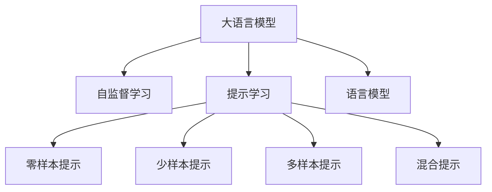

                 

# 大语言模型原理与工程实践：思维链提示

> 关键词：大语言模型,提示学习,思维链,自然语言处理(NLP),Prompt Engineering,自监督学习,语言模型

## 1. 背景介绍

### 1.1 问题由来
近年来，深度学习技术在自然语言处理（NLP）领域取得了飞速发展。然而，尽管大模型在预训练和微调上取得了显著进展，但它们在处理复杂推理和生成任务时，常常因缺乏足够的背景知识或上下文信息而表现欠佳。传统的大模型依赖于海量的未标注数据进行预训练，但在特定任务上，这些模型往往难以充分理解任务的背景，无法进行有效的推理和生成。

为了解决这一问题，提示学习（Prompt Learning）方法应运而生。提示学习通过精心设计的输入文本，引导大模型按照预期的方式输出，从而实现零样本学习或少样本学习，显著提升模型的生成能力和推理性能。这种技术不仅能够利用预训练模型的强大能力，还能有效减轻对标注数据的依赖，提高模型的泛化能力。

### 1.2 问题核心关键点
提示学习的核心在于如何设计有效的提示（Prompt），使其能够最大化地引导大语言模型进行正确的推理和生成。提示学习可以分为以下几类：

1. **零样本提示（Zero-shot Prompting）**：不提供任何示例，仅通过任务描述生成答案或推理过程。
2. **少样本提示（Few-shot Prompting）**：提供少量示例，通过对比和归纳学习新任务。
3. **多样本提示（Many-shot Prompting）**：提供大量示例，通过大量数据训练模型。
4. **混合提示（Mixed Prompting）**：结合零样本和少样本提示，提升模型的灵活性和适应性。

提示学习通过精心设计的提示文本，使得大模型能够更好地理解任务，提高生成质量和推理准确性。在实际应用中，提示学习的表现往往取决于提示设计的技巧和深度。

### 1.3 问题研究意义
提示学习在大语言模型中的应用，对于提升模型的推理和生成能力，减少对标注数据的依赖，加速NLP技术的落地应用具有重要意义：

1. **提升模型性能**：通过提示学习，模型能够在少样本甚至零样本的情况下，依然保持较高的性能。这对于数据稀缺的任务，如法律咨询、医疗诊断等具有重要意义。
2. **降低标注成本**：传统微调方法需要大量标注数据，提示学习则可以通过精心的提示设计，实现少样本甚至无样本学习，大幅降低标注成本。
3. **加速技术创新**：提示学习提供了新的研究方向，使得研究者能够从数据设计、模型结构、任务描述等多个角度进行创新，推动NLP技术的进步。
4. **增强模型的泛化能力**：提示学习使模型能够更好地适应不同的数据分布，提高模型的泛化能力和鲁棒性。

## 2. 核心概念与联系

### 2.1 核心概念概述

为了更好地理解提示学习，本节将介绍几个密切相关的核心概念：

- **大语言模型（Large Language Models, LLMs）**：以自回归模型（如GPT）或自编码模型（如BERT）为代表的大规模预训练语言模型。通过在大规模无标签文本语料上进行预训练，学习到通用的语言表示。

- **提示（Prompt）**：输入到模型中的文本片段，用于引导模型的推理和生成行为。提示可以包含问题、示例、上下文等信息，设计良好的提示能够显著提升模型的性能。

- **提示学习（Prompt Learning）**：通过设计提示来引导大语言模型进行特定任务的推理和生成，通常不需要更新模型参数，仅通过提示设计即可实现任务适配。

- **自监督学习（Self-Supervised Learning）**：利用未标注数据，通过设计自监督任务来训练模型，使其学习到数据的分布和规律。

- **语言模型（Language Model）**：用于预测序列中下一个单词或符号的概率分布，是NLP中的基本模型。

这些核心概念之间的逻辑关系可以通过以下Mermaid流程图来展示：



这个流程图展示了大语言模型的核心概念及其之间的关系：

1. 大语言模型通过自监督学习获得基础能力。
2. 提示学习是连接预训练模型与下游任务的桥梁，通过提示设计实现任务适配。
3. 自监督学习通过未标注数据训练语言模型，为其后续微调和提示学习提供基础能力。
4. 语言模型是提示学习和自监督学习的工具，用于计算序列概率，优化提示设计。

这些概念共同构成了大语言模型的学习和应用框架，使其能够在各种场景下发挥强大的语言理解和生成能力。通过理解这些核心概念，我们可以更好地把握大语言模型的工作原理和优化方向。

## 3. 核心算法原理 & 具体操作步骤
### 3.1 算法原理概述

提示学习的核心思想是通过精心设计的提示，引导大语言模型进行特定任务的推理和生成。其核心在于如何设计有效的提示，使得模型能够从提示中提取任务相关的信息，进行正确的推理和生成。

形式化地，假设预训练语言模型为 $M_{\theta}$，其中 $\theta$ 为预训练得到的模型参数。给定下游任务 $T$ 的输入文本 $p$ 和输出文本 $y$，提示学习的目标是最小化模型预测输出与真实标签之间的差异。

通过梯度下降等优化算法，提示学习过程不断更新提示文本 $p$，最小化损失函数 $\mathcal{L}(p)$，使得模型输出逼近真实标签。由于 $\theta$ 已经通过预训练获得了较好的初始化，因此即使在没有标注数据的情况下，也可以快速收敛到理想的提示设计 $\hat{p}$。

### 3.2 算法步骤详解

提示学习的核心步骤包括以下几个关键步骤：

**Step 1: 准备预训练模型和任务描述**

- 选择合适的预训练语言模型 $M_{\theta}$ 作为初始化参数，如 BERT、GPT 等。
- 根据下游任务类型，设计适合的提示模板 $p$。提示模板通常包含问题、示例、上下文等，用于引导模型推理和生成。

**Step 2: 生成提示文本**

- 根据任务描述，构造提示文本 $p$。提示文本可以是问题、示例、提示词等，用于引导模型进行推理和生成。
- 使用预训练语言模型 $M_{\theta}$ 对提示文本进行编码，生成表示向量。

**Step 3: 设计任务损失函数**

- 根据下游任务的性质，设计相应的损失函数。例如，分类任务通常使用交叉熵损失，生成任务则使用负对数似然损失等。
- 根据提示文本和任务描述，计算模型输出与真实标签之间的差异。

**Step 4: 优化提示文本**

- 使用梯度下降等优化算法，不断调整提示文本 $p$，最小化损失函数 $\mathcal{L}(p)$。
- 周期性在验证集上评估提示文本性能，根据性能指标决定是否更新提示文本。

**Step 5: 应用提示文本**

- 将优化后的提示文本 $p$ 应用到新的输入文本上，使用预训练语言模型生成输出。
- 测试模型在特定任务上的性能，对比提示前后的效果。

以上是提示学习的基本流程，在实际应用中，还需要针对具体任务的特点，对提示设计进行优化设计，如改进任务描述，引入更多的正则化技术，搜索最优的超参数组合等，以进一步提升模型性能。

### 3.3 算法优缺点

提示学习的优点在于：

1. 简单高效。提示设计不需要对模型进行微调，仅需设计良好的提示即可。
2. 泛化能力强。提示学习可以在少样本甚至零样本的情况下，实现对新任务的快速适配。
3. 灵活性高。提示可以灵活设计，适用于多种类型的NLP任务。
4. 效果显著。提示学习在多个NLP任务上取得了不俗的效果，如问答、生成、翻译等。

提示学习的缺点在于：

1. 提示设计难度大。设计好的提示需要根据具体任务进行精心设计，且可能存在多解。
2. 依赖提示质量。提示质量直接影响模型性能，低质量的提示可能导致模型输出错误。
3. 提示过拟合风险。提示可能包含任务特定的信息，过度依赖可能导致提示泛化能力下降。

尽管存在这些局限性，但提示学习在大语言模型中的应用，无疑为模型推理和生成能力的提升提供了新的方向，值得进一步研究和推广。

### 3.4 算法应用领域

提示学习在大语言模型中的应用，已经广泛地应用于多种NLP任务中，例如：

- **问答系统**：通过对问题-答案对进行编码，设计提示引导模型生成答案。
- **文本生成**：通过设计提示模板，引导模型生成符合特定格式的文本，如新闻摘要、技术文档等。
- **翻译**：通过设计提示模板，指导模型进行翻译。
- **对话系统**：通过设计对话上下文和任务描述，引导模型进行多轮对话。
- **文本摘要**：通过设计提示模板，指导模型生成文本摘要。
- **文本分类**：通过设计提示模板，引导模型进行分类。

除了上述这些经典任务外，提示学习还被创新性地应用到更多场景中，如代码生成、知识推理、数据分析等，为NLP技术带来了全新的突破。随着预训练模型和提示学习方法的不断进步，相信NLP技术将在更广阔的应用领域大放异彩。

## 4. 数学模型和公式 & 详细讲解  
### 4.1 数学模型构建

本节将使用数学语言对提示学习的数学原理进行更加严格的刻画。

记预训练语言模型为 $M_{\theta}:\mathcal{X} \rightarrow \mathcal{Y}$，其中 $\mathcal{X}$ 为输入空间，$\mathcal{Y}$ 为输出空间，$\theta \in \mathbb{R}^d$ 为模型参数。假设下游任务 $T$ 的输入文本为 $p$，真实标签为 $y$。

定义模型 $M_{\theta}$ 在提示文本 $p$ 上的输出为 $\hat{y}=M_{\theta}(p) \in [0,1]$，表示模型预测的输出概率。真实标签 $y \in \{0,1\}$。则提示学习的损失函数定义为：

$$
\mathcal{L}(p,y) = -[y\log \hat{y} + (1-y)\log (1-\hat{y})]
$$

在提示文本优化目标是最小化损失函数 $\mathcal{L}(p)$，即找到最优提示文本 $p^*$：

$$
p^* = \mathop{\arg\min}_{p} \mathcal{L}(p)
$$

在实践中，我们通常使用基于梯度的优化算法（如SGD、Adam等）来近似求解上述最优化问题。设 $\eta$ 为学习率，则提示文本的更新公式为：

$$
p \leftarrow p - \eta \nabla_{p}\mathcal{L}(p)
$$

其中 $\nabla_{p}\mathcal{L}(p)$ 为损失函数对提示文本 $p$ 的梯度，可通过反向传播算法高效计算。

### 4.2 公式推导过程

以下我们以分类任务为例，推导提示损失函数及其梯度的计算公式。

假设模型 $M_{\theta}$ 在提示文本 $p$ 上的输出为 $\hat{y}=M_{\theta}(p) \in [0,1]$，表示模型预测的输出概率。真实标签 $y \in \{0,1\}$。则二分类交叉熵损失函数定义为：

$$
\mathcal{L}(p,y) = -[y\log \hat{y} + (1-y)\log (1-\hat{y})]
$$

将其代入提示文本优化目标，得：

$$
\mathcal{L}(p) = -\frac{1}{N}\sum_{i=1}^N [y_i\log M_{\theta}(p_i)+(1-y_i)\log(1-M_{\theta}(p_i))]
$$

根据链式法则，损失函数对提示文本 $p$ 的梯度为：

$$
\frac{\partial \mathcal{L}(p)}{\partial p} = -\frac{1}{N}\sum_{i=1}^N (\frac{y_i}{M_{\theta}(p_i)}-\frac{1-y_i}{1-M_{\theta}(p_i)}) \frac{\partial M_{\theta}(p_i)}{\partial p}
$$

其中 $\frac{\partial M_{\theta}(p_i)}{\partial p}$ 可进一步递归展开，利用自动微分技术完成计算。

在得到损失函数的梯度后，即可带入提示文本更新公式，完成提示文本的迭代优化。重复上述过程直至收敛，最终得到适应下游任务的最优提示文本 $p^*$。

## 5. 项目实践：代码实例和详细解释说明
### 5.1 开发环境搭建

在进行提示学习实践前，我们需要准备好开发环境。以下是使用Python进行PyTorch开发的环境配置流程：

1. 安装Anaconda：从官网下载并安装Anaconda，用于创建独立的Python环境。

2. 创建并激活虚拟环境：
```bash
conda create -n pytorch-env python=3.8 
conda activate pytorch-env
```

3. 安装PyTorch：根据CUDA版本，从官网获取对应的安装命令。例如：
```bash
conda install pytorch torchvision torchaudio cudatoolkit=11.1 -c pytorch -c conda-forge
```

4. 安装Transformers库：
```bash
pip install transformers
```

5. 安装各类工具包：
```bash
pip install numpy pandas scikit-learn matplotlib tqdm jupyter notebook ipython
```

完成上述步骤后，即可在`pytorch-env`环境中开始提示学习实践。

### 5.2 源代码详细实现

下面我们以文本分类任务为例，给出使用Transformers库对BERT模型进行提示学习的PyTorch代码实现。

首先，定义文本分类任务的数据处理函数：

```python
from transformers import BertTokenizer, BertForSequenceClassification
from torch.utils.data import Dataset
import torch

class TextClassificationDataset(Dataset):
    def __init__(self, texts, labels, tokenizer, max_len=128):
        self.texts = texts
        self.labels = labels
        self.tokenizer = tokenizer
        self.max_len = max_len
        
    def __len__(self):
        return len(self.texts)
    
    def __getitem__(self, item):
        text = self.texts[item]
        label = self.labels[item]
        
        encoding = self.tokenizer(text, return_tensors='pt', max_length=self.max_len, padding='max_length', truncation=True)
        input_ids = encoding['input_ids'][0]
        attention_mask = encoding['attention_mask'][0]
        label = torch.tensor(label, dtype=torch.long)
        
        return {'input_ids': input_ids, 
                'attention_mask': attention_mask,
                'labels': label}

# 标签与id的映射
label2id = {'negative': 0, 'positive': 1}
id2label = {v: k for k, v in label2id.items()}

# 创建dataset
tokenizer = BertTokenizer.from_pretrained('bert-base-cased')

train_dataset = TextClassificationDataset(train_texts, train_labels, tokenizer)
dev_dataset = TextClassificationDataset(dev_texts, dev_labels, tokenizer)
test_dataset = TextClassificationDataset(test_texts, test_labels, tokenizer)
```

然后，定义模型和优化器：

```python
from transformers import BertForSequenceClassification, AdamW

model = BertForSequenceClassification.from_pretrained('bert-base-cased', num_labels=len(label2id))

optimizer = AdamW(model.parameters(), lr=2e-5)
```

接着，定义训练和评估函数：

```python
from torch.utils.data import DataLoader
from tqdm import tqdm
from sklearn.metrics import classification_report

device = torch.device('cuda') if torch.cuda.is_available() else torch.device('cpu')
model.to(device)

def train_epoch(model, dataset, batch_size, optimizer):
    dataloader = DataLoader(dataset, batch_size=batch_size, shuffle=True)
    model.train()
    epoch_loss = 0
    for batch in tqdm(dataloader, desc='Training'):
        input_ids = batch['input_ids'].to(device)
        attention_mask = batch['attention_mask'].to(device)
        labels = batch['labels'].to(device)
        model.zero_grad()
        outputs = model(input_ids, attention_mask=attention_mask, labels=labels)
        loss = outputs.loss
        epoch_loss += loss.item()
        loss.backward()
        optimizer.step()
    return epoch_loss / len(dataloader)

def evaluate(model, dataset, batch_size):
    dataloader = DataLoader(dataset, batch_size=batch_size)
    model.eval()
    preds, labels = [], []
    with torch.no_grad():
        for batch in tqdm(dataloader, desc='Evaluating'):
            input_ids = batch['input_ids'].to(device)
            attention_mask = batch['attention_mask'].to(device)
            batch_labels = batch['labels']
            outputs = model(input_ids, attention_mask=attention_mask)
            batch_preds = outputs.logits.argmax(dim=2).to('cpu').tolist()
            batch_labels = batch_labels.to('cpu').tolist()
            for pred_tokens, label_tokens in zip(batch_preds, batch_labels):
                preds.append(pred_tokens[:len(label_tokens)])
                labels.append(label_tokens)
                
    print(classification_report(labels, preds))
```

最后，启动训练流程并在测试集上评估：

```python
epochs = 5
batch_size = 16

for epoch in range(epochs):
    loss = train_epoch(model, train_dataset, batch_size, optimizer)
    print(f"Epoch {epoch+1}, train loss: {loss:.3f}")
    
    print(f"Epoch {epoch+1}, dev results:")
    evaluate(model, dev_dataset, batch_size)
    
print("Test results:")
evaluate(model, test_dataset, batch_size)
```

以上就是使用PyTorch对BERT进行文本分类任务提示学习的完整代码实现。可以看到，得益于Transformers库的强大封装，我们可以用相对简洁的代码完成BERT模型的加载和提示学习。

### 5.3 代码解读与分析

让我们再详细解读一下关键代码的实现细节：

**TextClassificationDataset类**：
- `__init__`方法：初始化文本、标签、分词器等关键组件。
- `__len__`方法：返回数据集的样本数量。
- `__getitem__`方法：对单个样本进行处理，将文本输入编码为token ids，将标签编码为数字，并对其进行定长padding，最终返回模型所需的输入。

**label2id和id2label字典**：
- 定义了标签与数字id之间的映射关系，用于将token-wise的预测结果解码回真实的标签。

**训练和评估函数**：
- 使用PyTorch的DataLoader对数据集进行批次化加载，供模型训练和推理使用。
- 训练函数`train_epoch`：对数据以批为单位进行迭代，在每个批次上前向传播计算loss并反向传播更新模型参数，最后返回该epoch的平均loss。
- 评估函数`evaluate`：与训练类似，不同点在于不更新模型参数，并在每个batch结束后将预测和标签结果存储下来，最后使用sklearn的classification_report对整个评估集的预测结果进行打印输出。

**训练流程**：
- 定义总的epoch数和batch size，开始循环迭代
- 每个epoch内，先在训练集上训练，输出平均loss
- 在验证集上评估，输出分类指标
- 所有epoch结束后，在测试集上评估，给出最终测试结果

可以看到，PyTorch配合Transformers库使得BERT提示学习的代码实现变得简洁高效。开发者可以将更多精力放在数据处理、模型改进等高层逻辑上，而不必过多关注底层的实现细节。

当然，工业级的系统实现还需考虑更多因素，如模型的保存和部署、超参数的自动搜索、更灵活的任务适配层等。但核心的提示学习范式基本与此类似。

## 6. 实际应用场景
### 6.1 智能客服系统

基于提示学习的大语言模型对话技术，可以广泛应用于智能客服系统的构建。传统客服往往需要配备大量人力，高峰期响应缓慢，且一致性和专业性难以保证。而使用提示学习的大语言模型，可以7x24小时不间断服务，快速响应客户咨询，用自然流畅的语言解答各类常见问题。

在技术实现上，可以收集企业内部的历史客服对话记录，将问题和最佳答复构建成监督数据，在此基础上对预训练对话模型进行提示学习。提示学习后的对话模型能够自动理解用户意图，匹配最合适的答案模板进行回复。对于客户提出的新问题，还可以接入检索系统实时搜索相关内容，动态组织生成回答。如此构建的智能客服系统，能大幅提升客户咨询体验和问题解决效率。

### 6.2 金融舆情监测

金融机构需要实时监测市场舆论动向，以便及时应对负面信息传播，规避金融风险。传统的人工监测方式成本高、效率低，难以应对网络时代海量信息爆发的挑战。基于提示学习的文本分类和情感分析技术，为金融舆情监测提供了新的解决方案。

具体而言，可以收集金融领域相关的新闻、报道、评论等文本数据，并对其进行主题标注和情感标注。在此基础上对预训练语言模型进行提示学习，使其能够自动判断文本属于何种主题，情感倾向是正面、中性还是负面。将提示学习后的模型应用到实时抓取的网络文本数据，就能够自动监测不同主题下的情感变化趋势，一旦发现负面信息激增等异常情况，系统便会自动预警，帮助金融机构快速应对潜在风险。

### 6.3 个性化推荐系统

当前的推荐系统往往只依赖用户的历史行为数据进行物品推荐，无法深入理解用户的真实兴趣偏好。基于提示学习的个性化推荐系统可以更好地挖掘用户行为背后的语义信息，从而提供更精准、多样的推荐内容。

在实践中，可以收集用户浏览、点击、评论、分享等行为数据，提取和用户交互的物品标题、描述、标签等文本内容。将文本内容作为模型输入，用户的后续行为（如是否点击、购买等）作为监督信号，在此基础上对预训练语言模型进行提示学习。提示学习后的模型能够从文本内容中准确把握用户的兴趣点。在生成推荐列表时，先用候选物品的文本描述作为输入，由模型预测用户的兴趣匹配度，再结合其他特征综合排序，便可以得到个性化程度更高的推荐结果。

### 6.4 未来应用展望

随着提示学习技术的不断发展，基于提示学习的大语言模型将在更多领域得到应用，为传统行业带来变革性影响。

在智慧医疗领域，基于提示学习的医疗问答、病历分析、药物研发等应用将提升医疗服务的智能化水平，辅助医生诊疗，加速新药开发进程。

在智能教育领域，提示学习可应用于作业批改、学情分析、知识推荐等方面，因材施教，促进教育公平，提高教学质量。

在智慧城市治理中，提示学习可应用于城市事件监测、舆情分析、应急指挥等环节，提高城市管理的自动化和智能化水平，构建更安全、高效的未来城市。

此外，在企业生产、社会治理、文娱传媒等众多领域，基于提示学习的人工智能应用也将不断涌现，为经济社会发展注入新的动力。相信随着技术的日益成熟，提示学习方法将成为人工智能落地应用的重要范式，推动人工智能技术向更广阔的领域加速渗透。

## 7. 工具和资源推荐
### 7.1 学习资源推荐

为了帮助开发者系统掌握提示学习的大语言模型微调理论基础和实践技巧，这里推荐一些优质的学习资源：

1. 《Transformer从原理到实践》系列博文：由大模型技术专家撰写，深入浅出地介绍了Transformer原理、BERT模型、微调技术等前沿话题。

2. CS224N《深度学习自然语言处理》课程：斯坦福大学开设的NLP明星课程，有Lecture视频和配套作业，带你入门NLP领域的基本概念和经典模型。

3. 《Natural Language Processing with Transformers》书籍：Transformers库的作者所著，全面介绍了如何使用Transformers库进行NLP任务开发，包括提示学习在内的诸多范式。

4. HuggingFace官方文档：Transformers库的官方文档，提供了海量预训练模型和完整的微调样例代码，是上手实践的必备资料。

5. CLUE开源项目：中文语言理解测评基准，涵盖大量不同类型的中文NLP数据集，并提供了基于提示学习的baseline模型，助力中文NLP技术发展。

通过对这些资源的学习实践，相信你一定能够快速掌握提示学习的精髓，并用于解决实际的NLP问题。
###  7.2 开发工具推荐

高效的开发离不开优秀的工具支持。以下是几款用于提示学习大语言模型微调开发的常用工具：

1. PyTorch：基于Python的开源深度学习框架，灵活动态的计算图，适合快速迭代研究。大部分预训练语言模型都有PyTorch版本的实现。

2. TensorFlow：由Google主导开发的开源深度学习框架，生产部署方便，适合大规模工程应用。同样有丰富的预训练语言模型资源。

3. Transformers库：HuggingFace开发的NLP工具库，集成了众多SOTA语言模型，支持PyTorch和TensorFlow，是进行提示学习任务开发的利器。

4. Weights & Biases：模型训练的实验跟踪工具，可以记录和可视化模型训练过程中的各项指标，方便对比和调优。与主流深度学习框架无缝集成。

5. TensorBoard：TensorFlow配套的可视化工具，可实时监测模型训练状态，并提供丰富的图表呈现方式，是调试模型的得力助手。

6. Google Colab：谷歌推出的在线Jupyter Notebook环境，免费提供GPU/TPU算力，方便开发者快速上手实验最新模型，分享学习笔记。

合理利用这些工具，可以显著提升提示学习大语言模型微调任务的开发效率，加快创新迭代的步伐。

### 7.3 相关论文推荐

提示学习在大语言模型中的应用，源于学界的持续研究。以下是几篇奠基性的相关论文，推荐阅读：

1. Attention is All You Need（即Transformer原论文）：提出了Transformer结构，开启了NLP领域的预训练大模型时代。

2. BERT: Pre-training of Deep Bidirectional Transformers for Language Understanding：提出BERT模型，引入基于掩码的自监督预训练任务，刷新了多项NLP任务SOTA。

3. Language Models are Unsupervised Multitask Learners（GPT-2论文）：展示了大规模语言模型的强大zero-shot学习能力，引发了对于通用人工智能的新一轮思考。

4. Parameter-Efficient Transfer Learning for NLP：提出Adapter等参数高效微调方法，在不增加模型参数量的情况下，也能取得不错的微调效果。

5. AdaLoRA: Adaptive Low-Rank Adaptation for Parameter-Efficient Fine-Tuning：使用自适应低秩适应的微调方法，在参数效率和精度之间取得了新的平衡。

这些论文代表了大语言模型微调技术的发展脉络。通过学习这些前沿成果，可以帮助研究者把握学科前进方向，激发更多的创新灵感。

## 8. 总结：未来发展趋势与挑战
### 8.1 总结

本文对基于提示学习的大语言模型进行了全面系统的介绍。首先阐述了提示学习的研究背景和意义，明确了提示学习在大语言模型中的独特价值。其次，从原理到实践，详细讲解了提示学习的数学原理和关键步骤，给出了提示学习任务开发的完整代码实例。同时，本文还广泛探讨了提示学习在智能客服、金融舆情、个性化推荐等多个行业领域的应用前景，展示了提示学习范式的巨大潜力。此外，本文精选了提示学习的各类学习资源，力求为读者提供全方位的技术指引。

通过本文的系统梳理，可以看到，基于提示学习的大语言模型正在成为NLP领域的重要范式，极大地拓展了预训练语言模型的应用边界，催生了更多的落地场景。受益于提示学习与预训练模型的协同工作，模型能够在少样本甚至零样本的情况下，依然保持较高的性能，这为数据稀缺的任务提供了新的解决方案。未来，伴随提示学习技术的不断演进，基于提示学习的大语言模型将在更广阔的应用领域大放异彩，深刻影响人类的生产生活方式。

### 8.2 未来发展趋势

展望未来，基于提示学习的大语言模型将呈现以下几个发展趋势：

1. **提示设计自动化**：提示设计是提示学习的核心，未来将探索自动化的提示生成方法，如基于模板的生成、基于自监督学习的提示优化等，降低提示设计的工作量。

2. **跨模态提示学习**：提示学习将拓展到跨模态领域，如文本-图像、文本-语音等，实现更丰富的语义表达和更强的上下文理解能力。

3. **多任务联合提示**：将多个提示结合，提升模型在多任务上的泛化能力，如在问答任务中加入推理提示，在对话任务中加入上下文提示等。

4. **对抗性提示学习**：通过对抗性样本的生成和训练，提高模型对提示的鲁棒性，防止模型被恶意提示引导。

5. **混合型提示学习**：结合零样本、少样本、多样本等多种提示方法，提高模型的灵活性和适应性。

6. **融合可解释性**：引入可解释性技术，如自解释生成、因果解释等，提升提示学习的透明度和可理解性。

以上趋势凸显了提示学习技术的广阔前景。这些方向的探索发展，必将进一步提升提示学习大语言模型的性能和应用范围，为构建安全、可靠、可解释、可控的智能系统铺平道路。面向未来，提示学习需要与其他人工智能技术进行更深入的融合，如知识表示、因果推理、强化学习等，多路径协同发力，共同推动自然语言理解和智能交互系统的进步。

### 8.3 面临的挑战

尽管提示学习在大语言模型中的应用已经取得了瞩目成就，但在迈向更加智能化、普适化应用的过程中，它仍面临诸多挑战：

1. **提示质量依赖**：提示质量直接影响模型性能，如何设计高质提示是关键。提示设计需要结合任务特点，经过多次迭代才能找到最优方案。

2. **提示泛化能力**：提示学习需要在多个任务上表现出泛化能力，提示设计过于领域依赖可能导致模型在不同任务上的表现不稳定。

3. **提示可解释性**：提示学习模型生成的推理过程和输出结果缺乏解释，无法理解模型内部的决策逻辑。

4. **提示过拟合风险**：提示学习容易受到提示文本中的噪声和细节影响，提示设计不当可能导致模型过拟合。

5. **提示设计自动化**：提示设计自动化是未来的发展方向，但现有自动化方法仍不成熟，无法替代人工设计。

尽管存在这些挑战，但提示学习在大语言模型中的应用，无疑为模型推理和生成能力的提升提供了新的方向，值得进一步研究和推广。

### 8.4 研究展望

面对提示学习所面临的挑战，未来的研究需要在以下几个方面寻求新的突破：

1. **探索更高效的提示生成方法**：研究自动化的提示设计方法，降低提示设计的工作量，提高提示生成的效率和质量。

2. **引入可解释性技术**：引入可解释性技术，提升提示学习的透明度和可理解性，帮助用户理解模型的决策过程。

3. **研究多任务联合提示**：研究多任务联合提示方法，提升模型在多任务上的泛化能力。

4. **融合知识图谱和逻辑推理**：将知识图谱和逻辑推理技术引入提示学习，提升模型对复杂关系的理解能力。

5. **引入对抗性提示**：研究对抗性提示方法，提高模型对提示的鲁棒性，防止模型被恶意提示引导。

6. **研究跨模态提示学习**：研究跨模态提示学习，提升模型在多模态数据上的理解能力。

这些研究方向凸显了提示学习技术的广阔前景。通过这些方向的探索发展，将进一步提升提示学习大语言模型的性能和应用范围，为构建安全、可靠、可解释、可控的智能系统铺平道路。

## 9. 附录：常见问题与解答

**Q1：提示学习是否适用于所有NLP任务？**

A: 提示学习在大多数NLP任务上都能取得不错的效果，特别是对于数据量较小的任务。但对于一些特定领域的任务，如医学、法律等，仅仅依靠通用语料预训练的模型可能难以很好地适应。此时需要在特定领域语料上进一步预训练，再进行提示学习，才能获得理想效果。此外，对于一些需要时效性、个性化很强的任务，如对话、推荐等，提示学习方法也需要针对性的改进优化。

**Q2：提示学习是否需要大量标注数据？**

A: 提示学习与传统微调方法不同，不需要大量标注数据。只要设计良好的提示，即使在没有标注数据的情况下，也可以实现任务适配。提示学习的关键在于提示设计，而非数据量。

**Q3：提示学习是否需要复杂的模型结构？**

A: 提示学习不需要复杂的模型结构，使用预训练模型即可。提示设计是提示学习的核心，关键在于如何引导模型进行正确的推理和生成。

**Q4：提示学习是否适用于高资源环境？**

A: 提示学习可以在低资源环境下运行，使用预训练模型和简单的提示设计即可。但在大规模计算资源环境下，提示学习的性能和效果会进一步提升。

**Q5：提示学习是否可以与其他技术结合？**

A: 提示学习可以与其他技术结合，如知识表示、因果推理、强化学习等，提升模型的性能和应用范围。提示学习与预训练模型相辅相成，共同推动自然语言理解和智能交互系统的进步。

通过这些常见问题的解答，可以看到，提示学习作为一种简单高效的大语言模型微调方法，已经在NLP领域展现了其独特的优势和广阔的应用前景。未来，伴随提示学习技术的不断演进，基于提示学习的大语言模型将进一步拓展其应用边界，为人工智能技术的发展提供新的动力。

