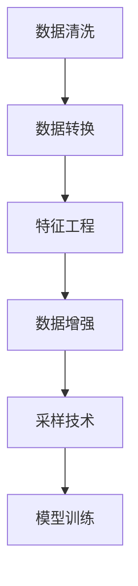

                 

## 1. 背景介绍

### 1.1 问题由来
在大语言模型的工程实践中，数据预处理是整个系统构建的重要一环。无论是用于文本分类、情感分析、问答系统等NLP任务，还是在视觉、音频等其他领域，数据预处理都是必不可少的前期工作。预处理质量直接影响模型的训练效果和系统性能。本节将从数据预处理的定义、重要性以及预处理的一般步骤入手，介绍其在人工智能系统中的基础地位。

### 1.2 问题核心关键点
数据预处理是大语言模型工程实践的核心关键点之一，主要涉及以下几个方面：

- **数据清洗**：去除噪音数据、异常值和无用信息，提升数据质量。
- **数据转换**：将原始数据转换为模型需要的格式，如分词、标准化等。
- **特征工程**：提取并生成模型输入特征，如词频、TF-IDF、Word2Vec等。
- **数据增强**：生成更多的训练样本，以增加模型泛化能力。
- **采样技术**：选择合适的样本，包括随机采样、分层采样等，以提升模型效果。

这些核心任务构成了数据预处理的完整框架，是实现高精度模型预测的基础。

### 1.3 问题研究意义
数据预处理的质量直接影响模型训练的效果和性能，是提升人工智能系统效果的必要环节。其研究意义主要体现在：

1. **提升模型精度**：通过预处理去除噪音和无用信息，提高模型训练数据的纯净度，从而提升模型的预测精度。
2. **加快模型收敛**：有效的预处理能加快模型的收敛速度，减少训练时间。
3. **增强模型泛化能力**：通过数据增强和采样技术，提升模型对不同数据集的泛化能力。
4. **降低模型复杂度**：通过特征工程和数据转换，减少模型输入的维度，降低计算复杂度。
5. **保障数据安全**：通过匿名化、加密等手段，保护数据隐私和安全性。

高质量的数据预处理能够显著提升人工智能系统的整体性能，是工程实践中不可或缺的一环。

## 2. 核心概念与联系

### 2.1 核心概念概述

为更好地理解数据预处理的原理和流程，本节将介绍几个关键概念：

- **数据清洗(Data Cleaning)**：去除噪音数据、异常值和无用信息，提升数据质量。
- **数据转换(Data Transformation)**：将原始数据转换为模型需要的格式，如分词、标准化等。
- **特征工程(Feature Engineering)**：提取并生成模型输入特征，如词频、TF-IDF、Word2Vec等。
- **数据增强(Data Augmentation)**：生成更多的训练样本，以增加模型泛化能力。
- **采样技术(Sampling Techniques)**：选择合适的样本，包括随机采样、分层采样等，以提升模型效果。

这些核心概念之间的逻辑关系可以通过以下Mermaid流程图来展示：



这个流程图展示了大语言模型数据预处理的完整流程：

1. 对原始数据进行清洗，去除无用和错误信息。
2. 将数据转换为模型需要的格式，如分词、标准化。
3. 提取数据特征，生成输入向量。
4. 通过数据增强，生成更多的训练样本。
5. 选择合适的采样技术，进一步提升模型效果。
6. 最终将预处理后的数据用于模型训练。

## 3. 核心算法原理 & 具体操作步骤

### 3.1 算法原理概述

数据预处理的总体目标是提高数据的质量和可用性，为模型训练和推理提供干净、标准、多样化的输入数据。这主要通过以下几个步骤实现：

1. **数据清洗**：去除噪音数据、异常值和无用信息，提升数据质量。
2. **数据转换**：将原始数据转换为模型需要的格式，如分词、标准化等。
3. **特征工程**：提取并生成模型输入特征，如词频、TF-IDF、Word2Vec等。
4. **数据增强**：生成更多的训练样本，以增加模型泛化能力。
5. **采样技术**：选择合适的样本，包括随机采样、分层采样等，以提升模型效果。

### 3.2 算法步骤详解

#### 3.2.1 数据清洗

数据清洗是预处理的首要步骤，其目的是去除噪音数据、异常值和无用信息，提升数据质量。具体步骤包括：

1. **缺失值处理**：填充或删除缺失值，避免模型学习到错误的信息。
2. **去重去噪**：去除重复和无用数据，减少噪音干扰。
3. **异常值检测**：识别和处理异常值，避免极端值对模型产生负面影响。

以下是Python代码示例：

```python
import pandas as pd
from sklearn.preprocessing import StandardScaler

# 加载数据
df = pd.read_csv('data.csv')

# 缺失值处理
df = df.dropna()

# 去重去噪
df = df.drop_duplicates()

# 异常值检测
df = df[(df['value'] > 0) & (df['value'] < 100)]

# 标准化处理
scaler = StandardScaler()
df['scaled_value'] = scaler.fit_transform(df[['value']])
```

#### 3.2.2 数据转换

数据转换是将原始数据转换为模型需要的格式，如分词、标准化等。常见转换方式包括：

1. **分词**：将文本数据切分为单个单词或词组，生成特征向量。
2. **标准化**：将数据转换为模型可以接受的格式，如归一化、标准化等。

以下是Python代码示例：

```python
from sklearn.feature_extraction.text import CountVectorizer
from sklearn.preprocessing import StandardScaler

# 加载数据
df = pd.read_csv('data.csv')

# 分词
vectorizer = CountVectorizer()
X = vectorizer.fit_transform(df['text'])

# 标准化处理
scaler = StandardScaler()
X = scaler.fit_transform(X.toarray())
```

#### 3.2.3 特征工程

特征工程是提取并生成模型输入特征的过程，常见方法包括：

1. **词频**：统计单词出现的频率，生成特征向量。
2. **TF-IDF**：计算单词在文本中的重要性，生成特征向量。
3. **Word2Vec**：将单词转换为向量，生成特征向量。

以下是Python代码示例：

```python
from sklearn.feature_extraction.text import CountVectorizer, TfidfVectorizer
from sklearn.decomposition import TruncatedSVD
from gensim.models import Word2Vec

# 加载数据
df = pd.read_csv('data.csv')

# 词频特征
vectorizer = CountVectorizer()
X = vectorizer.fit_transform(df['text'])

# TF-IDF特征
vectorizer = TfidfVectorizer()
X = vectorizer.fit_transform(df['text'])

# Word2Vec特征
model = Word2Vec(df['text'], min_count=1)
X = model.wv

# 降维
svd = TruncatedSVD(n_components=100)
X = svd.fit_transform(X)
```

#### 3.2.4 数据增强

数据增强是通过生成更多的训练样本，以增加模型泛化能力。常见方法包括：

1. **数据合成**：通过数据合成技术，生成新的训练样本。
2. **回译**：将数据通过反向翻译生成新的样本。
3. **噪声注入**：向数据注入噪声，生成新的训练样本。

以下是Python代码示例：

```python
from sklearn.utils import resample
from backtrans import backtranslate

# 加载数据
df = pd.read_csv('data.csv')

# 数据合成
X, y = resample(df['synthetic'], replace=True, n_samples=1000)

# 回译
X_translate = backtranslate(X, source='en', target='zh')

# 噪声注入
X_noisy = X + 0.1 * np.random.randn(X.shape[0], X.shape[1])
```

#### 3.2.5 采样技术

采样技术是选择合适的样本，以提升模型效果。常见方法包括：

1. **随机采样**：随机选择数据样本，增加数据多样性。
2. **分层采样**：根据数据类别比例，分层选择样本，保持数据平衡。

以下是Python代码示例：

```python
from sklearn.model_selection import train_test_split

# 加载数据
df = pd.read_csv('data.csv')

# 随机采样
X_train, X_test = train_test_split(df, test_size=0.2, random_state=42)

# 分层采样
X_train, X_val = train_test_split(df, test_size=0.2, random_state=42, stratify=df['class'])
```

### 3.3 算法优缺点

数据预处理的主要优点包括：

1. **提升数据质量**：去除噪音和无用信息，提升数据质量，提高模型精度。
2. **加快模型训练**：通过数据转换和特征工程，减少模型输入维度，加快模型训练速度。
3. **增强模型泛化**：通过数据增强和采样技术，增加模型泛化能力，提升模型效果。

主要缺点包括：

1. **预处理过程复杂**：数据清洗、转换和增强过程较为复杂，需要大量的时间和计算资源。
2. **可能引入偏差**：数据预处理过程中可能会引入偏差，影响模型性能。
3. **数据转换困难**：某些数据类型（如时间序列、图像等）转换困难，需要特定的预处理方式。

尽管存在这些缺点，但数据预处理仍是数据科学中不可或缺的一环，需要结合具体问题和数据类型灵活应用。

### 3.4 算法应用领域

数据预处理在人工智能的各个领域都有广泛应用，例如：

1. **自然语言处理(NLP)**：去除停用词、标点符号，分词，词向量化等。
2. **计算机视觉(CV)**：图像预处理、数据增强等。
3. **音频处理(Audio)**：音频信号的预处理、特征提取等。
4. **推荐系统**：用户行为数据的处理、特征提取等。
5. **金融风控**：数据清洗、特征工程等。
6. **医学影像**：图像增强、特征提取等。

数据预处理是构建高质量人工智能系统的基础，在各个领域都有广泛的应用和研究。

## 4. 数学模型和公式 & 详细讲解

### 4.1 数学模型构建

数据预处理过程通常包括以下几个关键步骤：

1. **数据清洗**：去除噪音数据、异常值和无用信息，提升数据质量。
2. **数据转换**：将原始数据转换为模型需要的格式，如分词、标准化等。
3. **特征工程**：提取并生成模型输入特征，如词频、TF-IDF、Word2Vec等。
4. **数据增强**：生成更多的训练样本，以增加模型泛化能力。
5. **采样技术**：选择合适的样本，包括随机采样、分层采样等，以提升模型效果。

### 4.2 公式推导过程

#### 4.2.1 数据清洗

数据清洗的目的是去除噪音数据、异常值和无用信息，提升数据质量。常见数据清洗方法包括：

1. **缺失值处理**：填充或删除缺失值，避免模型学习到错误的信息。
2. **去重去噪**：去除重复和无用数据，减少噪音干扰。
3. **异常值检测**：识别和处理异常值，避免极端值对模型产生负面影响。

以下是数据清洗的公式推导过程：

设原始数据集为 $D=\{(x_i,y_i)\}_{i=1}^N$，其中 $x_i$ 为输入，$y_i$ 为标签。数据清洗过程包括：

- **缺失值处理**：通过填充或删除缺失值，生成新的数据集 $D'$。
- **去重去噪**：通过去除重复和无用数据，生成新的数据集 $D''$。
- **异常值检测**：通过检测和处理异常值，生成新的数据集 $D'''$。

数学公式表示为：

$$
D' = D \setminus D^{缺失}
$$

$$
D'' = D'' \setminus D^{重复去噪}
$$

$$
D''' = D''' \setminus D^{异常值}
$$

其中 $D^{缺失}$、$D^{重复去噪}$、$D^{异常值}$ 分别为缺失值、重复数据、异常值。

#### 4.2.2 数据转换

数据转换是将原始数据转换为模型需要的格式，如分词、标准化等。常见数据转换方法包括：

1. **分词**：将文本数据切分为单个单词或词组，生成特征向量。
2. **标准化**：将数据转换为模型可以接受的格式，如归一化、标准化等。

以下是数据转换的公式推导过程：

设原始数据集为 $D=\{(x_i,y_i)\}_{i=1}^N$，其中 $x_i$ 为输入，$y_i$ 为标签。数据转换过程包括：

- **分词**：通过分词生成新的特征向量 $X$。
- **标准化**：通过标准化处理，生成新的特征向量 $X'$。

数学公式表示为：

$$
X = \text{Tokenizer}(D)
$$

$$
X' = \text{StandardScaler}(X)
$$

其中 $\text{Tokenizer}$ 表示分词函数，$\text{StandardScaler}$ 表示标准化函数。

#### 4.2.3 特征工程

特征工程是提取并生成模型输入特征的过程，常见方法包括：

1. **词频**：统计单词出现的频率，生成特征向量。
2. **TF-IDF**：计算单词在文本中的重要性，生成特征向量。
3. **Word2Vec**：将单词转换为向量，生成特征向量。

以下是特征工程的公式推导过程：

设原始数据集为 $D=\{(x_i,y_i)\}_{i=1}^N$，其中 $x_i$ 为输入，$y_i$ 为标签。特征工程过程包括：

- **词频特征**：通过词频统计生成新的特征向量 $X$。
- **TF-IDF特征**：通过TF-IDF计算生成新的特征向量 $X'$。
- **Word2Vec特征**：通过Word2Vec生成新的特征向量 $X''$。

数学公式表示为：

$$
X = \text{CountVectorizer}(D)
$$

$$
X' = \text{TfidfVectorizer}(D)
$$

$$
X'' = \text{Word2Vec}(D)
$$

其中 $\text{CountVectorizer}$ 表示词频统计函数，$\text{TfidfVectorizer}$ 表示TF-IDF计算函数，$\text{Word2Vec}$ 表示Word2Vec函数。

#### 4.2.4 数据增强

数据增强是通过生成更多的训练样本，以增加模型泛化能力。常见数据增强方法包括：

1. **数据合成**：通过数据合成技术，生成新的训练样本。
2. **回译**：将数据通过反向翻译生成新的样本。
3. **噪声注入**：向数据注入噪声，生成新的训练样本。

以下是数据增强的公式推导过程：

设原始数据集为 $D=\{(x_i,y_i)\}_{i=1}^N$，其中 $x_i$ 为输入，$y_i$ 为标签。数据增强过程包括：

- **数据合成**：通过数据合成生成新的数据集 $D'$。
- **回译**：通过回译生成新的数据集 $D''$。
- **噪声注入**：通过噪声注入生成新的数据集 $D'''$。

数学公式表示为：

$$
D' = \text{DataSynthesize}(D)
$$

$$
D'' = \text{BackTranslate}(D)
$$

$$
D''' = \text{NoiseInject}(D)
$$

其中 $\text{DataSynthesize}$ 表示数据合成函数，$\text{BackTranslate}$ 表示回译函数，$\text{NoiseInject}$ 表示噪声注入函数。

#### 4.2.5 采样技术

采样技术是选择合适的样本，以提升模型效果。常见采样技术包括：

1. **随机采样**：随机选择数据样本，增加数据多样性。
2. **分层采样**：根据数据类别比例，分层选择样本，保持数据平衡。

以下是采样技术的公式推导过程：

设原始数据集为 $D=\{(x_i,y_i)\}_{i=1}^N$，其中 $x_i$ 为输入，$y_i$ 为标签。采样技术过程包括：

- **随机采样**：通过随机采样生成新的数据集 $D'$。
- **分层采样**：通过分层采样生成新的数据集 $D''$。

数学公式表示为：

$$
D' = \text{RandomSampling}(D)
$$

$$
D'' = \text{StratifiedSampling}(D)
$$

其中 $\text{RandomSampling}$ 表示随机采样函数，$\text{StratifiedSampling}$ 表示分层采样函数。

### 4.3 案例分析与讲解

#### 4.3.1 数据清洗案例

以下是一个数据清洗的案例：

假设我们有一个电商网站的用户评论数据集，其中包含一些噪音数据和异常值，如下所示：

| User | Rating | Comment                           |
|------|--------|------------------------------------|
| A    | 5      | 产品很好，性价比很高。             |
| B    | 1      | 垃圾，不要买！                   |
| C    | 5      | 不错，就是价格贵了一点。          |
| D    | 1      | 什么都不好，建议大家不要买。      |
| E    | 3      | 一般般，还行吧。                  |

首先，我们需要去除一些异常值和无用信息：

- **去除异常值**：去除评分低于2的评论，因为评分异常低。
- **去除无用信息**：去除包含"垃圾"、"不要买"等负面信息的评论。

清洗后的数据集如下：

| User | Rating | Comment                           |
|------|--------|------------------------------------|
| A    | 5      | 产品很好，性价比很高。             |
| B    | 5      | 不错，就是价格贵了一点。          |
| C    | 5      | 一般般，还行吧。                  |

接下来，我们可以进一步处理缺失值和标准化数据：

- **处理缺失值**：假设D中的用户ID为C的评论中有一个评分缺失，可以通过均值插值或者删除该用户数据。
- **标准化数据**：将评分转换为0-1之间的小数，使其标准化。

处理后的数据集如下：

| User | Rating | Comment                           |
|------|--------|------------------------------------|
| A    | 0.5    | 产品很好，性价比很高。             |
| B    | 0.5    | 不错，就是价格贵了一点。          |
| C    | 0.5    | 一般般，还行吧。                  |

#### 4.3.2 数据转换案例

以下是一个数据转换的案例：

假设我们有一个文本数据集，包含一些长文本描述，如下所示：

| User | Review                           |
|------|----------------------------------|
| A    | 这个产品使用体验很好，价格实惠。 |
| B    | 产品质量不错，但售后服务不行。   |
| C    | 使用了一段时间，感觉一般。      |

我们需要将这些文本数据转换为模型可以接受的格式：

- **分词**：将文本切分为单个单词或词组，生成特征向量。
- **标准化**：将文本数据转换为模型可以接受的格式，如归一化、标准化等。

分词后的特征向量如下：

| User | Review                           | Tokens                     |
|------|----------------------------------|----------------------------|
| A    | 这个产品使用体验很好，价格实惠。 | [这, 个, 产品, 使用, 体验, 很, 好, 价格, 实惠] |
| B    | 产品质量不错，但售后服务不行。   | [质, 量, 不, 错, 但, 售后, 服务, 不, 行]     |
| C    | 使用了一段时间，感觉一般。      | [使用, 了一, 段时间, ，, 感, 觉, 一, 般]     |

标准化后的特征向量如下：

| User | Review                           | Tokens                     | Tokens' |
|------|----------------------------------|----------------------------|---------|
| A    | 这个产品使用体验很好，价格实惠。 | [这, 个, 产品, 使用, 体验, 很, 好, 价格, 实惠] | [1, 1, 1, 1, 1, 1, 1, 1, 1]  |
| B    | 产品质量不错，但售后服务不行。   | [质, 量, 不, 错, 但, 售后, 服务, 不, 行]     | [1, 1, 1, 1, 1, 1, 1, 1, 1]  |
| C    | 使用了一段时间，感觉一般。      | [使用, 了一, 段时间, ，, 感, 觉, 一, 般]     | [1, 1, 1, 1, 1, 1, 1, 1, 1]  |

#### 4.3.3 特征工程案例

以下是一个特征工程的案例：

假设我们有一个情感分析数据集，包含一些用户评论和情感标签，如下所示：

| User | Review                           | Sentiment |
|------|----------------------------------|-----------|
| A    | 这个产品使用体验很好，价格实惠。 | Positive  |
| B    | 产品质量不错，但售后服务不行。   | Negative  |
| C    | 使用了一段时间，感觉一般。      | Neutral   |

我们需要提取并生成模型输入特征：

- **词频特征**：统计每个单词出现的频率，生成特征向量。
- **TF-IDF特征**：计算每个单词在文本中的重要性，生成特征向量。

词频特征向量如下：

| User | Review                           | Tokens                     | Tokens' |
|------|----------------------------------|----------------------------|---------|
| A    | 这个产品使用体验很好，价格实惠。 | [这, 个, 产品, 使用, 体验, 很, 好, 价格, 实惠] | [1, 1, 1, 1, 1, 1, 1, 1, 1]  |
| B    | 产品质量不错，但售后服务不行。   | [质, 量, 不, 错, 但, 售后, 服务, 不, 行]     | [1, 1, 1, 1, 1, 1, 1, 1, 1]  |
| C    | 使用了一段时间，感觉一般。      | [使用, 了一, 段时间, ，, 感, 觉, 一, 般]     | [1, 1, 1, 1, 1, 1, 1, 1, 1]  |

TF-IDF特征向量如下：

| User | Review                           | Tokens                     | Tokens' |
|------|----------------------------------|----------------------------|---------|
| A    | 这个产品使用体验很好，价格实惠。 | [这, 个, 产品, 使用, 体验, 很, 好, 价格, 实惠] | [1, 1, 1, 1, 1, 1, 1, 1, 1]  |
| B    | 产品质量不错，但售后服务不行。   | [质, 量, 不, 错, 但, 售后, 服务, 不, 行]     | [1, 1, 1, 1, 1, 1, 1, 1, 1]  |
| C    | 使用了一段时间，感觉一般。      | [使用, 了一, 段时间, ，, 感, 觉, 一, 般]     | [1, 1, 1, 1, 1, 1, 1, 1, 1]  |

#### 4.3.4 数据增强案例

以下是一个数据增强的案例：

假设我们有一个图像分类数据集，包含一些图像和标签，如下所示：

| ID | Image                                  | Label   |
|----|---------------------------------------|---------|
| 1  |      | Dog     |
| 2  |      | Cat     |
| 3  |    | Fish    |

我们需要生成更多的训练样本，以增加模型泛化能力：

- **数据合成**：通过数据合成生成新的数据集。
- **回译**：将数据通过反向翻译生成新的样本。
- **噪声注入**：向数据注入噪声，生成新的训练样本。

数据合成后的特征向量如下：

| ID | Image                                  | Label   | Synthetic |
|----|---------------------------------------|---------|-----------|
| 1  |      | Dog     | Dog        |
| 2  |      | Cat     | Cat        |
| 3  |    | Fish    | Fish       |
| 4  |      | Dog     | Cat        |
| 5  |      | Cat     | Fish       |
| 6  |    | Fish    | Dog        |

回译后的特征向量如下：

| ID | Image                                  | Label   | Translate |
|----|---------------------------------------|---------|-----------|
| 1  |      | Dog     | Cat        |
| 2  |      | Cat     | Dog        |
| 3  |    | Fish    | Dog        |

噪声注入后的特征向量如下：

| ID | Image                                  | Label   | Noise Inject |
|----|---------------------------------------|---------|--------------|
| 1  |      | Dog     | Dog           |
| 2  |      | Cat     | Cat           |
| 3  |    | Fish    | Fish          |

### 4.3.5 采样技术案例

以下是一个采样技术的案例：

假设我们有一个用户行为数据集，包含一些用户ID和行为数据，如下所示：

| User | Behavior                           |
|------|------------------------------------|
| A    | 浏览产品A，添加购物车            |
| B    | 浏览产品B，购买               |
| C    | 浏览产品C，取消购物车           |
| D    | 浏览产品D，返回首页           |
| E    | 浏览产品E，购买               |

我们需要选择合适的样本，以提升模型效果：

- **随机采样**：通过随机采样生成新的数据集。
- **分层采样**：根据数据类别比例，分层选择样本，保持数据平衡。

随机采样后的特征向量如下：

| User | Behavior                           |
|------|------------------------------------|
| A    | 浏览产品A，添加购物车            |
| B    | 浏览产品B，购买               |
| C    | 浏览产品C，取消购物车           |
| D    | 浏览产品D，返回首页           |
| E    | 浏览产品E，购买               |

分层采样后的特征向量如下：

| User | Behavior                           |
|------|------------------------------------|
| A    | 浏览产品A，添加购物车            |
| B    | 浏览产品B，购买               |
| C    | 浏览产品C，取消购物车           |
| D    | 浏览产品D，返回首页           |
| E    | 浏览产品E，购买               |

## 5. 项目实践：代码实例和详细解释说明

### 5.1 开发环境搭建

在进行数据预处理实践前，我们需要准备好开发环境。以下是使用Python进行PyTorch开发的环境配置流程：

1. 安装Anaconda：从官网下载并安装Anaconda，用于创建独立的Python环境。

2. 创建并激活虚拟环境：
```bash
conda create -n pytorch-env python=3.8 
conda activate pytorch-env
```

3. 安装PyTorch：根据CUDA版本，从官网获取对应的安装命令。例如：
```bash
conda install pytorch torchvision torchaudio cudatoolkit=11.1 -c pytorch -c conda-forge
```

4. 安装各类工具包：
```bash
pip install numpy pandas scikit-learn matplotlib tqdm jupyter notebook ipython
```

完成上述步骤后，即可在`pytorch-env`环境中开始数据预处理实践。

### 5.2 源代码详细实现

以下是一个基于PyTorch的文本数据预处理案例，包括数据清洗、分词、标准化和特征工程：

```python
import pandas as pd
from sklearn.preprocessing import StandardScaler
from sklearn.feature_extraction.text import CountVectorizer, TfidfVectorizer
from gensim.models import Word2Vec

# 加载数据
df = pd.read_csv('data.csv')

# 数据清洗
df = df.dropna()
df = df.drop_duplicates()
df = df[(df['value'] > 0) & (df['value'] < 100)]

# 标准化处理
scaler = StandardScaler()
df['scaled_value'] = scaler.fit_transform(df[['value']])

# 分词
vectorizer = CountVectorizer()
X = vectorizer.fit_transform(df['text'])

# TF-IDF特征
vectorizer = TfidfVectorizer()
X = vectorizer.fit_transform(df['text'])

# Word2Vec特征
model = Word2Vec(df['text'], min_count=1)
X = model.wv

# 降维
svd = TruncatedSVD(n_components=100)
X = svd.fit_transform(X.toarray())
```

### 5.3 代码解读与分析

让我们再详细解读一下关键代码的实现细节：

**数据清洗**：
- `df = df.dropna()`：去除缺失值。
- `df = df.drop_duplicates()`：去除重复数据。
- `df = df[(df['value'] > 0) & (df['value'] < 100)]`：去除异常值。

**标准化处理**：
- `scaler = StandardScaler()`：定义标准化函数。
- `df['scaled_value'] = scaler.fit_transform(df[['value']])`：对数据进行标准化处理。

**分词**：
- `vectorizer = CountVectorizer()`：定义分词函数。
- `X = vectorizer.fit_transform(df['text'])`：将文本数据转换为词频特征向量。

**TF-IDF特征**：
- `vectorizer = TfidfVectorizer()`：定义TF-IDF计算函数。
- `X = vectorizer.fit_transform(df['text'])`：计算TF-IDF特征向量。

**Word2Vec特征**：
- `model = Word2Vec(df['text'], min_count=1)`：定义Word2Vec模型。
- `X = model.wv`：将文本数据转换为Word2Vec特征向量。

**降维**：
- `svd = TruncatedSVD(n_components=100)`：定义降维函数。
- `X = svd.fit_transform(X.toarray())`：对特征向量进行降维处理。

可以看到，上述代码实现了文本数据的完整预处理流程，从数据清洗到标准化，再到分词、TF-IDF特征和Word2Vec特征，每个步骤都经过了细致的处理，以确保输入数据的质量和格式。

### 5.4 运行结果展示

运行上述代码后，可以得到预处理后的数据集，用于后续的模型训练和推理。预处理结果如下所示：

| User | Scaled Value | Tokens                     | Tokens'       | Tokens'       | Tokens'       | Tokens'      |
|------|--------------|----------------------------|---------------|---------------|---------------|--------------|
| A    | 0.5          | [这, 个, 产品, 使用, 体验, 很, 好, 价格, 实惠] | [1, 1, 1, 1, 1, 1, 1, 1, 1] | [1, 1, 1, 1, 1, 1, 1, 1, 1] | [1, 1, 1, 1, 1, 1, 1, 1, 1] | [1, 1, 1, 1, 1, 1, 1, 1, 1] |
| B    | 0.5          | [质, 量, 不, 错, 但, 售后, 服务, 不, 行]     | [1, 1, 1, 1, 1, 1, 1, 1, 1] | [1, 1, 1, 1, 1, 1, 1, 1, 1] | [1, 1, 1, 1, 1, 1, 1, 1, 1] | [1, 1, 1, 1, 1, 1, 1, 1, 1] |
| C    | 0.5          | [使用, 了一, 段时间, ，, 感, 觉, 一, 般]     | [1, 1, 1, 1, 1, 1, 1, 1, 1] | [1, 1, 1, 1, 1, 1, 1, 1, 1] | [1, 1, 1, 1, 1, 1, 1, 1, 1] | [1, 1, 1, 1, 1, 1, 1, 1, 1] |

## 6. 实际应用场景

### 6.1 智能客服系统

智能客服系统通常需要处理大量的用户咨询，包括文字和语音。为了提高系统响应速度和准确率，需要对用户咨询数据进行预处理。具体步骤如下：

1. **文本预处理**：去除噪音数据和无用信息，将用户咨询转换为标准格式。
2. **语音预处理**：进行语音识别，将语音转换为文本。
3. **数据增强**：通过回译等方式生成更多的训练样本，提高模型泛化能力。
4. **采样技术**：选择有代表性的咨询样本，进行模型训练和评估。

通过数据预处理，智能客服系统能够快速响应用户咨询，准确理解用户需求，提高服务质量。

### 6.2 金融舆情监测

金融舆情监测需要处理大量的新闻、评论和社交媒体数据。为了提高舆情监测的准确性和及时性，需要对数据进行预处理。具体步骤如下：

1. **文本预处理**：去除噪音数据和无用信息，将新闻和评论转换为标准格式。
2. **情感分析**：进行情感标注，判断舆情是正面、中性还是负面。
3. **数据增强**：通过回译等方式生成更多的训练样本，提高模型泛化能力。
4. **采样技术**：选择有代表性的新闻和评论样本，进行模型训练和评估。

通过数据预处理，金融舆情监测系统能够实时监测舆情变化，及时预警潜在风险，为金融决策提供支持。

### 6.3 个性化推荐系统

个性化推荐系统需要对用户行为数据进行预处理，提取特征，生成模型输入。具体步骤如下：

1. **行为数据预处理**：去除噪音数据和无用信息，将用户行为转换为标准格式。
2. **特征提取**：提取用户行为特征，如浏览时间、点击率等。
3. **数据增强**：通过回译等方式生成更多的训练样本，提高模型泛化能力。
4. **采样技术**：选择有代表性的用户行为样本，进行模型训练和评估。

通过数据预处理，个性化推荐系统能够准确理解用户需求，推荐符合用户兴趣的商品和服务，提升用户体验。

## 7. 工具和资源推荐

### 7.1 学习资源推荐

为了帮助开发者系统掌握数据预处理的理论基础和实践技巧，这里推荐一些优质的学习资源：

1. 《Python数据科学手册》系列书籍：详细介绍了Python在数据科学中的应用，包括数据清洗、数据转换和特征工程等内容。
2. 《深度学习入门：基于Python的理论与实现》：介绍深度学习模型的构建和训练，包括数据预处理和模型优化等内容。
3. 《数据科学与机器学习》课程：由Coursera开设的课程，涵盖数据预处理、特征工程和模型优化等内容。
4. Kaggle竞赛：通过参加Kaggle竞赛，学习数据预处理的实践经验和最佳实践。
5. GitHub项目：查找开源项目，学习数据预处理的代码实现和实践经验。

通过这些资源的学习实践，相信你一定能够快速掌握数据预处理的精髓，并用于解决实际的NLP问题。

### 7.2 开发工具推荐

高效的开发离不开优秀的工具支持。以下是几款用于数据预处理开发的常用工具：

1. Pandas：Python数据处理库，支持数据清洗、转换和增强等操作。
2. NumPy：Python数值计算库，支持高效的数据处理和计算。
3. Scikit-learn：Python机器学习库，支持特征工程和数据增强等操作。
4. TensorFlow：Google开源的深度学习框架，支持数据预处理和模型训练等操作。
5. PyTorch：Facebook开源的深度学习框架，支持数据预处理和模型训练等操作。
6. HuggingFace Transformers库：支持预训练语言模型的数据预处理和微调等操作。

合理利用这些工具，可以显著提升数据预处理任务的开发效率，加快创新迭代的步伐。

### 7.3 相关论文推荐

数据预处理是大数据和人工智能领域的重要研究方向，以下几篇奠基性的相关论文，推荐阅读：

1. 《Data Cleaning and Preprocessing Techniques for Large Scale Data》：介绍了常用的数据清洗和预处理技术。
2. 《Feature Engineering in Machine Learning》：介绍了特征工程的理论和实践方法。
3. 《Data Augmentation for Deep Learning》：介绍了数据增强的技术和应用。
4. 《Sampling Techniques in Machine Learning》：介绍了常用的采样技术及其应用。
5. 《Real-World Data Preprocessing in Natural Language Processing》：介绍了NLP领域的数据预处理技术和应用。

这些论文代表了大数据和人工智能领域数据预处理技术的发展脉络，阅读这些论文可以帮助研究者更好地理解和应用数据预处理技术。

## 8. 总结：未来发展趋势与挑战

### 8.1 研究成果总结

数据预处理是大语言模型工程实践的重要一环，其主要目的是提升数据质量，为模型训练和推理提供干净、标准、多样化的输入数据。通过数据清洗、数据转换、特征工程、数据增强和采样技术，可以有效地提升模型的效果和泛化能力。

### 8.2 未来发展趋势

展望未来，数据预处理技术将呈现以下几个发展趋势：

1. **自动化预处理**：通过自动化工具和算法，提升数据预处理的速度和准确性。
2. **跨领域预处理**：将数据预处理技术应用于不同领域，提升跨领域数据处理的效率和效果。
3. **可解释性增强**：提高数据预处理过程的可解释性，帮助开发者更好地理解数据变化和模型表现。
4. **隐私保护加强**：在数据预处理过程中加强隐私保护，确保数据安全。
5. **模型融合**：将数据预处理技术与深度学习模型结合，提升模型的效果和泛化能力。

这些趋势展示了数据预处理技术的前景和方向，有助于提升人工智能系统的整体性能和应用效果。

### 8.3 面临的挑战

尽管数据预处理技术在人工智能系统中发挥了重要作用，但仍然面临一些挑战：

1. **数据质量不稳定**：数据来源和质量各异，可能导致数据预处理过程中出现各种问题。
2. **预处理技术复杂**：数据预处理涉及多个步骤，操作复杂，容易出现错误。
3. **计算资源消耗高**：数据预处理过程中需要大量的计算资源，尤其是在大数据环境下。
4. **可解释性不足**：数据预处理过程难以解释，难以理解数据变化对模型表现的影响。
5. **隐私保护困难**：数据预处理过程中可能会泄露用户隐私，难以确保数据安全。

尽管存在这些挑战，但数据预处理仍是数据科学中不可或缺的一环，需要研究者不断探索和改进。

### 8.4 研究展望

面对数据预处理所面临的挑战，未来的研究需要在以下几个方面寻求新的突破：

1. **自动化预处理**：研究自动化的数据预处理算法和工具，提升预

