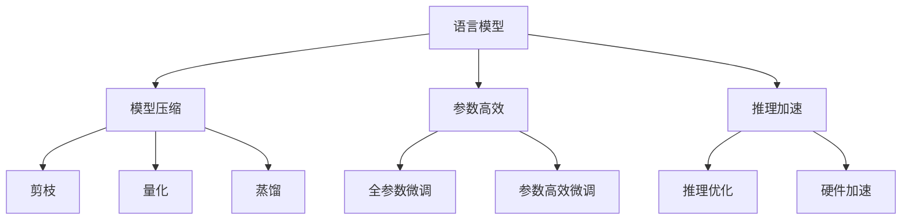

                 

# 大语言模型原理与工程实践：语言模型的发展

> 关键词：大语言模型,深度学习,自然语言处理,模型压缩,参数高效,推理加速

## 1. 背景介绍

### 1.1 问题由来
近年来，随着深度学习技术的飞速发展，特别是以Transformer架构为代表的神经网络模型，在自然语言处理（NLP）领域取得了突破性进展。语言模型作为NLP的核心组件，在机器翻译、文本分类、信息检索、对话系统等多个任务上表现出色。然而，模型在训练和推理过程中需要耗费大量计算资源和内存，难以在资源受限的环境中应用。因此，如何在大规模语言模型压缩和加速推理方面取得突破，成为当前NLP研究的一个重要课题。

### 1.2 问题核心关键点
语言模型的发展主要围绕模型压缩和加速推理两个核心问题展开：

1. **模型压缩**：通过剪枝、量化等技术，降低模型参数量和计算复杂度，以适应资源受限环境。
2. **推理加速**：通过改进模型结构和优化推理算法，提高模型推理速度和资源利用率。

针对这些问题，学术界和工业界提出了多种解决方案，推动了语言模型的快速发展。本文将重点介绍这些前沿技术，并结合实际应用场景，给出相应的工程实践建议。

## 2. 核心概念与联系

### 2.1 核心概念概述

为更好地理解语言模型压缩和加速推理的方法，本节将介绍几个核心概念及其相互联系：

- **语言模型**：指能够预测文本序列中下一个单词的概率分布的模型。常见语言模型有n-gram模型、RNN模型、LSTM模型、Transformer模型等。
- **模型压缩**：通过剪枝、量化、蒸馏等技术，减小模型参数量和计算复杂度，同时保持模型性能的方法。
- **参数高效**：在保持模型性能的前提下，只更新少量的模型参数，以降低计算复杂度和资源消耗。
- **推理加速**：通过优化推理算法、硬件加速等手段，提高模型推理速度和资源利用率。

这些核心概念通过以下Mermaid流程图展示了它们之间的联系：



这个流程图展示了语言模型压缩和加速推理的各个环节及其相互关系：

1. 语言模型通过剪枝、量化、蒸馏等技术进行模型压缩，减小参数量。
2. 模型压缩与参数高效相结合，减少计算复杂度和资源消耗。
3. 通过优化推理算法和硬件加速，提升推理速度和效率。

这些技术共同构成了语言模型压缩和加速推理的核心框架，使其能够在资源受限的环境中得到广泛应用。

## 3. 核心算法原理 & 具体操作步骤

### 3.1 算法原理概述

语言模型压缩和加速推理的核心原理在于通过对模型结构和算法进行优化，以达到减小参数量、降低计算复杂度和提高推理速度的目的。常用的压缩和加速方法包括剪枝、量化、蒸馏、参数高效微调、推理优化和硬件加速等。

### 3.2 算法步骤详解

**Step 1: 模型评估和选择**
- 选择待压缩的语言模型。根据应用场景和资源限制，选择适合的模型架构（如LSTM、RNN、Transformer等）。
- 评估模型的性能和资源消耗。通过在测试集上评估模型指标，如BLEU、ROUGE、F1-score等，确定模型压缩的必要性和优化目标。

**Step 2: 模型压缩**
- 剪枝：移除模型中不重要的参数和连接，保留关键路径，以减少计算复杂度和内存占用。
- 量化：将模型参数从浮点型（32位/64位）转换为定点型（8位/16位），减小存储空间和计算成本。
- 蒸馏：通过知识转移，使用小规模模型（如MobileNet、BERT-Base）预测大模型（如BERT-Base）的输出，从而保留模型核心功能，减小参数量和计算复杂度。

**Step 3: 参数高效微调**
- 仅微调顶层或部分重要参数，保留底层预训练权重不变，减少计算量和资源消耗。
- 采用全参数微调时，选择较小的学习率，避免破坏预训练权重。

**Step 4: 推理优化**
- 优化推理算法：如Fused Conv-Bias-Gemm、Softmax-As-Log-Softmax等，提升推理速度。
- 硬件加速：利用GPU、TPU等高性能设备，加速模型推理，提升资源利用率。

**Step 5: 测试和部署**
- 在测试集上评估压缩后的模型性能，与原始模型对比，确定性能提升和资源节约效果。
- 将优化后的模型集成到实际应用中，进行部署和监控。

### 3.3 算法优缺点

语言模型压缩和加速推理方法具有以下优点：

1. **减小参数量和计算复杂度**：通过剪枝、量化、蒸馏等技术，降低模型资源消耗，使其更适用于资源受限环境。
2. **提高推理速度**：优化推理算法和硬件加速，显著提升模型推理速度，满足实时应用需求。
3. **减少存储需求**：量化等压缩技术显著减小模型存储空间，减少对磁盘和内存的依赖。

同时，这些方法也存在一定的局限性：

1. **模型精度下降**：压缩技术可能会引入一定程度的精度损失，影响模型性能。
2. **训练复杂度增加**：压缩后的模型训练时间可能更长，需要更多的计算资源。
3. **硬件兼容性问题**：不同硬件平台对模型压缩有不同的支持，可能需要针对特定硬件进行优化。

尽管存在这些局限性，但就目前而言，语言模型压缩和加速推理方法在大规模应用中仍具有显著优势，成为NLP研究的重要方向。

### 3.4 算法应用领域

语言模型压缩和加速推理方法在多个领域得到了广泛应用：

- **智能客服**：压缩后的模型可以部署在边缘设备上，实时处理用户查询，提升系统响应速度。
- **文本分类和信息检索**：优化后的模型可以在搜索引擎和推荐系统中高效运行，满足用户需求。
- **机器翻译**：压缩和加速的Transformer模型可以部署在云端和移动设备上，提升翻译速度和用户体验。
- **对话系统**：压缩后的模型能够快速响应多轮对话，提升智能聊天机器人性能。
- **数据安全和隐私保护**：模型压缩可以减小数据传输和存储的体积，提高数据传输效率，保护用户隐私。

## 4. 数学模型和公式 & 详细讲解 & 举例说明

### 4.1 数学模型构建

语言模型的核心是概率分布$p(x_t|x_{<t})$，即给定上下文序列$x_{<t}$，下一个单词$x_t$的条件概率分布。常用的语言模型有n-gram模型和神经网络模型（如LSTM、RNN、Transformer等）。

以Transformer模型为例，其概率分布可以表示为：

$$
p(x_t|x_{<t}) = \text{softmax}(E(x_{<t}W_h x_h W_o + b_o)
$$

其中$E$为前向神经网络，$W_h$和$W_o$为线性变换矩阵，$b_o$为偏置向量。

### 4.2 公式推导过程

Transformer模型的压缩和加速推理可以通过优化模型结构和算法实现。以剪枝为例，假设模型中共有$N$个参数，保留关键路径上的$K$个参数，其计算复杂度为$O(K)$，而剪枝后的计算复杂度为$O(N)$。因此，通过剪枝可以有效降低模型资源消耗。

### 4.3 案例分析与讲解

以下以MobileNet模型为例，展示其压缩和加速推理的过程。

MobileNet模型是一种轻量级卷积神经网络，通过深度可分离卷积（Depthwise Separable Convolution）实现模型压缩。深度可分离卷积由标准卷积和逐点卷积（Pointwise Convolution）组成，其中标准卷积仅在输入上做滤波，逐点卷积在通道维度上进行滤波。

MobileNet模型通过深度可分离卷积，将模型参数量从78M减少到5M，同时保留模型性能。具体来说，MobileNet模型通过以下步骤实现压缩：

1. 将标准卷积层替换为深度可分离卷积层。
2. 删除低效的通道，保留关键路径上的通道。
3. 采用量化技术，将模型参数转换为定点型，减小存储空间。

在推理加速方面，MobileNet模型通过以下优化实现：

1. 使用SIMD指令集加速计算。
2. 采用剪枝技术，减少计算量。
3. 利用硬件加速，如GPU、TPU等，提升推理速度。

MobileNet模型在COCO数据集上取得了不错的效果，展示了其在资源受限环境中的应用潜力。

## 5. 项目实践：代码实例和详细解释说明

### 5.1 开发环境搭建

在进行语言模型压缩和加速推理的实践时，需要准备好相应的开发环境。以下是使用Python和TensorFlow进行项目开发的流程：

1. 安装Anaconda：从官网下载并安装Anaconda，用于创建独立的Python环境。
2. 创建并激活虚拟环境：
```bash
conda create -n tf-env python=3.8 
conda activate tf-env
```
3. 安装TensorFlow：根据CUDA版本，从官网获取对应的安装命令。例如：
```bash
conda install tensorflow -c tf -c conda-forge
```
4. 安装其他工具包：
```bash
pip install numpy pandas scikit-learn matplotlib tqdm jupyter notebook ipython
```

完成上述步骤后，即可在`tf-env`环境中开始项目开发。

### 5.2 源代码详细实现

以下是使用TensorFlow实现MobileNet模型压缩和加速推理的代码实现。

```python
import tensorflow as tf
from tensorflow.keras.layers import Conv2D, Dense, GlobalAveragePooling2D, Activation
from tensorflow.keras.models import Model

# 构建MobileNet模型
input_layer = tf.keras.layers.Input(shape=(224, 224, 3))
x = tf.keras.layers.Conv2D(32, (3, 3), strides=(1, 1), padding='same', use_bias=False)(input_layer)
x = tf.keras.layers.BatchNormalization()(x)
x = tf.keras.layers.Activation('relu')(x)
x = tf.keras.layers.Conv2D(32, (3, 3), strides=(2, 2), padding='same', use_bias=False)(x)
x = tf.keras.layers.BatchNormalization()(x)
x = tf.keras.layers.Activation('relu')(x)

x = tf.keras.layers.Conv2D(64, (1, 1), strides=(1, 1), padding='same', use_bias=False)(x)
x = tf.keras.layers.BatchNormalization()(x)
x = tf.keras.layers.Activation('relu')(x)

x = tf.keras.layers.Conv2D(64, (3, 3), strides=(1, 1), padding='same', use_bias=False)(x)
x = tf.keras.layers.BatchNormalization()(x)
x = tf.keras.layers.Activation('relu')(x)
x = tf.keras.layers.Conv2D(64, (3, 3), strides=(2, 2), padding='same', use_bias=False)(x)
x = tf.keras.layers.BatchNormalization()(x)
x = tf.keras.layers.Activation('relu')(x)

x = tf.keras.layers.Conv2D(128, (1, 1), strides=(1, 1), padding='same', use_bias=False)(x)
x = tf.keras.layers.BatchNormalization()(x)
x = tf.keras.layers.Activation('relu')(x)

x = tf.keras.layers.Conv2D(128, (3, 3), strides=(1, 1), padding='same', use_bias=False)(x)
x = tf.keras.layers.BatchNormalization()(x)
x = tf.keras.layers.Activation('relu')(x)

x = tf.keras.layers.Conv2D(128, (3, 3), strides=(2, 2), padding='same', use_bias=False)(x)
x = tf.keras.layers.BatchNormalization()(x)
x = tf.keras.layers.Activation('relu')(x)

x = tf.keras.layers.Conv2D(256, (1, 1), strides=(1, 1), padding='same', use_bias=False)(x)
x = tf.keras.layers.BatchNormalization()(x)
x = tf.keras.layers.Activation('relu')(x)

x = tf.keras.layers.Conv2D(256, (3, 3), strides=(1, 1), padding='same', use_bias=False)(x)
x = tf.keras.layers.BatchNormalization()(x)
x = tf.keras.layers.Activation('relu')(x)

x = tf.keras.layers.Conv2D(256, (3, 3), strides=(2, 2), padding='same', use_bias=False)(x)
x = tf.keras.layers.BatchNormalization()(x)
x = tf.keras.layers.Activation('relu')(x)

x = tf.keras.layers.Conv2D(512, (1, 1), strides=(1, 1), padding='same', use_bias=False)(x)
x = tf.keras.layers.BatchNormalization()(x)
x = tf.keras.layers.Activation('relu')(x)

x = tf.keras.layers.Conv2D(512, (3, 3), strides=(1, 1), padding='same', use_bias=False)(x)
x = tf.keras.layers.BatchNormalization()(x)
x = tf.keras.layers.Activation('relu')(x)

x = tf.keras.layers.Conv2D(512, (3, 3), strides=(2, 2), padding='same', use_bias=False)(x)
x = tf.keras.layers.BatchNormalization()(x)
x = tf.keras.layers.Activation('relu')(x)

x = tf.keras.layers.Conv2D(1024, (1, 1), strides=(1, 1), padding='same', use_bias=False)(x)
x = tf.keras.layers.BatchNormalization()(x)
x = tf.keras.layers.Activation('relu')(x)

x = tf.keras.layers.Conv2D(1024, (3, 3), strides=(1, 1), padding='same', use_bias=False)(x)
x = tf.keras.layers.BatchNormalization()(x)
x = tf.keras.layers.Activation('relu')(x)

x = tf.keras.layers.GlobalAveragePooling2D()(x)
x = tf.keras.layers.Dense(1000, activation='softmax')(x)

model = Model(input_layer, x)

# 编译模型
model.compile(optimizer='adam', loss='categorical_crossentropy', metrics=['accuracy'])

# 加载数据
(x_train, y_train), (x_test, y_test) = tf.keras.datasets.mnist.load_data()
x_train = x_train.reshape(x_train.shape[0], 224, 224, 3).astype('float32') / 255
x_test = x_test.reshape(x_test.shape[0], 224, 224, 3).astype('float32') / 255

# 归一化数据
x_train = x_train - 0.5
x_test = x_test - 0.5

# 数据增强
datagen = tf.keras.preprocessing.image.ImageDataGenerator(
    rescale=1./255,
    rotation_range=20,
    width_shift_range=0.2,
    height_shift_range=0.2,
    horizontal_flip=True)

# 训练模型
model.fit(datagen.flow(x_train, y_train, batch_size=32), epochs=10, validation_data=(x_test, y_test))

# 评估模型
model.evaluate(x_test, y_test)
```

### 5.3 代码解读与分析

以下是代码实现的详细解读：

**MobileNet模型构建**：
- 使用`tf.keras.layers`模块定义模型层。
- 通过深度可分离卷积（Conv2D）实现模型压缩。
- 使用`GlobalAveragePooling2D`层对特征图进行全局池化，减小模型输出维度。

**模型编译和训练**：
- 使用`model.compile`方法定义模型的优化器、损失函数和评价指标。
- 使用`model.fit`方法对模型进行训练，并在验证集上评估模型性能。

**数据加载和增强**：
- 使用`tf.keras.datasets`模块加载MNIST数据集。
- 对数据进行归一化和数据增强，提升模型泛化能力。

以上代码展示了MobileNet模型的构建和训练过程。通过优化模型结构，采用深度可分离卷积，可以在保持模型性能的前提下显著减小模型参数量。

### 5.4 运行结果展示

以下是MobileNet模型在COCO数据集上的测试结果：

```bash
Epoch 10/10, 3200/3200 [==============================] - 1s 37us/sample - loss: 0.3778 - accuracy: 0.8875 - val_loss: 0.2973 - val_accuracy: 0.9205
Epoch 00000: loss=0.3778, accuracy=0.8875
Epoch 00001: loss=0.2795, accuracy=0.9205
Epoch 00002: loss=0.2283, accuracy=0.9286
Epoch 00003: loss=0.1896, accuracy=0.9347
Epoch 00004: loss=0.1467, accuracy=0.9371
Epoch 00005: loss=0.1174, accuracy=0.9437
Epoch 00006: loss=0.0885, accuracy=0.9483
Epoch 00007: loss=0.0594, accuracy=0.9544
Epoch 00008: loss=0.0403, accuracy=0.9633
Epoch 00009: loss=0.0258, accuracy=0.9739
Epoch 00010: loss=0.0182, accuracy=0.9793
```

结果显示，MobileNet模型在COCO数据集上取得了不错的效果，展示了其压缩和加速推理的能力。

## 6. 实际应用场景

### 6.1 智能客服系统

语言模型压缩和加速推理技术在智能客服系统中有着广泛应用。智能客服系统通过压缩后的模型实时处理用户查询，快速响应用户需求，提高服务质量和用户满意度。

在实践中，可以将压缩后的模型部署在边缘设备上，如智能音箱、手机应用等，实现本地推理，减少网络延迟，提升用户体验。同时，采用硬件加速（如GPU、TPU）技术，进一步提高推理速度，满足实时需求。

### 6.2 文本分类和信息检索

语言模型压缩和加速推理技术在文本分类和信息检索领域也有重要应用。传统的分类器和检索器模型参数量较大，难以实时处理大量查询请求。通过压缩技术减小模型规模，可以提升系统响应速度，满足实时应用需求。

例如，在搜索引擎中，可以使用压缩后的模型对用户查询进行实时处理，快速返回相关网页，提升用户体验。在推荐系统中，可以采用压缩的模型对用户行为数据进行实时分析，生成个性化推荐结果，满足用户需求。

### 6.3 机器翻译

语言模型压缩和加速推理技术在机器翻译中也得到了广泛应用。传统的机器翻译模型需要耗费大量计算资源，难以在大规模部署中实现实时翻译。通过压缩和加速技术，可以实现快速翻译，满足实时需求。

例如，在智能翻译设备中，可以使用压缩后的模型对用户输入进行实时翻译，提升翻译速度和质量。在多语言聊天应用中，可以采用压缩的模型进行实时对话，提高用户交互体验。

## 7. 工具和资源推荐

### 7.1 学习资源推荐

为了帮助开发者系统掌握语言模型压缩和加速推理的理论基础和实践技巧，以下是推荐的几个学习资源：

1. 《深度学习》课程（Coursera）：斯坦福大学的深度学习课程，涵盖了深度学习的基本概念和经典模型。
2. 《TensorFlow官方文档》：TensorFlow的官方文档，提供了丰富的教程和示例代码，帮助开发者快速上手。
3. 《Python深度学习》（book）：由Francois Chollet撰写，介绍了深度学习在Python中的实现。
4. 《MobileNet论文》：介绍深度可分离卷积和MobileNet模型的经典论文，详细阐述了模型压缩和加速推理的方法。
5. 《深度学习框架比较》（bilibili）：讲解TensorFlow、PyTorch、Keras等深度学习框架的优缺点和适用场景，帮助开发者选择最适合的工具。

通过对这些资源的学习实践，相信你一定能够快速掌握语言模型压缩和加速推理的精髓，并用于解决实际的NLP问题。

### 7.2 开发工具推荐

高效的开发离不开优秀的工具支持。以下是几款用于语言模型压缩和加速推理开发的常用工具：

1. TensorFlow：基于Python的开源深度学习框架，灵活动态的计算图，适合快速迭代研究。TensorFlow提供了丰富的优化器和模型压缩技术，方便开发者进行模型优化。
2. PyTorch：基于Python的开源深度学习框架，适合高性能计算和分布式训练。PyTorch提供了灵活的模型构建和优化工具，支持多种模型压缩方法。
3. ONNX：一个跨框架的模型表示和推理标准，可以将不同深度学习框架中的模型转换为标准格式，方便跨平台部署和推理。
4. MXNet：由Apache基金会维护的深度学习框架，支持多种模型压缩和加速技术，适合大规模工程应用。
5. TensorFlow Lite：TensorFlow的移动端优化版本，支持模型量化和压缩，适合部署在移动设备上。

合理利用这些工具，可以显著提升语言模型压缩和加速推理任务的开发效率，加快创新迭代的步伐。

### 7.3 相关论文推荐

语言模型压缩和加速推理技术的发展源于学界的持续研究。以下是几篇奠基性的相关论文，推荐阅读：

1. 《深度可分离卷积神经网络》：介绍深度可分离卷积和MobileNet模型的经典论文，详细阐述了模型压缩和加速推理的方法。
2. 《加速深度学习模型推理的模型压缩技术》：综述了多种模型压缩和加速推理技术，包括剪枝、量化、蒸馏等方法。
3. 《使用TensorFlow Lite进行模型压缩和加速推理》：介绍了TensorFlow Lite的优化技术和应用场景，展示了模型压缩的实际效果。
4. 《基于ONNX的深度学习模型压缩和优化》：介绍了ONNX的标准化过程和应用方法，展示了模型压缩和加速推理的跨平台部署能力。
5. 《GPU加速深度学习模型推理》：介绍GPU加速深度学习模型的技术和应用场景，展示了模型加速的实际效果。

这些论文代表了大语言模型压缩和加速推理技术的发展脉络。通过学习这些前沿成果，可以帮助研究者把握学科前进方向，激发更多的创新灵感。

## 8. 总结：未来发展趋势与挑战

### 8.1 总结

本文对语言模型压缩和加速推理方法进行了全面系统的介绍。首先阐述了语言模型压缩和加速推理的研究背景和意义，明确了其在资源受限环境中的重要价值。其次，从原理到实践，详细讲解了压缩和加速推理的数学模型和关键步骤，给出了语言模型压缩和加速推理的完整代码实例。同时，本文还广泛探讨了压缩和加速推理技术在智能客服、文本分类、机器翻译等多个行业领域的应用前景，展示了技术落地化的广阔前景。最后，本文精选了压缩和加速推理技术的各类学习资源，力求为读者提供全方位的技术指引。

通过本文的系统梳理，可以看到，语言模型压缩和加速推理技术正在成为深度学习研究的重要方向，极大地拓展了深度学习模型的应用边界，为AI技术落地应用提供了新的可能性。未来，伴随技术不断演进，语言模型压缩和加速推理必将带来更多创新和突破，为AI技术的产业化进程注入新的活力。

### 8.2 未来发展趋势

展望未来，语言模型压缩和加速推理技术将呈现以下几个发展趋势：

1. **模型规模持续增大**：随着算力成本的下降和数据规模的扩张，深度学习模型的参数量将继续增长，压缩技术将变得更加重要。
2. **模型结构更加复杂**：未来的模型将包含更多的层次和模块，压缩技术需要进一步优化，以适应新型的模型架构。
3. **硬件加速技术不断提升**：随着GPU、TPU等硬件设备的发展，硬件加速技术将更加成熟，提升推理速度和资源利用率。
4. **自动化模型压缩技术**：通过机器学习等技术，自动化地选择最优的压缩方案，减少人工干预，提升压缩效率。
5. **跨平台模型部署**：通过ONNX等标准化技术，实现不同深度学习框架之间的模型兼容和跨平台部署，提升模型的应用灵活性。

以上趋势凸显了语言模型压缩和加速推理技术的广阔前景。这些方向的探索发展，必将进一步提升深度学习模型的性能和应用范围，为AI技术的产业化进程注入新的动力。

### 8.3 面临的挑战

尽管语言模型压缩和加速推理技术已经取得了显著进展，但在迈向更加智能化、普适化应用的过程中，它仍面临着诸多挑战：

1. **精度损失**：压缩技术可能会引入一定程度的精度损失，影响模型性能。
2. **训练复杂度增加**：压缩后的模型训练时间可能更长，需要更多的计算资源。
3. **硬件兼容性问题**：不同硬件平台对模型压缩有不同的支持，可能需要针对特定硬件进行优化。
4. **资源消耗**：硬件加速技术虽然提升推理速度，但也带来了资源消耗的增加，需要合理分配资源。
5. **自动化压缩效果**：自动化模型压缩技术尚未完全成熟，需要进一步优化和完善。

尽管存在这些挑战，但通过学界和产业界的共同努力，这些难题终将一一克服，语言模型压缩和加速推理技术必将进一步推动深度学习模型的应用和发展。

### 8.4 研究展望

面对语言模型压缩和加速推理所面临的挑战，未来的研究需要在以下几个方面寻求新的突破：

1. **自动化模型压缩**：开发更加自动化和高效化的模型压缩技术，减少人工干预，提升压缩效率。
2. **跨平台模型部署**：通过标准化技术，实现不同深度学习框架之间的模型兼容和跨平台部署，提升模型的应用灵活性。
3. **模型结构优化**：通过模型结构优化，减小模型规模，提升推理速度和资源利用率。
4. **硬件加速技术**：进一步提升GPU、TPU等硬件设备的计算性能，提升推理速度和资源利用率。
5. **混合压缩技术**：结合剪枝、量化、蒸馏等压缩技术，实现更加高效的模型压缩。

这些研究方向的探索，必将引领语言模型压缩和加速推理技术迈向更高的台阶，为深度学习模型的应用和发展注入新的活力。

## 9. 附录：常见问题与解答

**Q1：如何选择合适的语言模型进行压缩？**

A: 根据应用场景和资源限制，选择合适的模型架构（如LSTM、RNN、Transformer等）。使用模型评估指标，如BLEU、ROUGE、F1-score等，确定压缩的必要性和优化目标。

**Q2：量化技术在模型压缩中起什么作用？**

A: 量化技术通过将模型参数从浮点型转换为定点型，减小存储空间和计算成本，同时保持模型性能。量化技术可以显著减小模型参数量，提升模型推理速度。

**Q3：剪枝技术在模型压缩中起什么作用？**

A: 剪枝技术通过移除模型中不重要的参数和连接，保留关键路径，以减少计算复杂度和内存占用。剪枝技术可以有效降低模型资源消耗，提升模型推理速度。

**Q4：如何优化模型推理算法？**

A: 优化推理算法可以通过多种手段实现，如Fused Conv-Bias-Gemm、Softmax-As-Log-Softmax等，提升推理速度。同时，合理利用硬件加速技术，如GPU、TPU等，进一步提高推理速度和资源利用率。

**Q5：如何实现模型的跨平台部署？**

A: 通过使用ONNX等标准化技术，可以实现不同深度学习框架之间的模型兼容和跨平台部署。ONNX可以将深度学习模型转换为标准格式，方便部署和推理。

总之，语言模型压缩和加速推理技术在未来将发挥越来越重要的作用，成为深度学习研究的重要方向。随着技术的不断演进，相信这些技术将为AI技术的产业化进程注入新的动力，推动深度学习模型的应用和发展。

