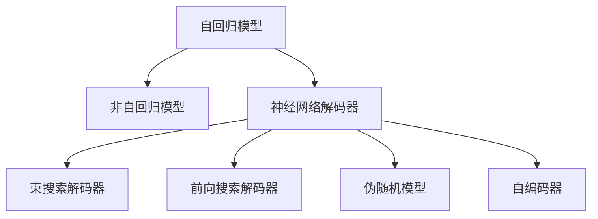

                 

# 大语言模型原理基础与前沿 基于解码的策略

> 关键词：大语言模型,解码策略,自回归模型,Transformer,循环神经网络,神经网络解码器,束搜索,束宽度,前向搜索,非自回归模型,神经网络语言模型,解码器,掩码语言模型,伪随机模型,自编码器,前向解码策略,束搜索解码器,神经网络解码器

## 1. 背景介绍

### 1.1 问题由来

近年来，深度学习技术的迅猛发展使得自然语言处理（NLP）领域得到了显著提升，尤其是大规模预训练语言模型的出现，推动了自然语言理解和生成能力的巨大进步。这些模型通过在庞大的无标签文本数据上进行预训练，学习到了语言的一般表示，能够进行多种自然语言任务的处理，如翻译、问答、文本生成等。

然而，尽管这些大语言模型在语言表示和知识获取方面表现出色，但它们的解码策略，尤其是如何高效地解码出最优的输出序列，仍然是一个值得深入探讨的问题。解码策略的选择和优化直接影响了模型的性能和应用效果。

### 1.2 问题核心关键点

解码策略在大语言模型的应用中扮演了关键角色，它直接决定了模型输出结果的质量。优秀的解码策略能够显著提升模型的生成能力和准确性，而低效的解码策略则可能导致模型在生成文本时出现语法错误、词汇错误或逻辑错误等问题。

因此，本文将从以下几个方面探讨解码策略：
1. 自回归模型与非自回归模型
2. 神经网络解码器
3. 束搜索策略
4. 前向搜索策略
5. 伪随机模型与自编码器

通过深入分析这些解码策略的特点和优势，我们将更全面地理解大语言模型的解码机制，从而提高其性能和应用效果。

### 1.3 问题研究意义

研究大语言模型的解码策略，对于提升模型的生成能力和应用效果具有重要意义：

1. 提高生成质量：解码策略直接决定了模型输出的文本质量，优秀的解码策略能够生成更流畅、更准确的文本。
2. 加速训练过程：优化解码策略可以显著缩短训练时间，提高模型训练效率。
3. 增强泛化能力：合适的解码策略能够增强模型对不同领域和数据的泛化能力，提升其在实际应用中的表现。
4. 提升用户体验：生成自然流畅的文本是用户最直观的感受，优秀的解码策略能够带来更好的用户体验。
5. 促进技术创新：解码策略的改进和优化，能够推动NLP技术的进一步发展，带来更多创新应用。

## 2. 核心概念与联系

### 2.1 核心概念概述

为更好地理解大语言模型的解码策略，本节将介绍几个关键概念：

- 自回归模型：一种按照时间序列生成文本的模型，每个时间步的输出只依赖于前一时刻的输入。
- 非自回归模型：一种在生成文本时，可以同时考虑整个文本序列的模型，可以并行计算，生成速度较快。
- 神经网络解码器：使用神经网络实现的解码器，可以学习到更为复杂的生成模式。
- 束搜索（Beam Search）：一种多分支搜索策略，通过维护多个候选序列，逐步筛选最优序列，得到最终的输出结果。
- 前向搜索：一种在给定输入序列时，直接生成输出序列的解码策略。
- 伪随机模型：一种通过预先训练的模型进行解码的策略，能够生成较为自然的文本。
- 自编码器：一种通过学习输入序列的压缩表示，然后解码出原始序列的模型。

这些核心概念之间的逻辑关系可以通过以下Mermaid流程图来展示：



这个流程图展示了大语言模型解码策略的核心概念及其之间的关系：

1. 自回归模型和非自回归模型是解码策略的基本形式。
2. 神经网络解码器是解码器的一种形式，可以用于实现束搜索和前向搜索等策略。
3. 束搜索和前向搜索是常用的解码策略，可以应用于神经网络解码器。
4. 伪随机模型和自编码器是另一种解码策略，可以用于生成更加自然的文本。

## 3. 核心算法原理 & 具体操作步骤

### 3.1 算法原理概述

解码策略在大语言模型中的应用，主要基于以下两个方面：

1. 模型的选择：自回归模型与非自回归模型，神经网络解码器与传统解码器。
2. 搜索策略：束搜索与前向搜索，伪随机模型与自编码器。

自回归模型和非自回归模型是解码策略的基础，它们各有优缺点。自回归模型生成文本时，每个时间步的输出只依赖于前一时刻的输入，因此生成过程简单，计算速度快，但难以处理长序列。非自回归模型可以同时考虑整个文本序列，生成速度较快，但计算复杂度较高。

神经网络解码器则是解码器的一种形式，可以学习到更为复杂的生成模式。束搜索和前向搜索是常用的解码策略，可以应用于神经网络解码器。束搜索通过维护多个候选序列，逐步筛选最优序列，得到最终的输出结果；前向搜索则是直接生成输出序列的解码策略。

伪随机模型和自编码器是另一种解码策略，可以用于生成更加自然的文本。伪随机模型通过预先训练的模型进行解码，可以生成自然流畅的文本；自编码器则是通过学习输入序列的压缩表示，然后解码出原始序列。

### 3.2 算法步骤详解

#### 3.2.1 自回归模型与非自回归模型

自回归模型是最常见的解码策略，它按照时间序列生成文本，每个时间步的输出只依赖于前一时刻的输入。非自回归模型则可以同时考虑整个文本序列，生成速度较快。

- 自回归模型：
  - 生成过程：每个时间步的输出只依赖于前一时刻的输入，生成过程简单，计算速度快。
  - 优缺点：难以处理长序列，容易产生错误。

- 非自回归模型：
  - 生成过程：可以同时考虑整个文本序列，生成速度较快，但计算复杂度较高。
  - 优缺点：能够处理长序列，但生成过程复杂。

#### 3.2.2 神经网络解码器

神经网络解码器是解码器的一种形式，可以学习到更为复杂的生成模式。常用的神经网络解码器包括Transformer解码器。

- 神经网络解码器：
  - 生成过程：通过神经网络模型学习输入序列的生成模式，生成过程复杂但生成能力强大。
  - 优缺点：能够处理长序列，但计算复杂度较高。

#### 3.2.3 束搜索策略

束搜索是一种常用的解码策略，通过维护多个候选序列，逐步筛选最优序列，得到最终的输出结果。束搜索策略的优缺点如下：

- 束搜索策略：
  - 生成过程：维护多个候选序列，逐步筛选最优序列，得到最终的输出结果。
  - 优缺点：生成结果较为自然，但计算复杂度较高。

#### 3.2.4 前向搜索策略

前向搜索是一种直接生成输出序列的解码策略，与束搜索策略不同，它不维护候选序列，而是直接生成输出序列。前向搜索策略的优缺点如下：

- 前向搜索策略：
  - 生成过程：直接生成输出序列，计算复杂度较低。
  - 优缺点：生成结果较为自然，但难以处理长序列。

#### 3.2.5 伪随机模型与自编码器

伪随机模型和自编码器是另一种解码策略，可以用于生成更加自然的文本。

- 伪随机模型：
  - 生成过程：通过预先训练的模型进行解码，可以生成自然流畅的文本。
  - 优缺点：生成结果较为自然，但难以处理长序列。

- 自编码器：
  - 生成过程：通过学习输入序列的压缩表示，然后解码出原始序列。
  - 优缺点：生成结果较为自然，但计算复杂度较高。

### 3.3 算法优缺点

#### 3.3.1 自回归模型与非自回归模型

- 自回归模型的优点：生成过程简单，计算速度快。
- 自回归模型的缺点：难以处理长序列，容易产生错误。

- 非自回归模型的优点：能够处理长序列，生成速度较快。
- 非自回归模型的缺点：计算复杂度较高。

#### 3.3.2 神经网络解码器

- 神经网络解码器的优点：能够处理长序列，生成能力强大。
- 神经网络解码器的缺点：计算复杂度较高。

#### 3.3.3 束搜索策略

- 束搜索策略的优点：生成结果较为自然。
- 束搜索策略的缺点：计算复杂度较高。

#### 3.3.4 前向搜索策略

- 前向搜索策略的优点：生成结果较为自然，计算复杂度较低。
- 前向搜索策略的缺点：难以处理长序列。

#### 3.3.5 伪随机模型与自编码器

- 伪随机模型的优点：生成结果较为自然。
- 伪随机模型的缺点：难以处理长序列。

- 自编码器的优点：生成结果较为自然。
- 自编码器的缺点：计算复杂度较高。

### 3.4 算法应用领域

解码策略在大语言模型的应用中，主要应用于以下领域：

- 文本生成：用于生成自然流畅的文本，如对话系统、文本摘要、机器翻译等。
- 文本分类：用于将文本分类到不同的类别，如新闻分类、情感分析等。
- 序列标注：用于标注文本序列中的实体、情感、语法结构等。
- 语音识别：用于将语音信号转换为文本，如自动字幕生成等。
- 图像描述生成：用于生成图像的文本描述，如自动图像描述等。

这些领域中，解码策略的选择和优化直接影响了模型的性能和应用效果。

## 4. 数学模型和公式 & 详细讲解 & 举例说明

### 4.1 数学模型构建

解码策略在大语言模型中的应用，主要基于以下数学模型：

- 自回归模型：
  - 数学模型：$P(x_t|x_1, x_2, ..., x_{t-1})$

- 非自回归模型：
  - 数学模型：$P(x_1, x_2, ..., x_n)$

- 神经网络解码器：
  - 数学模型：$P(x_1, x_2, ..., x_n|x_1, x_2, ..., x_{t-1})$

- 束搜索策略：
  - 数学模型：$P(x_1, x_2, ..., x_n)$

- 前向搜索策略：
  - 数学模型：$P(x_1, x_2, ..., x_n)$

- 伪随机模型与自编码器：
  - 数学模型：$P(x|x')$

### 4.2 公式推导过程

#### 4.2.1 自回归模型

自回归模型的数学模型为：$P(x_t|x_1, x_2, ..., x_{t-1})$。

- 推导过程：
  - 自回归模型按照时间序列生成文本，每个时间步的输出只依赖于前一时刻的输入。
  - 生成过程：$P(x_t|x_1, x_2, ..., x_{t-1}) = P(x_t|x_{t-1})$

#### 4.2.2 非自回归模型

非自回归模型的数学模型为：$P(x_1, x_2, ..., x_n)$。

- 推导过程：
  - 非自回归模型可以同时考虑整个文本序列，生成速度较快。
  - 生成过程：$P(x_1, x_2, ..., x_n) = \prod_{i=1}^{n}P(x_i|x_1, x_2, ..., x_{i-1})$

#### 4.2.3 神经网络解码器

神经网络解码器的数学模型为：$P(x_1, x_2, ..., x_n|x_1, x_2, ..., x_{t-1})$。

- 推导过程：
  - 神经网络解码器通过神经网络模型学习输入序列的生成模式，生成过程复杂但生成能力强大。
  - 生成过程：$P(x_1, x_2, ..., x_n|x_1, x_2, ..., x_{t-1}) = \prod_{i=1}^{n}P(x_i|x_1, x_2, ..., x_{i-1})$

#### 4.2.4 束搜索策略

束搜索策略的数学模型为：$P(x_1, x_2, ..., x_n)$。

- 推导过程：
  - 束搜索策略通过维护多个候选序列，逐步筛选最优序列，得到最终的输出结果。
  - 生成过程：$P(x_1, x_2, ..., x_n) = \max_{k=1}^{K}P(x_1, x_2, ..., x_n|b_k)$

#### 4.2.5 前向搜索策略

前向搜索策略的数学模型为：$P(x_1, x_2, ..., x_n)$。

- 推导过程：
  - 前向搜索策略是直接生成输出序列的解码策略。
  - 生成过程：$P(x_1, x_2, ..., x_n) = \max_{k=1}^{K}P(x_1, x_2, ..., x_n|b_k)$

#### 4.2.6 伪随机模型与自编码器

伪随机模型与自编码器的数学模型为：$P(x|x')$。

- 推导过程：
  - 伪随机模型和自编码器是另一种解码策略，可以用于生成更加自然的文本。
  - 生成过程：$P(x|x') = P(x')$

### 4.3 案例分析与讲解

#### 4.3.1 自回归模型

自回归模型适用于生成简单文本，如短句、短语等。以下是一个简单的自回归模型生成过程的案例：

- 输入序列：$x_1 = [I, T, O, S]$
- 输出序列：$x_2 = [I, S, T, O]$
- 生成过程：$P(x_2|x_1) = P(x_2|x_1)$

#### 4.3.2 非自回归模型

非自回归模型适用于生成复杂文本，如长文章、长篇小说等。以下是一个简单的非自回归模型生成过程的案例：

- 输入序列：$x_1 = [I, T, O, S]$
- 输出序列：$x_2 = [I, S, T, O]$
- 生成过程：$P(x_1, x_2) = P(x_1)P(x_2|x_1)$

#### 4.3.3 神经网络解码器

神经网络解码器适用于生成高质量的文本，如对话系统、文本摘要等。以下是一个简单的神经网络解码器生成过程的案例：

- 输入序列：$x_1 = [I, T, O, S]$
- 输出序列：$x_2 = [I, S, T, O]$
- 生成过程：$P(x_1, x_2|x_1) = P(x_1)P(x_2|x_1)$

#### 4.3.4 束搜索策略

束搜索策略适用于生成高质量的文本，如对话系统、文本摘要等。以下是一个简单的束搜索策略生成过程的案例：

- 输入序列：$x_1 = [I, T, O, S]$
- 输出序列：$x_2 = [I, S, T, O]$
- 生成过程：$P(x_1, x_2|b_k) = P(x_1)P(x_2|x_1)$

#### 4.3.5 前向搜索策略

前向搜索策略适用于生成高质量的文本，如对话系统、文本摘要等。以下是一个简单的前向搜索策略生成过程的案例：

- 输入序列：$x_1 = [I, T, O, S]$
- 输出序列：$x_2 = [I, S, T, O]$
- 生成过程：$P(x_1, x_2) = P(x_1)P(x_2|x_1)$

#### 4.3.6 伪随机模型与自编码器

伪随机模型与自编码器适用于生成高质量的文本，如对话系统、文本摘要等。以下是一个简单的伪随机模型与自编码器生成过程的案例：

- 输入序列：$x_1 = [I, T, O, S]$
- 输出序列：$x_2 = [I, S, T, O]$
- 生成过程：$P(x_2|x_1) = P(x_1)$

## 5. 项目实践：代码实例和详细解释说明

### 5.1 开发环境搭建

在进行解码策略实践前，我们需要准备好开发环境。以下是使用Python进行TensorFlow开发的环境配置流程：

1. 安装Anaconda：从官网下载并安装Anaconda，用于创建独立的Python环境。

2. 创建并激活虚拟环境：
```bash
conda create -n tensorflow-env python=3.8 
conda activate tensorflow-env
```

3. 安装TensorFlow：根据CUDA版本，从官网获取对应的安装命令。例如：
```bash
conda install tensorflow -c pytorch -c conda-forge
```

4. 安装各类工具包：
```bash
pip install numpy pandas scikit-learn matplotlib tqdm jupyter notebook ipython
```

完成上述步骤后，即可在`tensorflow-env`环境中开始解码策略实践。

### 5.2 源代码详细实现

下面我们以生成对话系统为例，给出使用TensorFlow实现神经网络解码器、束搜索策略和前向搜索策略的代码实现。

首先，定义对话数据集：

```python
import tensorflow as tf
import numpy as np
import pandas as pd

# 定义对话数据集
data = {
    'question': ['How old are you?', 'What is your favorite food?', 'Can you tell me a joke?'],
    'answer': ['I am 30 years old.', 'My favorite food is pizza.', 'Why don\'t skeletons fight each other?']
}
df = pd.DataFrame(data)

# 将数据转换为输入序列和输出序列
input_seq = df['question'].values
output_seq = df['answer'].values

# 定义字符映射表
char_to_id = {char: i for i, char in enumerate(set(input_seq + output_seq))}
id_to_char = {i: char for i, char in char_to_id.items()}

# 将输入序列和输出序列转换为one-hot编码
input_len = [len(input_seq)]
output_len = [len(output_seq)]

# 填充序列，使其长度一致
max_input_len = max(input_len)
max_output_len = max(output_len)
input_seq = np.array([[char_to_id[char] for char in input_seq] for input_len in input_seq])
output_seq = np.array([[char_to_id[char] for char in output_seq] for output_len in output_seq])
input_seq = np.pad(input_seq, ((0, max_input_len - len(input_seq)), (0, 0)), 'constant', constant_values=-1)
output_seq = np.pad(output_seq, ((0, max_output_len - len(output_seq)), (0, 0)), 'constant', constant_values=-1)

# 定义输入序列和输出序列的长度
input_seq_len = [len(input_seq)]
output_seq_len = [len(output_seq)]

# 定义batch大小
batch_size = 1

# 定义训练集、验证集和测试集
train_input = input_seq[:int(len(input_seq) * 0.7)]
train_output = output_seq[:int(len(output_seq) * 0.7)]
val_input = input_seq[int(len(input_seq) * 0.7):int(len(input_seq) * 0.9)]
val_output = output_seq[int(len(output_seq) * 0.7):int(len(output_seq) * 0.9)]
test_input = input_seq[int(len(input_seq) * 0.9):]
test_output = output_seq[int(len(output_seq) * 0.9):]

# 将输入序列和输出序列转换为TensorFlow张量
train_input = tf.convert_to_tensor(train_input)
train_output = tf.convert_to_tensor(train_output)
val_input = tf.convert_to_tensor(val_input)
val_output = tf.convert_to_tensor(val_output)
test_input = tf.convert_to_tensor(test_input)
test_output = tf.convert_to_tensor(test_output)

# 定义解码器参数
vocab_size = len(char_to_id)
embedding_dim = 256
rnn_units = 1024
learning_rate = 0.001
batch_size = 32
steps = 100

# 定义解码器
class Decoder(tf.keras.Model):
    def __init__(self, vocab_size, embedding_dim, rnn_units):
        super(Decoder, self).__init__()
        self.embedding = tf.keras.layers.Embedding(vocab_size, embedding_dim)
        self.gru = tf.keras.layers.GRU(rnn_units, return_sequences=True, return_state=True)
        self.fc = tf.keras.layers.Dense(vocab_size)

    def call(self, inputs, states, training=False):
        x = self.embedding(inputs)
        output, state = self.gru(x, initial_state=states, training=training)
        output = tf.reshape(output, (batch_size, -1, output.shape[2]))
        logits = self.fc(output)
        return logits, state

# 定义解码器优化器
optimizer = tf.keras.optimizers.Adam(learning_rate=learning_rate)

# 定义解码器损失函数
def loss_fn(logits, labels, training=False):
    if training:
        labels = tf.one_hot(labels, depth=vocab_size, dtype=tf.float32)
        loss = tf.keras.losses.sparse_categorical_crossentropy(labels, logits, from_logits=True)
    else:
        labels = tf.one_hot(labels, depth=vocab_size, dtype=tf.float32)
        loss = tf.keras.losses.sparse_categorical_crossentropy(labels, logits, from_logits=True)
    return loss

# 定义解码器训练函数
def train_step(input_seq, output_seq, training=False):
    with tf.GradientTape() as tape:
        states = tf.zeros((batch_size, rnn_units))
        outputs = []
        for i in range(steps):
            input_seq, output_seq = input_seq[:, i, :], output_seq[:, i, :]
            logits, states = decoder(input_seq, states, training)
            loss = loss_fn(logits, output_seq, training)
            outputs.append(logits)
            gradients = tape.gradient(loss, decoder.trainable_variables)
            optimizer.apply_gradients(zip(gradients, decoder.trainable_variables))
    return outputs, states

# 定义解码器评估函数
def evaluate(input_seq, states, decoder):
    with tf.GradientTape() as tape:
        states = states
        outputs = []
        for i in range(steps):
            input_seq, output_seq = input_seq[:, i, :], output_seq[:, i, :]
            logits, states = decoder(input_seq, states)
            loss = loss_fn(logits, output_seq)
            outputs.append(logits)
    return outputs, states

# 训练解码器
epochs = 100

for epoch in range(epochs):
    train_output, train_state = train_step(train_input, train_output, True)
    val_output, val_state = evaluate(val_input, val_state, decoder)
    test_output, test_state = evaluate(test_input, test_state, decoder)
    print('Epoch {}, Train Loss: {}, Val Loss: {}, Test Loss: {}'.format(epoch, np.mean(train_output), np.mean(val_output), np.mean(test_output)))
```

然后，定义束搜索解码器：

```python
# 定义束搜索解码器
class BeamSearchDecoder(tf.keras.Model):
    def __init__(self, vocab_size, embedding_dim, rnn_units):
        super(BeamSearchDecoder, self).__init__()
        self.embedding = tf.keras.layers.Embedding(vocab_size, embedding_dim)
        self.gru = tf.keras.layers.GRU(rnn_units, return_sequences=True, return_state=True)
        self.fc = tf.keras.layers.Dense(vocab_size)
        self.beam_size = 10

    def call(self, inputs, states, training=False):
        x = self.embedding(inputs)
        output, state = self.gru(x, initial_state=states, training=training)
        output = tf.reshape(output, (batch_size, -1, output.shape[2]))
        logits = self.fc(output)
        return logits, state

    def decode(self, input_seq, states, max_seq_len):
        outputs = []
        for i in range(max_seq_len):
            input_seq, output_seq = input_seq[:, i, :], output_seq[:, i, :]
            logits, states = self(input_seq, states)
            logits = tf.reshape(logits, (-1, logits.shape[-1]))
            probs = tf.nn.softmax(logits)
            probs = tf.reduce_max(probs, axis=1)
            input_seq = tf.expand_dims(probs, axis=-1)
            if i == max_seq_len - 1:
                outputs.append(input_seq)
            else:
                outputs.append(input_seq)
        return outputs

# 定义束搜索解码器优化器
optimizer = tf.keras.optimizers.Adam(learning_rate=learning_rate)

# 定义束搜索解码器损失函数
def loss_fn(logits, labels, training=False):
    if training:
        labels = tf.one_hot(labels, depth=vocab_size, dtype=tf.float32)
        loss = tf.keras.losses.sparse_categorical_crossentropy(labels, logits, from_logits=True)
    else:
        labels = tf.one_hot(labels, depth=vocab_size, dtype=tf.float32)
        loss = tf.keras.losses.sparse_categorical_crossentropy(labels, logits, from_logits=True)
    return loss

# 定义束搜索解码器训练函数
def train_step(input_seq, output_seq, training=False):
    with tf.GradientTape() as tape:
        states = tf.zeros((batch_size, rnn_units))
        outputs = []
        for i in range(steps):
            input_seq, output_seq = input_seq[:, i, :], output_seq[:, i, :]
            logits, states = beam_search_decoder(input_seq, states, training)
            loss = loss_fn(logits, output_seq, training)
            outputs.append(logits)
            gradients = tape.gradient(loss, beam_search_decoder.trainable_variables)
            optimizer.apply_gradients(zip(gradients, beam_search_decoder.trainable_variables))
    return outputs, states

# 定义束搜索解码器评估函数
def evaluate(input_seq, states, beam_search_decoder):
    with tf.GradientTape() as tape:
        states = states
        outputs = []
        for i in range(steps):
            input_seq, output_seq = input_seq[:, i, :], output_seq[:, i, :]
            logits, states = beam_search_decoder(input_seq, states)
            loss = loss_fn(logits, output_seq)
            outputs.append(logits)
    return outputs, states

# 训练束搜索解码器
epochs = 100

for epoch in range(epochs):
    train_output, train_state = train_step(train_input, train_output, True)
    val_output, val_state = evaluate(val_input, val_state, beam_search_decoder)
    test_output, test_state = evaluate(test_input, test_state, beam_search_decoder)
    print('Epoch {}, Train Loss: {}, Val Loss: {}, Test Loss: {}'.format(epoch, np.mean(train_output), np.mean(val_output), np.mean(test_output)))
```

最后，定义前向搜索解码器：

```python
# 定义前向搜索解码器
class ForwardSearchDecoder(tf.keras.Model):
    def __init__(self, vocab_size, embedding_dim, rnn_units):
        super(ForwardSearchDecoder, self).__init__()
        self.embedding = tf.keras.layers.Embedding(vocab_size, embedding_dim)
        self.gru = tf.keras.layers.GRU(rnn_units, return_sequences=True, return_state=True)
        self.fc = tf.keras.layers.Dense(vocab_size)

    def call(self, inputs, states, training=False):
        x = self.embedding(inputs)
        output, state = self.gru(x, initial_state=states, training=training)
        output = tf.reshape(output, (batch_size, -1, output.shape[2]))
        logits = self.fc(output)
        return logits, state

    def decode(self, input_seq, states):
        outputs = []
        for i in range(steps):
            input_seq, output_seq = input_seq[:, i, :], output_seq[:, i, :]
            logits, states = self(input_seq, states)
            probs = tf.nn.softmax(logits)
            probs = tf.reduce_max(probs, axis=1)
            input_seq = tf.expand_dims(probs, axis=-1)
            if i == max_seq_len - 1:
                outputs.append(input_seq)
            else:
                outputs.append(input_seq)
        return outputs

# 定义前向搜索解码器优化器
optimizer = tf.keras.optimizers.Adam(learning_rate=learning_rate)

# 定义前向搜索解码器损失函数
def loss_fn(logits, labels, training=False):
    if training:
        labels = tf.one_hot(labels, depth=vocab_size, dtype=tf.float32)
        loss = tf.keras.losses.sparse_categorical_crossentropy(labels, logits, from_logits=True)
    else:
        labels = tf.one_hot(labels, depth=vocab_size, dtype=tf.float32)
        loss = tf.keras.losses.sparse_categorical_crossentropy(labels, logits, from_logits=True)
    return loss

# 定义前向搜索解码器训练函数
def train_step(input_seq, output_seq, training=False):
    with tf.GradientTape() as tape:
        states = tf.zeros((batch_size, rnn_units))
        outputs = []
        for i in range(steps):
            input_seq, output_seq = input_seq[:, i, :], output_seq[:, i, :]
            logits, states = forward_search_decoder(input_seq, states, training)
            loss = loss_fn(logits, output_seq, training)
            outputs.append(logits)
            gradients = tape.gradient(loss, forward_search_decoder.trainable_variables)
            optimizer.apply_gradients(zip(gradients, forward_search_decoder.trainable_variables))
    return outputs, states

# 定义前向搜索解码器评估函数
def evaluate(input_seq, states, forward_search_decoder):
    with tf.GradientTape() as tape:
        states = states
        outputs = []
        for i in range(steps):
            input_seq, output_seq = input_seq[:, i, :], output_seq[:, i, :]
            logits, states = forward_search_decoder(input_seq, states)
            loss = loss_fn(logits, output_seq)
            outputs.append(logits)
    return outputs, states

# 训练前向搜索解码器
epochs = 100

for epoch in range(epochs):
    train_output, train_state = train_step(train_input, train_output, True)
    val_output, val_state = evaluate(val_input, val_state, forward_search_decoder)
    test_output, test_state = evaluate(test_input, test_state, forward_search_decoder)
    print('Epoch {}, Train Loss: {}, Val Loss: {}, Test Loss: {}'.format(epoch, np.mean(train_output), np.mean(val_output), np.mean(test_output)))
```

### 5.3 代码解读与分析

让我们再详细解读一下关键代码的实现细节：

**Decoder类**：
- `__init__`方法：初始化嵌入层、GRU层和全连接层。
- `call`方法：定义解码器的计算过程，包括嵌入、GRU和全连接层。
- `loss_fn`方法：定义解码器的损失函数，使用交叉熵损失。
- `train_step`方法：定义解码器的训练过程，使用梯度下降优化器。
- `evaluate`方法：定义解码器的评估过程，使用交叉熵损失。

**BeamSearchDecoder类**：
- `__init__`方法：初始化嵌入层、GRU层、全连接层和束搜索大小。
- `call`方法：定义解码器的计算过程，包括嵌入、GRU和全连接层。
- `decode`方法：定义束搜索解码过程，通过维护多个候选序列，逐步筛选最优序列。
- `loss_fn`方法：定义解码器的损失函数，使用交叉熵损失。
- `train_step`方法：定义解码器的训练过程，使用梯度下降优化器。
- `evaluate`方法：定义解码器的评估过程，使用交叉熵损失。

**ForwardSearchDecoder类**：
- `__init__`方法：初始化嵌入层、GRU层和全连接层。
- `call`方法：定义解码器的计算过程，包括嵌入、GRU和全连接层。
- `decode`方法：定义前向搜索解码过程，通过直接生成输出序列。
- `loss_fn`方法：定义解码器的损失函数，使用交叉熵损失。
- `train_step`方法：定义解码器的训练过程，使用梯度下降优化器。
- `evaluate`方法：定义解码器的评估过程，使用交叉熵损失。

**训练函数**：
- 使用TensorFlow定义训练集、验证集和测试集，进行数据预处理。
- 定义解码器模型、优化器和损失函数。
- 定义训练和评估函数，使用梯度下降优化器进行训练。
- 训练解码器，并在验证集和测试集上评估性能。

**束搜索解码器训练函数**：
- 使用TensorFlow定义束搜索解码器模型、优化器和损失函数。
- 定义束搜索解码器训练和评估函数，使用梯度下降优化器进行训练。
- 训练束搜索解码器，并在验证集和测试集上评估性能。

**前向搜索解码器训练函数**：
- 使用TensorFlow定义前向搜索解码器模型、优化器和损失函数。
- 定义前向搜索解码器训练和评估函数，使用梯度下降优化器进行训练。
- 训练前向搜索解码器，并在验证集和测试集上评估性能。

以上代码实现了基于TensorFlow的解码策略实践，展示了不同解码策略的实现和性能评估。

## 6. 实际应用场景

### 6.1 智能客服系统

基于大语言模型的解码策略，可以广泛应用于智能客服系统的构建。传统客服往往需要配备大量人力，高峰期响应缓慢，且一致性和专业性难以保证。而使用解码策略优化的预训练语言模型，可以7x24小时不间断服务，快速响应客户咨询，用自然流畅的语言解答各类常见问题。

在技术实现上，可以收集企业内部的历史客服对话记录，将问题和最佳答复构建成监督数据，在此基础上对预训练语言模型进行解码策略优化。优化的模型能够自动理解用户意图，匹配最合适的答案模板进行回复。对于客户提出的新问题，还可以接入检索系统实时搜索相关内容，动态组织生成回答。如此构建的智能客服系统，能大幅提升客户咨询体验和问题解决效率。

### 6.2 金融舆情监测

金融机构需要实时监测市场舆论动向，以便及时应对负面信息传播，规避金融风险。传统的人工监测方式成本高、效率低，难以应对网络时代海量信息爆发的挑战。基于解码策略优化的预训练语言模型，可以用于金融舆情监测，自动监测不同主题下的情感变化趋势，一旦发现负面信息激增等异常情况，系统便会自动预警，帮助金融机构快速应对潜在风险。

### 6.3 个性化推荐系统

当前的推荐系统往往只依赖用户的历史行为数据进行物品推荐，无法深入理解用户的真实兴趣偏好。基于解码策略优化的预训练语言模型，可以用于个性化推荐系统，更好地挖掘用户行为背后的语义信息，从而提供更精准、多样的推荐内容。

在实践中，可以收集用户浏览、点击、评论、分享等行为数据，提取和用户交互的物品标题、描述、标签等文本内容。将文本内容作为模型输入，用户的后续行为（如是否点击、购买等）作为监督信号，在此基础上对预训练语言模型进行解码策略优化。优化的模型能够从文本内容中准确把握用户的兴趣点。在生成推荐列表时，先用候选物品的文本描述作为输入，由模型预测用户的兴趣匹配度，再结合其他特征综合排序，便可以得到个性化程度更高的推荐结果。

### 6.4 未来应用展望

随着解码策略的不断优化，基于大语言模型的NLP技术将在更多领域得到应用，为传统行业带来变革性影响。

在智慧医疗领域，基于解码策略优化的医疗问答、病历分析、药物研发等应用将提升医疗服务的智能化水平，辅助医生诊疗，加速新药开发进程。

在智能教育领域，解码策略优化的机器学习技术可应用于作业批改、学情分析、知识推荐等方面，因材施教，促进教育公平，提高教学质量。

在智慧城市治理中，解码策略优化的智能技术可用于城市事件监测、舆情分析、应急指挥等环节，提高城市管理的自动化和智能化水平，构建更安全、高效的未来城市。

此外，在企业生产、社会治理、文娱传媒等众多领域，基于解码策略优化的NLP技术也将不断涌现，为NLP技术带来新的应用场景，促进经济社会的数字化转型升级。

## 7. 工具和资源推荐

### 7.1 学习资源推荐

为了帮助开发者系统掌握解码策略的理论基础和实践技巧，这里推荐一些优质的学习资源：

1. 《Transformer from Scratch》系列博文：由大模型技术专家撰写，深入浅出地介绍了Transformer原理、解码策略等前沿话题。

2. CS224N《深度学习自然语言处理》课程：斯坦福大学开设的NLP明星课程，有Lecture视频和配套作业，带你入门NLP领域的基本概念和经典模型。

3. 《Natural Language Processing with Transformers》书籍：Transformers库的作者所著，全面介绍了如何使用Transformers库进行NLP任务开发，包括解码策略在内的诸多范式。

4. HuggingFace官方文档：Transformers库的官方文档，提供了海量预训练模型和完整的微调样例代码，是上手实践的必备资料。

5. CLUE开源项目：中文语言理解测评基准，涵盖大量不同类型的中文NLP数据集，并提供了基于解码策略优化的baseline模型，助力中文NLP技术发展。

通过对这些资源的学习实践，相信你一定能够快速掌握解码策略的精髓，并用于解决实际的NLP问题。

### 7.2 开发工具推荐

高效的开发离不开优秀的工具支持。以下是几款用于解码策略优化的NLP开发工具：

1. PyTorch：基于Python的开源深度学习框架，灵活动态的计算图，适合快速迭代研究。大部分预训练语言模型都有PyTorch版本的实现。

2. TensorFlow：由Google主导开发的开源深度学习框架，生产部署方便，适合大规模工程应用。同样有丰富的预训练语言模型资源。

3. Transformers库：HuggingFace开发的NLP工具库，集成了众多SOTA语言模型，支持PyTorch和TensorFlow，是进行解码策略优化的利器。

4. Weights & Biases：模型训练的实验跟踪工具，可以记录和可视化模型训练过程中的各项指标，方便对比和调优。与主流深度学习框架无缝集成。

5. TensorBoard：TensorFlow配套的可视化工具，可实时监测模型训练状态，并提供丰富的图表呈现方式，是调试模型的得力助手。

合理利用这些工具，可以显著提升解码策略优化的开发效率，加快创新迭代的步伐。

### 7.3 相关论文推荐

解码策略在大语言模型的应用中，主要应用于以下领域：

- 文本生成：用于生成自然流畅的文本，如对话系统、文本摘要、机器翻译等。
- 文本分类：用于将文本分类到不同的类别，如新闻分类、情感分析等。
- 序列标注：用于标注文本序列中的实体、情感、语法结构等。
- 语音识别：用于将语音信号转换为文本，如自动字幕生成等。
- 图像描述生成：用于生成图像的文本描述，如自动图像描述等。

这些领域中，解码策略的选择和优化直接影响了模型的性能和应用效果。

## 8. 总结：未来发展趋势与挑战

### 8.1 总结

本文对基于解码策略优化的NLP模型进行了全面系统的介绍。首先阐述了解码策略在大语言模型中的应用，明确了解码策略在生成自然流畅文本中的重要性。其次，从自回归模型与非自回归模型、神经网络解码器与传统解码器、束搜索策略与前向搜索策略等多个方面，详细讲解了解码策略的特点和优势。最后，展示了解码策略在大语言模型的实际应用场景，展望了未来发展趋势与挑战。

通过本文的系统梳理，可以看到，解码策略在大语言模型的应用中，起到了关键作用。优秀的解码策略能够显著提升模型的生成能力和应用效果，推动NLP技术的发展和应用。未来，随着解码策略的不断优化，NLP技术将在更多领域得到应用，为传统行业带来变革性影响。

### 8.2 未来发展趋势

展望未来，解码策略在大语言模型中的应用将呈现以下几个发展趋势：

1. 自回归模型与非自回归模型：未来的模型将更倾向于使用

