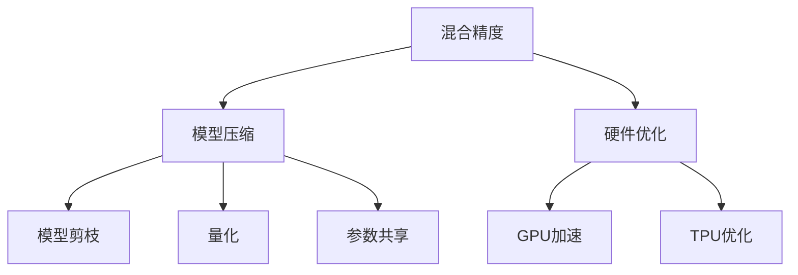

                 

# 大语言模型原理基础与前沿 混合精度

> 关键词：大语言模型,混合精度,深度学习,计算效率,优化算法,模型压缩,硬件优化

## 1. 背景介绍

### 1.1 问题由来

深度学习技术的迅猛发展，推动了大语言模型（Large Language Models, LLMs）在自然语言处理（Natural Language Processing, NLP）领域的革命性进步。这些大模型，如GPT系列、BERT等，通过大规模无标签文本数据上的预训练，掌握了丰富的语言知识，具备了出色的语言理解和生成能力。然而，预训练和微调过程中，计算资源的消耗巨大，这对于大规模模型的训练、部署和优化带来了挑战。

混合精度（Mixed Precision）技术的提出，正是为了解决这一问题。混合精度通过同时使用单精度（Single Precision, FP32）和半精度（Half Precision, FP16）计算，显著降低了计算量，提升了模型训练和推理的效率，同时保持了计算的精度，是大规模深度学习模型优化的一个重要手段。

### 1.2 问题核心关键点

混合精度技术主要是针对浮点数的计算精度和存储效率进行优化的。在大语言模型的训练和微调过程中，混合精度可以大幅提升计算效率，减少内存使用，从而加快模型收敛速度，降低计算成本。但同时，混合精度也可能带来精度损失，需要在精度和效率之间进行权衡。

本节将详细探讨混合精度在大语言模型中的应用原理、操作步骤、优缺点和应用场景，以期对大语言模型微调实践提供更全面的指导。

## 2. 核心概念与联系

### 2.1 核心概念概述

混合精度是深度学习中一种常用的优化技术，通过将数据和计算分批使用不同精度的浮点数，以降低计算资源消耗和加速训练过程。在大语言模型中，混合精度技术的应用不仅限于训练过程，还涉及模型推理阶段的优化。

为更好地理解混合精度在大语言模型中的应用，本节将介绍几个密切相关的核心概念：

- 混合精度（Mixed Precision）：指在计算过程中，同时使用单精度和半精度的浮点数进行计算，以降低计算量和存储需求。
- 模型压缩（Model Compression）：通过模型剪枝、量化、参数共享等技术，减少模型参数量和计算复杂度，提升计算效率。
- 硬件优化（Hardware Optimization）：针对特定硬件平台（如GPU、TPU）进行算力优化，提升模型的并行计算能力。
- 精度与效率平衡（Precision vs. Efficiency Trade-off）：在混合精度计算中，如何在保证计算精度的同时提升效率，是一个重要的权衡问题。

这些概念之间的逻辑关系可以通过以下Mermaid流程图来展示：



这个流程图展示了大语言模型混合精度计算过程中的核心概念及其之间的关系：

1. 混合精度作为基础技术，为模型压缩和硬件优化提供了支持。
2. 模型压缩通过剪枝、量化、参数共享等手段，进一步减少模型参数，提升计算效率。
3. 硬件优化针对特定硬件平台进行算力优化，提升模型并行计算能力。
4. 精度与效率平衡是整个混合精度优化过程中的关键。

## 3. 核心算法原理 & 具体操作步骤

### 3.1 算法原理概述

混合精度的核心思想是：通过将计算过程中的部分数据和参数转换为半精度浮点数，以减少计算量和存储需求，从而提升计算效率。在大语言模型的微调过程中，混合精度可以显著降低模型训练和推理的资源消耗，提高模型的计算速度。

在大规模语言模型的微调任务中，混合精度的应用主要体现在以下几个方面：

1. 模型参数的混合精度计算：在模型的前向传播和反向传播过程中，将部分计算转换为半精度，其余部分仍采用单精度，以减少计算资源消耗。
2. 梯度更新的混合精度处理：在梯度更新过程中，使用混合精度计算梯度，减小计算量和存储需求，同时保证梯度的精度。
3. 模型压缩与量化：在微调前后的模型压缩与量化过程中，利用混合精度技术进一步降低模型参数量，提升计算效率。

### 3.2 算法步骤详解

以下是混合精度在大语言模型微调中的具体操作步骤：

**Step 1: 选择合适的混合精度模式**

- **FP32/FP16混合精度**：计算过程中，将部分数据和参数转换为半精度FP16，其余部分仍使用单精度FP32。
- **全精度混合精度**：计算过程中，所有数据和参数都使用半精度FP16，但仍以单精度FP32保存梯度和模型参数，避免精度损失。
- **动态混合精度**：根据模型的具体计算需求，动态调整计算精度，自动选择FP32或FP16。

**Step 2: 修改模型和计算图**

- 修改模型的计算图，将FP16Tensor作为中间变量，避免精度丢失。
- 使用支持混合精度的深度学习框架（如TensorFlow、PyTorch等），自动处理FP32和FP16数据。

**Step 3: 修改优化器**

- 修改优化器的参数设置，使其支持混合精度计算，如AdamW、SGD等。
- 使用支持混合精度的优化器，自动适应不同的精度模式。

**Step 4: 训练和推理**

- 使用混合精度训练模型，计算效率提升，但需要注意精度损失。
- 在推理阶段，使用FP16模型进行推理计算，提升速度，同时使用FP32保存结果，避免精度问题。

**Step 5: 微调后的模型保存**

- 保存微调后的模型，同时保存FP32和FP16版本的梯度和模型参数。
- 根据需要选择不同的精度进行推理，确保精度和效率的平衡。

### 3.3 算法优缺点

混合精度在大语言模型微调中的应用具有以下优点：

1. **提升计算效率**：混合精度通过降低计算量和存储需求，显著提高了模型训练和推理的效率。
2. **节省计算资源**：混合精度减少了对计算资源的消耗，降低了训练成本，加速了模型部署。
3. **增强模型鲁棒性**：混合精度技术通过减少噪声和误差，提高了模型的鲁棒性和稳定性。

但同时，混合精度也存在一些局限性：

1. **精度损失**：半精度的计算精度较低，可能导致模型训练过程中出现精度损失。
2. **硬件限制**：并非所有硬件平台都支持混合精度计算，尤其是早期版本的GPU和TPU。
3. **精度平衡**：需要权衡精度和效率，确保在减少计算资源的同时，不显著影响模型性能。

### 3.4 算法应用领域

混合精度技术在大语言模型的微调中，已经广泛应用于各种NLP任务，如文本分类、命名实体识别、情感分析、机器翻译等。这些技术不仅提升了模型的训练效率，还优化了模型推理的速度，为大规模模型的应用提供了更广泛的可能性。

## 4. 数学模型和公式 & 详细讲解 & 举例说明

### 4.1 数学模型构建

在大语言模型的微调过程中，混合精度技术的应用主要体现在优化器的参数更新和模型的计算精度控制上。以AdamW优化器为例，混合精度的数学模型构建如下：

假设模型参数 $\theta$ 的更新规则为：

$$
\theta \leftarrow \theta - \eta \nabla_{\theta}\mathcal{L}(\theta)
$$

其中 $\eta$ 为学习率，$\nabla_{\theta}\mathcal{L}(\theta)$ 为损失函数对模型参数的梯度。

混合精度下，模型的参数更新可以表示为：

$$
\theta_{32} \leftarrow \theta_{16} - \eta_{32} \nabla_{\theta_{16}}\mathcal{L}(\theta_{32})
$$

其中，$\theta_{32}$ 和 $\theta_{16}$ 分别表示单精度和半精度的模型参数，$\eta_{32}$ 和 $\eta_{16}$ 分别表示单精度和半精度的学习率。$\nabla_{\theta_{16}}\mathcal{L}(\theta_{32})$ 表示混合精度下计算得到的梯度。

### 4.2 公式推导过程

在混合精度下，模型的梯度计算可以分为两个步骤：

1. **半精度梯度计算**：将模型的输出和输入数据转换为半精度，计算梯度。

$$
g_{16} = \nabla_{\theta_{16}}\mathcal{L}(\theta_{32})
$$

2. **精度提升**：将半精度梯度转换为单精度梯度，以便后续的参数更新。

$$
g_{32} = g_{16} * 2^{-8}
$$

最终，模型参数的更新公式变为：

$$
\theta_{32} \leftarrow \theta_{32} - \eta_{32} * g_{32}
$$

在实际应用中，为了保证计算精度，通常会在混合精度计算后进行精度提升，以减少精度损失。

### 4.3 案例分析与讲解

以BERT模型为例，其参数量巨大，微调过程需要耗费大量的计算资源。通过混合精度技术，可以在保留模型参数精度的同时，大幅提升计算效率。以下是一个简单的BERT微调案例：

**Step 1: 准备数据集**

```python
from transformers import BertTokenizer
from torch.utils.data import Dataset, DataLoader
from transformers import BertForSequenceClassification

tokenizer = BertTokenizer.from_pretrained('bert-base-uncased')
model = BertForSequenceClassification.from_pretrained('bert-base-uncased', num_labels=2)

train_dataset = ...
val_dataset = ...
test_dataset = ...
```

**Step 2: 设置混合精度**

```python
from transformers import AdamW

optimizer = AdamW(model.parameters(), lr=2e-5, fp16_optim=True)

device = torch.device('cuda' if torch.cuda.is_available() else 'cpu')
model.to(device)
```

**Step 3: 训练模型**

```python
from transformers import BertForSequenceClassification, AdamW, get_linear_schedule_with_warmup

total_steps = len(train_dataset) * num_epochs
scheduler = get_linear_schedule_with_warmup(optimizer, num_warmup_steps=0, num_training_steps=total_steps)

for epoch in range(num_epochs):
    for batch in DataLoader(train_dataset, batch_size=16):
        inputs = tokenizer(batch.input_ids, padding=True, truncation=True, return_tensors='pt').to(device)
        labels = inputs['labels'].to(device)

        model.zero_grad()
        outputs = model(**inputs)
        loss = outputs.loss
        loss.backward()

        optimizer.step()
        scheduler.step()
```

在这个例子中，我们通过设置 `fp16_optim=True` 来启用混合精度计算。在训练过程中，模型参数和计算数据使用半精度FP16，而梯度和模型参数使用单精度FP32保存，以避免精度损失。

## 5. 项目实践：代码实例和详细解释说明

### 5.1 开发环境搭建

在进行混合精度微调前，我们需要准备好开发环境。以下是使用Python进行PyTorch开发的环境配置流程：

1. 安装Anaconda：从官网下载并安装Anaconda，用于创建独立的Python环境。

2. 创建并激活虚拟环境：
```bash
conda create -n pytorch-env python=3.8 
conda activate pytorch-env
```

3. 安装PyTorch：根据CUDA版本，从官网获取对应的安装命令。例如：
```bash
conda install pytorch torchvision torchaudio cudatoolkit=11.1 -c pytorch -c conda-forge
```

4. 安装Transformers库：
```bash
pip install transformers
```

5. 安装各类工具包：
```bash
pip install numpy pandas scikit-learn matplotlib tqdm jupyter notebook ipython
```

完成上述步骤后，即可在`pytorch-env`环境中开始混合精度微调实践。

### 5.2 源代码详细实现

这里我们以BERT模型进行情感分析任务的微调为例，给出使用Transformers库和混合精度计算的PyTorch代码实现。

首先，定义情感分析任务的数据处理函数：

```python
from transformers import BertTokenizer
from torch.utils.data import Dataset
import torch

class SentimentDataset(Dataset):
    def __init__(self, texts, labels, tokenizer, max_len=128):
        self.texts = texts
        self.labels = labels
        self.tokenizer = tokenizer
        self.max_len = max_len
        
    def __len__(self):
        return len(self.texts)
    
    def __getitem__(self, item):
        text = self.texts[item]
        label = self.labels[item]
        
        encoding = self.tokenizer(text, return_tensors='pt', max_length=self.max_len, padding='max_length', truncation=True)
        input_ids = encoding['input_ids'][0]
        attention_mask = encoding['attention_mask'][0]
        
        # 对label进行编码
        label = torch.tensor(label, dtype=torch.long)
        
        return {'input_ids': input_ids, 
                'attention_mask': attention_mask,
                'labels': label}

# 标签与id的映射
tag2id = {'negative': 0, 'positive': 1}
id2tag = {v: k for k, v in tag2id.items()}

# 创建dataset
tokenizer = BertTokenizer.from_pretrained('bert-base-uncased')

train_dataset = SentimentDataset(train_texts, train_labels, tokenizer)
val_dataset = SentimentDataset(dev_texts, dev_labels, tokenizer)
test_dataset = SentimentDataset(test_texts, test_labels, tokenizer)
```

然后，定义模型和优化器：

```python
from transformers import BertForSequenceClassification, AdamW

model = BertForSequenceClassification.from_pretrained('bert-base-uncased', num_labels=len(tag2id))

optimizer = AdamW(model.parameters(), lr=2e-5, fp16_optim=True)
```

接着，定义训练和评估函数：

```python
from torch.utils.data import DataLoader
from tqdm import tqdm
from sklearn.metrics import classification_report

device = torch.device('cuda') if torch.cuda.is_available() else torch.device('cpu')
model.to(device)

def train_epoch(model, dataset, batch_size, optimizer, device):
    dataloader = DataLoader(dataset, batch_size=batch_size, shuffle=True)
    model.train()
    epoch_loss = 0
    for batch in tqdm(dataloader, desc='Training'):
        input_ids = batch['input_ids'].to(device)
        attention_mask = batch['attention_mask'].to(device)
        labels = batch['labels'].to(device)
        model.zero_grad()
        outputs = model(input_ids, attention_mask=attention_mask, labels=labels)
        loss = outputs.loss
        epoch_loss += loss.item()
        loss.backward()
        optimizer.step()
    return epoch_loss / len(dataloader)

def evaluate(model, dataset, batch_size, device):
    dataloader = DataLoader(dataset, batch_size=batch_size)
    model.eval()
    preds, labels = [], []
    with torch.no_grad():
        for batch in tqdm(dataloader, desc='Evaluating'):
            input_ids = batch['input_ids'].to(device)
            attention_mask = batch['attention_mask'].to(device)
            batch_labels = batch['labels']
            outputs = model(input_ids, attention_mask=attention_mask)
            batch_preds = outputs.logits.argmax(dim=2).to('cpu').tolist()
            batch_labels = batch_labels.to('cpu').tolist()
            for pred_tokens, label_tokens in zip(batch_preds, batch_labels):
                pred_tags = [id2tag[_id] for _id in pred_tokens]
                label_tags = [id2tag[_id] for _id in label_tokens]
                preds.append(pred_tags[:len(label_tags)])
                labels.append(label_tags)
                
    print(classification_report(labels, preds))
```

最后，启动训练流程并在测试集上评估：

```python
epochs = 5
batch_size = 16

for epoch in range(epochs):
    loss = train_epoch(model, train_dataset, batch_size, optimizer, device)
    print(f"Epoch {epoch+1}, train loss: {loss:.3f}")
    
    print(f"Epoch {epoch+1}, val results:")
    evaluate(model, val_dataset, batch_size, device)
    
print("Test results:")
evaluate(model, test_dataset, batch_size, device)
```

以上就是使用PyTorch对BERT进行情感分析任务混合精度微调的完整代码实现。可以看到，通过设置 `fp16_optim=True`，可以轻松启用混合精度计算，提升训练和推理的效率。

### 5.3 代码解读与分析

让我们再详细解读一下关键代码的实现细节：

**SentimentDataset类**：
- `__init__`方法：初始化文本、标签、分词器等关键组件。
- `__len__`方法：返回数据集的样本数量。
- `__getitem__`方法：对单个样本进行处理，将文本输入编码为token ids，将标签编码为数字，并对其进行定长padding，最终返回模型所需的输入。

**tag2id和id2tag字典**：
- 定义了标签与数字id之间的映射关系，用于将token-wise的预测结果解码回真实的标签。

**训练和评估函数**：
- 使用PyTorch的DataLoader对数据集进行批次化加载，供模型训练和推理使用。
- 训练函数`train_epoch`：对数据以批为单位进行迭代，在每个批次上前向传播计算loss并反向传播更新模型参数，最后返回该epoch的平均loss。
- 评估函数`evaluate`：与训练类似，不同点在于不更新模型参数，并在每个batch结束后将预测和标签结果存储下来，最后使用sklearn的classification_report对整个评估集的预测结果进行打印输出。

**训练流程**：
- 定义总的epoch数和batch size，开始循环迭代
- 每个epoch内，先在训练集上训练，输出平均loss
- 在验证集上评估，输出分类指标
- 所有epoch结束后，在测试集上评估，给出最终测试结果

可以看到，PyTorch配合Transformers库使得BERT混合精度微调的代码实现变得简洁高效。开发者可以将更多精力放在数据处理、模型改进等高层逻辑上，而不必过多关注底层的实现细节。

当然，工业级的系统实现还需考虑更多因素，如模型的保存和部署、超参数的自动搜索、更灵活的任务适配层等。但核心的混合精度微调范式基本与此类似。

## 6. 实际应用场景

### 6.1 智能客服系统

混合精度技术在大语言模型微调中，可以显著提升模型训练和推理的速度，降低计算成本，这对于智能客服系统的构建尤其重要。智能客服系统需要实时响应客户咨询，快速生成自然流畅的回答，因此对计算效率有较高要求。

在技术实现上，可以收集企业内部的历史客服对话记录，将问题和最佳答复构建成监督数据，在此基础上对预训练对话模型进行混合精度微调。微调后的对话模型能够自动理解用户意图，匹配最合适的答案模板进行回复。对于客户提出的新问题，还可以接入检索系统实时搜索相关内容，动态组织生成回答。如此构建的智能客服系统，能大幅提升客户咨询体验和问题解决效率。

### 6.2 金融舆情监测

金融领域需要实时监测市场舆论动向，以便及时应对负面信息传播，规避金融风险。混合精度技术可以显著提升模型训练和推理的效率，使得实时监测成为可能。

具体而言，可以收集金融领域相关的新闻、报道、评论等文本数据，并对其进行主题标注和情感标注。在此基础上对预训练语言模型进行混合精度微调，使其能够自动判断文本属于何种主题，情感倾向是正面、中性还是负面。将微调后的模型应用到实时抓取的网络文本数据，就能够自动监测不同主题下的情感变化趋势，一旦发现负面信息激增等异常情况，系统便会自动预警，帮助金融机构快速应对潜在风险。

### 6.3 个性化推荐系统

当前的推荐系统往往只依赖用户的历史行为数据进行物品推荐，无法深入理解用户的真实兴趣偏好。混合精度技术可以提升模型训练和推理的速度，使得推荐系统能够实时处理大量用户数据，从而更好地挖掘用户行为背后的语义信息，提供更精准、多样的推荐内容。

在实践中，可以收集用户浏览、点击、评论、分享等行为数据，提取和用户交互的物品标题、描述、标签等文本内容。将文本内容作为模型输入，用户的后续行为（如是否点击、购买等）作为监督信号，在此基础上进行混合精度微调。微调后的模型能够从文本内容中准确把握用户的兴趣点。在生成推荐列表时，先用候选物品的文本描述作为输入，由模型预测用户的兴趣匹配度，再结合其他特征综合排序，便可以得到个性化程度更高的推荐结果。

### 6.4 未来应用展望

随着混合精度技术的发展，大语言模型微调将在更多领域得到应用，为传统行业带来变革性影响。

在智慧医疗领域，基于混合精度的大语言模型微调可以为医学问答、病历分析、药物研发等应用提供新的解决方案，提升医疗服务的智能化水平，辅助医生诊疗，加速新药开发进程。

在智能教育领域，混合精度技术可以应用于作业批改、学情分析、知识推荐等方面，因材施教，促进教育公平，提高教学质量。

在智慧城市治理中，混合精度技术可以应用于城市事件监测、舆情分析、应急指挥等环节，提高城市管理的自动化和智能化水平，构建更安全、高效的未来城市。

此外，在企业生产、社会治理、文娱传媒等众多领域，混合精度技术的应用也将不断涌现，为NLP技术带来新的突破。相信随着混合精度技术的发展，大语言模型微调必将在更广阔的应用领域大放异彩，深刻影响人类的生产生活方式。

## 7. 工具和资源推荐
### 7.1 学习资源推荐

为了帮助开发者系统掌握混合精度在大语言模型中的应用，这里推荐一些优质的学习资源：

1. 《深度学习中的混合精度计算》系列博文：由大模型技术专家撰写，深入浅出地介绍了混合精度的原理和实践。

2. 《Mixed Precision in Deep Learning》书籍：TensorFlow官方编写，详细介绍了混合精度的原理、实践和优化技巧。

3. 《深度学习与优化技术》课程：Coursera上的经典深度学习课程，涵盖混合精度、模型压缩、硬件优化等重要技术。

4. NVIDIA官网：提供丰富的混合精度计算资源和工具，包括CUDA编程指南、混合精度配置文档等。

5. PyTorch官方文档：提供支持混合精度计算的详细指南和样例代码，帮助开发者高效使用混合精度技术。

通过对这些资源的学习实践，相信你一定能够快速掌握混合精度在大语言模型中的应用精髓，并用于解决实际的NLP问题。
###  7.2 开发工具推荐

高效的开发离不开优秀的工具支持。以下是几款用于混合精度微调开发的常用工具：

1. PyTorch：基于Python的开源深度学习框架，灵活动态的计算图，适合快速迭代研究。支持混合精度计算，是混合精度微调的重要工具。

2. TensorFlow：由Google主导开发的开源深度学习框架，生产部署方便，适合大规模工程应用。提供丰富的混合精度计算功能，是混合精度微调的重要选择。

3. Transformers库：HuggingFace开发的NLP工具库，集成了众多SOTA语言模型，支持混合精度计算，是混合精度微调的重要工具。

4. Weights & Biases：模型训练的实验跟踪工具，可以记录和可视化模型训练过程中的各项指标，方便对比和调优。与主流深度学习框架无缝集成。

5. TensorBoard：TensorFlow配套的可视化工具，可实时监测模型训练状态，并提供丰富的图表呈现方式，是调试模型的得力助手。

6. Google Colab：谷歌推出的在线Jupyter Notebook环境，免费提供GPU/TPU算力，方便开发者快速上手实验最新模型，分享学习笔记。

合理利用这些工具，可以显著提升混合精度微调任务的开发效率，加快创新迭代的步伐。

### 7.3 相关论文推荐

混合精度技术在大语言模型的应用过程中，已经涌现出大量研究成果。以下是几篇奠基性的相关论文，推荐阅读：

1. Mixed Precision Training of Deep Neural Networks（论文）：NVIDIA的研究，提出了混合精度的基本原理和方法，推动了混合精度技术的广泛应用。

2. Practical Guidelines for Mixed Precision Training（论文）：NVIDIA的研究，提供了混合精度计算的详细指南和实践建议，适用于多种深度学习框架。

3. Mix-Net：Towards Mixed-Precision Deep Neural Network Training（论文）：华为的研究，提出了一种新的混合精度计算方法，进一步提升了混合精度的计算效率和精度。

4. Adaptive Mix-Precision for Deep Learning Models（论文）：华为的研究，提出了一种自适应混合精度训练方法，提高了混合精度训练的鲁棒性和可扩展性。

5. Mixed Precision Optimization of Deep Neural Networks（论文）：NVIDIA的研究，讨论了混合精度计算在不同深度学习框架中的应用，提供了混合精度优化的全面解决方案。

这些论文代表了大语言模型混合精度技术的发展脉络。通过学习这些前沿成果，可以帮助研究者把握学科前进方向，激发更多的创新灵感。

## 8. 总结：未来发展趋势与挑战

### 8.1 研究成果总结

本文对大语言模型混合精度计算方法进行了全面系统的介绍。首先阐述了混合精度计算的基本原理和在大语言模型中的应用背景，明确了混合精度在大语言模型微调中的重要价值。其次，从原理到实践，详细讲解了混合精度的数学模型和操作步骤，给出了混合精度微调任务开发的完整代码实例。同时，本文还探讨了混合精度技术在多个行业领域的应用前景，展示了其巨大的潜力。最后，本文精选了混合精度技术的各类学习资源，力求为读者提供全方位的技术指引。

通过本文的系统梳理，可以看到，混合精度计算技术在大语言模型中的应用，显著提升了模型训练和推理的效率，降低了计算成本，是大规模深度学习模型优化的一个重要手段。未来，混合精度技术将继续推动大语言模型在更多领域的应用，成为构建人机协同智能系统的重要基础。

### 8.2 未来发展趋势

展望未来，混合精度计算技术在大语言模型的应用中，将呈现以下几个发展趋势：

1. **硬件平台的多样化支持**：随着各种新型硬件（如TPU、GPU、FPGA等）的不断涌现，混合精度计算技术将获得更加广泛的支持。

2. **混合精度计算的全链路优化**：未来的混合精度计算不仅限于模型训练过程，还将涵盖数据预处理、推理计算等多个环节，实现全链路的效率提升。

3. **混合精度与模型压缩的协同优化**：混合精度计算与模型压缩、量化等技术相结合，可以实现更加高效的模型压缩，进一步提升计算效率。

4. **动态混合精度的普及**：动态混合精度技术将根据模型计算需求，自动调整计算精度，提升计算效率的同时，减少精度损失。

5. **混合精度计算的自动化**：自动化工具将进一步简化混合精度计算的设置和使用，帮助开发者更高效地进行模型微调。

6. **混合精度计算的标准化**：随着混合精度计算技术的成熟，将形成一系列行业标准，为不同应用场景提供通用的计算框架。

这些趋势将推动混合精度计算技术在大语言模型中的广泛应用，提升模型的计算效率和推理速度，为大规模深度学习模型的应用提供更加坚实的技术支持。

### 8.3 面临的挑战

尽管混合精度计算技术在大语言模型中的应用已经取得了显著进展，但在实践中仍面临一些挑战：

1. **硬件兼容性和适配性**：并非所有硬件平台都支持混合精度计算，需要针对不同硬件进行适配。

2. **精度损失和鲁棒性**：混合精度计算带来的精度损失，需要在模型训练和推理中加以控制，以保证模型的鲁棒性和稳定性。

3. **开发复杂度**：混合精度计算需要修改模型和计算图，增加了开发复杂度和调试难度。

4. **资源消耗**：混合精度计算需要较大的计算资源，可能面临内存和显存不足的问题。

5. **模型评估**：混合精度计算下的模型评估需要考虑精度和效率的平衡，选择合适的评估指标。

6. **开源社区的适配性**：主流深度学习框架的混合精度支持需不断更新，以适应新的硬件和算法需求。

解决这些挑战，需要技术社区、硬件厂商和开发者的共同努力，推动混合精度计算技术的进一步发展和完善。

### 8.4 研究展望

面向未来，混合精度计算技术在大语言模型中的应用还需要在以下几个方面寻求新的突破：

1. **混合精度计算的全链路优化**：从数据预处理到推理计算，实现全链路的混合精度优化，提升计算效率。

2. **混合精度与深度学习架构的融合**：将混合精度计算与深度学习架构（如Transformer、RNN等）相结合，优化模型结构，提升计算效率。

3. **混合精度与知识表示的结合**：将混合精度计算与知识图谱、符号逻辑等知识表示技术相结合，提升模型的推理能力和泛化能力。

4. **混合精度计算的标准化**：形成行业标准，为不同应用场景提供通用的混合精度计算框架，推动混合精度计算技术的普及和应用。

5. **混合精度计算与安全性**：探讨混合精度计算中的安全性问题，如模型偏见、隐私保护等，确保模型的可解释性和伦理安全性。

这些方向的研究，将进一步提升混合精度计算技术在大语言模型中的应用效果，推动大语言模型在更多领域的应用，为人工智能技术的发展注入新的动力。

## 9. 附录：常见问题与解答

**Q1：混合精度计算会带来精度损失，如何解决？**

A: 混合精度计算中，半精度浮点数（FP16）的精度确实低于单精度浮点数（FP32）。为减少精度损失，可以采取以下措施：

1. **使用动态混合精度**：根据模型的计算需求，动态调整计算精度，自动选择FP32或FP16。

2. **精度提升**：在混合精度计算后，进行精度提升，将FP16结果转换为FP32，以减少精度损失。

3. **模型验证**：在模型训练和推理过程中，进行精度验证，确保模型的输出精度在可接受的范围内。

**Q2：混合精度计算在哪些场景下比较适用？**

A: 混合精度计算在大规模深度学习模型的微调过程中具有显著优势，特别是在计算资源有限的情况下。适用于以下场景：

1. **大规模模型训练**：混合精度计算能够显著降低计算资源消耗，适用于大规模模型的训练。

2. **实时推理**：混合精度计算能够提升推理速度，适用于需要实时处理的场景。

3. **模型压缩**：混合精度计算与模型压缩、量化等技术相结合，能够实现更加高效的模型压缩。

**Q3：混合精度计算的优缺点是什么？**

A: 混合精度计算在大语言模型微调中的应用具有以下优点：

1. **提升计算效率**：混合精度计算通过降低计算量和存储需求，显著提高了模型训练和推理的效率。

2. **节省计算资源**：混合精度计算减少了对计算资源的消耗，降低了训练成本，加速了模型部署。

3. **增强模型鲁棒性**：混合精度计算通过减少噪声和误差，提高了模型的鲁棒性和稳定性。

但同时，混合精度计算也存在一些局限性：

1. **精度损失**：半精度的计算精度较低，可能导致模型训练过程中出现精度损失。

2. **硬件限制**：并非所有硬件平台都支持混合精度计算，尤其是早期版本的GPU和TPU。

3. **精度平衡**：需要权衡精度和效率，确保在减少计算资源的同时，不显著影响模型性能。

**Q4：混合精度计算与模型微调如何结合？**

A: 混合精度计算与模型微调结合的方式如下：

1. **修改模型和计算图**：将模型参数和计算数据转换为半精度FP16，同时保存FP32版本的梯度和模型参数。

2. **修改优化器**：使用支持混合精度计算的优化器，自动适应不同的精度模式。

3. **训练和推理**：在训练和推理过程中，使用混合精度计算，同时进行精度提升，确保模型精度和效率的平衡。

4. **微调后的模型保存**：保存微调后的模型，同时保存FP32和FP16版本的梯度和模型参数，以适应不同的推理需求。

通过以上步骤，可以有效地将混合精度计算与模型微调结合，提升模型训练和推理的效率，降低计算成本。

**Q5：混合精度计算与模型压缩如何协同优化？**

A: 混合精度计算与模型压缩可以协同优化，提升计算效率和模型精度。具体方法如下：

1. **模型剪枝**：通过剪枝技术，移除冗余的参数，减少模型参数量。

2. **量化**：将模型参数转换为低精度形式，减少存储空间和计算量。

3. **混合精度计算**：在模型压缩后，使用混合精度计算，进一步降低计算资源消耗。

4. **精度提升**：在混合精度计算后，进行精度提升，将结果转换为单精度FP32，以确保输出精度。

通过这些措施，可以实现模型压缩和混合精度计算的协同优化，提升计算效率，降低计算成本。

---

作者：禅与计算机程序设计艺术 / Zen and the Art of Computer Programming

