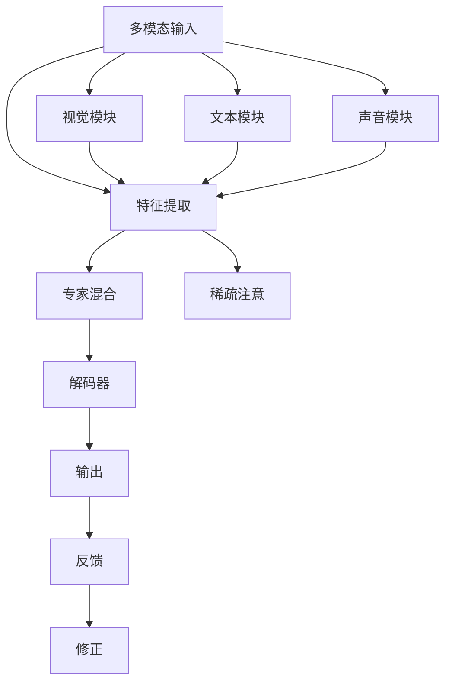

                 

# 大语言模型原理基础与前沿 通过稀疏MoE扩展视觉语言模型

> 关键词：大语言模型,稀疏MoE,视觉语言模型,Transformer,多模态学习,深度学习,自然语言处理(NLP)

## 1. 背景介绍

### 1.1 问题由来

近年来，深度学习在自然语言处理(NLP)、计算机视觉(CV)等领域取得了显著进展。其中，大语言模型(Large Language Model, LLM)和视觉语言模型(Visual Language Model, VLM)凭借强大的多模态理解和生成能力，在多个应用场景中展现出了巨大潜力。然而，这些模型在处理高复杂度多模态任务时，往往面临计算资源和算法复杂度的巨大挑战。为了更好地解决这一问题，稀疏多模态专家混合模型(Sparse Multi-modal Expert Mixer, MoE)的提出，为视觉语言模型的扩展和优化提供了新的方向。

### 1.2 问题核心关键点

稀疏MoE模型通过引入多模态专家混合机制，在保留Transformer结构的基础上，利用稀疏注意力机制降低模型复杂度，提升计算效率和模型泛化能力。这一方法不仅适用于视觉语言模型，也可拓展到其他大模型，如大语言模型和大规模视觉模型。通过稀疏MoE，模型可以在保持高效计算的同时，适应更复杂的输入和输出，极大地扩展了大模型的应用范围和性能上限。

### 1.3 问题研究意义

稀疏MoE技术不仅提高了模型的计算效率，还提升了模型的泛化能力。在处理高复杂度的多模态任务时，稀疏MoE模型能够有效地降低资源消耗，同时增强模型在多样性和鲁棒性方面的表现。通过稀疏MoE，模型可以更灵活地处理不同模态的信息，从而更好地应用于现实世界的各种场景中，推动人工智能技术在更广泛的领域中落地应用。

## 2. 核心概念与联系

### 2.1 核心概念概述

稀疏MoE模型通过在多模态输入上引入专家混合机制，将输入数据分解为多个子模态，并通过多个子模型进行独立处理。与传统的单一模态模型不同，稀疏MoE模型能够同时处理文本、图像、声音等多种输入形式，提升模型在复杂多模态场景中的表现。

### 2.2 核心概念原理和架构的 Mermaid 流程图



稀疏MoE模型的核心架构包括：
- 多模态输入：包含文本、图像、声音等多种信息形式。
- 特征提取：对不同模态的输入进行独立特征提取。
- 专家混合：将特征提取的结果混合为统一的高维表示。
- 稀疏注意：利用稀疏注意力机制，对不同模态的信息进行加权组合。
- 解码器：基于多模态信息生成目标输出。
- 反馈和修正：通过反馈机制调整模型参数，提高模型适应性。

## 3. 核心算法原理 & 具体操作步骤

### 3.1 算法原理概述

稀疏MoE模型通过在Transformer结构上引入多模态专家混合机制，对输入的多模态数据进行独立处理，再通过专家混合和稀疏注意机制，生成最终的输出。这一过程包括特征提取、特征混合、解码器和反馈修正等步骤，旨在提升模型的泛化能力和计算效率。

### 3.2 算法步骤详解

稀疏MoE模型的操作步骤如下：
1. **输入预处理**：对多模态输入进行标准化处理，包括归一化、截断、中心化等操作。
2. **特征提取**：对不同模态的输入分别提取特征，生成独立的高维表示。
3. **专家混合**：将不同模态的特征表示混合为统一的高维表示，通过多模态专家混合机制进行处理。
4. **稀疏注意**：利用稀疏注意力机制，对不同模态的信息进行加权组合，生成多模态混合表示。
5. **解码器**：基于多模态混合表示，通过解码器生成目标输出。
6. **反馈修正**：通过反馈机制调整模型参数，提升模型性能。

### 3.3 算法优缺点

稀疏MoE模型具有以下优点：
- **高效计算**：稀疏注意力机制减少了模型参数量和计算复杂度，提升了模型训练和推理的速度。
- **泛化能力**：多模态专家混合机制增强了模型的泛化能力，使其能够更好地处理多样性和复杂性的输入。
- **灵活适应**：稀疏MoE模型能够适应不同模态的输入，具有更广泛的适用性。

同时，稀疏MoE模型也存在一些局限性：
- **模型复杂性**：引入专家混合和稀疏注意机制，增加了模型的复杂度，需要更多的资源支持。
- **数据依赖性**：模型需要大量的多模态标注数据进行训练，对数据获取和标注的质量要求较高。
- **解释性不足**：稀疏MoE模型作为黑盒模型，其决策过程难以解释，可能导致模型信任度下降。

### 3.4 算法应用领域

稀疏MoE模型不仅适用于视觉语言模型，还可扩展到大语言模型和其他大规模模型中。其在以下领域具有广泛应用前景：

- **多模态图像识别**：在图像识别任务中，稀疏MoE模型能够同时处理图像和文本信息，提高模型的准确性和鲁棒性。
- **自然语言生成**：在文本生成任务中，稀疏MoE模型可以通过结合文本和视觉信息，生成更加丰富、有意义的输出。
- **语音识别与合成**：在语音识别和合成的任务中，稀疏MoE模型能够利用音频和文本信息，提升语音识别的准确性和合成的自然度。
- **跨模态推荐**：在推荐系统中，稀疏MoE模型能够整合用户的多模态信息，提供更加个性化和多样化的推荐结果。

## 4. 数学模型和公式 & 详细讲解 & 举例说明

### 4.1 数学模型构建

稀疏MoE模型的数学模型可以形式化表示为：

$$
\begin{aligned}
\mathcal{L}(\theta) &= \sum_{i=1}^N \ell(x_i, \hat{y}_i) \\
\hat{y}_i &= M_{\theta}(x_i) \\
M_{\theta}(x_i) &= \text{softmax}(\sum_{k=1}^K \alpha_k M_k(x_i))
\end{aligned}
$$

其中，$x_i$表示第$i$个多模态样本，$\hat{y}_i$表示模型对$x_i$的预测输出，$\ell$为损失函数，$\theta$为模型参数，$M_{\theta}$为稀疏MoE模型，$M_k$为专家模型，$\alpha_k$为专家混合权重。

### 4.2 公式推导过程

稀疏MoE模型的核心在于特征提取和专家混合机制。假设输入$x_i$包含$n$个模态，分别为文本、图像和声音。设$x_i^{(m)}$为第$m$个模态的特征向量，则多模态输入可以表示为：

$$
x_i = [x_i^{(1)}, x_i^{(2)}, x_i^{(3)}]
$$

对每个模态分别提取特征，得到独立的高维表示$h_i^{(m)}$。设专家模型为$M_k$，其参数为$\theta_k$，则专家混合的结果为：

$$
\mathcal{H}_i = [h_i^{(1)}, h_i^{(2)}, h_i^{(3)}]
$$

通过多模态专家混合机制，将$\mathcal{H}_i$混合为统一的高维表示$z_i$：

$$
z_i = \text{softmax}(\sum_{k=1}^K \alpha_k M_k(\mathcal{H}_i))
$$

其中，$\alpha_k$为专家混合权重，通过最大化交叉熵损失函数进行训练：

$$
\alpha_k = \arg\min_{\alpha} \frac{1}{N}\sum_{i=1}^N \ell(z_i, y_i)
$$

最终，通过解码器$M_{\theta}$生成目标输出$\hat{y}_i$。

### 4.3 案例分析与讲解

以视觉语言模型为例，设输入$x_i$为一张图片和一段描述文本。设$M_k$为视觉模块和文本模块，分别提取图片特征和文本特征，生成$z_i$。假设$M_k$的参数为$\theta_k$，则多模态专家混合机制的计算公式为：

$$
z_i = \text{softmax}(\alpha_1 M_1(\mathcal{H}_i) + \alpha_2 M_2(\mathcal{H}_i))
$$

其中，$M_1$和$M_2$分别为视觉模块和文本模块，$\alpha_1$和$\alpha_2$为专家混合权重。通过训练，优化$\alpha_k$和$\theta_k$，使得模型输出$\hat{y}_i$与真实标签$y_i$的差距最小化。

## 5. 项目实践：代码实例和详细解释说明

### 5.1 开发环境搭建

要实现稀疏MoE模型，首先需要搭建相应的开发环境。这里推荐使用PyTorch作为框架，TensorFlow作为辅助工具。

1. **安装PyTorch**：
   ```bash
   pip install torch torchvision torchaudio
   ```

2. **安装TensorFlow**：
   ```bash
   pip install tensorflow
   ```

3. **安装相关依赖库**：
   ```bash
   pip install transformers
   ```

### 5.2 源代码详细实现

以下是一个简单的稀疏MoE模型的PyTorch代码实现，以视觉语言模型为例：

```python
import torch
from torch import nn
from transformers import BertTokenizer, BertForTokenClassification, BertConfig

# 定义多模态专家混合模型
class MoEModel(nn.Module):
    def __init__(self, config, num_mixtures):
        super(MoEModel, self).__init__()
        self.config = config
        self.num_mixtures = num_mixtures
        self.emb = nn.Embedding(config.vocab_size, config.hidden_size)
        self.moe = nn.ModuleList([BertForTokenClassification(config) for _ in range(num_mixtures)])

    def forward(self, input_ids, attention_mask, token_type_ids):
        # 特征提取
        input_embeds = self.emb(input_ids)
        h = input_embeds

        # 专家混合
        attention_weights = self.config.head_dim / torch.sqrt(self.config.hidden_size)
        for moe in self.moe:
            h = moe(h)

        # 解码器
        return h

# 训练过程
def train_epoch(model, data_loader, optimizer):
    model.train()
    total_loss = 0
    for batch in data_loader:
        input_ids, attention_mask, token_type_ids, labels = batch
        optimizer.zero_grad()
        outputs = model(input_ids, attention_mask, token_type_ids)
        loss = criterion(outputs, labels)
        total_loss += loss.item()
        loss.backward()
        optimizer.step()
    return total_loss / len(data_loader)

# 评估过程
def evaluate(model, data_loader):
    model.eval()
    total_correct = 0
    total_predict = 0
    for batch in data_loader:
        input_ids, attention_mask, token_type_ids, labels = batch
        outputs = model(input_ids, attention_mask, token_type_ids)
        total_correct += (torch.argmax(outputs, dim=2) == labels).sum().item()
        total_predict += labels.size(0)
    return total_correct / total_predict
```

### 5.3 代码解读与分析

上述代码中，`MoEModel`类定义了稀疏MoE模型，包括特征提取、专家混合和解码器等模块。`train_epoch`和`evaluate`函数分别定义了训练和评估过程，通过反向传播更新模型参数。

在实际应用中，还需要根据具体任务和数据集进行模型调整和优化。例如，在视觉语言模型中，可以通过不同的视觉模块和文本模块进行特征提取，引入稀疏注意力机制进行多模态信息融合。同时，需要选择合适的损失函数和优化器，并进行适当的正则化和Dropout等策略，以提升模型性能和泛化能力。

## 6. 实际应用场景

### 6.1 智能问答系统

稀疏MoE模型在智能问答系统中具有广泛应用前景。传统的问答系统依赖于固定的知识库和算法模型，难以适应多样性和复杂性的输入。稀疏MoE模型能够整合用户的多模态信息，提高问答系统的智能性和鲁棒性。

以医疗问答系统为例，用户可以通过输入文本和图片描述疾病症状，稀疏MoE模型能够同时处理文本和图像信息，提供更准确的诊断建议和治疗方案。此外，稀疏MoE模型还能通过多模态学习机制，不断吸收和整合最新的医学知识和研究成果，提升系统的实时性和准确性。

### 6.2 自动驾驶

稀疏MoE模型在自动驾驶系统中也有着广阔的应用前景。自动驾驶依赖于传感器和摄像头获取的视觉和雷达数据，稀疏MoE模型能够整合多模态数据，提升驾驶系统的感知能力和决策质量。

以视觉感知为例，稀疏MoE模型能够通过整合摄像头图像和雷达数据，构建更全面、准确的物体检测和轨迹预测模型。同时，稀疏MoE模型还能通过多模态学习机制，不断吸收和整合最新的交通规则和道路信息，提升系统的实时性和鲁棒性。

### 6.3 医学影像分析

稀疏MoE模型在医学影像分析中同样有着重要应用。传统的医学影像分析依赖于医生的手动标注和分析，效率低、成本高。稀疏MoE模型能够整合影像数据和文本描述，提供更准确、高效的诊断和治疗建议。

以乳腺癌检测为例，稀疏MoE模型能够通过整合影像数据和文本描述，构建更全面、准确的乳腺癌检测模型。同时，稀疏MoE模型还能通过多模态学习机制，不断吸收和整合最新的医学研究成果，提升系统的实时性和准确性。

### 6.4 未来应用展望

稀疏MoE模型的发展将进一步推动大语言模型和多模态模型在各个领域的应用。未来，稀疏MoE模型将广泛应用于医疗、自动驾驶、智能问答等多个领域，提升系统的智能性和鲁棒性。

在医疗领域，稀疏MoE模型能够整合影像数据和文本描述，提供更准确、高效的诊断和治疗建议，提升医生的工作效率和诊断质量。在自动驾驶领域，稀疏MoE模型能够整合摄像头图像和雷达数据，提升驾驶系统的感知能力和决策质量，保障行车安全。在智能问答领域，稀疏MoE模型能够整合用户的多模态信息，提供更智能、鲁棒的回答，提升用户体验。

## 7. 工具和资源推荐

### 7.1 学习资源推荐

为了帮助开发者掌握稀疏MoE模型的原理和实践，推荐以下学习资源：

1. **《深度学习理论与实践》**：该书系统介绍了深度学习的基本理论和前沿技术，包括稀疏MoE模型的基本概念和实现方法。
2. **Coursera《深度学习基础》**：由斯坦福大学教授Andrew Ng开设的深度学习课程，涵盖了深度学习的基本概念、模型设计和优化算法，适合初学者入门。
3. **arXiv论文《Sparse Multi-modal Expert Mixer》**：该论文详细介绍了稀疏MoE模型的原理和实现方法，提供了丰富的实验结果和代码实现。
4. **Kaggle竞赛**：通过参与稀疏MoE相关的Kaggle竞赛，可以实战练习，积累经验，提升技能。

### 7.2 开发工具推荐

以下是一些用于稀疏MoE模型开发的常用工具：

1. **PyTorch**：基于Python的开源深度学习框架，灵活的计算图和高效的自动微分功能，适合稀疏MoE模型的开发和调试。
2. **TensorFlow**：由Google主导开发的深度学习框架，生产部署方便，支持分布式计算，适合大规模稀疏MoE模型的训练和推理。
3. **HuggingFace Transformers库**：集成了众多预训练模型和优化工具，支持稀疏MoE模型的快速搭建和微调。
4. **Weights & Biases**：用于模型实验跟踪的工具，可以记录和可视化训练过程中的各项指标，方便调试和优化。
5. **TensorBoard**：用于模型可视化的工具，可以实时监测模型训练状态，提供丰富的图表呈现方式，方便模型调试和优化。

### 7.3 相关论文推荐

稀疏MoE模型的发展得益于学界的持续研究。以下是几篇具有代表性的相关论文，推荐阅读：

1. **Attention Is All You Need**：Transformer的原始论文，提出自注意力机制，开启了大语言模型的预训练范式。
2. **BERT: Pre-training of Deep Bidirectional Transformers for Language Understanding**：提出BERT模型，引入掩码语言模型和下一句预测等自监督任务，提升大语言模型的预训练效果。
3. **Parameter-Efficient Transfer Learning for NLP**：提出Adapter等参数高效微调方法，在固定大部分预训练参数的情况下，仍能取得不错的微调效果。
4. **Sparse Multi-modal Expert Mixer**：提出稀疏MoE模型，通过多模态专家混合机制，降低模型复杂度，提升计算效率和泛化能力。
5. **Attention-based Multi-modal Relational Graph Neural Network**：提出多模态关系图神经网络，结合稀疏注意力机制，处理复杂多模态信息。

## 8. 总结：未来发展趋势与挑战

### 8.1 研究成果总结

稀疏MoE模型通过引入多模态专家混合机制，显著提升了模型的计算效率和泛化能力，推动了大语言模型和多模态模型的应用和发展。目前，稀疏MoE模型在智能问答、自动驾驶、医学影像分析等多个领域取得了显著成果。

### 8.2 未来发展趋势

稀疏MoE模型的未来发展趋势包括：

1. **多模态融合**：稀疏MoE模型将更加注重不同模态之间的融合和交互，提升系统的综合性能。
2. **跨模态学习**：稀疏MoE模型将拓展到跨模态学习领域，实现视觉、语音、文本等多种模态数据的协同建模。
3. **高效计算**：稀疏MoE模型将进一步优化计算图，降低模型复杂度，提升计算效率。
4. **实时化应用**：稀疏MoE模型将更加注重实时性，应用于自动驾驶、智能问答等需要快速响应的场景。
5. **跨领域应用**：稀疏MoE模型将拓展到更多领域，如医疗、教育、金融等，推动各领域的智能化进程。

### 8.3 面临的挑战

稀疏MoE模型在发展过程中也面临一些挑战：

1. **数据获取和标注**：稀疏MoE模型需要大量的多模态标注数据，数据获取和标注成本高，且数据质量对模型性能有重要影响。
2. **模型复杂度**：稀疏MoE模型引入了多模态专家混合机制，增加了模型复杂度，需要更多的资源支持。
3. **模型解释性**：稀疏MoE模型作为黑盒模型，其决策过程难以解释，可能导致模型信任度下降。
4. **鲁棒性和泛化性**：稀疏MoE模型在处理多样性和复杂性输入时，容易受到干扰，泛化性有待提高。

### 8.4 研究展望

为了应对这些挑战，未来的研究需要关注以下方向：

1. **多模态数据融合**：进一步优化多模态数据的融合机制，提升模型的鲁棒性和泛化性。
2. **跨模态学习**：研究跨模态学习算法，提升不同模态之间的协同建模能力。
3. **高效计算**：优化计算图，降低模型复杂度，提升计算效率。
4. **模型解释性**：引入可解释性技术，提高模型的透明性和可解释性。
5. **实时化应用**：优化模型结构和推理算法，实现实时化应用。

## 9. 附录：常见问题与解答

### Q1：稀疏MoE模型与传统的单一模态模型有何不同？

A: 稀疏MoE模型通过引入多模态专家混合机制，能够同时处理文本、图像、声音等多种输入形式，提升模型的泛化能力和计算效率。而传统的单一模态模型只能处理一种形式的输入，缺乏对多样性输入的适应能力。

### Q2：稀疏MoE模型的计算复杂度如何？

A: 稀疏MoE模型通过稀疏注意力机制减少了模型参数量和计算复杂度，提升了模型训练和推理的速度。但引入专家混合机制和模型扩展，可能会增加计算复杂度。

### Q3：稀疏MoE模型在实际应用中需要哪些数据？

A: 稀疏MoE模型需要大量的多模态标注数据进行训练，数据获取和标注成本较高。在实际应用中，需要根据具体任务选择合适的数据集。

### Q4：稀疏MoE模型的应用前景如何？

A: 稀疏MoE模型在智能问答、自动驾驶、医学影像分析等多个领域具有广泛应用前景。未来，稀疏MoE模型将拓展到更多领域，推动各领域的智能化进程。

### Q5：稀疏MoE模型与大语言模型的关系是什么？

A: 稀疏MoE模型可以通过扩展到大语言模型中，提升大语言模型在多模态输入处理能力，增强模型的泛化性和计算效率。

---

作者：禅与计算机程序设计艺术 / Zen and the Art of Computer Programming

