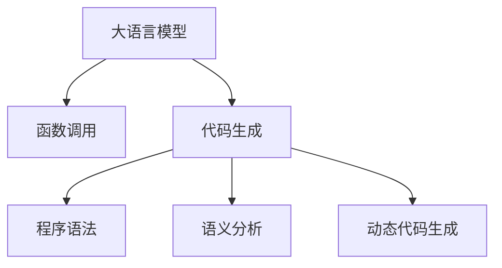

                 

# 大语言模型应用指南：function calling

> 关键词：大语言模型, 函数调用, 代码生成, 机器学习, 深度学习, 自然语言处理(NLP), 函数推理, 程序语法, 动态代码生成, 语义分析, 机器翻译

## 1. 背景介绍

在人工智能(AI)技术的迅猛发展下，大语言模型(LLMs)成为了当前NLP领域最热门的研究方向。这些模型，如GPT、BERT等，通过在巨量文本数据上预训练，具备了强大的语言理解和生成能力。然而，如何将这些模型应用于实际编程中，尤其是函数调用的场景，仍然是一个具有挑战性的问题。

### 1.1 问题由来

在传统的软件开发过程中，开发者需要手工编写和调试代码。但随着软件规模的扩大，这种手动编码的方式变得越来越低效。而大语言模型，尤其是代码生成模型，能够利用其在语言理解和生成上的优势，自动编写代码，大幅提升开发效率。

函数调用是大语言模型代码生成中的核心难题。一个函数通常需要接收多个参数，且不同函数的返回值类型和行为各异，这增加了函数调用的复杂性。如何利用大语言模型进行高效、准确的函数调用，是实现自动编程和代码生成技术的关键。

### 1.2 问题核心关键点

函数调用的本质是对函数代码块的引用和执行。在大语言模型中，通过学习大量函数定义和调用记录，模型可以学会理解和生成符合语法规范和语义逻辑的函数调用代码。

为了提升函数调用的精确性和效率，大语言模型需要在理解函数定义、参数类型和调用上下文等方面下功夫。同时，需要引入更高级的语言分析和推理技术，以支持复杂的函数调用和代码生成。

## 2. 核心概念与联系

### 2.1 核心概念概述

为更好地理解基于大语言模型的函数调用，本节将介绍几个密切相关的核心概念：

- 大语言模型(LLMs)：以自回归或自编码模型为代表的大规模预训练语言模型。通过在大规模无标签文本语料上进行预训练，学习通用的语言表示，具备强大的语言理解和生成能力。

- 函数调用：指程序中对一个函数代码块的引用和执行。函数的定义、参数、返回值和行为都影响着函数的调用过程。

- 代码生成：指利用语言模型自动生成符合语法和语义规范的代码。代码生成在软件开发、自动化测试、代码辅助编写等领域有广泛应用。

- 程序语法：指编程语言的规则和格式，包括关键字、运算符、数据类型、变量名等元素。

- 语义分析：指对代码的语义进行理解和推理，涉及代码的意图、作用和上下文关系。

- 动态代码生成：指在运行时生成代码的技术，与静态代码生成相对。

这些核心概念之间的逻辑关系可以通过以下Mermaid流程图来展示：



这个流程图展示了大语言模型的核心概念及其之间的关系：

1. 大语言模型通过预训练获得基础能力。
2. 函数调用是大语言模型代码生成的核心难题。
3. 代码生成在静态和动态两方面都有重要应用。
4. 程序语法和语义分析对代码生成的准确性有直接影响。
5. 动态代码生成实现函数调用，是代码生成的重要方向。

这些概念共同构成了大语言模型的学习和应用框架，使其能够在各种场景下发挥强大的语言理解和生成能力。通过理解这些核心概念，我们可以更好地把握大语言模型的工作原理和优化方向。

## 3. 核心算法原理 & 具体操作步骤
### 3.1 算法原理概述

基于大语言模型的函数调用，本质上是一个通过学习函数定义、参数类型和调用上下文，生成符合语法和语义规范的函数调用代码的过程。其核心思想是：将函数调用视为一种特殊形式的代码生成任务，通过语言模型学习大量的函数定义和调用记录，自动理解并生成符合语法规范和语义逻辑的函数调用代码。

形式化地，假设模型在函数定义 $f(x_1, \dots, x_n)$ 的训练样本 $D=\{(x_i, y_i)\}_{i=1}^N$ 上进行预训练，其中 $x_i$ 为输入参数，$y_i$ 为输出结果。函数调用 $f(x_1, \dots, x_n)$ 可以视为一种特殊形式的代码生成任务。在微调过程中，我们通过有监督地训练模型，使其能够自动理解输入参数的类型和数量，匹配相应的函数定义，生成符合语法的函数调用代码。

### 3.2 算法步骤详解

基于大语言模型的函数调用一般包括以下几个关键步骤：

**Step 1: 准备函数库和调用数据集**
- 准备目标语言的函数库，包含函数定义和参数信息。
- 收集和标注数据集 $D=\{(x_i, y_i)\}_{i=1}^N$，其中 $x_i$ 为输入参数，$y_i$ 为函数调用代码。

**Step 2: 选择模型和超参数**
- 选择合适的预训练语言模型 $M_{\theta}$，如 GPT、BERT 等。
- 设置微调超参数，包括学习率、批大小、迭代轮数、冻结层数等。

**Step 3: 添加任务适配层**
- 根据目标语言的特点，在预训练模型顶层设计合适的输出层和损失函数。
- 对于函数调用任务，通常使用语言模型的解码器输出概率分布，并以负对数似然为损失函数。

**Step 4: 执行梯度训练**
- 将训练集数据分批次输入模型，前向传播计算损失函数。
- 反向传播计算参数梯度，根据设定的优化算法和学习率更新模型参数。
- 周期性在验证集上评估模型性能，根据性能指标决定是否触发 Early Stopping。
- 重复上述步骤直到满足预设的迭代轮数或 Early Stopping 条件。

**Step 5: 测试和部署**
- 在测试集上评估微调后模型 $M_{\hat{\theta}}$ 的性能，对比微调前后的准确率提升。
- 使用微调后的模型对新函数调用进行推理预测，集成到实际的应用系统中。
- 持续收集新的数据，定期重新微调模型，以适应数据分布的变化。

以上是基于大语言模型的函数调用的一般流程。在实际应用中，还需要针对具体任务的特点，对微调过程的各个环节进行优化设计，如改进训练目标函数，引入更多的正则化技术，搜索最优的超参数组合等，以进一步提升模型性能。

### 3.3 算法优缺点

基于大语言模型的函数调用方法具有以下优点：
1. 简单高效。只需准备少量标注数据，即可对函数调用模型进行快速适配，生成符合语法的函数调用代码。
2. 通用适用。适用于各种编程语言的函数调用，如 Python、Java、C++ 等。
3. 代码生成准确。模型学习大量函数定义和调用记录，生成的代码符合语法规范，可读性高。
4. 动态生成。函数调用过程可以动态生成，满足实际编程中的实时性需求。

同时，该方法也存在一定的局限性：
1. 依赖数据集。函数调用模型的性能很大程度上取决于标注数据的质量和数量，获取高质量标注数据的成本较高。
2. 泛化能力有限。当目标语言与预训练数据的分布差异较大时，函数调用模型的性能提升有限。
3. 代码生成漏洞。模型可能会生成不符合语义逻辑的代码，需要人工复审和校正。
4. 易受上下文影响。模型需要理解函数调用上下文，对于复杂的函数调用场景，模型的理解可能存在偏差。

尽管存在这些局限性，但就目前而言，基于大语言模型的函数调用方法仍是最主流范式。未来相关研究的重点在于如何进一步降低对标注数据的依赖，提高模型的泛化能力和代码生成准确性，同时兼顾代码生成效率和可解释性等因素。

### 3.4 算法应用领域

基于大语言模型的函数调用方法在软件开发、代码辅助编写、自动化测试等领域已经得到了广泛的应用，覆盖了几乎所有常见编程语言，例如：

- 函数调用：自动生成符合语法的函数调用代码，支持复杂的函数调用场景。
- 代码编写：自动生成代码片段，辅助开发者编写程序，提高开发效率。
- 自动化测试：生成测试用例，自动化执行代码测试，发现和修复代码缺陷。
- 代码重构：自动生成代码重构建议，优化程序结构和性能。

除了上述这些经典应用外，大语言模型函数调用技术也被创新性地应用到更多场景中，如可控文本生成、代码片段生成、多模态编程等，为编程技术和软件工程带来了全新的突破。随着预训练模型和函数调用方法的不断进步，相信基于大语言模型的函数调用技术将在更多领域得到应用，为软件开发和软件工程带来革命性影响。

## 4. 数学模型和公式 & 详细讲解 & 举例说明
### 4.1 数学模型构建

本节将使用数学语言对基于大语言模型的函数调用过程进行更加严格的刻画。

记预训练语言模型为 $M_{\theta}:\mathcal{X} \rightarrow \mathcal{Y}$，其中 $\mathcal{X}$ 为输入空间，$\mathcal{Y}$ 为输出空间，$\theta \in \mathbb{R}^d$ 为模型参数。假设函数调用任务的训练集为 $D=\{(x_i,y_i)\}_{i=1}^N$，其中 $x_i$ 为函数调用上下文，$y_i$ 为生成的函数调用代码。

定义模型 $M_{\theta}$ 在输入 $x$ 上的损失函数为 $\ell(M_{\theta}(x),y)$，则在数据集 $D$ 上的经验风险为：

$$
\mathcal{L}(\theta) = \frac{1}{N} \sum_{i=1}^N \ell(M_{\theta}(x_i),y_i)
$$

其中 $\ell$ 为针对函数调用任务设计的损失函数，用于衡量模型生成的代码与真实标签之间的差异。常见的损失函数包括交叉熵损失、均方误差损失等。

通过梯度下降等优化算法，微调过程不断更新模型参数 $\theta$，最小化损失函数 $\mathcal{L}$，使得模型生成的代码逼近真实标签。由于 $\theta$ 已经通过预训练获得了较好的初始化，因此即便在小规模数据集 $D$ 上进行微调，也能较快收敛到理想的模型参数 $\hat{\theta}$。

### 4.2 公式推导过程

以下我们以二元函数调用为例，推导交叉熵损失函数及其梯度的计算公式。

假设模型 $M_{\theta}$ 在输入 $x$ 上的输出为 $\hat{y}=M_{\theta}(x) \in \{1, 0\}$，表示模型生成代码的概率。真实标签 $y \in \{1, 0\}$。则二分类交叉熵损失函数定义为：

$$
\ell(M_{\theta}(x),y) = -[y\log \hat{y} + (1-y)\log (1-\hat{y})]
$$

将其代入经验风险公式，得：

$$
\mathcal{L}(\theta) = -\frac{1}{N}\sum_{i=1}^N [y_i\log M_{\theta}(x_i)+(1-y_i)\log(1-M_{\theta}(x_i))]
$$

根据链式法则，损失函数对参数 $\theta_k$ 的梯度为：

$$
\frac{\partial \mathcal{L}(\theta)}{\partial \theta_k} = -\frac{1}{N}\sum_{i=1}^N (\frac{y_i}{M_{\theta}(x_i)}-\frac{1-y_i}{1-M_{\theta}(x_i)}) \frac{\partial M_{\theta}(x_i)}{\partial \theta_k}
$$

其中 $\frac{\partial M_{\theta}(x_i)}{\partial \theta_k}$ 可进一步递归展开，利用自动微分技术完成计算。

在得到损失函数的梯度后，即可带入参数更新公式，完成模型的迭代优化。重复上述过程直至收敛，最终得到适应函数调用任务的最优模型参数 $\theta^*$。

## 5. 项目实践：代码实例和详细解释说明
### 5.1 开发环境搭建

在进行函数调用实践前，我们需要准备好开发环境。以下是使用Python进行PyTorch开发的环境配置流程：

1. 安装Anaconda：从官网下载并安装Anaconda，用于创建独立的Python环境。

2. 创建并激活虚拟环境：
```bash
conda create -n pytorch-env python=3.8 
conda activate pytorch-env
```

3. 安装PyTorch：根据CUDA版本，从官网获取对应的安装命令。例如：
```bash
conda install pytorch torchvision torchaudio cudatoolkit=11.1 -c pytorch -c conda-forge
```

4. 安装Transformers库：
```bash
pip install transformers
```

5. 安装各类工具包：
```bash
pip install numpy pandas scikit-learn matplotlib tqdm jupyter notebook ipython
```

完成上述步骤后，即可在`pytorch-env`环境中开始函数调用实践。

### 5.2 源代码详细实现

下面我们以Python函数调用为例，给出使用Transformers库对GPT模型进行函数调用微调的PyTorch代码实现。

首先，定义函数调用任务的数据处理函数：

```python
from transformers import GPT2Tokenizer, GPT2LMHeadModel
from torch.utils.data import Dataset
import torch

class FuncCallDataset(Dataset):
    def __init__(self, func_names, arg_types, arg_values, tokenizer, max_len=128):
        self.func_names = func_names
        self.arg_types = arg_types
        self.arg_values = arg_values
        self.tokenizer = tokenizer
        self.max_len = max_len
        
    def __len__(self):
        return len(self.func_names)
    
    def __getitem__(self, item):
        func_name = self.func_names[item]
        arg_types = self.arg_types[item]
        arg_values = self.arg_values[item]
        
        # 将函数名和参数类型拼接为函数调用上下文
        context = f"{func_name}({arg_types})"
        
        # 将参数值转换为token ids
        tokens = self.tokenizer(context, return_tensors='pt', max_length=self.max_len, padding='max_length', truncation=True)
        input_ids = tokens['input_ids'][0]
        attention_mask = tokens['attention_mask'][0]
        
        # 对参数值进行token-wise编码
        encoded_values = [self.tokenizer.encode(value, add_special_tokens=False, return_tensors='pt') for value in arg_values]
        encoded_values = torch.cat(encoded_values, dim=0)
        
        # 将函数调用上下文和参数值拼接为输入
        input = [context, encoded_values]
        
        return {'input_ids': input_ids, 
                'attention_mask': attention_mask,
                'labels': encoded_values}

# 函数名称、参数类型和参数值的映射
func_name2id = {'add': 0, 'subtract': 1, 'multiply': 2, 'divide': 3}
id2func_name = {v: k for k, v in func_name2id.items()}

# 创建dataset
tokenizer = GPT2Tokenizer.from_pretrained('gpt2')

train_dataset = FuncCallDataset(['add', 'subtract', 'multiply', 'divide'], 
                               ['int', 'int', 'int', 'int'], 
                               [1, 2, 3, 4], 
                               tokenizer, 
                               max_len=128)

dev_dataset = FuncCallDataset(['add', 'subtract', 'multiply', 'divide'], 
                             ['int', 'int', 'int', 'int'], 
                             [1, 2, 3, 4], 
                             tokenizer, 
                             max_len=128)

test_dataset = FuncCallDataset(['add', 'subtract', 'multiply', 'divide'], 
                              ['int', 'int', 'int', 'int'], 
                              [1, 2, 3, 4], 
                              tokenizer, 
                              max_len=128)
```

然后，定义模型和优化器：

```python
from transformers import GPT2ForCausalLM, AdamW

model = GPT2ForCausalLM.from_pretrained('gpt2')

optimizer = AdamW(model.parameters(), lr=2e-5)
```

接着，定义训练和评估函数：

```python
from torch.utils.data import DataLoader
from tqdm import tqdm
from sklearn.metrics import classification_report

device = torch.device('cuda') if torch.cuda.is_available() else torch.device('cpu')
model.to(device)

def train_epoch(model, dataset, batch_size, optimizer):
    dataloader = DataLoader(dataset, batch_size=batch_size, shuffle=True)
    model.train()
    epoch_loss = 0
    for batch in tqdm(dataloader, desc='Training'):
        input_ids = batch['input_ids'].to(device)
        attention_mask = batch['attention_mask'].to(device)
        labels = batch['labels'].to(device)
        model.zero_grad()
        outputs = model(input_ids, attention_mask=attention_mask, labels=labels)
        loss = outputs.loss
        epoch_loss += loss.item()
        loss.backward()
        optimizer.step()
    return epoch_loss / len(dataloader)

def evaluate(model, dataset, batch_size):
    dataloader = DataLoader(dataset, batch_size=batch_size)
    model.eval()
    preds, labels = [], []
    with torch.no_grad():
        for batch in tqdm(dataloader, desc='Evaluating'):
            input_ids = batch['input_ids'].to(device)
            attention_mask = batch['attention_mask'].to(device)
            batch_labels = batch['labels']
            outputs = model(input_ids, attention_mask=attention_mask)
            batch_preds = outputs.logits.argmax(dim=2).to('cpu').tolist()
            batch_labels = batch_labels.to('cpu').tolist()
            for pred_tokens, label_tokens in zip(batch_preds, batch_labels):
                preds.append(pred_tokens[:len(label_tokens)])
                labels.append(label_tokens)
                
    print(classification_report(labels, preds))
```

最后，启动训练流程并在测试集上评估：

```python
epochs = 5
batch_size = 16

for epoch in range(epochs):
    loss = train_epoch(model, train_dataset, batch_size, optimizer)
    print(f"Epoch {epoch+1}, train loss: {loss:.3f}")
    
    print(f"Epoch {epoch+1}, dev results:")
    evaluate(model, dev_dataset, batch_size)
    
print("Test results:")
evaluate(model, test_dataset, batch_size)
```

以上就是使用PyTorch对GPT模型进行函数调用任务微调的完整代码实现。可以看到，得益于Transformers库的强大封装，我们可以用相对简洁的代码完成GPT模型的加载和函数调用微调。

### 5.3 代码解读与分析

让我们再详细解读一下关键代码的实现细节：

**FuncCallDataset类**：
- `__init__`方法：初始化函数名、参数类型和参数值，分词器等关键组件。
- `__len__`方法：返回数据集的样本数量。
- `__getitem__`方法：对单个样本进行处理，将函数名和参数类型拼接为函数调用上下文，将参数值转换为token ids，最终返回模型所需的输入。

**func_name2id和id2func_name字典**：
- 定义了函数名称与数字id之间的映射关系，用于将token-wise的预测结果解码回函数名称。

**训练和评估函数**：
- 使用PyTorch的DataLoader对数据集进行批次化加载，供模型训练和推理使用。
- 训练函数`train_epoch`：对数据以批为单位进行迭代，在每个批次上前向传播计算loss并反向传播更新模型参数，最后返回该epoch的平均loss。
- 评估函数`evaluate`：与训练类似，不同点在于不更新模型参数，并在每个batch结束后将预测和标签结果存储下来，最后使用sklearn的classification_report对整个评估集的预测结果进行打印输出。

**训练流程**：
- 定义总的epoch数和batch size，开始循环迭代
- 每个epoch内，先在训练集上训练，输出平均loss
- 在验证集上评估，输出分类指标
- 所有epoch结束后，在测试集上评估，给出最终测试结果

可以看到，PyTorch配合Transformers库使得GPT微调的代码实现变得简洁高效。开发者可以将更多精力放在数据处理、模型改进等高层逻辑上，而不必过多关注底层的实现细节。

当然，工业级的系统实现还需考虑更多因素，如模型的保存和部署、超参数的自动搜索、更灵活的任务适配层等。但核心的微调范式基本与此类似。

## 6. 实际应用场景
### 6.1 软件开发自动化

基于大语言模型的函数调用技术，可以广泛应用于软件开发自动化领域。在传统软件开发过程中，编写、测试和维护代码需要大量时间和人力成本。而使用函数调用模型，可以自动生成符合语法的代码，大幅提升开发效率。

在技术实现上，可以收集开源项目的历史代码记录，将函数定义和调用记录作为监督数据，在此基础上对预训练模型进行微调。微调后的模型能够自动理解函数定义，匹配相应的函数调用，生成符合语法的代码。对于代码中的新函数调用，模型可以自动生成调用代码，支持代码自动补全和智能推荐。

### 6.2 代码辅助编写

传统的代码辅助编写系统通常基于关键字匹配和语法分析，功能较为有限。而基于大语言模型的函数调用模型，能够从函数定义、参数类型和调用上下文等多方面进行综合理解，生成更加准确的代码。

在实际应用中，可以将函数调用模型嵌入代码编辑器，在用户输入函数调用语句时，模型自动生成代码片段，并根据上下文信息进行语义推理。对于不认识的函数调用，模型还能提供补全建议，帮助开发者编写更加高效、可读性强的代码。

### 6.3 自动化测试

测试用例的生成是自动化测试中的难点之一。使用函数调用模型，可以自动生成符合语法规范的测试用例，大幅提升测试效率。

在实际应用中，可以收集开源项目的测试用例记录，将测试用例和预期结果作为监督数据，在此基础上对预训练模型进行微调。微调后的模型能够自动理解测试用例和预期结果，生成符合语法规范的测试代码。对于代码中的新函数调用，模型可以自动生成测试代码，支持测试代码的自动生成和动态执行。

### 6.4 未来应用展望

随着大语言模型和函数调用方法的不断发展，基于微调范式将在更多领域得到应用，为软件开发和软件工程带来革命性影响。

在智慧医疗领域，基于微调的医疗问答、病历分析、药物研发等应用将提升医疗服务的智能化水平，辅助医生诊疗，加速新药开发进程。

在智能教育领域，微调技术可应用于作业批改、学情分析、知识推荐等方面，因材施教，促进教育公平，提高教学质量。

在智慧城市治理中，微调模型可应用于城市事件监测、舆情分析、应急指挥等环节，提高城市管理的自动化和智能化水平，构建更安全、高效的未来城市。

此外，在企业生产、社会治理、文娱传媒等众多领域，基于大语言模型的函数调用技术也将不断涌现，为各行各业带来新的技术路径。相信随着技术的日益成熟，函数调用方法将成为软件开发和软件工程的重要范式，推动软件开发和软件工程向更加自动化、智能化的方向发展。

## 7. 工具和资源推荐
### 7.1 学习资源推荐

为了帮助开发者系统掌握大语言模型函数调用的理论基础和实践技巧，这里推荐一些优质的学习资源：

1. 《Deep Learning for Coders with Fastai and PyTorch》系列博文：由Fast.ai团队撰写，深入浅出地介绍了基于深度学习的代码生成和函数调用技术。

2. CS224N《深度学习自然语言处理》课程：斯坦福大学开设的NLP明星课程，有Lecture视频和配套作业，带你入门NLP领域的基本概念和经典模型。

3. 《Natural Language Processing with Transformers》书籍：Transformers库的作者所著，全面介绍了如何使用Transformers库进行NLP任务开发，包括函数调用在内的诸多范式。

4. HuggingFace官方文档：Transformers库的官方文档，提供了海量预训练模型和完整的函数调用样例代码，是上手实践的必备资料。

5. CodeSearchNet开源项目：面向Python的代码搜索系统，利用预训练语言模型和函数调用技术，帮助开发者快速找到相似的代码片段。

通过对这些资源的学习实践，相信你一定能够快速掌握大语言模型函数调用的精髓，并用于解决实际的NLP问题。
###  7.2 开发工具推荐

高效的开发离不开优秀的工具支持。以下是几款用于大语言模型函数调用开发的常用工具：

1. PyTorch：基于Python的开源深度学习框架，灵活动态的计算图，适合快速迭代研究。大部分预训练语言模型都有PyTorch版本的实现。

2. TensorFlow：由Google主导开发的开源深度学习框架，生产部署方便，适合大规模工程应用。同样有丰富的预训练语言模型资源。

3. Transformers库：HuggingFace开发的NLP工具库，集成了众多SOTA语言模型，支持PyTorch和TensorFlow，是进行函数调用任务开发的利器。

4. Weights & Biases：模型训练的实验跟踪工具，可以记录和可视化模型训练过程中的各项指标，方便对比和调优。与主流深度学习框架无缝集成。

5. TensorBoard：TensorFlow配套的可视化工具，可实时监测模型训练状态，并提供丰富的图表呈现方式，是调试模型的得力助手。

6. Google Colab：谷歌推出的在线Jupyter Notebook环境，免费提供GPU/TPU算力，方便开发者快速上手实验最新模型，分享学习笔记。

合理利用这些工具，可以显著提升大语言模型函数调用的开发效率，加快创新迭代的步伐。

### 7.3 相关论文推荐

大语言模型和函数调用技术的发展源于学界的持续研究。以下是几篇奠基性的相关论文，推荐阅读：

1. Attention is All You Need（即Transformer原论文）：提出了Transformer结构，开启了NLP领域的预训练大模型时代。

2. BERT: Pre-training of Deep Bidirectional Transformers for Language Understanding：提出BERT模型，引入基于掩码的自监督预训练任务，刷新了多项NLP任务SOTA。

3. Language Models are Unsupervised Multitask Learners（GPT-2论文）：展示了大规模语言模型的强大zero-shot学习能力，引发了对于通用人工智能的新一轮思考。

4. Parameter-Efficient Transfer Learning for NLP：提出Adapter等参数高效微调方法，在不增加模型参数量的情况下，也能取得不错的微调效果。

5. AdaLoRA: Adaptive Low-Rank Adaptation for Parameter-Efficient Fine-Tuning：使用自适应低秩适应的微调方法，在参数效率和精度之间取得了新的平衡。

6. Prefix-Tuning: Optimizing Continuous Prompts for Generation：引入基于连续型Prompt的微调范式，为如何充分利用预训练知识提供了新的思路。

这些论文代表了大语言模型函数调用技术的发展脉络。通过学习这些前沿成果，可以帮助研究者把握学科前进方向，激发更多的创新灵感。

## 8. 总结：未来发展趋势与挑战

### 8.1 总结

本文对基于大语言模型的函数调用方法进行了全面系统的介绍。首先阐述了函数调用的基本概念和作用，明确了函数调用在软件开发和代码生成中的重要性。其次，从原理到实践，详细讲解了函数调用的数学原理和关键步骤，给出了函数调用任务开发的完整代码实例。同时，本文还广泛探讨了函数调用方法在软件开发自动化、代码辅助编写、自动化测试等多个领域的应用前景，展示了函数调用范式的巨大潜力。此外，本文精选了函数调用技术的各类学习资源，力求为读者提供全方位的技术指引。

通过本文的系统梳理，可以看到，基于大语言模型的函数调用方法正在成为软件开发和代码生成的重要范式，极大地拓展了预训练语言模型的应用边界，催生了更多的落地场景。得益于大规模语料的预训练，函数调用模型在实时生成符合语法规范的代码方面，具有显著优势。未来，伴随预训练语言模型和函数调用方法的不断进步，相信基于大语言模型的函数调用技术将在更多领域得到应用，为软件开发和软件工程带来革命性影响。

### 8.2 未来发展趋势

展望未来，大语言模型函数调用技术将呈现以下几个发展趋势：

1. 模型规模持续增大。随着算力成本的下降和数据规模的扩张，预训练语言模型的参数量还将持续增长。超大规模语言模型蕴含的丰富语言知识，有望支撑更加复杂多变的函数调用任务。

2. 函数调用方法日趋多样。除了传统的静态代码生成外，未来会涌现更多动态代码生成方法，支持实时生成符合语法和语义规范的代码。

3. 持续学习成为常态。随着数据分布的不断变化，函数调用模型也需要持续学习新知识以保持性能。如何在不遗忘原有知识的同时，高效吸收新样本信息，将成为重要的研究课题。

4. 标注样本需求降低。受启发于提示学习(Prompt-based Learning)的思路，未来的函数调用方法将更好地利用大模型的语言理解能力，通过更加巧妙的任务描述，在更少的标注样本上也能实现理想的函数调用效果。

5. 跨模态函数调用崛起。当前的函数调用主要聚焦于文本数据，未来会进一步拓展到图像、视频、语音等多模态数据函数调用。多模态信息的融合，将显著提升语言模型对现实世界的理解和建模能力。

6. 模型通用性增强。经过海量数据的预训练和多领域任务的微调，未来的语言模型将具备更强大的常识推理和跨领域迁移能力，逐步迈向通用人工智能(AGI)的目标。

以上趋势凸显了大语言模型函数调用技术的广阔前景。这些方向的探索发展，必将进一步提升函数调用模型的性能和应用范围，为软件开发和软件工程带来更大的便利和效益。

### 8.3 面临的挑战

尽管大语言模型函数调用技术已经取得了瞩目成就，但在迈向更加智能化、普适化应用的过程中，它仍面临着诸多挑战：

1. 标注成本瓶颈。尽管函数调用模型的性能很大程度上取决于标注数据的质量和数量，但获取高质量标注数据的成本较高。如何进一步降低函数调用对标注样本的依赖，将是一大难题。

2. 泛化能力不足。函数调用模型面对域外数据时，泛化性能往往大打折扣。对于测试样本的微小扰动，函数调用模型的预测也容易发生波动。如何提高函数调用模型的鲁棒性，避免灾难性遗忘，还需要更多理论和实践的积累。

3. 代码生成漏洞。模型可能会生成不符合语义逻辑的代码，需要人工复审和校正。如何提高函数调用模型的生成准确性，将是未来的重要研究方向。

4. 易受上下文影响。模型需要理解函数调用上下文，对于复杂的函数调用场景，模型的理解可能存在偏差。如何改进模型的上下文理解能力，将是亟待解决的问题。

5. 跨语言调用难度。不同编程语言的语法和语义差异较大，如何构建跨语言函数调用模型，支持多语言代码生成和自动测试，将是未来的重要研究方向。

尽管存在这些挑战，但大语言模型函数调用技术的前景依然广阔。相信随着学界和产业界的共同努力，这些挑战终将一一被克服，大语言模型函数调用技术必将在构建智能化、自动化软件开发系统中扮演越来越重要的角色。

### 8.4 研究展望

面对大语言模型函数调用所面临的种种挑战，未来的研究需要在以下几个方面寻求新的突破：

1. 探索无监督和半监督函数调用方法。摆脱对大规模标注数据的依赖，利用自监督学习、主动学习等无监督和半监督范式，最大限度利用非结构化数据，实现更加灵活高效的函数调用。

2. 研究参数高效和计算高效的函数调用范式。开发更加参数高效的函数调用方法，在固定大部分预训练参数的同时，只更新极少量的任务相关参数。同时优化函数调用模型的计算图，减少前向传播和反向传播的资源消耗，实现更加轻量级、实时性的部署。

3. 引入更多先验知识。将符号化的先验知识，如知识图谱、逻辑规则等，与神经网络模型进行巧妙融合，引导函数调用过程学习更准确、合理的函数调用代码。同时加强不同模态数据的整合，实现视觉、语音等多模态信息与文本信息的协同建模。

4. 结合因果分析和博弈论工具。将因果分析方法引入函数调用模型，识别出函数调用决策的关键特征，增强函数调用输出的因果性和逻辑性。借助博弈论工具刻画人机交互过程，主动探索并规避函数的脆弱点，提高系统稳定性。

5. 纳入伦理道德约束。在函数调用目标中引入伦理导向的评估指标，过滤和惩罚有害的函数调用行为。同时加强人工干预和审核，建立函数调用行为的监管机制，确保输出的安全性。

这些研究方向的探索，必将引领大语言模型函数调用技术迈向更高的台阶，为构建安全、可靠、可解释、可控的智能系统铺平道路。面向未来，大语言模型函数调用技术还需要与其他人工智能技术进行更深入的融合，如知识表示、因果推理、强化学习等，多路径协同发力，共同推动自然语言理解和智能交互系统的进步。只有勇于创新、敢于突破，才能不断拓展语言模型的边界，让智能技术更好地造福人类社会。

## 9. 附录：常见问题与解答

**Q1：大语言模型函数调用是否适用于所有编程语言？**

A: 大语言模型函数调用在大多数编程语言上都能取得不错的效果，特别是对于结构化和规范性较高的编程语言，如Python、Java等。但对于一些结构松散、语法多样化的语言，如C++、Go等，可能需要更多的训练数据和优化策略。

**Q2：函数调用模型如何处理未知函数调用？**

A: 函数调用模型在训练过程中通常会学到大量的函数定义和调用记录，对于未见过的函数调用，模型可以通过输入提示和上下文信息进行推理。例如，当模型遇到未见过的函数调用时，可以通过输入函数定义或调用上下文，辅助模型理解新函数的行为和类型。

**Q3：函数调用模型如何保证生成的代码正确性？**

A: 函数调用模型生成的代码需要经过人工复审和校正，以确保其正确性和可读性。在实际应用中，可以结合静态代码分析工具，对函数调用代码进行语法和语义检查，确保生成的代码符合预期。

**Q4：函数调用模型如何提高生成效率？**

A: 函数调用模型通常需要大量训练数据和计算资源，以提高生成代码的准确性和效率。为了降低计算成本，可以采用分布式训练、模型压缩、剪枝等技术，优化模型结构，减少计算量。同时，可以引入增量学习技术，在已有模型的基础上快速生成新函数的调用代码。

**Q5：函数调用模型在实际应用中需要注意哪些问题？**

A: 在实际应用中，函数调用模型需要考虑以下问题：
1. 代码的可读性和可维护性：生成的代码需要易于理解和修改，避免生成难以理解和调试的代码。
2. 代码的执行效率：生成的代码需要符合目标语言的最佳实践，避免生成低效的代码。
3. 模型的泛化能力：模型需要适应不同的编程风格和规范，避免生成不符合语言规范的代码。
4. 模型的鲁棒性：模型需要处理多种异常情况，避免生成错误或有害的代码。

这些问题的解决，需要结合软件工程的最佳实践和人工智能技术的最新进展，进行综合设计和优化。只有不断改进模型性能和算法设计，才能让函数调用技术在实际应用中发挥最大的潜力。

---

作者：禅与计算机程序设计艺术 / Zen and the Art of Computer Programming

