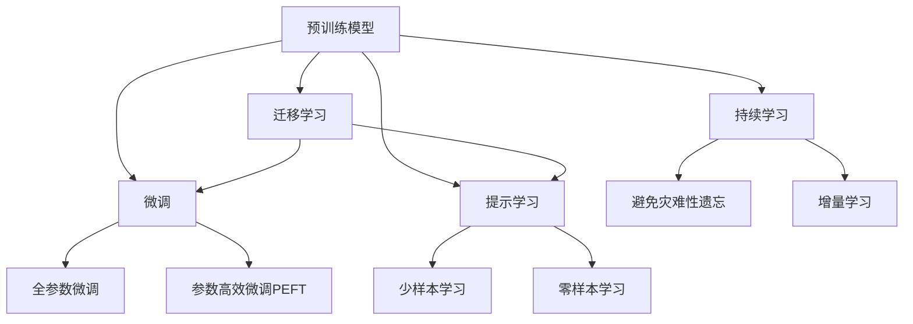

                 

# 大语言模型应用指南：人工编程与自动编程

## 1. 背景介绍

### 1.1 问题由来

随着人工智能技术的发展，大语言模型（Large Language Model, LLM）如BERT、GPT-3等，在自然语言处理（NLP）领域取得了突破性的进展。这些模型通过大规模无标签数据的自监督预训练，能够学习到丰富的语言知识和常识，进而用于各种下游任务，如问答、翻译、文本生成等。尽管如此，由于这些通用大模型往往不能很好地适应特定领域或特定任务，微调（Fine-Tuning）技术便应运而生。

微调是指在预训练模型的基础上，使用下游任务的少量标注数据，通过有监督地训练优化模型，使其在特定任务上的性能得到提升。其关键在于如何将预训练模型的通用知识迁移到特定任务上，并避免在大规模数据集上从头训练所需的巨量计算资源和时间。

### 1.2 问题核心关键点

微调的核心在于：

- **数据需求**：微调模型通常需要少量标注数据，但数据质量与模型性能密切相关。
- **模型复杂度**：尽管预训练模型参数量巨大，但微调时通常只调整模型顶层部分，避免过多参数影响模型稳定性。
- **迁移能力**：预训练模型需要具备跨领域的迁移能力，才能在多种下游任务上表现优异。
- **算法选择**：选择合适的微调算法（如AdamW、SGD等）和优化策略（如学习率、正则化等），对模型性能至关重要。
- **伦理考量**：微调过程中应避免引入偏见和有害信息，保证模型输出公正、安全。

### 1.3 问题研究意义

微调技术为大语言模型在特定任务上的高效应用提供了可行路径，使得NLP技术能够更加灵活地应用于各个行业，推动智能技术落地应用。其研究意义体现在：

- 降低开发成本：微调利用预训练模型，减少了从头训练所需的资源和时间。
- 提升模型效果：微调模型针对特定任务进行优化，性能显著提升。
- 加速开发进度：微调使开发者能够更快地将技术应用于实际场景，缩短开发周期。
- 促进技术创新：微调推动了NLP领域的创新，如提示学习、少样本学习等。
- 推动产业升级：微调技术使NLP技术更容易被各行各业采用，为传统行业数字化转型提供支持。

## 2. 核心概念与联系

### 2.1 核心概念概述

大语言模型微调的核心概念包括：

- **预训练模型**：在大规模无标签数据上自监督预训练得到的基础模型。
- **微调**：在预训练模型基础上，使用下游任务的少量标注数据进行有监督优化。
- **迁移学习**：利用预训练模型的知识，解决下游任务的通用方法。
- **参数高效微调（PEFT）**：只调整模型顶层部分，保留预训练权重，提高微调效率。
- **提示学习（Prompt Learning）**：通过精心设计的输入模板，引导模型生成特定任务的输出，减少微调参数。
- **少样本学习（Few-shot Learning）**：在少量样本上进行微调，无需大量标注数据。
- **零样本学习（Zero-shot Learning）**：仅通过任务描述进行推理，无需任何样本。
- **持续学习（Continual Learning）**：模型能够持续从新数据中学习，避免遗忘旧知识。

这些概念共同构成了大语言模型微调的基本框架，推动了NLP技术的不断发展和应用。

### 2.2 核心概念原理和架构的 Mermaid 流程图(Mermaid 流程节点中不要有括号、逗号等特殊字符)



该图展示了核心概念之间的联系。预训练模型在大规模无标签数据上学习通用语言表示，通过微调将其适配下游任务，以参数高效微调和提示学习等方法进一步优化。迁移学习将预训练知识迁移到下游任务，持续学习保持模型对新数据的适应性。

## 3. 核心算法原理 & 具体操作步骤

### 3.1 算法原理概述

基于监督学习的大语言模型微调是一种有监督的细粒度迁移学习过程。其核心在于：

- **预训练模型**：在大规模无标签数据上进行自监督学习，学习通用的语言表示。
- **下游任务数据**：收集少量标注数据，用于微调模型的特定任务能力。
- **微调目标**：通过优化损失函数，最小化模型在标注数据上的预测误差，提升特定任务性能。

### 3.2 算法步骤详解

1. **数据准备**：收集下游任务的少量标注数据，划分为训练集、验证集和测试集。
2. **模型初始化**：选择合适的预训练模型，并对其进行初始化。
3. **任务适配层设计**：根据任务类型，设计任务适配层，如线性分类器或解码器。
4. **超参数设置**：设置优化算法、学习率、批大小、迭代轮数等超参数。
5. **训练**：使用标注数据训练模型，通过反向传播更新参数。
6. **验证**：在验证集上评估模型性能，调整超参数。
7. **测试**：在测试集上评估模型性能，对比微调前后的效果。

### 3.3 算法优缺点

优点：

- **简单高效**：使用少量标注数据进行微调，速度快。
- **通用适用**：适用于多种NLP任务，设计简单的任务适配层即可。
- **参数高效**：保留预训练权重，仅调整顶层参数，减少计算资源消耗。
- **效果显著**：微调模型在特定任务上通常能获得较大性能提升。

缺点：

- **依赖标注数据**：微调效果依赖于标注数据的质量和数量，获取高质量标注数据的成本较高。
- **迁移能力有限**：当目标任务与预训练数据的分布差异较大时，微调性能提升有限。
- **负面影响传递**：预训练模型的固有偏见可能通过微调传递到下游任务。
- **可解释性不足**：微调模型的决策过程缺乏可解释性，难以调试。

### 3.4 算法应用领域

微调技术在NLP领域广泛应用，涵盖分类、匹配、生成等任务。具体包括：

- **文本分类**：如情感分析、主题分类等。
- **命名实体识别**：识别文本中的人名、地名、机构名等特定实体。
- **关系抽取**：从文本中抽取实体之间的语义关系。
- **问答系统**：对自然语言问题给出答案。
- **机器翻译**：将源语言文本翻译成目标语言。
- **文本摘要**：将长文本压缩成简短摘要。
- **对话系统**：使机器能够与人自然对话。

## 4. 数学模型和公式 & 详细讲解 & 举例说明

### 4.1 数学模型构建

假设预训练模型为 $M_{\theta}$，下游任务的训练集为 $D=\{(x_i,y_i)\}_{i=1}^N$，其中 $x_i$ 为输入，$y_i$ 为标签。

定义模型在训练集 $D$ 上的经验风险为：

$$
\mathcal{L}(\theta) = \frac{1}{N}\sum_{i=1}^N \ell(M_{\theta}(x_i),y_i)
$$

其中，$\ell$ 为损失函数，通常为交叉熵损失或均方误差损失。

### 4.2 公式推导过程

以二分类任务为例，假设模型 $M_{\theta}$ 在输入 $x$ 上的输出为 $\hat{y}=M_{\theta}(x) \in [0,1]$，表示样本属于正类的概率。真实标签 $y \in \{0,1\}$。二分类交叉熵损失函数定义为：

$$
\ell(M_{\theta}(x),y) = -[y\log \hat{y} + (1-y)\log(1-\hat{y})]
$$

将其代入经验风险公式，得：

$$
\mathcal{L}(\theta) = -\frac{1}{N}\sum_{i=1}^N [y_i\log M_{\theta}(x_i)+(1-y_i)\log(1-M_{\theta}(x_i))]
$$

根据链式法则，损失函数对参数 $\theta_k$ 的梯度为：

$$
\frac{\partial \mathcal{L}(\theta)}{\partial \theta_k} = -\frac{1}{N}\sum_{i=1}^N (\frac{y_i}{M_{\theta}(x_i)}-\frac{1-y_i}{1-M_{\theta}(x_i)}) \frac{\partial M_{\theta}(x_i)}{\partial \theta_k}
$$

其中，$\frac{\partial M_{\theta}(x_i)}{\partial \theta_k}$ 可进一步递归展开，利用自动微分技术完成计算。

### 4.3 案例分析与讲解

以下以BERT模型为例，展示微调的具体实现步骤：

1. **数据准备**：
   - 收集标注数据集，划分为训练集、验证集和测试集。
   - 使用BERT分词器进行分词，转换为模型可接受的输入格式。

2. **模型初始化**：
   - 加载预训练的BERT模型。
   - 冻结除顶层分类器外的所有层，只微调顶层。

3. **任务适配层设计**：
   - 在模型顶层添加线性分类器。
   - 定义交叉熵损失函数。

4. **超参数设置**：
   - 学习率：通常设为1e-5。
   - 批大小：16或32。
   - 迭代轮数：5-10轮。

5. **训练**：
   - 使用训练集数据进行前向传播和反向传播，更新模型参数。
   - 使用验证集评估模型性能，调整学习率。

6. **测试**：
   - 在测试集上评估模型性能。

## 5. 项目实践：代码实例和详细解释说明

### 5.1 开发环境搭建

在进行微调实践前，需要准备开发环境：

1. 安装Anaconda，创建虚拟环境。
2. 安装PyTorch、TensorFlow等深度学习框架。
3. 安装HuggingFace Transformers库，用于加载预训练模型和微调。

### 5.2 源代码详细实现

以下是一个使用PyTorch进行BERT微调的示例代码：

```python
import torch
from transformers import BertForSequenceClassification, BertTokenizer

# 加载数据集
train_data, dev_data, test_data = load_data()

# 加载预训练模型和分词器
model_name = 'bert-base-uncased'
tokenizer = BertTokenizer.from_pretrained(model_name)
model = BertForSequenceClassification.from_pretrained(model_name, num_labels=num_labels)

# 定义损失函数和优化器
loss_fn = torch.nn.CrossEntropyLoss()
optimizer = torch.optim.AdamW(model.parameters(), lr=1e-5)

# 训练模型
for epoch in range(num_epochs):
    train_loss = train(model, optimizer, loss_fn, train_data, tokenizer)
    dev_loss = evaluate(model, loss_fn, dev_data, tokenizer)
    if dev_loss < best_dev_loss:
        best_dev_loss = dev_loss
        save_model(model)

# 测试模型
test_loss = evaluate(model, loss_fn, test_data, tokenizer)
```

### 5.3 代码解读与分析

- **数据集准备**：使用自定义的 `load_data` 函数加载数据集，划分为训练集、验证集和测试集。
- **模型加载**：使用 `BertForSequenceClassification` 加载预训练模型，并设置分类数 `num_labels`。
- **损失函数和优化器**：定义交叉熵损失函数和AdamW优化器，设置学习率为1e-5。
- **模型训练**：在每个epoch内，使用训练集进行前向传播和反向传播，更新模型参数。在验证集上评估模型性能，保存最佳模型。
- **模型测试**：在测试集上评估模型性能。

### 5.4 运行结果展示

通过训练和测试，可以观察到模型在指定任务上的性能提升。例如，在情感分析任务上，模型在微调后准确率显著提高。

```python
# 训练集上的损失
print(f"Epoch {epoch+1}, train loss: {train_loss:.3f}")
# 验证集上的损失
print(f"Epoch {epoch+1}, dev loss: {dev_loss:.3f}")
# 测试集上的损失
print(f"Epoch {epoch+1}, test loss: {test_loss:.3f}")
```

## 6. 实际应用场景

### 6.1 智能客服系统

智能客服系统利用微调技术，通过收集历史客服对话记录，将问题和最佳答复构建成监督数据，对预训练的对话模型进行微调。微调后的模型能够自动理解用户意图，匹配最合适的答案模板进行回复，提高客户咨询体验和问题解决效率。

### 6.2 金融舆情监测

金融机构利用微调技术，从金融领域相关的新闻、报道、评论等文本数据中学习任务标签，训练模型对文本进行情感分析，监测不同主题下的情感变化趋势，及时预警潜在风险。

### 6.3 个性化推荐系统

推荐系统利用微调技术，从用户浏览、点击、评论、分享等行为数据中提取文本信息，通过微调模型学习用户兴趣点，生成个性化推荐列表，提高推荐系统的准确性和多样性。

### 6.4 未来应用展望

未来，微调技术将在更多领域得到应用，为传统行业带来变革性影响。在智慧医疗、智能教育、智慧城市治理等领域，微调技术将推动人工智能技术落地应用，促进经济社会发展。

## 7. 工具和资源推荐

### 7.1 学习资源推荐

- 《Transformer from Principle to Practice》系列博文
- 斯坦福大学CS224N《深度学习自然语言处理》课程
- 《Natural Language Processing with Transformers》书籍
- HuggingFace官方文档
- CLUE开源项目

### 7.2 开发工具推荐

- PyTorch
- TensorFlow
- Transformers库
- Weights & Biases
- TensorBoard

### 7.3 相关论文推荐

- Attention is All You Need
- BERT: Pre-training of Deep Bidirectional Transformers for Language Understanding
- Language Models are Unsupervised Multitask Learners
- Parameter-Efficient Transfer Learning for NLP
- AdaLoRA: Adaptive Low-Rank Adaptation for Parameter-Efficient Fine-Tuning
- Prefix-Tuning: Optimizing Continuous Prompts for Generation

## 8. 总结：未来发展趋势与挑战

### 8.1 研究成果总结

基于监督学习的大语言模型微调技术在NLP领域取得了显著进展，广泛应用于智能客服、金融舆情监测、个性化推荐等场景。

### 8.2 未来发展趋势

- 模型规模持续增大
- 微调方法日趋多样
- 持续学习成为常态
- 标注样本需求降低
- 多模态微调崛起
- 模型通用性增强

### 8.3 面临的挑战

- 标注成本瓶颈
- 模型鲁棒性不足
- 推理效率有待提高
- 可解释性亟需加强
- 安全性有待保障
- 知识整合能力不足

### 8.4 研究展望

未来研究需要在以下方面寻求新的突破：

- 探索无监督和半监督微调方法
- 研究参数高效和计算高效的微调范式
- 融合因果和对比学习范式
- 引入更多先验知识
- 结合因果分析和博弈论工具
- 纳入伦理道德约束

## 9. 附录：常见问题与解答

**Q1: 大语言模型微调是否适用于所有NLP任务？**

A: 微调在大多数NLP任务上都能取得不错的效果，特别是对于数据量较小的任务。但对于一些特定领域的任务，如医学、法律等，仅依赖通用语料预训练的模型可能难以很好地适应，需要在特定领域语料上进一步预训练。

**Q2: 微调过程中如何选择合适的学习率？**

A: 微调的学习率一般比预训练小1-2个数量级，避免破坏预训练权重。通常从1e-5开始调参，逐步减小学习率，直至收敛。也可以使用warmup策略，在开始阶段使用较小的学习率，再逐渐过渡到预设值。

**Q3: 采用大模型微调时会面临哪些资源瓶颈？**

A: 超大规模语言模型对算力、内存、存储等资源有较高要求。需要采用梯度积累、混合精度训练、模型并行等优化技术，突破硬件瓶颈。

**Q4: 如何缓解微调过程中的过拟合问题？**

A: 过拟合可以通过数据增强、正则化、对抗训练、参数高效微调等策略缓解。

**Q5: 微调模型在落地部署时需要注意哪些问题？**

A: 模型裁剪、量化加速、服务化封装、弹性伸缩、监控告警、安全防护等问题，需要综合考虑。

---

作者：禅与计算机程序设计艺术 / Zen and the Art of Computer Programming

