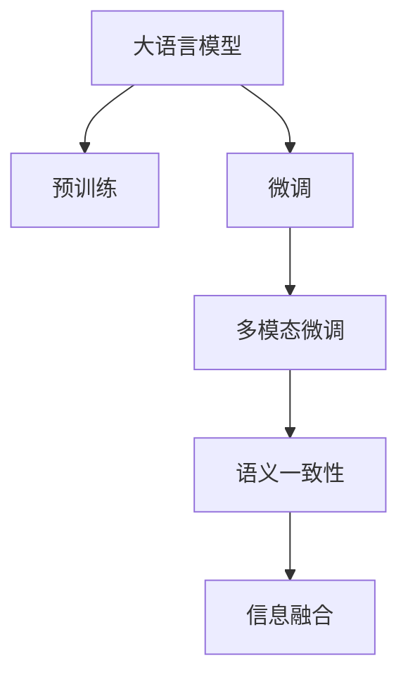

                 

## 1. 背景介绍

### 1.1 问题由来

在人工智能领域，特别是自然语言处理(NLP)领域，多模态学习(Multimodal Learning)是一个备受关注的话题。多模态学习指的是结合多个模态（如文本、图像、声音等）的信息，共同进行学习和推理。大语言模型(Large Language Models, LLMs)，如BERT、GPT、T5等，虽然擅长处理文本数据，但在面对涉及视觉或听觉信息的任务时，仍然面临诸多挑战。

### 1.2 问题核心关键点

- **文本与视觉的结合**：当前主流的预训练语言模型往往是基于文本数据的，而图像等视觉信息常常需要额外处理。如何将文本与图像信息结合，形成更为丰富的知识表示，是一个重要研究方向。
- **语音与文本的交互**：语音和文本是自然语言交互的两种主要形式。如何让语音输入被语言模型有效理解，并将其转化为文本输出，同时将文本指令转换为语音指令，是一个重要的技术挑战。
- **跨模态信息的融合**：多模态信息通常包含不同的特征，如何将不同模态的信息整合，形成统一的语义表示，是提高多模态系统性能的关键。
- **语义一致性**：多模态系统在处理不同模态信息时，需要确保语义的一致性，避免信息丢失或混淆。

### 1.3 问题研究意义

多模态学习是人工智能发展的必然趋势，有助于构建更全面、更智能的认知模型。在大语言模型应用中，引入多模态信息可以大大提升其对现实世界的理解和推理能力，推动其在更多应用场景中的落地。研究多模态大语言模型的应用，对于提升智能系统的感知能力和交互体验，具有重要意义。

## 2. 核心概念与联系

### 2.1 核心概念概述

- **大语言模型**：以自回归或自编码模型为代表的大规模预训练语言模型，如BERT、GPT、T5等。通过在大规模无标签文本语料上进行预训练，学习通用的语言表示。
- **预训练**：在大规模无标签文本语料上，通过自监督学习任务训练通用语言模型的过程。常见的预训练任务包括言语建模、掩码语言模型等。
- **微调**：在预训练模型的基础上，使用下游任务的少量标注数据，通过有监督学习优化模型在特定任务上的性能。
- **多模态**：涉及多个模态（如文本、图像、声音等）信息的系统或模型。
- **语义一致性**：不同模态信息的表示和处理应该保持语义的一致性，避免信息丢失或混淆。
- **融合**：将不同模态的信息整合，形成统一的语义表示，提高系统的整体性能。

这些核心概念之间的逻辑关系可以通过以下Mermaid流程图来展示：



这个流程图展示了从大语言模型的预训练到微调，再到多模态学习的全过程，以及如何通过语义一致性和信息融合，提升系统的整体性能。

## 3. 核心算法原理 & 具体操作步骤

### 3.1 算法原理概述

多模态大语言模型的核心思想是，通过结合不同模态的信息，形成更为丰富的知识表示。具体来说，它分为以下几个步骤：

1. **预训练**：在大规模无标签文本语料上，通过自监督学习任务训练通用语言模型。
2. **多模态预训练**：在多模态数据上，使用自监督学习任务训练跨模态的通用表示。
3. **微调**：在预训练模型和跨模态表示的基础上，使用下游任务的少量标注数据，通过有监督学习优化模型在特定任务上的性能。
4. **融合**：将不同模态的信息进行整合，形成统一的语义表示。
5. **语义一致性**：确保不同模态信息的表示和处理保持语义的一致性，避免信息丢失或混淆。

### 3.2 算法步骤详解

#### 3.2.1 预训练与多模态预训练

预训练通常采用自监督学习任务，如掩码语言模型(MLM)、下一句预测(NSP)等。在预训练过程中，模型学习到大量的语言知识和常识，形成通用的语言表示。

多模态预训练的目标是，让模型能够处理不同类型的信息，并形成统一的语义表示。例如，可以使用自监督学习任务，如视觉-文本对齐(ViTAL)、跨模态数据联合建模(CoMT)等，训练跨模态的通用表示。

#### 3.2.2 微调

微调是利用下游任务的少量标注数据，进一步优化模型在特定任务上的性能。通常，微调分为全参数微调和参数高效微调(PEFT)。全参数微调是指更新模型所有参数，而参数高效微调则只更新部分参数，如跨模态微调中的跨模态适配器(Cross-modal Adapter)。

#### 3.2.3 融合

融合是指将不同模态的信息进行整合，形成统一的语义表示。常见的融合方法包括特征拼接(Feature Concatenation)、多模态注意力(Multimodal Attention)等。

#### 3.2.4 语义一致性

语义一致性指的是不同模态信息的表示和处理应该保持语义的一致性，避免信息丢失或混淆。例如，在进行文本-图像融合时，应该确保文本描述的图像与图像本身一致。

### 3.3 算法优缺点

多模态大语言模型的优点包括：

- **多模态信息融合**：通过结合不同模态的信息，提升系统的感知能力和理解能力。
- **跨领域迁移**：模型能够适应不同领域的数据，具有更强的泛化能力。
- **应用广泛**：多模态系统可以应用于多种应用场景，如智能客服、智能监控、虚拟助手等。

缺点包括：

- **数据需求高**：多模态系统需要大量的跨模态数据进行训练，数据获取成本较高。
- **模型复杂**：多模态模型通常比单一模态模型更复杂，训练和推理效率较低。
- **语义一致性**：不同模态信息的表示和处理需要保持一致性，处理不当可能导致信息丢失或混淆。

### 3.4 算法应用领域

多模态大语言模型已经在多个应用领域得到广泛应用，例如：

- **智能监控**：通过融合图像和文本信息，构建智能监控系统，提高视频分析的准确性和自动化水平。
- **虚拟助手**：结合语音、文本和图像信息，构建虚拟助手，提升人机交互的自然性和智能化水平。
- **智能客服**：通过结合语音和文本信息，构建智能客服系统，提高客户咨询的响应速度和准确性。
- **医疗影像**：将文本诊断信息与图像信息结合，提高医疗影像的诊断准确性。

## 4. 数学模型和公式 & 详细讲解 & 举例说明

### 4.1 数学模型构建

多模态大语言模型的数学模型可以表示为：

$$
M_{\theta}(x, y, z) = f_{text}(x, \theta_{text}) \oplus f_{visual}(y, \theta_{visual}) \oplus f_{audio}(z, \theta_{audio})
$$

其中，$x$表示文本输入，$y$表示图像输入，$z$表示语音输入，$\theta_{text}$、$\theta_{visual}$、$\theta_{audio}$分别表示文本、视觉、音频分层的模型参数，$\oplus$表示多模态信息的融合操作。

### 4.2 公式推导过程

以文本-图像融合为例，推导多模态融合的数学模型。假设文本信息为$x$，图像信息为$y$，融合后的信息表示为$f(x, y)$，则融合操作可以表示为：

$$
f(x, y) = f_{text}(x) \oplus f_{visual}(y)
$$

其中，$f_{text}(x)$表示文本信息的表示，$f_{visual}(y)$表示图像信息的表示。

### 4.3 案例分析与讲解

以视觉-文本对齐(ViTAL)任务为例，展示多模态预训练的实现过程。ViTAL任务的目标是，给定一张图片和一个文本描述，预测图片和文本描述的语义一致性。

**模型构建**：

- 使用BERT作为文本信息的表示模型，其参数为$\theta_{text}$。
- 使用ResNet作为图像信息的表示模型，其参数为$\theta_{visual}$。
- 使用全连接层将文本信息和图像信息进行融合，形成最终的表示$f(x, y)$。

**训练过程**：

- 在训练过程中，对于每张图片$y$和对应的文本描述$x$，计算文本信息和图像信息的表示$f_{text}(x)$和$f_{visual}(y)$。
- 使用全连接层将$f_{text}(x)$和$f_{visual}(y)$进行融合，得到最终的多模态表示$f(x, y)$。
- 将$f(x, y)$与标签$l$（文本描述与图片语义一致性的二值标签）进行对比，计算损失函数$L$。
- 使用梯度下降等优化算法，最小化损失函数$L$，更新模型参数$\theta_{text}$、$\theta_{visual}$。

## 5. 项目实践：代码实例和详细解释说明

### 5.1 开发环境搭建

在多模态大语言模型的开发中，通常需要使用多个库和工具。以下是一个基本的开发环境搭建流程：

1. **安装Python**：从官网下载并安装Python，建议使用Anaconda环境管理工具。
2. **安装必要的库**：使用pip或conda安装所需的Python库，如PyTorch、TensorFlow、NumPy等。
3. **搭建环境**：创建虚拟环境，安装所有必要的依赖库。

### 5.2 源代码详细实现

以下是一个简单的多模态大语言模型的代码实现，展示文本-图像融合的过程：

```python
import torch
import torch.nn as nn
from transformers import BertTokenizer, BertModel

# 定义模型结构
class MultimodalModel(nn.Module):
    def __init__(self):
        super(MultimodalModel, self).__init__()
        # 初始化文本表示模型
        self.text_model = BertModel.from_pretrained('bert-base-cased')
        # 初始化图像表示模型
        self.visual_model = torchvision.models.resnet18(pretrained=True)
        # 定义融合层
        self.fusion_layer = nn.Linear(768, 768)

    def forward(self, text_input, visual_input):
        # 文本表示
        text_output = self.text_model(text_input)
        # 图像表示
        visual_output = self.visual_model(visual_input)
        # 融合
        fusion_output = self.fusion_layer(text_output[0])
        return fusion_output

# 初始化模型
model = MultimodalModel()

# 定义优化器和损失函数
optimizer = torch.optim.Adam(model.parameters(), lr=1e-5)
criterion = nn.BCEWithLogitsLoss()

# 训练模型
for epoch in range(10):
    for i, (text, visual) in enumerate(train_loader):
        # 文本表示
        text_output = model.text_model(text)
        # 图像表示
        visual_output = model.visual_model(visual)
        # 融合
        fusion_output = model.fusion_layer(text_output[0])
        # 计算损失
        loss = criterion(fusion_output, target)
        # 反向传播
        optimizer.zero_grad()
        loss.backward()
        optimizer.step()
```

### 5.3 代码解读与分析

在上述代码中，我们定义了一个简单的多模态大语言模型，实现了文本-图像的融合。

**模型结构**：
- 使用Bert作为文本信息的表示模型。
- 使用ResNet作为图像信息的表示模型。
- 定义一个全连接层，用于融合文本和图像的表示。

**训练过程**：
- 对于每张图片和对应的文本描述，分别进行文本和图像表示。
- 将文本表示和图像表示进行融合，得到最终的多模态表示。
- 使用二分类交叉熵损失函数计算损失。
- 使用Adam优化器进行模型参数更新。

## 6. 实际应用场景

### 6.1 智能监控

在智能监控领域，多模态大语言模型可以用于视频内容分析和异常行为检测。通过融合图像和视频流中的文本信息，模型可以更准确地理解视频内容，识别异常行为，并及时发出警报。

### 6.2 虚拟助手

虚拟助手需要同时处理语音、文本和图像信息。通过多模态大语言模型，虚拟助手可以更好地理解用户的指令，进行自然语言对话，并根据用户的操作和环境变化，提供更智能的交互体验。

### 6.3 医疗影像

医疗影像中包含了大量的文本信息，如诊断报告、病历等。通过多模态大语言模型，可以更好地理解图像和文本信息，提高医疗影像的诊断准确性和自动化水平。

### 6.4 未来应用展望

未来，多模态大语言模型将有更广阔的应用前景。随着技术的不断进步，多模态系统将具备更强的感知能力和推理能力，能够处理更加复杂多变的任务。例如：

- **全息交互**：结合语音、图像、文本等多模态信息，构建全息交互系统，提供更加沉浸式的用户体验。
- **智慧城市**：通过融合图像、视频、声音等多种信息，构建智慧城市，提升城市管理的智能化水平。
- **自动驾驶**：结合图像、雷达、传感器等多种信息，构建自动驾驶系统，提高行车安全。

## 7. 工具和资源推荐

### 7.1 学习资源推荐

为了帮助开发者掌握多模态大语言模型的相关知识，这里推荐一些优质的学习资源：

1. **《深度学习基础》**：经典的深度学习教材，介绍了深度学习的基本概念和算法。
2. **《Multimodal Learning》**：深度学习领域的经典教材，涵盖了多模态学习的基本理论和应用。
3. **CS231n课程**：斯坦福大学开设的计算机视觉课程，介绍了视觉信息处理的基本原理和算法。
4. **ACL Anthology**：自然语言处理领域的顶级会议论文集，涵盖了最新的多模态学习和自然语言处理技术。
5. **arXiv预印本**：科研领域的重要资源库，包含了大量的最新研究论文和代码实现。

### 7.2 开发工具推荐

以下是几款常用的多模态大语言模型开发工具：

1. **PyTorch**：深度学习领域的标准库，支持动态图和静态图两种计算图模式，适合多模态大语言模型的实现。
2. **TensorFlow**：谷歌开发的深度学习库，支持分布式训练和模型部署，适合大规模工程的开发。
3. **Transformers**：HuggingFace开发的自然语言处理工具库，提供了丰富的预训练模型和微调接口，适合多模态大语言模型的实现。
4. **JAX**：谷歌开发的自动微分库，支持动态图和静态图两种计算图模式，适合高并发的多模态大语言模型开发。
5. **Keras**：深度学习领域的高级API，支持多种深度学习框架，适合快速原型开发和多模态大语言模型的实现。

### 7.3 相关论文推荐

以下是几篇奠基性的多模态大语言模型论文，推荐阅读：

1. **"Visual Question Answering: Looking at Images to Find Better Answers"**：介绍了一个使用多模态大语言模型解决视觉问答任务的框架。
2. **"Look, Listen, Speak: End-to-End Learning of Multimodal Interaction"**：介绍了一个使用多模态大语言模型进行人机交互的框架。
3. **"Attentions Are All You Need"**：介绍了一个使用自注意力机制的多模态大语言模型框架。
4. **"Natural Language Processing (almost) from Scratch"**：介绍了一个使用无监督学习的多模态大语言模型框架。
5. **"Learning Multimodal Discriminative Features with Multimodal Contrastive Learning"**：介绍了一个使用对比学习方法的多模态大语言模型框架。

## 8. 总结：未来发展趋势与挑战

### 8.1 总结

本文对多模态大语言模型进行了全面系统的介绍。首先阐述了多模态学习的研究背景和意义，明确了多模态大语言模型在提升系统感知能力和理解能力方面的独特价值。其次，从原理到实践，详细讲解了多模态大语言模型的数学模型和训练过程，给出了多模态大语言模型的代码实现。同时，本文还探讨了多模态大语言模型在智能监控、虚拟助手、医疗影像等多个领域的应用前景，展示了多模态大语言模型的广泛应用潜力。最后，本文精选了多模态大语言模型的学习资源、开发工具和相关论文，力求为读者提供全方位的技术指引。

通过本文的系统梳理，可以看到，多模态大语言模型正在成为自然语言处理领域的重要范式，极大地提升了系统的感知能力和理解能力。研究多模态大语言模型，对于构建人机协同的智能系统，具有重要意义。

### 8.2 未来发展趋势

展望未来，多模态大语言模型将呈现以下几个发展趋势：

1. **更丰富的模态信息**：随着传感器技术的进步，多模态系统将能够处理更多的模态信息，如味觉、嗅觉、触觉等。
2. **更高效的融合方法**：未来的融合方法将更加高效，能够更好地处理多模态信息，提升系统的整体性能。
3. **更强的泛化能力**：多模态大语言模型将具备更强的泛化能力，能够适应不同领域和任务的需求。
4. **更广泛的应用场景**：多模态大语言模型将广泛应用于智能监控、智慧城市、自动驾驶等领域，推动各行各业的智能化进程。

### 8.3 面临的挑战

尽管多模态大语言模型已经取得了显著的进展，但在向实际应用落地的过程中，仍然面临诸多挑战：

1. **数据获取成本高**：多模态系统需要大量的跨模态数据进行训练，数据获取成本较高。
2. **模型复杂度高**：多模态模型通常比单一模态模型更复杂，训练和推理效率较低。
3. **语义一致性**：不同模态信息的表示和处理需要保持一致性，处理不当可能导致信息丢失或混淆。
4. **跨模态信息融合**：不同模态信息的融合方法需要不断优化，才能更好地处理多模态信息。

### 8.4 研究展望

面对多模态大语言模型所面临的挑战，未来的研究需要在以下几个方面寻求新的突破：

1. **无监督和半监督学习**：摆脱对大规模标注数据的依赖，利用无监督和半监督学习范式，最大限度利用非结构化数据，实现更加灵活高效的多模态学习。
2. **参数高效微调**：开发更加参数高效的微调方法，在固定大部分预训练参数的同时，只更新极少量的任务相关参数。
3. **因果学习**：引入因果推断思想，增强多模态大语言模型建立稳定因果关系的能力，学习更加普适、鲁棒的语言表征。
4. **跨模态信息融合**：研究更高效的多模态融合方法，将不同模态的信息整合，形成统一的语义表示。
5. **语义一致性保持**：研究更可靠的多模态表示方法，确保不同模态信息的表示和处理保持语义的一致性。

这些研究方向将推动多模态大语言模型向更加智能化、普适化应用迈进，为构建人机协同的智能系统提供坚实的理论和技术基础。

## 9. 附录：常见问题与解答

### Q1: 多模态大语言模型在实际应用中如何处理不同模态的信息？

A: 多模态大语言模型通过融合不同模态的信息，形成统一的语义表示。具体方法包括特征拼接、多模态注意力等。以文本-图像融合为例，可以使用全连接层将文本表示和图像表示进行拼接，得到最终的多模态表示。

### Q2: 多模态大语言模型如何确保不同模态信息的语义一致性？

A: 确保不同模态信息的语义一致性是构建多模态大语言模型的关键。具体方法包括：
1. 引入联合训练方法，确保不同模态的信息同时进行训练，建立稳定的语义关系。
2. 使用跨模态对齐方法，确保不同模态的信息表示一致。
3. 引入辅助信息，如文本描述、标注等，帮助模型理解不同模态的信息。

### Q3: 多模态大语言模型在实际应用中如何提高推理效率？

A: 提高多模态大语言模型的推理效率需要优化模型结构，减少计算量。具体方法包括：
1. 使用模型裁剪技术，去除不必要的层和参数。
2. 使用混合精度训练，减少计算量，提高计算效率。
3. 使用模型并行技术，提高计算速度。
4. 使用模型压缩技术，减少存储空间，提高计算效率。

### Q4: 多模态大语言模型在实际应用中如何处理异常情况？

A: 在多模态大语言模型中，处理异常情况需要引入异常检测机制。具体方法包括：
1. 使用异常检测算法，如基于统计的方法、基于深度学习的方法等，检测异常情况。
2. 引入人工干预机制，当模型检测到异常情况时，人工进行干预，确保系统正常运行。
3. 使用多模型集成方法，构建多个模型进行异常检测，提高检测准确性。

通过解答这些问题，可以帮助开发者更好地理解和应用多模态大语言模型，推动其在实际应用中的落地。

