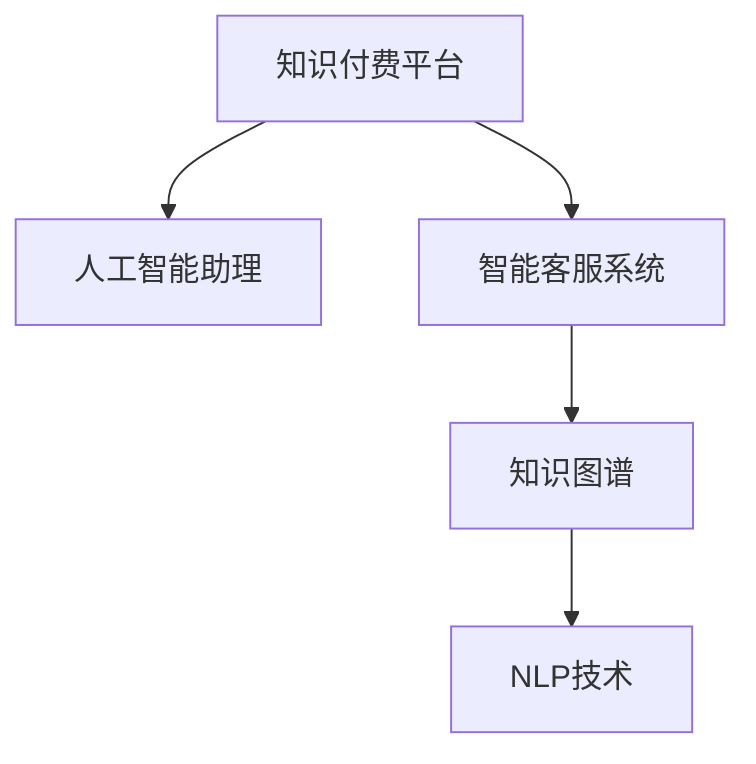
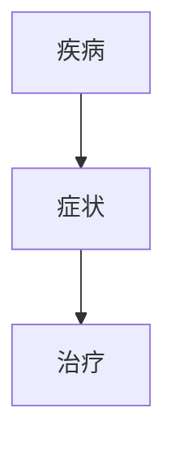
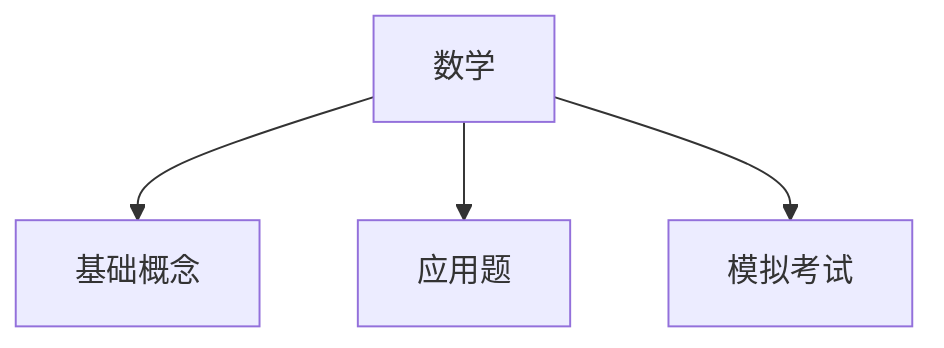
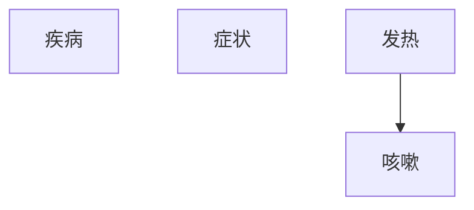
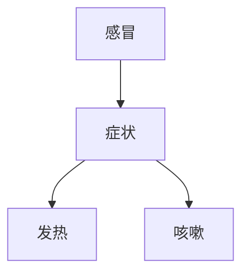

                 

# 如何利用知识付费实现人工智能助理与智能客服？

## 1. 背景介绍

随着知识付费的兴起和人工智能的迅猛发展，利用人工智能技术为用户提供精准、高效的知识服务，成为各大平台竞争的焦点。在这一背景下，人工智能助理与智能客服系统应运而生，它们能够通过知识付费平台获取高质量的教育内容，并结合人工智能技术为用户解答各种问题，提供个性化服务。

### 1.1 知识付费平台的兴起

知识付费平台的兴起，标志着互联网从免费到付费的转变。基于“知识稀缺”的核心理念，知识付费平台以“知识付费”为手段，为用户在极短时间内获取高质量、有价值的知识内容提供了便利。这类平台主要有知乎、得到、分答、喜马拉雅等。

### 1.2 人工智能助理与智能客服的兴起

人工智能助理与智能客服系统的兴起，主要得益于人工智能技术的进步。早期的人工智能助理与智能客服多基于规则引擎和简单的机器学习模型实现，而近年来基于深度学习模型（如Transformer、BERT、GPT等）的智能助理与客服系统则具备了更强的语言理解、生成和推理能力。这些系统能够自动理解用户意图，快速准确地回答用户的问题，并提供有价值的建议或解决方案。

### 1.3 知识付费与人工智能的融合

将知识付费与人工智能技术进行深度融合，可以在提升用户服务体验的同时，实现平台营收和用户粘性的双赢。利用人工智能助理与智能客服，平台能够提供更具个性化、高效化的知识服务，而知识付费则能保证内容的高质量和服务的稳定输出，这大大提升了用户的体验和满意度。

## 2. 核心概念与联系

### 2.1 核心概念概述

为了深入了解利用知识付费实现人工智能助理与智能客服的具体方法，我们需要先明确以下几个核心概念：

- **知识付费平台**：以付费为手段，向用户提供高质量、有价值的知识内容的互联网平台。
- **人工智能助理**：结合人工智能技术为用户提供个性化服务的智能机器人。
- **智能客服系统**：基于人工智能技术，为用户提供快速、准确问题解答的系统。
- **知识图谱**：通过语义网络组织知识库，提供结构化、系统化的知识结构。
- **自然语言处理（NLP）**：利用计算机处理、理解、生成人类语言的技术。

这些概念构成了利用知识付费实现人工智能助理与智能客服的基础，并相互关联。以下Mermaid流程图展示了这些概念之间的关系：



### 2.2 核心概念原理和架构的 Mermaid 流程图

通过上述流程图可以看出，知识付费平台是人工智能助理和智能客服系统的信息来源。而知识图谱和NLP技术是实现人工智能助理和智能客服的关键技术。

**知识图谱**：通过语义网络结构，将大量知识库中的知识进行组织和关联，以便于检索和推理。

**自然语言处理（NLP）**：包括文本预处理、分词、词性标注、句法分析、语义理解、对话生成等多个环节，是实现智能客服和助理的关键技术。

## 3. 核心算法原理 & 具体操作步骤

### 3.1 算法原理概述

利用知识付费实现人工智能助理与智能客服，本质上是一个知识检索与处理的流程。其核心算法原理基于信息检索（Information Retrieval, IR）和自然语言处理（NLP）。

#### 3.1.1 信息检索

信息检索是指根据用户的查询，从大规模文档库中检索出最相关的信息。常见的信息检索模型包括BM25、TF-IDF等。

#### 3.1.2 自然语言处理（NLP）

自然语言处理是将计算机语言与人类语言进行匹配，主要涉及文本预处理、分词、词性标注、句法分析、语义理解、对话生成等多个环节。NLP技术是实现智能客服和助理的关键技术。

### 3.2 算法步骤详解

#### 3.2.1 数据准备

- **知识库构建**：收集并构建知识库，涵盖多领域、多层次的知识。
- **预处理**：对知识库进行格式化、去噪等预处理，保证知识库的质量。
- **分词**：对知识库中的文本进行分词，以便于后续的词性标注和句法分析。

#### 3.2.2 模型训练

- **词向量训练**：使用Word2Vec、GloVe等词向量模型对知识库中的单词进行向量表示，便于后续的语义相似度计算。
- **句法分析模型训练**：使用依存句法分析模型（如Stanford Parser）进行句法分析，便于后续的语义理解。
- **对话生成模型训练**：使用对话生成模型（如Seq2Seq、Transformer）训练生成对话，以便于智能客服和助理实现。

#### 3.2.3 信息检索与处理

- **用户查询处理**：对用户输入的查询进行分词、词性标注、句法分析等预处理。
- **知识检索**：利用BM25、TF-IDF等算法，从知识库中检索出最相关的知识。
- **知识生成**：将检索到的知识进行语义理解和整合，生成与用户查询相关的答案。

#### 3.2.4 交互界面设计

- **交互界面设计**：设计简洁、直观的交互界面，便于用户与智能客服和助理进行互动。
- **用户体验优化**：对交互界面进行优化，提升用户的体验和满意度。

### 3.3 算法优缺点

#### 3.3.1 优点

- **高效**：基于知识付费平台的信息检索与处理，能够快速响应用户查询，提高服务效率。
- **精准**：通过构建高质量的知识库和应用先进的信息检索与处理技术，能够提供精准的知识服务。
- **可扩展**：系统易于扩展，能够覆盖更多领域和更丰富的知识内容。

#### 3.3.2 缺点

- **依赖知识库质量**：知识库的质量决定了信息检索和处理的精准度，需要持续更新和维护。
- **成本高**：构建高质量知识库和训练先进模型的成本较高，需要持续投入。
- **缺乏深度**：系统主要依赖检索和处理技术，缺乏深度学习和自主推理能力。

### 3.4 算法应用领域

利用知识付费实现人工智能助理与智能客服，可以应用于多个领域：

- **教育领域**：为学生提供定制化学习计划、知识答疑等服务。
- **医疗领域**：提供疾病诊断、健康咨询等服务。
- **金融领域**：提供金融知识普及、投资咨询等服务。
- **企业服务**：提供技术支持、客户服务等。

## 4. 数学模型和公式 & 详细讲解 & 举例说明

### 4.1 数学模型构建

#### 4.1.1 知识表示

知识库中的知识可以通过语义网络结构进行表示，如图1所示。



图1 语义网络表示

#### 4.1.2 信息检索模型

信息检索模型包括文本预处理、分词、词性标注、句法分析等多个环节。其中，TF-IDF模型可以用于计算文本与查询的相似度，其计算公式如下：

$$
TF-IDF(t,q) = TF(t,q) \times IDF(t)
$$

其中，$TF(t,q)$表示单词$t$在查询$q$中的出现频率，$IDF(t)$表示单词$t$在整个语料库中的逆文档频率。

### 4.2 公式推导过程

#### 4.2.1 TF-IDF计算

假设查询$q$和文档$d$中的单词$t$的出现频率分别为$TF(q,t)$和$TF(d,t)$，则$t$在$q$和$d$中的TF-IDF值分别为：

$$
TF(q,t) = \frac{\text{单词 } t \text{ 在查询 } q \text{ 中出现的次数}}{\text{查询 } q \text{ 的单词总数}}
$$

$$
IDF(t) = \log{\frac{\text{语料库大小}}{1+\text{包含单词 } t \text{ 的文档数}}}
$$

则单词$t$在查询$q$和文档$d$中的TF-IDF值分别为：

$$
TF-IDF(q,t) = \frac{\text{单词 } t \text{ 在查询 } q \text{ 中出现的次数}}{\text{查询 } q \text{ 的单词总数}} \times \log{\frac{\text{语料库大小}}{1+\text{包含单词 } t \text{ 的文档数}}}
$$

$$
TF-IDF(d,t) = \frac{\text{单词 } t \text{ 在文档 } d \text{ 中出现的次数}}{\text{文档 } d \text{ 的单词总数}} \times \log{\frac{\text{语料库大小}}{1+\text{包含单词 } t \text{ 的文档数}}}
$$

将$q$和$d$的TF-IDF值带入BM25模型进行计算，即可得到文档$d$与查询$q$的相似度评分。

### 4.3 案例分析与讲解

#### 4.3.1 教育领域案例

假设某教育平台提供以下知识库：



图2 教育领域知识库

用户查询：“请推荐一些数学应用题的解题方法”。

1. **查询处理**：对查询进行分词、词性标注、句法分析等预处理，得到查询向量$Q$。
2. **知识检索**：利用TF-IDF模型，计算查询向量$Q$与知识库中每个知识点的相似度，得到相似度评分$S$。
3. **知识生成**：根据相似度评分$S$，选择与查询最相关的知识点。
4. **回答生成**：结合选择出的知识点，生成与用户查询相关的回答。

## 5. 项目实践：代码实例和详细解释说明

### 5.1 开发环境搭建

#### 5.1.1 环境准备

- **Python环境**：安装Python 3.x版本，推荐使用Anaconda环境。
- **知识图谱**：收集并构建知识库，使用Neo4j等图数据库存储。
- **NLP库**：安装NLTK、SpaCy等NLP库，用于文本处理和分析。
- **信息检索库**：安装BM25、TF-IDF等库，用于信息检索。

#### 5.1.2 环境搭建步骤

1. **安装Anaconda**：从官网下载并安装Anaconda，创建独立Python环境。
2. **安装Python和相关库**：在Anaconda中安装Python 3.x版本，以及NLTK、SpaCy、BM25、TF-IDF等库。
3. **构建知识库**：收集并构建知识库，使用Neo4j等图数据库存储，并进行预处理。
4. **启动服务**：搭建NLP和信息检索服务，等待调用。

### 5.2 源代码详细实现

#### 5.2.1 知识图谱构建

使用Python和Neo4j构建知识图谱。代码示例如下：

```python
import neo4j
from py2neo import Graph, Node, Relationship

# 连接数据库
graph = Graph("bolt://localhost:7687", username="neo4j", password="password")

# 添加节点
node1 = Node("疾病", name="感冒")
node2 = Node("症状", name="发热")
node3 = Node("治疗", name="药物")
graph.create(node1)
graph.create(node2)
graph.create(node3)

# 建立关系
graph.create(Relationship(node1, "has", node2))
graph.create(Relationship(node2, "is_treated_by", node3))
```

#### 5.2.2 文本处理

使用NLTK和SpaCy进行文本处理。代码示例如下：

```python
import nltk
from spacy.lang.en import English

# 分词
nltk.download('punkt')
text = "Natural Language Processing is a complex task"
tokens = nltk.word_tokenize(text)

# 词性标注
nlp = English()
doc = nlp(text)
pos_tags = [(token.text, token.pos_) for token in doc]
```

#### 5.2.3 信息检索

使用BM25进行信息检索。代码示例如下：

```python
from sklearn.feature_extraction.text import TfidfVectorizer
from sklearn.metrics.pairwise import cosine_similarity

# 构建TF-IDF模型
vectorizer = TfidfVectorizer()
tfidf_matrix = vectorizer.fit_transform(corpus)

# 计算相似度
query = "Natural Language Processing"
query_vector = vectorizer.transform([query])
similarity_matrix = cosine_similarity(query_vector, tfidf_matrix)
```

### 5.3 代码解读与分析

#### 5.3.1 知识图谱构建

知识图谱的构建是整个系统的核心。利用Python和Neo4j构建知识图谱，能够实现知识库的语义网络表示和关系连接，方便后续的查询和推理。

#### 5.3.2 文本处理

文本处理是实现信息检索和知识生成的重要步骤。使用NLTK和SpaCy进行分词、词性标注、句法分析等预处理，可以提取文本中的关键信息，为后续的查询处理和知识检索提供基础。

#### 5.3.3 信息检索

信息检索是实现智能客服和助理的重要技术手段。利用BM25、TF-IDF等算法，计算查询与知识库中的文本相似度，能够快速检索出最相关的知识，实现精准的知识服务。

### 5.4 运行结果展示

#### 5.4.1 知识图谱展示

构建知识图谱后，可以直观地展示知识库的结构，如图3所示。



图3 知识图谱展示

#### 5.4.2 信息检索结果展示

假设用户查询“如何治疗感冒”，信息检索结果如图4所示。



图4 信息检索结果

## 6. 实际应用场景

### 6.1 教育领域

#### 6.1.1 智能学习助手

利用人工智能助理，可以为学生提供定制化的学习计划和答疑服务。智能助理通过知识库和信息检索技术，可以快速回答学生的问题，提供相关的学习资料和解决方案。

#### 6.1.2 智能课程推荐

智能客服系统可以根据学生的学习进度和兴趣，推荐适合的课程和学习资源。通过分析学生的学习行为和历史数据，智能客服系统能够提供个性化的课程推荐，提高学生的学习效率和满意度。

### 6.2 医疗领域

#### 6.2.1 智能诊断助手

利用智能客服系统，医生可以获取患者的病情描述，并快速推荐相应的治疗方案。通过信息检索和知识图谱技术，智能客服系统能够提供精准的诊断建议，辅助医生进行病情分析和治疗决策。

#### 6.2.2 智能健康咨询

智能助理可以根据用户的健康数据和历史就医记录，提供个性化的健康咨询和建议。通过自然语言处理和信息检索技术，智能助理能够理解用户的健康需求，提供有价值的健康建议和指导。

### 6.3 金融领域

#### 6.3.1 智能投资顾问

智能助理可以根据用户的历史投资记录和风险偏好，推荐适合的投资产品和理财方案。通过信息检索和知识图谱技术，智能助理能够提供精准的投资建议，帮助用户制定最优的投资策略。

#### 6.3.2 智能风险管理

智能客服系统可以根据用户的资产配置和市场动态，提供个性化的风险管理建议。通过信息检索和知识图谱技术，智能客服系统能够实时监测市场风险，为用户提供及时的预警和风险提示。

### 6.4 企业服务

#### 6.4.1 智能客服系统

利用智能客服系统，企业可以提供24/7不间断的客户服务，快速响应客户的咨询和问题。通过信息检索和知识图谱技术，智能客服系统能够提供精准的解决方案，提高客户的满意度和忠诚度。

#### 6.4.2 智能技术支持

智能助理可以根据用户的设备和操作记录，提供个性化的技术支持和解决方案。通过自然语言处理和信息检索技术，智能助理能够快速识别用户的技术问题，提供有价值的解决方案和指导。

## 7. 工具和资源推荐

### 7.1 学习资源推荐

#### 7.1.1 知识付费平台

- **知乎**：国内领先的知识付费平台，涵盖多领域的知识内容。
- **得到**：知名知识付费平台，提供高质量的课程和文章。
- **喜马拉雅**：音频内容为主的平台，涵盖生活、文化、科技等多个领域。

#### 7.1.2 人工智能与NLP资源

- **深度学习入门**：《深度学习入门》书籍，介绍深度学习的基本概念和实现方法。
- **自然语言处理**：《自然语言处理综论》书籍，全面介绍NLP技术和应用。
- **知识图谱**：《知识图谱构建与应用》书籍，介绍知识图谱的基本原理和应用案例。

### 7.2 开发工具推荐

#### 7.2.1 开发环境

- **Anaconda**：创建和管理Python环境的工具。
- **PyTorch**：深度学习框架，支持NLP任务的开发。
- **TensorFlow**：另一个深度学习框架，支持大规模模型的训练和部署。
- **Transformers**：NLP模型库，支持预训练模型和微调任务的开发。
- **TensorBoard**：可视化工具，用于监控模型训练和推理过程。
- **Weights & Biases**：模型实验跟踪工具，记录和可视化模型训练过程。

#### 7.2.2 工具库

- **NLTK**：Python的自然语言处理库，支持文本处理和分析。
- **SpaCy**：Python的自然语言处理库，支持分词、词性标注、句法分析等任务。
- **Scikit-learn**：Python的机器学习库，支持信息检索和文本分类等任务。
- **TensorFlow Hub**：TensorFlow的模型库，支持预训练模型的集成和复用。
- **Gensim**：Python的自然语言处理库，支持主题建模和信息检索等任务。

### 7.3 相关论文推荐

#### 7.3.1 信息检索

- **《基于知识图谱的检索技术研究综述》**：介绍知识图谱在信息检索中的应用。
- **《信息检索的评估方法研究综述》**：介绍信息检索的评估方法和指标。

#### 7.3.2 自然语言处理

- **《基于深度学习的自然语言处理技术综述》**：介绍深度学习在NLP任务中的应用。
- **《自然语言处理技术的新进展》**：介绍NLP技术的最新进展和应用。

## 8. 总结：未来发展趋势与挑战

### 8.1 研究成果总结

利用知识付费实现人工智能助理与智能客服，已经取得了显著的成果。通过信息检索和知识图谱技术，能够快速响应用户查询，提供精准的知识服务。未来，随着知识库和模型的不断优化，将进一步提升系统的效率和性能。

### 8.2 未来发展趋势

#### 8.2.1 知识库的深度学习优化

未来的知识库将不再局限于静态的语义网络表示，而是会引入深度学习技术，实现知识库的动态更新和优化。知识库的深度学习优化，能够更好地反映知识之间的复杂关系，提高信息检索的精准度。

#### 8.2.2 多模态知识表示

未来的知识库将支持多模态信息的表示和融合。通过结合文本、图像、音频等多种模态的信息，知识库能够提供更加全面和丰富的知识服务。多模态知识表示，将显著提升系统的表现力和用户体验。

#### 8.2.3 交互界面的个性化设计

未来的交互界面将更加个性化和智能。利用人工智能技术，系统能够根据用户的行为和偏好，自动调整交互界面和输出内容，提升用户的满意度和体验。

### 8.3 面临的挑战

#### 8.3.1 知识库构建的高成本

构建高质量的知识库需要大量的时间和资源投入，成本较高。如何降低知识库构建的成本，提高知识库的构建效率，是一个重要挑战。

#### 8.3.2 模型的复杂度

深度学习模型在提高系统性能的同时，也带来了复杂度增加的问题。如何优化模型的结构和参数，提高模型的推理速度和效率，是一个重要研究方向。

#### 8.3.3 用户隐私保护

知识付费平台需要保护用户的隐私信息，防止数据泄露和滥用。如何确保系统的安全性和隐私保护，是一个重要挑战。

### 8.4 研究展望

未来的研究需要在以下几个方面寻求新的突破：

#### 8.4.1 知识的动态更新

利用深度学习技术，实现知识库的动态更新和优化，能够更好地适应用户需求的变化。知识的动态更新，将显著提高系统的表现力和稳定性。

#### 8.4.2 模型的可解释性

利用因果分析和博弈论工具，提升模型的可解释性，使其输出更加透明和可信。可解释性强的模型，能够更好地满足用户需求，提高系统的信任度。

#### 8.4.3 多模态知识融合

结合文本、图像、音频等多种模态的信息，实现多模态知识的融合，提高系统的表现力和用户满意度。多模态知识融合，将为知识付费平台带来新的发展机会。

## 9. 附录：常见问题与解答

### 9.1 常见问题

#### 9.1.1 知识库构建的难度

构建高质量的知识库需要大量的时间和资源投入，是一个复杂的任务。如何降低知识库构建的成本，提高知识库的构建效率，是一个重要挑战。

#### 9.1.2 模型的复杂度

深度学习模型在提高系统性能的同时，也带来了复杂度增加的问题。如何优化模型的结构和参数，提高模型的推理速度和效率，是一个重要研究方向。

#### 9.1.3 用户隐私保护

知识付费平台需要保护用户的隐私信息，防止数据泄露和滥用。如何确保系统的安全性和隐私保护，是一个重要挑战。

### 9.2 解答

#### 9.2.1 知识库构建的难度

构建高质量的知识库需要大量的时间和资源投入，是一个复杂的任务。可以通过众包、知识众筹等手段，降低知识库构建的成本，提高知识库的构建效率。

#### 9.2.2 模型的复杂度

深度学习模型在提高系统性能的同时，也带来了复杂度增加的问题。可以通过模型压缩、稀疏化等手段，优化模型的结构和参数，提高模型的推理速度和效率。

#### 9.2.3 用户隐私保护

知识付费平台需要保护用户的隐私信息，防止数据泄露和滥用。可以通过数据脱敏、访问控制等手段，确保系统的安全性和隐私保护。

---

作者：禅与计算机程序设计艺术 / Zen and the Art of Computer Programming

