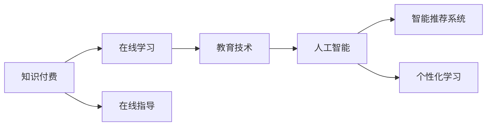

                 

# 如何利用知识付费实现在线学习与在线学习指导？

> 关键词：知识付费,在线学习,在线指导,教育技术,人工智能,智能推荐,个性化学习,智能导师

## 1. 背景介绍

在互联网和信息技术迅速发展的当下，在线教育和知识付费已经成为教育领域的重要趋势。特别是新冠疫情爆发以来，“宅在家也能学习”的理念深入人心，使得在线教育市场迅速扩展。知识付费则通过付费订阅、按需付费等形式，为用户提供更加丰富、优质的知识内容，满足人们对于终身学习、快速提升的需求。

利用知识付费实现在线学习与在线学习指导，是教育技术发展的新方向。通过知识付费平台，用户可以按需获取知识，按照自身进度安排学习计划，并获得专业的在线指导，从而提升学习效率。对于教育机构和知识提供者来说，知识付费也提供了一个更加精准、高效的变现方式，实现了知识共享和价值最大化。

本文将从核心概念、算法原理、操作步骤、数学模型等方面，详细探讨如何利用知识付费实现在线学习与在线学习指导。

## 2. 核心概念与联系

### 2.1 核心概念概述

为了更好地理解这一范式，我们将介绍几个关键的概念和它们之间的联系：

- **知识付费**：通过付费方式获取特定知识和服务的模式，旨在提供更加优质、专业的内容。常见的形式包括在线课程、直播讲座、书籍订阅等。
- **在线学习**：通过互联网和相关技术，利用视频、文字、互动工具等进行的学习活动。在线学习打破了时间和空间的限制，使学习变得更加灵活便捷。
- **在线指导**：在线指导是指通过AI技术、实时互动等方式，为学习者提供个性化的学习建议、答疑解惑、指导反馈等。在线指导可以提升学习效果，加速知识内化。
- **教育技术**：利用信息技术对教育方式、内容、过程、资源进行创新改造，提升教育质量和效率。
- **人工智能(AI)**：通过算法、模型等技术，使计算机系统具备类人智能，从而实现自动推理、自主学习等功能。
- **智能推荐系统**：根据用户行为、兴趣、历史记录等，智能推荐符合用户需求的内容和资源，提升用户满意度和使用体验。
- **个性化学习**：根据用户的学习习惯、知识背景、学习目标等，提供量身定制的学习方案和内容，满足个性化需求。

这些概念之间的联系可以通过以下Mermaid流程图来展示：



这个流程图展示了知识付费、在线学习、在线指导与教育技术、人工智能、智能推荐系统、个性化学习之间的内在联系和相互作用。

## 3. 核心算法原理 & 具体操作步骤

### 3.1 算法原理概述

利用知识付费实现在线学习与在线学习指导，本质上是通过AI技术和大数据分析，对用户需求进行精准分析和推荐，提供个性化内容和服务。这一过程包括以下几个关键步骤：

1. **用户画像构建**：通过分析用户的学习行为、兴趣偏好、历史记录等，构建用户画像，以便精准推荐内容。
2. **内容推荐算法**：根据用户画像和内容特征，利用协同过滤、内容推荐、深度学习等算法，智能推荐符合用户需求的内容。
3. **学习路径规划**：根据用户的初始知识水平和目标，规划个性化的学习路径和课程，确保学习效率和效果。
4. **在线指导与反馈**：通过AI技术，实时监控用户学习状态，提供个性化的指导和反馈，帮助用户克服学习障碍，提升学习成效。

### 3.2 算法步骤详解

以下是详细的算法步骤：

**Step 1: 用户画像构建**

用户画像的构建是整个推荐系统的基础。其主要包括：

- **数据收集**：收集用户的历史学习记录、浏览行为、兴趣偏好、社交媒体信息等，形成用户特征向量。
- **特征工程**：对收集到的数据进行特征提取、降维、编码等处理，以便算法使用。
- **模型训练**：使用机器学习模型（如KNN、决策树、随机森林等）训练用户画像模型。

**Step 2: 内容推荐算法**

内容推荐算法是实现精准推荐的关键。其主要包括：

- **协同过滤算法**：通过分析用户与内容的交互记录，找出兴趣相似的用户和内容，进行推荐。
- **内容推荐算法**：根据内容的特征（如关键词、标签、作者等）进行推荐。
- **深度学习推荐算法**：使用神经网络模型（如CNN、RNN、Transformer等）进行推荐，具备更好的泛化能力和效果。

**Step 3: 学习路径规划**

学习路径规划需要根据用户的学习目标和当前知识水平，设计个性化的学习路径。其主要包括：

- **需求分析**：通过用户问卷、互动工具等方式，收集用户的学习目标和需求。
- **内容匹配**：根据学习目标和需求，匹配合适的学习内容和路径。
- **路径优化**：根据用户的学习进度和反馈，动态调整学习路径，确保学习效果。

**Step 4: 在线指导与反馈**

在线指导与反馈是提升学习效果的关键环节。其主要包括：

- **状态监控**：实时监控用户的学习进度和状态，检测学习障碍和问题。
- **智能导师**：使用AI技术（如NLP、图像识别等），提供实时答疑和指导，帮助用户解决学习问题。
- **反馈机制**：收集用户的学习反馈和评价，优化学习路径和内容。

### 3.3 算法优缺点

利用知识付费实现在线学习与在线学习指导，具有以下优点：

1. **个性化推荐**：通过数据分析和AI技术，提供精准的内容推荐，满足个性化需求。
2. **学习效率高**：根据用户的学习目标和进度，规划个性化的学习路径，提升学习效率。
3. **实时指导**：通过AI技术，实时提供学习指导和反馈，帮助用户克服学习障碍。
4. **交互性强**：用户可以通过在线互动工具与导师、同学等进行交流，增强学习体验。

同时，也存在一些缺点：

1. **数据隐私问题**：用户的学习数据可能包含隐私信息，需要严格保护数据安全和隐私。
2. **推荐准确性**：推荐算法可能存在误差，导致推荐内容不够精准。
3. **技术门槛高**：需要一定的技术背景和专业知识，才能开发和维护推荐系统。
4. **成本高**：高质量的AI技术和个性化服务，需要较高的投入成本。

## 4. 数学模型和公式 & 详细讲解 & 举例说明

### 4.1 数学模型构建

在线学习与在线指导的数学模型构建，主要涉及以下几个方面：

- **用户画像模型**：通过用户行为数据，构建用户画像模型，如用户兴趣模型、用户行为模型等。
- **内容推荐模型**：通过内容特征和用户画像，构建推荐模型，如协同过滤模型、内容推荐模型、深度学习模型等。
- **学习路径规划模型**：根据用户的学习目标和内容特征，规划学习路径模型，如线性规划模型、图模型等。
- **在线指导与反馈模型**：实时监控学习状态，提供个性化指导和反馈，如基于时间序列的预测模型、基于文本的情感分析模型等。

### 4.2 公式推导过程

以协同过滤算法为例，公式推导过程如下：

- **相似度计算**：计算用户u和v的相似度，使用余弦相似度公式：
  $$
  similarity(u, v) = \frac{\sum_{i=1}^n u_i v_i}{\sqrt{\sum_{i=1}^n u_i^2} \sqrt{\sum_{i=1}^n v_i^2}}
  $$

- **推荐计算**：根据相似度计算结果，为用户u推荐物品i：
  $$
  rank_i(u) = \sum_{v \in U} similarity(u, v) \times rating_v(i)
  $$

其中，U为用户集合，$rating_v(i)$为v对物品i的评分。

### 4.3 案例分析与讲解

假设有一个在线课程平台，用户A喜欢数据分析和机器学习，但是对自然语言处理不太熟悉。通过协同过滤算法，我们可以推荐一些与数据分析和机器学习相关的课程，同时向其推荐一些自然语言处理相关的入门课程。通过学习路径规划，可以为用户A规划一条从数据分析到机器学习再到自然语言处理的循序渐进的学习路径。在学习过程中，通过在线指导和反馈，帮助用户A克服学习障碍，提升学习成效。

## 5. 项目实践：代码实例和详细解释说明

### 5.1 开发环境搭建

在进行项目实践前，我们需要准备好开发环境。以下是Python环境搭建的详细步骤：

1. **安装Anaconda**：从官网下载并安装Anaconda，用于创建独立的Python环境。

2. **创建并激活虚拟环境**：
   ```bash
   conda create -n my_env python=3.8 
   conda activate my_env
   ```

3. **安装必要的Python库**：
   ```bash
   pip install numpy pandas scikit-learn tensorflow tensorflow-gpu transformers
   ```

4. **下载和安装预训练模型**：
   ```bash
   git clone https://github.com/huggingface/transformers.git
   cd transformers
   python setup.py develop
   ```

### 5.2 源代码详细实现

以下是一个简单的在线学习推荐系统的实现代码，包括用户画像构建、内容推荐、学习路径规划、在线指导与反馈等功能：

```python
import numpy as np
from sklearn.neighbors import NearestNeighbors
from sklearn.metrics.pairwise import cosine_similarity

# 用户画像构建
class UserProfile:
    def __init__(self, user_id):
        self.user_id = user_id
        self.interested_topics = []
        self.learned_topics = []
        self.interactions = {}

    def add_interaction(self, topic, score):
        self.interactions[topic] = score

    def add_learned_topic(self, topic):
        self.learned_topics.append(topic)

# 内容推荐
class ContentRecommendation:
    def __init__(self, topics):
        self.topics = topics
        self.similarity_matrix = self._calculate_similarity()

    def _calculate_similarity(self):
        similarity_matrix = np.zeros((len(self.topics), len(self.topics)))
        for i, topic_i in enumerate(self.topics):
            for j, topic_j in enumerate(self.topics):
                similarity_matrix[i, j] = cosine_similarity([topic_i], [topic_j])[0][0]
        return similarity_matrix

    def recommend_content(self, user, top_n=10):
        user_topics = [user.interactions[topic] for topic in self.topics if topic in user.interactions]
        similarity_scores = self.similarity_matrix[np.argsort(user_topics)[::-1]]
        return np.argsort(similarity_scores)[:top_n]

# 学习路径规划
class LearningPathPlanner:
    def __init__(self, user_profiles, contents):
        self.user_profiles = user_profiles
        self.contents = contents

    def plan_path(self, user, start_topic, end_topic):
        path = []
        current_topic = start_topic
        while current_topic != end_topic and len(path) < 10:
            recommended_topics = self._find_recommended_topics(current_topic)
            path.append(current_topic)
            current_topic = self._choose_next_topic(recommended_topics)
        return path

    def _find_recommended_topics(self, current_topic):
        recommended_topics = [topic for topic in self.contents if topic not in self.user_profiles[user].learned_topics]
        return [topic for topic, score in sorted(zip(recommended_topics, self._calculate_recommendation_scores(current_topic)), key=lambda x: x[1], reverse=True)

    def _calculate_recommendation_scores(self, current_topic):
        scores = {}
        for topic in self.contents:
            if topic not in self.user_profiles[user].learned_topics:
                scores[topic] = self._calculate_similarity(current_topic, topic)
        return scores

    def _choose_next_topic(self, recommended_topics):
        if recommended_topics:
            return recommended_topics[0]
        else:
            return None

# 在线指导与反馈
class OnlineTutor:
    def __init__(self, user_profiles, contents):
        self.user_profiles = user_profiles
        self.contents = contents

    def guide_user(self, user, current_topic):
        # 提供实时指导和反馈
        pass

# 主函数
def main():
    # 用户画像构建
    user1 = UserProfile("user1")
    user1.add_interaction("Data Science", 4)
    user1.add_interaction("Machine Learning", 5)
    user1.add_learned_topic("Data Science")

    # 内容推荐
    contents = ["Data Science", "Machine Learning", "Natural Language Processing", "Computer Vision"]
    recommender = ContentRecommendation(contents)
    recommended_topics = recommender.recommend_content(user1)
    print(f"Recommended topics for user1: {recommended_topics}")

    # 学习路径规划
    path_planner = LearningPathPlanner(user_profiles, contents)
    learning_path = path_planner.plan_path(user1, "Data Science", "Natural Language Processing")
    print(f"Learning path for user1: {learning_path}")

    # 在线指导与反馈
    tutor = OnlineTutor(user_profiles, contents)
    tutor.guide_user(user1, "Data Science")

if __name__ == "__main__":
    main()
```

### 5.3 代码解读与分析

以上代码实现了用户画像构建、内容推荐、学习路径规划、在线指导与反馈等关键功能。下面对代码进行详细解读：

- **UserProfile类**：用于构建用户画像，记录用户的兴趣和已学内容。
- **ContentRecommendation类**：使用余弦相似度计算内容推荐。
- **LearningPathPlanner类**：根据用户已学内容推荐学习路径。
- **OnlineTutor类**：提供实时指导和反馈。
- **main函数**：示例如何使用上述类进行用户画像构建、内容推荐、学习路径规划、在线指导与反馈。

## 6. 实际应用场景

### 6.1 在线课程平台

在线课程平台如Coursera、edX、Udemy等，已经广泛应用了知识付费和在线学习指导的范式。用户可以根据自己的需求和兴趣，选择合适的课程进行学习。平台通过分析用户的互动数据，推荐适合的课程和学习路径，并提供个性化的在线指导和答疑服务，从而提升学习效果。

### 6.2 企业培训系统

企业培训系统通过知识付费和在线学习指导，帮助员工快速掌握所需技能。系统根据员工的学习历史和岗位需求，推荐合适的培训课程和材料，并通过在线指导和反馈，帮助员工克服学习障碍，提升学习成效。

### 6.3 在线教育工具

在线教育工具如Khan Academy、Duolingo等，通过知识付费和在线学习指导，提供丰富的学习资源和个性化的学习方案。用户可以根据自己的学习进度和需求，随时调整学习计划，并获得在线指导和反馈，从而提高学习效率。

### 6.4 未来应用展望

未来，知识付费和在线学习指导的应用场景将更加广泛，涵盖更多垂直领域。例如：

- **医疗健康**：在线学习平台可以提供医学知识付费课程，帮助医学生和医生提升专业技能。
- **艺术设计**：在线课程平台可以提供设计类课程，帮助设计师提升设计水平。
- **金融投资**：在线教育工具可以提供金融投资类课程，帮助投资者提升投资能力。

## 7. 工具和资源推荐

### 7.1 学习资源推荐

为了帮助开发者系统掌握知识付费和在线学习指导的技术基础和实践技巧，这里推荐一些优质的学习资源：

1. **Coursera官方文档**：Coursera的官方文档，涵盖了平台的功能设计和推荐算法，提供了丰富的案例和示例代码。
2. **edX官方文档**：edX的官方文档，介绍了平台的推荐系统和在线指导功能，提供了详细的技术实现。
3. **Udemy官方文档**：Udemy的官方文档，介绍了平台的个性化推荐和用户画像构建技术，提供了实用的开发指南。
4. **《推荐系统实践》书籍**：该书系统介绍了推荐系统的理论和实践，提供了大量的代码示例和案例分析。
5. **《机器学习实战》书籍**：该书提供了丰富的机器学习实战案例，包括用户画像构建、协同过滤推荐等内容。

### 7.2 开发工具推荐

高效的开发离不开优秀的工具支持。以下是几款用于知识付费和在线学习指导开发的常用工具：

1. **TensorFlow**：由Google主导开发的深度学习框架，适合复杂的大规模机器学习项目。
2. **PyTorch**：由Facebook开发的深度学习框架，灵活动态的计算图，适合快速迭代研究。
3. **Scikit-learn**：Python的机器学习库，提供了丰富的机器学习算法和工具，适合快速开发和验证。
4. **Flask**：Python的Web框架，适合开发在线指导和反馈功能。
5. **Jupyter Notebook**：Python的交互式编程环境，适合开发和验证算法模型。

### 7.3 相关论文推荐

知识付费和在线学习指导的发展源于学界的持续研究。以下是几篇奠基性的相关论文，推荐阅读：

1. **《推荐系统》论文**：由AdaBoost作者Wang和Wang所写，系统介绍了推荐系统的理论基础和实践方法，奠定了推荐系统的研究方向。
2. **《协同过滤推荐算法》论文**：由Koren等人所写，介绍了协同过滤算法的理论基础和实现方法，提供了丰富的案例和实验结果。
3. **《基于深度学习的推荐系统》论文**：由He等人所写，介绍了深度学习在推荐系统中的应用，展示了深度学习算法的优越性和效果。
4. **《个性化学习系统》论文**：由Zhou等人所写，介绍了个性化学习系统的设计思路和实现方法，提供了丰富的系统设计和实验结果。

## 8. 总结：未来发展趋势与挑战

### 8.1 总结

本文详细探讨了如何利用知识付费实现在线学习与在线学习指导。首先阐述了知识付费和在线学习指导的研究背景和意义，明确了其在教育技术发展中的重要地位。其次，从核心概念、算法原理、操作步骤、数学模型等方面，详细讲解了知识付费和在线学习指导的实现方法。最后，展示了其广泛的应用场景和未来展望。

通过本文的系统梳理，可以看到，知识付费和在线学习指导的范式正在成为教育技术发展的新方向，极大地提升了学习的灵活性、高效性和个性化。未来，伴随技术的不断进步，知识付费和在线学习指导的应用将更加广泛和深入，推动教育公平和智能化。

### 8.2 未来发展趋势

展望未来，知识付费和在线学习指导的发展趋势如下：

1. **AI技术深化**：通过深度学习、强化学习等AI技术，提升推荐系统的精准性和智能化。
2. **多模态融合**：结合图像、视频、语音等多模态数据，提升学习效果和用户体验。
3. **实时性提升**：通过流式数据处理和大数据技术，实现实时推荐和在线指导。
4. **用户参与优化**：通过用户反馈和行为数据，优化推荐算法和指导策略。
5. **跨领域应用拓展**：从教育领域扩展到更多垂直领域，如医疗、金融等。

### 8.3 面临的挑战

尽管知识付费和在线学习指导取得了显著进展，但在迈向更加智能化、普适化应用的过程中，仍面临诸多挑战：

1. **数据隐私问题**：用户的学习数据可能包含隐私信息，需要严格保护数据安全和隐私。
2. **推荐准确性**：推荐算法可能存在误差，导致推荐内容不够精准。
3. **技术门槛高**：需要一定的技术背景和专业知识，才能开发和维护推荐系统。
4. **成本高**：高质量的AI技术和个性化服务，需要较高的投入成本。
5. **用户体验**：系统界面和交互设计需要不断优化，提升用户体验和满意度。

### 8.4 研究展望

未来，知识付费和在线学习指导的研究将在以下几个方向寻求新的突破：

1. **跨领域推荐**：结合不同领域的知识图谱和规则，进行跨领域推荐，提升推荐系统的普适性。
2. **多任务学习**：结合多任务学习，提升推荐系统和在线指导系统的综合性能。
3. **深度学习**：通过深度学习技术，提升推荐系统的精准性和智能化。
4. **可解释性**：通过可解释性技术，提升推荐系统和在线指导系统的透明性和可信度。

总之，知识付费和在线学习指导需要不断优化算法、提升技术、完善用户体验，才能更好地服务于用户，推动教育技术的发展。

## 9. 附录：常见问题与解答

**Q1：知识付费平台如何确保数据隐私？**

A: 知识付费平台通过以下措施确保数据隐私：
1. 数据匿名化：对用户数据进行匿名化处理，去除个人身份信息。
2. 数据加密：采用加密技术保护数据传输和存储的安全性。
3. 数据访问控制：严格控制数据访问权限，只有授权人员才能访问敏感数据。
4. 隐私保护政策：制定明确的隐私保护政策，告知用户数据使用和保护方式。

**Q2：推荐算法的误差如何控制？**

A: 推荐算法的误差主要通过以下方法控制：
1. 数据清洗：对数据进行清洗，去除噪声和异常值。
2. 特征选择：选择有意义的特征进行模型训练，避免冗余和无关信息。
3. 模型优化：优化模型参数和超参数，提升模型精准度。
4. 模型验证：在独立的测试集上验证模型效果，调整模型参数。

**Q3：技术门槛高的问题如何解决？**

A: 技术门槛高的问题可以通过以下方法解决：
1. 培训和教育：提供相关的培训和教育资源，帮助开发者提升技术水平。
2. 开源项目：推广和利用开源项目，降低开发门槛。
3. 团队合作：组建跨学科团队，提升技术实力。
4. 工具支持：使用易用的开发工具和框架，降低技术难度。

**Q4：如何提升用户体验？**

A: 提升用户体验可以通过以下方法实现：
1. 界面设计：优化界面设计，提升用户体验。
2. 交互设计：提供流畅的交互体验，减少用户操作步骤。
3. 个性化推荐：根据用户需求提供个性化的推荐和服务。
4. 实时反馈：及时响应用户反馈，优化系统功能。

总之，知识付费和在线学习指导需要不断优化算法、提升技术、完善用户体验，才能更好地服务于用户，推动教育技术的发展。

---

作者：禅与计算机程序设计艺术 / Zen and the Art of Computer Programming

